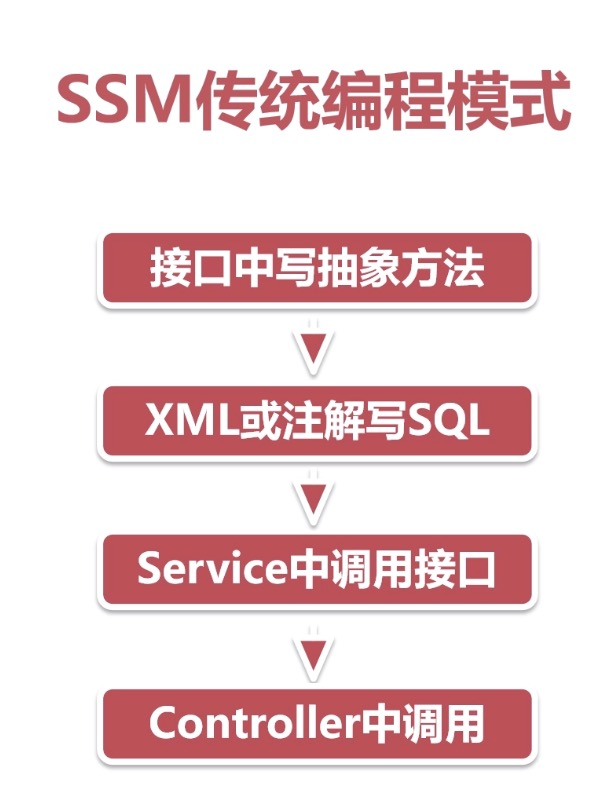

# Mybatis-Plus

## 特性

+ 无侵入、损耗小、强大的CURD操作
+ 支持Lambda形式调用、支持多种数据库
+ 支持主键自动生成、支持ActiveRecord模式

## 快速开始

一些准备工作

```sql
create table user(
	id bigint primary key not null comment '主键',
    name varchar(30) default null comment '姓名',
    age int(11) default null comment '年龄',
    email varchar(50) default null comment '邮箱',
    manager_id bigint(20) default null comment '直属上级id',
    create_time datetime default null comment '创建时间',
    constraint manager_fk foreign key(manager_id)
    references user(id)
)engine =innoDB charset = utf8;
```

```sql
insert into user(id, name, age, email, manager_id, create_time)
values(111, 'boss', 40, 'boss@baomidou.com', null, '2019-01-11 14:20:20'),
(222, '王天风', 25, 'wangtianfeng@baomidou.com', 111, '2019-02-11 14:20:20'),
(333, '李艺伟', 28, 'lyw@baomidou.com', 222, '2019-03-11 14:20:20'),
(444, '张雨绮', 31, 'zjq@baomidou.com', 222, '2019-04-11 14:20:20'),
(555, '刘红雨', 32, 'lhm@baomidou.com', 222, '2019-05-11 14:20:20');
```

依赖

````xml
<!-- 修改为mybatis-plus -->
<dependency>
  <groupId>com.baomidou</groupId>
  <artifactId>mybatis-plus-boot-starter</artifactId>
  <version>3.2.0</version>
</dependency>
<!--mysql-->
<dependency>
  <groupId>mysql</groupId>
  <artifactId>mysql-connector-java</artifactId>
</dependency>
<!-- 配置数据源 -->
<dependency>
  <groupId>com.alibaba</groupId>
  <artifactId>druid-spring-boot-starter</artifactId>
  <version>1.1.9</version>
</dependency>
````

配置

```yml
spring:
  application:
    name: server-job-wanted #此实例注册到eureka服务端的name
  datasource:
    name: mysql_test
    type: com.alibaba.druid.pool.DruidDataSource
    # druid相关配置
    druid:
      # 监控统计拦截的filters
      filters: stat
      driver-class-name: com.mysql.cj.jdbc.Driver
      # 基本属性
      url: jdbc:mysql://127.0.0.1:3306/innoDB?useUnicode=true&characterEncoding=UTF-8&allowMultiQueries=true
      username: root
      password: root
      # 配置初始化大小/最小/最大
      initial-size: 1
      min-idle: 1
      max-active: 20
      # 获取连接等待超时时间
      max-wait: 60000
      # 间隔多久进行一次检测，检测需要关闭的空闲连接
      time-between-eviction-runs-millis: 60000
      # 一个连接在池中最小生存的时间
      min-evictable-idle-time-millis: 300000
      validation-query: SELECT 'x'
      test-while-idle: true
      test-on-borrow: false
      test-on-return: false
      # 打开PSCache，并指定每个连接上PSCache的大小。oracle设为true，mysql设为false。分库分表较多推荐设置为false
      pool-prepared-statements: false
      max-pool-prepared-statement-per-connection-size: 20
```

实体类

````java
@Data
public class User {

    private Long id;

    private String name;

    private int age;

    private String email;

    private Long managerId;

    private LocalDateTime createTime;
}
````

启动类加入mappersacn

````java
SpringBootApplication
@MapperScan("com.baomidou.mybatisplus.samples.quickstart.mapper")
public class Application {

    public static void main(String[] args) {
        SpringApplication.run(QuickStartApplication.class, args);
    }

}
````


测试

````java
@Test
public void contextLoads() {
  List<User> users = userMapper.selectList(null);
  // 使用断言判断个数是否正确
  Assert.assertEquals(5, users.size());
  users.forEach(System.out::println);
}
````

注意：使用最新版本`3.2.0`的时候，如果字段属性是`LocalDateTime`会报错，这时需要把字段修改为`Date`，**LocalDateTime是Java8里面新出来了一些API，LocalDate、LocalTime、LocalDateTime ，但是在默认的情况下，在mybatis里面不支持java8的时间、日期**，可以通过降级成`3.1.0`也可以完成查询。还有其他方法，以后研究。

## 基本使用

传统mybatis开发的时候一般如下图。



#### 通用Mapper

##### 新增

增加日志输出：

````yml
logging:
  level:
    root: warn
    com.px.mapper : trace # trace是最低的日志输出级别
````

创建通用Mapper

````java
public interface UserMapper extends BaseMapper<User> {
}
````

测试

```java
@Test
public void testInsert() {
  User user = new User();
  user.setName("刘明湘");
  user.setAge(24);
  user.setManagerId(222l);
  user.setCreateTime(LocalDateTime.now());
  // 返回影响记录数
  int row = userMapper.insert(user);
  System.out.println("影响记录数：" + row);
}
```

````java
2019-10-20 09:45:10.223 DEBUG 972 --- [           main] com.px.mapper.UserMapper.insert          : ==>  Preparing: INSERT INTO user ( id, create_time, name, manager_id, age ) VALUES ( ?, ?, ?, ?, ? ) 
2019-10-20 09:45:10.253 DEBUG 972 --- [           main] com.px.mapper.UserMapper.insert          : ==> Parameters: 1185733664814804993(Long), 2019-10-20T09:45:10.174(LocalDateTime), 刘明湘(String), 222(Long), 24(Integer)
2019-10-20 09:45:10.260 DEBUG 972 --- [           main] com.px.mapper.UserMapper.insert          : <==    Updates: 1
````

查看数据库插入成功

##### 通用注解

`@TableName`

实体类对应的表名可以用这个修饰在实体类上指定。

`@TableId`

mybatis-plus默认找主键的实体类属性是id，上面的测试我们没有提供主键的字段信息，它却能自己插入自增的数据就是这个道理。但是如果我们的主键是`user_id`，那么它就不能识别主键，可以使用``@TableId``修饰在主键字段上就可以。**需要在注解里面指定id的数据库字段名：`@TableId(value = "user_id")`**

`@TableField("xxx")`

实体属性名对应数据库里面的字段名

##### 排除非表字段的三种方式

保存临时数据或者临时组装的数据

+ 使用`transient`修饰字段，但是不能在网络通信中使用，因为不能被序列化。

  ````java
  private transient String remark;
  ````

  

+ 使用`static`修饰字段，需要get和set方法，因为`lombok`不能对`static`进行get/set创建

  ```java
  private static String remark;
  
  public static String getRemark() {
    return remark;
  }
  
  public static void setRemark(String remark) {
    User.remark = remark;
  }
  ```

  

+ 推荐使用注解`@TableFile(exist = false)`修饰字段

  ````java
  @TableField(exist = false)
  private String remark;
  ````

  

## Mybatis-Plus查询方法

#### 1.普通查询

##### 单条查询

````java
// 查询单条记录
@Test
public void selectById() {
  User user = this.userMapper.selectById(111L);
  System.out.println(user);
}
````

````java
2019-10-20 10:41:31.059 DEBUG 1891 --- [           main] com.px.mapper.UserMapper.selectById      : ==>  Preparing: SELECT user_id,create_time,name,manager_id,email,age FROM user WHERE user_id=? 
2019-10-20 10:41:31.090 DEBUG 1891 --- [           main] com.px.mapper.UserMapper.selectById      : ==> Parameters: 111(Long)
2019-10-20 10:41:31.105 TRACE 1891 --- [           main] com.px.mapper.UserMapper.selectById      : <==    Columns: user_id, create_time, name, manager_id, email, age
2019-10-20 10:41:31.106 TRACE 1891 --- [           main] com.px.mapper.UserMapper.selectById      : <==        Row: 111, 2019-01-11 14:20:20, boss, null, boss@baomidou.com, 40
2019-10-20 10:41:31.113 DEBUG 1891 --- [           main] com.px.mapper.UserMapper.selectById      : <==      Total: 1
User(userId=111, name=boss, age=40, email=boss@baomidou.com, managerId=null, createTime=Sat Jan 12 04:20:20 CST 2019, remark=null)
````

这儿就能看到TRACE日志输出级别的好处了，可以看到更详细的信息。

##### 批量查询

````java
// 批量查询
@Test
public void selectBatchIds() {
  List<User> users = this.userMapper.selectBatchIds(Arrays.asList(111L, 222L));
  users.forEach(System.out::println);
}
````

````java
2019-10-20 16:00:02.013 DEBUG 3520 --- [           main] com.px.mapper.UserMapper.selectBatchIds  : ==>  Preparing: SELECT user_id,create_time,name,manager_id,email,age FROM user WHERE user_id IN ( ? , ? ) 
2019-10-20 16:00:02.040 DEBUG 3520 --- [           main] com.px.mapper.UserMapper.selectBatchIds  : ==> Parameters: 111(Long), 222(Long)
2019-10-20 16:00:02.057 TRACE 3520 --- [           main] com.px.mapper.UserMapper.selectBatchIds  : <==    Columns: user_id, create_time, name, manager_id, email, age
2019-10-20 16:00:02.057 TRACE 3520 --- [           main] com.px.mapper.UserMapper.selectBatchIds  : <==        Row: 111, 2019-01-11 14:20:20, boss, null, boss@baomidou.com, 40
2019-10-20 16:00:02.064 TRACE 3520 --- [           main] com.px.mapper.UserMapper.selectBatchIds  : <==        Row: 222, 2019-02-11 14:20:20, 王天风, 111, wangtianfeng@baomidou.com, 25
2019-10-20 16:00:02.064 DEBUG 3520 --- [           main] com.px.mapper.UserMapper.selectBatchIds  : <==      Total: 2
User(userId=111, name=boss, age=40, email=boss@baomidou.com, managerId=null, createTime=Sat Jan 12 04:20:20 CST 2019, remark=null)
User(userId=222, name=王天风, age=25, email=wangtianfeng@baomidou.com, managerId=111, createTime=Tue Feb 12 04:20:20 CST 2019, remark=null)
````

##### `selectByMap`

```java
/**
 * 字段参数查询
 */
@Test
public void selectByMap() {
    Map<String, Object> columnMap = new HashMap<>();
    columnMap.put("name", "刘明湘"); // map的key必须是字段名，不是实体中的属性名
    List<User> users = this.userMapper.selectByMap(columnMap);
    users.forEach(System.out::println);
}
```

````java
2019-10-20 16:08:15.232 DEBUG 3621 --- [           main] com.px.mapper.UserMapper.selectByMap     : ==>  Preparing: SELECT user_id,create_time,name,manager_id,email,age FROM user WHERE name = ? 
2019-10-20 16:08:15.260 DEBUG 3621 --- [           main] com.px.mapper.UserMapper.selectByMap     : ==> Parameters: 刘明湘(String)
2019-10-20 16:08:15.276 TRACE 3621 --- [           main] com.px.mapper.UserMapper.selectByMap     : <==    Columns: user_id, create_time, name, manager_id, email, age
2019-10-20 16:08:15.277 TRACE 3621 --- [           main] com.px.mapper.UserMapper.selectByMap     : <==        Row: 1185733664814804993, 2019-10-19 20:45:10, 刘明湘, 222, null, 24
2019-10-20 16:08:15.283 DEBUG 3621 --- [           main] com.px.mapper.UserMapper.selectByMap     : <==      Total: 1
User(userId=1185733664814804993, name=刘明湘, age=24, email=null, managerId=222, createTime=Sun Oct 20 09:45:10 CST 2019, remark=null)
````

#### 2.条件构造器查询

这儿使用一个一个需求来理解构建构造器

1. 名字中包含雨，并且年龄小于40

   name like '%雨%' and age < 40

   ````java
   /**
    * name like '%雨%' and age < 40
    */
   @Test
   public void selectByWrapper() {
       QueryWrapper<User> queryWrapper = new QueryWrapper<>();
       // 或者使用另一种方式
       // QueryWrapper<User> query = Wrappers.query();
       // key是字段名
       queryWrapper.like("name", "雨").le("age", 40);
       List<User> users = this.userMapper.selectList(queryWrapper);
       users.forEach(System.out::println);
   }
   ````

   ```sql
   SELECT user_id,create_time,name,manager_id,email,age FROM user WHERE (name LIKE ? AND age <= ?) 
   ```

   

2. 名字中包含雨，并且年龄大于等于20小于等于40并且email不为空

```java
/**
* name like '%雨%' and age between 20 and 40 and email is not null
*/
@Test
public void selectByWrapper1() {
  QueryWrapper<User> queryWrapper = new QueryWrapper<>();
  queryWrapper.like("name", "雨").between("age", 20, 40).isNotNull("email");
  List<User> users = this.userMapper.selectList(queryWrapper);
  users.forEach(System.out::println);
}
```

```java
==>  Preparing: SELECT user_id,create_time,name,manager_id,email,age FROM user WHERE (name LIKE ? AND age BETWEEN ? AND ? AND email IS NOT NULL) 
==> Parameters: %雨%(String), 20(Integer), 40(Integer)
```

3. 名字为王姓或者年龄大于等于25，按照年龄降序排列，年龄相同按照id升序排列

```java
@Test
public void selectByWrapper2() {
    QueryWrapper<User> queryWrapper = new QueryWrapper<>();
    queryWrapper.likeRight("name", "王").or()
            .ge("age", 25).orderByDesc("age")
            .orderByAsc("user_id");
    List<User> users = this.userMapper.selectList(queryWrapper);
    users.forEach(System.out::println);
}
```

````java
 ==>  Preparing: SELECT user_id,create_time,name,manager_id,email,age FROM user WHERE (name LIKE ? OR age >= ?) ORDER BY age DESC , user_id ASC 
 ==> Parameters: 王%(String), 25(Integer)
````

4. 创建日期为2019年3月11日并且直属上级为名字为王姓的

   ```java
   @Test
   public void selectByWrapper4() {
     QueryWrapper<User> queryWrapper = new QueryWrapper<>();
     queryWrapper.apply("date_format(create_time, '%Y-%m-%d') = {0}", "2019-03-11")
       .inSql("manager_id", "select user_id from user where name like '王%'");
     List<User> users = this.userMapper.selectList(queryWrapper);
     users.forEach(System.out::println);
   }
   ```

   ```java
   : ==>  Preparing: SELECT user_id,create_time,name,manager_id,email,age FROM user WHERE (date_format(create_time, '%Y-%m-%d') = ? AND manager_id IN (select user_id from user where name like '王%')) 
   : ==> Parameters: 2019-03-11(String)
   ```

   还有l另一种方式：

   ````java
   queryWrapper.apply("date_format(create_time, '%Y-%m-%d') = '2019-03-11'")
       .inSql("manager_id", "select user_id from user where name like '王%'");
   ````

   这种方式会有sql注入的风险，比如将条件修改如下：

   ````java
   queryWrapper.apply("date_format(create_time, '%Y-%m-%d') = '2019-03-11' or true or true")
       .inSql("manager_id", "select user_id from user where name like '王%'");
   ````

   这样会把所有的数据拿出来，用户会看到不属于他的数据，**所以Mybatis的`#{}`和`$$`就是这个问题，`#{}`会去给你进行一个处理，比如类似占位符这样的，而`$$`则不会**

5. 名字为王姓并且（年龄小于40或邮箱不为空）

   ````java
   @Test
   public void selectByWrapper5() {
     QueryWrapper<User> queryWrapper = new QueryWrapper<>();
     // and里面是函数式接口
     queryWrapper.likeRight("name", "王")
       .and(wq -> wq.lt("age", 40).or().isNotNull("email"));
     List<User> users = this.userMapper.selectList(queryWrapper);
     users.forEach(System.out::println);
   }
   ````

   ````java
   : ==>  Preparing: SELECT user_id,create_time,name,manager_id,email,age FROM user WHERE (name LIKE ? AND ( (age < ? OR email IS NOT NULL) )) 
   : ==> Parameters: 王%(String), 40(Integer)
   ````

   

6. 名字为王姓或者（年龄大于20并且年龄小于20并且邮箱不为空）

   ```java
   @Test
   public void selectByWrapper6() {
       QueryWrapper<User> queryWrapper = new QueryWrapper<>();
       // or里面是函数式接口
       queryWrapper.likeRight("name", "王")
               .or(mq -> mq.lt("age", 40)
                       .gt("age", 20)
                       .isNotNull("email"));
       List<User> users = this.userMapper.selectList(queryWrapper);
       users.forEach(System.out::println);
   }
   ```

   ````java
   : ==>  Preparing: SELECT user_id,create_time,name,manager_id,email,age FROM user WHERE (name LIKE ? OR ( (age < ? AND age > ? AND email IS NOT NULL) )) 
   : ==> Parameters: 王%(String), 40(Integer), 20(Integer)
   ````

   

7. （年龄小于40或者邮箱不为空）并且名字为王姓

   ```java
   @Test
   public void selectByWrapper7() {
       QueryWrapper<User> queryWrapper = new QueryWrapper<>();
       queryWrapper.nested(mq -> mq.lt("age", 40).isNotNull("email"))
               .likeRight("name", "王");
       List<User> users = this.userMapper.selectList(queryWrapper);
       users.forEach(System.out::println);
   }
   ```

   ````java
   : ==>  Preparing: SELECT user_id,create_time,name,manager_id,email,age FROM user WHERE (( (age < ? AND email IS NOT NULL) ) AND name LIKE ?) 
   : ==> Parameters: 40(Integer), 王%(String)
   ````

   

8. 年龄为30、31、34、35

   ```java
   @Test
   public void selectByWrapper8() {
       QueryWrapper<User> queryWrapper = new QueryWrapper<>();
       queryWrapper.in("age", Arrays.asList(31, 32, 34, 35));
       List<User> users = this.userMapper.selectList(queryWrapper);
       users.forEach(System.out::println);
   }
   ```

   ````java
   : ==>  Preparing: SELECT user_id,create_time,name,manager_id,email,age FROM user WHERE (age IN (?,?,?,?)) 
   : ==> Parameters: 31(Integer), 32(Integer), 34(Integer), 35(Integer)
   ````

   

9. 只查询一条数据`limit 1`

   ```java
   @Test
   public void selectByWrapper9() {
       QueryWrapper<User> queryWrapper = new QueryWrapper<>();
       queryWrapper.in("age", Arrays.asList(31, 32, 34, 35)).last("limit 1");
       List<User> users = this.userMapper.selectList(queryWrapper);
       users.forEach(System.out::println);
   }
   ```

   ````java
   : ==>  Preparing: SELECT user_id,create_time,name,manager_id,email,age FROM user WHERE (age IN (?,?,?,?)) limit 1 
   : ==> Parameters: 31(Integer), 32(Integer), 34(Integer), 35(Integer)
   ````

   **这种方式有sql注入的风险**

   

#### 3. select中字段不全出现的处理方法

1. 第一种方式简单粗暴

   ```java
   @Test
   public void selectByWrapperSuper() {
       QueryWrapper<User> queryWrapper = new QueryWrapper<>();
       queryWrapper.select("user_id", "name", "email").in("age", Arrays.asList(31, 32, 34, 35));
       List<User> users = this.userMapper.selectList(queryWrapper);
       users.forEach(System.out::println);
   }
   ```

   ````java
   : ==>  Preparing: SELECT user_id,name,email FROM user WHERE (age IN (?,?,?,?)) 
   : ==> Parameters: 31(Integer), 32(Integer), 34(Integer), 35(Integer)
   ````

   

2. 通过过滤条件进行筛选

   ```java
   @Test
   public void selectByWrapperSuper2() {
       QueryWrapper<User> queryWrapper = new QueryWrapper<>();
       queryWrapper.select(User.class,
               c -> !c.getColumn().equals("create_time") && !c.getColumn().equals("manager_id"))
               .in("age", Arrays.asList(31, 32, 34, 35));
       List<User> users = this.userMapper.selectList(queryWrapper);
       users.forEach(System.out::println);
   }
   ```

   ````java
   : ==>  Preparing: SELECT user_id,name,email,age FROM user WHERE (age IN (?,?,?,?)) 
   : ==> Parameters: 31(Integer), 32(Integer), 34(Integer), 35(Integer)
   ````

   

#### 4.Condition的作用

某些时候，我们需要动态的传入参数，倘若这个参数是空，我们就不用在where后面加上它了，那么怎么实现了？

```java
@Test
public void selectByWrapperCondition() {
    QueryWrapper<User> queryWrapper = new QueryWrapper<>();
    String name = "王天风";
    String email = "";
    queryWrapper.like(StringUtils.isNotEmpty(name), "name", name)
            .like(StringUtils.isNotEmpty(email), "email", email);
    List<User> users = this.userMapper.selectList(queryWrapper);
    users.forEach(System.out::println);
}
```

````java
: ==>  Preparing: SELECT user_id,create_time,name,manager_id,email,age FROM user WHERE (name LIKE ?) 
: ==> Parameters: %王天风%(String)
````

#### 5.创建条件构造器传入实体类


### 其他记录

1. http请求是无状态的请求，传统单体部署，是通过客户端发送一个带有`JsessionId`的`cookie`来实现存储客户端的信息的，如果客户端没有cookie，服务端会为其创建一个。所以我们是通过服务器的session来存储用户的信息。
2. 以上的配置都是在单体部署里面的，但是在集群的话都有什么样的解决方案呢？
3. tomcat的session复制，在tomcat如果配置了集群，tomcat会在节点间做一个session复制的操作。但是这种不合理，这仅限于集群，对于类似淘宝和天猫这种的就不合理。现在普遍都是微服务，所以这种纯集群的方式不适用。
4. 可以使用中间存储介质，比如redis来进行单点登录。 存储的肯定是Map<id, User>这种，可能有认为可以用sessionId来作为id，但是不同的服务器给你创建的sessionid不相同，所以我们不能使用sessionId创建，我们可以用唯一标识，比如UUID。
5. id不只要存储在redis，但是还要写到客户端里面，这样访问第二台服务器的时候就可以拿到id，然后通过id拿到用户数据。

### Oauth2.0

1. 用户登录应用时执行第三方登录
2. 重定向到一个页面
3. 第三方验证账号密码：通过clientId（应用和第三方之间的提交的资料）返回一个callback（登录完后跳转到某个页面），status code（第三方登录后的状态码）
4. 第三方重定向到callback地址，返回授权码code（会过期，时间很短，并且只能使用一次）到应用
5. 应用到第三方去拿授权码code换取token同时验证callback，**为了保证信息没有被第三方机构滥用**（第三方会去验证这个code是不是这个callback发出来的）
6. 返回token，第三方不可能把用户信息作为明文发送给你
7. 使用token去第三方换取用户信息

为什么要使用code，主要是防止被劫持，因为在第四步，第三方返回授权码的时候是重定向到callback的地址，所以会在url中先是信息，所以如果在第四步返回token就会被用户劫持。

那么这个token需要具备什么特性？

加密，安全性，能够携带数据，指定过期。使用JWT技术根据秘钥去把数据加密和解密。保证安全性。