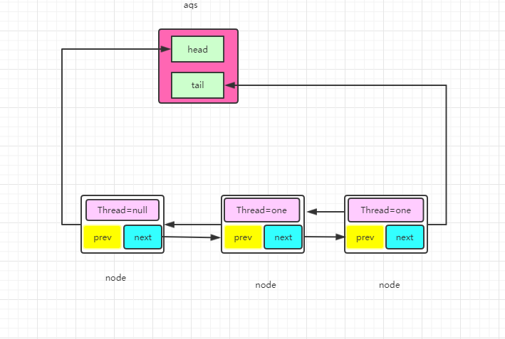
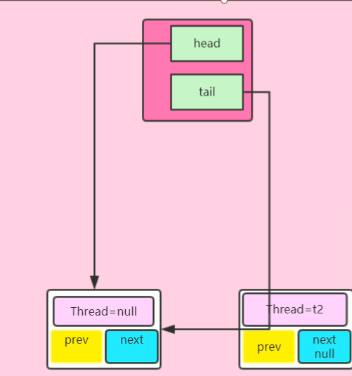
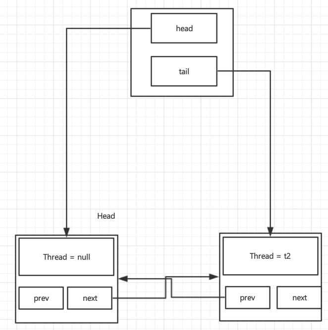
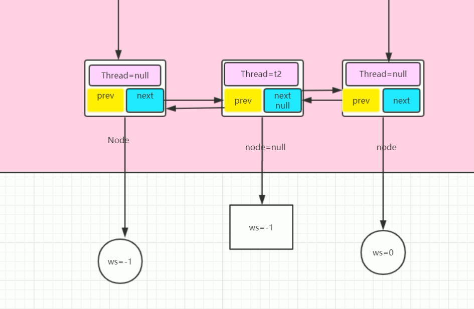
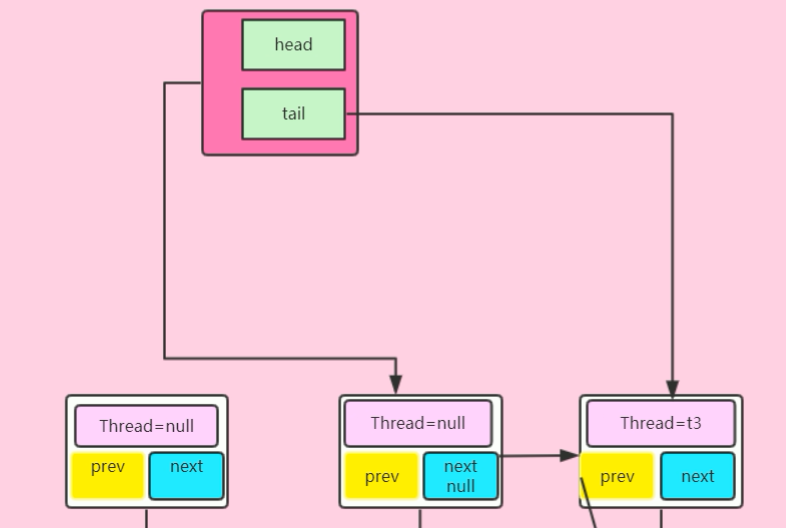
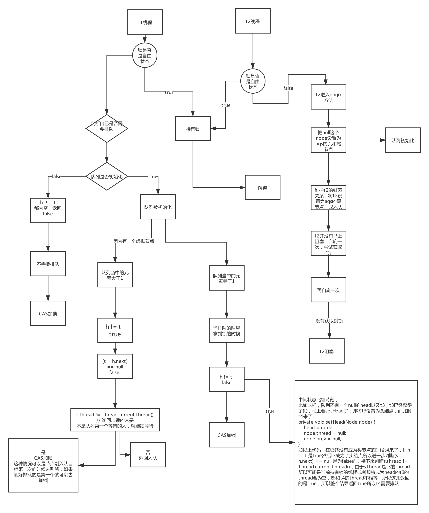
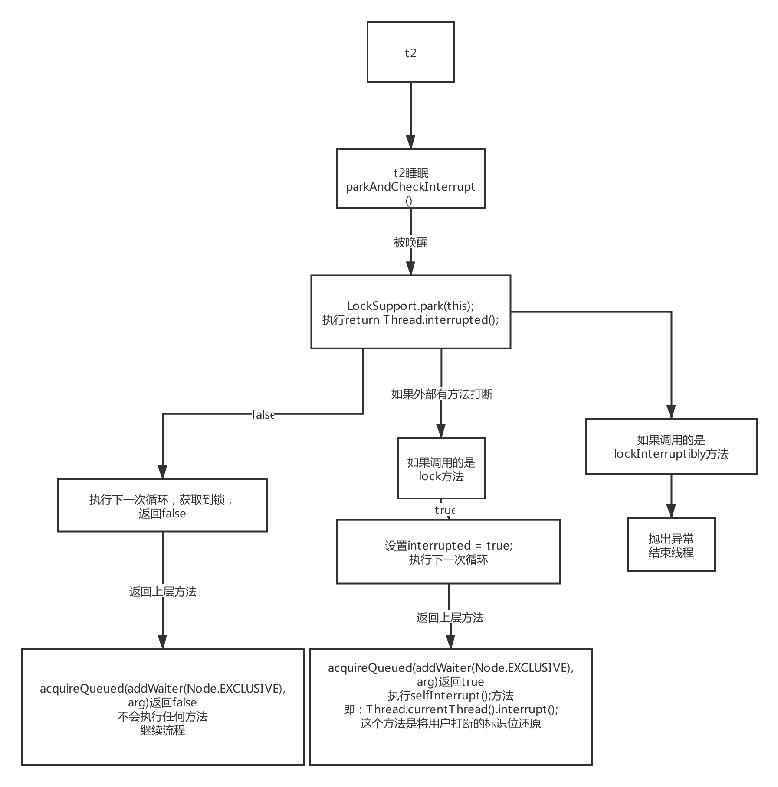

# ReentrantLock

## Java当中的锁是用来干什么的？

多线程同步执行

## 多线程同步内部是如何实现的？

+ wait/notify
+ synchronized
+ ReentrantLock
+ CountdownLatch
+ .....

## 自旋

模拟一些思路

````java
volatile int status = 0;
public void lock() {
    while (!compareAndSet(0, 1)) {
        // 自旋
    }
    // 加锁
}

public void unlock() {
    status = 0;
}
// CAS操作
public boolean compareAndSet(int expect, int newValue) {
    
}
````

缺点：耗费CPU资源，没有竞争到的锁的线程会一直占用CPU进行CAS操作，假设一个线程获得锁后要花费Ns处理业务逻辑，那另外一个线程就会拜拜的花费Ns的CPU资源。

思路：让得不到锁的线程让出CPU。

### yield + 自旋

````java
volatile int status = 0;
public void lock() {
    while (!compareAndSet(0, 1)) {
        yield(); // 自己实现
    }
    // 加锁
}
public void unlock() {
    status = 0;
}
// CAS操作
public boolean compareAndSet(int expect, int newValue) {
    
}
````

要解决自旋锁的性能问题必须让竞争锁失败的线程不空转，而是在获取不到锁的时候能把CPU给让出来，yeild()方法就能让出CPU资源，当线程竞争锁失败时，会调用yeild()方法让出CPU，自旋+yeild的方式并没有完全解决问题，当系统只有两个线程竞争锁时，yield是有效的，需要注意的是yield方法只是当前让出CPU，有可能操作系统下次还是选择运行该线程，比如里面有2000个线程，想想会有什么问题？

yeild我们没有办法控制，系统调度。

### sleep +自旋

````java
volatile int status = 0;
public void lock() {
    while (!compareAndSet(0, 1)) {
        sleep(10);
    }
    // 加锁
}
public void unlock() {
    status = 0;
}
// CAS操作
public boolean compareAndSet(int expect, int newValue) {
    
}
````

sleep的时间为什么是10？怎么控制呢？就是你是调用者其实很多时候你也不知道这个时间是多少？

### park +自旋

````java
volatile int status = 0;
Queue parkQueue; // 集合数组
public void lock() {
    while (!compareAndSet(0, 1)) {
        LockSupport.park();
    }
    
    unlock();
}
public void unlock() {
    status = 0;
    unpark();
}
void park() {
    // 将当前线程加入到等待队列
    parkQueue.add(currentTherad)
    // 释放cpu
    realaseCpu();
}
unpark() {
    // 取出线程
    Theard t = parkQueue.header();
    // 唤醒线程
    LockSupport.unpark(t)
}

// CAS操作
public boolean compareAndSet(int expect, int newValue) {
    
}
````

`LockSupport是unsafe封装的，Java里面比较牛逼的类，可以直接操作操作系统的函数，甚至可以生成堆外内存。`

看看park的例子

````java
public class ThradDemo2 {
    public static void main(String[] args) {
        Thread t1 = new Thread(() -> {testsync();});
        t1.start();
        try {
            Thread.sleep(1000);
        } catch (InterruptedException e) {
            e.printStackTrace();
        }
        System.out.println("main --- 1");
        LockSupport.unpark(t1);
    }

    public static void testsync() {
        System.out.println(Thread.currentThread().getName());
        LockSupport.park();
        System.out.println("end ----");
    }
}
````

````java
Thread-0
main --- 1
end ----
````


````
wait主要是为了让线程通信，不能让其来作为阻塞之用，因为wait必须要加锁，即使用synchronized关键字
````


## 有了synchronized关键字为什么还要用ReentrantLock？

1. 在JDK1.6之前，`synchronized`比较重，需要操作到系统的函数（`mutex`）来阻塞线程，所以操作系统会切换成内核态，然后再切换成用户态，性能开销比较大，`即使是线程交替执行，在jdk1.6之前synchronized也是会调用os的函数`，而在JDK1.6以后`ReentrantLock`问世，将线程同步的问题停留在JVM当中，不再调用系统的内核代码，从而提高了性能。

2. 在jdk1.6之后，对`synchronized`进行了优化，毕竟是亲儿子，随着版本的提升，性能越来越好，所以在jdk1.8之后，`ReenrantLock`底层采用了synchronized关键字和CAS

currentHashmap在jdk1.8之前采用的是ReentrantLock来实现，但是在jdk1.8采用的是synchronized来实现

## AQS

**AQS（AbstractQueuedSynchronizer）类的设计主要代码（具体参考源码）**

````JAVA
private transient volatile Node head; //队首
private transient volatile Node tail;//尾
private volatile int state;//锁状态，加锁成功则为1，重入+1 解锁则为0
private transient Thread exclusiveOwnerThread; // 当前持有锁的线程
````

**AQS当中的队列示意图**



**Node类的设计**

```java
public class Node{
    volatile Node prev;
    volatile Node next;
    volatile Thread thread;
    int ws;
}
```

## ReentrantLock分析

这里使用的是公平锁进行的分析

````java
Lock lock = new ReentrantLock();
lock.lock();
````

````java
public void lock() {
    sync.lock();
}
````

````java
final void lock() {
    acquire(1);
}   
````

```java
public final void acquire(int arg) {
    if (!tryAcquire(arg) &&
        // 加入队列
        acquireQueued(addWaiter(Node.EXCLUSIVE), arg))
        selfInterrupt();
}
```

````java


protected final boolean tryAcquire(int acquires) {
    final Thread current = Thread.currentThread();
    int c = getState();
    // 说明第一次加锁，锁是自由状态
    if (c == 0) {
        // 判断是否要排队 这个方法很复杂
        if (!hasQueuedPredecessors() &&
            // CAS加锁
            compareAndSetState(0, acquires)) {
            // 设置持有锁的线程为当前线程
            setExclusiveOwnerThread(current);
            return true;
        }
    }
    // 重入锁，判断当前持有锁的线程为当前线程
    else if (current == getExclusiveOwnerThread()) {
        int nextc = c + acquires;
        if (nextc < 0)
            throw new Error("Maximum lock count exceeded");
        setState(nextc);
        return true;
    }
    return false;
}
````

````java
/***
判断是否要排队


****/
public final boolean hasQueuedPredecessors() {
        // The correctness of this depends on head being initialized
        // before tail and on head.next being accurate if the current
        // thread is first in queue.
    Node t = tail; // Read fields in reverse initialization order
    Node h = head;
    Node s;
    return h != t &&
        ((s = h.next) == null || s.thread != Thread.currentThread());
}
````

**详细分析**

通过上面代码可得：在线程交替执行的情况下，AQS的队列永远不会被初始化。

那么在多个线程并发的情况下呢？

假设**t1**线程成功获得锁，正在执行没有释放锁，此时**t2**进入，通过上面的方法`tryAcquire`直接返回false，那么退回到上一步`acquire`方法中，这儿再贴一下代码

````java
public final void acquire(int arg) {
    if (!tryAcquire(arg) &&
        // 加入队列
        acquireQueued(addWaiter(Node.EXCLUSIVE), arg))
        selfInterrupt();
}
````

可以看到`tryAcquire(arg) `返回false，这儿取反，则为true继续执行`acquireQueued(addWaiter(Node.EXCLUSIVE), arg))`， `Node.EXCLUSIVE`是null，我们先分析`addWaiter(Node.EXCLUSIVE)`

`addWaiter(Node.EXCLUSIVE)`

````java
private Node addWaiter(Node mode) {
        Node node = new Node(Thread.currentThread(), mode);
        // Try the fast path of enq; backup to full enq on failure
        Node pred = tail;
        if (pred != null) {
            node.prev = pred;
            if (compareAndSetTail(pred, node)) {
                pred.next = node;
                return node;
            }
        }
        enq(node);
        return node;
    }
````

可以看出，先new 一个 node ，也就是**创建t2的node，设置node的next为null**，然后获取tail，此时tail是空的，所以直接进入`enq(node)`方法

````java
private Node enq(final Node node) {
    // 死循环
    for (;;) {
        Node t = tail;
        if (t == null) { // Must initialize
            // CAS 设置AQS的头部
            if (compareAndSetHead(new Node()))
                tail = head;
        } else {
            // 第二次循环进来，设置当前节点的上一个节点是上一次循环设置的空的头结点
            node.prev = t;
            // CAS设置尾节点 如果尾节点是t则将我们传入的node节点设置为尾节点
            if (compareAndSetTail(t, node)) {
                // 将我们之前的尾节点也是现在的空的头结点的下一个节点指针指向我们传入的node
                t.next = node;
                // 返回
                return t;
            }
        }
    }
}
````

第一次进入的时候，可以看见以下代码，**这段代码会将队列的头部和尾部设置一个空的node**，如图

````java
if (compareAndSetHead(new Node()))
                    tail = head;
````



**以后可以分析出结论，队列里面的头节点的Thread永远是空的**

第二次循环的时候：

1. 设置当前节点Node的上一个节点是上一次循环设置的空的头结点head
2. CAS设置尾节点为我们t2的节点
3. 将我们之前的尾节点也是现在的空的头结点的下一个节点指针指向我们传入的node，从而维护t2节点的链表关系
4. 返回

所以现在的情况如下图：



按我们上面所分析的，**接下来要让t2阻塞**，但是情况不是这样，那么我再来看看`acquireQueued`

```java
/**
	t2入队，因为t2是队列的第一个，可能t1已经释放锁，那么t2不能马上阻塞，应该自旋去尝试获取锁
**/
final boolean acquireQueued(final Node node, int arg) {
    boolean failed = true;
    try {
        boolean interrupted = false;
        for (;;) {
            // 拿到上一个节点，判断上一个节点是不是头部
            final Node p = node.predecessor();
            if (p == head && tryAcquire(arg)) {
                setHead(node);
                p.next = null; // help GC
                failed = false;
                return interrupted;
            }
            // 获取不到锁，阻塞
            if (shouldParkAfterFailedAcquire(p, node) &&
                parkAndCheckInterrupt())
                interrupted = true;
        }
    } finally {
        if (failed)
            cancelAcquire(node);
    }
}
```

获取锁失败，判断是否需要睡眠

````java
private static boolean shouldParkAfterFailedAcquire(Node pred, Node node) {
    int ws = pred.waitStatus; // 默认为0
    if (ws == Node.SIGNAL) // -1
        /*
             * This node has already set status asking a release
             * to signal it, so it can safely park.
             */
        return true;
    if (ws > 0) {
        /*
             * Predecessor was cancelled. Skip over predecessors and
             * indicate retry.
             */
        do {
            node.prev = pred = pred.prev;
        } while (pred.waitStatus > 0);
        pred.next = node;
    } else {
        /*
             * waitStatus must be 0 or PROPAGATE.  Indicate that we
             * need a signal, but don't park yet.  Caller will need to
             * retry to make sure it cannot acquire before parking.
             */
        // CAS设置为-1
        compareAndSetWaitStatus(pred, ws, Node.SIGNAL);
    }
    return false;
}
````

````java
// 阻塞
private final boolean parkAndCheckInterrupt() {
    LockSupport.park(this);
    return Thread.interrupted();
}
````

**总结：**t2入队后并没有马上去阻塞，反而前判断它的前面一个节点是否是头结点，如果是头结点的话就尝试去获取锁，也就是自旋，如果获取不到就去判断是否part阻塞，在`shouldParkAfterFailedAcquire`这个方法里面**判断上一个节点的`waitStatus`是否为-1**，这个状态默认为0，于是返回false，然后再循环一次，也就是再自旋一次，再判断前面一个节点是否是头结点，如果是就再尝试获取锁，如果获取不到再进入`shouldParkAfterFailedAcquire`方法，此时前面的节点的`waitStatus`为-1，那么就会返回true也就是可以继续执行`parkAndCheckInterrupt`方法阻塞，所以可以得出**t2入队后并没有马上阻塞**

**为什么要多自旋一次？**

主要是不去阻塞，尽量不去park，一旦park就会成为重量锁。在`shouldParkAfterFailedAcquire`里面判断的`waitStatus`默认为0是一个**必要的状态**，解锁的时候就会用到

**为什么`shouldParkAfterFailedAcquire`这个方法去判断的是上一个节点的`waitStatus`？**

1. 因为当前节点是睡眠了，不能再去设置`waitStatus`
2. 其实自己是否睡着了只有下一个节点才能看到，常理上来说

**如果t3进入是我们再分析一下入队**

````java
private Node enq(final Node node) 
    for (;;) {
        Node t = tail;
        if (t == null) { // Must initialize
          
            if (compareAndSetHead(new Node()))
                tail = head;
        } else {
            // t3进来
            node.prev = t;
            // CAS设置t3尾节点 
            if (compareAndSetTail(t, node)) {
                // 维护t3的链表关系
                t.next = node;
                // 返回
                return t;
            }
        }
    }
}
````

````
头结点不为空，t3直接进入else 部分，设置t3位尾节点，维护其链表关系，如下图
````



然后t3入队，但是通过上面的代码分析，t3并没有马上入队，反而是**自旋两次**。如果两次都没有获得锁的话就睡眠，由上图可以得知，**自旋睡眠的条件是上一个节点的waitStatus是否为-1**，上面也解释过为什么这么设计了

**如果t1释放了锁了会怎么样？**

我们来看释放锁的代码

````java
public void unlock() {
    sync.release(1);
}
````

```java
public final boolean release(int arg) {
    if (tryRelease(arg)) {
        Node h = head;
        // 如果h不是空，h的waitStatus在上面的代码中已经设置为了-1
        if (h != null && h.waitStatus != 0)
            // 进入
            unparkSuccessor(h);
        return true;
    }
    return false;
}
```

````java
protected final boolean tryRelease(int releases) {
    int c = getState() - releases;
    // 如果当前线程不是持有锁的线程就报错
    if (Thread.currentThread() != getExclusiveOwnerThread())
        throw new IllegalMonitorStateException();
    boolean free = false;
    if (c == 0) {
        free = true;
        setExclusiveOwnerThread(null);
    }
    setState(c);
    return free;
}
````

重点方法在`unparkSuccessor`方法中，传入头结点

````java
private void unparkSuccessor(Node node) {
    // ws已经被修改为了-1   
    int ws = node.waitStatus;
    if (ws < 0)
        // 进入 CAS 将头结点的ws修改为0
        compareAndSetWaitStatus(node, ws, 0);

    /*
         * Thread to unpark is held in successor, which is normally
         * just the next node.  But if cancelled or apparently null,
         * traverse backwards from tail to find the actual
         * non-cancelled successor.
         */
    // 取出头结点的下一个节点t2
    Node s = node.next;
    if (s == null || s.waitStatus > 0) {
        s = null;
        for (Node t = tail; t != null && t != node; t = t.prev)
            if (t.waitStatus <= 0)
                s = t;
    }
    if (s != null)
        // 这儿将t2线程唤醒
        LockSupport.unpark(s.thread);
}
````

````java
public static void unpark(Thread thread) {
    if (thread != null)
        UNSAFE.unpark(thread);
}
````

在`LockSupport.unpark(s.thread);`方法中将t2线程唤醒此时要跳转到上面的`acquireQueued`的`parkAndCheckInterrupt`中

````java
private final boolean parkAndCheckInterrupt() {
    LockSupport.park(this);
    // 从这儿返回，这儿是线程是否被打断的状态之后再分析，这儿直接返回False
    return Thread.interrupted();
}
````

于是程序继续执行下一次自旋

````java
final boolean acquireQueued(final Node node, int arg) {
    boolean failed = true;
    try {
        boolean interrupted = false;
        for (;;) {
            // 这时t1已经释放了锁，所以可以获取到了锁
            final Node p = node.predecessor();
            if (p == head && tryAcquire(arg)) {
                setHead(node);
                p.next = null; // help GC
                failed = false;
                return interrupted;
            }
            if (shouldParkAfterFailedAcquire(p, node) &&
                parkAndCheckInterrupt())
                interrupted = true;
        }
    } finally {
        if (failed)
            cancelAcquire(node);
    }
}
````

这时t1已经释放了锁，所以可以获取到了锁，在获取锁了之后，通过`setHead`设置头结点

````java
private void setHead(Node node) {
    head = node; // 设置头节点为t2
    node.thread = null; // 将节点t2的thread设置为空
    node.prev = null; // 断开与之前空的头结点的连接
}
````

可以看见t2成为下一个头结点，但是**节点的线程依旧为空**，在` p.next = null; // help GC`这个代码里面，将之前节点的下一个节点的引用设置为空null方面GC回收，这儿返回false，程序继续执行下次加锁之后的业务操作。所以如下图



**所以可以得出结论持有锁的线程永远不在队列中**


以上就是两个线程进入的流程，下面我们再来看看线程判断自己是否排队这个方法，这个方法很深奥，特别能体现一个程序员的水平

````java
public final boolean hasQueuedPredecessors() {
    Node t = tail; 
    Node h = head;
    Node s;
    /**
     * 下面提到的所有不需要排队，并不是字面意义的不需要排队，我实在想不出什么词语来描述这个“不需要排队”；不需要排队有两种情况
     * 一：队列没有初始化，不需要排队，不需要排队，不需要排队；直接去加锁，但是可能会失败；为什么会失败呢？
     * 假设两个线程同时来lock，都看到队列没有初始化，都认为不需要排队，都去进行CAS修改计数器；但是某个线程t1先拿到锁，那么另外一个t2则会CAS失败，这个时候他就会初始化队列，并排队
     *
    * 二：队列被初始化了，但是tc过来加锁，发觉队列当中第一个排队的就是自己（比如重入；那么什么是第一个排队的呢？下面解释了，往下看）这个时候他也-不需要排队，不需要排队，不需要排队；为什么不需要排对？
    * 因为队列当中第一个排队的线程他回去尝试获取一下锁，因为有可能这个时候持有锁锁的那个线程可能释放了锁，如果释放了就直接获取锁执行。但是如果没有释放他就会去排队，所以这里的不需要排队，不是真的不需要排队，好好理解一下
     *
     * h != t 判断首不等于尾这里要分三种情况
     * 1、队列没有初始化，也就是第一个线程t1来加锁的时候那么这个时候队列没有初始化，h和t都是null，那么这个时候不等于不成立（false）那么由于是&&运算后面的就不会走了，
     * 直接返回false表示不需要排队，而前面又是取反（if (!hasQueuedPredecessors()），所以会直接去cas加锁。
     * ----------第一种情况总结：队列没有初始化没人排队，那么我直接不排队，直接上锁；合情合理、有理有据令人信服；好比你去买票，服务员都闲的蛋疼，没人排队，你直接过去价钱拿票
     *
    * 2、队列被初始化了，后面我们会分析队列初始化的流程，如果队列被初始化那么h!=t则成立；h != t 返回true；但是是&&运算，故而还需要进行后续的判断
    * （有人可能会疑问，比如队列里面只有一个数据，那么头和尾都是同一个怎么会成立呢？其实这是第三种情况--队列里面只有一个数据；这里先不考虑，假设现在队列里面有大于1个数据）
    * 大于1个数据则成立;继续判断把h.next赋值给s；s有是头的下一个，则表示他是队列当中参与排队的线程而且是排在最前面的；为什么是s最前面不是h嘛？诚然h是队列里面的第一个，但是不是排队的第一个；
    * 因为h是持有锁的，但是不参与排队；这个也很好理解，比如你去买火车票，你如果是第一个这个时候售票员已经在给你服务了，你不算排队，你后面的才算排队；
    * 队列里面的h是不参与排队的这点一定要明白参考下面关于队列初始化的解释---因为h要么是虚拟出来的节点，要么是持有锁的节点；什么时候是虚拟的呢？什么时候是持有锁的节点呢？下文分析
    * 然后判断s是否等于空，其实就是判断队列里面是否只有一个数据；假设队列大于1个，那么肯定不成立（s==null---->false），因为大于一个h.next肯定不为空；
    * 由于是||运算如果返回false，还要判断s.thread != Thread.currentThread()；这里又分为两种情况
    *        2.1 s.thread != Thread.currentThread() 返回true，就是当前线程不等于在排队的第一个线程s；
    *              那么这个时候整体结果就是h!=t：true; （s==null false || s.thread != Thread.currentThread() true------> 最后true）结果： true && true 方法最终放回true，那么去则需要去排队
    *              其实这样符合情理，队列不为空，有人在排队，而且第一个排队的人和现在来参与竞争的人不是同一个，那么你就乖乖去排队
    *        2.2 s.thread != Thread.currentThread() 返回false 表示当前来参与竞争锁的线程和第一个排队的线程是同一个线程
    *            那么这个时候整体结果就是h!=t：true; （s==null false || s.thread != Thread.currentThread() false------> 最后false）结果 true && false 方法最终放回false，那么去则不需要去排队
    *            不需要排队则调用 compareAndSetState(0, acquires) 去改变计数器尝试上锁；这里又分为两种情况（日了狗了这一行代码；有同学课后反应说子路老师老师老是说这个AQS难，你现在仔细看看这一行代码的意义，真的不简单的）
    *             2.2.1 第一种情况加锁成功？有人会问为什么会成功啊，很简单假如这个时候h也就是持有锁的那个线程执行完了，释放锁了，那么肯定成功啊；成功则执行 setExclusiveOwnerThread(current); 然后返回true 自己看代码
    *             2.2.2 第二种情况加锁失败？有人会问为什么会失败啊。很简单假如这个时候h也就是持有锁的那个线程没执行完，没释放锁，那么肯定失败啊；失败则直接返回false，不会进else if（java基础，else if是相对于 if (c == 0)的）
    *                   那么如果失败怎么办呢？后面分析；
    *
    *----------第二种情况总结，如果队列被初始化了，而且至少有一个人在排队那么自己也去排队；但是有个插曲；他会去看看那个第一个排队的人是不是自己，如果是自己那么他就去尝试假设；尝试看看锁有没有释放
    *----------也合情合理，好比你去买票，如果有人排队，那么你乖乖排队，但是你会去看看第一个排队的人是不是你女朋友；或者男朋友
    *----------如果是你女朋友就相当于是你自己（这里实在想不出现实世界关于重入的例子，只能用男女朋友来替代），你就叫你女朋友看看售票员有没有搞完，有没有轮到你女朋友，因为你女朋友是第一个排队的
    *----------疑问：比如如果在在排队，那么他是park状态，如果是park状态，自己怎么还可能重入啊。希望有同学可以想出来为什么和我讨论一下，作为一个菜逼，希望有人教教我
    *          
    * 3、队列被初始化了，但是里面只有一个数据；什么情况下才会出现这种情况呢？可能有人会说ts加锁的时候里面就只有一个数据；其实不是，因为队列初始化的时候会虚拟一个h作为头结点，当前线程作为第一个排队的节点
    * 为什么这么做呢？因为aqs认为h永远是不排队的，假设你不虚拟节点出来那么ts就是h，而ts其实需要排队的，因为这个时候tf可能没有执行完，ts得不到锁，故而他需要排队；
    * 那么为什么要虚拟为什么ts不直接排在tf之后呢，上面已经时说明白了，tf来上锁的时候队列都没有，他不进队列，故而ts无法排在tf之后，只能虚拟一个null节点出来；
    * 那么问题来了；究竟上面时候才会出现队列当中只有一个数据呢？假设原先队列里面有5个人在排队，当前面4个都执行完了，轮到第五个线程得到锁的时候；他会把自己设置成为头部，而尾部又没有，故而队列当中只有一个h就是第五个
    * 至于为什么需要把自己设置成头部；其实已经解释了，因为这个时候五个线程已经不排队了，他拿到锁了，所以他不参与排队，故而需要设置成为h；即头部；所以这个时间内，队列当中只有一个节点
    * 关于加锁成功后把自己设置成为头部的源码，后面会解析到；继续第三种情况的代码分析，记得这个时候队列已经初始化了，但是只有一个数据，并且这个数据所代表的线程是持有锁
    * h != t false 由于后面是&&运算，故而返回false可以不参与运算，整个方法返回false；不需要排队
    *
    *
    *-------------第三种情况总结：如果队列当中只有一个节点，而这种情况我们分析了，这个节点就是当前持有锁的那个节点，故而我不需要排队，进行cas；
    *-------------如果持有锁的线程释放了锁，那么我能成功上锁
    *-------------
    *
    **/
    return h != t &&
        ((s = h.next) == null || s.thread != Thread.currentThread());
}
````

`return h != t &&  ((s = h.next) == null || s.thread != Thread.currentThread());`

1. 队列没有初始化，不需要排队，不需要排队，不需要排队；直接去加锁，但是可能会失败；**为什么会失败呢？**
   假设两个线程同时来lock，都看到队列没有初始化，都认为不需要排队，都去进行CAS修改计数器；但是某个线程t1先拿到锁，那么另外一个t2则会CAS失败，这个时候他就会初始化队列，并排队。

2. 队列被初始化了，但是tc过来加锁，发觉队列当中第一个排队的就是自己（比如重入；那么什么是第一个排队的呢？下面解释了，往下看）这个时候他也-不需要排队，不需要排队，不需要排队；为什么不需要排对？
    因为队列当中第一个排队的线程他回去尝试获取一下锁，因为有可能这个时候持有锁锁的那个线程可能释放了锁，如果释放了就直接获取锁执行。但是如果没有释放他就会去排队，所以这里的不需要排队，不是真的不需要排队，好好理解一下

3. h != t 判断首不等于尾这里要分三种情况

   1. 队列没有初始化，也就是第一个线程t1来加锁的时候那么这个时候队列没有初始化，h和t都是null，那么这个时候不等于不成立（false）那么由于是&&运算后面的就不会走了，
       直接返回false表示不需要排队，而前面又是取反（if (!hasQueuedPredecessors()），所以会直接去cas加锁。
       **第一种情况总结：**队列没有初始化没人排队，那么我直接不排队，直接上锁；合情合理、有理有据令人信服；好比你去买票，服务员都闲的蛋疼，没人排队，你直接过去价钱拿票。

   2. 队列被初始化了，后面我们会分析队列初始化的流程，如果队列被初始化那么`h!=t`则成立；`h != t `返回true；但是是`&&`运算，故而还需要进行后续的判断。（有人可能会疑问，比如队列里面只有一个数据，那么头和尾都是同一个怎么会成立呢？其实这是第三种情况--队列里面只有一个数据；这里先不考虑，假设现在队列里面有大于1个数据）。

      1.  大于1个数据则成立;继续判断把h.next赋值给s；s有是头的下一个，则表示他是队列当中参与排队的线程而且是排在最前面的；为什么是s最前面不是h嘛？诚然h是队列里面的第一个，但是不是排队的第一个；因为h是虚拟的头结点，不参与排队，就相当于售票员是第一个，但是没有实际意义，上面代码已经分析了。

      2.   然后判断s是否等于空，其实就是判断队列里面是否只有一个数据；假设队列大于1个，那么肯定不成立（s==null---->false），因为大于一个h.next肯定不为空；

      3. 由于是||运算如果返回false，还要判断s.thread != Thread.currentThread()；这里又分为两种情况

         1. `s.thread != Thread.currentThread() `返回true，就是当前线程不等于在排队的第一个线程s；

            那么这个时候整体结果就是h!=t：true; （s==null false || s.thread != Thread.currentThread() true------> 最后true）结果： true && true 方法最终放回true，那么去则需要去排队

            其实这样符合情理，队列不为空，有人在排队，而且第一个排队的人和现在来参与竞争的人不是同一个，那么你就乖乖去排队

         


看了上面写的那么多，我画了个图来参考：



****


## ReentrantLock被打断的原理

假设有两个线程，如果第一个线程执行时间太长，那么要求第二线程打断我们该如何处理？

````java
public class ThradDemo2 {
    static Lock lock = new ReentrantLock();
    public static void main(String[] args) {
        Thread t1 = new Thread(() -> {testsync();}, "t1");
        Thread t2 = new Thread(() -> {testsync();}, "t2");
        t1.start();
        try {
            Thread.sleep(1000);
        } catch (InterruptedException e) {
            e.printStackTrace();
        }
        t2.start();
        // 等待两秒钟，如果t1不释放锁t2就打断
        try {
            Thread.sleep(2000);
        } catch (InterruptedException e) {
            e.printStackTrace();
        }
        t2.interrupt();
        // 打断不了，t2还是在等待
        System.out.println("main");
    }

    public static void testsync() {
        System.out.println(Thread.currentThread().getName());
        lock.lock();
        try {
            Thread.sleep(1000000);
        } catch (InterruptedException e) {
            e.printStackTrace();
        } finally {
          lock.unlock();
        }
    }
}
````

````java
t1
t2
main

````

我们会发现`t2.interrupt();`还是会在等待，那么我们该如何去打断呢？采用`lockInterruptibly`，**通过抓捕异常来进行打断**。**这个方法可以让我们去打断一个在等待或者在aqs排队的线程**。

````java
public class ThradDemo2 {
    static Lock lock = new ReentrantLock();
    public static void main(String[] args) {
        Thread t1 = new Thread(() -> {testsync();}, "t1");
        Thread t2 = new Thread(() -> {testsync();}, "t2");
        t1.start();
        try {
            Thread.sleep(1000);
        } catch (InterruptedException e) {
            e.printStackTrace();
        }
        t2.start();
        // 等待两秒钟，如果t1不释放锁t2就打断
        try {
            Thread.sleep(2000);
        } catch (InterruptedException e) {
            e.printStackTrace();
        }
        t2.interrupt();
        // 打断不了，t2还是在等待
        System.out.println("main");
    }

    public static void testsync() {
        System.out.println(Thread.currentThread().getName());
        try {
            lock.lockInterruptibly();
        } catch (InterruptedException e) {
            System.out.println(Thread.currentThread().getName() + " 被打断了");
        }
        try {
            Thread.sleep(1000000);
        } catch (InterruptedException e) {
            e.printStackTrace();
        } finally {
          lock.unlock();
        }
    }
}
````

**源码分析**

````java
public void lockInterruptibly() throws InterruptedException {
    sync.acquireInterruptibly(1);
}
````

````java
public final void acquireInterruptibly(int arg)
            throws InterruptedException {
    if (Thread.interrupted())
        throw new InterruptedException();
    if (!tryAcquire(arg))
        doAcquireInterruptibly(arg);
}
````

判断在加锁之前打断的话就响应，如果拿不到锁的话，继续执行`doAcquireInterruptibly(arg);`

```java
private void doAcquireInterruptibly(int arg)
    throws InterruptedException {
    final Node node = addWaiter(Node.EXCLUSIVE);
    boolean failed = true;
    try {
        for (;;) {
            final Node p = node.predecessor();
            if (p == head && tryAcquire(arg)) {
                setHead(node);
                p.next = null; // help GC
                failed = false;
                return;
            }
            if (shouldParkAfterFailedAcquire(p, node) &&
                parkAndCheckInterrupt())
                throw new InterruptedException();
        }
    } finally {
        if (failed)
            cancelAcquire(node);
    }
}
```

通过`addWaiter(Node.EXCLUSIVE);`入队

乍看之下都和之前的方法一样，但是稍有不同，如下：

````java
if (shouldParkAfterFailedAcquire(p, node) &&
                parkAndCheckInterrupt())
                throw new InterruptedException();
````

我们可以通过如下代码得知，如果某一天被叫醒了，就从`return Thread.interrupted();`这段代码执行开始

````java
private final boolean parkAndCheckInterrupt() {
    LockSupport.park(this);
    return Thread.interrupted();
}

````

t2在睡眠中，被打断了(`t2.interrupt();`)，然后叫醒后，`Thread.interrupted();`返回true，

因为在正常流程，即非用户行为，`parkAndCheckInterrupt() `这个方法会返回false，如果外部没有人打断，则继续下一次循环然后获取锁，接着不会调用上层的`selfInterrupt();`方法，倘若外部有人打断这个线程，那么这个方法返回true，将

设置`interrupted = true;`，如下：

````java
final boolean acquireQueued(final Node node, int arg) {
    boolean failed = true;
    try {
        boolean interrupted = false;
        for (;;) {
            final Node p = node.predecessor();
            if (p == head && tryAcquire(arg)) {
                setHead(node);
                p.next = null; // help GC
                failed = false;
                return interrupted;
            }
            if (shouldParkAfterFailedAcquire(p, node) &&
                parkAndCheckInterrupt())
                interrupted = true;
        }
    } finally {
        if (failed)
            cancelAcquire(node);
    }
}
````

返回到上层方法：

````java
public final void acquire(int arg) {
    if (!tryAcquire(arg) &&
        acquireQueued(addWaiter(Node.EXCLUSIVE), arg))
        selfInterrupt(); // 这个方法
}
````

````java
static void selfInterrupt() {
    Thread.currentThread().interrupt();
}
````

然后让用户打断的标识位还原。

**这是为什么？**

倘若不参考`lockInterruptibly()`这个方法，我们是得不出结论的，在`lockInterruptibly()`这个方法中如果用户外部打断的话会抛出异常中断线程：

````java
if (shouldParkAfterFailedAcquire(p, node) &&
                parkAndCheckInterrupt())
                throw new InterruptedException();
````

这儿我也稍微画了一个图：



## 解锁

以后再研究

## 读写锁

以后再研究

