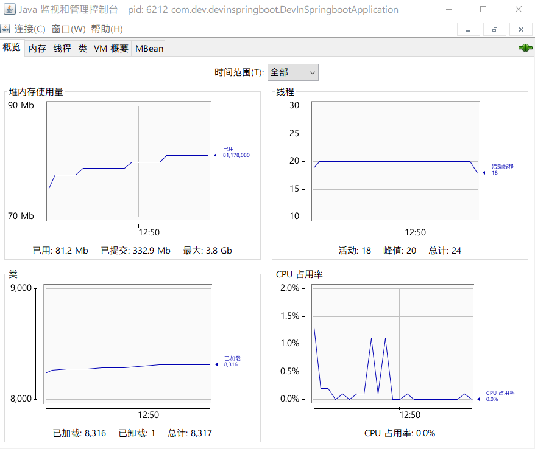
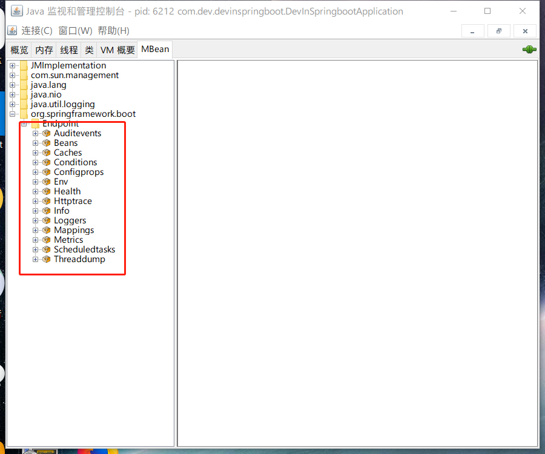

# 总览

Spring Boot在微服务中已经发展到了一个很重要的地位，也越来越受欢迎。

1. 绝对的市场占有率（Spring Framework）

2. 优秀的家族基因

   继承Spring很多特性

3. 与时俱进的技术信仰

   1.0版本摆脱不了``servlet``的命运

   2.0采用``reactor``的编辑模式，提供非阻塞异步的编程方式以及一个套完整的``reactor``技术栈

前因后果、举一反三、触类旁通

1. Spring Boot是如何基于Spring Framework逐步走向自动装配？
2. SpringApplication是怎样掌控Spring应用生命周期？
3. Spring Boot外部化配置与Spring Environment抽象之间是什么关系？
4. Spring Web MVC向Spring Reactive WebFlux过渡的真实价值和意义？

最佳实践、学思相辅、承上启下

1. 场景分析，掌握技术选型
2. 系统学习，拒绝浅尝辄止
3. 重视规范，了解发展趋势
4. 源码解读，理解设计思想
5. 实战演练，巩固学习成果

技术储备

1. 语言：Java 8 Lambda
2. 框架： Spring Framework基础较熟练
3. 运用： Spring Boot基础

## 为什么说Spring Boot 2.0 易学难精？

### Spring Boot 易学

1. 组件自动装配：规约大约配置，专注核心业务
2. 外部化配置：一次构建、按需调配，到处运行
3. 嵌入式容器：内置容器、无需部署、独立运行
4. Spring Boot Starter：简化依赖、按需装配、自我包含
5. Production-Ready：一站式运维、生态无缝整合

### Spring Boot 难精

1. 组件自动装配：模式注解、@Enable模块、条件装配、加载机制

   主要是来自Spring Framework而非Spring Boot，只是Spring Boot在基础上加了一些变化，扩展出类似于Spring Boot Annotation的标签

2. 外部化配置：Environment抽象、生命周期、破坏性变更

   1.0和2.0不太兼容

3. 嵌入式容器：Servlet Web容器、Reactive Web容器

4. Spring Boot Starter：依赖管理、装配条件、装配顺序

   难度很大

5. Production-Ready：健康检查、数据指标、@Endpoint管控

   面向底层的API

   

### Spring Boot 与 Java EE 规范

1. Web：Servlet（HSR-315、JSR-340）

2. SQL：JDBC（JSR-221）

3. 数据校验：Bean Validation（JSR 303、JSR-349）

4. 缓存：Java Caching API（JSR-107）

5. WebSockets：Java API for WebSocket（JSR-356）

6. Web Service：JAX-WS（JSR-224）

7. Java管理：JMX（JSR 3）

8. 消息：JMS（JSR-914）

   

### Spring Boot 三大特性

1. 组件自动装配：Web MVC、Web Flux、JDBC等

2. 嵌入式Web容器：Tomcat、Jetty以及Undertow

3. 生产准备特性：指标、健康检查、外部化配置等

   

### Spring Boot 核心特性

#### 组件自动装配

1. 激活：``@EnableAutoConfiguration``

2. 配置：/META-INF（元信息目录）/``spring.factories``【key value】

   贴一下``spring-boot-autocofigure``的``spring.factories``

   是一个key，value的形式，前面是类名，后面是接口名或者实现名`/`是换行

   ````properties
   # Initializers 初始化
   org.springframework.context.ApplicationContextInitializer=\
   org.springframework.boot.autoconfigure.SharedMetadataReaderFactoryContextInitializer,\
   org.springframework.boot.autoconfigure.logging.ConditionEvaluationReportLoggingListener
   
   # Application Listeners 监听器
   org.springframework.context.ApplicationListener=\
   org.springframework.boot.autoconfigure.BackgroundPreinitializer
   
   # Auto Configuration Import Listeners
   org.springframework.boot.autoconfigure.AutoConfigurationImportListener=\
   org.springframework.boot.autoconfigure.condition.ConditionEvaluationReportAutoConfigurationImportListener
   
   # Auto Configuration Import Filters
   org.springframework.boot.autoconfigure.AutoConfigurationImportFilter=\
   org.springframework.boot.autoconfigure.condition.OnBeanCondition,\
   org.springframework.boot.autoconfigure.condition.OnClassCondition,\
   org.springframework.boot.autoconfigure.condition.OnWebApplicationCondition
   
   # Auto Configure 自动装配
   org.springframework.boot.autoconfigure.EnableAutoConfiguration=\
   org.springframework.boot.autoconfigure.admin.SpringApplicationAdminJmxAutoConfiguration,\
   org.springframework.boot.autoconfigure.aop.AopAutoConfiguration,\
   org.springframework.boot.autoconfigure.amqp.RabbitAutoConfiguration,\
   org.springframework.boot.autoconfigure.batch.BatchAutoConfiguration,\
   org.springframework.boot.autoconfigure.cache.CacheAutoConfiguration,\
   org.springframework.boot.autoconfigure.cassandra.CassandraAutoConfiguration,\
   org.springframework.boot.autoconfigure.cloud.CloudServiceConnectorsAutoConfiguration,\
   org.springframework.boot.autoconfigure.context.ConfigurationPropertiesAutoConfiguration,\
   org.springframework.boot.autoconfigure.context.MessageSourceAutoConfiguration,\
   org.springframework.boot.autoconfigure.context.PropertyPlaceholderAutoConfiguration,\
   org.springframework.boot.autoconfigure.couchbase.CouchbaseAutoConfiguration,\
   org.springframework.boot.autoconfigure.dao.PersistenceExceptionTranslationAutoConfiguration,\
   org.springframework.boot.autoconfigure.data.cassandra.CassandraDataAutoConfiguration,\
   org.springframework.boot.autoconfigure.data.cassandra.CassandraReactiveDataAutoConfiguration,\
   org.springframework.boot.autoconfigure.data.cassandra.CassandraReactiveRepositoriesAutoConfiguration,\
   org.springframework.boot.autoconfigure.data.cassandra.CassandraRepositoriesAutoConfiguration,\
   org.springframework.boot.autoconfigure.data.couchbase.CouchbaseDataAutoConfiguration,\
   org.springframework.boot.autoconfigure.data.couchbase.CouchbaseReactiveDataAutoConfiguration,\
   org.springframework.boot.autoconfigure.data.couchbase.CouchbaseReactiveRepositoriesAutoConfiguration,\
   org.springframework.boot.autoconfigure.data.couchbase.CouchbaseRepositoriesAutoConfiguration,\
   org.springframework.boot.autoconfigure.data.elasticsearch.ElasticsearchAutoConfiguration,\
   org.springframework.boot.autoconfigure.data.elasticsearch.ElasticsearchDataAutoConfiguration,\
   org.springframework.boot.autoconfigure.data.elasticsearch.ElasticsearchRepositoriesAutoConfiguration,\
   org.springframework.boot.autoconfigure.data.jdbc.JdbcRepositoriesAutoConfiguration,\
   org.springframework.boot.autoconfigure.data.jpa.JpaRepositoriesAutoConfiguration,\
   org.springframework.boot.autoconfigure.data.ldap.LdapRepositoriesAutoConfiguration,\
   org.springframework.boot.autoconfigure.data.mongo.MongoDataAutoConfiguration,\
   org.springframework.boot.autoconfigure.data.mongo.MongoReactiveDataAutoConfiguration,\
   org.springframework.boot.autoconfigure.data.mongo.MongoReactiveRepositoriesAutoConfiguration,\
   org.springframework.boot.autoconfigure.data.mongo.MongoRepositoriesAutoConfiguration,\
   org.springframework.boot.autoconfigure.data.neo4j.Neo4jDataAutoConfiguration,\
   org.springframework.boot.autoconfigure.data.neo4j.Neo4jRepositoriesAutoConfiguration,\
   org.springframework.boot.autoconfigure.data.solr.SolrRepositoriesAutoConfiguration,\
   org.springframework.boot.autoconfigure.data.redis.RedisAutoConfiguration,\
   org.springframework.boot.autoconfigure.data.redis.RedisReactiveAutoConfiguration,\
   org.springframework.boot.autoconfigure.data.redis.RedisRepositoriesAutoConfiguration,\
   org.springframework.boot.autoconfigure.data.rest.RepositoryRestMvcAutoConfiguration,\
   org.springframework.boot.autoconfigure.data.web.SpringDataWebAutoConfiguration,\
   org.springframework.boot.autoconfigure.elasticsearch.jest.JestAutoConfiguration,\
   org.springframework.boot.autoconfigure.elasticsearch.rest.RestClientAutoConfiguration,\
   org.springframework.boot.autoconfigure.flyway.FlywayAutoConfiguration,\
   org.springframework.boot.autoconfigure.freemarker.FreeMarkerAutoConfiguration,\
   org.springframework.boot.autoconfigure.gson.GsonAutoConfiguration,\
   org.springframework.boot.autoconfigure.h2.H2ConsoleAutoConfiguration,\
   org.springframework.boot.autoconfigure.hateoas.HypermediaAutoConfiguration,\
   org.springframework.boot.autoconfigure.hazelcast.HazelcastAutoConfiguration,\
   org.springframework.boot.autoconfigure.hazelcast.HazelcastJpaDependencyAutoConfiguration,\
   org.springframework.boot.autoconfigure.http.HttpMessageConvertersAutoConfiguration,\
   org.springframework.boot.autoconfigure.http.codec.CodecsAutoConfiguration,\
   org.springframework.boot.autoconfigure.influx.InfluxDbAutoConfiguration,\
   org.springframework.boot.autoconfigure.info.ProjectInfoAutoConfiguration,\
   org.springframework.boot.autoconfigure.integration.IntegrationAutoConfiguration,\
   org.springframework.boot.autoconfigure.jackson.JacksonAutoConfiguration,\
   org.springframework.boot.autoconfigure.jdbc.DataSourceAutoConfiguration,\
   org.springframework.boot.autoconfigure.jdbc.JdbcTemplateAutoConfiguration,\
   org.springframework.boot.autoconfigure.jdbc.JndiDataSourceAutoConfiguration,\
   org.springframework.boot.autoconfigure.jdbc.XADataSourceAutoConfiguration,\
   org.springframework.boot.autoconfigure.jdbc.DataSourceTransactionManagerAutoConfiguration,\
   org.springframework.boot.autoconfigure.jms.JmsAutoConfiguration,\
   org.springframework.boot.autoconfigure.jmx.JmxAutoConfiguration,\
   org.springframework.boot.autoconfigure.jms.JndiConnectionFactoryAutoConfiguration,\
   org.springframework.boot.autoconfigure.jms.activemq.ActiveMQAutoConfiguration,\
   org.springframework.boot.autoconfigure.jms.artemis.ArtemisAutoConfiguration,\
   org.springframework.boot.autoconfigure.groovy.template.GroovyTemplateAutoConfiguration,\
   org.springframework.boot.autoconfigure.jersey.JerseyAutoConfiguration,\
   org.springframework.boot.autoconfigure.jooq.JooqAutoConfiguration,\
   org.springframework.boot.autoconfigure.jsonb.JsonbAutoConfiguration,\
   org.springframework.boot.autoconfigure.kafka.KafkaAutoConfiguration,\
   org.springframework.boot.autoconfigure.ldap.embedded.EmbeddedLdapAutoConfiguration,\
   org.springframework.boot.autoconfigure.ldap.LdapAutoConfiguration,\
   org.springframework.boot.autoconfigure.liquibase.LiquibaseAutoConfiguration,\
   org.springframework.boot.autoconfigure.mail.MailSenderAutoConfiguration,\
   org.springframework.boot.autoconfigure.mail.MailSenderValidatorAutoConfiguration,\
   org.springframework.boot.autoconfigure.mongo.embedded.EmbeddedMongoAutoConfiguration,\
   org.springframework.boot.autoconfigure.mongo.MongoAutoConfiguration,\
   org.springframework.boot.autoconfigure.mongo.MongoReactiveAutoConfiguration,\
   org.springframework.boot.autoconfigure.mustache.MustacheAutoConfiguration,\
   org.springframework.boot.autoconfigure.orm.jpa.HibernateJpaAutoConfiguration,\
   org.springframework.boot.autoconfigure.quartz.QuartzAutoConfiguration,\
   org.springframework.boot.autoconfigure.reactor.core.ReactorCoreAutoConfiguration,\
   org.springframework.boot.autoconfigure.security.servlet.SecurityAutoConfiguration,\
   org.springframework.boot.autoconfigure.security.servlet.SecurityRequestMatcherProviderAutoConfiguration,\
   org.springframework.boot.autoconfigure.security.servlet.UserDetailsServiceAutoConfiguration,\
   org.springframework.boot.autoconfigure.security.servlet.SecurityFilterAutoConfiguration,\
   org.springframework.boot.autoconfigure.security.reactive.ReactiveSecurityAutoConfiguration,\
   org.springframework.boot.autoconfigure.security.reactive.ReactiveUserDetailsServiceAutoConfiguration,\
   org.springframework.boot.autoconfigure.sendgrid.SendGridAutoConfiguration,\
   org.springframework.boot.autoconfigure.session.SessionAutoConfiguration,\
   org.springframework.boot.autoconfigure.security.oauth2.client.servlet.OAuth2ClientAutoConfiguration,\
   org.springframework.boot.autoconfigure.security.oauth2.client.reactive.ReactiveOAuth2ClientAutoConfiguration,\
   org.springframework.boot.autoconfigure.security.oauth2.resource.servlet.OAuth2ResourceServerAutoConfiguration,\
   org.springframework.boot.autoconfigure.security.oauth2.resource.reactive.ReactiveOAuth2ResourceServerAutoConfiguration,\
   org.springframework.boot.autoconfigure.solr.SolrAutoConfiguration,\
   org.springframework.boot.autoconfigure.task.TaskExecutionAutoConfiguration,\
   org.springframework.boot.autoconfigure.task.TaskSchedulingAutoConfiguration,\
   org.springframework.boot.autoconfigure.thymeleaf.ThymeleafAutoConfiguration,\
   org.springframework.boot.autoconfigure.transaction.TransactionAutoConfiguration,\
   org.springframework.boot.autoconfigure.transaction.jta.JtaAutoConfiguration,\
   org.springframework.boot.autoconfigure.validation.ValidationAutoConfiguration,\
   org.springframework.boot.autoconfigure.web.client.RestTemplateAutoConfiguration,\
   org.springframework.boot.autoconfigure.web.embedded.EmbeddedWebServerFactoryCustomizerAutoConfiguration,\
   org.springframework.boot.autoconfigure.web.reactive.HttpHandlerAutoConfiguration,\
   org.springframework.boot.autoconfigure.web.reactive.ReactiveWebServerFactoryAutoConfiguration,\
   org.springframework.boot.autoconfigure.web.reactive.WebFluxAutoConfiguration,\
   org.springframework.boot.autoconfigure.web.reactive.error.ErrorWebFluxAutoConfiguration,\
   org.springframework.boot.autoconfigure.web.reactive.function.client.ClientHttpConnectorAutoConfiguration,\
   org.springframework.boot.autoconfigure.web.reactive.function.client.WebClientAutoConfiguration,\
   org.springframework.boot.autoconfigure.web.servlet.DispatcherServletAutoConfiguration,\
   org.springframework.boot.autoconfigure.web.servlet.ServletWebServerFactoryAutoConfiguration,\
   org.springframework.boot.autoconfigure.web.servlet.error.ErrorMvcAutoConfiguration,\
   org.springframework.boot.autoconfigure.web.servlet.HttpEncodingAutoConfiguration,\
   org.springframework.boot.autoconfigure.web.servlet.MultipartAutoConfiguration,\
   org.springframework.boot.autoconfigure.web.servlet.WebMvcAutoConfiguration,\
   org.springframework.boot.autoconfigure.websocket.reactive.WebSocketReactiveAutoConfiguration,\
   org.springframework.boot.autoconfigure.websocket.servlet.WebSocketServletAutoConfiguration,\
   org.springframework.boot.autoconfigure.websocket.servlet.WebSocketMessagingAutoConfiguration,\
   org.springframework.boot.autoconfigure.webservices.WebServicesAutoConfiguration,\
   org.springframework.boot.autoconfigure.webservices.client.WebServiceTemplateAutoConfiguration
   
   # Failure analyzers
   org.springframework.boot.diagnostics.FailureAnalyzer=\
   org.springframework.boot.autoconfigure.diagnostics.analyzer.NoSuchBeanDefinitionFailureAnalyzer,\
   org.springframework.boot.autoconfigure.jdbc.DataSourceBeanCreationFailureAnalyzer,\
   org.springframework.boot.autoconfigure.jdbc.HikariDriverConfigurationFailureAnalyzer,\
   org.springframework.boot.autoconfigure.session.NonUniqueSessionRepositoryFailureAnalyzer
   
   # Template availability providers
   org.springframework.boot.autoconfigure.template.TemplateAvailabilityProvider=\
   org.springframework.boot.autoconfigure.freemarker.FreeMarkerTemplateAvailabilityProvider,\
   org.springframework.boot.autoconfigure.mustache.MustacheTemplateAvailabilityProvider,\
   org.springframework.boot.autoconfigure.groovy.template.GroovyTemplateAvailabilityProvider,\
   org.springframework.boot.autoconfigure.thymeleaf.ThymeleafTemplateAvailabilityProvider,\
   org.springframework.boot.autoconfigure.web.servlet.JspTemplateAvailabilityProvider
   ````

   

3. 实现：XXXAutoConfiguration

#### 嵌入式容器

1. Web Servlet：Tomcat、Jetty和Undertow
2. Web Reactive：Netty Web Server

#### 生产准备特性

1. 指标：/actuator/metrics
2. 健康检查：/actuator/health
3. 外部化配置：/actuator/configprops

### Web应用

#### 传统Servlet应用

1. Servlet组件：Servlet、Filter、Listener

2. Servlet注册：Servlet注解、Spring Bean、RegistrationBean

3. 异步非阻塞：异步Servlet(Servlet3.0实现)、非阻塞Servlet(Servlet3.1实现)

   

#### 依赖

````xml
<dependency>					   
    <groupId>org.springframework.boot</groupId>
	<artifactId>spring-boot-starter-web</artifactId>
</dependency>
````

```java
启动后可以明显看到servlet
Starting Servlet engine: [Apache Tomcat/9.0.22]
```

#### Serlet组件

+ 自定义Serlvet

  + 实现

    ```java
    /**
     * 自定义Servlet
     */
    @WebServlet(urlPatterns = "/my/servlet")
    public class MyServlet extends HttpServlet {
        // 覆盖doGet方法
        @Override
        protected void doGet(HttpServletRequest req, HttpServletResponse resp) throws ServletException, IOException {
            resp.getWriter().println("Hello World");
        }
    }
    ```

    

  + URL映射

    ````java
    @WebServlet(urlPatterns = "/my/servlet")
    ````

  + 注册

    ```java
    @SpringBootApplication
    // 注册组件
    @ServletComponentScan(basePackages = "com.dev.devinspringboot.web.servlet")
    public class DevInSpringbootApplication {
    
    	public static void main(String[] args) {
    		SpringApplication.run(DevInSpringbootApplication.class, args);
    	}
    
    }
    ```

#### 异步非阻塞

##### 异步Servlet

````java
/**
 * 自定义异步Servlet
 */
@WebServlet(urlPatterns = "/my/servlet",
            asyncSupported = true // 
)
public class MyServlet extends HttpServlet {
    // 覆盖doGet方法
    @Override
    protected void doGet(HttpServletRequest req, HttpServletResponse resp) throws ServletException, IOException {
        AsyncContext asyncContext = req.startAsync();
        asyncContext.start(() -> {
            try {
                resp.getWriter().println("Hello World");
                // 显示的去触发完成
                asyncContext.complete();
            } catch (IOException e) {
                e.printStackTrace();
            }
        });

    }
}
````

我们发现，异步servlet比起同步servlet要复杂得多

#### Spring Web MVC应用

+ Web MVC视图：模板引擎、内容协商、异常处理
+ Web MVC REST：资源服务、资源跨域、服务发现
+ Web MVC核心：核心架构、处理流程、核心组件

##### Web MVC视图

+ `ViewResolver`

  ```java
  public interface ViewResolver {
      // 名称  local
      @Nullable
      View resolveViewName(String var1, Locale var2) throws Exception;
  }
  ```

  

+ `View`

  ```java
  public interface View {
      String RESPONSE_STATUS_ATTRIBUTE = View.class.getName() + ".responseStatus";
      String PATH_VARIABLES = View.class.getName() + ".pathVariables";
      String SELECTED_CONTENT_TYPE = View.class.getName() + ".selectedContentType";
  
      @Nullable
      default String getContentType() {
          return null;
      }
  	// Va1:上下文	
      void render(@Nullable Map<String, ?> var1, HttpServletRequest var2, HttpServletResponse var3) throws Exception;
  }
  
  ```

  

###### 模板引擎

+ `Thymeleaf`
+ `Freemarker`
+ `jsp`

  如果同时存在几种模板的话可以通过内容协商判断那种是最适合的模板

###### 内容协商

+ `ContentNegotialtionConfigurer`

+ `ContentNegotiationStrtegy`

+ `ContentNegotiatingViewResolver`

  

##### 异常处理

+ `@ExceptionHandler`
+ `HandlerExcetionResolver`
  + `ExceptionHandlerExceptionResolver`
+ `BasicErrorController`（Spring Boot）

#### Web MVC REST

##### 资源服务

+ `@RequestMaping`
  + `@GetMapping`
+ `@ResponseBody`
+ `@RequestBody`

##### 资源跨域

+ `CrossOrigin`
+ `WebMvcConfigurer#addCorsMappings`

##### 服务发现

+ HATEOS

##### Web MVC核心

##### 核心架构

##### 处理流程

##### 核心组件

### Web 应用

#### Spring Web Flux应用

+ Reactor基础：Java Lambda、Mono、Flux

+ Web Flux核心：Web MVC注解、函数式声明、异步非阻塞

  + Web MVC注解兼容

    + `@Controller`
    + `@RequestMapping`
    + `@ResponseBody`
    + `@RequestBody`

  + 函数式声明

    + `RouterFunction`

      路由函数

  + 异步非阻塞

    + `Servlet 3.1 +`
    + `Netty Reactor`

+ 使用场景：Web Flux优势和劣势

 #### Web Server应用

##### 切换Web Server

Tomcat -> Jetty

```xml
<dependency>
    <groupId>org.springframework.boot</groupId>
    <artifactId>spring-boot-starter-web</artifactId>
    <!--tomcat优先级比较高需要排除-->
    <exclusions>
        <exclusion>
            <groupId>org.springframework.boot</groupId>
            <artifactId>spring-boot-starter-tomcat</artifactId>
        </exclusion>
    </exclusions>
</dependency>
<!--use Jetty instead-->
<dependency>
	<groupId>org.springframework.boot</groupId>
    <artifactId>spring-boot-starter-jetty</artifactId>
</dependency
```

##### 切换为Web Flux

````xml
<!--需要注销web的配置-->
<!--<dependency>
			<groupId>org.springframework.boot</groupId>
			<artifactId>spring-boot-starter-web</artifactId>
			<exclusions>
				<exclusion>
					<groupId>org.springframework.boot</groupId>
					<artifactId>spring-boot-starter-tomcat</artifactId>
				</exclusion>
			</exclusions>
		</dependency>
		&lt;!&ndash;use Jetty instead&ndash;&gt;
		<dependency>
			<groupId>org.springframework.boot</groupId>
			<artifactId>spring-boot-starter-jetty</artifactId>
		</dependency>-->
<dependency>
    <groupId>org.springframework.boot</groupId>
    <artifactId>spring-boot-starter-webflux</artifactId>
</dependency>
````

传统的web模块和webflux模块不能共存

##### 自定义Servlet Web Server

`WebServerFactoryCustomizer`

##### 自定义Reactive Web Server

`ReactiveWebServerFactoryCustomizer`

### 数据相关

#### 关系型数据

##### JDBC

###### 依赖

```xml
<dependency>
    <groupId>org.springframework.boot</groupId>
    <artifactId>spring-boot-starter-jdbc</artifactId>
</dependency>
```

##### 数据源

`javax.sql.DataSource`

##### 自动装配

`DataSourceAutoConfiguration`

#### JPA

##### 依赖

```xml
<dependency>
    <groupId>org.springframework.boot</groupId>
    <artifactId>spring-boot-starter-data-jpa</artifactId>
</dependency>
```

##### 实体映射关系

`@javax.persistence.OneToOne`

`@javax.persistence.OneToMany`

`@javax.persistence.ManyToOne`

`@javax.persistence.ManyToMany`

实体操作

`@javax.persistence.EntityManager`

##### 自动装配

`HibernateJpaAutoConfiguration`

```java

@Configuration
@ConditionalOnClass({LocalContainerEntityManagerFactoryBean.class, EntityManager.class, SessionImplementor.class})
@EnableConfigurationProperties({JpaProperties.class})
// 同样也会在HibernateJpaAutoConfiguration之后加载DataSourceAutoConfiguration
@AutoConfigureAfter({DataSourceAutoConfiguration.class})
@Import({HibernateJpaConfiguration.class})
public class HibernateJpaAutoConfiguration {
    public HibernateJpaAutoConfiguration() {
    }
}

```


#### 事务

##### 依赖

```xml
<dependency>
    <groupId>org.springframework</groupId>
    <artifactId>spring-tx</artifactId>
</dependency>
```

##### Spring事务抽象

`PlatformTranscationManager`

##### JDBC事务处理

`DataSourceTranscationManager`

##### 自动装配

`TransactionAutoConfiguration`

```java

@Configuration
@ConditionalOnClass({PlatformTransactionManager.class})
@AutoConfigureAfter({JtaAutoConfiguration.class, HibernateJpaAutoConfiguration.class, DataSourceTransactionManagerAutoConfiguration.class, Neo4jDataAutoConfiguration.class})
@EnableConfigurationProperties({TransactionProperties.class})
public class TransactionAutoConfiguration {
    public TransactionAutoConfiguration() {
    }

    @Bean
    @ConditionalOnMissingBean
    public TransactionManagerCustomizers platformTransactionManagerCustomizers(ObjectProvider<PlatformTransactionManagerCustomizer<?>> customizers) {
        return new TransactionManagerCustomizers((Collection)customizers.orderedStream().collect(Collectors.toList()));
    }

    @Configuration
    @ConditionalOnBean({PlatformTransactionManager.class})
    @ConditionalOnMissingBean({AbstractTransactionManagementConfiguration.class})
    public static class EnableTransactionManagementConfiguration {
        public EnableTransactionManagementConfiguration() {
        }

        @Configuration
        @EnableTransactionManagement(
            proxyTargetClass = true
        )
        @ConditionalOnProperty(
            prefix = "spring.aop",
            name = {"proxy-target-class"},
            havingValue = "true",
            matchIfMissing = true
        )
        public static class CglibAutoProxyConfiguration {
            public CglibAutoProxyConfiguration() {
            }
        }

        @Configuration
        @EnableTransactionManagement(
            proxyTargetClass = false
        )
        @ConditionalOnProperty(
            prefix = "spring.aop",
            name = {"proxy-target-class"},
            havingValue = "false",
            matchIfMissing = false
        )
        public static class JdkDynamicAutoProxyConfiguration {
            public JdkDynamicAutoProxyConfiguration() {
            }
        }
    }

    @Configuration
    @ConditionalOnSingleCandidate(PlatformTransactionManager.class)
    public static class TransactionTemplateConfiguration {
        private final PlatformTransactionManager transactionManager;

        public TransactionTemplateConfiguration(PlatformTransactionManager transactionManager) {
            this.transactionManager = transactionManager;
        }

        @Bean
        @ConditionalOnMissingBean
        public TransactionTemplate transactionTemplate() {
            return new TransactionTemplate(this.transactionManager);
        }
    }
}
```

这个类同样在`spring.factories`里面

#### 功能扩展

SpringApplication:失败分析、应用特性、事件监听等

Spring Boot配置：外部化配置、Profile、配置属性

Spring Boot Starter: Starter开发、最佳实践

##### Spring Application

###### 失败分析

`FailureAnylysisReporter`

###### 应用特性

`SpringApplication Fluent API`

##### Spring Boot配置

###### 外部化配置

`ConfigurationProperty`

###### `@Profile`

###### 配置属性

`ProertySources`

#### 运维管理 Spring Boot Acutuator

依赖：

```xml
<dependency>
    <groupId>org.springframework.boot</groupId>
    <artifactId>spring-boot-starter-actuator</artifactId>
</dependency>
```

##### 端点(Endpoints)

Web Endpoints

```html
http://localhost:8080/actuator
```

```json
{"_links":{"self":{"href":"http://localhost:8080/actuator","templated":false},"health":{"href":"http://localhost:8080/actuator/health","templated":false},"health-component-instance":{"href":"http://localhost:8080/actuator/health/{component}/{instance}","templated":true},"health-component":{"href":"http://localhost:8080/actuator/health/{component}","templated":true},"info":{"href":"http://localhost:8080/actuator/info","templated":false}}}
```

可以看到有好多链接可以查看Spring Boot的健康信息

打开JCONSOLE.EXE





开放所有的Web Endpoints

`management.endpoints.web.exposure.include = *`

```json
{"_links":{"self":{"href":"http://localhost:8080/actuator","templated":false},"auditevents":{"href":"http://localhost:8080/actuator/auditevents","templated":false},"beans":{"href":"http://localhost:8080/actuator/beans","templated":false},"caches-cache":{"href":"http://localhost:8080/actuator/caches/{cache}","templated":true},"caches":{"href":"http://localhost:8080/actuator/caches","templated":false},"health-component-instance":{"href":"http://localhost:8080/actuator/health/{component}/{instance}","templated":true},"health-component":{"href":"http://localhost:8080/actuator/health/{component}","templated":true},"health":{"href":"http://localhost:8080/actuator/health","templated":false},"conditions":{"href":"http://localhost:8080/actuator/conditions","templated":false},"configprops":{"href":"http://localhost:8080/actuator/configprops","templated":false},"env":{"href":"http://localhost:8080/actuator/env","templated":false},"env-toMatch":{"href":"http://localhost:8080/actuator/env/{toMatch}","templated":true},"info":{"href":"http://localhost:8080/actuator/info","templated":false},"loggers-name":{"href":"http://localhost:8080/actuator/loggers/{name}","templated":true},"loggers":{"href":"http://localhost:8080/actuator/loggers","templated":false},"heapdump":{"href":"http://localhost:8080/actuator/heapdump","templated":false},"threaddump":{"href":"http://localhost:8080/actuator/threaddump","templated":false},"metrics":{"href":"http://localhost:8080/actuator/metrics","templated":false},"metrics-requiredMetricName":{"href":"http://localhost:8080/actuator/metrics/{requiredMetricName}","templated":true},"scheduledtasks":{"href":"http://localhost:8080/actuator/scheduledtasks","templated":false},"httptrace":{"href":"http://localhost:8080/actuator/httptrace","templated":false},"mappings":{"href":"http://localhost:8080/actuator/mappings","templated":false}}}
```

也可以查看指标

`http://localhost:8080/actuator/metrics/jvm.memory.max`

