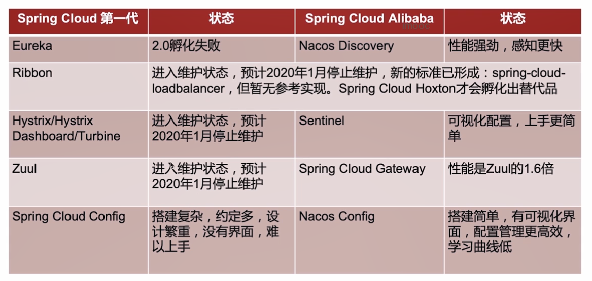

## 什么是Spring Cloud Alibaba

+ 阿里巴巴结合自身微服务实践，开源的微服务全家桶
+ 在Spring Cloud项目中孵化，很可能成为Spring Cloud第二代的标准实现
+ 在业界广泛使用，已有很多成功案例

## Spring Cloud Alibaba真实应用场景

+ 大型复杂的系统，例如大型电商系统

+ 高并发系统，例如大型门户，秒杀系统

  Spring Cloud Alibaba是去中心化的应用，有更大的负载能力

+ 需求不明确，且变更很快的系统，例如创业公司业务系统

## Spring Cloud Alibaba和Spring Cloud有什么区别和联系

简单来说Spring Cloud Alibaba是Spring Cloud的子项目，Spring Cloud Alibaba符合Spring Cloud的标准，相对于Spring Cloud第一代的实现，Spring Cloud Alibaba的优势很明显。

## Spring Cloud Alibaba优势

+ 组件性能更强
+ 良好的可视化界面
+ 搭建简单，学习曲线低
+ 文档丰富并且是中文

## IDEA配置与技巧

+ IDEA配置Maven整合

+ 快捷键技巧

  + macOS: CheatSheet

    mac安装后，长按command建可以查看当前软件的所有快捷键

  + Windows：HotKey Explorer、HotKey Commander