# API网关-SpringCloudGateway

## 一、为什么要使用网关?

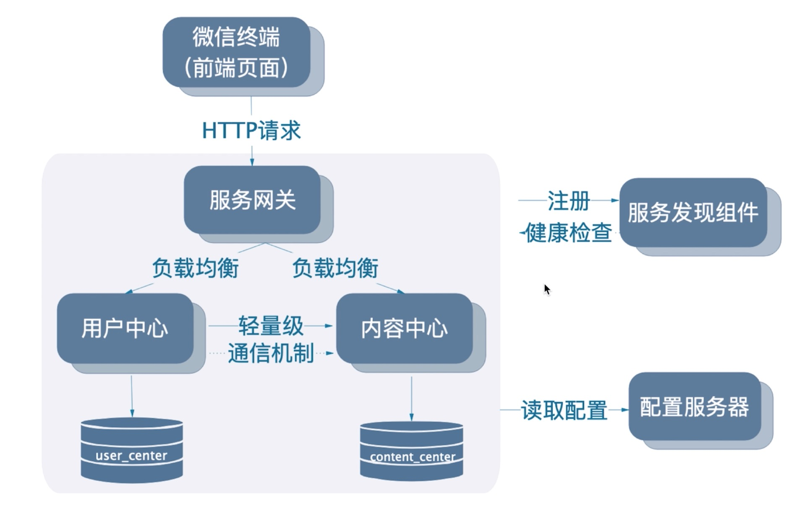

+ 在之前的构建当中，我们已经实现了服务发现，让内容中心总是能找到用户中心
+ 为内容中心整合了ribbion，实现了负载均衡
+ 讲解了feign让http的远程调用代码更加优雅
+ 讲解了sentinel，提升了应用的可用性和容错性
+ 另外还加入了mq编程模型和stream编程模型，实现了基于mq的通信

现在我们想想我们不适用网关可以么，比如下图

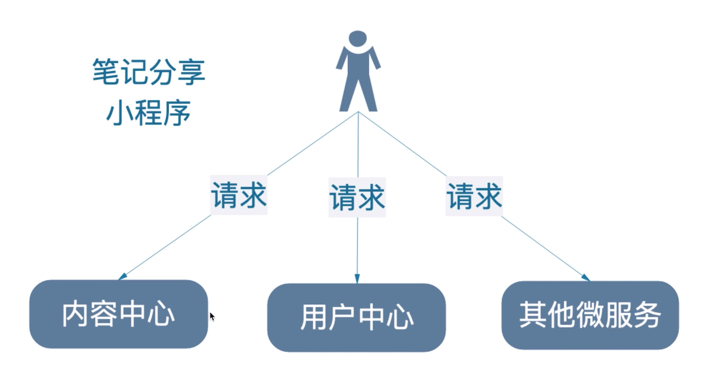

缺点：

+ 认证复杂

  每个微服务都要做登录认证，导致重构困难

+ 导致客户端难以重构

  重新划分微服务，如果客户端直接同微服务通信，可能域名都变了，那么客户端需要做大量改动

+ 协议不同，直接访问不了，比如某一个微服务的协议不一样，可能导致不能访问

所以我们需要加入网关。

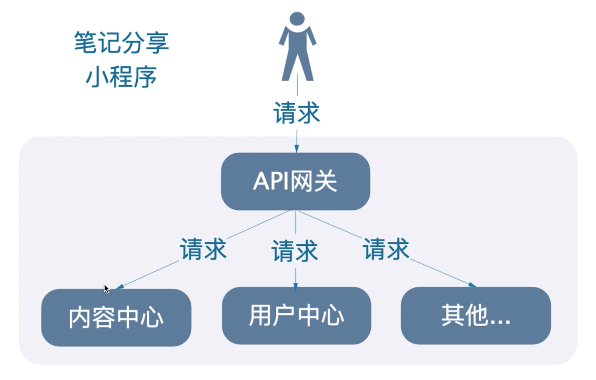

+ 这样就简化了很多，可以在网关统一认证，再把请求转发到每个微服务

+ 对外暴露永远是一个域名，这样重构的成本大大降低

+ 假设其中一个微服务用的是对浏览器不友好的协议，那么在网关上把协议转换成友好的协议。

## 二、Spring Cloud Gateway是什么？优缺点分析。

+ 是Spring Cloud的网关（第二代），未来会取代Zuul（第一代）
+ 基于Netty、Reactor以及WebFlux构建

### 优点

+ 性能强劲

  是第一代网关Zuul 1.x的1.6倍！性能pk：https://www.imooc.com/article/285068

+ 功能强大

  内置了很多实用的功能，比如转发、监控、限流等

+ 设计优雅，容易扩展

### 缺点

+ 依赖Netty与WebFlux，不是Servlet编程模型，有一定的适应成本
+ 不能在Servlet容器下工作，也不能构建成WAR包
+ 不支持Spring Boot 1.x

## 三、编写Spring Cloud Gateway

+ 新建gateway项目

+ 修改pom文件

  + 添加spring cloud alibaba依赖
  + 加上gateway和nacos的依赖
  + 加上actuator依赖
  + 确定正确的Spring Boot版本号和Spring Cloud版本号

  ```xml
  <?xml version="1.0" encoding="UTF-8"?>
  <project xmlns="http://maven.apache.org/POM/4.0.0" xmlns:xsi="http://www.w3.org/2001/XMLSchema-instance"
           xsi:schemaLocation="http://maven.apache.org/POM/4.0.0 https://maven.apache.org/xsd/maven-4.0.0.xsd">
      <modelVersion>4.0.0</modelVersion>
      <parent>
          <groupId>org.springframework.boot</groupId>
          <artifactId>spring-boot-starter-parent</artifactId>
          <version>2.1.5.RELEASE</version>
          <relativePath/> <!-- lookup parent from repository -->
      </parent>
      <groupId>com.itmuch</groupId>
      <artifactId>gateway</artifactId>
      <version>0.0.1-SNAPSHOT</version>
      <name>gateway</name>
      <description>小程序网关</description>
  
      <properties>
          <java.version>1.8</java.version>
          <spring-cloud.version>Greenwich.SR3</spring-cloud.version>
      </properties>
  
      <dependencies>
          <dependency>
              <groupId>org.springframework.cloud</groupId>
              <artifactId>spring-cloud-starter-gateway</artifactId>
          </dependency>
  
          <!--添加nacos-->
          <dependency>
              <groupId>org.springframework.cloud</groupId>
              <artifactId>spring-cloud-starter-alibaba-nacos-discovery</artifactId>
          </dependency>
          <!--actuator-->
          <dependency>
              <groupId>org.springframework.boot</groupId>
              <artifactId>spring-boot-starter-actuator</artifactId>
          </dependency>
          <dependency>
              <groupId>org.springframework.boot</groupId>
              <artifactId>spring-boot-starter-test</artifactId>
              <scope>test</scope>
              <exclusions>
                  <exclusion>
                      <groupId>org.junit.vintage</groupId>
                      <artifactId>junit-vintage-engine</artifactId>
                  </exclusion>
              </exclusions>
          </dependency>
      </dependencies>
  
      <dependencyManagement>
          <dependencies>
              <dependency>
                  <groupId>org.springframework.cloud</groupId>
                  <artifactId>spring-cloud-dependencies</artifactId>
                  <version>${spring-cloud.version}</version>
                  <type>pom</type>
                  <scope>import</scope>
              </dependency>
              <!--整合spring cloud alibaba-->
              <dependency>
                  <groupId>org.springframework.cloud</groupId>
                  <artifactId>spring-cloud-alibaba-dependencies</artifactId>
                  <version>0.9.0.RELEASE</version>
                  <type>pom</type>
                  <scope>import</scope>
              </dependency>
  
          </dependencies>
      </dependencyManagement>
  
      <build>
          <plugins>
              <plugin>
                  <groupId>org.springframework.boot</groupId>
                  <artifactId>spring-boot-maven-plugin</artifactId>
              </plugin>
          </plugins>
      </build>
  
  </project>
  ```

+ 添加注解，**没有注解**

+ 写配置

  ```yml
  server:
    port: 8040
  spring:
    application:
      name: gateway
    cloud:
      nacos:
        discovery:
          server-addr: localhost:8848
      gateway:
        discovery:
          locator:
            # 让gateway自动从服务发现组件上找到其他微服务
            enabled: true
  management:
    endpoints:
      web:
        exposure:
          include: '*'
    endpoint:
      health:
        show-details: always
  ```

+ 启动

  2.5s启动完毕，可见非常快，毕竟是基于netty的

+ 访问测试

  http://localhost:8040/user-center/users/1，确实能访问用户中心的内容

  http://localhost:8040/content-center/shares/1 也能访问到内容中心的内容

+ 转发规律

  + 访问${GATEWAY_URL}/{微服务X}/** 会转发到微服务X的/** 路径

## 四、核心概念

+ Route（路由）
  + Spring Cloud Gateway的基础元素，可简单理解成一条转发的规则。包含：ID、目标URL、Predicate集合以及FIlter集合。
+ Predicate（谓词）
  + 即java.util.function.Predicate，Spring Cloud Gateway使用Predicate实现路由的匹配条件
+ Filter（过滤器）
  + 修改请求以及响应

### 路由配置示例

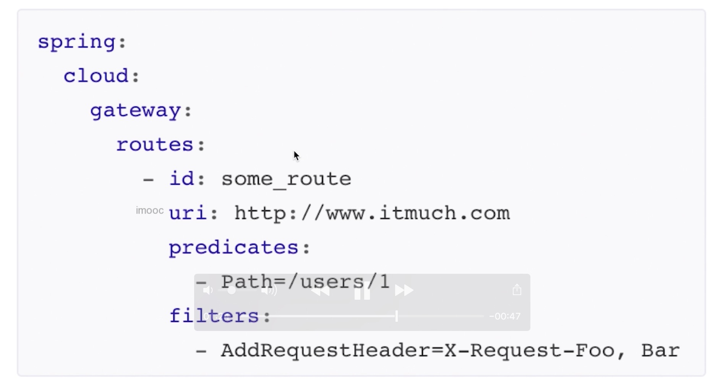


上图也就是说当访问Predicate下面的path的时候，就会进入这个路由，然后filter会为其做一些处理，然后再转发到uri上面，**但是我们并没有这么使用，而是让gateway自己通过服务发现组件去找其他微服务（上面有具体的yml配置）**

## 五、架构剖析

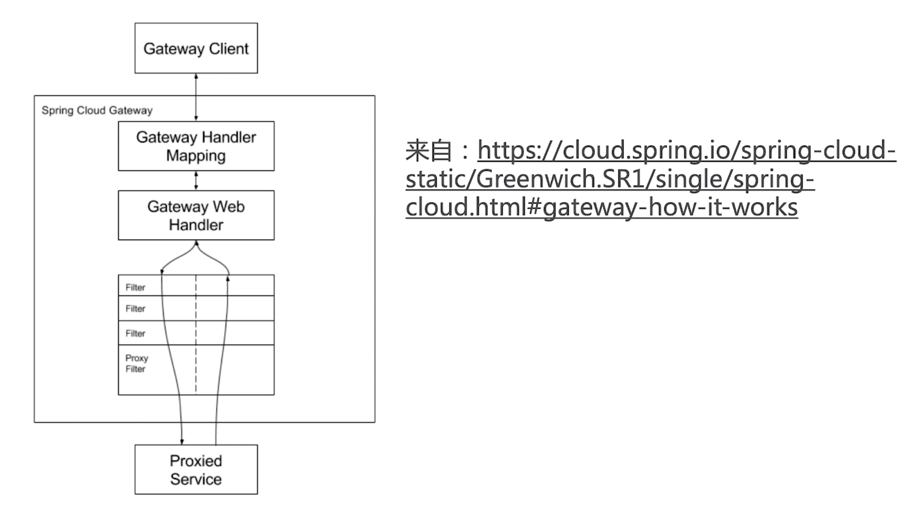

## 六、路由谓词工厂详解(Route Predicate Factories)

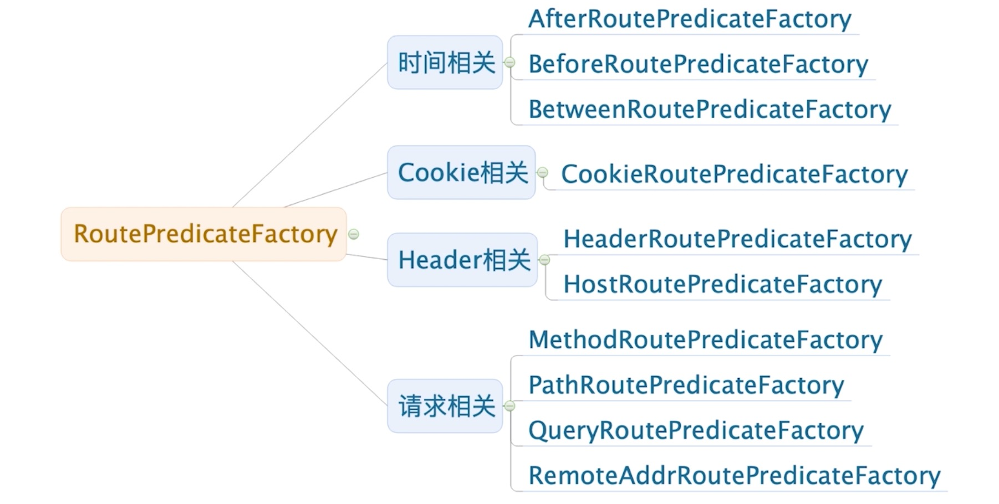

https://www.imooc.com/article/290804

上面链接里面详细记录了路由谓词工厂，下面演示一下`After`谓词

```yml
spring:
  application:
    name: gateway
  cloud:
    nacos:
      discovery:
        server-addr: localhost:8848
    gateway:
      discovery:
        locator:
          # 让gateway自动从服务发现组件上找到其他微服务
          enabled: true
      routes:
        - id: after_route
          uri: lb://user-center
          predicates:
            # 当且仅当请求时的时间After配置的时间时，才会转发到用户微服务
            # 目前配置不会进该路由配置，所以返回404
            # 将时间改成 < now的时间，则访问localhost:8040/** -> user-center/**
            # eg. 访问http://localhost:8040/users/1 -> user-center/users/1
            - After=2010-01-20T17:42:47.789-07:00[America/Denver]
```

在yml里面加入上面的配置，after的意思是`/**`时，如果当前时间超过这个时间会被转发到`user-center`这个微服务下，如果不满足就报404

比如访问：`http://localhost:8040/users/1`，如果满足就相当于访问`http://localhost:8040/user-center/users/1`，否则就是404

## 七、自定义路由谓词工厂

Spring Gateway默认给我们提供了谓词，但是并不是所有的谓词都满足我们的业务需求，比如：**早上9：00到晚上17：00之间才能访问服务**，这时默认提供的已经满足不了了，但是gateway给我们提供了自定义方式，下面我们就来实现。

+ 添加配置

  ```yml
  gateway:
    discovery:
      locator:
        # 让gateway自动从服务发现组件上找到其他微服务
        enabled: true
    routes:
      - id: after_route
        uri: lb://user-center
        predicates:
          # 当且仅当请求时的时间After配置的时间时，才会转发到用户微服务
          # 目前配置不会进该路由配置，所以返回404
          # 将时间改成 < now的时间，则访问localhost:8040/** -> user-center/**
          # eg. 访问http://localhost:8040/users/1 -> user-center/users/1
          # - After=2010-01-20T17:42:47.789-07:00[America/Denver]
          - TimeBetween=9:00, 17:00
  ```

  假设时间是9:00这样写的。

+ 创建类

  创建一个和TimeBetween名称一模一样的类`TimeBetweenRoutePredicateFactory`，**后面必须以`RoutePredicateFactory`**结尾，这是约定。

  ```java
  /**
   * 自定义谓词工厂
   * @author litian
   */
  @Component
  public class TimeBetweenRoutePredicateFactory extends AbstractRoutePredicateFactory<TimeBetweenConfig> {
      public TimeBetweenRoutePredicateFactory() {
          super(TimeBetweenConfig.class);
      }
  
      /**
       * 核心方法
       * @param config
       * @return
       */
      @Override
      public Predicate<ServerWebExchange> apply(TimeBetweenConfig config) {
          LocalTime start = config.getStart();
          LocalTime end = config.getEnd();
          return exchange -> {
              LocalTime now = LocalTime.now();
              return now.isAfter(start) && now.isBefore(end);
          };
      }
  
      /**
       * 控制配置类和配置文件的映射关系
       * @return
       */
      @Override
      public List<String> shortcutFieldOrder() {
          return Arrays.asList("start", "end");
      }
  
      /**
       * 打印当前时间，Gateway默认采用的是这种格式的时间
       * sout：下午9:55
       * @param args
       */
      public static void main(String[] args) {
          DateTimeFormatter formatter = DateTimeFormatter.ofLocalizedTime(FormatStyle.SHORT);
          System.out.println(formatter.format(LocalTime.now()));
  
      }
  }
  
  ```

  配置类

  ```java
  /**
   * 自定义配置类
   * @author litian
   */
  @Data
  public class TimeBetweenConfig {
  
      /**
       * 对应yml里面的配置
       */
      private LocalTime start;
  
      /**
       * 对应yml里面的配置
       */
      private LocalTime end;
  }
  ```

+ 注意

+ 修改时间配置

  Gateway的时间在DateTimeFormatterRegistrar这个类里面，所以在`TimeBetweenRoutePredicateFactory`里面有一个main方法打印当前时间，所以时间修改为

  ````
  - TimeBetween=上午9:00, 下午11:00
  ````

+ 测试成功

## 八、内置过滤器工厂详解

https://www.imooc.com/article/290816

### 过滤器生命周期

+ pre：Gateway转发请求之前
+ post：Gateway转发请求之后

### 自定义过滤器工厂

#### 方式一

+ 继承：AbstractGatewayFileterFactory
+ 参考示例：org.springframework.cloud.gateway.filter.factory.RequestSizeGatewayFilterFactory

+ 配置形式：

  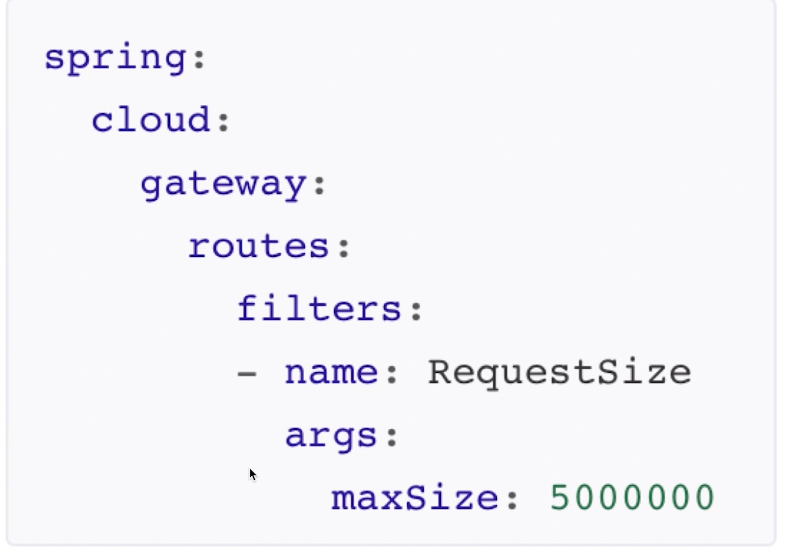

#### 方式二

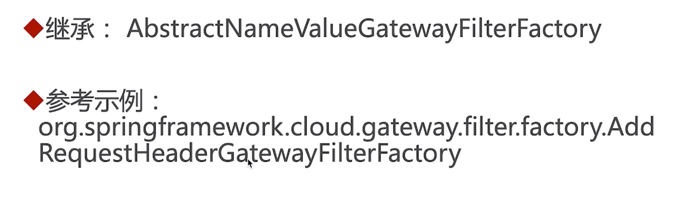

+ 配置形式：

  

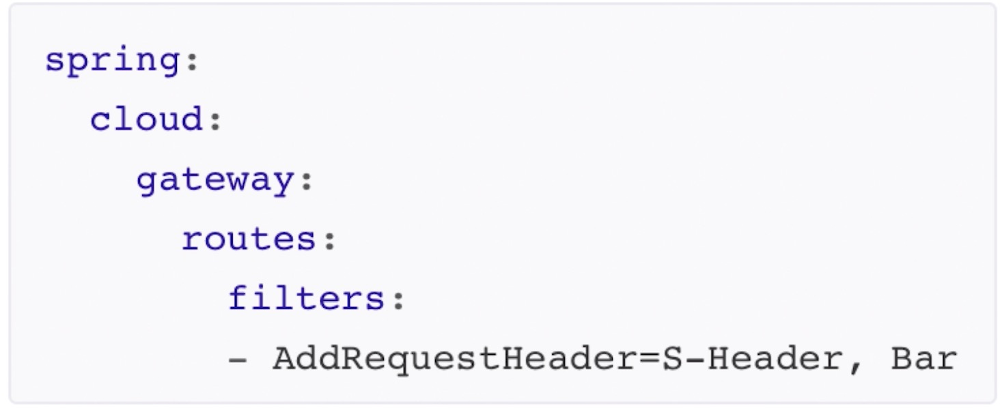

### 核心API

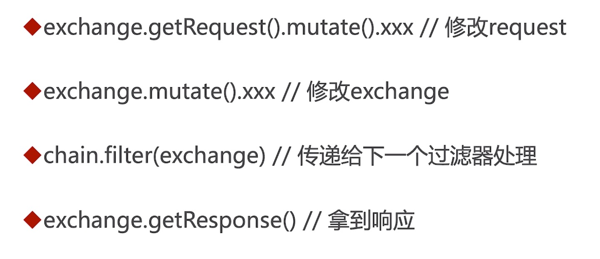

### 编写一个过滤器工厂

#### 需求

访问的时候打印日志

#### coding

```java
/**
 * @author litian
 * 注意：一定结尾要以GatewayFilterFactory这个，不然Gateway不识别
 */
@Slf4j
@Component
public class PreLogGatewayFilterFactory extends AbstractNameValueGatewayFilterFactory {


    @Override
    public GatewayFilter apply(NameValueConfig config) {
        // 这是一个小坑，对洗手不友好，日志应该放在lamda表达式里面，因为表达式里面才是我们的业务逻辑
        // log.info("请求进来了....{},{}", config.getName(), config.getValue());
        return ((exchange, chain) -> {
            log.info("请求进来了....{},{}", config.getName(), config.getValue());
            ServerHttpRequest modifiedRequest = exchange.getRequest().mutate().build();
            ServerWebExchange modifiedExchange = exchange.mutate().request(modifiedRequest).build();
            return chain.filter(modifiedExchange);
        });
    }
}
```

```yml
server:
  port: 8040
spring:
  application:
    name: gateway
  cloud:
    nacos:
      discovery:
        server-addr: localhost:8848
    gateway:
      discovery:
        locator:
          # 让gateway自动从服务发现组件上找到其他微服务
          enabled: true
      routes:
        - id: after_route
          uri: lb://user-center
          predicates:
            # 当且仅当请求时的时间After配置的时间时，才会转发到用户微服务
            # 目前配置不会进该路由配置，所以返回404
            # 将时间改成 < now的时间，则访问localhost:8040/** -> user-center/**
            # eg. 访问http://localhost:8040/users/1 -> user-center/users/1
            # - After=2010-01-20T17:42:47.789-07:00[America/Denver]
            - TimeBetween=上午9:00, 下午11:00
          filters:
            - PreLog=a, b
```

访问一个链接测试

````java
020-02-10 09:34:58.708  INFO 1048 --- [ctor-http-nio-2] c.i.gateway.PreLogGatewayFilterFactory   : 请求进来了....a,b
2020-02-10 09:34:59.247  INFO 1048 --- [erListUpdater-0] c.netflix.config.ChainedDynamicProperty  : Flipping property: user-center.ribbon.ActiveConnectionsLimit to use NEXT property: niws.loadbalancer.availabilityFilteringRule.activeConnectionsLimit = 2147483647
````

成功打印了信息

## 九、全局过滤器

上面的过滤器主要是针对指定路由，这儿来讨论全局过滤器，Gateway默认提供了很多的全局过滤器，这儿有一篇手记里面有详细记述：

https://www.imooc.com/article/290821

## 十、Spring Cloud Gateway监控

欢迎加入Spring Cloud Gateway监控豪华套餐——

只要为Spring Cloud Gateway添加Spring Boot Actuator（ `spring-boot-starter-actuator` ）的依赖，并将 `gateway` 端点暴露，即可获得若干监控端点，监控 & 操作Spring Cloud Gateway的方方面面。

```yaml
management:
  endpoints:
    web:
      exposure:
        # 当然暴露'*' 更好啦..
        include: gateway
```

监控端点一览表：

> **TIPS**
> 以下所有端点都挂在`/actuator/gateway/` 下面。
> 例如：`routes` 的全路径是 `/actuator/gateway/routes` ，以此类推。

| ID              | HTTP Method        | Description                                     |
| :-------------- | :----------------- | :---------------------------------------------- |
| `globalfilters` | GET                | 展示所有的全局过滤器                            |
| `routefilters`  | GET                | 展示所有的过滤器工厂（GatewayFilter factories） |
| `refresh`       | POST【无消息体】   | 清空路由缓存                                    |
| `routes`        | GET                | 展示路由列表                                    |
| `routes/{id}`   | GET                | 展示指定id的路由的信息                          |
| `routes/{id}`   | POST【消息体如下】 | 新增一个路由                                    |
| `routes/{id}`   | DELETE【无消息体】 | 删除一个路由                                    |

其中，要想动态添加路由配置，只需发送POST请求，消息体如下：

```json
{
  "predicates": [
    {
      "name": "Path",
      "args": {
        "_genkey_0": "/test"
      }
    }
  ],
  "filters": [
    {
      "name": "AddRequestHeader",
      "args": {
        "_genkey_0": "X-Request-Foo",
        "_genkey_1": "Bar"
      }
    },
    {
      "name": "PreLog",
      "args": {
        "_genkey_0": "a",
        "_genkey_1": "b"
      }
    }
  ],
  "uri": "https://www.itmuch.com",
  "order": 0
}
```

> **TIPS**
>
> 技巧：消息体其实是有规律的，你可以先在配置文件中配置一个路由规则，然后访问`${GATEWAY_URL}/actuator/gateway/routes` 端点，每个路由id的对应段落，就是你的消息体啦。

如使用 `POSTMAN` 测试，可配置如下：


操作完成后，可再次访问 `${GATEWAY_URL}/actuator/gateway/routes` 端点，可以看到，新的路由已被动态添加了。

> **TIPS**
>
> 如果没有实时生效，使用refresh端点刷新一下路由信息即可。

## 十一、Spring Cloud Gateway排错、调试技巧总结

2019.08.11 01:18 1489浏览

本文总结Spring Cloud Gateway的排错、调试技巧。**欢迎留言补充！**

### 第一式：Actuator监控端点

借助Actuator的监控端点，可分析全局过滤器、过滤器工厂、路由详情。详见：[Spring Cloud Gateway监控](http://www.itmuch.com/spring-cloud-gateway/spring-cloud-gateway-actuator/)

### 第二式：日志

加日志，按需将如下包的日志级别设置成 `debug` 或 `trace` ，总有一款对你有用。

- `org.springframework.cloud.gateway`
- `org.springframework.http.server.reactive`
- `org.springframework.web.reactive`
- `org.springframework.boot.autoconfigure.web`
- `reactor.netty`
- `redisratelimiter`

配置示例：

```yaml
logging:
  level:
    org.springframework.cloud.gateway: trace
```

### 第三式：Wiretap【从Greenwich SR3及更高版本才会支持】

Reactor Netty `HttpClient` 以及 `HttpServer` 可启用 `Wiretap` 。将`reactor.netty` 包设置成 `debug` 或 `trace` ，然后设置如下属性：

- `spring.cloud.gateway.httpserver.wiretap=true`
- `spring.cloud.gateway.httpclient.wiretap=true`

分别开启HttpServer及HttpClient的Wiretap。

然后，就可以分析日志啦。

> **TIPS**
>
> - 相关Issue: https://github.com/spring-cloud/spring-cloud-gateway/issues/1194
> - wiretap其实是Reactor Netty的概念，作用是，打印对端之间的流量详情，相关文档：
>   - [HttpClient的Wire Logger](https://projectreactor.io/docs/netty/milestone/reference/index.html#_wire_logger_2)
>   - [HttpServer的Wire Logger](https://projectreactor.io/docs/netty/milestone/reference/index.html#_wire_logger)

## 十二、进阶：过滤器执行顺序

+ 结论一：Order越小越靠前执行

+ 结论二：过滤器工厂的Order按配置顺序从1开始递增

  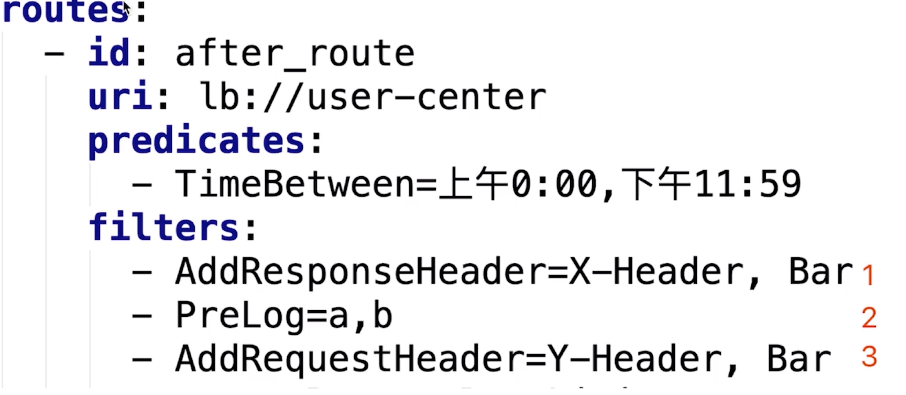

+ 结论三：如果配置了默认过滤器，则先执行相同order的默认过滤器

  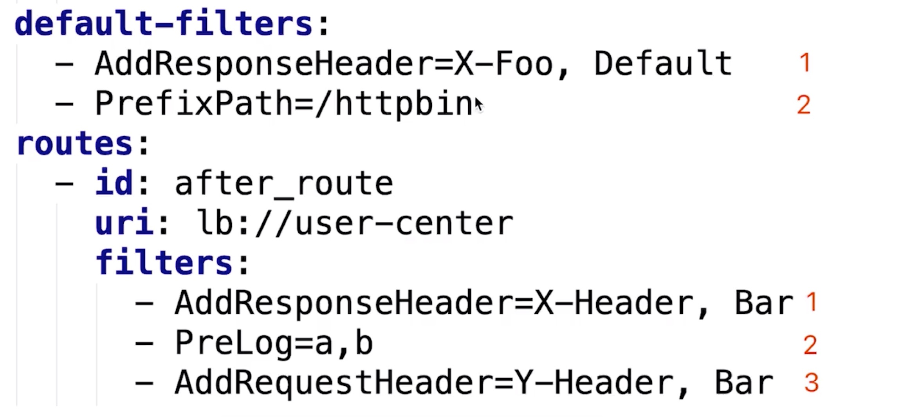

+ 结论四：如需自行控制Order，可返回OrderedGatewayFilter

  ```java
  @Override
  public GatewayFilter apply(NameValueConfig config) {
      // 这是一个小坑，对洗手不友好，日志应该放在lamda表达式里面，因为表达式里面才是我们的业务逻辑
      // log.info("请求进来了....{},{}", config.getName(), config.getValue());
      GatewayFilter gatewayFilter = ((exchange, chain) -> {
          log.info("请求进来了....{},{}", config.getName(), config.getValue());
          ServerHttpRequest modifiedRequest = exchange.getRequest().mutate().build();
          ServerWebExchange modifiedExchange = exchange.mutate().request(modifiedRequest).build();
          return chain.filter(modifiedExchange);
      });
      return new OrderedGatewayFilter(gatewayFilter, 1000000);
  }
  ```

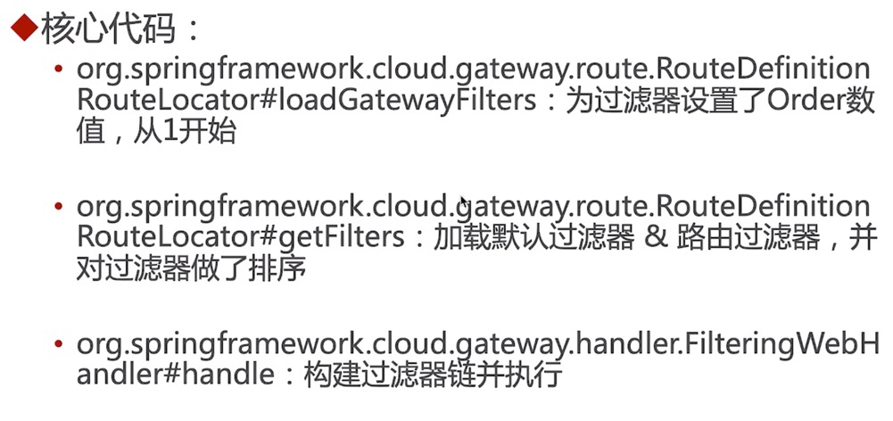

## 十三、网关限流

Spring Cloud Gatway内置的 `RequestRateLimiterGatewayFilterFactory` 提供限流的能力，基于令牌桶算法实现。目前，它内置的 `RedisRateLimiter` ，依赖Redis存储限流配置，以及统计数据。当然你也可以实现自己的RateLimiter，只需实现 `org.springframework.cloud.gateway.filter.ratelimit.RateLimiter` 接口，或者继承 `org.springframework.cloud.gateway.filter.ratelimit.AbstractRateLimiter` 。

> **漏桶算法**：
>
> 想象有一个水桶，水桶以一定的速度出水（以一定速率消费请求），当水流速度过大水会溢出（访问速率超过响应速率，就直接拒绝）。
>
> 漏桶算法的两个变量：
>
> - 水桶漏洞的大小：rate
> - 最多可以存多少的水：burst
>
> **令牌桶算法**：
>
> 系统按照恒定间隔向水桶里加入令牌（Token），如果桶满了的话，就不加了。每个请求来的时候，会拿走1个令牌，如果没有令牌可拿，那么就拒绝服务。
>
> **TIPS**
>
> - Redis Rate Limiter的实现基于这篇文章： [Stripe](https://stripe.com/blog/rate-limiters)
> - Spring官方引用的令牌桶算法文章： [Token Bucket Algorithm](https://en.wikipedia.org/wiki/Token_bucket) ，有兴趣可以看看。

### 写代码

- 加依赖：

  ```xml
  <dependency>
      <groupId>org.springframework.boot</groupId>
      <artifactId>spring-boot-starter-data-redis-reactive</artifactId>
  </dependency>
  ```

- 写配置：

  ```yaml
  spring:
    cloud:
      gateway:
        routes:
          - id: after_route
            uri: lb://user-center
            predicates:
              - TimeBetween=上午0:00,下午11:59
            filters:
              - AddRequestHeader=X-Request-Foo, Bar
              - name: RequestRateLimiter
                args:
                  # 令牌桶每秒填充平均速率
                  redis-rate-limiter.replenishRate: 1
                  # 令牌桶的上限
                  redis-rate-limiter.burstCapacity: 2
                  # 使用SpEL表达式从Spring容器中获取Bean对象
                  key-resolver: "#{@pathKeyResolver}"
    redis:
      host: 127.0.0.1
      port: 6379
  ```

- 写代码：按照X限流，就写一个针对X的KeyResolver。

  ```java
  @Configuration
  public class Raonfiguration {
      /**
       * 按照Path限流
       *
       * @return key
       */
      @Bean
      public KeyResolver pathKeyResolver() {
          return exchange -> Mono.just(
              exchange.getRequest()
                  .getPath()
                  .toString()
          );
      }
  }
  ```

- 这样，限流规则即可作用在路径上。

  ```properties
  例如：
  # 访问：http://${GATEWAY_URL}/users/1，对于这个路径，它的redis-rate-limiter.replenishRate = 1，redis-rate-limiter.burstCapacity = 2；
  # 访问：http://${GATEWAY_URL}/shares/1，对这个路径，它的redis-rate-limiter.replenishRate = 1，redis-rate-limiter.burstCapacity = 2；
  ```

### 测试

持续高速访问某个路径，速度过快时，返回 `HTTP ERROR 429` 。

### 拓展

你也可以实现针对用户的限流：

```java
@Bean
public KeyResolver userKeyResolver() {
    return exchange -> Mono.just(exchange.getRequest().getQueryParams().getFirst("user"));
}
预览
```

针对来源IP的限流：

```java
@Bean
public KeyResolver ipKeyResolver() {
  return exchange -> Mono.just(
    exchange.getRequest()
    .getHeaders()
    .getFirst("X-Forwarded-For")
  );
}
```

## 十四、总结

+ 路由、路由谓词工厂、过滤器工厂、全局过滤器...
+ 网关集大成
  + 注册到了Nacos上面，所以会自动去Nacos上面找服务，然后自动反向代理
  + 集成了Ribbon
  + 容错（默认是Hystrix，也可以使用Sentinel）
+ 

