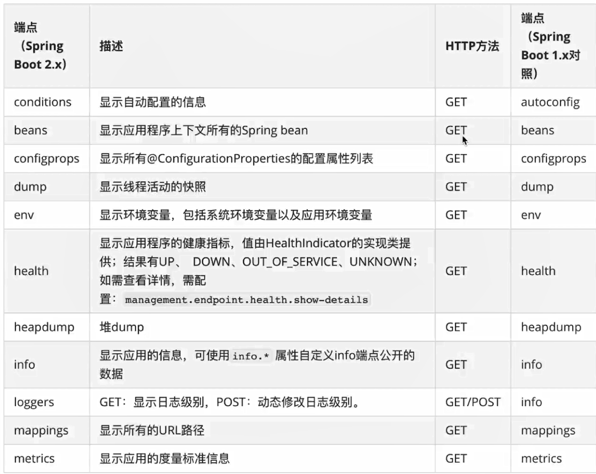

## Spring Boot Actuator

+ `/health` 作用:健康检查
  + status: 
    + UP：正常
    + DOWN： 遇到了问题，不正常
    + OUT_OF_Service：资源未在使用，或者不该去使用
    + UNKNOW：不知道

+ `info` 应用描述信息

  `````
  info.app-name = xxxxx
  .....
  `````

+ 常用端点：

  

## Spring Boot配置管理

+ 配置文件
  + application.yml
+ 环境变量
  + 在yml里面使用${xxx}来引入，idea启动的时候修改属性，在environment里面添加上对应的配置
  + 如果打包jar，需要跳过test`-DskipTests` 然后执行`java -jar xxxx.jar --XXX=XXX`的方式来加上环境变量
+ 外部化配置
  + 将打好的jar包和配置文件application.yml放在同一个文件夹下，直接命令行启动就行了，程序将把同文件夹下的配置文件作为配置文件使用
+ 命令化参数
  + `java -jar xxxx.jar --server.port = 8081`来启动

