## 单体架构

### 单体架构的优点

+ 架构简单
+ 开发、测试、部署方便

### 单体架构的缺点

+ 复杂性高

+ 部署慢、频率低

+ 扩展能力受限

  比如某个模块是IO密集任务，如果想加内存，只能加整个服务器的内存，而有些模块并不需要这么多内存。

+ 阻碍技术应用创新

  更改技术选型需要整个替换

## 微服务定义

略....

## 微服务的特性

+ 每个微服务可独立运行在自己的进程里

+ 一系列独立运行的微服务共同构建起整个系统

+ 每个服务为独立的业务开发，一个微服务只关注某个特定的功能，例如订单管理、用户管理等

+ 可以使用不同的语言和数据存储技术（契合项目情况和团队实力）

+ 微服务之间通过轻量的通信机制进行通信，例如通过REST API进行调用

  例如在SOA时代的web service就不是轻量的，soap包含了很多东西，比较笨重

+ 全自动的部署机制

## 微服务全景架构图

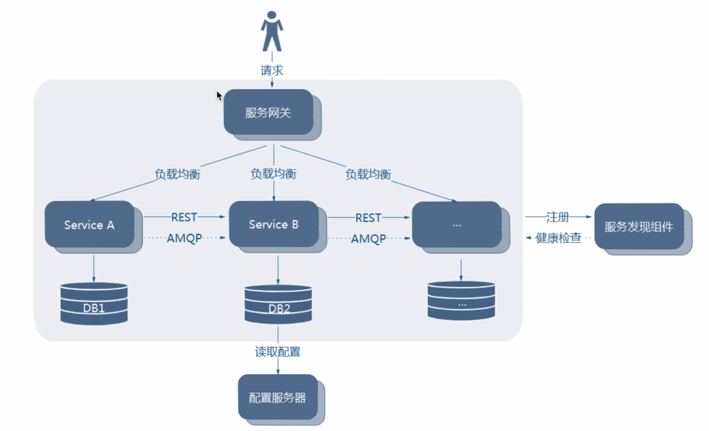

## 微服务的优点

+ 单个服务更易于开发、维护

+ 单个微服务启动较快

+ 局部修改容易部署

+ 技术栈不受限

+ 按需伸缩

  CPU密集迁移到更好的CPU机器上，IO密集可以迁移到内存更大的机器上

## 微服务的缺点

+ 运维要求高

+ 分布式固有的复杂性

  比如分布式事务

+ 重复劳动

  Java语言的话可以通用jar包，但是不同语言很难公用，所有会有重复劳动

## 微服务的适用场景

+ 大型、复杂的项目

+ 有快速迭代的需求

+ 访问压力大

  微服务很大的好处是去中心化：把业务拆开了，把数据库拆开了，这样程序的吞吐量会好很多

## 微服务不适用的场景

+ 业务稳定
+ 迭代周期长

## 微服务拆分

### 方法论

+ 领域驱动设计（DDD）

  DDD强调重视建模，强调不同工种是用同一沟通语言，比如使用UML

+ 面向对象

  通过状态(`by name`)和行为(`by verb`)进行拆分

### 心得

+ 按职责划分

  比如订单微服务只处理订单，库存只处理库存

+ 通用性划分

  把一些通用性功能做成微服务：比如用户中心，消息中心

  阿里现在推出的大中台也是一种通用性划分，中台是多个微服务组成的服务

### 合理的粒度

+ 良好地满足业务

+ 幸福感

  团队没有人认为微服务太大，难以维护，且部署高效

+ 增量迭代

  迭代只涉及到相对有限的微服务

+ 持续进化

  当需要重做并更换技术选型时，能保证风险可控

## 小程序

### 小程序拆分

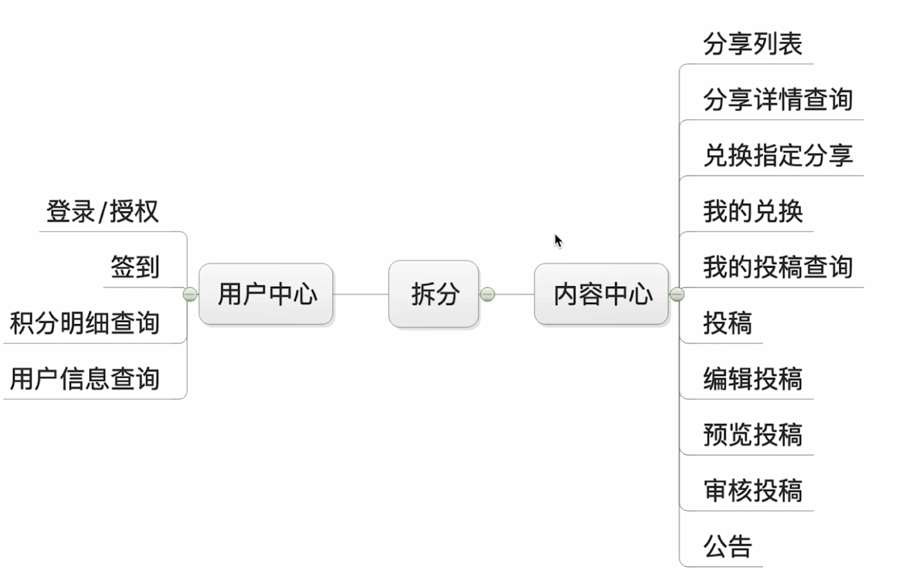

### 小程序项目架构图

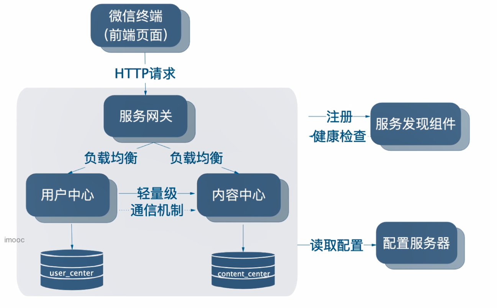

### 数据库设计

#### 数据建模

1. 使用`Mysql Workbeanch`建模

   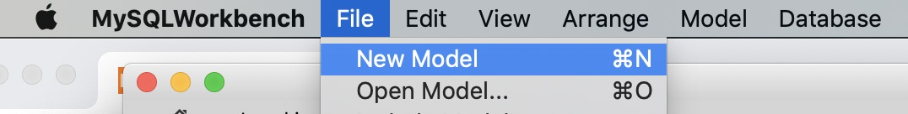

   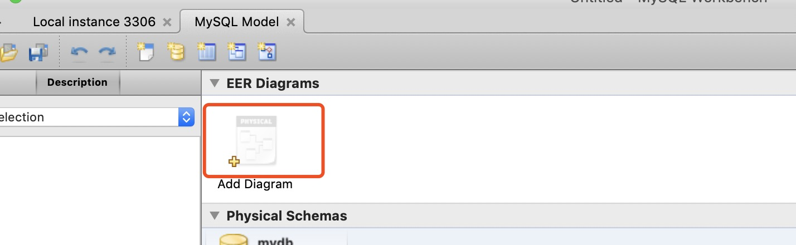

2. 创建一张用户表

   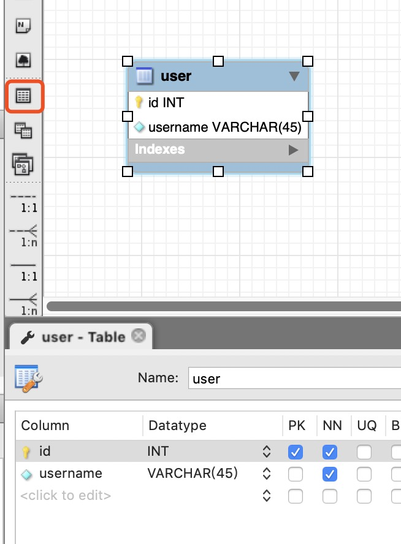

   

3. 创建一张积分表，并和user表外键关联

   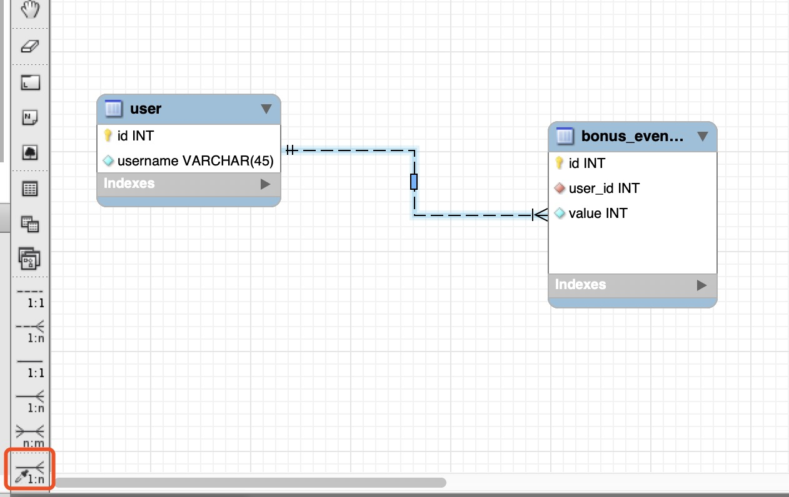

4. 整个项目的建模

   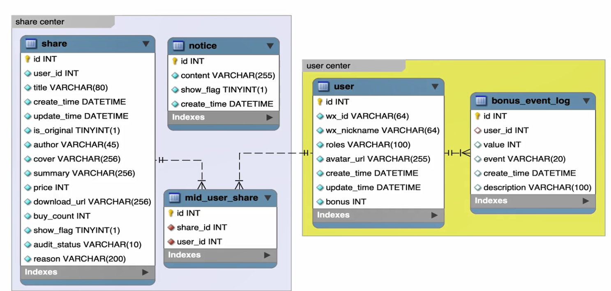

#### 建表

`Mysql Workbeanch`支持将建模内容导出到sql语句

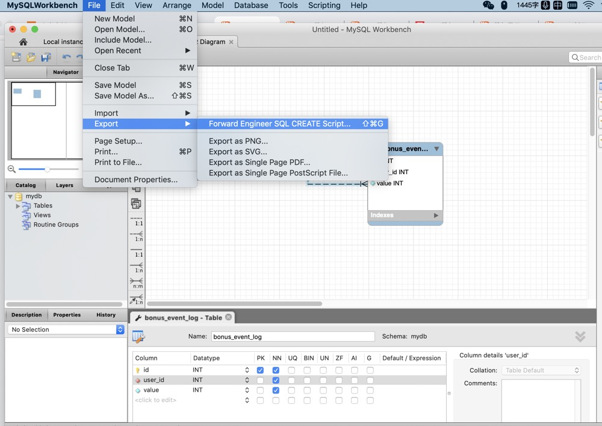

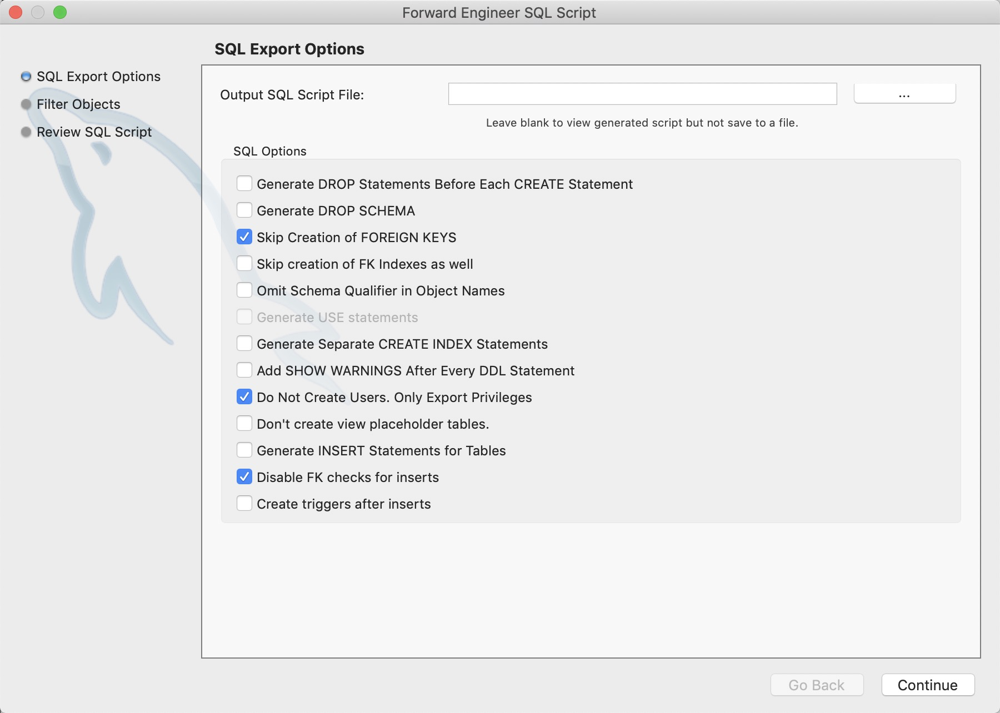

接下来就把建模好的表结果导出来，这里有两个服务，即用户中心`user_center`以及内容中心`content_center`，所以在导出的时候需要选择指定的表导出到sql语句中。

#### 创建数据库

在idea中连接数据库，打开新的console窗口。

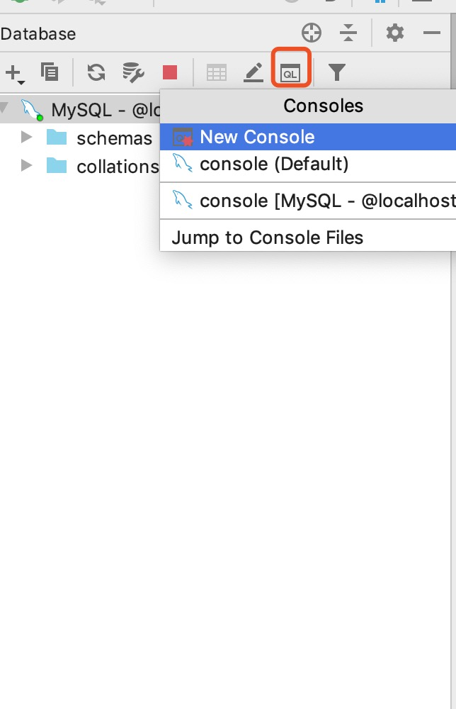

````sql
create database user_center;
create database content_center;
````

#### 导入sql语句

这儿选择比较简单的方式，直接把创建表的sql语句贴进来执行。

##### User_center

````sql
USE `user_center`;

-- -----------------------------------------------------
-- Table `user`
-- -----------------------------------------------------
CREATE TABLE IF NOT EXISTS `user` (
  `id` INT NOT NULL AUTO_INCREMENT COMMENT 'Id',
  `wx_id` VARCHAR(64) NOT NULL DEFAULT '' COMMENT '微信id',
  `wx_nickname` VARCHAR(64) NOT NULL DEFAULT '' COMMENT '微信昵称',
  `roles` VARCHAR(100) NOT NULL DEFAULT '' COMMENT '角色',
  `avatar_url` VARCHAR(255) NOT NULL DEFAULT '' COMMENT '头像地址',
  `create_time` DATETIME NOT NULL COMMENT '创建时间',
  `update_time` DATETIME NOT NULL COMMENT '修改时间',
  `bonus` INT NOT NULL DEFAULT 300 COMMENT '积分',
  PRIMARY KEY (`id`))
COMMENT = '用户表';


-- -----------------------------------------------------
-- Table `bonus_event_log`
-- -----------------------------------------------------
CREATE TABLE IF NOT EXISTS `bonus_event_log` (
  `id` INT NOT NULL AUTO_INCREMENT COMMENT 'Id',
  `user_id` INT NULL COMMENT 'user.id',
  `value` INT NULL COMMENT '积分操作值',
  `event` VARCHAR(20) NULL COMMENT '发生的事件',
  `create_time` DATETIME NULL COMMENT '创建时间',
  `description` VARCHAR(100) NULL COMMENT '描述',
  PRIMARY KEY (`id`),
  INDEX `fk_bonus_event_log_user1_idx` (`user_id` ASC) )
ENGINE = InnoDB
COMMENT = '积分变更记录表';
````


##### Content_center

````sql
USE `content_center`;

-- -----------------------------------------------------
-- Table `share`
-- -----------------------------------------------------
CREATE TABLE IF NOT EXISTS `share` (
  `id` INT NOT NULL AUTO_INCREMENT COMMENT 'id',
  `user_id` INT NOT NULL DEFAULT 0 COMMENT '发布人id',
  `title` VARCHAR(80) NOT NULL DEFAULT '' COMMENT '标题',
  `create_time` DATETIME NOT NULL COMMENT '创建时间',
  `update_time` DATETIME NOT NULL COMMENT '修改时间',
  `is_original` TINYINT(1) NOT NULL DEFAULT 0 COMMENT '是否原创 0:否 1:是',
  `author` VARCHAR(45) NOT NULL DEFAULT '' COMMENT '作者',
  `cover` VARCHAR(256) NOT NULL DEFAULT '' COMMENT '封面',
  `summary` VARCHAR(256) NOT NULL DEFAULT '' COMMENT '概要信息',
  `price` INT NOT NULL DEFAULT 0 COMMENT '价格（需要的积分）',
  `download_url` VARCHAR(256) NOT NULL DEFAULT '' COMMENT '下载地址',
  `buy_count` INT NOT NULL DEFAULT 0 COMMENT '下载数 ',
  `show_flag` TINYINT(1) NOT NULL DEFAULT 0 COMMENT '是否显示 0:否 1:是',
  `audit_status` VARCHAR(10) NOT NULL DEFAULT 0 COMMENT '审核状态 NOT_YET: 待审核 PASSED:审核通过 REJECTED:审核不通过',
  `reason` VARCHAR(200) NOT NULL DEFAULT '' COMMENT '审核不通过原因',
  PRIMARY KEY (`id`))
ENGINE = InnoDB
COMMENT = '分享表';


-- -----------------------------------------------------
-- Table `mid_user_share`
-- -----------------------------------------------------
CREATE TABLE IF NOT EXISTS `mid_user_share` (
  `id` INT NOT NULL AUTO_INCREMENT,
  `share_id` INT NOT NULL COMMENT 'share.id',
  `user_id` INT NOT NULL COMMENT 'user.id',
  PRIMARY KEY (`id`),
  INDEX `fk_mid_user_share_share1_idx` (`share_id` ASC) ,
  INDEX `fk_mid_user_share_user1_idx` (`user_id` ASC) )
ENGINE = InnoDB
COMMENT = '用户-分享中间表【描述用户购买的分享】';


-- -----------------------------------------------------
-- Table `notice`
-- -----------------------------------------------------
CREATE TABLE IF NOT EXISTS `notice` (
  `id` INT NOT NULL AUTO_INCREMENT COMMENT 'id',
  `content` VARCHAR(255) NOT NULL DEFAULT '' COMMENT '内容',
  `show_flag` TINYINT(1) NOT NULL DEFAULT 0 COMMENT '是否显示 0:否 1:是',
  `create_time` DATETIME NOT NULL COMMENT '创建时间',
  PRIMARY KEY (`id`));
````

这样一来表就创建完成了

### API文档

https://t.itmuch.com/doc.html

### 如何创建小程序

#### 注册账号

1. 访问[https://mp.weixin.qq.com](https://mp.weixin.qq.com)

2. 注册账号，选择小程序

   

3. 注册成功后，拿到小程序id

   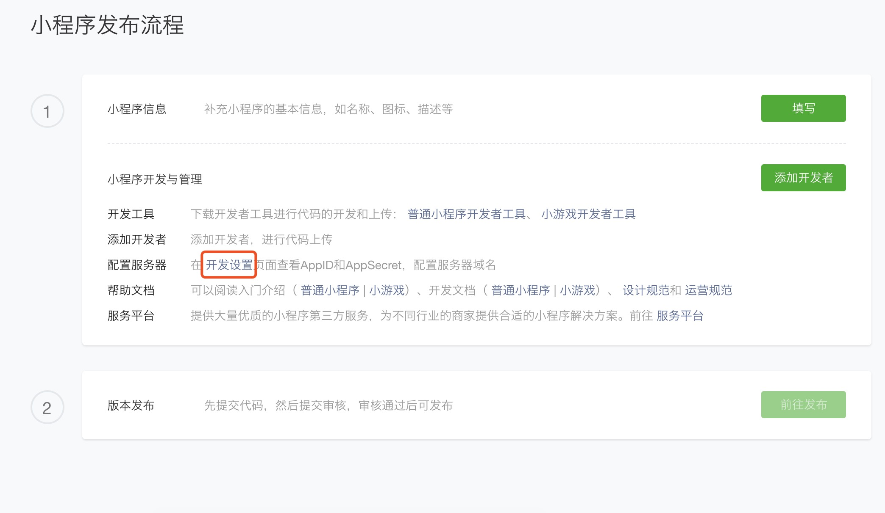

   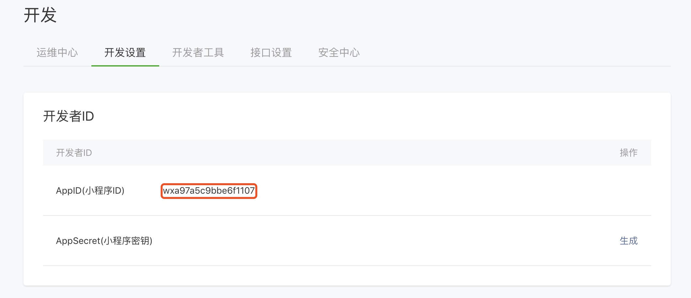

   以后会一直用到这个id

    `wxa97a5c9bbe6f1107`

### 前端代码如何使用

代码地址：https://github.com/eacdy/itmuch-miniapp

#### 1. 安装Node.js

前端代码使用的Node.js版本是`v8.15.0`，建议保持一致，至于Node.js的安装这儿省略，请借助搜索引擎的力量。

#### 2.下载本仓库代码

可使用Git下载，也可以直接下载本仓库压缩包，二选一即可。

**方式一、使用Git下载代码**

```
git clone https://github.com/eacdy/itmuch-miniapp.git
```

**方式二、用浏览器直接访问如下地址，下载代码**

>  https://github.com/eacdy/itmuch-miniapp/archive/master.zip

#### 3. 修改app信息

修改 `project.config.json` ，按需修改如下两行

```
"appid": "修改为你的appid", // 这里提供一个给大家测试：wx5398457df5368458
"projectname": "修改为你的项目名称，尽量用英文",
```

#### 4. 安装 & 启动前端代码

```
# 安装项目相关依赖
npm install
# 加速：
npm --registry https://registry.npm.taobao.org install

# 开发环境启动部署
npm run dev

# 生产环境构建
npm run build

# 其他，可参考：http://mpvue.com/build/
```

#### 5. 下载 & 安装微信开发者工具

- 前往 https://developers.weixin.qq.com/miniprogram/dev/devtools/download.html 下载开发者工具。
- 安装开发者工具，安装稳定版。

#### 6. 修改调用API地址

找到`src/utils/api.js` ，找到

```
// 后端接口基础路径
export const BASE_API_URL = '';
```

将其修改为你的后端地址，例如：

```
export const BASE_API_URL = 'http://localhost:8080';
```

#### 7. 将代码导入到开发者工具

注意：**务必勾选 `不校验合法域名...` 。**


### 创建项目

#### 技术选型

+ Spring Boot（快速开发）
+ Spring MVC（MVC框架）
+ Mybatis（持久层框架，操作数据库）+ 通用Mapper
+ Spring Cloud Aliababa（分布式）

#### 工程结构规划

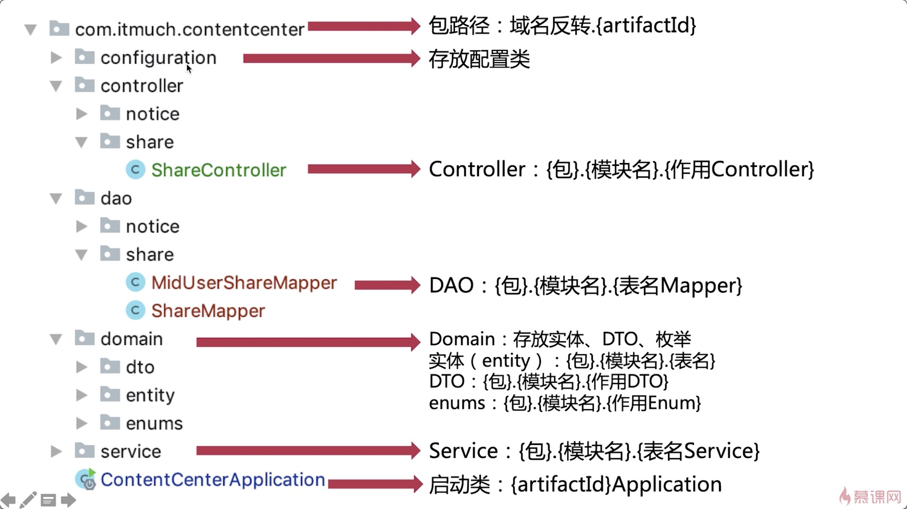

#### 创建项目、整合框架

先创建user-center项目，content-center类似

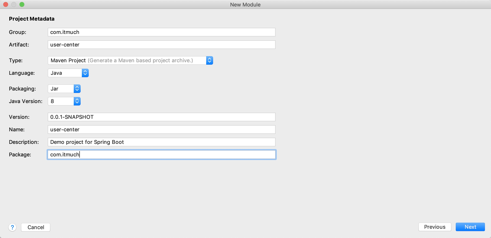

```xml
<?xml version="1.0" encoding="UTF-8"?>
<project xmlns="http://maven.apache.org/POM/4.0.0" xmlns:xsi="http://www.w3.org/2001/XMLSchema-instance"
         xsi:schemaLocation="http://maven.apache.org/POM/4.0.0 https://maven.apache.org/xsd/maven-4.0.0.xsd">
    <modelVersion>4.0.0</modelVersion>
    <parent>
        <groupId>org.springframework.boot</groupId>
        <artifactId>spring-boot-starter-parent</artifactId>
        <version>2.0.1.RELEASE</version>
        <relativePath/> <!-- lookup parent from repository -->
    </parent>
    <groupId>com.itmuch</groupId>
    <artifactId>user-center</artifactId>
    <version>0.0.1-SNAPSHOT</version>
    <name>user-center</name>
    <description>Demo project for Spring Boot</description>

    <repositories>
        <repository>
            <id>alimaven</id>
            <name>aliyun maven</name>
            <url>http://maven.aliyun.com/nexus/content/groups/public/</url>
            <releases>
                <enabled>true</enabled>
            </releases>
            <snapshots>
                <enabled>false</enabled>
            </snapshots>
        </repository>
    </repositories>

    <properties>
        <java.version>1.8</java.version>
    </properties>

    <dependencies>

        <dependency>
            <groupId>org.springframework.boot</groupId>
            <artifactId>spring-boot-starter-web</artifactId>
        </dependency>

        <dependency>
            <groupId>org.mybatis.spring.boot</groupId>
            <artifactId>mybatis-spring-boot-starter</artifactId>
            <version>2.0.1</version>
        </dependency>

        <dependency>
            <groupId>mysql</groupId>
            <artifactId>mysql-connector-java</artifactId>
            <scope>runtime</scope>
        </dependency>
        <dependency>
            <groupId>org.springframework.boot</groupId>
            <artifactId>spring-boot-starter-test</artifactId>
            <scope>test</scope>
            <exclusions>
                <exclusion>
                    <groupId>org.junit.vintage</groupId>
                    <artifactId>junit-vintage-engine</artifactId>
                </exclusion>
            </exclusions>
        </dependency>
    </dependencies>

    <build>
        <plugins>
            <plugin>
                <groupId>org.springframework.boot</groupId>
                <artifactId>spring-boot-maven-plugin</artifactId>
            </plugin>
        </plugins>
    </build>

</project>
```

#### 使用通用Mapper

通用Mapper是一款很方便的插件，解决了Mybatis不能像JPA那样可以增删改查的简易操作，避免了大量的代码，详细地址在`https://github.com/abel533/Mapper`

更换mybatis依赖，换成通用mapper的依赖

```xml
<dependency>
    <groupId>tk.mybatis</groupId>
    <artifactId>mapper-spring-boot-starter</artifactId>
    <version>2.1.5</version>
</dependency>
```

加上`@MapperScan`的注解，注意是tk包下面的

```java
@SpringBootApplication
// 扫描对应包下面mybatis接口
@MapperScan(value = "com.itmuch")
public class UserCenterApplication {

    public static void main(String[] args) {
        SpringApplication.run(UserCenterApplication.class, args);
    }

}
```

配置：

```yml
spring:
  datasource:
    url: jdbc:mysql://localhost:3306/user_center?useSSL=true
    hikari:
      username: root
      password: root
      # com.mysql.jdbc.Driver，如果connector的版本是5.x版本
      # 6.x或者以上的版本就要带上cj
      driver-class-name: com.mysql.jdbc.Driver
server:
  port: 1000
```

在项目路径下执行` mvn clean install`，确保依赖能正常加载。然后再启动

#### 通用Mapper专用代码生成器

#####  使用Maven执行MBG

```xml
<plugins>
  <plugin>
    <artifactId>maven-compiler-plugin</artifactId>
    <configuration>
      <source>${jdk.version}</source>
      <target>${jdk.version}</target>
    </configuration>
  </plugin>
  <plugin>
    <groupId>org.mybatis.generator</groupId>
    <artifactId>mybatis-generator-maven-plugin</artifactId>
    <version>1.3.6</version>
    <configuration>
      <configurationFile>
        ${basedir}/src/main/resources/generator/generatorConfig.xml
      </configurationFile>
      <overwrite>true</overwrite>
      <verbose>true</verbose>
    </configuration>
    <dependencies>
      <dependency>
        <groupId>mysql</groupId>
        <artifactId>mysql-connector-java</artifactId>
        <version>5.1.29</version>
      </dependency>
      <dependency>
        <groupId>tk.mybatis</groupId>
        <artifactId>mapper</artifactId>
        <version>4.0.0</version>
      </dependency>
    </dependencies>
  </plugin>
</plugins>
```

idea里面已经内置了，在我们的项目里面只需要加上下面的部分就行了，所以会有

```xml
<build>
    <plugins>
        <plugin>
            <groupId>org.springframework.boot</groupId>
            <artifactId>spring-boot-maven-plugin</artifactId>
        </plugin>
        <!--通用mapper自定代码生成-->
        <plugin>
            <groupId>org.mybatis.generator</groupId>
            <artifactId>mybatis-generator-maven-plugin</artifactId>
            <version>1.3.6</version>
            <configuration>
                <configurationFile>
                    ${basedir}/src/main/resources/generator/generatorConfig.xml
                </configurationFile>
                <overwrite>true</overwrite>
                <verbose>true</verbose>
            </configuration>
            <dependencies>
                <dependency>
                    <groupId>mysql</groupId>
                    <artifactId>mysql-connector-java</artifactId>
                    <version>5.1.29</version>
                </dependency>
                <dependency>
                    <groupId>tk.mybatis</groupId>
                    <artifactId>mapper</artifactId>
                    <version>4.0.0</version>
                </dependency>
            </dependencies>
        </plugin>
    </plugins>
</build>
```

`${basedir}/src/main/resources/generator/generatorConfig.xml`告诉我们要在resources目录下创建文件夹`generator`，放入配置文件`generatorConfig.xml`

```xml
<!DOCTYPE generatorConfiguration
        PUBLIC "-//mybatis.org//DTD MyBatis Generator Configuration 1.0//EN"
        "http://mybatis.org/dtd/mybatis-generator-config_1_0.dtd">

<generatorConfiguration>
    <properties resource="generator/config.properties"/>

    <context id="Mysql" targetRuntime="MyBatis3Simple" defaultModelType="flat">
        <property name="beginningDelimiter" value="`"/>
        <property name="endingDelimiter" value="`"/>

        <plugin type="tk.mybatis.mapper.generator.MapperPlugin">
            <property name="mappers" value="tk.mybatis.mapper.common.Mapper"/>
            <property name="caseSensitive" value="true"/>
        </plugin>

        <jdbcConnection driverClass="${jdbc.driverClass}"
                        connectionURL="${jdbc.url}"
                        userId="${jdbc.user}"
                        password="${jdbc.password}">
        </jdbcConnection>
        <!--实体-->
        <javaModelGenerator targetPackage="com.itmuch.usercenter.domain.entity.${moduleName}"
                            targetProject="src/main/java"/>

        <!--mapper.xml-->
        <sqlMapGenerator targetPackage="com.itmuch.usercenter.dao.${moduleName}"
                         targetProject="src/main/resources"/>

        <!--mappper接口-->
        <javaClientGenerator targetPackage="com.itmuch.usercenter.dao.${moduleName}"
                             targetProject="src/main/java"
                             type="XMLMAPPER"/>

        <!--为那张表生成代码-->
        <table tableName="${tableName}">
            <generatedKey column="id" sqlStatement="JDBC"/>
        </table>
    </context>
</generatorConfiguration>
```

`config.properties`

```properties
jdbc.url = jdbc:mysql://localhost:3306/user_center
jdbc.user = root
jdbc.password = root
jdbc.driverClass = com.mysql.jdbc.Driver
# 模块名称
moduleName = user
# 表名
tableName = user
```

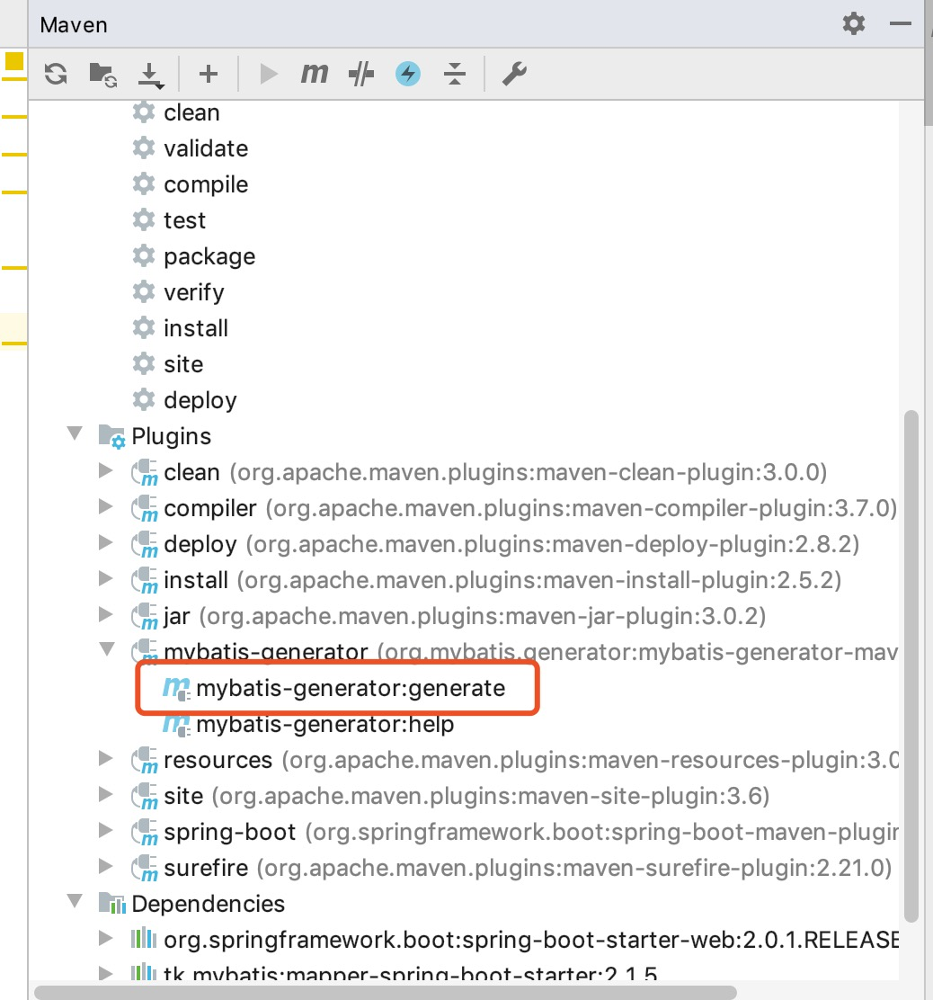

如上图，点击图中位置就自动生成了代码，但是会有一个问题，如果mysql默认有user表的就会一起生成进实体类里面，我们需要在config.properties配置里面的url加上一点东西：`jdbc.url = jdbc:mysql://localhost:3306/user_center?nullCatalogMeansCurrent=true`，之后重新生成就好了。

创建一个测试类进行测试：

```java
package com.itmuch.usercenter.controller;

import com.itmuch.usercenter.dao.user.UserMapper;
import com.itmuch.usercenter.domain.entity.user.User;
import org.springframework.beans.factory.annotation.Autowired;
import org.springframework.web.bind.annotation.GetMapping;
import org.springframework.web.bind.annotation.RestController;

import java.util.Date;

@RestController
public class UserController {

    @Autowired
    private UserMapper userMapper;

    @GetMapping(value = "/testInsert")
    public User testInsert() {
        User user = new User();
        user.setAvatarUrl("xxx");
        user.setCreateTime(new Date());
        user.setUpdateTime(new Date());
        user.setBonus(100);
        int i = userMapper.insertSelective(user);
        return user;
    }
}
```

使用同样的方式创建`content-center`项目

#### 加入Lombok

Lombok是在编译器生成对应的代码，对性能没有影响。

##### `@Setter`

##### `@Getter`

##### `@ToString`

##### `@EqualsAndHashCode`

##### `@NoArgsConstructor`

##### `@AllArgsConstructor`

##### `@Data`

`@Setter`和`@Getter`还有 `@ToString`以及`@EqualsAndHashCode`的组合注解

##### `@RequiredArgsConstructor`

为标记为final的变量生成构造方法

```java
@RequiredArgsConstructor
@Data
public class Test {
    private final String email;
    private final String name;
    private int count;
}
```

编译后的代码

```java
public class Test {
    private final String email;
    private final String name;
    private int count;

    public Test(final String email, final String name) {
        this.email = email;
        this.name = name;
    }

    public String getEmail() {
        return this.email;
    }

    public String getName() {
        return this.name;
    }

    public int getCount() {
        return this.count;
    }

    public void setCount(final int count) {
        this.count = count;
    }

    public boolean equals(final Object o) {
        if (o == this) {
            return true;
        } else if (!(o instanceof Test)) {
            return false;
        } else {
            Test other = (Test)o;
            if (!other.canEqual(this)) {
                return false;
            } else {
                label39: {
                    Object this$email = this.getEmail();
                    Object other$email = other.getEmail();
                    if (this$email == null) {
                        if (other$email == null) {
                            break label39;
                        }
                    } else if (this$email.equals(other$email)) {
                        break label39;
                    }

                    return false;
                }

                Object this$name = this.getName();
                Object other$name = other.getName();
                if (this$name == null) {
                    if (other$name != null) {
                        return false;
                    }
                } else if (!this$name.equals(other$name)) {
                    return false;
                }

                if (this.getCount() != other.getCount()) {
                    return false;
                } else {
                    return true;
                }
            }
        }
    }

    protected boolean canEqual(final Object other) {
        return other instanceof Test;
    }

    public int hashCode() {
        int PRIME = true;
        int result = 1;
        Object $email = this.getEmail();
        int result = result * 59 + ($email == null ? 43 : $email.hashCode());
        Object $name = this.getName();
        result = result * 59 + ($name == null ? 43 : $name.hashCode());
        result = result * 59 + this.getCount();
        return result;
    }

    public String toString() {
        return "Test(email=" + this.getEmail() + ", name=" + this.getName() + ", count=" + this.getCount() + ")";
    }
}
```

##### `@Builder`

建造者模式，在Feign源码里面大量使用

#### 在自动代码生成里面加入lombok

在`generatorConfig.xml`中对应的地方加入`<property name="lombok" value="Getter,Setter,ToString,Accessors"/>`，如下

```xml
<plugin type="tk.mybatis.mapper.generator.MapperPlugin">
    <property name="mappers" value="tk.mybatis.mapper.common.Mapper"/>
    <property name="caseSensitive" value="true"/>
    <property name="lombok" value="Getter,Setter,ToString,Accessors"/>
</plugin>
```

### 解决IDEA的红色警告

在上面的开发里面我们出现过一个问题，引入通用Mapper的时候，mapper下面是红色警告的，如下图。

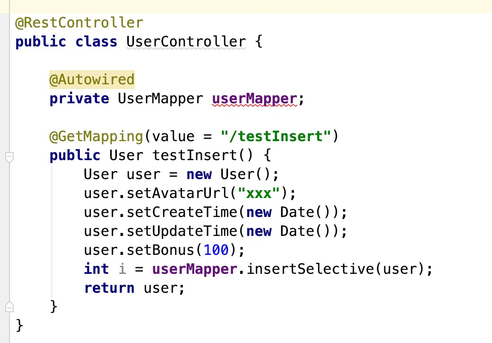

原因其实是idea不能识别这个注入，UserMapper是mybaits，而autowired是spring的，idea是能理解spring的，不能理解mybatis，所以在这儿它认为是spring的，而mapper确实mybatis，所以认为是null，但是不影响代码的执行。

#### 解决方法

##### 方法一：加上`required = false`

```java
@Autowired(required = false)
private UserMapper userMapper;
```

##### 方法二：使用`@Resource`替换

研究下两者的不同

##### 方法三：在mapper上加上`@Repository`

研究@Repository和@Service以及@Compoent还有@Controller的区别

##### 方法四：使用lombok（推荐使用）	

```java
@RestController
@RequiredArgsConstructor(onConstructor = @__(@Autowired))
public class UserController {

    private final UserMapper userMapper;
```

编译后

```java
@RestController
public class UserController {
    private final UserMapper userMapper;

    @Autowired
    public UserController(final UserMapper userMapper) {
        this.userMapper = userMapper;
    }
}
```

##### 方法五：关闭idea警告

##### 方法六：安装插件，MybatisPlugin

### 编写用户微服务和内容微服务

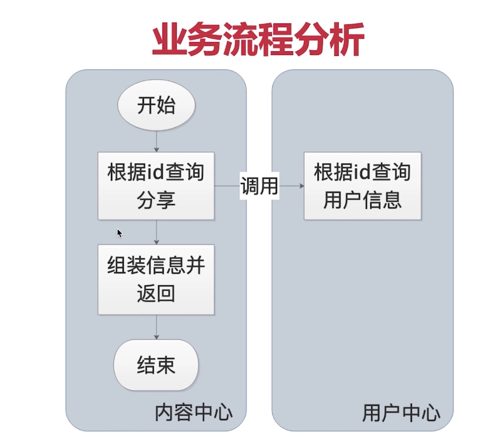

这个业务比较简单，

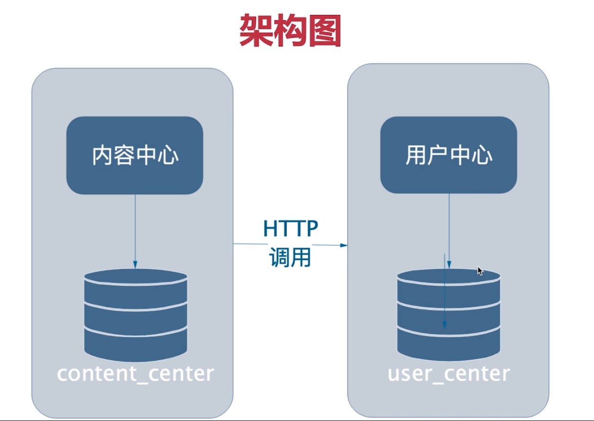

### RestTemplate

+ 简介

  + Spring Web提供的轻量级HTTP Client，用于简化HTTP调用

+ 怎么使用

  ```
  /**
   * 获取分享详情
   * @param id
   * @return
   */
  public Share findById(Integer id) {
      Share share = shareMapper.selectByPrimaryKey(id);
      // 怎么调用用户微服务，通过userid来拿到
      RestTemplate restTemplate = new RestTemplate();
      // 使用HTTP GET方法去请求，返回一个对象
      String forObject = restTemplate.getForObject(
              "http://localhost:1000/users/{id}",
              String.class, share.getUserId()
      );
      System.out.println(forObject);
      return null;
  }
  ```

  ```
  // 使用HTTP GET方法去请求，返回一个对象
  ResponseEntity<String> forObject = restTemplate.getForEntity(
          "http://localhost:1000/users/{id}",
          String.class, share.getUserId()
  );
  System.out.println(forObject);
  ```

  ResponseEntity里面包含了更多的东西，包含响应码

### 现有架构存在的问题

+ 地址发生了变化怎么办
+ 怎么负载均衡
+ 用户中心挂掉了怎么办