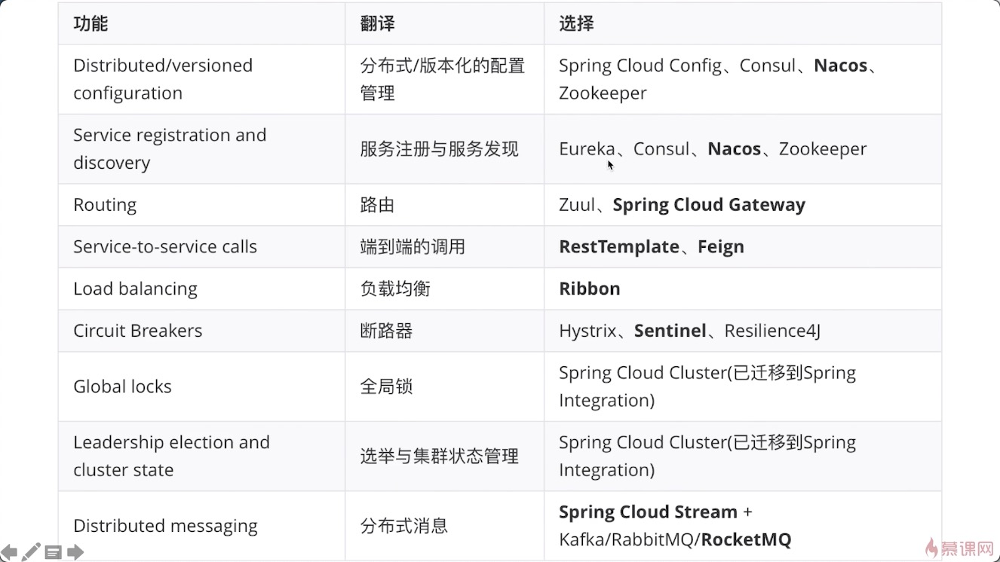
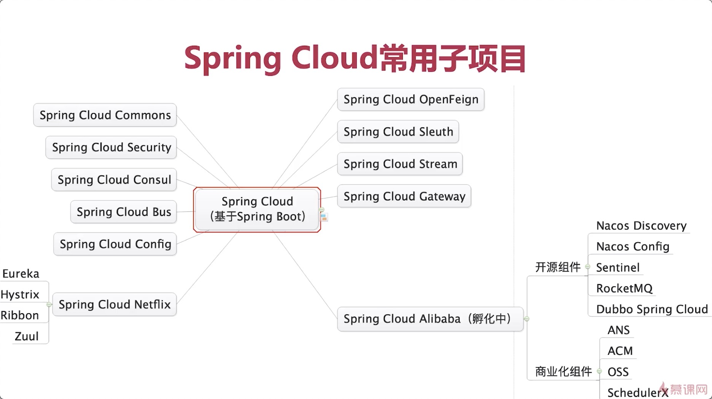
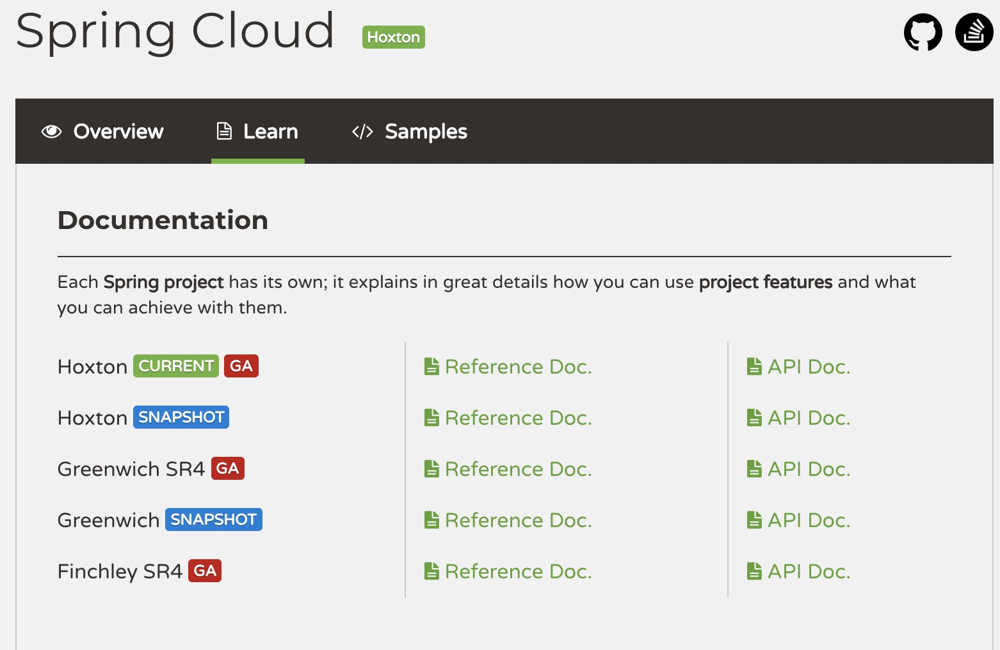
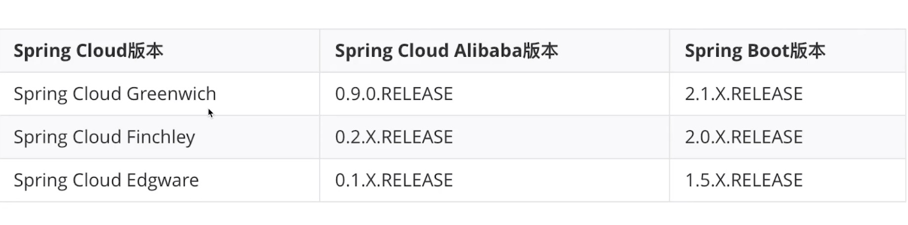

# ` Spring Cloud Alibaba`是什么

##  什么是`Spring Cloud`

+ 快速构建分布式系统的工具集



以上加粗的组件以后都会深入理解

## `Spring Cloud`常用子项目



Spring Cloud有个孵化器，都在https://github.com/spring-cloud-incubator这个地址里面，目前alibaba已经孵化成功了，里面已经没有alibaba的影子，将会在最近的版本里出现，所有Spring Cloud的组件都会在这里面进行孵化，如果有一个项目使用广泛很稳定就会孵化成功就会在Spring Cloud的组件列表里面。Spring Cloud Alibaba是有前途的。

## 什么是`Spring Cloud Alibaba`

+ Spring Cloud的子项目
+ 致力于提供微服务开发的一站式解决方案。
  + 基于Spring Cloud，符合Spring Cloud标准
  + 阿里的微服务解决方案

| 功能           | 产品                                    | 备注                                          |
| -------------- | --------------------------------------- | --------------------------------------------- |
| 服务限流降级   | **Sentinel**                            | 开源组件                                      |
| 服务注册与发现 | **Nacos**<br>ANS                        | 开源组件<br>商业组件                          |
| 分布式配置管理 | **Nacos**<br/>ACM                       | 开源组件<br/>商业组件                         |
| 消息驱动能力   | **Spring Cloud Stream**<br>**RocketMQ** | 开源组件                                      |
| 分布式事务     | Seata                                   | 开源组件，不能用于生产，1.0.0后才能可用于生产 |
| 阿里云对象存储 | OSS                                     | 商业组件                                      |
| 分布式任务调度 | SchedulerX                              | 商业组件                                      |
| 阿里云短信服务 | SMS                                     | 商业组件                                      |

# 版本与兼容性

##  `Spring Cloud`版本命名

| Release Train | Boot Version |
| ------------- | ------------ |
| `Hoxton`      | 2.2.x        |
| `Greenwich`   | 2.1.x        |
| `Finchley`    | 2.0.x        |
| `Edgware`     | 1.5.x        |
| `Dalston`     | 1.5.x        |

可以看见上面很多英文的版本命名这和我们见过的不太一样，接下来我们来看看Spring Boot的版本命名。

```xml
<parent>
   <groupId>org.springframework.boot</groupId>
   <artifactId>spring-boot-starter-parent</artifactId>
   <version>2.1.5.RELEASE</version>
   <relativePath/> <!-- lookup parent from repository -->
</parent>
```

`2.1.5.RELEASE`这是语义化的版本控制：

+ `2`：主版本，第几代

+ `1`：次版本，一些功能的增加，但是架构没有太大的变化，是兼容的

+ `5`：增量版本，bug修复

+ `RELEASE`：里程碑，一般有SNAPSHOT：开发版， M：里程碑版本， RELASE: 正式版

但是Spring Cloud显然不是按照语义化的版本控制玩的。我们来看看：



其实这是**发布列车**，按照字母的顺序排列，依次有Angle Brixton Camden Dalston Edgware Finchley Greenwich Hoxton这些是伦敦地铁的站名，那为什么这么做呢？因为Spring Cloud包含很多子项目，每个子项目有自己的版本命名，如果Spring Cloud也按照语义化的命名就会混淆，所以Spring Cloud干脆搞了个发布列车。那么后面的SR1 SR2是什么呢？

SR是`service release`意思是bug修复版本，如果后面有**RELEASE**那么说明是第一个正式版本。也即是先发布**RELEASE**版本，如果发现了bug就修复后发布SR1版本，以此类推。

### 版本发布规划

https://github.com/spring-cloud-release/milestones

### 版本发布记录

https://github.com/spring-cloud-release/releases

### 版本终止声明

在官网可以找到每个版本的终止声明，一般是`end-of-life`

### 版本兼容性



上图是孵化成功前，目前孵化成功后我们主需要关注Spring Cloud的版本管理就行了。

### 生产环境如何选择版本

+ 坚决不用非稳定版本/end of life版本
+ 尽量用最新一代
  + release版本先缓一缓
  + SR2之后一般可以大规模使用

## 整合`Spring Cloud Alibaba`

###  整合`Spring Cloud`

```xml
<dependencyManagement>
   <dependencies>
      <dependency>
         <groupId>org.springframework.cloud</groupId>
         <artifactId>spring-cloud-dependencies</artifactId>
         <version>Greenwich.SR3</version>
         <type>pom</type>
         <scope>import</scope>
      </dependency>
   </dependencies>
</dependencyManagement>
```

加入依赖一定要按照官网上对应的spring boot版本号来

### 整合`Spring Cloud Alibaba`

这儿使用的Greenwich版本的Spring Cloud，所以使用如下依赖。

```xml
<dependencyManagement>
   <dependencies>
      <!--整合Spring Cloud-->
      <dependency>
         <groupId>org.springframework.cloud</groupId>
         <artifactId>spring-cloud-dependencies</artifactId>
         <version>Greenwich.SR3</version>
         <type>pom</type>
         <scope>import</scope>
      </dependency>
      <!--整合Spring Cloud Alibaba-->
      <dependency>
         <groupId>org.springframework.cloud</groupId>
         <artifactId>spring-cloud-alibaba-dependencies</artifactId>
         <version>0.9.0.RELEASE</version>
         <type>pom</type>
         <scope>import</scope>
      </dependency>
   </dependencies>
</dependencyManagement>
```

然后在我们的用户中心和内容中心中都整合好`Spring Cloud Alibaba`