## 服务的提供者和消费者

| 名词       | 定义                                               |
| ---------- | -------------------------------------------------- |
| 服务提供者 | 服务的被调用方（即：为其他微服务提供接口的微服务） |
| 服务消费者 | 服务的调用方（即：调用其他微服务接口的微服务）     |

## 现有架构存在的问题

如果用户中心地址发生变化，怎么办？

## 白话剖析服务发现原理

上面也说了，如果用户中心地址发生了变化，内容中心是无法感知到的，我们可以通过mysql来实现：

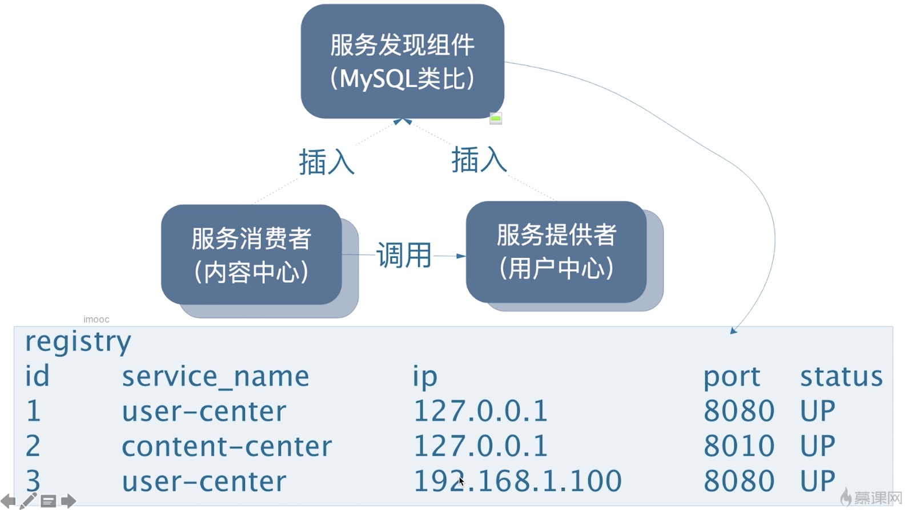

按照上图可以实现一个简易的服务发现机制。但是还是会有问题：比如说每次去调用微服务之前都去请求mysql中去获取注册的数据，如果微服务多了mysql压力就会很大。所有的微服务都要注册到mysql上去，压力显而易见，虽然我们可以通过缓存来处理，比如我们再微服务调用方有一个定时任务定时去拉取任务列表即可，但是假设某个微服务崩溃了怎么办？于是我们再调节表结构：

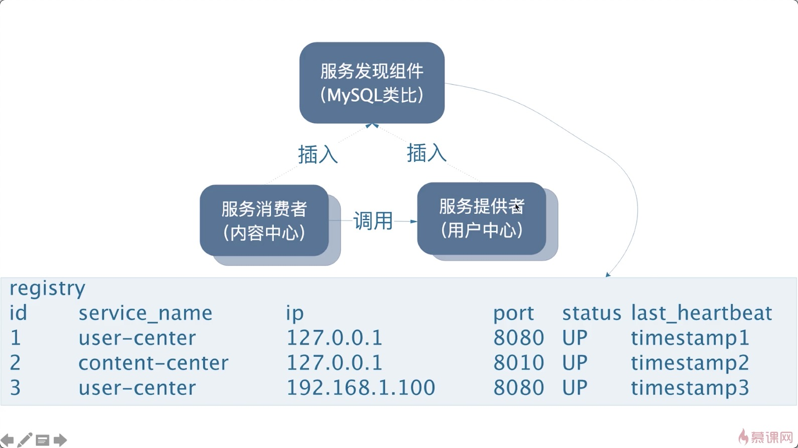

可以通过上次心跳时间来判断这个微服务是否崩溃。

由此分析可以得知服务发现和注册的原理。

## 什么是`Nacos`

### 官方文档

https://nacos.io/zh-cn/docs/what-is-nacos.html

### 微服务全景架构图


## 搭建`Nacos Server`

### 下载`Nacos`

下载地址：https://github.com/alibaba/nacos/releases

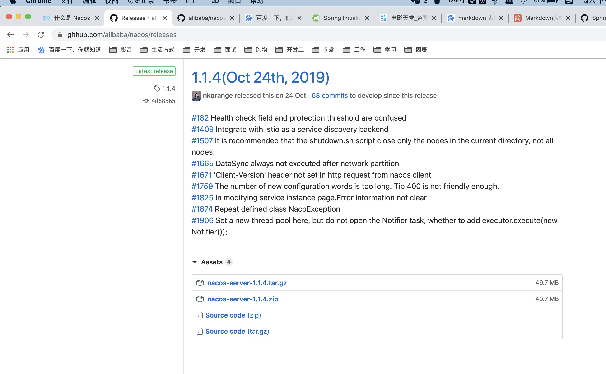

可以看到有很多版本，我们直接下载zip就行了，那么应该选择哪个版本呢？

这里我们点进去我们引入的nacos依赖，看到nacos，如下图

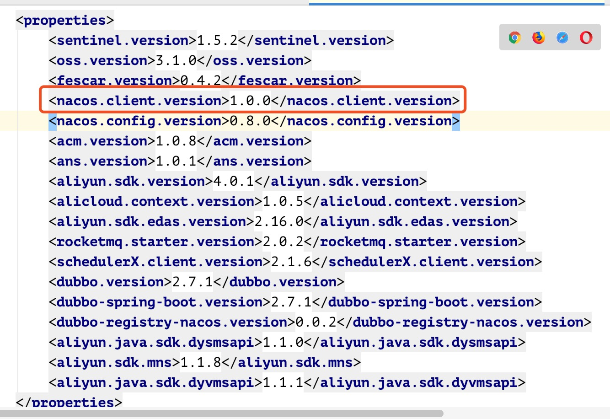

所以我们下载1.0.0的版本。下载zip文件。

### 启动服务

#### **Linux/Unix/Mac**

启动命令(standalone代表着单机模式运行，非集群模式)：

`sh startup.sh -m standalone`

#### Windows

启动命令：

````
cmd startup.cmd
````

或者双击`startup.cmd`运行文件

### 访问

输入http://localhost:8848/nacos/#/login，用户名和密码都是nacos，登入后就是nacos的控制台了。

以上就是单机版的nacos server的搭建过程。

## 将应用注册到nacos

### 用户中心注册到nacos

```
<dependency>
    <groupId>org.springframework.cloud</groupId>
    <artifactId>spring-cloud-alibaba-nacos-discovery</artifactId>
</dependency>
```

加上配置

```
spring:
  datasource:
    url: jdbc:mysql://localhost:3306/user_center?useSSL=true
    hikari:
      username: root
      password: root
      # com.mysql.jdbc.Driver，如果connector的版本是5.x版本
      # 6.x或者以上的版本就要带上cj
      driver-class-name: com.mysql.jdbc.Driver
  cloud:
    nacos:
      discovery:
        # 指定nacos server地址，前面不要加http
        server-addr: localhost:8848
  # 一定要写服务名称
  application:
    name: user-center
server:
  port: 1000
```

一定要指定服务名称，不然注册不到nacos上面去，执行`mvn clean inatall`安装依赖，然后启动测试：

`````
2019-12-15 10:26:22.051  INFO 752 --- [           main] o.s.c.a.n.registry.NacosServiceRegistry  : nacos registry, user-center 192.168.31.41:1000 register finished
`````

我们来看启动的nacos server界面，看看是否注册成功

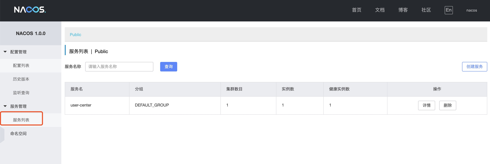

### 内容中心注册到nacos

同样的流程将内容中心注册到nacos

### 测试内容中心调用用户中心

在内容中心的`controller`中加入以下代码：

```java
@Autowired
private DiscoveryClient discoveryClient;

@GetMapping(value = "/test2")
public List<ServiceInstance> getInstance() {
    return this.discoveryClient.getInstances("user-center");
}
```

我们将所有的用户中心的服务返回到前端，来看页面返回内容：

````json
[{
	"serviceId": "user-center",
	"host": "192.168.31.41",
	"port": 1000,
	"secure": false,
	"metadata": {
		"nacos.instanceId": "192.168.31.41#1000#DEFAULT#DEFAULT_GROUP@@user-center",
		"nacos.weight": "1.0",
		"nacos.cluster": "DEFAULT",
		"nacos.healthy": "true",
		"preserved.register.source": "SPRING_CLOUD"
	},
	"uri": "http://192.168.31.41:1000",
	"scheme": null,
	"instanceId": null
}]
````

### 启动多个用户中心测试

在idea的启动工具中有一个地方，可以设定多个程序启动，具体看下图，不过我们要启动的话要先修改端口号

```yml
server:
  port: 1001
```

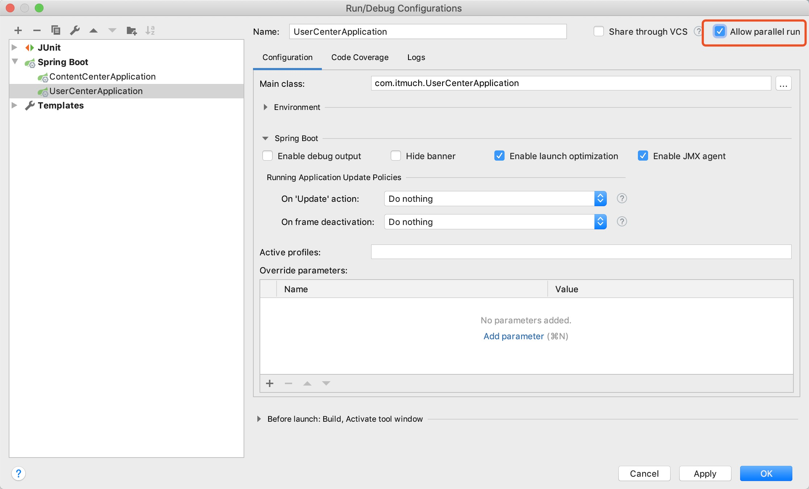

如上图勾选图中的地方，然后再启动。

````
2019-12-15 11:22:39.319  INFO 1620 --- [           main] o.s.c.a.n.registry.NacosServiceRegistry  : nacos registry, user-center 192.168.31.41:1001 register finished
````

启动成功。

我们再来访问链接测试：

````json
[{
	"serviceId": "user-center",
	"host": "192.168.31.41",
	"port": 1000,
	"secure": false,
	"metadata": {
		"nacos.instanceId": "192.168.31.41#1000#DEFAULT#DEFAULT_GROUP@@user-center",
		"nacos.weight": "1.0",
		"nacos.cluster": "DEFAULT",
		"nacos.healthy": "true",
		"preserved.register.source": "SPRING_CLOUD"
	},
	"uri": "http://192.168.31.41:1000",
	"scheme": null,
	"instanceId": null
}, {
	"serviceId": "user-center",
	"host": "192.168.31.41",
	"port": 1001,
	"secure": false,
	"metadata": {
		"nacos.instanceId": "192.168.31.41#1001#DEFAULT#DEFAULT_GROUP@@user-center",
		"nacos.weight": "1.0",
		"nacos.cluster": "DEFAULT",
		"nacos.healthy": "true",
		"preserved.register.source": "SPRING_CLOUD"
	},
	"uri": "http://192.168.31.41:1001",
	"scheme": null,
	"instanceId": null
}]
````

测试成功，此外，如果将用户中心的关闭，内容中心能感知到变化的，这个就不用测试了。

**`DiscoryClient`这个类是Alibaba提供的，除了`Nacos`还可以使用**
**`Eureka`，或者`Zookeeper`都可以使用这个API**

### 将内容中心引入`DiscoveryClient`

```java
@Service
@RequiredArgsConstructor(onConstructor = @__(@Autowired))
public class ShareService {
    private final ShareMapper shareMapper;
    private final RestTemplate restTemplate;

    private final DiscoveryClient discoveryClient;
    /**
     * 获取分享详情
     * @param id
     * @return
     */
    public ShareDto findById(Integer id) {
        Share share = shareMapper.selectByPrimaryKey(id);
        // 怎么调用用户微服务，通过userid来拿到
        // 使用nacos
        List<ServiceInstance> instances = discoveryClient.getInstances("user-center");
        String targetUrl = instances.stream()
                .map(instance -> instance.getUri().toString() + "/users/{id}")
                .findFirst()
                .orElseThrow(() -> new IllegalArgumentException("当前没有实例"));
//        UserDto userDto = restTemplate.getForObject(
//                "http://localhost:1000/users/{id}",
//                UserDto.class, share.getUserId()
//        );

        UserDto userDto = restTemplate.getForObject(
                targetUrl,
                UserDto.class, share.getUserId()
        );
        // 消息的装配
//        ShareDto.builder().build()
//        使用spring提供的工具
        ShareDto shareDto = new ShareDto();
        BeanUtils.copyProperties(share, shareDto);
        shareDto.setWxNickname(userDto.getWxNickname());
        return shareDto;
    }
}
```

这里投机取巧的取用第一个user-center的服务。在后面引入了rabbion就可以使用负载均衡。

## `Nacos`的服务发现的领域模型

### 领域模型有哪些，有什么作用？

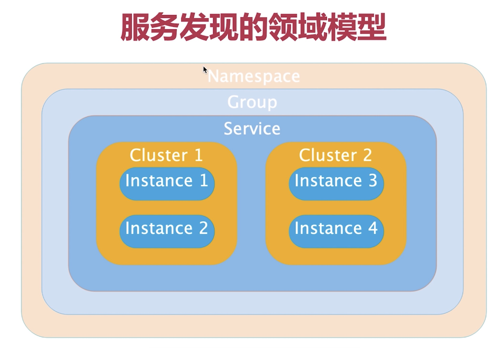

在上图的最顶层是`Namespace`，这个叫命名空间，是作为隔离使用的，在我们服务端控制台也有对应的页面：

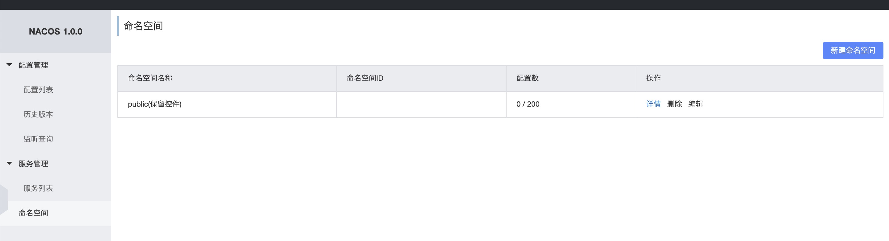

这个命名空间可以作为开发场景或者生产场景使用来进行隔离。

在`namespace`下面的`group`是服务分组，服务分组将不同的微服务划分到同一个分组里面，方便管理。**在目前的0.9.0没有用上group**。

在group下面是service servce就是我们所谓的微服务，一个service又可以包含多个cluster, cluser是微服务的划分，也就是集群，可以进行容灾，比如北京和南京有一样的用户中心。这些在控制台都有对应的页面。

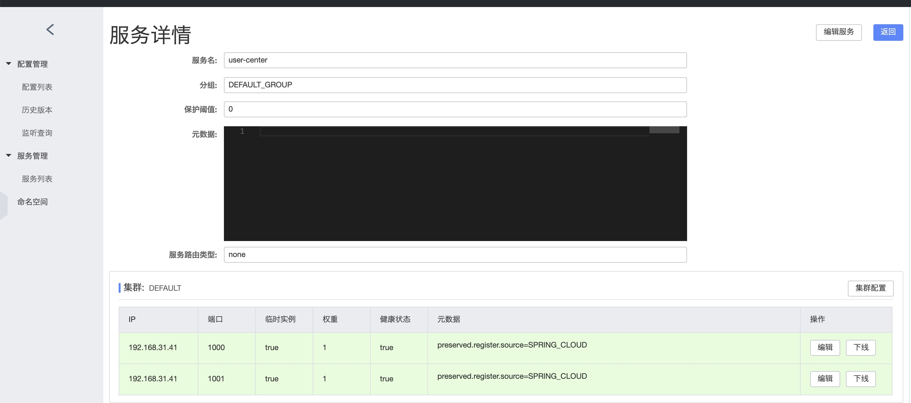

最后就是instance，也就是我们微服务的实例。

此外，我们可以创建命名空间，可以在配置文件中指定对应的命名空间和集群。

+ 在控制台中新建命名空间

  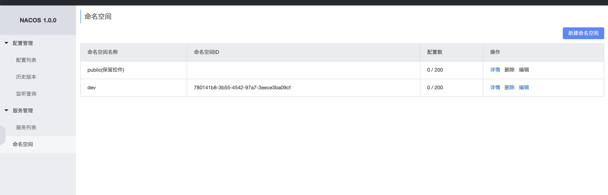

+ 在配置文件中加上对应命名空间的id

  ```yml
  cloud:
    nacos:
      discovery:
        # 指定nacos server地址，前面不要加http
        server-addr: localhost:8848
        namespace: 780141b8-3b55-4542-97a7-3eece3ba09cf
        # 集群，南京集群
        cluster-name: NJ
  ```

+ 如果有集群可以配上集群

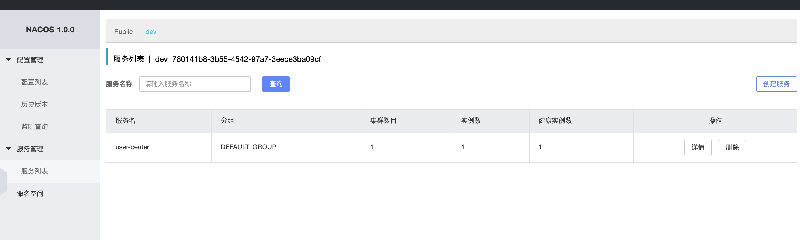

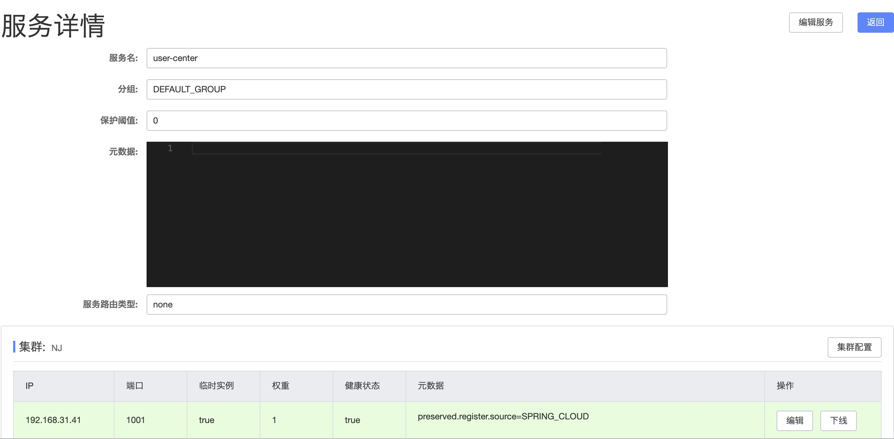

## `Nacos`的元数据

官方文档：https://nacos.io/zh-cn/docs/concepts.html

### 元数据

Nacos数据（如配置和服务）描述信息，如服务版本、权重、容灾策略、负载均衡策略、鉴权配置、各种自定义标签 (label)，从作用范围来看，分为服务级别的元信息、集群的元信息及实例的元信息。

### 元数据的配置

#### 控制台配置

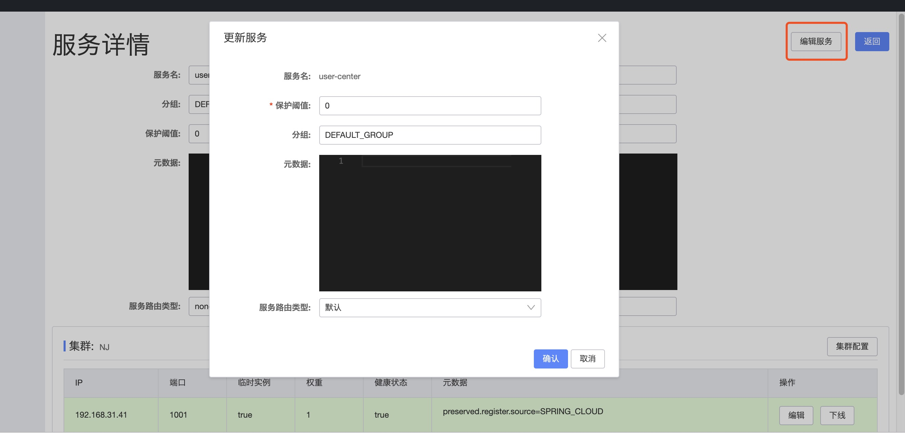

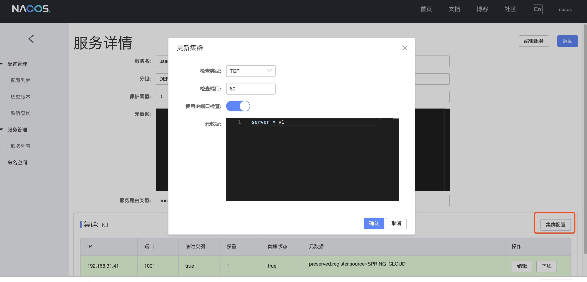

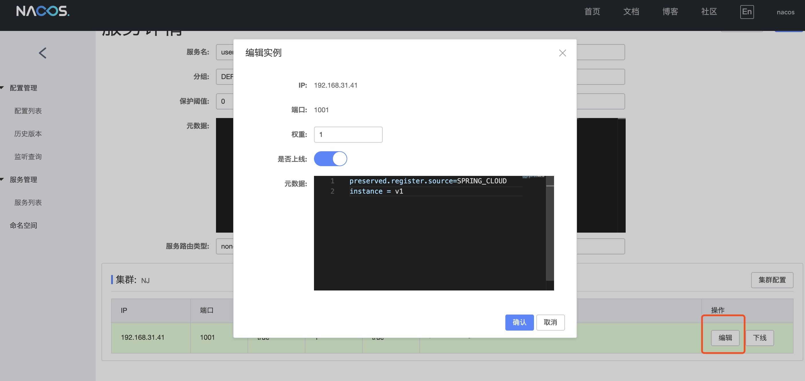

#### 配置文件

```yml
cloud:
  nacos:
    discovery:
      # 指定nacos server地址，前面不要加http
      server-addr: localhost:8848
      namespace: 780141b8-3b55-4542-97a7-3eece3ba09cf
      # 集群，南京集群
      cluster-name: NJ
      metadata: 
        hhhh: hhh 
```

配置内容就是key value形式就行了，可以随便定义

### 元数据的作用

+ 提供描述信息
+ 让微服务调用更加灵活
  + 例如：微服务版本控制

在实际场景中，我们可能存在如下场景。

内容中心v1---->用户中心v1

内容中心v2---->用户中心v2

对于更多关于元数据的使用我们详见rabbion