## 负载均衡的两种方式

### 如何实现负载均衡？

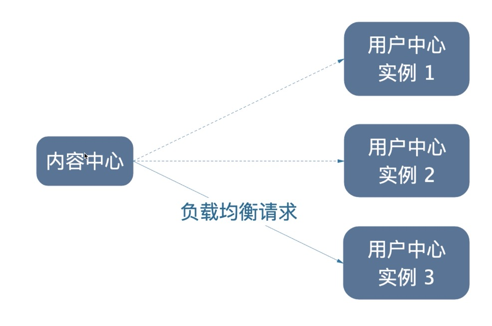

### 服务器负载均衡

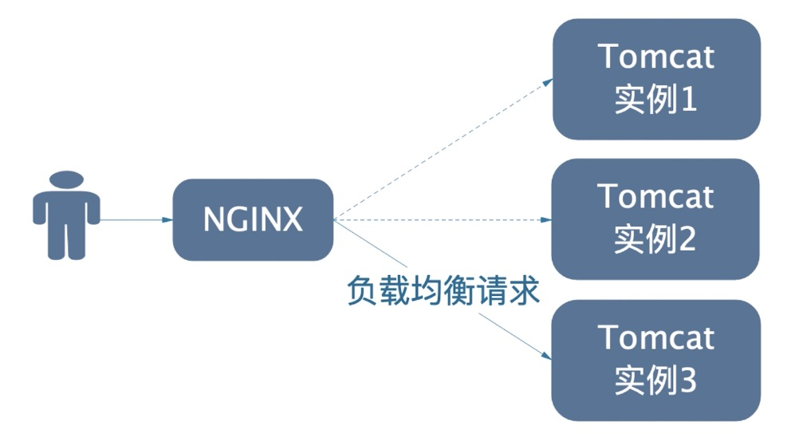

### 客户端侧负载均衡

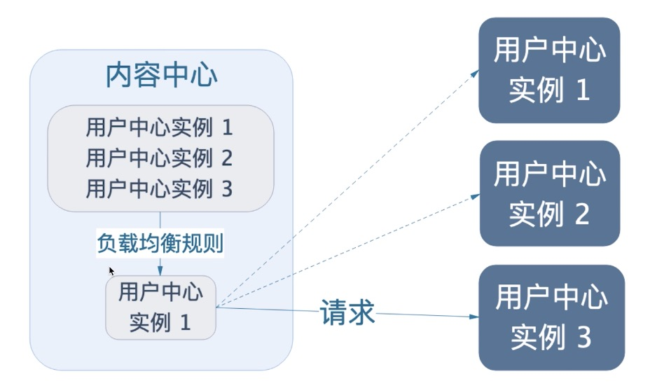

## 手写一个客户端侧负载均衡器

```java
// 使用nacos
List<ServiceInstance> instances = discoveryClient.getInstances("user-center");
// 所有用户中心的地址
List<String> collect = instances.stream()
        .map(instance -> instance.getUri().toString() + "/users/{id}")
        .collect(Collectors.toList());
int i = ThreadLocalRandom.current().nextInt(collect.size());
String targetUrl = collect.get(i);
log.info("请求的目标地址：{}", targetUrl);
UserDto userDto = restTemplate.getForObject(
        targetUrl,
        UserDto.class, share.getUserId()
);
```

实现一个随机算法的负载均衡很简单。

## 使用`Ribbon`实现负载均衡

### `Ribbon`是什么

+ `Netflix`开源的客户端侧负载均衡器

### 引入`Ribbon`架构的演进

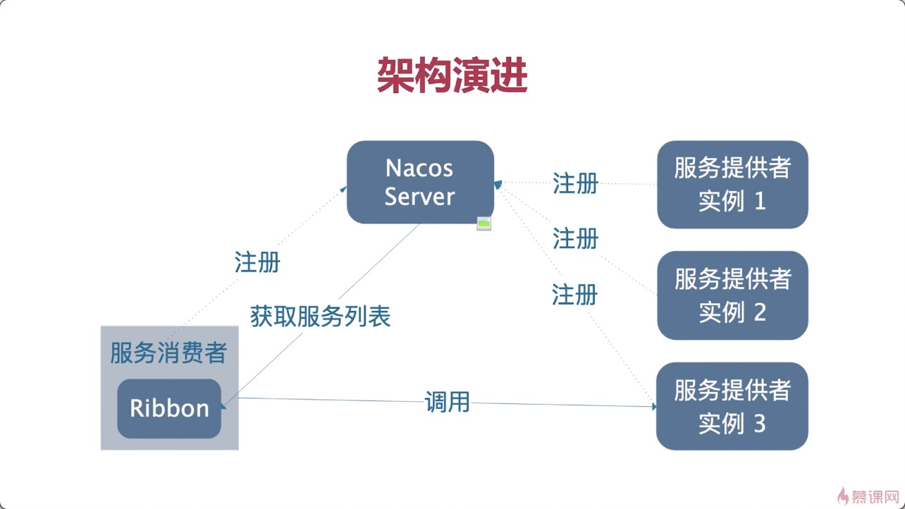

服务消费者集成了Ribbon后，会自动去服务注册中心去拉取服务提供者地址。然后通过负载均衡器提供的某个算法选择实例进行调用。

### 项目中引入

这个不需要加入依赖，`spring-cloud-alibaba-nacos-discovery`里面已经包含了Ribbon依赖，至于代码请往下看：

引导类或者配置类中引入RestTemplate加入注解`@LoadBalanced`

```java
@SpringBootApplication
@MapperScan(value = "com.itmuch")
public class ContentCenterApplication {

   public static void main(String[] args) {
      SpringApplication.run(ContentCenterApplication.class, args);
   }

   // 在sping容器中，创建一个对象，类型RestTemplate
   @Bean
   @LoadBalanced
   public RestTemplate restTemplate() {
      return new RestTemplate();
   }
}
```

将之前加入的命名空间删掉，然后，在调用远程服务的时候将地址更换为服务提供者的名字：

```java
public ShareDto findById(Integer id) {
        Share share = shareMapper.selectByPrimaryKey(id);
        // 怎么调用用户微服务，通过userid来拿到
//        // 使用nacos
//        List<ServiceInstance> instances = discoveryClient.getInstances("user-center");
//        // 所有用户中心的地址
//        List<String> collect = instances.stream()
//                .map(instance -> instance.getUri().toString() + "/users/{id}")
//                .collect(Collectors.toList());
//        int i = ThreadLocalRandom.current().nextInt(collect.size());
//        String targetUrl = collect.get(i);
//        log.info("请求的目标地址：{}", targetUrl);
        UserDto userDto = restTemplate.getForObject(
                "http://user-center/users/{id}",
                UserDto.class, share.getUserId()
        );
        // 消息的装配
//        ShareDto.builder().build()
//        使用spring提供的工具
        ShareDto shareDto = new ShareDto() ;
        BeanUtils.copyProperties(share, shareDto);
        shareDto.setWxNickname(userDto.getWxNickname());
        return shareDto;
 }
```

## Ribbon的组成

​           

上面的ZonePreferenceServerListFilter中Zone可以理解为同一机房的不同的机架，而这个类则是筛选同一机架的服。`PollingServerListUpdater`是默认的，会让Ribbon定时更新serverlist

## Ribbon内置的负载均衡规则

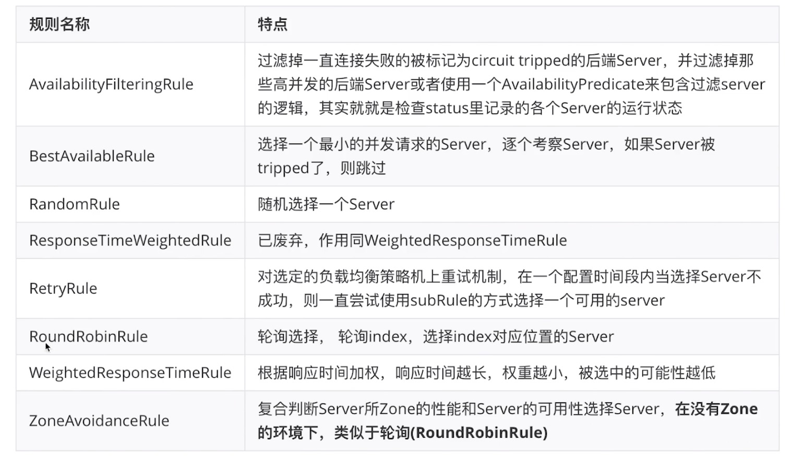

## 细粒度配置自定义

### Java配置

新建一个类：

```java
@Configuration
@RibbonClient(name = "user-center", configuration = RibbonConfiguration.class)
public class UserCenterRibbonConfiguration {
}
```

```java
@Configuration
public class RibbonConfiguration {

    @Bean
    public IRule RibbonRule() {
        return new RandomRule();
    }
}
```

有一点非常重要，`@RibbonClient(name = "user-center", configuration = RibbonConfiguration.class)`中configuration指定的class的包必须在Spring Boot的启动类之外，如下图：

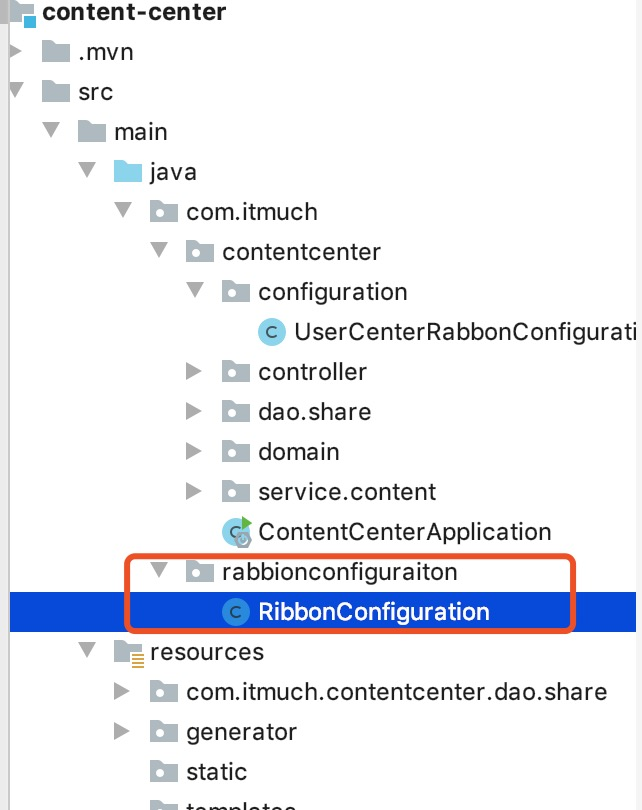

至于原因，应该是Spring一个父子上下文的关系。因为这个类也要被`@Configuration`修饰，都是会被Spring Boot启动类扫描到的，因为spring 的上下文是一个树状的上下文，spring boot启动类的上下文是主上下文，Ribbonconfiguration是子上下文，如果放在springboot扫描的范围里面的话，就会出现父子上下文重叠，这样会导致事务不生效。

**如果经历过传统的spring mvc项目就会知道，sprinmvc配置文件扫描controller，而spring的配置文件会把controller排除掉。**

**其实问题主要在于SpringMVC的配置文件扫包范围，spring配置文件就算也扫了@Controller注解，但是在SpringMVC会重新扫描一次，事务管理的service只要没被重新扫描就不会出现事务失效的问题。**

**父子上下文不能重叠**

而在Rabbion中，如果把`RabbionConfiguration.class`放在Spring Boot主配置类扫描范围内的话，**就会导致这个类被所有的RibbonClient共享**

### 用配置属性配置

在yml中加上一段简单的配置：

```yml
user-center:
  ribbon:
    NFLoadBalanceRuleClass: com.netflix.loadbalancer.RandomRule
```

ribbon调用user-center的时候就会使用如上配置文件中的规则

### 代码配置方式 vs 属性配置方式

| 配置方式 | 优点                                                         | 缺点                                             |
| -------- | ------------------------------------------------------------ | ------------------------------------------------ |
| 代码配置 | 基于代码，更加灵活                                           | 有小坑（父子上下文）<br>线上修改得重新打包、发布 |
| 属性配置 | 易上手<br>配置更加直观<br/>线上修改无需重新打包<br/>**优先级更高** | 极端场景下没有代码配置方式灵活                   |


## 最佳实践总结

+ 尽量使用属性配置，属性方式实现不了的情况下再考虑用代码配置
+ 在同一微服务内**尽量保持单一性**，比如统一使用属性配置，不要两种方式混用，增加定位代码的复杂性。

## 全局配置

+ 方式一：让ComponentScan上下文重叠（**强烈不建议使用**）

  也就是说让`RabbionConfiguration.class`放在Spring Boot主配置类扫描范围内，这个类就会被所有的RibbonClient共享，当不建议使用，上文有解释。

+ 方式二【唯一正确的途径】：

  `@RibbonClients(defalutConfiguration=xxx.class)`

  ```java
  @RibbonClients(defaultConfiguration = RibbonConfiguration.class)
  public class UserCenterRabbonConfiguration {
  }
  ```

## 支持的配置项

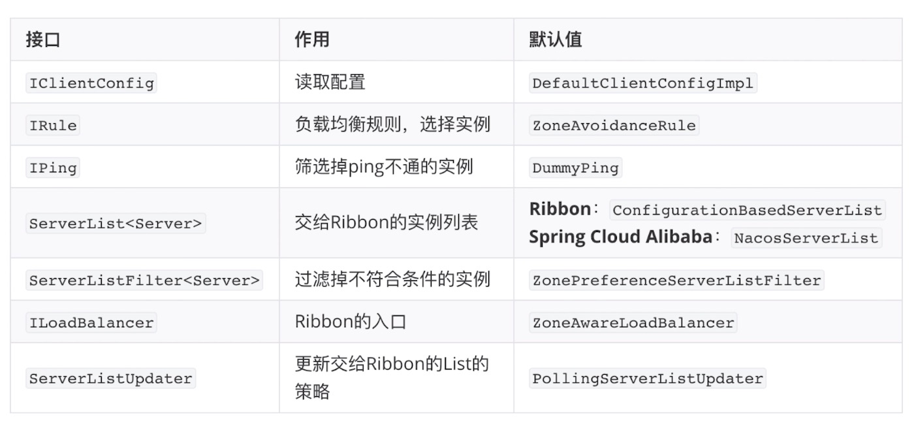

举个例子，如果你使用的是Java Config方式，那么只需要在Rabbion的配置类里面加上对应的`@Bean`就好了。

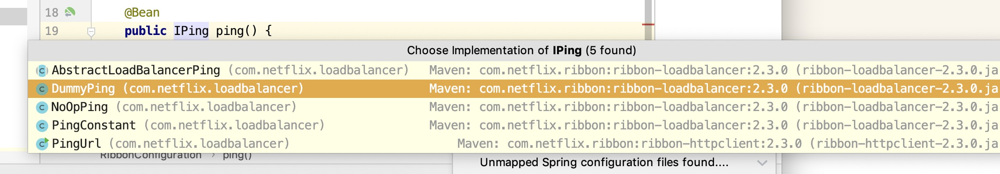

```JAVA
@Configuration
public class RibbonConfiguration {

    @Bean
    public IRule RibbonRule() {
        return new RandomRule();
    }

    @Bean
    public IPing ping() {
        return new PingUrl();
    }
}
```

这样就可以把ping的配置改成了pingUrl的方式。

如果使用配置属性的方式如下图：

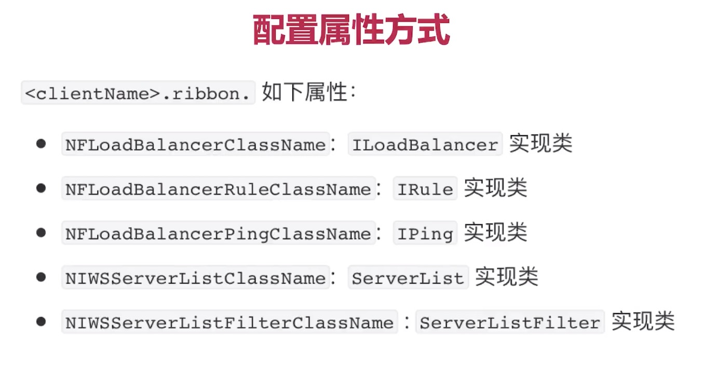

## 饥饿加载

Rabbon在首次加载的时候会比较缓慢，因为是懒加载，在首次调用的时候才会去创建对应的RabbonClient，解决办法很简单：

```yml
rabbon:
  eager-load:
    # 开启饥饿加载
    enable: true
    # 对那些微服务使用饥饿加载， 多个使用逗号分隔
    clients: user-center
```

## 扩展Rabbon-支持Nacos权重

在Nacos控制台可以对服务进行权重分配

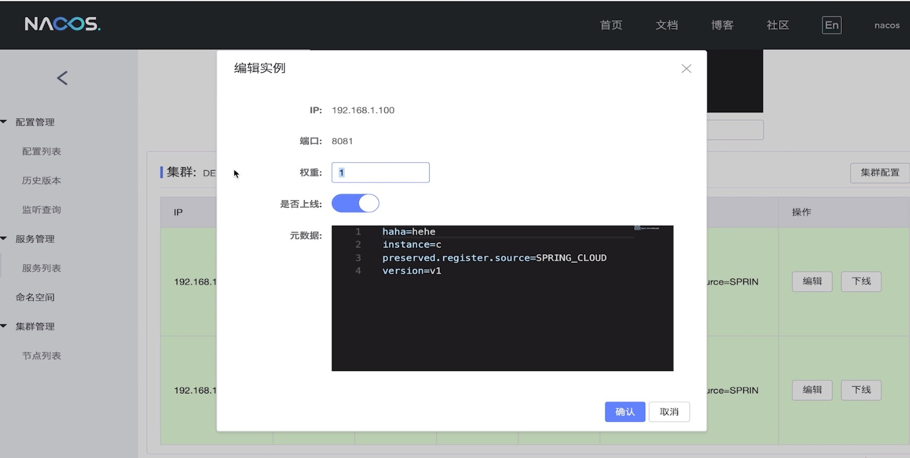

代码实现：

```java
/**
 * 扩展Rabbon， 实现权重
 * @author litian
 */
@Slf4j
public class NacosWeightedRule extends AbstractLoadBalancerRule {
    @Autowired
    private NacosDiscoveryProperties nacosDiscoveryProperties;

    /**
     * 读取配置文件并初始化（用不上，就留空）
     * @param clientConfig
     */
    @Override
    public void initWithNiwsConfig(IClientConfig clientConfig) {

    }

    /**
     *
     * @param key
     * @return
     */
    @Override
    public Server choose(Object key) {
        // 这是Rabbon的入口，你想要的它都有
        // ILoadBalancer loadBalancer = this.getLoadBalancer();
        BaseLoadBalancer loadBalancer = (BaseLoadBalancer) this.getLoadBalancer();
        // 想要请求的微服务的名称
        String name = loadBalancer.getName();
        // 实现负载均衡算法，其实nacos已经内置了一个负载均衡算法
        // 拿到服务发现的相关API
        NamingService namingService =
                nacosDiscoveryProperties.namingServiceInstance();
        try {
            // nacos client自动通过基于权重负载均衡算法，给我们选择一个实例。
            Instance instance =
                    namingService.selectOneHealthyInstance(name);
            log.info("port = {}, instance = {}", instance.getPort(), instance);
            return new NacosServer(instance);
        } catch (NacosException e) {
            return null;
        }
    }
}
```

调用的话如下：

```java
@Bean
public IRule RibbonRule() {
    return new NacosWeightedRule();
}
```

Spring Cloud Common包下面定义了标准，Spring Cloud loadbalancer包下面定义了负载均衡标准，但是根本没有权重这个概念，所以阿里巴巴的nacos去实现了这个权重。

## 扩展Ribbon-同集群优先

有时候我们为了容灾，将服务部署在不同的地方，我们为了方便调用，同机房优先调用，只有同机房找不到了，才考虑到其他地方的服务。为了实现就需要使用到**服务发现的领域模型**。

```java
/**
 * 同机房集群优先调用
 * @author litian
 */
@Slf4j
public class NacosSameClusterWeightedRule extends AbstractLoadBalancerRule {

    @Autowired
    private NacosDiscoveryProperties nacosDiscoveryProperties;

    @Override
    public void initWithNiwsConfig(IClientConfig clientConfig) {

    }

    @Override
    public Server choose(Object key) {
        // 拿到配置文件中的集群名字 BJ NJ
        String clusterName = nacosDiscoveryProperties.getClusterName();
        // 获得想要调用的服务名称
        BaseLoadBalancer loadBalancer =
                (BaseLoadBalancer) this.getLoadBalancer();
        String name = loadBalancer.getName();
        // 拿到服务发现的相关API
        NamingService namingService =
                nacosDiscoveryProperties.namingServiceInstance();

        // 1.找到指定服务的所有实例 A
        try {
            // 拿到健康的实例
            List<Instance> instances = namingService.selectInstances(name, true);
            // 2.过滤出相同集群下的实例 B
            List<Instance> sameClusterInstance = instances.stream()
                    .filter(instance -> Objects.equals(instance.getClusterName(), clusterName)).collect(Collectors.toList());
            // 3.如果B是空，就用A
            List<Instance> instancesToBeChosen = new ArrayList<>();
            if (CollectionUtils.isEmpty(sameClusterInstance)) {
                instancesToBeChosen = instances;
                log.warn("发生跨集群的调用，name = {}, clusterName = {}, instances = {}",
                        name,
                        clusterName,
                        instances);
            }
            // 4.基于权重的负载均衡算法，返回一个实例
            /**
             * 实现权重
             * 源码跟踪一下Nacos的实现 namingService.selectOneHealthyInstance(name);
             * com.alibaba.nacos.client.naming.core.Balancer#getHostByRandomWeight
             * protected static Instance getHostByRandomWeight(List<Instance> hosts) {
             * }
             * 这是protected的方法，如果调用可以采用内部类继承的方式
             */
            Instance instance = ExtendBalancer.getHostByRandomWeight2(instancesToBeChosen);
            return new NacosServer(instance);
        } catch (NacosException e) {
            log.error("发生异常了", e);
            return null;
        }
    }

    /**
     * 创建内部类，继承Balancer，调用基于权重的负载均衡算法
     * 当你想要利用别人的代码的时候，而别人的代码是protected的，那么就可以使用这种继承方式
     */
    static class ExtendBalancer extends Balancer {
        public static Instance getHostByRandomWeight2(List<Instance> hosts) {
            return getHostByRandomWeight(hosts);
        }
    }
}
```

上面的代码用到了一个代码技巧，如果源码里面的protected方法你要调用的时候，可以使用内部类的方式继承。

## 扩展Ribbon-基于元数据的版本控制

在实际项目中可能面临多版本共存的问题，比方说用户中心和内容中心都存在V1 V2两个版本，而用户中心V1和内容中心V2是不兼容的，所以我们需要用元数据来解决这个问题。

至此，已经实现了

- 优先调用同集群下的实例
- 实现基于权重配置的负载均衡

但实际项目，我们可能还会有这样的需求：

一个微服务在线上可能多版本共存，例如：

- 服务提供者有两个版本：v1、v2
- 服务消费者也有两个版本：v1、v2

v1/v2是不兼容的。服务消费者v1只能调用服务提供者v1；消费者v2只能调用提供者v2。如何实现呢？

下面围绕该场景，实现微服务之间的版本控制。

### 元数据

元数据就是一堆的描述信息，以map存储。举个例子：

```yml
spring:
  cloud:
    nacos:
        metadata: 
          # 自己这个实例的版本
          version: v1
          # 允许调用的提供者版本
          target-version: v1
```

### 需求分析

我们需要实现的有两点：

- 优先选择同集群下，符合metadata的实例
- 如果同集群加没有符合metadata的实例，就选择所有集群下，符合metadata的实例

### 代码

```java
/**
 * 基于同集群优先调用以及版本控制的负载均衡算法
 * @author litian
 */
@Slf4j
public class NacosFinalRule extends AbstractLoadBalancerRule {

    @Autowired
    private NacosDiscoveryProperties nacosDiscoveryProperties;

    @Override
    public void initWithNiwsConfig(IClientConfig clientConfig) {

    }

    @Override
    public Server choose(Object key) {

        // 负载均衡规则：优先选择同集群下，符合metadata的实例
        // 如果没有，就选择所有集群下，符合metadata的实例
        // 1.查询所有实例 A
        // 2.筛选元数据匹配的实例 B
        // 3.筛选出同cluster下元数据匹配的实例 C
        // 4.如果C为空，就用B
        // 5.随机选择实例
        try {
            String clusterName = nacosDiscoveryProperties.getClusterName();
            String targetVersion = nacosDiscoveryProperties.getMetadata().get("targetVersion");

            DynamicServerListLoadBalancer loadBalancer =
                    (DynamicServerListLoadBalancer) this.getLoadBalancer();
            String name = loadBalancer.getName();

            NamingService namingService =
                    nacosDiscoveryProperties.namingServiceInstance();

            // 所有实例
            List<Instance> instances =
                    namingService.selectInstances(name, true);

            List<Instance> metadataMatchInstances = instances;
            // 如果配置了版本映射，那么只调用元数据匹配的实例
            if (StringUtils.isNotBlank(targetVersion)) {
                metadataMatchInstances = instances.stream()
                        .filter(instance -> Objects.equals(targetVersion, instance.getMetadata().get("version")))
                        .collect(Collectors.toList());

                if (CollectionUtils.isEmpty(metadataMatchInstances)) {
                    log.warn("未找到元数据匹配的目标实例！请检查配置。targetVersion = {}, instance = {}", targetVersion, instances);
                    return null;
                }
            }
            List<Instance> clusterMetadataMatchInstances = metadataMatchInstances;
            // 如果配置了集群名称，需筛选同集群下元数据匹配的实例
            if (StringUtils.isNotBlank(clusterName)) {
                metadataMatchInstances.stream()
                        .filter(instance -> Objects.equals(clusterName, instance.getClusterName()))
                        .collect(Collectors.toList());
                if (CollectionUtils.isEmpty(clusterMetadataMatchInstances)) {
                    clusterMetadataMatchInstances = metadataMatchInstances;
                    log.warn("发生跨集群调用。clusterName = {}, targetVersion = {}, clusterMetadataMatchInstances = {}", clusterName, targetVersion, clusterMetadataMatchInstances);
                    Instance instance = ExtendBalancer.getHostByRandomWeight2(clusterMetadataMatchInstances);
                    return new NacosServer(instance);
                }
            }
        } catch (Exception e) {
            log.warn("发生异常", e);
            return null;
        }
        return null;
    }

    static class ExtendBalancer extends Balancer {
        public static Instance getHostByRandomWeight2(List<Instance> hosts) {
            return getHostByRandomWeight(hosts);
        }
    }
}
```

## 深入理解Nacos的Namespace

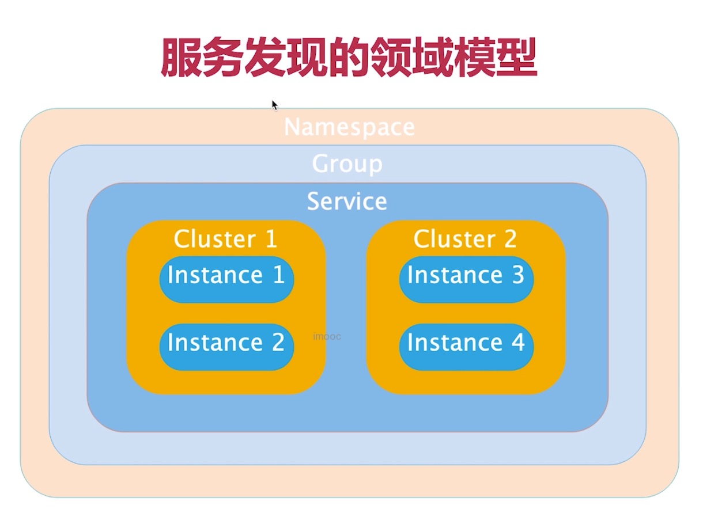

Nacos通过namespace实现了一个隔离，只能调用相同的namespace的实例，不能跨namespace的调用。

## 现有架构存在的问题

目前实现了客户端侧的负载均衡，但是调用的时候依旧采用了服务名的调用，如果服务名比较长是不可读的，并且难以响应需求的变化，或者是需求没有幸福感。