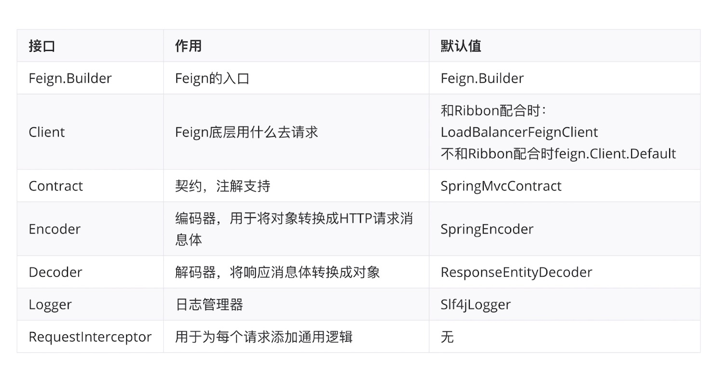
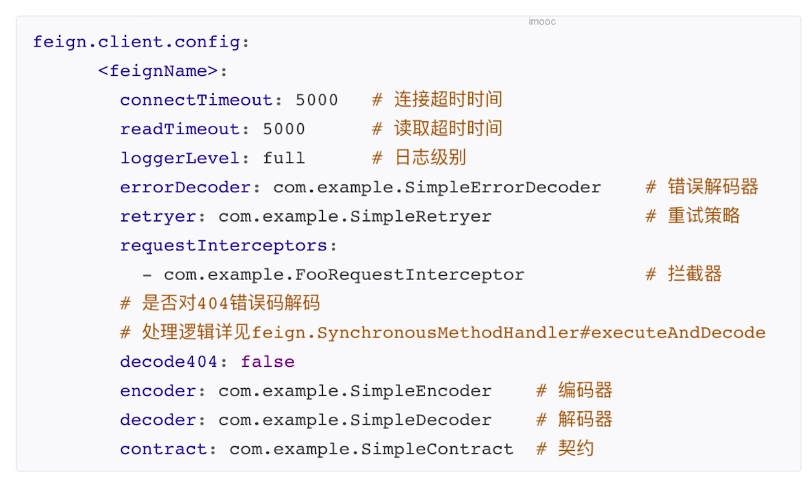
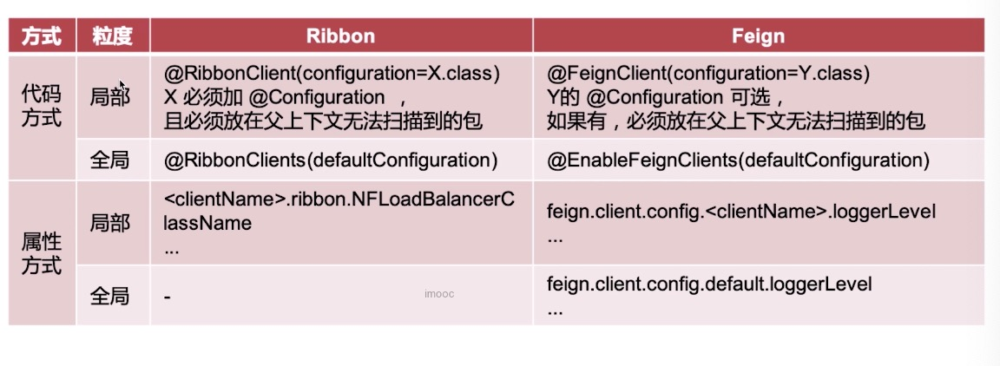
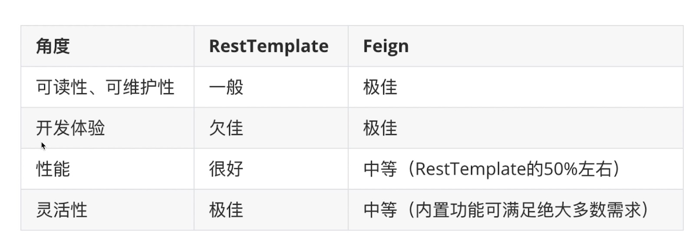

## 使用Feign实现远程HTTP调用

### 什么是Feign

Feign是Netflix开源的声明式HTTP客户端，feign致力于让http client编写更加轻松。ß

### 整合Feign

```xml
<dependency>
   <groupId>org.springframework.cloud</groupId>
   <artifactId>spring-cloud-starter-openfeign</artifactId>
</dependency>
```

在启动类上加上`@EnableFeignClients`

```java
@SpringBootApplication
@MapperScan(value = "com.itmuch")
@EnableFeignClients
public class ContentCenterApplication {

   public static void main(String[] args) {
      SpringApplication.run(ContentCenterApplication.class, args);
   }

   // 在sping容器中，创建一个对象，类型RestTemplate
   @Bean
   @LoadBalanced
   public RestTemplate restTemplate() {
      return new RestTemplate();
   }
}
```

创建一个包，再创建一个接口

```java
import com.itmuch.contentcenter.domain.dto.user.UserDto;
import org.springframework.cloud.openfeign.FeignClient;
import org.springframework.web.bind.annotation.GetMapping;
import org.springframework.web.bind.annotation.PathVariable;

/**
 * 创建Feign的客户端
 */
@FeignClient(name = "user-center")
public interface UserCenterFeignClient {

    /**
     * Feign构造如下的url:
     * http://user-center/users/{id}
     * @param id
     * @return
     */
    @GetMapping(value = "/users/{id}")
    UserDto findById(@PathVariable Integer id);
}
```

至此我们的`RestTempalte`已经可以功成身退了，我们可以使用Feign进行替代：

```java
/**
 * @author litian
 */
@Service
@Slf4j
@RequiredArgsConstructor(onConstructor = @__(@Autowired))
public class ShareService {
    private final ShareMapper shareMapper;
    private final UserCenterFeignClient userCenterFeignClient;

    /**
     * 获取分享详情
     * @param id
     * @return
     */
    public ShareDto findById(Integer id) {
        Share share = shareMapper.selectByPrimaryKey(id);
        UserDto userDto = userCenterFeignClient.findById(id);
        ShareDto shareDto = new ShareDto() ;
        BeanUtils.copyProperties(share, shareDto);
        shareDto.setWxNickname(userDto.getWxNickname());
        return shareDto;
    }
}
```

## Feign的组成



## 细粒度配置自定义

### Java代码配置

#### 自定义Feign日志级别

Feign日志管理，Feign默认不打印任何日志的，但是在实际项目中，我们需要知道某个API调用花了多长的时间，或者具体是怎么调用的过程，使用Spring boot默认的日志打印是不行的。

Feign默认给自己定义了四种日志级别。

| 级别           | 打印内容                                      |
| -------------- | --------------------------------------------- |
| NONE（默认值） | 不记录任何日志                                |
| BASIS          | 仅记录请求方法、URL、响应状态代码以及执行时间 |
| HEADERS        | 记录BASIC级别的基础上，记录请求和响应的header |
| FULL           | 记录请求和响应的header、body和元数据          |

从上面可以看出，FULL这中级别非常适用于开发环境，那么我们来把日志级别设置成FULL，先试用JAVA代码方式配置

新建一个配置类：

```java
/**
 * 自定义Feign日志级别
 * @author litian
 */
public class UserCenterFeignConfiguration {
    /**
     * 让Feign打印所有请求的细节
     * @return
     */
    @Bean
    public Logger.Level level() {
        return Logger.Level.FULL;
    }
}
```

在Feign客户端上注解里面加上上面配置类：

```java
/**
 * 创建Feign的客户端
 * @author litian
 */
@FeignClient(name = "user-center", configuration = UserCenterFeignConfiguration.class)
public interface UserCenterFeignClient {

    /**
     * Feign构造如下的url:
     * http://user-center/users/{id}
     * @param id
     * @return
     */
    @GetMapping(value = "/users/{id}")
    UserDto findById(@PathVariable Integer id);
}
```

最后要在application.yml文件的Logger的配上全路径配置，一定要配置debug，如果是info同样无法显示日志信息。

```yml
logging:
  level:
    com.itmuch.contentcenter.feignclient.UserCenterFeignClient: debug
```

调用接口测试如下：

`````java
2019-12-29 16:29:01.611  INFO 2121 --- [nio-2000-exec-1] c.i.c.configuration.NacosWeightedRule    : port = 1000, instance = {"clusterName":"DEFAULT","enabled":true,"ephemeral":true,"healthy":true,"instanceId":"192.168.31.41#1000#DEFAULT#DEFAULT_GROUP@@user-center","ip":"192.168.31.41","metadata":{"preserved.register.source":"SPRING_CLOUD"},"port":1000,"serviceName":"DEFAULT_GROUP@@user-center","weight":1.0}
2019-12-29 16:29:01.622 DEBUG 2121 --- [nio-2000-exec-1] c.i.c.feignclient.UserCenterFeignClient  : [UserCenterFeignClient#findById] <--- HTTP/1.1 200 (370ms)
2019-12-29 16:29:01.623 DEBUG 2121 --- [nio-2000-exec-1] c.i.c.feignclient.UserCenterFeignClient  : [UserCenterFeignClient#findById] content-type: application/json;charset=UTF-8
2019-12-29 16:29:01.623 DEBUG 2121 --- [nio-2000-exec-1] c.i.c.feignclient.UserCenterFeignClient  : [UserCenterFeignClient#findById] date: Sun, 29 Dec 2019 08:29:01 GMT
2019-12-29 16:29:01.623 DEBUG 2121 --- [nio-2000-exec-1] c.i.c.feignclient.UserCenterFeignClient  : [UserCenterFeignClient#findById] transfer-encoding: chunked
2019-12-29 16:29:01.623 DEBUG 2121 --- [nio-2000-exec-1] c.i.c.feignclient.UserCenterFeignClient  : [UserCenterFeignClient#findById] 
2019-12-29 16:29:01.623 DEBUG 2121 --- [nio-2000-exec-1] c.i.c.feignclient.UserCenterFeignClient  : [UserCenterFeignClient#findById] {"id":1,"wxId":"","wxNickname":"小天天","roles":"admin","avatarUrl":"xxx","createTime":"2019-12-09T23:10:32.000+0000","updateTime":"2019-12-09T23:10:32.000+0000","bonus":100}
2019-12-29 16:29:01.623 DEBUG 2121 --- [nio-2000-exec-1] c.i.c.feignclient.UserCenterFeignClient  : [UserCenterFeignClient#findById] <--- END HTTP (177-byte body)
2019-12-29 17:23:38.152  WARN 2121 --- [l-1 housekeeper] com.zaxxer.hikari.pool.HikariPool        : HikariPool-1 - Thread starvation or clock leap detected (housekeeper delta=48m36s766ms).
`````

## 细粒度配置自定义-属性方式

把上面的configuration注释掉，然后在配置文件中加上一行配置：

```yml
# logger一定要加
logging:
  level:
    com.itmuch.contentcenter.feignclient.UserCenterFeignClient: debug

feign:
  client:
    config:
      # 想要调用的微服务的名称
      user-center:
        loggerLevel: full
```

## 全局配置自定义

### Java代码方式自定义

+ 让父子上下文的ComponentScan重叠（**强烈不建议**）
+ 方式二【唯一正确的路径】`@EnableFeignClients(defaultConfiguration = xx.class)`

```java
/**
 * @author litian
 */
@SpringBootApplication
@MapperScan(value = "com.itmuch")
@EnableFeignClients(defaultConfiguration = UserCenterFeignConfiguration.class)
public class ContentCenterApplication {

   public static void main(String[] args) {
      SpringApplication.run(ContentCenterApplication.class, args);
   }

   // 在sping容器中，创建一个对象，类型RestTemplate
   @Bean
   @LoadBalanced
   public RestTemplate restTemplate() {
      return new RestTemplate();
   }
}
```

### 属性方式

```yml
logging:
  level:
    com.itmuch.contentcenter.feignclient.UserCenterFeignClient: debug


feign:
  client:
    config:
      # 全局配置
      default:
        loggerLevel: full
```

同样，也需要加上日志的配置。

## 支持的配置项

### 代码方式

| 配置项                           | 作用                                              |
| -------------------------------- | ------------------------------------------------- |
| `Logger.Level`                   | 指定日志级别                                      |
| `Retryer`                        | 指定重试策略                                      |
| `ErrorDecoder`                   | 指定错误解码器                                    |
| `Request.Options`                | 超时时间                                          |
| `Collection<RequestInterceptor>` | 拦截器                                            |
| `SetterFactory`                  | 用于设置Hystrix的配置属性，Feign整合Hystrix才会用 |


### 属性方式



## 最佳配置总结

### Ribbon配置 vs Feign配置



### Feign代码方式 vs 属性方式

| 配置方式 | 优点                                                         | 缺点                                                         |
| -------- | ------------------------------------------------------------ | ------------------------------------------------------------ |
| 代码配置 | 基于代码，更加灵活                                           | 如果Feign的配置类加了Configuraiton注解，需注意父子上下文，线上修改得重新打包、发布 |
| 属性配置 | 易上手<br>配置更加直观<br/>线上修改无需重新打包、发布**优先级更高** | 极端场景下没有代码配置方式灵活                               |

优先级排序：全局代码 < 全局属性 < 细粒度代码 < 细粒度属性

### 最佳实践

+ 尽量使用属性配置，属性方式实现不了的情况下再考虑用代码配置
+ 在同一个微服务内**尽量保持单一性**，比如统一使用属性配置，不要两种方式混用，增加定位代码的复杂性

## Feign的继承

在我们的代码中，内容中心的Feign client 和 用户中心的controller 代码基本一致，那么我们可以考虑把这段代码抽出来成一个API接口，让它们去继承，这在微服务之间叫面向契约的编程，也就是面向接口的编程，但是它有利有弊，官方不推荐，因为会**紧耦合**。

### 关于继承特性的争议

+ 官方观点：不建议使用，因为增加了耦合度

+ 业界观点：很多公司使用，代码重用，面向契约

+ 个人观点：权衡利弊，如果非常想要继承带来的好处，并且能接受紧耦合就可以

  **当做一笔生意，如果划算就干，不划算就拉倒**

## 多参数请求构造

### GET

假设需请求的URL包含多个参数，例如`http://microservice-provider-user/get?id=1&username=张三` ，该如何使用Feign构造呢？

我们知道，Spring Cloud为Feign添加了Spring MVC的注解支持，那么我们不妨按照Spring MVC的写法尝试一下：

```java
/**
 * @author litian
 */
@FeignClient(name = "user-center")
public interface TestUserCenterFeignClient {

    @GetMapping(value = "/q")
    public UserDto query(UserDto userDto);
}
```

然而，这种写法并不正确，控制台会输出类似如下的异常。

```
feign.FeignException: status 405 reading UserFeignClient#get0(User); content:
{"timestamp":1482676142940,"status":405,"error":"Method Not Allowed","exception":"org.springframework.web.HttpRequestMethodNotSupportedException","message":"Request method 'POST' not supported","path":"/get"}
```

由异常可知，尽管我们指定了GET方法，Feign依然会使用POST方法发送请求。于是导致了异常。正确写法如下

#### 方法一[推荐]

```java
/**
 * @author litian
 */
@FeignClient(name = "user-center")
public interface TestUserCenterFeignClient {

    @GetMapping(value = "/q")
    public UserDto query(@SpringQueryMap UserDto userDto);
}
```

#### 方法二[推荐]

```java
/**
 * @author litian
 */
@FeignClient(name = "user-center")
public interface TestUserCenterFeignClient {

    @GetMapping(value = "/q")
    public UserDto query(@RequestParam("id") Long id ....);
}
```

这是最为直观的方式，URL有几个参数，Feign接口中的方法就有几个参数。使用@RequestParam注解指定请求的参数是什么。

#### 方法三[不推荐]

多参数的URL也可使用Map来构建。当目标URL参数非常多的时候，可使用这种方式简化Feign接口的编写。

```java
@FeignClient(name = "microservice-provider-user")
public interface UserFeignClient {
  @RequestMapping(value = "/get", method = RequestMethod.GET)
  public User get2(@RequestParam Map<String, Object> map);
}
```

在调用时，可使用类似以下的代码

```java
public User get(String username, String password) {
  HashMap<String, Object> map = Maps.newHashMap();
  map.put("id", "1");
  map.put("username", "张三");
  return this.userFeignClient.get2(map);
}
```

**注意**：这种方式不建议使用。主要是因为可读性不好，而且如果参数为空的时候会有一些问题，例如`map.put("username", null);` 会导致`microservice-provider-user` 服务接收到的username是`""` ，而不是null。

### POST

下面来讨论如何使用Feign构造包含多个参数的POST请求。假设服务提供者的Controller是这样编写的：

```JAVA
@RestController
public class UserController {
  @PostMapping("/post")
  public User post(@RequestBody User user) {
    ...
  }
}
```

我们要如何使用Feign去请求呢？答案非常简单，示例：

```java
@FeignClient(name = "microservice-provider-user")
public interface UserFeignClient {
  @RequestMapping(value = "/post", method = RequestMethod.POST)
  public User post(@RequestBody User user);
}
```

## Feign脱离Ribbon的使用

如果我们要使用feign调用没有注册到nacos上面怎么办？我们来模拟Feign访问百度

```java
/**
 * @author litian
 */
@FeignClient(name = "baidu", url = "http://www.baidu.com")
public interface TestBaiduFeignClient {

    @GetMapping(value = "")
    public String index();
}
```

```java
@Autowired
private TestBaiduFeignClient testBaiduFeignClient;

@GetMapping(value = "baidu")
public String baiduIndex() {
    return this.testBaiduFeignClient.index();
}
```

访问`localhost:2000/baidu`，就直接访问了百度了。这儿图就不截了。以上就是Feign脱离Ribbon的使用。

## RestTemplate vs Feign



### 如何选择？

+ 原则：尽量用Feign，杜绝使用RestTemplate

  使用Feign可以让代码更漂亮，更可读，在一个项目里保持一个统一的风格，所以不使用RestTemplate

+ 事无绝对，合理选择

## Feign性能优化

+ 配置连接池【提升15%左右】

  Feign底层使用URLConnection，是没有连接池的，同时还可以使用apache的HttpClient以及okhttp发送请求，这两个都是支持连接池，下面使用apache的HttpClient来配置

  ```xml
  <dependency>
     <groupId>io.github.openfeign</groupId>
     <artifactId>feign-httpclient</artifactId>
  </dependency>
  ```

  ```yml
  feign:
    client:
      config:
        # 全局配置
        default:
          loggerLevel: full
    httpclient:
      # 让feign使用apache httpclient做请求，而不是默认的urlconnection
      enabled: true
      # feign最大连接数
      max-connections: 200
      # feign单个路径的最大连接数
      max-connections-per-route: 50
  ```

  okhttp也是同理：

  ```xml
  <dependency>
     <groupId>io.github.openfeign</groupId>
     <artifactId>feign-okhttp</artifactId>
     <version>10.1.0</version>
  </dependency>
  ```

  ```yml
  feign:
    client:
      config:
        # 全局配置
        default:
          loggerLevel: full
    okhttp:
      enabled: true
  ```

+ 日志级别

  日志建议设置成basic，绝对不建议设置成full，对性能相对比较大

## 常见问题总结

http://www.imooc.com/article/289005