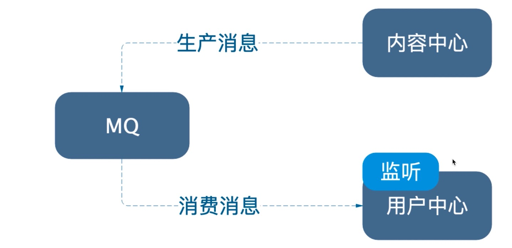
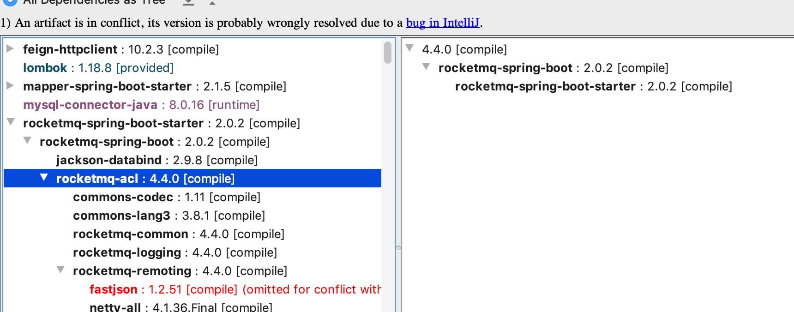
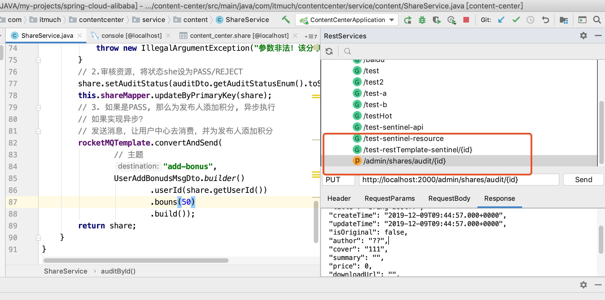
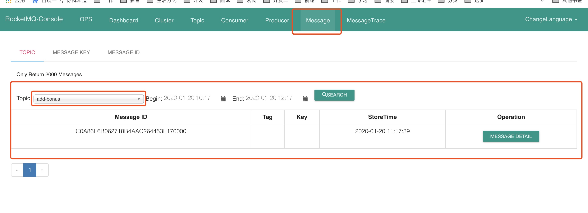
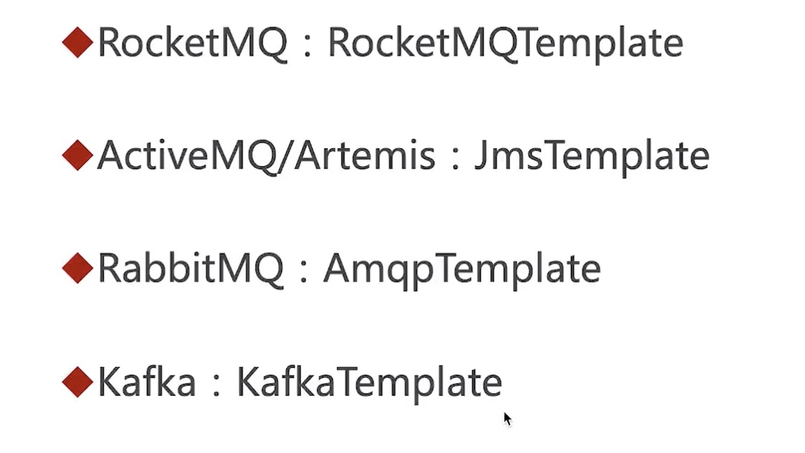
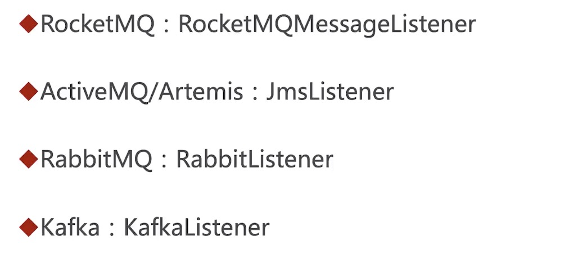
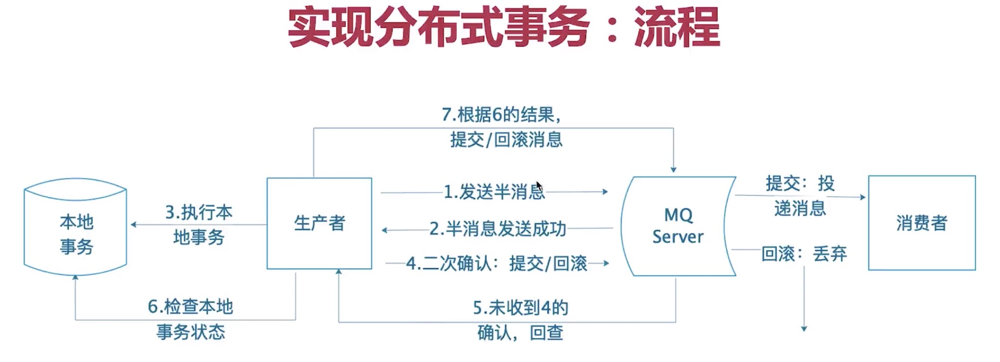
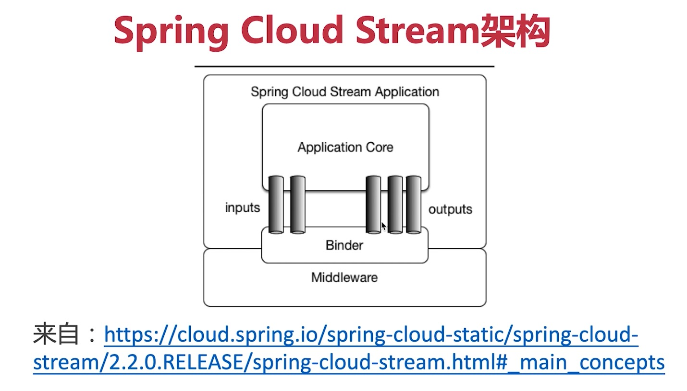
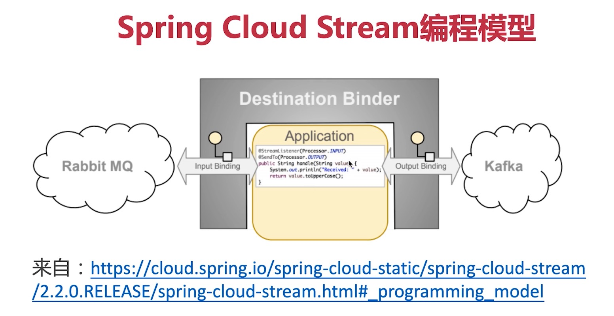
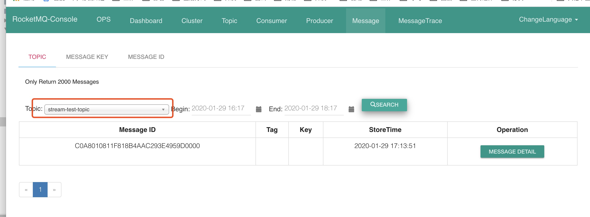

## [管理员审核分享业务实现]()

在我们的小程序里面有一个功能：管理员审核分享，当我们将分享内容的状态需改为已审核后，还有一个问题就是我们需要给分享的用户添加积分，我们在内容中心去实现这个功能，这样我们需要使用feign来调用用户中心去添加积分，但是既然是远程调用为何不考虑异步，我们犯不上要等待远程调用的结果。一下是几种异步的实现方式。

### Spring实现异步的方法

+ AsyncResTempate
  + 参考文档：https://blog.csdn.net/jiangchao858/article/details/86709750
+ @Async注解
  + 参考文档：https://spring.io/guides/gs/async-method
  + 对代码侵入性小
+ WebClient(Spring 5.0引入)
+ MQ

## 引入MQ后的架构演进



## MQ适用场景

+ 异步处理

  把一些耗时，但不阻塞主流程的业务去做异步处理，提升用户体验。

+ 流量削峰填谷

  最典型就是秒杀场景，秒杀开始瞬间，流量疯狂打进来，使用MQ控制参加活动的人数，一旦参加人数超过阈值，就抛弃请求，跳转错误页，避免被流量洪峰打死。

+ 解耦微服务

  A调用B服务，如果B服务挂了，MQ存储消息，等待B服务重启后再继续处理，增加可用性

## MQ的选择

+ 流行的MQ那么多，如何选择？
  + Kafka、RabbitMQ、RocketMQ、ActiveMQ...
  + 手记：https://www.imooc.com/article/290040

## 搭建RocketMQ

> 基于RocketMQ 4.5.1，理论支持RocketMQ 4.0+

### 一、下载

前往 `http://rocketmq.apache.org/release_notes/release-notes-4.5.1/` ，下载 `Binary` 文件即可。

例如RocketMQ 4.5.1的下载地址：

- Binary: [rocketmq-all-4.5.1-bin-release.zip](https://www.apache.org/dyn/closer.cgi?path=rocketmq/4.5.1/rocketmq-all-4.5.1-bin-release.zip)

### 二、系统要求

- 64位操作系统，生产环境建议Linux/Unix/MacOS（**Windows操作系统安装说明详见 Windows操作系统安装教程**）
- 64位JDK 1.8（目前RocketMQ不支持 JDK 11）
- 4G+的可用磁盘

### 三、Linux/Unix/MacOS安装教程

#### 3.1 搭建

- 解压压缩包

  ```
  unzip rocketmq-all-4.5.1-bin-release.zip
  ```

- 切换目录到RocketMQ根目录

  ```
  cd rocketmq-all-4.5.1-bin-release
  ```

- 启动Name Server

  ```
  nohup sh bin/mqnamesrv &
  ```

  验证是否启动OK：

  ```
  tail -f ~/logs/rocketmqlogs/namesrv.log
  
  # 如果成功启动，能看到类似如下的日志：
  2019-07-18 17:03:56 INFO main - The Name Server boot success. ...
  ```

- 启动 `Broker`

  ```
  nohup sh bin/mqbroker -n localhost:9876 &
  ```

  验证是否启动OK：

  ```
  tail -f ~/logs/rocketmqlogs/broker.log
  
  # 如果启动成功，能看到类似如下的日志：
  2019-07-18 17:08:41 INFO main - The broker[itmuchcomdeMacBook-Pro.local, 192.168.43.197:10911] boot success. serializeType=JSON and name server is localhost:9876
  ```

#### 3.2 验证RocketMQ功能正常（可选）

##### 3.2.1 验证生产消息正常

执行如下命令：

```
export NAMESRV_ADDR=localhost:9876
sh bin/tools.sh org.apache.rocketmq.example.quickstart.Producer
```

能看到类似如下输出：

```
SendResult [sendStatus=SEND_OK, msgId=C0A82BC5F36C511D50C05B41...
```

##### 3.2.2 验证消费消息正常

执行如下命令：

```
sh bin/tools.sh org.apache.rocketmq.example.quickstart.Consumer
```

能看到类似如下输出：

```
ConsumeMessageThread_4 Receive New Messages: [MessageExt [queueId=3, stor....
```

#### 3.3 停止

依次执行以下两条命令即可

```
# 命令
sh bin/mqshutdown broker
# 输出如下信息说明停止成功
The mqbroker(36695) is running...
Send shutdown request to mqbroker(36695) OK

# 命令
sh bin/mqshutdown namesrv
# 输出如下信息说明停止成功
The mqnamesrv(36664) is running...
Send shutdown request to mqnamesrv(36664) OK
```

### 四、Windows操作系统安装教程

详见 [Windows下RocketMQ安装部署](https://www.jianshu.com/p/4a275e779afa)

### 五、生产可用集群搭建教程

[RocketMQ集群搭建说明](http://www.itmuch.com/books/rocketmq/operation.html) ，集群安装模式非常多，本文不展开了。请各位看客根据自己的需求，选择适合自己的模式自行搭建。

### 我的方式

## 搭建RocketMQ控制台

**https://www.imooc.com/article/290092**

## RocketMQ术语

### （Topic）主题

一类消息的集合，**RocketMQ的基本订阅单位**

### 消息模型

+ Producer（生产者，生产消息）
+ Borker（消息代理，存储消息，转发消息）
+ Consumer（消费者，消费消息）

### 部署结构

+ Name Server（名字服务）

  生产者/消费者通过名字服务查找相应的Broker IP列表

+ Borker Server（代理服务器）

  消息中转角色，负责存储消息，转发消息

### 消费模式

+ Pull Consumer（拉取式消费）

  应用调用Consumer的拉取信息方法从Borker Server拉取消息

+ Push Consumer（推动式消费）

  Borker收到消息后主动推送给消费端，该模式实时性较高

## （组）Group

+ Producer Group（生产者组）

  同一类Producer的集合，这类Producer发送同一类消息

+ Consumer Group（消费者组）

  同一类Consumer的集合，这类Consumer通常消费同一类消息

### 消息传播模式

+ Clustering（集群）

  相同Consumer Group的每个Consumer实例平均分摊消息

+ Broadcasting（广播）

  相同Consumer Group的每个Consumer实例接收全量的消息

### 消息类型

普通消息、顺序消息、定时/延时消息、事务消息 

## RocketMQ进阶

请上官网自行查看开发者指南

## Spring消息编程模型-编写生产者

+ 添加依赖

  ```xml
  <dependency>
     <groupId>org.apache.rocketmq</groupId>
     <artifactId>rocketmq-spring-boot-starter</artifactId>
  </dependency>
  ```

+ 修改版本

  因为默认版本是4.4.0，我们需要把版本调整到4.5.1，如下图：

  

  需要把version加到2.0.3

  ```xml
  <dependency>
     <groupId>org.apache.rocketmq</groupId>
     <artifactId>rocketmq-spring-boot-starter</artifactId>
     <version>2.0.3</version>
  </dependency>
  ```

+ coding

  ```java
  // 发送消息，让用户中心去消费，并为发布人添加积分
  rocketMQTemplate.convertAndSend(
          // 主题
          "add-bonus",
          UserAddBonudsMsgDto.builder()
                  .userId(share.getUserId())
                  .bouns(50)
                  .build());
  ```

+ 测试的话使用idea的插件：**RestfulToolkit**

  

+ 准备数据，将已有的数据的审核状态修改为NOT_YET，然后测试

+ 成功返回，查看管控台页面消息，可以看到

  

+ 消息发送成功

+ 如果是其他消息中间件可以使用如下的方式：

  

+ 回到上面的yml配置，如果把producer的gourp不写，那么项目根本就启动不起来。

+ 还有一个问题，因为笔者是第一次接触rocketmq，所以并知道启动了namesrerver还需要启动borker，附上启动broker的命令：`nohup sh bin/mqbroker -n localhost:9876 &`

## Spring消息编程模型-编写消费者

+ 添加依赖

+ 添加配置

  ```
  rocketmq:
    name-server: localhost:9876
  ```

+ coding

  ```java
  /**
   * 消费添加积分消息
   * @author litian
   */
  @Service
  @RocketMQMessageListener(topic = "add-bonus", consumerGroup = "consumer-group")
  @RequiredArgsConstructor(onConstructor = @__(@Autowired))
  public class AddBonusListener implements RocketMQListener<UserAddBonudsMsgDto> {
  
      private final UserMapper userMapper;
      private final BonusEventLogMapper bonusEventLogMapper;
  
      /**
       * 消息处理逻辑
       * @param message
       */
      @Override
      public void onMessage(UserAddBonudsMsgDto message) {
          // 当收到消息的时候执行的业务
          // 1.为用户添加积分
          Integer userId = message.getUserId();
          User user = userMapper.selectByPrimaryKey(userId);
          user.setBonus(user.getBonus() + message.getBouns());
          this.userMapper.updateByPrimaryKey(user);
          // 2.记录日志到bonus_event_log表里面
          this.bonusEventLogMapper.insert(
              BonusEventLog.builder()
                  .userId(userId)
                  .value(message.getBouns())
                  .event("CONTRIBUTE")
                  .createTime(new Date())
                  .description("投稿加积分...")
                  .build()
          );
      }
  }
  ```

+ 测试，启动后就自行处理消息。

+ 如果是其他消息中间件，如下图：

  

## 分布式事务

对于Spring来说，我们都知道如果要支持事务只需要加一个注解就好了：`@Transactional(rollbackFor = Exception.class)`，似乎已经解决了事务的问题，但是在分布式的环境下，还是无法实现。还好rocketmq提供了事务消息，下面是rocketmq的事务消息流程图：



简单来说就是消息在投递之前有一个**二次确认**的操作。

## 分布式事务编码实现

1. 先创建一张日志表，存储rocketmq事务日志

   ```sql
   create table `rocketmq_transaction_log`(
       `id` int auto_increment comment 'id' primary key,
       `transaction_id` varchar(45) NOT NULL COMMENT '事务id',
       `log` varchar(45) NOT NULL COMMENT '日志'
   )ENGINE=InnoDB DEFAULT CHARSET = utf8 COMMENT= 'RocketMQ事务日志表';
   ```

   后面就会知道建这张表的作用了

2. 改造代码

   ```java
   /**
        * 管理员分享审核功能实现
        * @param id
        * @param auditDto
        * @return
        */
   //    @Transactional(rollbackFor = Exception.class)
       public Share auditById(Integer id, ShareAuditDto auditDto) {
           // 1.查询share是否存在，不存在或者当前的audit_status != NTO_TYE 抛异常
           Share share = this.shareMapper.selectByPrimaryKey(id);
           if (share == null) {
               throw new IllegalArgumentException("参数非法！该分享不存在");
           }
           if (!Objects.equals("NOT_YET", share.getAuditStatus())) {
               throw new IllegalArgumentException("参数非法！该分享已审核通过");
           }
           // 3. 如果是PASS, 那么为发布人添加积分, 异步执行
           // 3.1 改造成rocketMQ的事务消息，
           if (AuditStatusEnum.PASS.equals(auditDto.getAuditStatusEnum())) {
               // 发送半消息
               String transactionId = UUID.randomUUID().toString();
               this.rocketMQTemplate.sendMessageInTransaction("tx-add-bonus-group", // group
                       /*topic*/"add-bonus",
                           MessageBuilder.withPayload(UserAddBonudsMsgDto.builder()
                           .userId(share.getUserId())
                           .bouns(50)
                           .build()
                       )
                       // 消息头，header也有妙用
                       .setHeader(RocketMQHeaders.TRANSACTION_ID, transactionId)
                       .setHeader("share_id", id)
                       .build(),
                       // arg 有大用处
                       auditDto
               );
           } else {
               // 如果审核状态是其他就直接更新数据
               this.auditByIdInDB(id, auditDto);
           }
           return share;
       }
   
   /**
        * 审核资源，将share的审核状态设置为通过或者驳回
        * @param id
        * @param auditDto
        */
       @Transactional(rollbackFor = Exception.class)
       public void auditByIdInDB(Integer id, ShareAuditDto auditDto) {
           Share share = Share.builder()
                   .id(id)
                   .auditStatus(auditDto.getAuditStatusEnum().toString())
                   .reason(auditDto.getReason())
                   .build();
           // 设置审核状态
           this.shareMapper.updateByPrimaryKeySelective(share);
       }
   
       /**
        *
        */
       @Transactional(rollbackFor = Exception.class)
       public void auditByIdWithRocketMQLog(Integer id, ShareAuditDto auditDto, String transactionId) {
           this.auditByIdInDB(id, auditDto);
           // 记录日志
           this.rocketmqTransactionLogMapper.insertSelective(
                   RocketmqTransactionLog.builder()
                           .transactionId(transactionId)
                           .log("审核分享")
                   .build()
           );
           log.info("日志添加成功");
       }
   ```

3. 新增一个监听器类

   ```java
   package com.itmuch.contentcenter.rocketmq;
   
   import com.itmuch.contentcenter.dao.rocketmqTransactionLog.RocketmqTransactionLogMapper;
   import com.itmuch.contentcenter.domain.dto.content.ShareAuditDto;
   import com.itmuch.contentcenter.domain.entity.rocketmqTransactionLog.RocketmqTransactionLog;
   import com.itmuch.contentcenter.service.content.ShareService;
   import lombok.RequiredArgsConstructor;
   import lombok.extern.slf4j.Slf4j;
   import org.apache.rocketmq.spring.annotation.RocketMQTransactionListener;
   import org.apache.rocketmq.spring.core.RocketMQLocalTransactionListener;
   import org.apache.rocketmq.spring.core.RocketMQLocalTransactionState;
   import org.apache.rocketmq.spring.support.RocketMQHeaders;
   import org.springframework.beans.factory.annotation.Autowired;
   import org.springframework.messaging.Message;
   import org.springframework.messaging.MessageHeaders;
   
   /**
    * RocketMQ事务消息监听器
    * @author litian
    */
   // 这儿的group一定要和发送事务消息的哪儿的group一致
   @RocketMQTransactionListener(txProducerGroup = "tx-add-bonus-group")
   @RequiredArgsConstructor(onConstructor = @__(@Autowired))
   @Slf4j
   public class AddBonusTransactionListener implements RocketMQLocalTransactionListener {
   
       private final ShareService shareService;
       private final RocketmqTransactionLogMapper rocketmqTransactionLogMapper;
   
       /**
        * 执行本地事务
        * @param message 对应sendMessageInTransaction里面的message
        * @param arg 对应sendMessageInTransaction里面的arg 所以说arg有大用处
        * @return
        */
       @Override
       public RocketMQLocalTransactionState executeLocalTransaction(Message message, Object arg) {
           MessageHeaders headers = message.getHeaders();
           String transactionId = (String) headers.get(RocketMQHeaders.TRANSACTION_ID);
           Integer shareId = Integer.valueOf((String) headers.get("share_id"));
           // 使用try包一下
           try {
               shareService.auditByIdInDB(shareId, (ShareAuditDto) arg);
               // 本地事务成功就commit
               // 如果在执行下面代码的时候没有通知给rocketmq本地事务提交成功，就断网了
               // 或者其他的原因，但是本地事务已经提交了，所以rocketmq会定时请求检查本地事务的状态，所以会有回查机制
               // 那么rocketMQ怎么请求，拿到本地事务呢？也就是说如何检查本地事务的状态
               // 通过记录日志的方式来进行判断本地事务是否提交
               // 记录日志
               this.shareService.auditByIdWithRocketMQLog(shareId, (ShareAuditDto) arg, transactionId);
               return RocketMQLocalTransactionState.COMMIT;
           } catch (Exception e) {
               // 本地事务失败就rollback
               return RocketMQLocalTransactionState.ROLLBACK;
           }
       }
   
       /**
        * 本事事务的检查接口，如果mq没有收到确认，就会使用这个方法检查本地事务执行情况
        * 通过查询本地事务日志来判断本地事务是否提交，防止网络波动导致本地事务虽然提交了，但是rocketmq没有收到
        * commit或者rollback
        * @param message
        * @return
        */
       @Override
       public RocketMQLocalTransactionState checkLocalTransaction(Message message) {
           MessageHeaders headers = message.getHeaders();
           String transactionId = (String) headers.get(RocketMQHeaders.TRANSACTION_ID);
           // select * from xxx where transaction_id = xxxx
           RocketmqTransactionLog rocketmqTransactionLog = this.rocketmqTransactionLogMapper.selectOne(
                   RocketmqTransactionLog.builder()
                           .transactionId(transactionId)
                           .build()
           );
           if (rocketmqTransactionLog != null) {
               return RocketMQLocalTransactionState.COMMIT;
           } else {
               return RocketMQLocalTransactionState.ROLLBACK;
           }
       }
   }
   ```

4. 测试

   提交本地事务后，通过kill -9 命令停止服务，之后重启观察是否发送到了用户中心，结果正确。

    

## Spring Cloud Stream

### Spring Cloud Stream是什么？

+ 一个用于构建消息驱动的微服务框架
+ 致力于简化spring cloud和消息中间件通信的框架

### Spring Cloud Stream架构



### Spring Cloud Stream编程模型



上图可以理解为，这个微服务消费了Rabbit MQ的消息，然后把这个消息生成到Kafka里面去。**上图的INPUT表示微服务接收消息，OUTPUT表示微服务发送消息**

### Spring Cloud Stream-编写生产者

来为内容中心整合Spring Cloud Stream

+ 添加依赖

  ```xml
  <dependency>
     <groupId>org.springframework.cloud</groupId>
     <artifactId>spring-cloud-starter-stream-rocketmq</artifactId>
  </dependency>
  ```

+ 在启动类上加上注解`@EnableBinding({Source.class})`

+ 添加配置

  ```yml
  spring:
  	cloud:
      stream:
        rocketmq:
          binder:
            name-server: 127.0.0.1:9876
        bindings:
          output:
            # 用来指定topic
            destination: stream-test-topic
  ```

+ 测试代码

  ```java
  @Autowired
  private Source source;
  
  @GetMapping(value = "/test-stream")
  @ResponseBody
  public String testStream() {
      // 有两个参数，可以超时发送
      Message<String> hello = MessageBuilder.withPayload("hello").build();
      source.output().send(hello);
      return "success";
  }
  ```

  查看rocketmq控制台

  

  成功发送消息

  在控制台不停地在打印nacos的心跳日志，这个问题是咱们新引入的包的问题，如果你忍受不了，可以添加下面一段配置

  ```yml
  logging:
    level:
      com.itmuch.contentcenter.feignclient.UserCenterFeignClient: debug
      com.alibaba.nacos: error
  ```

### Spring Cloud Stream-编写消费者

为用户中心消费消息

+ 添加依赖

+ 启动类加入`@EnableBinding(Sink.class)`

+ 添加配置

  ```yml
  spring:
    datasource:
      url: jdbc:mysql://localhost:3306/user_center?useSSL=true&characterEncoding=utf8
      hikari:
        username: root
        password: root
        # com.mysql.jdbc.Driver，如果connector的版本是5.x版本
        # 6.x或者以上的版本就要带上cj
        driver-class-name: com.mysql.jdbc.Driver
    cloud:
      nacos:
        discovery:
          # 指定nacos server地址，前面不要加http
          server-addr: localhost:8848
  #        namespace: 780141b8-3b55-4542-97a7-3eece3ba09cf
          # 集群，南京集群
      stream:
        rocketmq:
          binder:
            name-server: 127.0.0.1:9876
        bindings:
          input:
            # 和output的topic一致
            destination: stream-test-topic
            # 如果是rocketmq一定要设置group,其他的消息中间件就不需要设置
            group: binder-group    
  ```

  如果是rocketmq一定要加上group的配置，同时destination要和生产者保持一致

+ 测试代码

  ```java
  /**
   * 测试Spring Cloud Stream消费端
   * @author litian
   */
  @Slf4j
  @Service
  public class TestStreamConsumer {
  
      @StreamListener(Sink.INPUT)
      public void receive(String messageBody) {
        log.info("收到了消息：messageBody = {}", messageBody);
      }
  }
  ```

+ 成功打印信息

### Spring Cloud Stream-接口自定义-发送消息

+ 新增接口

  ```java
  /**
   * 自定义发送消息的接口
   * @author litian
   */
  public interface MySource {
  
      public String MY_OUTPUT = "my-output";
  
      /**
       *
       * @return
       */
      @Output(MY_OUTPUT)
      MessageChannel output();
  }
  ```

+ 启动类加入新增接口`@EnableBinding({Source.class, MySource.class})`

+ 添加配置

  ```yml
  my-output:
    destination: stream-my-topic
  ```

+ 测试接口

  ```java
  @Autowired
  private MySource mySource;
  
  @GetMapping(value = "/test-stream-my")
  @ResponseBody
  public String testMyStream() {
      // 有两个参数，可以超时发送
      Message<String> hello = MessageBuilder.withPayload("hello").build();
      mySource.output().send(hello);
      return "success";
  }
  ```

+ 问题

  启动的时候会报错`org.apache.ibatis.binding.BindingException: Invalid bound statement (not found): com.itmuch.contentcenter.rocketmq.MySource.output`，原因很简单，mybatis在扫描的时候把我们编写的接口识别为mapper的接口，我们只需要把mappersacn的扫描范围修改到最低范围就好了。

### Spring Cloud Stream-接口自定义-接收消息

+ 新增接口

  ```java
  /**
   * 自定义消费者接口
   * @author litian
   */
  public interface MySink {
  
      String MY_INPUT = "my-input";
  
      /**
       *
       * @return
       */
      @Input(MY_INPUT)
      SubscribableChannel input();
  }
  ```

+ 添加配置

  ```yml
  my-input:
    destination: stream-my-topic
    group: binder-group-my
  ```

+ 启动类添加`@EnableBinding({Sink.class, MySink.class})`

+ 编写接收消息接口

  ```java
  /**
   * 自定义接收消息的接口
   * @author litian
   */
  @Slf4j
  @Service
  public class TestMyStreamConsumer {
  
      @StreamListener(MySink.MY_INPUT)
      public void receive(String messageBody) {
          log.info("收到了自定义接口的消息");
          log.info("收到了消息：messageBody = {}", messageBody);
      }
  
  }
  ```

### 透过现象看本质

通过上面的自定义接口编写，我们再来看自定义的Source和Sink：

```java
public interface Sink {
    String INPUT = "input";

    @Input("input")
    SubscribableChannel input();
}
```

```java
public interface Source {
    String OUTPUT = "output";

    @Output("output")
    MessageChannel output();
}
```

这是默认给我们提供的发送消息和消费消息的接口，其实Spring Cloud Stream还提供了第三个接口：

```java
public interface Processor extends Source, Sink {
}
```

**那么为什么yml里面的配置文件和接口里面的名称需要约定成一样的呢？**

因为当我们定义好接口，比如output，再当我们在启动类中引入这个class的时候，其实就相当于创建了这个output的代理，所以在yml配置文件里面也需要是同样名字的output，因为spring ioc是需要通过名字来获取对应的bean。

### 消息过滤

如果消费者不想消费指定topic的某些消息，所以就会有消息过滤。

https://www.imooc.com/article/290424

### Spring Cloud Stream的监控

监控需要依赖Spring Boot的actuator。

通过`http://localhost:2000/actuator`可以看到有`bindings`的路径。

访问`http://localhost:2000/actuator/bindings`可以看到详细的信息

````json
[{
	"name": "stream-test-topic",
	"group": null,
	"pausable": false,
	"state": "running",
	"input": false,
	"extendedInfo": {
		"bindingDestination": "stream-test-topic",
		"ExtendedProducerProperties": {
			"autoStartup": true,
			"partitionCount": 1,
			"extension": {
				"enabled": true,
				"group": null,
				"maxMessageSize": 4194304,
				"transactional": false,
				"sync": false,
				"vipChannelEnabled": true,
				"sendMessageTimeout": 3000,
				"compressMessageBodyThreshold": 4096,
				"retryTimesWhenSendFailed": 2,
				"retryTimesWhenSendAsyncFailed": 2,
				"retryNextServer": false
			},
			"validPartitionKeyProperty": true,
			"validPartitionSelectorProperty": true
		}
	}
}, {
	"name": "stream-my-topic",
	"group": null,
	"pausable": false,
	"state": "running",
	"input": false,
	"extendedInfo": {
		"bindingDestination": "stream-my-topic",
		"ExtendedProducerProperties": {
			"autoStartup": true,
			"partitionCount": 1,
			"extension": {
				"enabled": true,
				"group": null,
				"maxMessageSize": 4194304,
				"transactional": false,
				"sync": false,
				"vipChannelEnabled": true,
				"sendMessageTimeout": 3000,
				"compressMessageBodyThreshold": 4096,
				"retryTimesWhenSendFailed": 2,
				"retryTimesWhenSendAsyncFailed": 2,
				"retryNextServer": false
			},
			"validPartitionKeyProperty": true,
			"validPartitionSelectorProperty": true
		}
	}
}]
````

同时可以看到应用多了一个`channels`的节点。

访问：`localhost:2000/actuator/channels`

````json
{
	"outputs": {
		"output": {
			"destination": "stream-test-topic",
			"producer": {}
		},
		"my-output": {
			"destination": "stream-my-topic",
			"producer": {}
		}
	}
}
````

那么什么是channel，其实我们的input和output就是channel。

以上就是spring cloud stream提供的两个监控端点，其实spring cloud stream也是有健康检查的，加入配置：

```yml
management:
  endpoints:
    web:
      exposure:
        include: '*'
  endpoint:
    health:
      show-details: always
```

重启服务后，再访问`http://localhost:2000/actuator/health`

````json
{
	"status": "UP",
	"details": {
		"diskSpace": {
			"status": "UP",
			"details": {
				"total": 250685575168,
				"free": 112416468992,
				"threshold": 10485760
			}
		},
		"db": {
			"status": "UP",
			"details": {
				"database": "MySQL",
				"hello": 1
			}
		},
		"binders": {
			"status": "UP",
			"details": {
				"rocketmq": {
					"status": "UP",
					"details": {
						"rocketBinderHealthIndicator": {
							"status": "UP"
						}
					}
				}
			}
		},
		"refreshScope": {
			"status": "UP"
		},
		"discoveryComposite": {
			"status": "UP",
			"details": {
				"discoveryClient": {
					"status": "UP",
					"details": {
						"services": ["user-center", "content-center"]
					}
				}
			}
		}
	}
}
````

所以spring cloud stream提供3个监控端点：

+ `/actuator/bindings`
+ `/actuator/channels`
+ `/actuator/health`

这些端点可以帮助我们排错。

### Spring Cloud Stream错误处理

如果处理消息的代码发生了异常，我们该怎么处理呢？下面的手记有详细解释：

https://www.imooc.com/article/290435

这儿测试一个全局异常的方法。

```java
/**
 * 自定义接收消息的接口
 * @author litian
 */
@Slf4j
@Service
public class TestMyStreamConsumer {

    @StreamListener(MySink.MY_INPUT)
    public void receive(String messageBody) {
        log.info("收到了自定义接口的消息");
        log.info("收到了消息：messageBody = {}", messageBody);
        throw new IllegalArgumentException("抛异常");
    }

    @StreamListener("errorChannel")
    public void error(Message<?> message) {
        ErrorMessage errorMessage = (ErrorMessage) message;
        System.out.println("Handling ERROR: " + errorMessage);
        log.error("发生异常：{}", errorMessage);
    }
}
```

## Spring Cloud Stream + RocketMQ 实现分布式事务

### Spring Cloud Stream 重构生产者

删掉无用的配置

+ 去掉rocketmq配置

  ```yml
  # rocketmq配置
  #rocketmq:
  #  name-server: 127.0.0.1:9876
  #  producer:
  #    # 小坑，必须制定group
  #    group: test-group
  ```

+ 修改stream的配置

  ```yml
  stream:
    rocketmq:
      binder:
        name-server: 127.0.0.1:9876
      bindings:
        output:
          producer:
            transactional: true
            # 这儿的group和@RocketMQTransactionListener的group一致
            group: tx-add-bonus-group
    bindings:
      output:
        # 用来指定topic
        destination: add-bonus
  ```

+ 重构业务代码

  ```java
  public Share auditById(Integer id, ShareAuditDto auditDto) {
      // 1.查询share是否存在，不存在或者当前的audit_status != NTO_TYE 抛异常
      Share share = this.shareMapper.selectByPrimaryKey(id);
      if (share == null) {
          throw new IllegalArgumentException("参数非法！该分享不存在");
      }
      if (!Objects.equals("NOT_YET", share.getAuditStatus())) {
          throw new IllegalArgumentException("参数非法！该分享已审核通过");
      }
      // 3. 如果是PASS, 那么为发布人添加积分, 异步执行
      // 3.1 改造成rocketMQ的事务消息，
      if (AuditStatusEnum.PASS.equals(auditDto.getAuditStatusEnum())) {
          // 发送半消息
          String transactionId = UUID.randomUUID().toString();
          source.output()
              .send(
                  MessageBuilder.withPayload(UserAddBonudsMsgDto.builder().userId(share.getUserId())
                      .bouns(50)
                      .build()
                  ).setHeader(RocketMQHeaders.TRANSACTION_ID, transactionId)
                  .setHeader("share_id", id).setHeader("dto", JSON.toJSONString(auditDto)).build()
              );
      } else {
          // 如果审核状态是其他就直接更新数据
          this.auditByIdInDB(id, auditDto);
      }
      return share;
  }
  ```

  上面本来是用`RocketMQTemplate`发送事务消息，这儿换成了`Source`

+ 重构监听器代码

  ```java
  package com.itmuch.contentcenter.rocketmq;
  
  import com.alibaba.fastjson.JSON;
  import com.itmuch.contentcenter.dao.rocketmqTransactionLog.RocketmqTransactionLogMapper;
  import com.itmuch.contentcenter.domain.dto.content.ShareAuditDto;
  import com.itmuch.contentcenter.domain.entity.rocketmqTransactionLog.RocketmqTransactionLog;
  import com.itmuch.contentcenter.service.content.ShareService;
  import lombok.RequiredArgsConstructor;
  import lombok.extern.slf4j.Slf4j;
  import org.apache.rocketmq.spring.annotation.RocketMQTransactionListener;
  import org.apache.rocketmq.spring.core.RocketMQLocalTransactionListener;
  import org.apache.rocketmq.spring.core.RocketMQLocalTransactionState;
  import org.apache.rocketmq.spring.support.RocketMQHeaders;
  import org.springframework.beans.factory.annotation.Autowired;
  import org.springframework.messaging.Message;
  import org.springframework.messaging.MessageHeaders;
  
  /**
   * RocketMQ事务消息监听器
   * @author litian
   */
  // 这儿的group一定要和发送事务消息的哪儿的group一致
  @RocketMQTransactionListener(txProducerGroup = "tx-add-bonus-group")
  @RequiredArgsConstructor(onConstructor = @__(@Autowired))
  @Slf4j
  public class AddBonusTransactionListener implements RocketMQLocalTransactionListener {
  
      private final ShareService shareService;
      private final RocketmqTransactionLogMapper rocketmqTransactionLogMapper;
  
      /**
       * 执行本地事务
       * @param message 对应sendMessageInTransaction里面的message
       * @param arg 对应sendMessageInTransaction里面的arg 所以说arg有大用处
       * @return
       */
      @Override
      public RocketMQLocalTransactionState executeLocalTransaction(Message message, Object arg) {
          MessageHeaders headers = message.getHeaders();
          String transactionId = (String) headers.get(RocketMQHeaders.TRANSACTION_ID);
          Integer shareId = Integer.valueOf((String) headers.get("share_id"));
          // 有一个坑
          String dtoString = (String) headers.get("dto");
          ShareAuditDto shareAuditDto = JSON.parseObject(dtoString, ShareAuditDto.class);
          // 使用try包一下
          try {
              // shareService.auditByIdInDB(shareId, (ShareAuditDto) arg);
              // 本地事务成功就commit
              // 如果在执行下面代码的时候没有通知给rocketmq本地事务提交成功，就断网了
              // 或者其他的原因，但是本地事务已经提交了，所以rocketmq会定时请求检查本地事务的状态，所以会有回查机制
              // 那么rocketMQ怎么请求，拿到本地事务呢？也就是说如何检查本地事务的状态
              // 通过记录日志的方式来进行判断本地事务是否提交
              this.shareService.auditByIdWithRocketMQLog(shareId, shareAuditDto, transactionId);
              return RocketMQLocalTransactionState.COMMIT;
          } catch (Exception e) {
              // 本地事务失败就rollback
              return RocketMQLocalTransactionState.ROLLBACK;
          }
      }
  
      /**
       * 本事事务的检查接口，如果mq没有收到确认，就会使用这个方法检查本地事务执行情况
       * 通过查询本地事务日志来判断本地事务是否提交，防止网络波动导致本地事务虽然提交了，但是rocketmq没有收到
       * commit或者rollback
       * @param message
       * @return
       */
      @Override
      public RocketMQLocalTransactionState checkLocalTransaction(Message message) {
          MessageHeaders headers = message.getHeaders();
          String transactionId = (String) headers.get(RocketMQHeaders.TRANSACTION_ID);
          // select * from xxx where transaction_id = xxxx
          RocketmqTransactionLog rocketmqTransactionLog = this.rocketmqTransactionLogMapper.selectOne(
                  RocketmqTransactionLog.builder()
                          .transactionId(transactionId)
                          .build()
          );
          if (rocketmqTransactionLog != null) {
              return RocketMQLocalTransactionState.COMMIT;
          } else {
              return RocketMQLocalTransactionState.ROLLBACK;
          }
      }
  }
  ```

  这个改动比较简单，只是把原本arg的地方，换成了从header里面取数据，从header里面取出的数据默认是**String**，所以需要通过**JSONObject**来进行转换。

### Spring Cloud Stream 重构消费者

+ 删掉无用配置，即rocketmq配置，和上面的生产者一样

+ 修改stream的配置

  ```yml
  stream:
    rocketmq:
      binder:
        name-server: 127.0.0.1:9876
    bindings:
      input:
        # 和output的topic一致
        destination: add-bonus
        # 如果是rocketmq一定要设置group,其他的消息中间件就不需要设置
        group: binder-group
  ```

+ 修改消费代码

  ```java
  /**
   * Spring Cloud Stream消费端
   * @author litian
   */
  @Slf4j
  @Service
  @RequiredArgsConstructor(onConstructor = @__(@Autowired))
  public class AddBonusStreamConsumer {
  
      private final UserService userService;
  
      @StreamListener(Sink.INPUT)
      public void receive(String message) {
          UserAddBonudsMsgDto userAddBonudsMsgDto = JSON.parseObject(message, UserAddBonudsMsgDto.class);
          userService.addBonus(userAddBonudsMsgDto);
      }
  }
  ```

  这儿将原本处理消息的逻辑放到了`UserService`里面，主要是为了保证事务的一致性。**同时还有一个小坑，我这儿接收的参数是String，所以大胆猜测是json数据，结果猜正确了，万幸！**

  ```java
  /**
   * 消息处理
   */
  @Transactional(rollbackFor = Exception.class)
  public void addBonus(UserAddBonudsMsgDto msgDto) {
      // 当收到消息的时候执行的业务
      // 1.为用户添加积分
      Integer userId = msgDto.getUserId();
      User user = userMapper.selectByPrimaryKey(userId);
      user.setBonus(user.getBonus() + msgDto.getBouns());
      this.userMapper.updateByPrimaryKey(user);
      // 2.记录日志到bonus_event_log表里面
      this.bonusEventLogMapper.insert(
              BonusEventLog.builder()
                      .userId(userId)
                      .value(msgDto.getBouns())
                      .event("CONTRIBUTE")
                      .createTime(new Date())
                      .description("投稿加积分...")
                      .build()
      );
      log.info("添加积分成功");
  }
  ```

## Spring Cloud Stream知识盘点

前面，已经探讨了：

- [Spring Cloud Stream实现消息过滤消费](http://www.itmuch.com/spring-cloud-alibaba/spring-cloud-stream-rocketmq-filter-consume/)
- [Spring Cloud Stream错误处理详解](http://www.itmuch.com/spring-cloud/spring-cloud-stream-error-handling/)

本文来Spring Cloud Stream，做一个知识点盘点和总结，包括：

- 概念
- Stream注解
- Spring Integration（Spring Cloud Stream的底层）注解
- Spring Messaging（Spring消息编程模型）注解
- Spring Cloud Stream API

### 概念

#### group

组内只有1个实例消费。如果不设置group，则stream会自动为每个实例创建匿名且独立的group——于是每个实例都会消费。

组内单次只有1个实例消费，并且会轮询负载均衡。通常，在将应用程序绑定到给定目标时，最好始终指定consumer group。

#### destination binder

与外部消息系统通信的组件，为构造 `Binding`提供了 2 个方法，分别是 `bindConsumer` 和 `bindProducer` ，它们分别用于构造生产者和消费者。Binder使Spring Cloud Stream应用程序可以灵活地连接到中间件，目前spring为kafka、rabbitmq提供binder。

#### destination binding

`Binding` 是连接应用程序跟消息中间件的桥梁，用于消息的消费和生产，由binder创建。

#### partition

> **TIPS**
>
> 严格来说这个不是概念，而是一种Stream提高伸缩性、吞吐量的一种方式。不过不想另起标题了，写在这里吧。

一个或多个生产者将数据发送到多个消费者，并确保有共同特征标识的数据由同一个消费者处理。默认是对消息进行hashCode，然后根据分区个数取余，所以对于相同的消息，总会落到同一个消费者上。

### 注解

#### Input(Stream)

示例：

```java
public interface Barista {
    @Input("inboundOrders")
    SubscribableChannel orders();
}
```

作用：

- 用于接收消息
- 为每个binding生成channel实例
- 指定channel名称
- 在spring容器中生成一个名为inboundOrders，类型为SubscribableChannel的bean
- 在spring容器中生成一个类，实现Barista接口。

#### Output(Stream)

示例：

```java
public interface Source {
    @Output
    MessageChannel output();
}
```

作用：

类似Input，只是用来生产消息。

#### StreamListener(Stream)

示例：

```java
@StreamListener(value = Sink.INPUT, condition = "headers['type']=='dog'")
public void handle(String body) {
    System.out.println("Received: " + body);
}

@Bean
@InboundChannelAdapter(value = Source.OUTPUT,
        poller = @Poller(fixedDelay = "1000", maxMessagesPerPoll = "2"))
public MessageSource<String> test() {
    return () -> {
        Map<String, Object> map = new HashMap<>(1);
        map.put("type", "dog");
        return new GenericMessage<>("abcdef", map);
    };
}
```

作用：

用于消费消息

condition的作用：符合条件，才进入处理方法。

condition起作用的两个条件：

- 注解的方法没有返回值
- 方法是一个独立方法，不支持Reactive API

#### SendTo(messaging)

示例：

```java
// 接收INPUT这个channel的消息，并将返回值发送到OUTPUT这个channel
@StreamListener(Sink.INPUT)
@SendTo(Source.OUTPUT)
public String receive(String receiveMsg) {
   return "handle...";
}
```

作用：

用于发送消息

#### InboundChannelAdapter(Integration)

示例：

```java
@Bean
@InboundChannelAdapter(value = Source.OUTPUT,
        poller = @Poller(fixedDelay = "10", maxMessagesPerPoll = "1"))
public MessageSource<String> test() {
    return () -> new GenericMessage<>("Hello Spring Cloud Stream");
}
```

作用：

表示让定义的方法生产消息。

> 注：用 `InboundChannelAdapter` 注解的方法上即使有参数也没用。即下面test方法不要有参数。

- fixedDelay：多少毫秒发送1次
- maxMessagesPerPoll：一次发送几条消息。

#### ServiceActivator(Integration)

示例：

```java
@ServiceActivator(inputChannel = Sink.INPUT, outputChannel = Source.OUTPUT)
public String transform(String payload) {
    return payload.toUpperCase();
}
```

作用：

表示方法能够处理消息或消息有效内容，监听input消息，用方法体的代码处理，然后输出到output中。

#### Transformer(Integration)

示例：

```java
@Transformer(inputChannel = Processor.INPUT, outputChannel = Processor.OUTPUT)
public Object transform(String message) {
  return message.toUpperCase();
}
```

作用：

和 `ServiceActivator` 类似，表示方法能够转换消息，消息头，或消息有效内容

#### PollableMessageSource(Stream)

示例代码：

```java
@SpringBootApplication
@EnableBinding({ConsumerApplication.PolledProcessor.class})
@EnableScheduling
public class ConsumerApplication {
    public static void main(String[] args) {
        SpringApplication.run(ConsumerApplication.class, args);
    }

    @Autowired
    private PolledProcessor polledProcessor;

    @Scheduled(fixedDelay = 5_000)
    public void poll() {
        polledProcessor.input().poll(message -> {
            byte[] bytes = (byte[]) message.getPayload();
            String payload = new String(bytes);
            System.out.println(payload);
        });
    }

    public interface PolledProcessor {
        @Input
        PollableMessageSource input();

        @Output
        MessageChannel output();
    }

    @Bean
    @InboundChannelAdapter(value = "output",
            poller = @Poller(fixedDelay = "1000", maxMessagesPerPoll = "1"))
    public MessageSource<String> test() {
        return () -> {
            Map<String, Object> map = new HashMap<>(1);
            map.put("type", "dog");
            return new GenericMessage<>("adfdfdsafdsfa", map);
        };
    }
}
```

如果不想自己做byte数组转换，可以添加配置：

```yaml
spring:
  cloud:
    stream:
      bindings:
        output:
          # 指定content-type
          content-type: text/plain
```