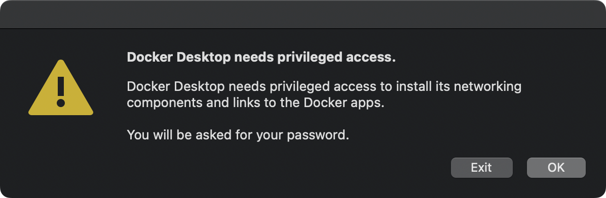
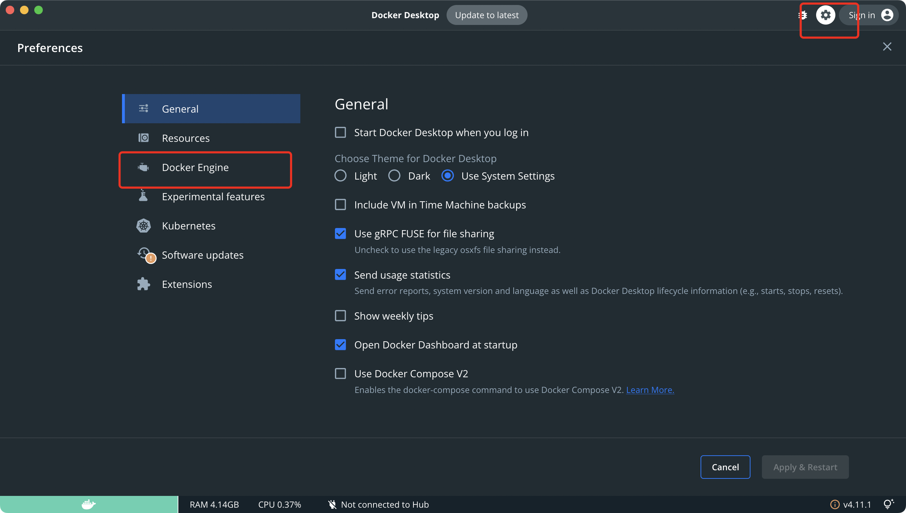
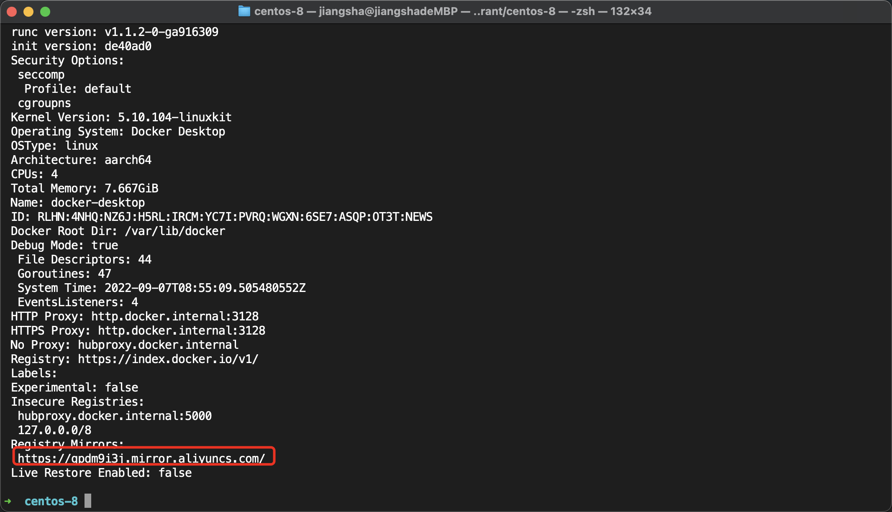

# Vagrant

## 添加box

我们需要将下载后的 `.box` 文件添加到 vagrant 中。

Vagrant 没有 GUI，只能从命令行访问，先启动一个命令行，然后执行:

````
$ vagrant box list
There are no installed boxes! Use `vagrant box add` to add some.
````

提示现在还没有 box。如果这是第一次运行，此时 `VAGRANT_HOME` 目录下会自动生成若干的文件和文件夹，其中有一个 `boxes` 文件夹，这就是要存放 box 文件的地方。

执行 `vagrant box add` 命令添加 box:

````
➜  boxes vagrant box add CentOS-8-Vagrant-8.1.1911-20200113.3.x86_64.vagrant-virtualbox.box --name centos-8
==> box: Box file was not detected as metadata. Adding it directly...
==> box: Adding box 'centos-8' (v0) for provider: 
    box: Unpacking necessary files from: file:///Users/jiangsha/Documents/infusion/develop/applications/vagrant/boxes/CentOS-8-Vagrant-8.1.1911-20200113.3.x86_64.vagrant-virtualbox.box
==> box: Successfully added box 'centos-8' (v0) for 'virtualbox'!
````

命令后面跟着的是下载的文件路径，并且通过 `--name centos-7` 为这个 box 指定一个名字。

后面创建虚机都需要指定这个名字，所以尽量把名字取得简短一点，同时也要能标识出这个镜像的信息（我们后面会定制自己的基础镜像，所以这里可以简单点）。

再次查询，可以看到有了一个 box：

````
➜  centos-8 vagrant box list
centos-8 (virtualbox, 0)
➜  centos-8 
````

## Vagrant 基本操作

### 新建虚拟机

创建一个目录，先执行 `vagrant init`：

```text
$ mkdir demo
$ cd demo
$ vagrant init centos-7
A `Vagrantfile` has been placed in this directory. You are now
ready to `vagrant up` your first virtual environment! Please read
the comments in the Vagrantfile as well as documentation on
`vagrantup.com` for more information on using Vagrant.
```

其中的 `centos-7` 就是我们要使用的 `box` 名字。

这个命令只是为我们生成一个 `Vagrantfile`，所以，这里的名字没指定或者写错了都没关系，后面会介绍如何编辑这个 `Vagrantfile` 来修改。

### 启动虚拟机

我们等会再来细看这个文件，现在直接按照提示执行 `vagrant up`：

```shell
➜  centos-8 vagrant up
No usable default provider could be found for your system.

Vagrant relies on interactions with 3rd party systems, known as
"providers", to provide Vagrant with resources to run development
environments. Examples are VirtualBox, VMware, Hyper-V.

The easiest solution to this message is to install VirtualBox, which
is available for free on all major platforms.

If you believe you already have a provider available, make sure it
is properly installed and configured. You can see more details about
why a particular provider isn't working by forcing usage with
`vagrant up --provider=PROVIDER`, which should give you a more specific
error message for that particular provider.
➜  centos-8 vagrant up --provider=PROVIDER
The provider 'PROVIDER' could not be found, but was requested to
back the machine 'default'. Please use a provider that exists.

Vagrant knows about the following providers: docker, hyperv, virtualbox
```

> 但是我这儿没有启动成功，原因无非是我是m1芯片的mac，需要依赖docker

### 安装docker

>本来使用dmg文件直接安装就行了，这儿我尝试使用Homebrew 来安装 [Docker](https://so.csdn.net/so/search?q=Docker&spm=1001.2101.3001.7020)

1. 终端输入

   ````
   brew install --cask --appdir=/Applications docker
   ````

   

2. 出现：docker was successfully installed! 安装成功。

   ````shell
   ➜  centos-8 brew install --cask --appdir=/Applications docker
   fatal: not in a git directory
   Warning: No remote 'origin' in /opt/homebrew/Library/Taps/homebrew/homebrew-services, skipping update!
   ==> Downloading https://desktop.docker.com/mac/main/arm64/84025/Docker.dmg
   ######################################################################## 100.0%
   ==> Installing Cask docker
   ==> Moving App 'Docker.app' to '/Applications/Docker.app'
   ==> Linking Binary 'docker-compose.bash-completion' to '/opt/homebrew/etc/bash_c
   ==> Linking Binary 'docker.zsh-completion' to '/opt/homebrew/share/zsh/site-func
   ==> Linking Binary 'docker.fish-completion' to '/opt/homebrew/share/fish/vendor_
   ==> Linking Binary 'docker-compose.fish-completion' to '/opt/homebrew/share/fish
   ==> Linking Binary 'docker-compose.zsh-completion' to '/opt/homebrew/share/zsh/s
   ==> Linking Binary 'docker.bash-completion' to '/opt/homebrew/etc/bash_completio
   🍺  docker was successfully installed!
   ````

3. 然后从启动台打开Docker，但是第一次使用需要给权限

   

   

4. 国内需要配置加速地址

   

   添加如下配置

   ````
   {
     "features": {
       "buildkit": true
     },
     "experimental": false,
     "debug": true,
     "registry-mirrors": [
         "https://gpdm9i3j.mirror.aliyuncs.com"
     ]
   }
   ````

   查看是否应用镜像成功，红框内容就是上面配置的国内镜像：
   

5. 通过`docker --version`查看版本

   ```
   ➜  centos-8 docker --version
   Docker version 20.10.17, build 100c701
   ```

6. 附常用docker国内镜像

   > 1、中科大: https://docker.mirrors.ustc.edu.cn
   >
   > 2、网易: http://hub-mirror.c.163.com
   >
   > 3、Docker 官方中国区: https://registry.docker-cn.com
   >
   > 4、七牛云: https://reg-mirror.qiniu.com

### Mac M1 使用docker + vagrant 配置虚拟机

现在可以通过 Docker 运行 VM 主机了，但我们不直接通过 Docker 运行它，而是使用 Vagrant。但是还需要做更多的操作。

## Vagrant初始化命令

> vagrant初始化虚拟机，是缺失了好多命令的，所以需要重新安装相关命令

1. ifconfig 命令不存在的情况

   ```
   yum -y install net-tools
   ```

2. wget命令

   ```
   yum -y install wget
   ```

3. 

