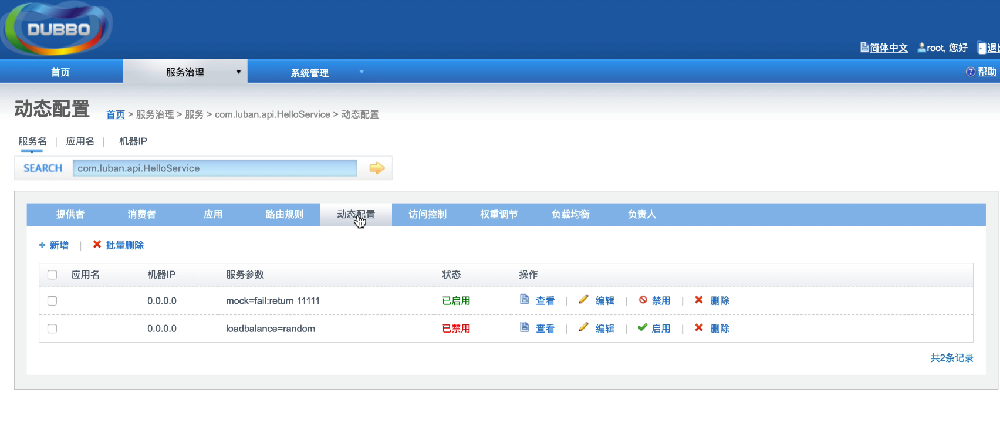
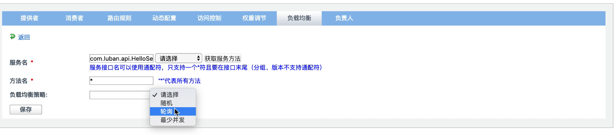
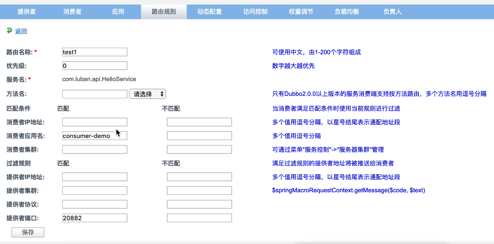
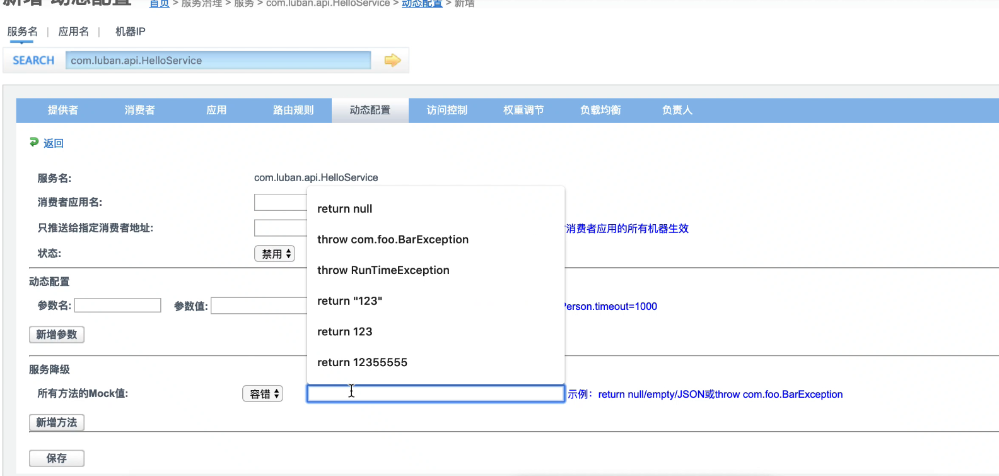
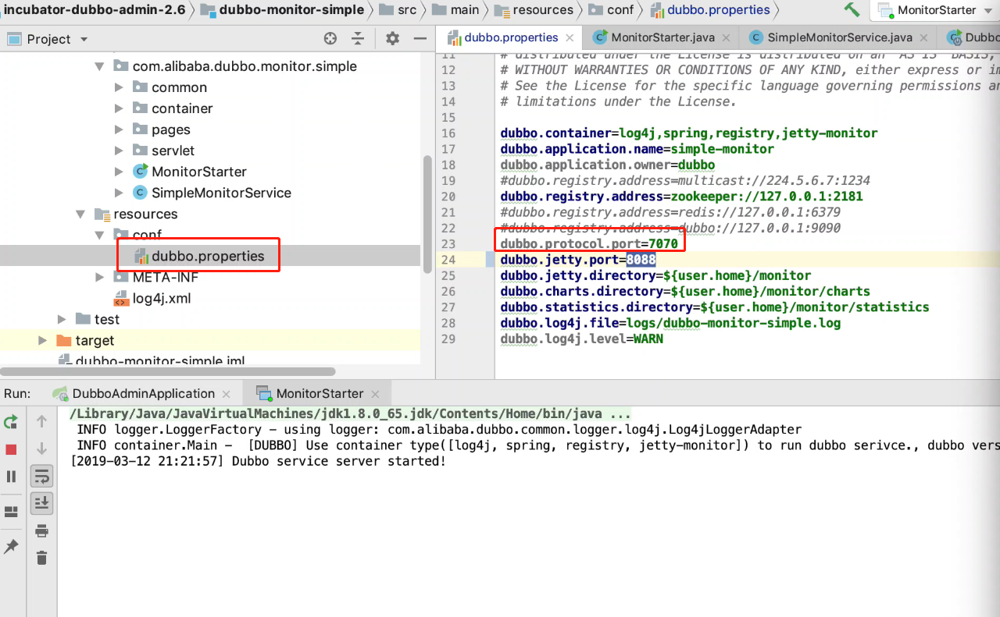
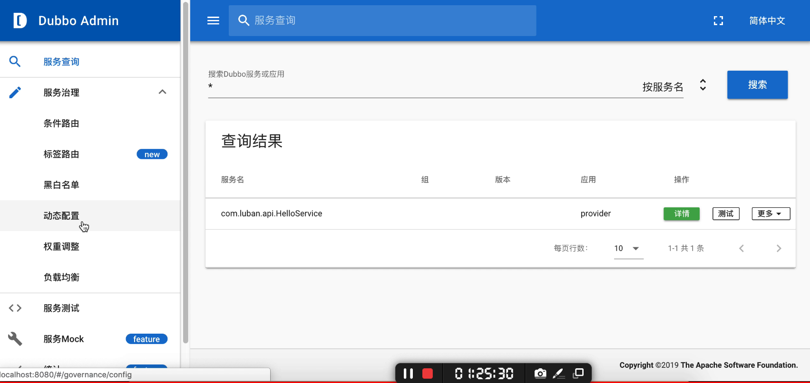

## 使用传统的xml方式

1. 创建一个新的mave工程，并加入依赖

   `这儿先用阿里巴巴的dubbo依赖来进行测试`

   ```xml
   <dependency>
       <groupId>com.alibaba</groupId>
       <artifactId>dubbo</artifactId>
       <version>2.6.6</version>
   </dependency>
   
   <!--使用了zookeeper的监控中心，需要加入zookeeper的客户端-->
   <dependency>
       <groupId>org.apache.zookeeper</groupId>
       <artifactId>zookeeper</artifactId>
       <version>3.4.11</version>
   </dependency>
   <dependency>
       <groupId>org.apache.curator</groupId>
       <artifactId>curator-framework</artifactId>
       <version>4.0.1</version>
   </dependency>
   <dependency>
       <groupId>org.apache.curator</groupId>
       <artifactId>curator-recipes</artifactId>
       <version>4.0.1</version>
   </dependency>
   
   <!--dubbo2.6.6加入netty的依赖，不然会报错-->
   <dependency>
       <groupId>io.netty</groupId>
       <artifactId>netty-all</artifactId>
       <version>4.1.32.Final</version>
   </dependency>
   ```

2. 创建公共的接口类

   `创建一个叫api的包，在其下创建一个接口`

   ````java
   package com.dubbo.api;
   
   /**
    * 消费者和提供者共用的服务
    */
   public interface HelloService {
       String sayHello(String username);
   }
   ````

3. 创建服务提供者

   `创建一个provider的包，在其下创建类实现咱们的接口`

   ````java
   package com.dubbo.provider;
   
   import com.dubbo.api.HelloService;
   
   public class HelloServiceImpl implements HelloService {
       @Override
       public String sayHello(String username) {
           return "Hello World" + username;
       }
   }
   ````

   `创建配置文件dubbo-provider.xml`

   ```xml
   <beans xmlns:xsi="http://www.w3.org/2001/XMLSchema-instance"
          xmlns:dubbo="http://dubbo.apache.org/schema/dubbo"
          xmlns="http://www.springframework.org/schema/beans"
          xsi:schemaLocation="http://www.springframework.org/schema/beans http://www.springframework.org/schema/beans/spring-beans-4.3.xsd
          http://dubbo.apache.org/schema/dubbo http://dubbo.apache.org/schema/dubbo/dubbo.xsd">
   
       <!-- provider's application name, used for tracing dependency relationship -->
       <!--服务名 -->
       <dubbo:application name="provider"/>
       <!-- use multicast registry center to export service -->
       <!--注册中心地址-->
       <dubbo:registry address="zookeeper://192.168.1.100:2181"/>
       <!-- use dubbo protocol to export service on port 20880 -->
       <dubbo:protocol name="dubbo" port="20880"/>
       <!-- service implementation, as same as regular local bean -->
       <bean id="helloService" class="com.dubbo.provider.HelloServiceImpl"/>
       <!-- declare the service interface to be exported -->
       <!--暴露服务-->
       <dubbo:service interface="com.dubbo.api.HelloService" ref="helloService"/>
   </beans>
   ```

   `创建类启动服务(进程)`

   ````java
   package com.dubbo.provider;
   
   import org.springframework.context.support.ClassPathXmlApplicationContext;
   
   import java.io.IOException;
   
   /**
    * Provider启动类
    */
   public class Provider {
   
       public static void main(String[] args) {
           ClassPathXmlApplicationContext  context =
                   new ClassPathXmlApplicationContext("dubbo-provider.xml");
   
           context.start();
   
           try {
               // 只要不在控制台输入任何字符，就会一直阻塞在这里
               System.in.read();
           } catch (IOException e) {
               e.printStackTrace();
           }
       }
   }
   
   ````

4. 创建消费者

   `这儿和服务提供者差不多，不在赘述，直接上代码`

   `dubbo-consumer.xml`

   ````xml
   <?xml version="1.0" encoding="UTF-8"?>
   <beans xmlns:xsi="http://www.w3.org/2001/XMLSchema-instance"
          xmlns:dubbo="http://dubbo.apache.org/schema/dubbo"
          xmlns="http://www.springframework.org/schema/beans"
          xsi:schemaLocation="http://www.springframework.org/schema/beans http://www.springframework.org/schema/beans/spring-beans-4.3.xsd
          http://dubbo.apache.org/schema/dubbo http://dubbo.apache.org/schema/dubbo/dubbo.xsd">
   
       <!-- consumer's application name, used for tracing dependency relationship (not a matching criterion),
       don't set it same as provider -->
       <dubbo:application name="consumer"/>
       <!-- use multicast registry center to discover service -->
       <dubbo:registry address="zookeeper://192.168.1.100:2181"/>
       <!-- generate proxy for the remote service, then demoService can be used in the same way as the
       local regular interface -->
       <dubbo:reference id="helloService" check="false" interface="com.dubbo.api.HelloService"/>
   </beans>
   ````

   ````java
   public class Consumer {
   
       public static void main(String[] args) {
           ClassPathXmlApplicationContext context
                   = new ClassPathXmlApplicationContext("dubbo-consumer.xml");
   
           HelloService helloService
                   = context.getBean("helloService", HelloService.class);
   
           System.out.println(helloService.sayHello("222"));
           // 这个例子相当于两个进程之间的调用
       }
   }
   ````

   ```java
   //测试成功
   Hello World222
   ```

   

## 搭建管理台

`同样，这儿选了比较老的管理中心`

### 1、去GitHub上面clone代码

访问`https://github.com/apache/dubbo-admin`切换`master`分支(`master`分支比较老，`develop`分支比较新)

1. 克隆

   `git clone https://github.com/apache/incubator-dubbo-ops`

2. ```java
   cd incubator-dubbo-ops && mvn package
   ```

### 2、导入到idea

是一个spring boot项目直接main方法启动，`spring.properties`配置文件里面有定义zookeeper的ip以及端口和访问管理网页的用户名和密码

### 3、管理台页面展示



`由上图可见，老版的管理台还是有很多功能`

在原来的方法里面加入了协议和地址的输出

```java
public class HelloServiceImpl implements HelloService {
    @Override
    public String sayHello(String username) {
        // 加入地址的打印
        URL url = RpcContext.getContext().getUrl();
        return "Hello World " + username
                + String.format("protocol is %s,address is %s", url.getProtocol(), url.getAddress());
    }
}
```

```xml
<!--提供方提供三个接口-->
<dubbo:protocol name="dubbo" port="20880"/>
<dubbo:protocol name="dubbo" port="20881"/>
<dubbo:protocol name="dubbo" port="20882"/>
```

客户端循环调用

```java
public class Consumer {

    public static void main(String[] args) {
        ClassPathXmlApplicationContext context
                = new ClassPathXmlApplicationContext("dubbo-consumer.xml");

        HelloService helloService
                = context.getBean("helloService", HelloService.class);

        for (int i = 0; i < 1000; i++) {
            try {
                System.out.println(helloService.sayHello("222"));
                TimeUnit.SECONDS.sleep(2);
            } catch (InterruptedException e) {
                e.printStackTrace();
            }
        }

    }
}
```

打印

```java
Hello World 222protocol is dubbo,address is 169.254.48.18:20881
Hello World 222protocol is dubbo,address is 169.254.48.18:20882
Hello World 222protocol is dubbo,address is 169.254.48.18:20880
.....   
```

#### 0.1、Dubbo里面的负载均衡策略

`策略可以在管理台里面的添加也可以在配置文件中间加入，一般来说管理台的优先级要大于代码中的配置文件`

````xml
<dubbo:reference id="helloService" check="false" 
                     interface="com.dubbo.api.HelloService" 
                     loadbalance="roundrobin"/><!--这儿的策略是轮训还有其他策略-->
````

管理台中的修改如下



默认是`random`的策略，除了这个还有其他

#### 1、提供者

#### 2、消费者

##### 容错

​	调用集群服务的失败的策略，`重试几次后报错`

##### 服务降级

​	`服务调用失败后，可以在后台给你模拟一些数据返回`

​	`在动态配置里面可以配置`

#### 3、应用

#### 4、路由规则

`在访问服务之前根据配置好的条件去限制或者不限制访问那台机器的那个方法，简单来说就是过滤`

`处于服务级别以上的`



`上图表示这个服务只能调用20882的端口的服务`

#### 5、动态配置

`配置服务的一些个具体的参数，包括容错的策略是服务级别的`

`服务级别`



上图的容错意思是错误后可以返回的数据，比如`return null` or `return 1234`

#### 6、访问控制

#### 7、权重调节

#### 8、负载均衡


#### 9、负责人

容错机制

在集群调用失败时，Dubbo 提供了多种容错方案，缺省为 failover 重试。


各节点关系：

- 这里的 `Invoker` 是 `Provider` 的一个可调用 `Service` 的抽象，`Invoker` 封装了 `Provider` 地址及 `Service` 接口信息
- `Directory` 代表多个 `Invoker`，可以把它看成 `List<Invoker>` ，但与 `List` 不同的是，它的值可能是动态变化的，比如注册中心推送变更
- `Cluster` 将 `Directory` 中的多个 `Invoker` 伪装成一个 `Invoker`，对上层透明，伪装过程包含了容错逻辑，调用失败后，重试另一个
- `Router` 负责从多个 `Invoker` 中按路由规则选出子集，比如读写分离，应用隔离等
- `LoadBalance` 负责从多个 `Invoker` 中选出具体的一个用于本次调用，选的过程包含了负载均衡算法，调用失败后，需要重选

## 监控中心

```
同样通过github上面克隆项目，导入idea里面跑起来就行了，只是提供端和消费端都要加上<dubbo:monitor address = "127.0.0.1:7070">
的配置，这个配置要和项目中的配置端口号一致
```



## 2.7的管理台

在github里面切develop分支即可，下面的readme文件有详细的说明



`2。7新增配置中心，标签路由`

配置中心：

注册中心是存服务的，配置中心是存配置的

外部化配置中心，可以将注册中心移动到外部配置文件里面比如`dubbo.properties`

```xml
<dubbo:config-center address="zookeeper://127.0.0.1:2181">
原来为
<dubbo:registry address="zookeeper://192.168.1.100:2181"/>    
```

`其实说白了就是一个配置的问题，在2.7的管理管理台下面有创建配置的地方，里面有注册中心的配置，或者元数据信息的配置，简单来说就是将原本配在代码中的配置外部化了`

`标签路由，可以实现一个灰度发布，比如可以指定一个线上的机器发布了新的版本，程序员只需要代码里面的tag与其对应即可，这样测试人员就可以去访问测试`

# 负载均衡

在集群负载均衡时，Dubbo 提供了多种均衡策略，缺省为 `random` 随机调用。

可以自行扩展负载均衡策略，参见：[负载均衡扩展](http://dubbo.apache.org/zh-cn/docs/dev/impls/load-balance.html)

## 负载均衡策略

### Random LoadBalance

- **随机**，按权重设置随机概率。
- 在一个截面上碰撞的概率高，但调用量越大分布越均匀，而且按概率使用权重后也比较均匀，有利于动态调整提供者权重。

### RoundRobin LoadBalance

- **轮询**，按公约后的权重设置轮询比率。
- 存在慢的提供者累积请求的问题，比如：第二台机器很慢，但没挂，当请求调到第二台时就卡在那，久而久之，所有请求都卡在调到第二台上。

### LeastActive LoadBalance

- **最少活跃调用数**，相同活跃数的随机，活跃数指调用前后计数差。
- 使慢的提供者收到更少请求，因为越慢的提供者的调用前后计数差会越大。

### ConsistentHash LoadBalance

- **一致性 Hash**，相同参数的请求总是发到同一提供者。
- 当某一台提供者挂时，原本发往该提供者的请求，基于虚拟节点，平摊到其它提供者，不会引起剧烈变动。
- 算法参见：http://en.wikipedia.org/wiki/Consistent_hashing
- 缺省只对第一个参数 Hash，如果要修改，请配置 `<dubbo:parameter key="hash.arguments" value="0,1" />`
- 缺省用 160 份虚拟节点，如果要修改，请配置 `<dubbo:parameter key="hash.nodes" value="320" />`

## 配置

### 服务端服务级别

```xml
<dubbo:service interface="..." loadbalance="roundrobin" />
```

### 客户端服务级别

```xml
<dubbo:reference interface="..." loadbalance="roundrobin" />
```

### 服务端方法级别

```xml
<dubbo:service interface="...">
    <dubbo:method name="..." loadbalance="roundrobin"/>
</dubbo:service>
```

### 客户端方法级别

```xml
<dubbo:reference interface="...">
    <dubbo:method name="..." loadbalance="roundrobin"/>
</dubbo:reference>
```

# 集群容错

在集群调用失败时，Dubbo 提供了多种容错方案，缺省为 failover 重试。


各节点关系：

- 这里的 `Invoker` 是 `Provider` 的一个可调用 `Service` 的抽象，`Invoker` 封装了 `Provider` 地址及 `Service` 接口信息
- `Directory` 代表多个 `Invoker`，可以把它看成 `List<Invoker>` ，但与 `List` 不同的是，它的值可能是动态变化的，比如注册中心推送变更
- `Cluster` 将 `Directory` 中的多个 `Invoker` 伪装成一个 `Invoker`，对上层透明，伪装过程包含了容错逻辑，调用失败后，重试另一个
- `Router` 负责从多个 `Invoker` 中按路由规则选出子集，比如读写分离，应用隔离等
- `LoadBalance` 负责从多个 `Invoker` 中选出具体的一个用于本次调用，选的过程包含了负载均衡算法，调用失败后，需要重选

## 集群容错模式

可以自行扩展集群容错策略，参见：[集群扩展](http://dubbo.apache.org/zh-cn/docs/dev/impls/cluster.html)

### Failover Cluster

失败自动切换，当出现失败，重试其它服务器 [[1\]](http://dubbo.apache.org/zh-cn/docs/user/demos/fault-tolerent-strategy.html#fn1)。通常用于读操作，但重试会带来更长延迟。可通过 `retries="2"` 来设置重试次数(不含第一次)。

重试次数配置如下：

```xml
<dubbo:service retries="2" />
```

或

```xml
<dubbo:reference retries="2" />
```

或

```xml
<dubbo:reference>
    <dubbo:method name="findFoo" retries="2" />
</dubbo:reference>
```

### Failfast Cluster

快速失败，只发起一次调用，失败立即报错。通常用于非幂等性的写操作，比如新增记录。

### Failsafe Cluster

失败安全，出现异常时，直接忽略。通常用于写入审计日志等操作。

### Failback Cluster

失败自动恢复，后台记录失败请求，定时重发。通常用于消息通知操作。

### Forking Cluster

并行调用多个服务器，只要一个成功即返回。通常用于实时性要求较高的读操作，但需要浪费更多服务资源。可通过 `forks="2"` 来设置最大并行数。

### Broadcast Cluster

广播调用所有提供者，逐个调用，任意一台报错则报错 [[2\]](http://dubbo.apache.org/zh-cn/docs/user/demos/fault-tolerent-strategy.html#fn2)。通常用于通知所有提供者更新缓存或日志等本地资源信息。

## 集群模式配置

按照以下示例在服务提供方和消费方配置集群模式

```xml
<dubbo:service cluster="failsafe" />
```

或

```xml
<dubbo:reference cluster="failsafe" />
```

------

1. 该配置为缺省配置 [↩︎](http://dubbo.apache.org/zh-cn/docs/user/demos/fault-tolerent-strategy.html#fnref1)
2. `2.1.0` 开始支持 [↩︎](http://dubbo.apache.org/zh-cn/docs/user/demos/fault-tolerent-strategy.html#fnref2)