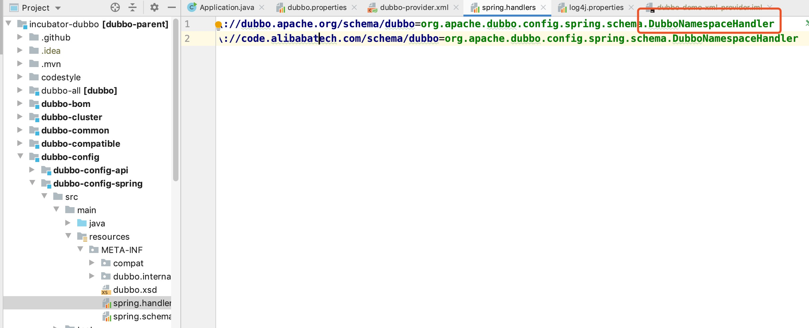
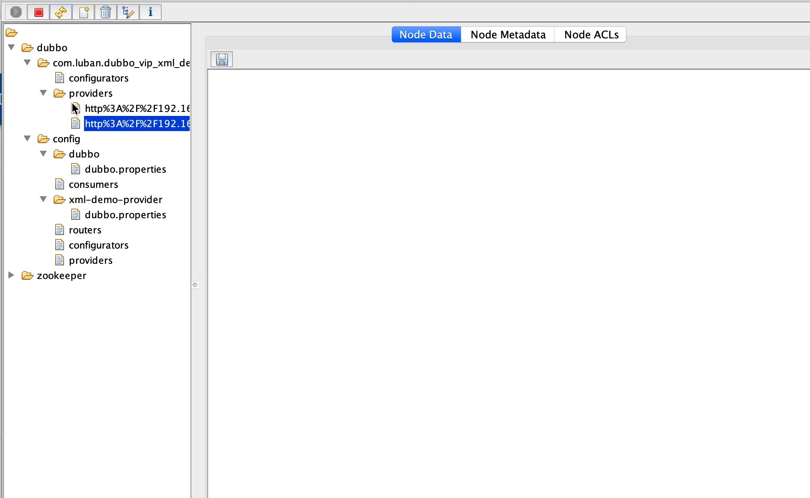

# Duboo服务导出

我们先来看一个简单的xml例子:

````xml
<dubbo:application name="demo-provider"/>

<dubbo:registry address="multicast://224.5.6.7:1234" />

<!-- use dubbo protocol to export service on port 20880 -->
<dubbo:protocol name="dubbo"/>

<!-- service implementation, as same as regular local bean -->
<bean id="demoService" class="org.apache.dubbo.demo.provider.DemoServiceImpl"/>

<!-- declare the service interface to be exported -->
<dubbo:service interface="org.apache.dubbo.demo.DemoService" ref="demoService"/>
````

首先讨论的问题是**Spring会提供什么接口让dubbo自定义的标签？**

在Dubbo的`dubbo-config`模块下面的`doubbo-config-spring`模块下面的`Spring.handlers`文件里面有对应的配置



`````java
public class DubboNamespaceHandler extends NamespaceHandlerSupport {

    static {
        Version.checkDuplicate(DubboNamespaceHandler.class);
    }

    @Override
    public void init() {
        registerBeanDefinitionParser("application", new DubboBeanDefinitionParser(ApplicationConfig.class, true));
        registerBeanDefinitionParser("module", new DubboBeanDefinitionParser(ModuleConfig.class, true));
        registerBeanDefinitionParser("registry", new DubboBeanDefinitionParser(RegistryConfig.class, true));
        registerBeanDefinitionParser("config-center", new DubboBeanDefinitionParser(ConfigCenterBean.class, true));
        registerBeanDefinitionParser("metadata-report", new DubboBeanDefinitionParser(MetadataReportConfig.class, true));
        registerBeanDefinitionParser("monitor", new DubboBeanDefinitionParser(MonitorConfig.class, true));
        registerBeanDefinitionParser("provider", new DubboBeanDefinitionParser(ProviderConfig.class, true));
        registerBeanDefinitionParser("consumer", new DubboBeanDefinitionParser(ConsumerConfig.class, true));
        registerBeanDefinitionParser("protocol", new DubboBeanDefinitionParser(ProtocolConfig.class, true));
        registerBeanDefinitionParser("service", new DubboBeanDefinitionParser(ServiceBean.class, true));
        registerBeanDefinitionParser("reference", new DubboBeanDefinitionParser(ReferenceBean.class, false));
        registerBeanDefinitionParser("annotation", new AnnotationBeanDefinitionParser());
    }

}
`````

这些`registerBeanDefinitionParser`就是解析xml中对应标签里面的内容取出然后生成对应的bean，比如`ServiceBean`对应`<dubbo:service interface="org.apache.dubbo.demo.DemoService" ref="demoService"/>`在`ServiceBean`里面就有service，在它的父类里面就有ref这些个属性。

````java
public class ServiceBean<T> extends ServiceConfig<T> implements InitializingBean, DisposableBean,
        ApplicationContextAware, ApplicationListener<ContextRefreshedEvent>, BeanNameAware,
        ApplicationEventPublisherAware {


    private static final long serialVersionUID = 213195494150089726L;

    private final transient Service service;

    private transient ApplicationContext applicationContext;

    private transient String beanName;

    private transient boolean supportedApplicationListener;

    private ApplicationEventPublisher applicationEventPublisher;

    public ServiceBean() {
        super();
        this.service = null;
    }

    public ServiceBean(Service service) {
        super(service);
        this.service = service;
    }

    @Override
    public void setApplicationContext(ApplicationContext applicationContext) {
        this.applicationContext = applicationContext;
        SpringExtensionFactory.addApplicationContext(applicationContext);
        supportedApplicationListener = addApplicationListener(applicationContext, this);
    }

    @Override
    public void setBeanName(String name) {
        this.beanName = name;
    }

    /**
     * Gets associated {@link Service}
     *
     * @return associated {@link Service}
     */
    public Service getService() {
        return service;
    }
		// 重点：Spring有什么事件发送过来的时候，调用这个方法
    @Override
    public void onApplicationEvent(ContextRefreshedEvent event) {
        if (!isExported() && !isUnexported()) {
            if (logger.isInfoEnabled()) {
                logger.info("The service ready on spring started. service: " + getInterface());
            }
            // 入口
            export();
        }
    }
		// 属性设置好了执行这个方法
    // 设置serviceBean属于哪个provider，哪个module
    @Override
    @SuppressWarnings({"unchecked", "deprecation"})
    public void afterPropertiesSet() throws Exception {
    }    
}
````

这个类很长，但是有几个比较重要的方法，`afterPropertiesSet`删了内容体，它会先比`onApplicationEvent`执行，这个方法主要是去**设置`<dubbo:service>`标签属于哪个provider，哪个模块下面的，因为在上面的xml里面我们看不出这些个标签到底是在哪个服务提供者里面，简单来说就是设置父节点的值**，所以这个方法就是把之前读取的标签的内容全部加在这个`serviceBean`上面，比如之前实例化了Applicaiton标签`<dubbo:application name="demo-provider"/>`对应的`ApplicationBean`，这个就会把`ApplicationBean`的配置加在这个类上。所以这个方法执行完后，就将`serviceBean`类加上父节点的信息；

重点在`export()`这个方法，这个方法才是这次讨论的核心，服务导出和暴露以及注册

````java
public synchronized void export() {
        // 1.检查以及更新配置
        // 因为配置存在的地方不止存在xml，
        //  1.xml
        //  2.-D 系统配置，启动参数
        //  3.Dubbo.properties
        //  4.配置中心
        //    1.全局配置
        //    2.针对某个应用的配置
        // 所以既然有这么多地方，那么到底用哪个，所以dubbo要定义配置的优先级
        // 更新规则：
        //  1.子节点覆盖父节点
        //  2.子节点取父节点的值
        checkAndUpdateSubConfigs();

        if (!shouldExport()) {
            return;
        }

        if (shouldDelay()) {
            delayExportExecutor.schedule(this::doExport, delay, TimeUnit.MILLISECONDS);
        } else {
            doExport();
        }
    }
````

我们来看`checkAndUpdateSubConfigs()`这个方法

````java
public void checkAndUpdateSubConfigs() {
        // Use default configs defined explicitly on global configs
        completeCompoundConfigs();
        // Config Center should always being started first.
        startConfigCenter();
        checkDefault();
        checkApplication();
        checkRegistry();
        checkProtocol();
        // 很多地方都用到这个方法，它主要去取外面的配置，根据优先级，然后更新bean的属性的值
        // 所以refresh方法就是把dubbo的所有配置刷新了一遍
        // 也就是说读取xml里面的配置的时候初始化了bean，有些初始化值，但是因为有外部配置的关系
        // 所以这儿就是把优先级高的外部配置里对应的配置set进了bean里面
        this.refresh();
        checkMetadataReport();

        if (StringUtils.isEmpty(interfaceName)) {
            throw new IllegalStateException("<dubbo:service interface=\"\" /> interface not allow null!");
        }

        if (ref instanceof GenericService) {
            interfaceClass = GenericService.class;
            if (StringUtils.isEmpty(generic)) {
                generic = Boolean.TRUE.toString();
            }
        } else {
            try {
                // 定义的接口实例化为class
                interfaceClass = Class.forName(interfaceName, true, Thread.currentThread()
                        .getContextClassLoader());
            } catch (ClassNotFoundException e) {
                throw new IllegalStateException(e.getMessage(), e);
            }
            // 检查方法是否属于接口
            // <dubbo:service>
            //      <dubbo:method>
            //      <dubbo:parameter>
            // <dubbo:service>
            checkInterfaceAndMethods(interfaceClass, methods);
            checkRef();
            generic = Boolean.FALSE.toString();
        }
        if (local != null) {
            if ("true".equals(local)) {
                local = interfaceName + "Local";
            }
            Class<?> localClass;
            try {
                localClass = ClassHelper.forNameWithThreadContextClassLoader(local);
            } catch (ClassNotFoundException e) {
                throw new IllegalStateException(e.getMessage(), e);
            }
            if (!interfaceClass.isAssignableFrom(localClass)) {
                throw new IllegalStateException("The local implementation class " + localClass.getName() + " not implement interface " + interfaceName);
            }
        }
        // 应用服务存根
        if (stub != null) {
            if ("true".equals(stub)) {
                stub = interfaceName + "Stub";
            }
            Class<?> stubClass;
            try {
                stubClass = ClassHelper.forNameWithThreadContextClassLoader(stub);
            } catch (ClassNotFoundException e) {
                throw new IllegalStateException(e.getMessage(), e);
            }
            if (!interfaceClass.isAssignableFrom(stubClass)) {
                throw new IllegalStateException("The stub implementation class " + stubClass.getName() + " not implement interface " + interfaceName);
            }
        }
        checkStubAndLocal(interfaceClass);
        // mock检查
        checkMock(interfaceClass);
    }
````

`this.refresh();`前面的方法都是一些个验证的方法，暂时不看，先看这个方法，它主要去**加载外部配置里面优先级高的配置到Bean对象对应的配置，其实就是刷新的意思，代码里面有详细的解释**

所有配置：

1. xml bean初始化值
2. -D 系统配置，启动参数
3. dubbo.properties
4. 配置中心  app配置
5. 配置中心 全局

通过`this.refresh();`方法读取这些配置，并根据优先级排序，然后再set进bean里面，就是覆盖配置

````java
// 它主要去取外面的配置，根据优先级，然后更新bean的属性的值，
// 比如xml里面写的是timeout = 500，但是外部配置里面优先级高的是400 ，所以这儿会更新为400
public void refresh() {
  try {
    // 从外面拿到配置项的值，通过优先级获取
    //      ProviderConfig, 属性默认值 = xml里面写的
    //      getId() -> 对应 <dubbo:service id= "">
    //      getPrefix() xml前缀拼上服务名。比如：dubbo.service.com.xxx.service
    // 获取3种外部配置
    // 1.System配置主要是通过System.getProperty()获取
    // 2.dubbo.properties配置，主要是去读取配置文件获取，但是如果System中有的话就用System的
    // 3.读取配置中心的配置，这个就有点科幻了，其实在代码里面就是读取两个map的值
    //   1.因为配置中心采用的是zookeeper，所以配置都存在znode里面，在前面的方法就把这些配置从配置中心拉取到了两个map里面
    //   2.这儿只是读取，怎么从zookeeper获取的呢？
    //      1.通过SPI的方式，拿到zookeeper的实现类，然后再构造节点信息，通过curator来获取，在dubbo-configcenter-zookeeper模块里面
    //
    CompositeConfiguration compositeConfiguration = Environment.getInstance().getConfiguration(getPrefix(), getId());
    InmemoryConfiguration config = new InmemoryConfiguration(getPrefix(), getId());
    // getMetaData()获取bean的初始化值，比如ApplicationConfig或者其他的
    config.addProperties(getMetaData());
    // 确定config配置的优先级，也就是排第几个
    if (Environment.getInstance().isConfigCenterFirst()) {
      // The sequence would be: SystemConfiguration -> AppExternalConfiguration -> ExternalConfiguration -> AbstractConfig -> PropertiesConfiguration
      compositeConfiguration.addConfiguration(3, config);
    } else {
      // The sequence would be: SystemConfiguration -> AbstractConfig -> AppExternalConfiguration -> ExternalConfiguration -> PropertiesConfiguration
      compositeConfiguration.addConfiguration(1, config);
    }
    // 所以根据上面的判断，最后配置顺序为：
    // 默认：system -> 配置中心APP的配置 -> 配置中心全局配置 -> bean初始化值 -> properties文件
    // 或者 system ->  bean初始化值 -> 配置中心APP的配置 -> 配置中心全局配置  -> properties文件
    // loop methods, get override value and set the new value back to method
    // getClass()获取类，比如ProviderConfig.class
    // 这儿就是将外部项配置set进去
    Method[] methods = getClass().getMethods();
    for (Method method : methods) {
      if (ClassHelper.isSetter(method)) {
        try {
          // 根据优先级从外部配置的configList里面获取key对应的配置项
          // 上面的代码就是把外部配置以及内部bean的初始化值根据优先级放入configList里面
          // 结论就是system的最高优先级然后就是bean的初始化值，其次是配置中心最后是properties
          String value = StringUtils.trim(compositeConfiguration.getString(extractPropertyName(getClass(), method)));
          // isTypeMatch() is called to avoid duplicate and incorrect update, for example, we have two 'setGeneric' methods in ReferenceConfig.
          // 将外面配置项set进去，就是覆盖配置
          if (StringUtils.isNotEmpty(value) && ClassHelper.isTypeMatch(method.getParameterTypes()[0], value)) {
            method.invoke(this, ClassHelper.convertPrimitive(method.getParameterTypes()[0], value));
          }
        } catch (NoSuchMethodException e) {
          logger.info("Failed to override the property " + method.getName() + " in " +
                      this.getClass().getSimpleName() +
                      ", please make sure every property has getter/setter method provided.");
        }
      }
    }
  } catch (Exception e) {
    logger.error("Failed to override ", e);
  }
}
````

**关于通过SPI拿到zookeeper配置中心里面的配置的代码这儿就不贴了，在`dubbo-configcenter-zookeeper`模块里面，其实就是构建对应的znode路径，然后通过curator拿到**，下面就是zookeeper配置中心里面的图：



这儿是用了zookeeper的一个图形化工具看到的，可以看到dubbo的管控台生成的配置信息在上面，比如app配置信息，或者全局配置信息。

我们继续执行代码：

````java
public synchronized void export() {
  // 1.检查以及更新配置
  // 因为配置存在的地方不止存在xml，
  //  1.xml
  //  2.-D 系统配置，启动参数
  //  3.Dubbo.properties
  //  4.配置中心
  //    1.全局配置
  //    2.针对某个应用的配置
  // 所以既然有这么多地方，那么到底用哪个，所以dubbo要定义配置的优先级
  // 更新规则：
  //  1.子节点覆盖父节点
  //  2.子节点取父节点的值
  checkAndUpdateSubConfigs();

  if (!shouldExport()) {
    return;
  }

  if (shouldDelay()) {
    delayExportExecutor.schedule(this::doExport, delay, TimeUnit.MILLISECONDS);
  } else {
    // 直接导出
    doExport();
  }
}
````

`doExport()`直接导出

````java
protected synchronized void doExport() {
  if (unexported) {
    throw new IllegalStateException("The service " + interfaceClass.getName() + " has already unexported!");
  }
  if (exported) {
    return;
  }
  exported = true;

  if (StringUtils.isEmpty(path)) {
    path = interfaceName;
  }
  // 多个协议导出多个服务，针对每个协议导出服务，每个服务都注册到注册中心
  doExportUrls();
}
````

`doExportUrls()`

````java
private void doExportUrls() {
  // 构造注册中心的URL
  // 一个URL就代表一个注册中心，包括服务的地址以及它的配置
  // registry://127.0.0.1/org.apache.dubbo.registry.RegistryService?application
  // = xml-demo-provider&dubbo=2.0.2&pid=3397&registry=zookeeper....
  List<URL> registryURLs = loadRegistries(true);
  for (ProtocolConfig protocolConfig : protocols) {
    String pathKey = URL.buildKey(getContextPath(protocolConfig).map(p -> p + "/" + path).orElse(path), group, version);
    ProviderModel providerModel = new ProviderModel(pathKey, ref, interfaceClass);
    ApplicationModel.initProviderModel(pathKey, providerModel);
    // 对单个协议进行导出，其实就是对每个协议进行注册
    doExportUrlsFor1Protocol(protocolConfig, registryURLs);
  }
}
````

从上面的代码可以看出，服务导出其实是先构造一个**注册中心的URL**，然后根据配置中的协议来一个一个的进行注册，下面就是配置的协议

````xml
<dubbo:protocol name="dubbo" port="8081"/>
<dubbo:protocol name="http" server="tomcate" port="8082"/>
````

`doExportUrlsFor1Protocol(protocolConfig, registryURLs);`

````java
// 1.翻译成url
// 2.把url保存到zk上面
private void doExportUrlsFor1Protocol(ProtocolConfig protocolConfig, List<URL> registryURLs) {
  String name = protocolConfig.getName();
  // 默认Dubbo协议
  if (StringUtils.isEmpty(name)) {
    name = Constants.DUBBO;
  }
  // 一层一层的往map里面put配置信息，比如applicationBean的或者providerBean的，但是相同的配置会
  // 被之前refresh过的配置覆盖
  Map<String, String> map = new HashMap<String, String>();
  map.put(Constants.SIDE_KEY, Constants.PROVIDER_SIDE);
  appendRuntimeParameters(map);
  appendParameters(map, application);
  appendParameters(map, module);
  appendParameters(map, provider, Constants.DEFAULT_KEY);
  appendParameters(map, protocolConfig);
  appendParameters(map, this); // 覆盖，比如this里面有一个timeout 而provider里面有一个timeout，所以这儿会覆盖
  if (CollectionUtils.isNotEmpty(methods)) {
    for (MethodConfig method : methods) {
      appendParameters(map, method, method.getName());
      String retryKey = method.getName() + ".retry";
      if (map.containsKey(retryKey)) {
        String retryValue = map.remove(retryKey);
        if ("false".equals(retryValue)) {
          map.put(method.getName() + ".retries", "0");
        }
      }
      List<ArgumentConfig> arguments = method.getArguments();
      if (CollectionUtils.isNotEmpty(arguments)) {
        for (ArgumentConfig argument : arguments) {
          // convert argument type
          if (argument.getType() != null && argument.getType().length() > 0) {
            Method[] methods = interfaceClass.getMethods();
            // visit all methods
            if (methods != null && methods.length > 0) {
              for (int i = 0; i < methods.length; i++) {
                String methodName = methods[i].getName();
                // target the method, and get its signature
                if (methodName.equals(method.getName())) {
                  Class<?>[] argtypes = methods[i].getParameterTypes();
                  // one callback in the method
                  if (argument.getIndex() != -1) {
                    if (argtypes[argument.getIndex()].getName().equals(argument.getType())) {
                      appendParameters(map, argument, method.getName() + "." + argument.getIndex());
                    } else {
                      throw new IllegalArgumentException("Argument config error : the index attribute and type attribute not match :index :" + argument.getIndex() + ", type:" + argument.getType());
                    }
                  } else {
                    // multiple callbacks in the method
                    for (int j = 0; j < argtypes.length; j++) {
                      Class<?> argclazz = argtypes[j];
                      if (argclazz.getName().equals(argument.getType())) {
                        appendParameters(map, argument, method.getName() + "." + j);
                        if (argument.getIndex() != -1 && argument.getIndex() != j) {
                          throw new IllegalArgumentException("Argument config error : the index attribute and type attribute not match :index :" + argument.getIndex() + ", type:" + argument.getType());
                        }
                      }
                    }
                  }
                }
              }
            }
          } else if (argument.getIndex() != -1) {
            appendParameters(map, argument, method.getName() + "." + argument.getIndex());
          } else {
            throw new IllegalArgumentException("Argument config must set index or type attribute.eg: <dubbo:argument index='0' .../> or <dubbo:argument type=xxx .../>");
          }

        }
      }
    } // end of methods for
  }

  if (ProtocolUtils.isGeneric(generic)) {
    map.put(Constants.GENERIC_KEY, generic);
    map.put(Constants.METHODS_KEY, Constants.ANY_VALUE);
  } else {
    // 取出版本号 dubbo2.7.2 -> 2.7.2
    String revision = Version.getVersion(interfaceClass, version);
    if (revision != null && revision.length() > 0) {
      map.put(Constants.REVISION_KEY, revision);
    }
    // 拿到暴露服务接口的方法
    String[] methods = Wrapper.getWrapper(interfaceClass).getMethodNames();
    if (methods.length == 0) {
      logger.warn("No method found in service interface " + interfaceClass.getName());
      map.put(Constants.METHODS_KEY, Constants.ANY_VALUE);
    } else {
      // 给方法添加methodKey，构造URL上面会有，这样就不会把所有的方法拼在上面了。
      map.put(Constants.METHODS_KEY, StringUtils.join(new HashSet<String>(Arrays.asList(methods)), ","));
    }
  }
  // 设置token保证服务安全，调用的时候需要从注册中心拿到token然后传给服务端，再进行一个验证，可以保证服务的安全
  // 不然任何人都可以调用服务
  if (!ConfigUtils.isEmpty(token)) {
    if (ConfigUtils.isDefault(token)) {
      map.put(Constants.TOKEN_KEY, UUID.randomUUID().toString());
    } else {
      map.put(Constants.TOKEN_KEY, token);
    }
  }
  // export service
  String host = this.findConfigedHosts(protocolConfig, registryURLs, map);
  Integer port = this.findConfigedPorts(protocolConfig, name, map);
  // 构造URL，其实就是构造服务
  URL url = new URL(name, host, port, getContextPath(protocolConfig).map(p -> p + "/" + path).orElse(path), map);

  if (ExtensionLoader.getExtensionLoader(ConfiguratorFactory.class)
      .hasExtension(url.getProtocol())) {
    url = ExtensionLoader.getExtensionLoader(ConfiguratorFactory.class)
      .getExtension(url.getProtocol()).getConfigurator(url).configure(url);
  }

  String scope = url.getParameter(Constants.SCOPE_KEY);
  // don't export when none is configured
  // 暴露服务 重要
  if (!Constants.SCOPE_NONE.equalsIgnoreCase(scope)) {

    // export to local if the config is not remote (export to remote only when config is remote)
    // 如果scope不是scope_remote就只暴露本地服务
    if (!Constants.SCOPE_REMOTE.equalsIgnoreCase(scope)) {
      exportLocal(url); // 如果是本地导出服务，就修改URL为ijvm协议 ijvm://.....
    }
    // export to remote if the config is not local (export to local only when config is local)
    if (!Constants.SCOPE_LOCAL.equalsIgnoreCase(scope)) {
      if (logger.isInfoEnabled()) {
        logger.info("Export dubbo service " + interfaceClass.getName() + " to url " + url);
      }
      if (CollectionUtils.isNotEmpty(registryURLs)) {
        for (URL registryURL : registryURLs) {
          url = url.addParameterIfAbsent(Constants.DYNAMIC_KEY, registryURL.getParameter(Constants.DYNAMIC_KEY));
          URL monitorUrl = loadMonitor(registryURL);
          if (monitorUrl != null) {
            url = url.addParameterAndEncoded(Constants.MONITOR_KEY, monitorUrl.toFullString());
          }
          if (logger.isInfoEnabled()) {
            logger.info("Register dubbo service " + interfaceClass.getName() + " url " + url + " to registry " + registryURL);
          }

          // For providers, this is used to enable custom proxy to generate invoker
          String proxy = url.getParameter(Constants.PROXY_KEY);
          if (StringUtils.isNotEmpty(proxy)) {
            registryURL = registryURL.addParameter(Constants.PROXY_KEY, proxy);
          }

          Invoker<?> invoker = proxyFactory.getInvoker(ref, (Class) interfaceClass, registryURL.addParameterAndEncoded(Constants.EXPORT_KEY, url.toFullString()));
          DelegateProviderMetaDataInvoker wrapperInvoker = new DelegateProviderMetaDataInvoker(invoker, this);

          Exporter<?> exporter = protocol.export(wrapperInvoker);
          exporters.add(exporter);
        }
      } else {
        // 构造执行者，其实就是将url后面加上&export=http:// ........ 然后再构造执行者
        Invoker<?> invoker = proxyFactory.getInvoker(ref, (Class) interfaceClass, url);
        DelegateProviderMetaDataInvoker wrapperInvoker = new DelegateProviderMetaDataInvoker(invoker, this);
        // protocol取得是接口Protocol.class的代理类，根据dubboSPI 这儿执行方法会从URL中获取参数对应的信息
        // 找到对应的实现类，然后去执行实现类里面的export方法
        // 比如url是registry://....开头的，这儿就会拿到registry的协议，然后找到实现类RegistryProtocol
        // 然后执行RegistryProtocol的export方法
        Exporter<?> exporter = protocol.export(wrapperInvoker);
        exporters.add(exporter);
      }
      /**
                 * @since 2.7.0
                 * ServiceData Store
                 */
      MetadataReportService metadataReportService = null;
      if ((metadataReportService = getMetadataReportService()) != null) {
        metadataReportService.publishProvider(url);
      }
    }
  }
  this.urls.add(url);
}
````

这个方法很长，一点一点分析：

1. 构造配置map，首先会把之前配合的configurationBean或者providerBean的配置放进map
2. 再把之前refresh过的配置加入进去，如果有有相同的就会覆盖，简而言之就是refresh的配置会把之前实例化的bean的配置给覆盖了。
3. 然后再根据协议构造URL，其实就是把map里面的配置加到URL上面，比如`registry://127.0.0.1:2181/org.apache.dubbo.registry.RegistryService?&registryKey=zookeeper& application=democonsumer&dubbo=2.0.2&interface=org.apache.dubbo.registry.RegistryService&pid=1214&qos.po rt=33333×tamp=1545721981946`
4. 构造执行者`Invoker`，这个方法就是把URL后面加上一段`&export=http://...`，这个export就是要注册的服务，比如：`registry://127.0.0.1:2181/org.apache.dubbo.registry.RegistryService? &registryKey=zookeeper&application=democonsumer&dubbo=2.0.2&interface=org.apache.dubbo.registry.RegistryService&pid=1214&qos.po rt=33333×tamp=1545721981946&export=dubbo://192.168.1.6:20880/com.luban.HelloService?timeout=3000`
5. `Exporter<?> exporter = protocol.export(wrapperInvoker);`
   1. `protocol = ExtensionLoader.getExtensionLoader(Protocol.class).getAdaptiveExtension();`
   2. 很显然protocol是通过SPI拿出来的代理类，这儿的protocol就是根据URL的开头拿的，比如url是registry://....开头的，这儿就会拿到registry的协议，然后找到实现类RegistryProtocol
   3. 这儿拿出来的是`RegistryProtocol`
   4. 执行export方法

**所以这个方法其实就是将构造的注册中心的URL加上我们之前处理的配置，然后把注册的服务也通过`&export=http://....`的方式追加在后面，然后调用注册类进行注册，所以重点在下一个方法**

````java
@Override
public <T> Exporter<T> export(final Invoker<T> originInvoker) throws RpcException {
  // 替换URL中的registry部分，如果设置了zookeeper就替换zookeeper 其实在构造URL的时候就加上了一段registry=zookeeper这儿是替换
  URL registryUrl = getRegistryUrl(originInvoker);
  // url to export locally
  // 把url里面export后面一段拿出来，http://......
  URL providerUrl = getProviderUrl(originInvoker);

  // Subscribe the override data
  // FIXME When the provider subscribes, it will affect the scene : a certain JVM exposes the service and call
  //  the same service. Because the subscribed is cached key with the name of the service, it causes the
  //  subscription information to cover.
  final URL overrideSubscribeUrl = getSubscribedOverrideUrl(providerUrl);
  final OverrideListener overrideSubscribeListener = new OverrideListener(overrideSubscribeUrl, originInvoker);
  overrideListeners.put(overrideSubscribeUrl, overrideSubscribeListener);

  providerUrl = overrideUrlWithConfig(providerUrl, overrideSubscribeListener);
  //export invoker 本地导入 其实就是启动服务。如果设置了tomcat就启动tomcat <dubbo:protocol name="http" server="tomcat">
  // 如果是netty 就会去启动一个netty服务
  final ExporterChangeableWrapper<T> exporter = doLocalExport(originInvoker, providerUrl);

  // url to registry
  // 通过URL找到服务注册的类，如果是zookeeper就是ZookeeperRegistry
  final Registry registry = getRegistry(originInvoker);
  // 2.7之前，url后面跟的参数比较多，所以2.7进行了优化，如果你想用简单版，就会把不必要的参数减去
  final URL registeredProviderUrl = getRegisteredProviderUrl(providerUrl, registryUrl);
  ProviderInvokerWrapper<T> providerInvokerWrapper = ProviderConsumerRegTable.registerProvider(originInvoker,
                                                                                               registryUrl, registeredProviderUrl);
  //to judge if we need to delay publish
  boolean register = registeredProviderUrl.getParameter("register", true);
  if (register) {
    // 服务注册
    // 1.其实就是把url注册到注册中心去，这儿的registry其实就是注册中心的意思
    // 2.zk下，就是吧url生成临时节点到对应的节点之下的
    // registryUrl是注册中心的url：zookeeper://.....
    // registeredProviderUrl被注册的服务：http://......
    register(registryUrl, registeredProviderUrl);
    providerInvokerWrapper.setReg(true);
  }

  // Deprecated! Subscribe to override rules in 2.6.x or before.
  // 绑定监听器，监听服务配置修改，服务运行期间，如果修改配置，监听修改，其实就是修改zk上节点保存的配置信息
  registry.subscribe(overrideSubscribeUrl, overrideSubscribeListener);

  exporter.setRegisterUrl(registeredProviderUrl);
  exporter.setSubscribeUrl(overrideSubscribeUrl);
  //Ensure that a new exporter instance is returned every time export
  return new DestroyableExporter<>(exporter);
}
````

1. 将URL中的registry部分替换为协议，URL中有`registryKey=xxx`，去将协议替换，这儿是zookeeper，因为注册中心是zk，所以注册中心的URL是`zookeeper://xxxxxxxx`
2. 把export后面的url拿出来，其实就是拿出被注册服务的url
3. 本地导入，其实就是根据配置启动服务，这个服务指的是jetty、tomcat、netty，如果配置里面加了`server=xxx`，就去启动对应服务
4. 通过URL找到服务注册的类，如果是zookeeper就是`ZookeeperRegistry`
5. 对URL进行优化：2.7之前，url后面跟的参数比较多，所以2.7进行了优化，如果你想用简单版（加一个配置），就会把不必要的参数减去
6. 服务注册，**通过服务注册的URL和注册服务的URL去在注册中心注册，zk的话就是创建一个临时节点，节点的名字就是注册服务的URL**
7. 对注册服务的URL添加监听，因为可以动态修改配置，所以我们也需要动态的去修改注册服务的配置

**走到这儿就完成了服务导出和服务暴露，总结一下就是先处理配置信息，根据优先级拿到配置信息，然后构建URL（将配置信息追加到URL上，所以URL很长），将注册服务也加入URL，根据协议启动本地服务，最后将URL注册到注册中心，如果注册中心是zk就会在zk上创建临时节点。**


**上图就是服务注册到zk上面的展示，注册的服务都在`providers`下面，可以看见节点名字就是一个url**