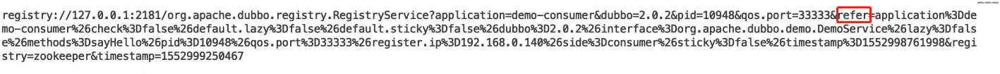
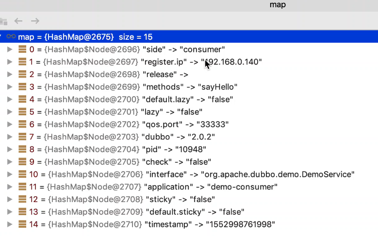
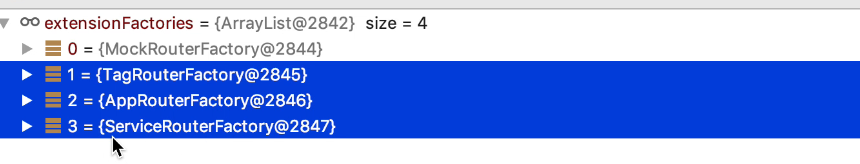
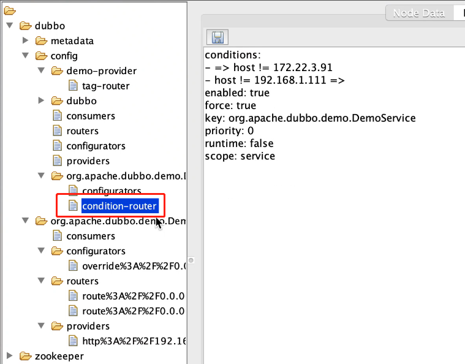
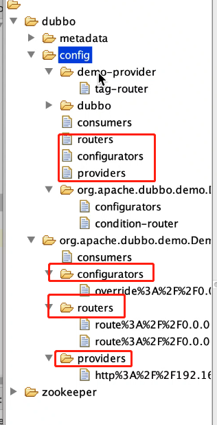

# Dubbo服务引入、服务目录源码分析

## 服务引用发生的地方

1. 直接引用
2. Spring依赖注入

## 思考

1. 服务引入的目标
2. 服务引入的过程
3. 服务引入后Spring容器中存在的对象

## 目标

根据服务名去找到服务提供者的地址，以备后续进行调用。

1. 如果明确指定了，那就去指定的注册中心地址，或指定的服务提供者地址去找(这种就是直连，不会经过 路由策略)
2. 如果没有明确指定，那就从配置的注册中心去找服务提供者地址，注意，这里可能会配置多个注册中心 (会经过路由策略)

## 分析

消费者根据服务名(接口)找到服务提供者的地址，通常是去注册中心去找。

服务引用完了之后注入Spring的对象需要具备什么功能？

1. 能够去进行远程调用，其实在消费端也是一个Invoker，它是一个远程调用执行者。
2. 是对应接口的一个实例，其实接口的一个代理类，在这个代理类里面能使用Invoker对象，进行远程调用

Invoker需要有什么功能：

1. 一个服务提供者地址：直接调用
2. 多个服务提供者地址？

每个服务提供者都对应一个Invoker，多个服务提供者对应多个Invoker，不可能全部拿出，会把多个Invoker合并成一个Invoker，比如：`Invoker invoker = cluster.join(invokers)`，所以会有服务负载均衡的策略或者服务容错的功能，还会有路由策略，比如黑白名单，路由策略的核心是过滤，在进行cluster.join之前就已经把invokers根据规则过滤了。

在dubbo里面有一个服务目录，服务目录是消费者本地保存某个服务的某些地址，在从注册中心到服务目录之间就已经进行了过滤，所以合并就是：`Invoker invoker = cluster.join(服务目录)`

注册中心 某个的某些地址  ----------过滤 ----------服务目录 某个的某些地址

## 过程

找到了服务提供者地址之后，可能会找出多个，在没有任何其他比如说路由的条件下，那么找出来的这些提供者 地址对于消费端来说都是可以用的，但是服务消费端它需要的是一个实现了接口的代理类，注意这里不是真实的 实现类的实例，所以这个代理类其中有一个最重要的任务就是要去进行远程方法调用，那么这个代理类就可以理 解为一个Invoker，这个Invoker还需要从多个地址中负载均衡出来某一个地址，最终去调用这个地址的相对应的 服务。

上文说的多个地址是在没有路由条件下的，所以如果在引入服务时已经配置了路由策略，则需要按照路由策略去 进行过滤，最终过滤出来服务提供者地址，再去生成代理对象。

当然，如果消费者在运行期间，路由策略是可以调整的，所以，消费者在启动期间是需要去监听路由策略是否发 生了变化的，同时，对于消费者引入服务的参数也是可能发生变化的，比如timeout，所以也需要监听。

1. 从注册中心找到所有服务提供者的地址
2. 按路由策略进行过滤
3. 包装所有服务提供者的地址在一个对象内
4. 注册监听器以监听路由策略的变化、服务提供者地址的变化、服务调用相关信息的变化
   

## 监听对象

1. 服务提供者
2. 条件路由
3. 标签路由
4. 黑白名单路由
5. 服务配置信息

## 对象

服务接口的代理对象，该对象可以完成对服务的远程调用，期间的包括负载均衡，服务容错，服务降级等功能

## 源码分析

我们先来看消费者的配置文件：

````xml
<dubbo:application name="demo-consumer"/>

<dubbo:registry address="multicast://224.5.6.7:1234"/>

<!-- generate proxy for the remote service, then demoService can be used in the same way as the
    local regular interface -->
<dubbo:reference id="demoService" check="false"    						     interface="org.apache.dubbo.demo.DemoService"/>
````

`<dubbo:reference>`标签页依旧由`DubboNamespaceHandler`类进行处理转换成对应的bean：

```java
registerBeanDefinitionParser("reference", new DubboBeanDefinitionParser(ReferenceBean.class, false));
```

对象我们就不去分析了，现在我们想一下，服务对象通过这种方式引入，那么还有什么其他方式去引入？

其实`ReferenceBean`实现了`FactoryBean`，所以里面的geObject方法也能引入一个服务

````java
public class ReferenceBean<T> extends ReferenceConfig<T> implements FactoryBean, ApplicationContextAware, InitializingBean, DisposableBean {
	
	@Override
  public Object getObject() {
    return get();
  }

}  
````

`get()`

````java
public synchronized T get() {
  // 检查配置，刷新配置之类的，这儿就不去细看了
  checkAndUpdateSubConfigs();

  if (destroyed) {
    throw new IllegalStateException("The invoker of ReferenceConfig(" + url + ") has already destroyed!");
  }
  if (ref == null) {
    init();
  }
  return ref;
}
````

`init();`

````java
private void init() {
  if (initialized) {
    return;
  }
  initialized = true;
  checkStubAndLocal(interfaceClass);
  checkMock(interfaceClass);
  Map<String, String> map = new HashMap<String, String>();

  map.put(Constants.SIDE_KEY, Constants.CONSUMER_SIDE);
  appendRuntimeParameters(map);
  if (!isGeneric()) {
    String revision = Version.getVersion(interfaceClass, version);
    if (revision != null && revision.length() > 0) {
      map.put(Constants.REVISION_KEY, revision);
    }

    String[] methods = Wrapper.getWrapper(interfaceClass).getMethodNames();
    if (methods.length == 0) {
      logger.warn("No method found in service interface " + interfaceClass.getName());
      map.put(Constants.METHODS_KEY, Constants.ANY_VALUE);
    } else {
      map.put(Constants.METHODS_KEY, StringUtils.join(new HashSet<String>(Arrays.asList(methods)), Constants.COMMA_SEPARATOR));
    }
  }
  map.put(Constants.INTERFACE_KEY, interfaceName);
  appendParameters(map, application);
  appendParameters(map, module);
  appendParameters(map, consumer, Constants.DEFAULT_KEY);
  appendParameters(map, this);
  Map<String, Object> attributes = null;
  if (CollectionUtils.isNotEmpty(methods)) {
    attributes = new HashMap<String, Object>();
    for (MethodConfig methodConfig : methods) {
      appendParameters(map, methodConfig, methodConfig.getName());
      String retryKey = methodConfig.getName() + ".retry";
      if (map.containsKey(retryKey)) {
        String retryValue = map.remove(retryKey);
        if ("false".equals(retryValue)) {
          map.put(methodConfig.getName() + ".retries", "0");
        }
      }
      attributes.put(methodConfig.getName(), convertMethodConfig2AyncInfo(methodConfig));
    }
  }

  String hostToRegistry = ConfigUtils.getSystemProperty(Constants.DUBBO_IP_TO_REGISTRY);
  if (StringUtils.isEmpty(hostToRegistry)) {
    hostToRegistry = NetUtils.getLocalHost();
  }
  map.put(Constants.REGISTER_IP_KEY, hostToRegistry);
  // 创建一个代理对象 map和provider的url一样也是一些控制服务的参数，并不是调用方法的参数
  ref = createProxy(map);

  String serviceKey = URL.buildKey(interfaceName, group, version);
  ApplicationModel.initConsumerModel(serviceKey, buildConsumerModel(serviceKey, attributes));
}
````

很多代码就是对配置的检查和处理，和服务导出功能一样，重点在`ref = createProxy(map)`方法，

`createProxy(map)` **这个方法主要是创建服务提供者接口的一个代理对象**

````java
private T createProxy(Map<String, String> map) {
  if (shouldJvmRefer(map)) { // 和本地的injvm一样
    URL url = new URL(Constants.LOCAL_PROTOCOL, Constants.LOCALHOST_VALUE, 0, interfaceClass.getName()).addParameters(map);
    invoker = refprotocol.refer(interfaceClass, url);
    if (logger.isInfoEnabled()) {
      logger.info("Using injvm service " + interfaceClass.getName());
    }
  } else {
    // url是外面配的，也就是直连模式里面配置的<dubbo:reference id="demoService" check="false" interface="org.apache.dubbo.demo.DemoService" url="http://127.0.0.1"/>
    // 直连提供者是不会去进行过滤，负载以及容错的，因为没有通过注册中心
    if (url != null && url.length() > 0) { // user specified URL, could be peer-to-peer address, or register center's address.
      String[] us = Constants.SEMICOLON_SPLIT_PATTERN.split(url);
      if (us != null && us.length > 0) {
        for (String u : us) {
          URL url = URL.valueOf(u);
          if (StringUtils.isEmpty(url.getPath())) {
            url = url.setPath(interfaceName);
          }
          // 你也可以在配置直连提供者的时候配置一个注册中心的地址<dubbo:refrence url="registry://127....,http://127.0.0....">
          // 这儿就会去判断，是否有注册中心的地址，如果有就会过滤，负载什么的
          // 所以这儿的urls保存的就是注册中心的地址，或者直连提供者地址
          if (Constants.REGISTRY_PROTOCOL.equals(url.getProtocol())) {
            urls.add(url.addParameterAndEncoded(Constants.REFER_KEY, StringUtils.toQueryString(map)));
          } else {
            urls.add(ClusterUtils.mergeUrl(url, map));
          }
        }
      }
    } else { // assemble URL from register center's configuration
      checkRegistry();
      List<URL> us = loadRegistries(false);
      if (CollectionUtils.isNotEmpty(us)) {
        for (URL u : us) {
          URL monitorUrl = loadMonitor(u);
          if (monitorUrl != null) {
            map.put(Constants.MONITOR_KEY, URL.encode(monitorUrl.toFullString()));
          }
          urls.add(u.addParameterAndEncoded(Constants.REFER_KEY, StringUtils.toQueryString(map)));
        }
      }
      if (urls.isEmpty()) {
        throw new IllegalStateException("No such any registry to reference " + interfaceName + " on the consumer " + NetUtils.getLocalHost() + " use dubbo version " + Version.getVersion() + ", please config <dubbo:registry address=\"...\" /> to your spring config.");
      }
    }

    if (urls.size() == 1) {
      // 处理地址，返回invoker
      // 服务引入refer对应export,这儿调用的是RegistryProtocol的refer方法，前面还会有包装类
      invoker = refprotocol.refer(interfaceClass, urls.get(0));
    } else {
      List<Invoker<?>> invokers = new ArrayList<Invoker<?>>();
      URL registryURL = null;
      for (URL url : urls) {
        invokers.add(refprotocol.refer(interfaceClass, url));
        if (Constants.REGISTRY_PROTOCOL.equals(url.getProtocol())) {
          registryURL = url; // use last registry url
        }
      }
      if (registryURL != null) { // registry url is available
        // use RegistryAwareCluster only when register's cluster is available
        URL u = registryURL.addParameter(Constants.CLUSTER_KEY, RegistryAwareCluster.NAME);
        // The invoker wrap relation would be: RegistryAwareClusterInvoker(StaticDirectory) -> FailoverClusterInvoker(RegistryDirectory, will execute route) -> Invoker
        invoker = cluster.join(new StaticDirectory(u, invokers));
      } else { // not a registry url, must be direct invoke.
        invoker = cluster.join(new StaticDirectory(invokers));
      }
    }
}
````

代码先是将配置参数放在url的refer后面，配置如下图：





我们先不看单个服务引入，我们来看多个服务引入的代码`invokers.add(refprotocol.refer(interfaceClass, url));`在protocol的一个实现类`RegistryProtocol`下面，这儿涉及到一个类的包装，其实是先调用protocol的其他实现类，但是在其他实现类里面的逻辑里面判断了如果url是registry开头的就调用`RegistryProtocol`里面的方法。

````java
@Override
@SuppressWarnings("unchecked")
public <T> Invoker<T> refer(Class<T> type, URL url) throws RpcException {
  // 将url的registry修改为zookeeper registry://... -> zookeeper://....
  url = URLBuilder.from(url)
    .setProtocol(url.getParameter(REGISTRY_KEY, DEFAULT_REGISTRY))
    .removeParameter(REGISTRY_KEY)
    .build();
  // 拿到zookeeper的Registry实现类ZookeeperRegistry
  Registry registry = registryFactory.getRegistry(url);
  if (RegistryService.class.equals(type)) {
    return proxyFactory.getInvoker((T) registry, type, url);
  }

  // group="a,b" or group="*"
  // 还原refer后面的参数，在之前的代码有将配置参数追加到refer后面，这儿就把配置参数拿出来
  Map<String, String> qs = StringUtils.parseQueryString(url.getParameterAndDecoded(REFER_KEY));
  String group = qs.get(Constants.GROUP_KEY);
  if (group != null && group.length() > 0) {
    if ((COMMA_SPLIT_PATTERN.split(group)).length > 1 || "*".equals(group)) {
      return doRefer(getMergeableCluster(), registry, type, url);
    }
  }
  // cluster就是要合并，如果cluster的实现类没有，会有一个默认的，这儿就能看到容错的影子
  return doRefer(cluster, registry, type, url);
}
````

将url后面的refer参数取出来，继续执行`doRefer`方法，这儿传进去的`cluster`就是为了实现合并，它会有一个默认的实现类，**这也是为了实现服务容错**，如下面代码：

````java
@SPI(FailoverCluster.NAME)
public interface Cluster {

    /**
     * Merge the directory invokers to a virtual invoker.
     *
     * @param <T>
     * @param directory
     * @return cluster invoker
     * @throws RpcException
     */
    @Adaptive
    <T> Invoker<T> join(Directory<T> directory) throws RpcException;

}
````

我们继续看`return doRefer(cluster, registry, type, url);`

````java
private <T> Invoker<T> doRefer(Cluster cluster, Registry registry, Class<T> type, URL url) {
  // 服务目录 实现通知接口，会有通知功能
  RegistryDirectory<T> directory = new RegistryDirectory<T>(type, url);
  directory.setRegistry(registry);
  directory.setProtocol(protocol);
  // all attributes of REFER_KEY
  // 还是refer后面的配置参数
  Map<String, String> parameters = new HashMap<String, String>(directory.getUrl().getParameters());
  // 消费者的URL也会存在注册中心上，在zk的consumer下，这儿会对consumer的url进行简化
  URL subscribeUrl = new URL(CONSUMER_PROTOCOL, parameters.remove(REGISTER_IP_KEY), 0, type.getName(), parameters);
  if (!ANY_VALUE.equals(url.getServiceInterface()) && url.getParameter(REGISTER_KEY, true)) {
    directory.setRegisteredConsumerUrl(getRegisteredConsumerUrl(subscribeUrl, url));
    registry.register(directory.getRegisteredConsumerUrl());
  }
  // 设置目录的路由链路 可以在配置中心进行配置，配置了之后会在zk上，管理台为了兼容，新的在config目录下，老的在route目录下
  // 黑白名单是条件路由的子功能
  // 路由就是为了ip地址的过滤
  // 动态配置是进行参数的覆盖，override
  // 消费者需要监听的目录
  // 1.条件路由
  //      1.1 针对单个服务 org.apache.dubbo.demo.DemoService/condition-router
  //      1.2 针对单个应用 demo-provider/condition-router
  // 2.标签路由   demo-provider/tag-router
  // 3.动态配置   org.apache.dubbo.demo.DemoService/configurators
  // 4.服务提供者地址信息
  directory.buildRouterChain(subscribeUrl);
  directory.subscribe(subscribeUrl.addParameter(CATEGORY_KEY,
                                                PROVIDERS_CATEGORY + "," + CONFIGURATORS_CATEGORY + "," + ROUTERS_CATEGORY));

  Invoker invoker = cluster.join(directory);
  ProviderConsumerRegTable.registerConsumer(invoker, url, subscribeUrl, directory);
  return invoker;
}
````

1. 从上面代码可以看出，这儿正式使用了**服务目录**，服务目录功能实现了通知接口，所以会有一个通知的功能。

2. 将消费者的url注册在注册中心上，这儿就不细细分析了，在zk的consumer下，同时也会对消费者的url进行简化

3. 设置服务目录的路由链路

   这儿先分析下消费者需要进行监听的目录：

   1. 条件路由
      1. 针对单个服务 `org.apache.dubbo.demo.DemoService/condition-router`
      2. 针对单个应用 `demo-provider/condition-router`
   2. 标签路由 `demo-provider/tag-router`
   3. 动态配置 `org.apache.dubbo.demo.DemoService/configurators`
   4. 服务提供者地址信息

   构造路由链路其实就是为了对ip地址的过滤

   ````java
   private RouterChain(URL url) {
     List<RouterFactory> extensionFactories = ExtensionLoader.getExtensionLoader(RouterFactory.class)
       .getActivateExtension(url, (String[]) null);
   
     List<Router> routers = extensionFactories.stream()
       .map(factory -> factory.getRouter(url))
       .collect(Collectors.toList());
   
     initWithRouters(routers);
   }
   ````

   

   一共会有4个RouteFactory，MockFactory这儿不看，主要看下面3个

   1. `TagRouteFactory`  ----> `TagRouter (extends AbstractRouter)`      100（优先级）
   2. `AppRouteFactory`-----> `AppRouter extends ListenableRouter (extends AbstractRouter)`   150（优先级）
   3. `ServiceRouteFactory` ----> `ServiceRouter extends ListenableRouter (extends AbstractRouter) ` 140 （优先级）

   可见`AppRouter`和`ServiceRouter`都用到了`ListenableRouter`，那我们先来看`ServiceRouter`的构造方法

   ````java
   public ServiceRouter(DynamicConfiguration configuration, URL url) {
     super(configuration, url, url.getEncodedServiceKey());
     this.priority = SERVICE_ROUTER_DEFAULT_PRIORITY;
   }
   ````

   通过super调用`ListenableRouter`的构造方法：

   ````java
   public ListenableRouter(DynamicConfiguration configuration, URL url, String ruleKey) {
     super(configuration, url);
     this.force = false;
     this.init(ruleKey);
   }
   ````

   DynamicConfiguration在服务导出也是有的，它是动态配置，**新版本有动态配置，监听的就是zk的config目录**，我们再来看init方法

   ````java
   private synchronized void init(String ruleKey) {
     if (StringUtils.isEmpty(ruleKey)) {
       return;
     }
     // 加了条件路由的后缀
     String routerKey = ruleKey + RULE_SUFFIX; // condition-route
     configuration.addListener(routerKey, this);
     String rule = configuration.getConfig(routerKey);
     if (StringUtils.isNotEmpty(rule)) {
       this.process(new ConfigChangeEvent(routerKey, rule));
     }
   }
   ````

   可见只有serviceRouter和appRouter是条件路由的一部分，这儿就对他们绑定监听器。我们来看下监听器的处理的监听处理方法。

   ````java
   // 对动态配置监听然后处理
   // 就是翻译动态配置为我们的对象
   @Override
   public synchronized void process(ConfigChangeEvent event) {
     if (logger.isInfoEnabled()) {
       logger.info("Notification of condition rule, change type is: " + event.getChangeType() +
                   ", raw rule is:\n " + event.getValue());
     }
   
     if (event.getChangeType().equals(ConfigChangeType.DELETED)) {
       routerRule = null;
       conditionRouters = Collections.emptyList();
     } else {
       try {
         routerRule = ConditionRuleParser.parse(event.getValue());
         generateConditions(routerRule);
       } catch (Exception e) {
         logger.error("Failed to parse the raw condition rule and it will not take effect, please check " +
                      "if the condition rule matches with the template, the raw rule is:\n " + event.getValue(), e);
       }
     }
   }
   ````

   所以`process`其实就是一个翻译的动作，when ----> then，比如动态配置将ip修改后了，就会有一个when 和 then的判断，如下图，动态配置里面的ip地址进行了变更，有172 -> 192 所以会有when很then，具体代码需要细看

   

   所以看到这儿条件路由就已经初始化了

   构造好了路由就会去进行一些初始化，根据路由的优先级进行排序，所以mock > tag > service > App 

   然后**设置进服务目录里面**

4. `directory.buildRouterChain(subscribeUrl);`生成了路由链路，然后监听了条件路由下的两个路由

5. `directory.subscribe(subscribeUrl.addParameter(CATEGORY_KEY,PROVIDERS_CATEGORY + "," + CONFIGURATORS_CATEGORY + "," + ROUTERS_CATEGORY));`

   订阅三个目录，如下图，老版，新版对应的文字

   

   ````java
   public void subscribe(URL url) {
     setConsumerUrl(url);
     // 监听消费者本身的configurators目录 config/消费者目录/configurators
     consumerConfigurationListener.addNotifyListener(this);
     // 监听config/消费者目录/condition-router 即动态配置，然后将配置重写
     serviceConfigurationListener = new ReferenceConfigurationListener(this, url);
     // 所以到这儿config目录 除了消费者的tag-router 即标签路由没有监听到，其他都监听到了
     // 订阅服务
     registry.subscribe(url, this);
   }
   ````

   代码上面都有注释，这儿有一个疑问，就是`serviceConfigurationListener = new ReferenceConfigurationListener(this, url);`里面的方法会对配置进行一个**重写**，这儿没有贴代码是因为比较多，所以配置后的url会以override开头，如上图里面就有。

   `registry.subscribe(url, this);`会走到`ZookeeperRegistry#doSubscribe()`

   `````java
   public void doSubscribe(final URL url, final NotifyListener listener) {
     try {
       if (Constants.ANY_VALUE.equals(url.getServiceInterface())) {
         String root = toRootPath();
         ConcurrentMap<NotifyListener, ChildListener> listeners = zkListeners.get(url);
         if (listeners == null) {
           zkListeners.putIfAbsent(url, new ConcurrentHashMap<>());
           listeners = zkListeners.get(url);
         }
         ChildListener zkListener = listeners.get(listener);
         if (zkListener == null) {
           listeners.putIfAbsent(listener, (parentPath, currentChilds) -> {
             for (String child : currentChilds) {
               child = URL.decode(child);
               if (!anyServices.contains(child)) {
                 anyServices.add(child);
                 subscribe(url.setPath(child).addParameters(Constants.INTERFACE_KEY, child,
                                                            Constants.CHECK_KEY, String.valueOf(false)), listener);
               }
             }
           });
           zkListener = listeners.get(listener);
         }
         zkClient.create(root, false);
         List<String> services = zkClient.addChildListener(root, zkListener);
         if (CollectionUtils.isNotEmpty(services)) {
           for (String service : services) {
             service = URL.decode(service);
             anyServices.add(service);
             subscribe(url.setPath(service).addParameters(Constants.INTERFACE_KEY, service,
                                                          Constants.CHECK_KEY, String.valueOf(false)), listener);
           }
         }
       } else {
         // 分别对三个目录绑定监听器，订阅，拿到里面的地址然后进行notify
         // /dubbo/org.apache.dubbo.demo.DemoService/providers
         // /dubbo/org.apache.dubbo.demo.DemoService/configurators
         // /dubbo/org.apache.dubbo.demo.DemoService/routers
         // 还会有兼容，如果新版本的对应目录已经监听了，老版本里面的相应的目录就不用再监听了
         List<URL> urls = new ArrayList<>();
         for (String path : toCategoriesPath(url)) {
           ConcurrentMap<NotifyListener, ChildListener> listeners = zkListeners.get(url);
           if (listeners == null) {
             zkListeners.putIfAbsent(url, new ConcurrentHashMap<>());
             listeners = zkListeners.get(url);
           }
           ChildListener zkListener = listeners.get(listener);
           if (zkListener == null) {
             listeners.putIfAbsent(listener, (parentPath, currentChilds) -> ZookeeperRegistry.this.notify(url, listener, toUrlsWithEmpty(url, parentPath, currentChilds)));
             zkListener = listeners.get(listener);
           }
           zkClient.create(path, false);
           List<String> children = zkClient.addChildListener(path, zkListener);
           if (children != null) {
             urls.addAll(toUrlsWithEmpty(url, path, children));
           }
         }
         notify(url, listener, urls);
       }
     } catch (Throwable e) {
       throw new RpcException("Failed to subscribe " + url + " to zookeeper " + getUrl() + ", cause: " + e.getMessage(), e);
     }
   }
   `````

   然后跳转到`RegistryDirectory#notify`

   ````java
   @Override
   public synchronized void notify(List<URL> urls) {
     // 进行基本的过滤，比如新版本的config目录下面对应的目录已经监听了，这儿不再监听
     Map<String, List<URL>> categoryUrls = urls.stream()
       .filter(Objects::nonNull)
       .filter(this::isValidCategory)
       .filter(this::isNotCompatibleFor26x)
       .collect(Collectors.groupingBy(url -> {
         if (UrlUtils.isConfigurator(url)) {
           return CONFIGURATORS_CATEGORY;
         } else if (UrlUtils.isRoute(url)) {
           return ROUTERS_CATEGORY;
         } else if (UrlUtils.isProvider(url)) {
           return PROVIDERS_CATEGORY;
         }
         return "";
       }));
     // 对老版本下面的3个目录里面的进行归类
     List<URL> configuratorURLs = categoryUrls.getOrDefault(CONFIGURATORS_CATEGORY, Collections.emptyList());
     this.configurators = Configurator.toConfigurators(configuratorURLs).orElse(this.configurators);
   
     List<URL> routerURLs = categoryUrls.getOrDefault(ROUTERS_CATEGORY, Collections.emptyList());
     toRouters(routerURLs).ifPresent(this::addRouters);
   
     // providers
     List<URL> providerURLs = categoryUrls.getOrDefault(PROVIDERS_CATEGORY, Collections.emptyList());
     // 重点方法 过滤
     refreshOverrideAndInvoker(providerURLs);
   }
   ````

   `refreshOverrideAndInvoker(providerURLs)`

   ````java
   private void refreshOverrideAndInvoker(List<URL> urls) {
     // mock zookeeper://xxx?mock=return null
     overrideDirectoryUrl(); // 重写
     // 根据url去构造invoker，然后再把路由链设置invoker，再缓存进服务目录
     refreshInvoker(urls);
   }
   ````

   ````java
   private void refreshInvoker(List<URL> invokerUrls) {
     Assert.notNull(invokerUrls, "invokerUrls should not be null");
   
     if (invokerUrls.size() == 1
         && invokerUrls.get(0) != null
         && Constants.EMPTY_PROTOCOL.equals(invokerUrls.get(0).getProtocol())) {
       this.forbidden = true; // Forbid to access
       this.invokers = Collections.emptyList();
       routerChain.setInvokers(this.invokers);
       destroyAllInvokers(); // Close all invokers
     } else {
       this.forbidden = false; // Allow to access
       Map<String, Invoker<T>> oldUrlInvokerMap = this.urlInvokerMap; // local reference
       if (invokerUrls == Collections.<URL>emptyList()) {
         invokerUrls = new ArrayList<>();
       }
       if (invokerUrls.isEmpty() && this.cachedInvokerUrls != null) {
         invokerUrls.addAll(this.cachedInvokerUrls);
       } else {
         this.cachedInvokerUrls = new HashSet<>();
         this.cachedInvokerUrls.addAll(invokerUrls);//Cached invoker urls, convenient for comparison
       }
       if (invokerUrls.isEmpty()) {
         return;
       }
       // 把提供者的url转换成invokers
       // 构建httpClient，如果是http的协议的话，消费者的配置参数还会覆盖服务提供者的配置参数
       Map<String, Invoker<T>> newUrlInvokerMap = toInvokers(invokerUrls);// Translate url list to Invoker map
   
       /**
                * If the calculation is wrong, it is not processed.
                *
                * 1. The protocol configured by the client is inconsistent with the protocol of the server.
                *    eg: consumer protocol = dubbo, provider only has other protocol services(rest).
                * 2. The registration center is not robust and pushes illegal specification data.
                *
                */
       if (CollectionUtils.isEmptyMap(newUrlInvokerMap)) {
         logger.error(new IllegalStateException("urls to invokers error .invokerUrls.size :" + invokerUrls.size() + ", invoker.size :0. urls :" + invokerUrls
                                                .toString()));
         return;
       }
       // 还没有过滤之前的服务提供者对应的invokers
       List<Invoker<T>> newInvokers = Collections.unmodifiableList(new ArrayList<>(newUrlInvokerMap.values()));
       // pre-route and build cache, notice that route cache should build on original Invoker list.
       // toMergeMethodInvokerMap() will wrap some invokers having different groups, those wrapped invokers not should be routed.
       // 设置进路由链中，进行路由的过滤
       routerChain.setInvokers(newInvokers);
       this.invokers = multiGroup ? toMergeInvokerList(newInvokers) : newInvokers;
       this.urlInvokerMap = newUrlInvokerMap;
   
       try {
         destroyUnusedInvokers(oldUrlInvokerMap, newUrlInvokerMap); // Close the unused Invoker
       } catch (Exception e) {
         logger.warn("destroyUnusedInvokers error. ", e);
       }
     }
   }
   ````

   1. `toInvokers()`

      `````java
      // 把服务提供者url翻译成invoker
      private Map<String, Invoker<T>> toInvokers(List<URL> urls) {
        Map<String, Invoker<T>> newUrlInvokerMap = new HashMap<>();
        if (urls == null || urls.isEmpty()) {
          return newUrlInvokerMap;
        }
        Set<String> keys = new HashSet<>();
        String queryProtocols = this.queryMap.get(Constants.PROTOCOL_KEY);
        // 对协议进行过滤，如果在配置中这么写<dubbo:refrecen protolcol = "http"  protolcol = "dubbo"/> 会优先选择我们自己的protocol
        // 比如我们用的是http 那么这儿就用的是http
        // 其实就是用配置中定义的协议和提供者的协议进行比较，取提供者的协议
        for (URL providerUrl : urls) {
          // If protocol is configured at the reference side, only the matching protocol is selected
          if (queryProtocols != null && queryProtocols.length() > 0) {
            boolean accept = false;
            String[] acceptProtocols = queryProtocols.split(",");
            for (String acceptProtocol : acceptProtocols) {
              if (providerUrl.getProtocol().equals(acceptProtocol)) {
                accept = true;
                break;
              }
            }
            if (!accept) {
              continue;
            }
          }
          if (Constants.EMPTY_PROTOCOL.equals(providerUrl.getProtocol())) {
            continue;
          }
          // 判断协议的扩展类存不存在
          if (!ExtensionLoader.getExtensionLoader(Protocol.class).hasExtension(providerUrl.getProtocol())) {
            logger.error(new IllegalStateException("Unsupported protocol " + providerUrl.getProtocol() +
                                                   " in notified url: " + providerUrl + " from registry " + getUrl().getAddress() +
                                                   " to consumer " + NetUtils.getLocalHost() + ", supported protocol: " +
                                                   ExtensionLoader.getExtensionLoader(Protocol.class).getSupportedExtensions()));
            continue;
          }
          URL url = mergeUrl(providerUrl);
      
          String key = url.toFullString(); // The parameter urls are sorted
          if (keys.contains(key)) { // Repeated url
            continue;
          }
          keys.add(key);
          // Cache key is url that does not merge with consumer side parameters, regardless of how the consumer combines parameters, if the server url changes, then refer again
          Map<String, Invoker<T>> localUrlInvokerMap = this.urlInvokerMap; // local reference
          Invoker<T> invoker = localUrlInvokerMap == null ? null : localUrlInvokerMap.get(key);
          // urlInvokerMap是一个缓存，开始时这里是为空的
          if (invoker == null) { // Not in the cache, refer again
            try {
              boolean enabled = true;
              if (url.hasParameter(Constants.DISABLED_KEY)) {
                enabled = !url.getParameter(Constants.DISABLED_KEY, false);
              } else {
                enabled = url.getParameter(Constants.ENABLED_KEY, true);
              }
              if (enabled) {
                // 刚开始为空，会执行这儿的refer方法
                invoker = new InvokerDelegate<>(protocol.refer(serviceType, url), url, providerUrl);
              }
            } catch (Throwable t) {
              logger.error("Failed to refer invoker for interface:" + serviceType + ",url:(" + url + ")" + t.getMessage(), t);
            }
            if (invoker != null) { // Put new invoker in cache
              newUrlInvokerMap.put(key, invoker);
            }
          } else {
            newUrlInvokerMap.put(key, invoker);
          }
        }
        keys.clear();
        return newUrlInvokerMap;
      }
      `````

      1. 如果消费者端有配置protocol的属性，会优先用provider，也就是服务提供者的protocol
      2. 在服务目录类下面会缓存invoker，这儿第一次拿不到数据，所以会执行`protocol.refer(serviceType, url)`方法
      3. 然后通过`new InvokerDelegate<>(protocol.refer(serviceType, url), url, providerUrl);`new出来invoker

   2. `protocol.refer(serviceType, url)`方法其实对应你使用的协议的类，这儿是http协议所以，会先执行父类`AbstractProxyProtocol`的`refer`方法。

      `````java
      public <T> Invoker<T> refer(final Class<T> type, final URL url) throws RpcException {
              final Invoker<T> target = proxyFactory.getInvoker(doRefer(type, url), type, url);
      }  
      `````

      可见会执行到`HttpProtocol`类的`doRefer`

      `````java
      protected <T> T doRefer(final Class<T> serviceType, final URL url) throws RpcException {
        final String generic = url.getParameter(Constants.GENERIC_KEY);
        final boolean isGeneric = ProtocolUtils.isGeneric(generic) || serviceType.equals(GenericService.class);
      
        final HttpInvokerProxyFactoryBean httpProxyFactoryBean = new HttpInvokerProxyFactoryBean();
        httpProxyFactoryBean.setRemoteInvocationFactory(new RemoteInvocationFactory() {
          @Override
          public RemoteInvocation createRemoteInvocation(MethodInvocation methodInvocation) {
            RemoteInvocation invocation;
            /*
                        package was renamed to 'org.apache.dubbo' in v2.7.0, so only provider versions after v2.7.0 can
                        recognize org.apache.xxx.HttpRemoteInvocation'.
                       */
            if (Version.isRelease270OrHigher(url.getParameter(Constants.RELEASE_KEY))) {
              invocation = new HttpRemoteInvocation(methodInvocation);
            } else {
              /*
                            The customized 'com.alibaba.dubbo.rpc.protocol.http.HttpRemoteInvocation' was firstly introduced
                            in v2.6.3. The main purpose is to support transformation of attachments in HttpProtocol, see
                            https://github.com/apache/incubator-dubbo/pull/1827. To guarantee interoperability with lower
                            versions, we need to check if the provider is v2.6.3 or higher before sending customized
                            HttpRemoteInvocation.
                           */
              if (Version.isRelease263OrHigher(url.getParameter(Constants.DUBBO_VERSION_KEY))) {
                invocation = new com.alibaba.dubbo.rpc.protocol.http.HttpRemoteInvocation(methodInvocation);
              } else {
                invocation = new RemoteInvocation(methodInvocation);
              }
            }
            if (isGeneric) {
              invocation.addAttribute(Constants.GENERIC_KEY, generic);
            }
            return invocation;
          }
        });
      
        String key = url.toIdentityString();
        if (isGeneric) {
          key = key + "/" + Constants.GENERIC_KEY;
        }
        // 构造httpClient
        // 消费端的配置参数会覆盖服务端的参数
        httpProxyFactoryBean.setServiceUrl(key);
        httpProxyFactoryBean.setServiceInterface(serviceType);
        String client = url.getParameter(Constants.CLIENT_KEY);
        if (StringUtils.isEmpty(client) || "simple".equals(client)) {
          SimpleHttpInvokerRequestExecutor httpInvokerRequestExecutor = new SimpleHttpInvokerRequestExecutor() {
            @Override
            protected void prepareConnection(HttpURLConnection con,
                                             int contentLength) throws IOException {
              super.prepareConnection(con, contentLength);
              con.setReadTimeout(url.getParameter(Constants.TIMEOUT_KEY, Constants.DEFAULT_TIMEOUT));
              con.setConnectTimeout(url.getParameter(Constants.CONNECT_TIMEOUT_KEY, Constants.DEFAULT_CONNECT_TIMEOUT));
            }
          };
          httpProxyFactoryBean.setHttpInvokerRequestExecutor(httpInvokerRequestExecutor);
        } else if ("commons".equals(client)) {
          HttpComponentsHttpInvokerRequestExecutor httpInvokerRequestExecutor = new HttpComponentsHttpInvokerRequestExecutor();
          httpInvokerRequestExecutor.setReadTimeout(url.getParameter(Constants.TIMEOUT_KEY, Constants.DEFAULT_TIMEOUT));
          httpInvokerRequestExecutor.setConnectTimeout(url.getParameter(Constants.CONNECT_TIMEOUT_KEY, Constants.DEFAULT_CONNECT_TIMEOUT));
          httpProxyFactoryBean.setHttpInvokerRequestExecutor(httpInvokerRequestExecutor);
        } else {
          throw new IllegalStateException("Unsupported http protocol client " + client + ", only supported: simple, commons");
        }
        httpProxyFactoryBean.afterPropertiesSet();
        return (T) httpProxyFactoryBean.getObject();
      }
      `````

      这个方法会构造httpClient，同时如果消费端配置了和服务提供者一样的配置，这儿把配置覆盖为消费端的配置。

   3. 所以通过`toInvoker`方法将服务提供者的url转换成invoker对象，然后构造httpclent，接着继续执行代码，会把invoker对象放入路由链中，`routerChain.setInvokers(newInvokers);`，在设置进路由链中进行初始化：

      ````java
      public void setInvokers(List<Invoker<T>> invokers) {
        this.invokers = (invokers == null ? Collections.emptyList() : invokers);
        routers.forEach(router -> router.notify(this.invokers));
      }
      ````

      这儿有一个疑问，不知道具体过滤的逻辑在哪儿，**这儿的`router.notify()`只是对2.7新加的`TagRouter`进行初始化，其他的包括`AppRouter`和`ServiceRouter`在new的时候就已经初始化了**，路由的过滤其实是在调用的时候才进行的，具体看下一个文档。
   
      

6. `invoker = cluster.join(new StaticDirectory(u, invokers));`将多个invoker合并，这儿使用的是cluster的默认的实现类，但是其实它也有一次包装，`MockClusterWrapper`，最后是通过`FailoverClusterInvoker`类来进行`join`

   `````java
   public class FailoverCluster implements Cluster {
   
     public final static String NAME = "failover";
   	// join是通过此方法
     @Override
     public <T> Invoker<T> join(Directory<T> directory) throws RpcException {
       return new FailoverClusterInvoker<T>(directory);
     }
   
   }
   `````

   其实就是new了一个FailoverClusterInvoker类，将服务目录set进去，调用的时候应该会从这个类中取获取服务目录的数据，进行调用。

所以到这儿就执行完`ref = createProxy(map);`这行代码，所以这个ref就是`FailoverClusterInvoker`，最后由spring管理。

