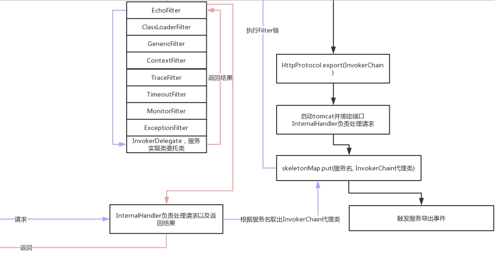
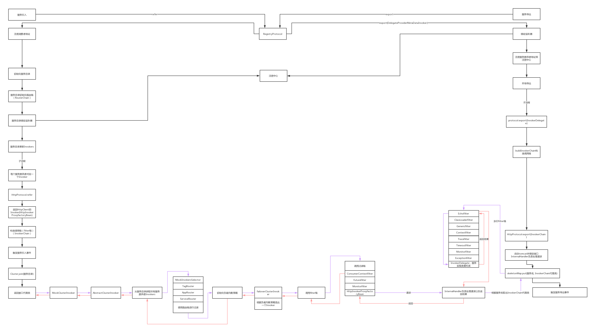

# 	Dubbo服务调用与容错、服务降级（mock）、负载均衡源码解析

## 源码分析

### 消费者调用链路

服务提供者地址 -> Invoker -> InvokerDelegate

在服务目录类`RegistryDirectory`里面生成Invoker的方法`toInvokers()`里面有一段将`Invoker -> InvokerDelegate`中：

````java
invoker = new InvokerDelegate<>(protocol.refer(serviceType, url), url, providerUrl);
````

核心的部分`protocol.refer(serviceType, url)`，这个protocol类的实现dubbo会根据你的协议来进行选择，然后调用，但是在调用这个`refer`方法的时候会经历包装类的过程，我们先看第一个包装类`ProtocolListenerWrapper`对应的方法：

````java
public <T> Invoker<T> refer(Class<T> type, URL url) throws RpcException {
  if (Constants.REGISTRY_PROTOCOL.equals(url.getProtocol())) {
    return protocol.refer(type, url);
  }
  			// 服务引入完成时触发一个监听器
        return new ListenerInvokerWrapper<T>(protocol.refer(type, url),
                Collections.unmodifiableList(
                        ExtensionLoader.getExtensionLoader(InvokerListener.class)
                                .getActivateExtension(url, Constants.INVOKER_LISTENER_KEY)));
    }
````

这个类的作用比较简单，就是当服务引用过后会去调用一个监听器

`ProtocolFilterWrapper#refer`

`````java
@Override
public <T> Invoker<T> refer(Class<T> type, URL url) throws RpcException {
  if (Constants.REGISTRY_PROTOCOL.equals(url.getProtocol())) {
    return protocol.refer(type, url);
  }
  // 把invoker加上3个过滤器
  return buildInvokerChain(protocol.refer(type, url), Constants.REFERENCE_FILTER_KEY, Constants.CONSUMER);
}
`````

`buildInvokerChain`

```java
private static <T> Invoker<T> buildInvokerChain(final Invoker<T> invoker, String key, String group) {
    Invoker<T> last = invoker;
    List<Filter> filters = ExtensionLoader.getExtensionLoader(Filter.class).getActivateExtension(invoker.getUrl(), key, group);
    if (!filters.isEmpty()) {
        for (int i = filters.size() - 1; i >= 0; i--) {
            final Filter filter = filters.get(i);
            final Invoker<T> next = last;
            last = new Invoker<T>() {

                @Override
                public Class<T> getInterface() {
                    return invoker.getInterface();
                }

                @Override
                public URL getUrl() {
                    return invoker.getUrl();
                }

                @Override
                public boolean isAvailable() {
                    return invoker.isAvailable();
                }
								// 当invoker执行invoke方法的时候会依次执行3个过滤器的invoke方法
                // 同时会处理invoke后远程服务端相应的结果
                @Override
                public Result invoke(Invocation invocation) throws RpcException {
                    Result result = filter.invoke(next, invocation);
                    if (result instanceof AsyncRpcResult) {
                        AsyncRpcResult asyncResult = (AsyncRpcResult) result;
                        asyncResult.thenApplyWithContext(r -> filter.onResponse(r, invoker, invocation));
                        return asyncResult;
                    } else {
                        return filter.onResponse(result, invoker, invocation);
                    }
                }

                @Override
                public void destroy() {
                    invoker.destroy();
                }

                @Override
                public String toString() {
                    return invoker.toString();
                }
            };
        }
    }
    return last;
}
```

上面的类会给invoke加上3个过滤器：

+ `ConsumerContextFilter`
+ `FutureFilter`
+ `MonitorFilter`

**当invoker执行invoke方法的时候会依次执行3个过滤器的invoke方法**

**同时会处理invoke后远程服务端相应的结果**

所以`invoker = new InvokerDelegate<>(protocol.refer(serviceType, url), url, providerUrl);`其实是将invoker加上了3个过滤器，然后封装成`InvokerDelegate`类，这个`InvokerDelegate`实现了InvokeWrapper类，所以也有invoke方法，**执行invoke()方法就是去调用远程服务**

其实这几段代码就是先通过`HttpProtocol`的doRefer方法返回一个AbstractInvoker对象，然后再通过这两个warpper类进行增强。返回的invoker再包装成InvokerDelegate对象

所以服务调用的大致链：

`InvokerDelegate#invoke()` -> `ConsumerContextFilter#invoke()` -> `FutureFilter#invoke()` -> `MonitorFilter#invoke()` -> `AbstractInvoker#invoke()`

所以在我们的服务目录类里面的invokers就是InvokerDelegate类

接着看，当有多个invokers我们会执行`invoker = cluster.join(new StaticDirectory(u, invokers));`这个方法把多个invokers进行合并，这个join里面具体干了什么呢？

这个cluster其实也有很多实现类，他们主要是**为了提供服务降级和服务容错一起一些个负载均衡的**，默认实现类是`FailoverCluster`，我们先来看它的包装类。

```java
public class MockClusterWrapper implements Cluster {

    private Cluster cluster;

    public MockClusterWrapper(Cluster cluster) {
        this.cluster = cluster;
    }

    @Override
    public <T> Invoker<T> join(Directory<T> directory) throws RpcException {
        return new MockClusterInvoker<T>(directory,
                this.cluster.join(directory));
    }

}
```

看上面的join方法，其实就是对默认的`FailoverCluster`的join方法进行了一层封装。

```java
/**
 * {@link FailoverClusterInvoker}
 *
 */
public class FailoverCluster implements Cluster {

    public final static String NAME = "failover";

    @Override
    public <T> Invoker<T> join(Directory<T> directory) throws RpcException {
        return new FailoverClusterInvoker<T>(directory);
    }

}
```

看注释我们就知道这个类也有一个invoker的类，所以也会有一个invoker方法，也就是在执行调用远程服务的时候会去执行这个invoker类的invoker方法，而不难发现`MockClusterWrapper`也会有一个`MockClusterInvoker`的类，所以也会去执行这个类里面的invoker方法，所以`invoker = cluster.join(new StaticDirectory(u, invokers));`返回的invoker对象就是`MockClusterInvoker`，结合`ReferenceBean`里面的getObject()里面的`ref = createProxy(map);`方法分析，**所以最终Spring拿出来的对象就是这个`MockClusterInvoker`类的代理对象**。

我们来简单看一下`ref = createProxy(map);`，里面有一段`return (T) proxyFactory.getProxy(invoker);`这个代码就是创建代理对象，继续细看一下

```java
@SPI("javassist")
public interface ProxyFactory {

    /**
     * create proxy.
     *
     * @param invoker
     * @return proxy
     */
    @Adaptive({Constants.PROXY_KEY})
    <T> T getProxy(Invoker<T> invoker) throws RpcException;

    /**
     * create proxy.
     *
     * @param invoker
     * @return proxy
     */
    @Adaptive({Constants.PROXY_KEY})
    <T> T getProxy(Invoker<T> invoker, boolean generic) throws RpcException;

    /**
     * create invoker.
     *
     * @param <T>
     * @param proxy
     * @param type
     * @param url
     * @return invoker
     */
    @Adaptive({Constants.PROXY_KEY})
    <T> Invoker<T> getInvoker(T proxy, Class<T> type, URL url) throws RpcException;

}
```

可见这个类也有对应包装类和实现类(默认实现类是`JavassistProxyFactory`)，是不是很麻烦，到处都是dubbo的SPI。我们暂时不看包装类，先看默认的实现类

```java
/**
 * JavaassistRpcProxyFactory
 */
public class JavassistProxyFactory extends AbstractProxyFactory {
    
    // 动态代理
    @Override
    @SuppressWarnings("unchecked")
    public <T> T getProxy(Invoker<T> invoker, Class<?>[] interfaces) {
        return (T) Proxy.getProxy(interfaces).newInstance(new InvokerInvocationHandler(invoker));
    }

    @Override
    public <T> Invoker<T> getInvoker(T proxy, Class<T> type, URL url) {
        // TODO Wrapper cannot handle this scenario correctly: the classname contains '$'
        final Wrapper wrapper = Wrapper.getWrapper(proxy.getClass().getName().indexOf('$') < 0 ? proxy.getClass() : type);
        return new AbstractProxyInvoker<T>(proxy, type, url) {
            @Override
            protected Object doInvoke(T proxy, String methodName,
                                      Class<?>[] parameterTypes,
                                      Object[] arguments) throws Throwable {
                return wrapper.invokeMethod(proxy, methodName, parameterTypes, arguments);
            }
        };
    }

}
```

简单来说就是JDK的动态代理，在执行方法的时候`InvokerInvocationHandler`里面的invoke方法

```java
/**
 * InvokerHandler
 */
public class InvokerInvocationHandler implements InvocationHandler {
    private static final Logger logger = LoggerFactory.getLogger(InvokerInvocationHandler.class);
    private final Invoker<?> invoker;

    public InvokerInvocationHandler(Invoker<?> handler) {
        this.invoker = handler;
    }

    @Override
    public Object invoke(Object proxy, Method method, Object[] args) throws Throwable {
        String methodName = method.getName();
        Class<?>[] parameterTypes = method.getParameterTypes();
        if (method.getDeclaringClass() == Object.class) {
            return method.invoke(invoker, args);
        }
        if ("toString".equals(methodName) && parameterTypes.length == 0) {
            return invoker.toString();
        }
        if ("hashCode".equals(methodName) && parameterTypes.length == 0) {
            return invoker.hashCode();
        }
        if ("equals".equals(methodName) && parameterTypes.length == 1) {
            return invoker.equals(args[0]);
        }
				// 最终执行就是这个方法
        return invoker.invoke(createInvocation(method, args)).recreate();
    }
		
  	// 把方法和参数构造成一个对象
    private RpcInvocation createInvocation(Method method, Object[] args) {
        RpcInvocation invocation = new RpcInvocation(method, args);
        if (RpcUtils.hasFutureReturnType(method)) {
            invocation.setAttachment(Constants.FUTURE_RETURNTYPE_KEY, "true");
            invocation.setAttachment(Constants.ASYNC_KEY, "true");
        }
        return invocation;
    }

}
```

`invoker.invoke(createInvocation(method, args)).recreate();` 这个invoker就是`MockClusterInvoker`，传入的参数是构造的`RpcInvocation`对象（上面有）,其实就是把调用的方法和参数构造成一个Invocation对象。

回过头来，我们我们知道dubbo有一个mock机制，就是为了服务降级和容错的，所以这儿的mock就是那个mock，在dubbo里么我们一般这么配：`<dubbo:reference interface="xxxx", id="xx" mock="xx.xxx.xxx"/>`这个mock属性里面可以写一段代码，也可以指定某个类，**这个类里面的方法必须和调用的接口一模一样，主要是为了服务降级**

所以服务调用的大致链：

`MockClusterInvoker#invoke()` -> `FailoverClusterInvoker#invoke()`-> `ConsumerContextFilter#invoke()` -> `FutureFilter#invoke()` -> `MonitorFilter#invoke()` -> `AbstractInvoker#invoke()`

我们来看一下`MockClusterInvoker#invoke()`

```java
@Override
public Result invoke(Invocation invocation) throws RpcException {
    Result result = null;
    // 从url中取出是否有mock配置
    String value = directory.getUrl().getMethodParameter(invocation.getMethodName(), Constants.MOCK_KEY, Boolean.FALSE.toString()).trim();
    if (value.length() == 0 || value.equalsIgnoreCase("false")) {
        //no mock 没有mock就继续执行下一个invoke
        result = this.invoker.invoke(invocation);
    } else if (value.startsWith("force")) {
        // 如果mock是以force开头
        if (logger.isWarnEnabled()) {
            logger.warn("force-mock: " + invocation.getMethodName() + " force-mock enabled , url : " + directory.getUrl());
        }
        //force:direct mock
        result = doMockInvoke(invocation, null);
    } else {
        //fail-mock mock配置失败的情况，还是继续调用下一个invoker
        try {
            result = this.invoker.invoke(invocation);
        } catch (RpcException e) {
            if (e.isBiz()) {
                throw e;
            }
            
            if (logger.isWarnEnabled()) {
                logger.warn("fail-mock: " + invocation.getMethodName() + " fail-mock enabled , url : " + directory.getUrl(), e);
            }
            // 调用报错，服务降级
            result = doMockInvoke(invocation, e);
        }
    }
    return result;
}
```

上面的代码很清楚，在这儿就实现了mock的机制。

我们来细看一下`doMockInvoke(invocation, e);`

```java
private Result doMockInvoke(Invocation invocation, RpcException e) {
    Result result = null;
    Invoker<T> minvoker;
    // 老的逻辑不看
    List<Invoker<T>> mockInvokers = selectMockInvoker(invocation);
    if (CollectionUtils.isEmpty(mockInvokers)) {
        minvoker = (Invoker<T>) new MockInvoker(directory.getUrl());
    } else {
        minvoker = mockInvokers.get(0);
    }
    try {
      	// 返回mock配置的类的代理类
        result = minvoker.invoke(invocation);
    } catch (RpcException me) {
        if (me.isBiz()) {
            result = new RpcResult(me.getCause());
        } else {
            throw new RpcException(me.getCode(), getMockExceptionMessage(e, me), me.getCause());
        }
    } catch (Throwable me) {
        throw new RpcException(getMockExceptionMessage(e, me), me.getCause());
    }
    return result;
}
```

里面更细的代码就不贴了，服务降级就是在`result = minvoker.invoke(invocation);`处理的。返回的就是mock配置类的代理类。

如果服务没有出现问题继续执行到`FailoverClusterInvoker#doInvoke`，但是会先走到父类`AbstractClusterInvoker`的invoke方法，父类的invoke方法比较重要我们来看一下：

```java
@Override
public Result invoke(final Invocation invocation) throws RpcException {
    checkWhetherDestroyed();

    // binding attachments into invocation.
    Map<String, String> contextAttachments = RpcContext.getContext().getAttachments();
    if (contextAttachments != null && contextAttachments.size() != 0) {
        ((RpcInvocation) invocation).addAttachments(contextAttachments);
    }
    // 经过路由后的最终的符合路由规则的所有服务提供者
    List<Invoker<T>> invokers = list(invocation);
    // 初始化负载均衡策略
    LoadBalance loadbalance = initLoadBalance(invokers, invocation);
    RpcUtils.attachInvocationIdIfAsync(getUrl(), invocation);
    return doInvoke(invocation, invokers, loadbalance);
}
```

所以提供者过滤就在这儿实现的。具体的路由规则就不看了，也是经过路由链(配置了我们定义的路由规则)去过滤的。还有初始化负载均衡策略，默认是随机策略。接着就跳转到我们的`FailoverClusterInvoker#doInvoke`，继续往下看。

```java
public Result doInvoke(Invocation invocation, final List<Invoker<T>> invokers, LoadBalance loadbalance) throws RpcException {
    List<Invoker<T>> copyInvokers = invokers;
    checkInvokers(copyInvokers, invocation);
    String methodName = RpcUtils.getMethodName(invocation);
    // 容错重试策略，没有配置默认是2，配了就加1
    int len = getUrl().getMethodParameter(methodName, Constants.RETRIES_KEY, Constants.DEFAULT_RETRIES) + 1;
    if (len <= 0) {
        len = 1;
    }
    // retry loop.
    RpcException le = null; // last exception.
    // 保存执行完后的invoker
    List<Invoker<T>> invoked = new ArrayList<Invoker<T>>(copyInvokers.size()); // invoked invokers.
    Set<String> providers = new HashSet<String>(len);
    for (int i = 0; i < len; i++) {
        //Reselect before retry to avoid a change of candidate `invokers`.
        //NOTE: if `invokers` changed, then `invoked` also lose accuracy.
        if (i > 0) {
            checkWhetherDestroyed();
            copyInvokers = list(invocation);
            // check again
            checkInvokers(copyInvokers, invocation);
        }
        // 负载均衡选择，不会执行执行过的invoker
        Invoker<T> invoker = select(loadbalance, invocation, copyInvokers, invoked);
        invoked.add(invoker);
        RpcContext.getContext().setInvokers((List) invoked);
        try {
            Result result = invoker.invoke(invocation);
            if (le != null && logger.isWarnEnabled()) {
                logger.warn("Although retry the method " + methodName
                        + " in the service " + getInterface().getName()
                        + " was successful by the provider " + invoker.getUrl().getAddress()
                        + ", but there have been failed providers " + providers
                        + " (" + providers.size() + "/" + copyInvokers.size()
                        + ") from the registry " + directory.getUrl().getAddress()
                        + " on the consumer " + NetUtils.getLocalHost()
                        + " using the dubbo version " + Version.getVersion() + ". Last error is: "
                        + le.getMessage(), le);
            }
            return result;
        } catch (RpcException e) {
            if (e.isBiz()) { // biz exception.
                throw e;
            }
            le = e;
        } catch (Throwable e) {
            le = new RpcException(e.getMessage(), e);
        } finally {
            providers.add(invoker.getUrl().getAddress());
        }
    }
    throw new RpcException(le.getCode(), "Failed to invoke the method "
            + methodName + " in the service " + getInterface().getName()
            + ". Tried " + len + " times of the providers " + providers
            + " (" + providers.size() + "/" + copyInvokers.size()
            + ") from the registry " + directory.getUrl().getAddress()
            + " on the consumer " + NetUtils.getLocalHost() + " using the dubbo version "
            + Version.getVersion() + ". Last error is: "
            + le.getMessage(), le.getCause() != null ? le.getCause() : le);
}
```

这儿涉及到重试策略，如果配置了就加一次，如果没有配置就是2，值得一看的是负载均衡策略就在`Invoker<T> invoker = select(loadbalance, invocation, copyInvokers, invoked);`这段代码里面，里面的代码就不贴出来了，这里的invoked其实是执行过的invokers，传进去也是为了把执行过的invoker过滤下，关于负载均衡策略的类也是类似于SPI，有很多，默认使用的是随机，这儿就不去一一看了，算法在我的微服务目录下有文档介绍。

所以这儿的invoker就是服务目录里面的过滤好以及负载均衡选取的`InvokerDelegate`对象。然后继续执行invoke方法。

执行完后就到我们的3个过滤器对应的invoke，鼓掌。

这儿稍微提一下`FutureFilter`，其实这个方法是执行对我们预先在配置里面加的测试方法，具体配置：`<dubbo:reference ><dubbo:method name="xxx" oninvoke="test.test"></dubbo:...>``<bean id="test" class="xxxx">`这个class里面的方法要和我们本来调用接口方法的参数一模一样才行。具体代码就不看了，这就方法就是测试一下我们调用可不可行。`MonitorFilter#invoke`其实就是调用监控中心，收集监控信息，上传到监控中心。

到最后其实就是执行到协议对应的protocol类，然后执行refer方法，我们这儿使用的是htttp，所以是`HttpProtocol`里面的`doRefer`方法，这个方法其实就是构造HttpClient发送调用方法请求。把接口方法名和参数发送过去，在http发送的时把方法名和参数加到URL上面发送到服务提供者。

到此整个消费者的调用链路就到此结束了。

### 服务提供者调用链路

对于服务提供者要接受某个请求，也是要先把服务导出来的，然后在导出的过程中间去做一些事情，对于服务端我们需要服务导出，其实就是类似启动tomcat，在服务导出的时候也是使用的是`HttpProtocol`，所以也要有经过包装类`ProtocolFilterWrapper`，不过这儿是`export`方法

```java
@Override
public <T> Exporter<T> export(Invoker<T> invoker) throws RpcException {
    if (Constants.REGISTRY_PROTOCOL.equals(invoker.getUrl().getProtocol())) {
        return protocol.export(invoker);
    }
  	// 加上过滤器
    return protocol.export(buildInvokerChain(invoker, Constants.SERVICE_FILTER_KEY, Constants.PROVIDER));
}
```

和消费端一样，**要执行同一个方法`buildInvokerChain`**，只是它们参数不一样，所以会取出服务端的过滤器，进行封装，对，没有错，又是过滤器。

所以整体流程是如下图，右边上面的是之前看的服务导出的部分，这点可以忽略。



```java
// 处理请求，返回
private class InternalHandler implements HttpHandler {

    @Override
    public void handle(HttpServletRequest request, HttpServletResponse response)
            throws IOException, ServletException {
        String uri = request.getRequestURI();
        HttpInvokerServiceExporter skeleton = skeletonMap.get(uri);
        if (!request.getMethod().equalsIgnoreCase("POST")) {
            response.setStatus(500);
        } else {
            RpcContext.getContext().setRemoteAddress(request.getRemoteAddr(), request.getRemotePort());
            try {
                skeleton.handleRequest(request, response);
            } catch (Throwable e) {
                throw new ServletException(e);
            }
        }
    }

}
```

uri：`com.luban.mock_demo.api.HelloService`

skeletonMap在启动tomcat的时候（服务导出）赋值（也在HttpProtocol类里面）：

```java
@Override
protected <T> Runnable doExport(final T impl, Class<T> type, URL url) throws RpcException {
    String addr = getAddr(url);
    HttpServer server = serverMap.get(addr);
    if (server == null) {
        server = httpBinder.bind(url, new InternalHandler());
        serverMap.put(addr, server);
    }
    final String path = url.getAbsolutePath();
    // 赋值，把实现类放进去
    skeletonMap.put(path, createExporter(impl, type));

    final String genericPath = path + "/" + Constants.GENERIC_KEY;

    skeletonMap.put(genericPath, createExporter(impl, GenericService.class));
    return new Runnable() {
        @Override
        public void run() {
            skeletonMap.remove(path);
            skeletonMap.remove(genericPath);
        }
    };
}
```

过滤器里面我们看一下回声过滤器`EchoFilter`

```java
@Activate(group = Constants.PROVIDER, order = -110000)
public class EchoFilter implements Filter {

    @Override
    public Result invoke(Invoker<?> invoker, Invocation inv) throws RpcException {
        if (inv.getMethodName().equals(Constants.$ECHO) && inv.getArguments() != null && inv.getArguments().length == 1) {
            return new RpcResult(inv.getArguments()[0]);
        }
        return invoker.invoke(inv);
    }

}
```

主要是做一下**回声测试**，其实在调用的时候我们也能进行使用，回声测试主要是

```java
ClassPathXmlApplicationContext context = new ClassPathXmlApplicationContext("spring/dubbo-consumer.xml");
context.start();
DemoService demoService = context.getBean("demoService", DemoService.class);
EchoService echoService = (EchoService) demoService;
Object o = echoService.$echo("world");
String hello = demoService.sayHello("world");
System.out.println("result: " + hello);
```

这个回声测试就是和这个过滤器有关，可以细看一下逻辑。

`TimeoutFilter`过滤器是：如果服务执行的时间超过服务端配置的timeout时间就会打印一个日志。这个超时只和服务端有关系，消费端超时会报错。

`MonitorFilter`和消费端一样也是连接注册中心收集一些信息发送到注册中心保存。

`ExceptionFilter`就是把`Exception`进行一个包装。

最终执行实现类的代理类`InvokerDelegate`，把结果发送回消费端。发送的过程，如果使用http协议其实就是输出流输出`OutputStream`。

## 总结



