# HashMap 源码分析

## 为什么使用链表和数组来存储数据？

先看一个例子

````java
public class HashMapTest {
    public static void main(String[] args) {
        HashMap<String, String> hashMap = new HashMap<String, String>();
        hashMap.put("1", "2");
        /**
        	一个key只能对应一个value
            value返回的是之前的值
        **/
        String value = hashMap.put("1", "3");
        System.out.println(value);// 2
    }
}
````

JDK1.7里面hashmap底层使用的是数组+链表，那么为什么使用链表和数组

我们通常要往数组里面放东西，我们需要下标，那么hashmap下标是怎么来的？

````java
int hash = hash(key);
// 获取数组下标
int i = indexFor(hash, table.length);    

````

由上可以得知我们通过某个算法来获取到数组的下标，会不会出现两个不同的key结果下标是一样的？所以我们需要用到链表来存储。那么我们再插入节点的时候同时也是插入链表的节点：

````java
// 这是伪代码
int hash = key.hashCode();
int i = hash % table.length;// 在数组的索引范围内
table[i] = new Entry(key, value, table[i]) // 新生成节点在链表的header处，也就是指定next为之前的头结点即table[i]
````

## 源码分析

hashmap用了很多位运算

^ ：相同则是0， 不相同是1	1 0^0=0， 1^0=1， 0^1=1， 1^1=0

& ： 与运算 第一个操作数的的第n位于第二个操作数的第n位如果都是1，那么结果的第n为也为1，否则为0 
	 	0&0=0， 0&1=0， 1&0=0， 1&1=1

| : 或运算 第一个操作数的的第n位于第二个操作数的第n位 只要有一个是1，那么结果的第n为也为1，否则为0 

​		0|0=0， 0|1=1， 1|0=1， 1|1=1

~ : 非运算 操作数的第n位为1，那么结果的第n位为0，反之，也就是取反运算（一元操作符：只操作一个数） 

​		~1=0， ~0=1

在计算下标的时候，会将长度length - 1， 比如说16 -1  = 15 

````java
// length 是2的次方数 一定是2的次方数才能配套使用
static int indexFor(int h, int length) {
    return h & (length - 1)
}
````

| 15:       |      | 0000 1111 |
| :-------- | ---- | --------- |
| hashcode: |      | 1010 1010 |
| &运算     |      | 0000 1010 |

由上面的计算结果( 0000 1010)可以看出 ，低四位范围肯定是 0000 0000  到 0000 1111 之间，所以下标肯定是0 到 15 之间		

**那么如果16 不减1呢？  **

16： 0001 0000 & 1010 1010  = 0000  0000 这样的结果肯定是不行的，因为16的低位都是0，所以取出的下标的值都是0，所以不可取，从而可以看出前面的代码将容量计算为2的次方数是有道理的。

所以无论我们的key的高四位怎么变化，都不会影响我们的结果，即使key的hashcode 是int 所以高四位变化多端，这儿可以避免了很多问题。

我们再来看看hash这个方法

````java
final int hash(Object k) {
    int h = 0;
    if (useAltHashing) {
        if (k instanceof String) {
            return sun.misc.Hashing.stringHash32((String) k);
        }
        h = hashSeed;
    }
	
    h ^= k.hashCode();

    // This function ensures that hashCodes that differ only by
    // constant multiples at each bit position have a bounded
    // number of collisions (approximately 8 at default load factor).
    h ^= (h >>> 20) ^ (h >>> 12);
    return h ^ (h >>> 7) ^ (h >>> 4);
}
````

**为什么要进行右移和异或？**

为了提高计算出来的hash的散列性，因为经过异或之后的hashcode和原始的hashcode的高位也参与了计算。

而且`Object k`是可以重写`hashcode()`方法，很有可能重写的`hashcode()`有问题，所以通过这里面的方法来进行容错，提高散列性。

### 添加新元素

在我们往hashmap中添加数据是：

````java
public V put(K key, V value) {
    if (key == null)
        return putForNullKey(value);
    // 计算hash值
    int hash = hash(key);
    // 计算出数组下标
    int i = indexFor(hash, table.length);
    // 循环当前下标格子里面的链表
    for (Entry<K,V> e = table[i]; e != null; e = e.next) {
        Object k;
        // 如果key一样，就对value进行替换
        if (e.hash == hash && ((k = e.key) == key || key.equals(k))) {
            V oldValue = e.value;
            e.value = value;
            e.recordAccess(this);
            return oldValue;
        }
    }
		
    modCount++;
    // 添加数据
    addEntry(hash, key, value, i);
    return null;
}
````

```java
void addEntry(int hash, K key, V value, int bucketIndex) {
    // 如果数据数量值，即因子*当前数组的长度，以及当前数组的格子不为空时扩容
    if ((size >= threshold) && (null != table[bucketIndex])) {
        resize(2 * table.length);
        hash = (null != key) ? hash(key) : 0;
        bucketIndex = indexFor(hash, table.length);
    }
	// 添加元素
    createEntry(hash, key, value, bucketIndex);
}
```

````java
void createEntry(int hash, K key, V value, int bucketIndex) {
    Entry<K,V> e = table[bucketIndex];
    table[bucketIndex] = new Entry<>(hash, key, value, e);
    size++;
}
````

和上面分析的一样，添加新元素就是加入链表的头部，然后size++；**也就是头插法**

### 扩容

如果链表越来越长会影响性能，所以我们需要新的格子来存储数据

```java
void resize(int newCapacity) {
    Entry[] oldTable = table;
    int oldCapacity = oldTable.length;
    if (oldCapacity == MAXIMUM_CAPACITY) {
        threshold = Integer.MAX_VALUE;
        return;
    }
	// 创建新的数组
    Entry[] newTable = new Entry[newCapacity];
    boolean oldAltHashing = useAltHashing;
    useAltHashing |= sun.misc.VM.isBooted() &&
        (newCapacity >= Holder.ALTERNATIVE_HASHING_THRESHOLD);
    boolean rehash = oldAltHashing ^ useAltHashing;
    transfer(newTable, rehash);
    table = newTable;
    threshold = (int)Math.min(newCapacity * loadFactor, MAXIMUM_CAPACITY + 1);
}
```


```java
void transfer(Entry[] newTable, boolean rehash) {
    int newCapacity = newTable.length;
    // 循环扩容之前的table
    for (Entry<K,V> e : table) {
        // 遍历链表
        while(null != e) {
            Entry<K,V> next = e.next;
            /**
            	并不是每一次都会进行rehash，
            	只有容量大于Iteger.Max_Value才行
            **/
            if (rehash) {
                e.hash = null == e.key ? 0 : hash(e.key);
            }
            int i = indexFor(e.hash, newCapacity);
            // 完成元素的转移
            e.next = newTable[i];
            newTable[i] = e;
            e = next;
        }
    }
}
```

扩容前：

15: 0000 1111

h:   1010 1010

&

=     0000 1010

31: 0001 1111

h:  1010 1010

=    0000 1010

可见扩容后hash结果没有变化， 如果h是1011 1010呢？，那么结果将会是：0001 1010 相当于 `+ 16`，所以元素可能会在原来的格子的地方，也可能是在原来的格子的基础上+数组长度的位置，那么这么做其实相当于：**将原来的长链表换成短链表**，进而提高性能。

**从上面的转移代码可以看出，链表转移到新的格子后，链表数据顺序会相反。**

**具体分析：**

```java
for (Entry<K,V> e : table) {
    while(null != e) {
        Entry<K,V> next = e.next;
        int i = indexFor(e.hash, newCapacity);
        e.next = newTable[i];
        newTable[i] = e;
        e = next;
    }
}
```

移动数据有三步

1. `Entry<K,V> next = e.next;`

   循环之前的数组，将链表头结点的下一个节点取出定义为next变量，这儿主要是为了处理链表头结点的下一个节点

   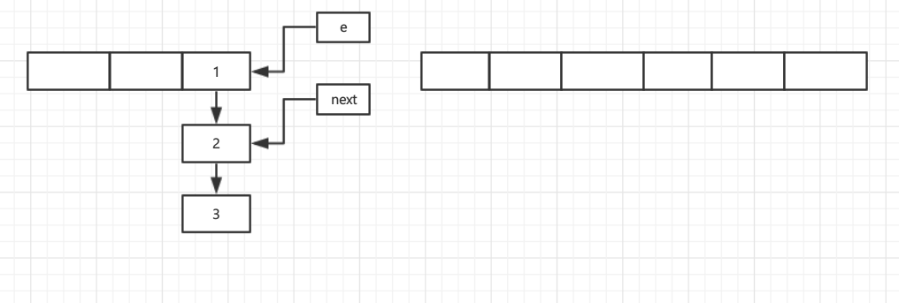

2. `e.next = newTable[i];`

   将链表头结点的下一个节点指向新的数组对应的格子

   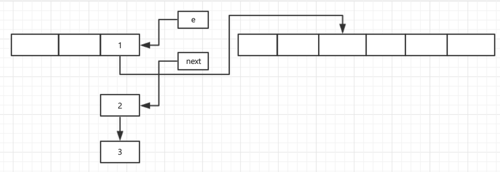

3. `newTable[i] = e;`

   将新的数组的格子所在的位置放置头结点

   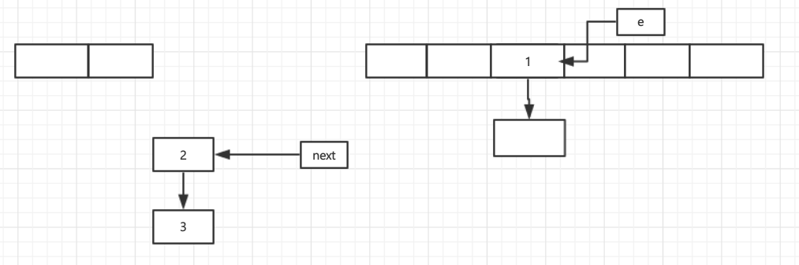

4. `e = next;`

   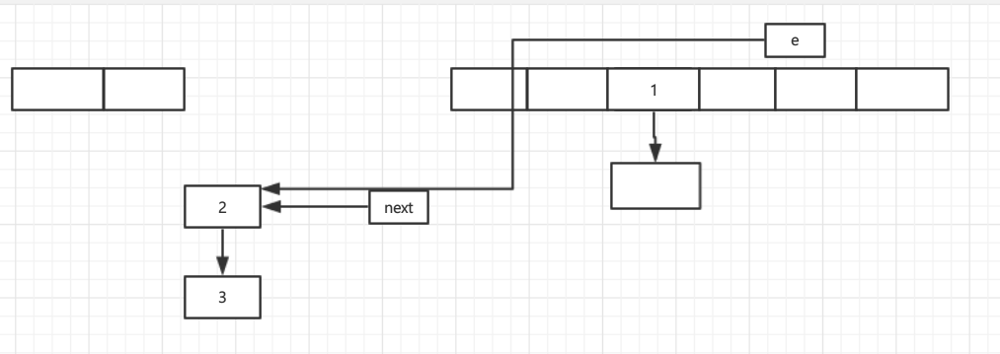

5. 继续完成接下来的操作

   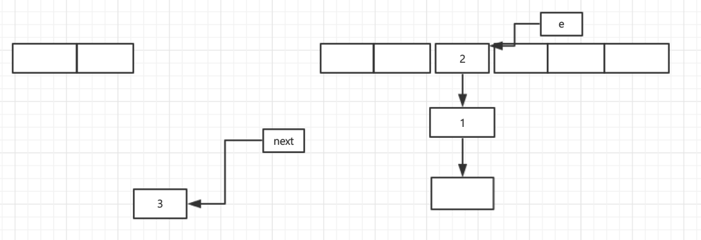

   结果发现链表的顺序和之前的完全相反，这就是**头插法**

### 多线程下的扩容

**如果两个线程同时扩容**

假设第二个线程在`Entry<K,V> next = e.next;`被阻塞住了，第一个线程已经完成了数据的transfer操作，第一个线程继续执行：

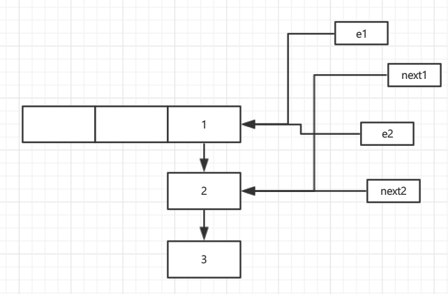


1. 通过上图可以知道第一个线程已经完成了resize的操作，第二线程才开始执行，才进行到`Entry<K,V> next = e.next;`，接下来执行`e.next = newTable[i];`

   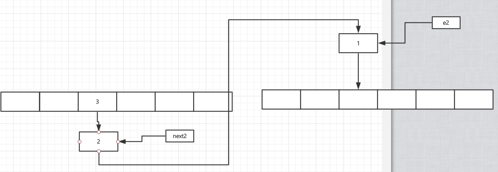

2. 继续执行`newTable[i] = e;`

   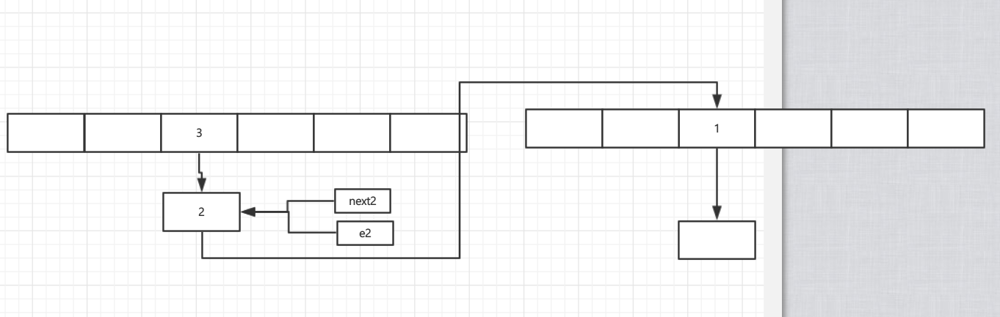

3. 接着执行`e = next;`

   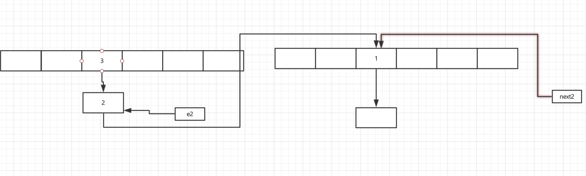

4. 这儿就看出了点问题的矛头了，next2指向的是1，接下来就可以预见会有问题发生，接着第二个链表元素的移动`Entry<K,V> next = e.next;`和`e.next = newTable[i];`

   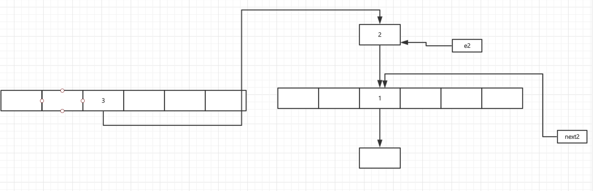

5. 接着执行`newTable[i] = e;`

   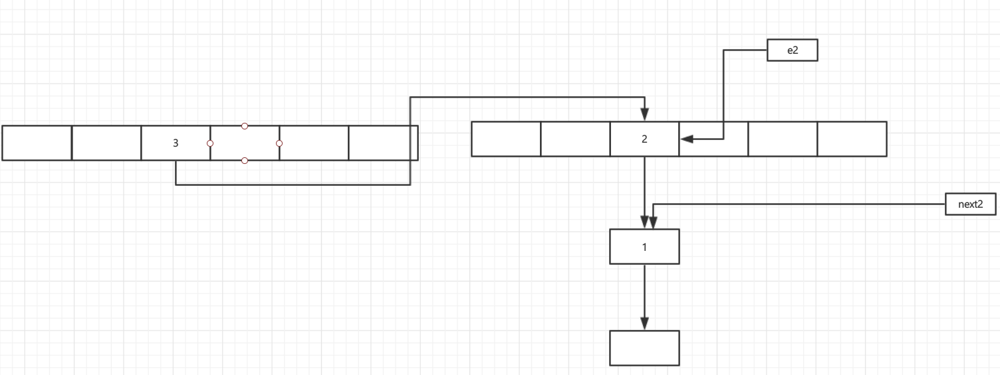

6. `e = next;`

   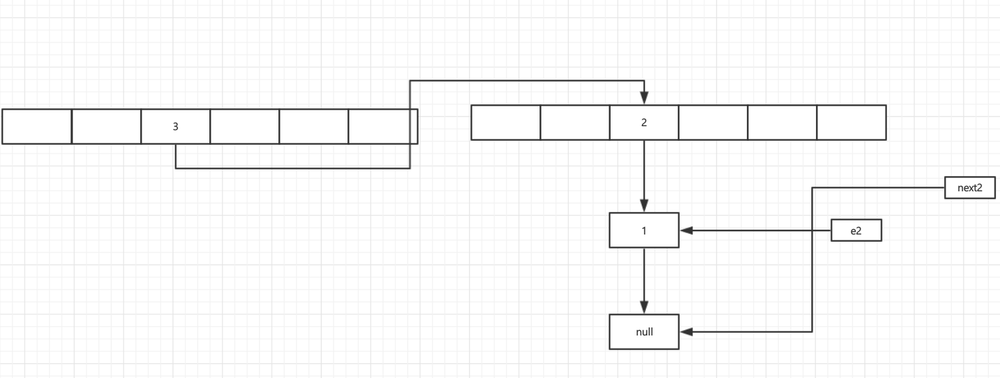

7. 从上图就可以看出问题了，e2并没有指向3反而指向了2的下一个也就是1，那么接下来就会发生循环链表

   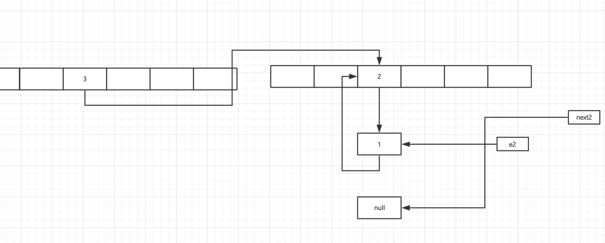

除了循环链表的问题，还可能出现一个线程移除数据，另一个线程读取数据的时候的异常。

**那么为什么会出现循环链表的问题呢？**

`归根结底，原因就是1.7链表新节点采用的是头插法，这样在线程一扩容迁移元素时，会将元素顺序改变，导致两个线程中出现元素的相互指向而形成循环链表，1.8采用了尾插法，从根源上杜绝了这种情况的发生`


