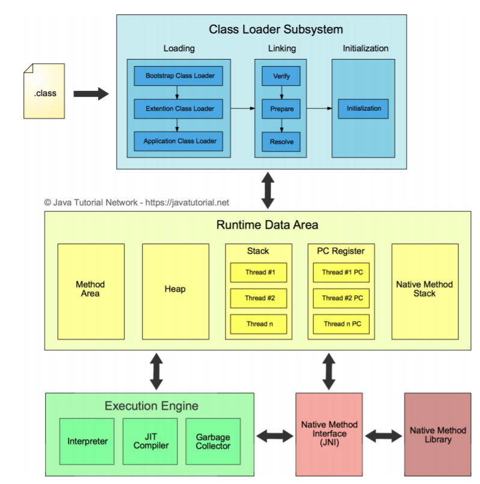
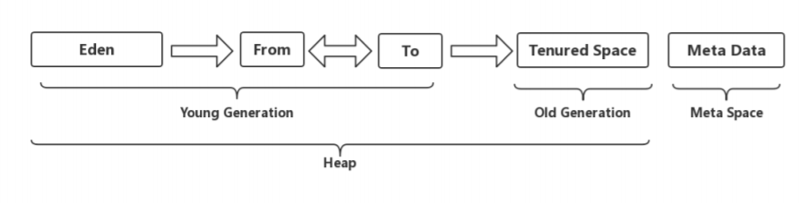
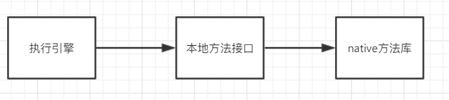
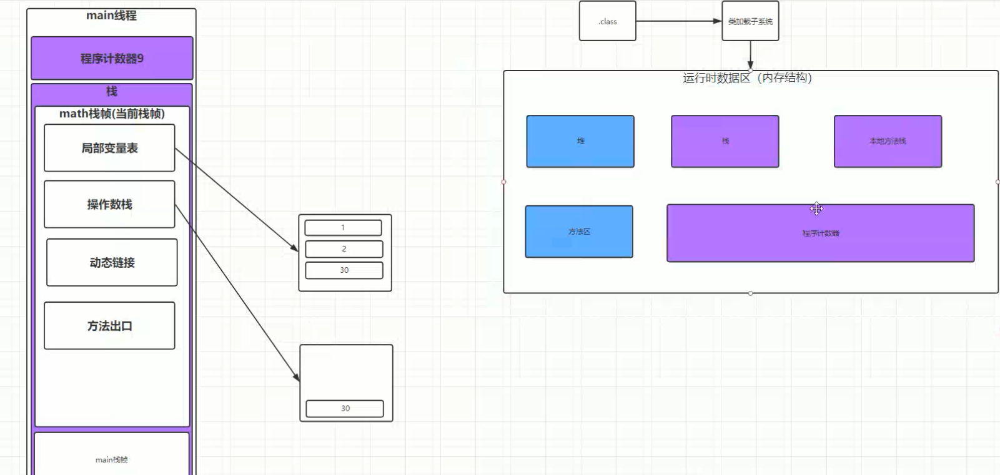

# JVM性能调优

+ JVM内存结构
+ 类加载机制和JDK的调优工具命令
+ GC日志格式
+ GC调优实战

java虚拟机(java virtual machine，JVM)，一种能够运行java字节码的虚拟机。作为一种编程语言的虚拟机，实际上
不只是专用于Java语言，只要生成的编译文件匹配JVM对加载编译文件格式要求，任何语言都可以由JVM编译运行。比如kotlin、scala等。

jvm有很多，不只是Hotspot，还有JRockit、J9等等

```undefined
> 在JDK1.8之前，JRockit号称是最快的虚拟机，Sun公司不开心了就把它收购了，所以才有现在的JDK1.8，JDK1.8的功能之所以应用广，主要是增加了很多新的特性，同时虚拟机性能也提升了很高
```

## JVM的基本结构

JVM由三个主要的子系统构成

+ 类加载子系统
+ 运行时数据区（内存结构）
+ 执行引擎



````java
.class文件通过类加载子系统加载到运行时数据区，然后执行引擎去执行加载到内存中的.class，GC主要存在在执行引擎中。
````


### 运行时数据区（内存结构）

#### 1.方法区（Method Area）

类的所有字段和方法字节码，以及一些特殊方法如构造函数，接口代码也在这里定义。简单来说，所有定义的方法的信息都保存在该区域，静态变量+常量+类信息（构造方法/接口定义）+运行时常量池都存在方法区中，虽然Java虚拟机规范把方法区描述为堆的一个逻辑部分，但是它却有一个别名叫做Non-Heap（非堆），目的应该是为了和Java的堆区分开

`方法区以前属于堆，在JDK1.7就慢慢的把永久代移除，现在我们叫元空间`

`在JDK8,Hotspot和JRocket进行融合的时候，Hotspot败了，于是就把永久代移除了，元空间替代永久代了，元空间使用的是本地内存`

````java
在Java虚拟机中，方法区是可供各线程共享的运行时内存区域。

在不同的JDK版本中，方法区中存储的数据是不一样的。

在JDK1.6及之前，运行时常量池是方法区的一个部分，同时方法区里面存储了类的元数据信息、静态变量、即时编译器编译后的代码（比如spring 使用IOC或者AOP创建bean时，或者使用cglib，反射的形式动态生成class信息等）等。

在JDK1.7及以后，JVM已经将运行时常量池从方法区中移了出来，在JVM堆开辟了一块区域存放常量池。
````

##### 1.1方法区和永久代的关系

在Java虚拟机规范中，方法区在虚拟机启动的时候创建，虽然方法区是堆的逻辑组成部分，但是简单的虚拟机实现可以选择不在方法区实现垃圾回收与压缩。这个版本的虚拟机规范也不限定实现方法区的内存位置和编译代码的管理策略。所以不同的JVM厂商，针对自己的JVM可能有不同的方法区实现方式。

在HotSpot中，设计者将方法区纳入GC分代收集。HotSpot虚拟机堆内存被分为新生代和老年代，对堆内存进行分代管理，所以HotSpot虚拟机使用者更愿意将方法区称为老年代。

方法区和永久代的关系很像Java中接口和类的关系，类实现了接口，而永久代就是HotSpot虚拟机对虚拟机规范中方法区的一种实现方式。

我们知道在HotSpot虚拟机中存在三种垃圾回收现象，minor GC、major GC和full GC。对新生代进行垃圾回收叫做minor GC，对老年代进行垃圾回收叫做major GC，同时对新生代、老年代和永久代进行垃圾回收叫做full GC。许多major GC是由minor GC触发的，所以很难将这两种垃圾回收区分开。major GC和full GC通常是等价的，收集整个GC堆。但因为HotSpot VM发展了这么多年，外界对各种名词的解读已经完全混乱了，当有人说“major GC”的时候一定要问清楚他想要指的是上面的full GC还是major GC。

##### 1.2 元空间

上面说过，HotSpot虚拟机在1.8之后已经取消了永久代，改为元空间，类的元信息被存储在元空间中。元空间没有使用堆内存，而是与堆不相连的本地内存区域。所以，理论上系统可以使用的内存有多大，元空间就有多大，所以不会出现永久代存在时的内存溢出问题。这项改造也是有必要的，永久代的调优是很困难的，虽然可以设置永久代的大小，但是很难确定一个合适的大小，因为其中的影响因素很多，比如类数量的多少、常量数量的多少等。永久代中的元数据的位置也会随着一次full GC发生移动，比较消耗虚拟机性能。同时，HotSpot虚拟机的每种类型的垃圾回收器都需要特殊处理永久代中的元数据。将元数据从永久代剥离出来，不仅实现了对元空间的无缝管理，还可以简化Full GC以及对以后的并发隔离类元数据等方面进行优化。

````
方法区是JVM规范概念，而永久代则是Hotspot虚拟机特有的概念。
````


#### 2.堆（Heap）

虚拟机启动时自动分配创建，用于存放对象的实例，几乎所有对象（包括常量池）都在堆上分配内存，当对象无法在该空间申请到内存是将抛出OutOfMemoryError异常。同时也是垃圾收集器管理的主要区域。



##### 2.1 新生代（Young Generation）

类出生、成长、消亡的区域，一个类在这里产生，应用，最后被垃圾回收器收集，
结束生命。
新生代分为两部分：伊甸区（Eden space）和幸存者区（Survivor space），所有的类都是在伊甸区被new出来的。幸存区又分为From和To区。当Eden区的空间用完是，程序又需要创建对象，JVM的垃圾回收器将Eden区进行垃圾回收（Minor GC），将Eden区中的不再被其它对象应用的对象进行销毁。然后将Eden区中剩余的对象移到FromSurvivor区。若From Survivor区也满了，再对该区进行垃圾回收，然后移动到To Survivor区。

##### 2.2 老年代（Old Generation）

新生代经过多次GC[大概是15次]仍然存活的对象移动到老年区。若老年代也满了，这时候将发生Major GC（也可以叫Full GC），进行老年区的内存清理。若老年区执行了Full GC之后发现依然无法进行对象的保存，就会抛出
OOM（OutOfMemoryError）异常

`一般情况下需要尽量避免Full GC，因为Full GC会让系统暂停，STOP THE WORLD`

##### 2.3 元空间（Meta Space）

在JDK1.8之后，元空间替代了永久代，它是对JVM规范中方法区的实现，区别在于元数据区不在虚拟机当中，而是用的本地内存，永久代在虚拟机当中，永久代逻辑结构上也属于堆，但是物理上不属于。

**为什么移除了永久代？**

参考官方解释http://openjdk.java.net/jeps/122
大概意思是移除永久代是为融合HotSpot与 JRockit而做出的努力，因为JRockit没有永久代，不需要配置永久代。

#### 3.栈(Stack)

Java线程执行方法的内存模型，一个线程对应一个栈，每个方法在执行的同时都会创建一个栈帧（用于存储局部变量表，操作数栈，动态链接，方法出口等信息）不存在垃圾回收问题，只要线程一结束该栈就释放，生命周期和线程一致

#### 4.本地方法栈(Native Method Stack)

和栈作用很相似，区别不过是Java栈为JVM执行Java方法服务，而本地方法栈为JVM执行native方法服务。登记native方法，在Execution Engine执行时加载本地方法库



#### 5.程序计数器(Program Counter Register)

就是一个指针，指向方法区中的方法字节码（用来存储指向吓一跳指令的地址，也即将要执行的指令代码），由执行引擎读取下一条指令，是一个非常小的内存空间，几乎可以忽略不计

#### 例子

分析一个例子

````java
public class Test {

    public int math() {
        int a = 1;
        int b = 2;
        int c = (a + b) * 10;
        return c;
    }

    public static void main(String[] args) {
        Test test = new Test();
        int math = test.math();
        System.out.println(math);
    }
}
````

通过javac命令编译成.class，在通过javap -c 命令对代码进行反汇编，生成我们看得懂的格式

````java
javac Test.java
````

```java
javap -c Test.class >Test.txt
```

````java
Compiled from "Test.java"
public class com.rabbitmq.util.Test {
  public com.rabbitmq.util.Test();
    Code:
       0: aload_0
       1: invokespecial #1                  // Method java/lang/Object."<init>":()V
       4: return

  public int math();
    Code:
       0: iconst_1 // 加载int值是1推送到栈顶
       1: istore_1 // 将栈顶的int值1存到局部变量表第一个位置去
       2: iconst_2 // 把int值2推送至栈顶
       3: istore_2 // 将栈顶的int值2存到局部变量表第二个位置去
       4: iload_1  // 将第一个int的本地变量推送到操作数栈顶
       5: iload_2  // 将第二个int的本地变量推送到操作数栈顶
       6: iadd   // 将栈顶两个int数值相加结果压入栈顶
       7: bipush        10 // 将常量池中的值推送至栈顶
       9: imul  // 将栈顶两个int数值相乘结果压入栈顶
      10: istore_3 //  将栈顶的int值2存到局部变量表第三个位置
      11: iload_3 // 将第三个int的本地变量推送到操作数栈顶
      12: ireturn // 返回给调用者
/**
  ** 程序计数器就是前面的数字，它指向下一次执行代码的位置，第8步就是从常量池里面取出10，所以看不见，
**/
  public static void main(java.lang.String[]);
    Code:
       0: new           #2                  // class com/rabbitmq/util/Test
       3: dup
       4: invokespecial #3                  // Method "<init>":()V
       7: astore_1
       8: aload_1
       9: invokevirtual #4                  // Method math:()I
      12: istore_2
      13: getstatic     #5                  // Field java/lang/System.out:Ljava/io/PrintStream;
      16: iload_2
      17: invokevirtual #6                  // Method java/io/PrintStream.println:(I)V
      20: return
}
````

可以看见有好多指令都看不懂，通过图形进行分析。



````
通过方法出口，栈帧找到了调用者
动态链接是链接到堆内存中对象
````

