## 类加载机制与JDK调优监控工具
Java运行时编译源码(.java)成字节码，由jre运行。jre由java虚拟机实现。JVM分析字节码，后解释并执行

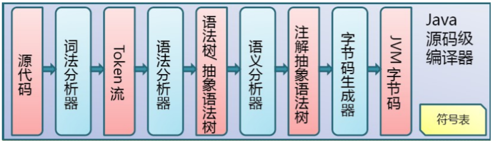

## 类的生命周期

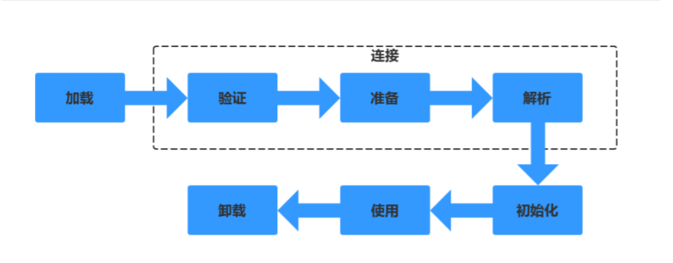

### 1.加载

将.class文件从磁盘读到内存

````
一般通过类的权限类名【绝对路径/path+包名+类名】加载, 然后把这个字节流代表的一个静态结构转换成在方法区里面运行时的数据结构，也就是说这个类的引用对象的模板文件在方法区里面产生，然后在Java堆里面生成代表这个类的实例。
````

### 2.连接

#### 2.1 验证

验证字节码文件的正确性
#### 2.2 准备

给类的静态变量分配内存，并赋予默认值

`静态变量存在于方法区`

```java
static int a = 5; // 赋予默认值 这儿是0
```

#### 2.3 解析
类装载器装入类所引用的其它所有类
### 3.初始化
为类的静态变量赋予正确的初始值，上述的准备阶段为静态变量赋予的是虚拟机默认的初始值，此处赋予的才是程序编写者为变量分配的真正的初始值，执行静态代码块

### 4.使用
### 5.卸载
## 类加载器的种类
### 启动类加载器(Bootstrap ClassLoader)
负责加载JRE的核心类库，如JRE目标下的rt.jar，charsets.jar等
### 扩展类加载器(Extension ClassLoader)
负责加载JRE扩展目录ext中jar类包
### 系统类加载器(Application ClassLoader)
负责加载ClassPath路径下的类包
### 用户自定义加载器(User ClassLoader)
负责加载用户自定义路径下的类包

**小例子**

````java
import com.sun.crypto.provider.DESKeyFactory;

public class ClassLoaderDemo {

    public static void main(String[] args) {
        System.out.println(String.class.getClassLoader());
        System.out.println(DESKeyFactory.class.getClassLoader().getClass().getName());
        System.out.println(ClassLoaderDemo.class.getClassLoader().getClass().getName());
        System.out.println(ClassLoader.getSystemClassLoader().getClass().getName());
    }
}
````

````java
null // 启动类加载器是用C写的，所以这儿体现不出来
sun.misc.Launcher$ExtClassLoader // 扩展类加载器
sun.misc.Launcher$AppClassLoader // 系统类加载器
sun.misc.Launcher$AppClassLoader
````

```
			启动类加载器(使用C写的)
				|
			扩展类加载器
				|
			系统类加载器
它们是向上委托的，虽说是父类加载器，但它们不是继承关系。
```

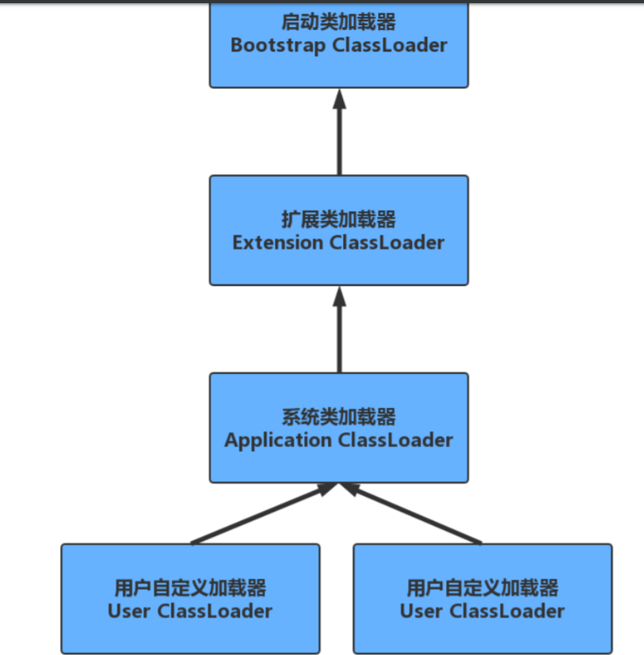

## 类加载机制

### 全盘负责委托机制
当一个ClassLoader加载一个类的时候，除非显示的使用另一个ClassLoader，该类所依赖和引用的类也由这个ClassLoader载入

`A类调用B类使用的是A类的类加载器`

### 双亲委派机制

指先委托父类加载器寻找目标类，在找不到的情况下再从自己的路径中查找并载入目标类

### 双亲委派模式的优势

+ 沙箱安全机制：比如自己写的String.class类不会被加载，这样可以防止核心库被随意篡改

+ 避免类的重复加载：当父ClassLoader已经加载了该类的时候，就不需要子ClassLoader再加载一次

  

**例子**

```java
public class String {

    public static void main(String[] args) {
        System.out.println("Hello, world");
    }
}
```

```
根本不能跑起来
错误：在类java.lang.String中找不到main方法，请将main方法定义为：xxxxxx
```

````
分析：
1. String.class首先给到ApplicationClassLoader
2. 然后往上给到Ext ClassLoader
3. 然后往上给到Bootstrap ClassLoader
   1. 然后Bootstrap ClassLoader去加载自己的核心库，它发现自己核心库里面有个String，在哪个String里面没有main方法，所以报错

````

`所以双亲委派机制可以防止类的重复加载`

**有没有什么方法打破双亲委派机制？**

```
tomcat就打破了双亲委派机制，它有自己的类加载器，比如JSPClassLoader
```

一共有三种方式可以打破

````java
Class.forName("com.mysql.jdbc.Dirver");
DriverManager.getConnection("....");
/***
	mysql就打破了双亲委派机制，在jdbc4.0之后不需要Class.forName()
	加载驱动，直接DriverManager.getConnection("....")就可以了，因为它会
	调用线程上下文的加载器加载。而DriverManager在rt包下面，是bootstrap加载器，所以本来应该用boostrap加载器，但是却使用了ApplicaitonClassLoader，所以打破了双亲委派
****/
````


## JVM性能调优监控工具

### Jinfo

查看正在运行的Java程序的扩展参数

#### 查看JVM的参数

随便启动了一个Spring Boot应用，通过`jps`命令查看对应的进程id，然后执行`jinfo -flags processId`

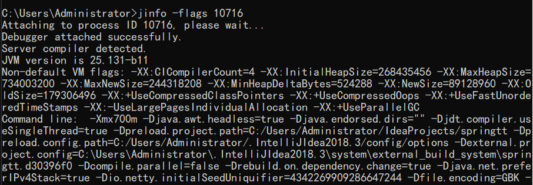

#### 查看java系统属性

等同于System.getProperties()

`jinfo -sysprops 10716`

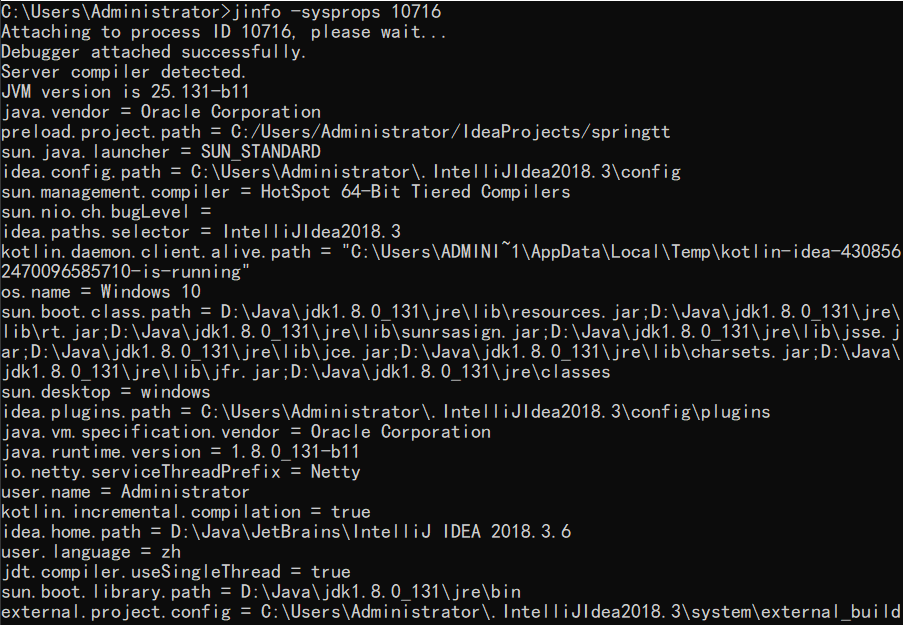

### Jstat
jstat命令可以查看堆内存各部分的使用量，以及加载类的数量。命令格式：
jstat [-命令选项] [vmid] [间隔时间/毫秒] [查询次数]

#### 类加载统计

`jstat -class 3963`

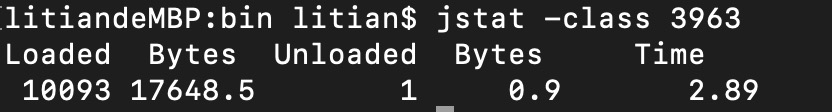

+ Loaded：加载class的数量
+ Bytes：所占用空间大小
+ Unloaded：未加载数量
+ Bytes：未加载占用空间
+ Time：时间

#### 垃圾回收统计

`jstat -gc 3963`

便于我们分析


+ S0C：第一个Survivor区的空间
+ S1C：第二个Survivor区的空间
+ S0U：第一个Survivor区的使用空间
+ S1U：第二个Survivor区的使用空间
+ EC：Eden区的总空间
+ EU：Eden区的使用空间
+ OC：Old区的总空间
+ OU：Old区的已使用空间
+ MC：元空间的总空间
+ MU：元空间的使用空间
+ CCSC：压缩类的总空间
+ CCSU：压缩类的使用空间
+ YGC：年轻代垃圾回收次数
+ YGCT：年轻代垃圾回收消耗时间
+ FGC：老年代垃圾回收次数
+ FGCT：老年代垃圾回收消耗时间
+ GCT：垃圾回收消耗总时间

#### 堆内存统计

`jstat -gccapacity 3963`

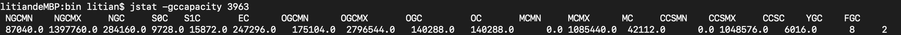

+ NGCMN：新生代最小空间
+ NGCMX：新生代最大空间
  NGC：当前新生代空间
+ S0C：第一个Survivor区空间
+ S1C：第二个Survivor区空间
+ EC：Eden区的总空间
+ OGCMN：老年代最小空间
+ OGCMX：老年代最大空间
+ OGC：当前老年代空间
+ OC：当前老年代空间
+ MCMN：最小元空间大小
+ MCMX：最大元空间大小
+ MC：当前元空间大小
+ CCSMN：最小压缩类空间大小
+ CCSMX：最大压缩类空间大小
+ CCSC：当前压缩类空间大小
+ YGC：年轻代GC次数
+ FGC：老年代GC次数

##### 新生代垃圾回收统计

`jstat -gcnew 3963`


+ S0C：第一个Survivor区空间
+ S1C：第二个Survivor区空间
+ S0U：第一个Survivor区的使用空间
+ S1U：第二个Survivor区的使用空间
+ TT：对象在新生代存活的次数
+ MTT：对象在新生代存活的最大次数
+ DSS：期望Survivor区大小
+ EC：Eden区的空间
+ EU：Eden区的使用空间
+ YGC：年轻代垃圾回收次数
+ YGCT：年轻代垃圾回收消耗时间

##### 新生代内存统计

`jstat -gcnewcapacity 3963`

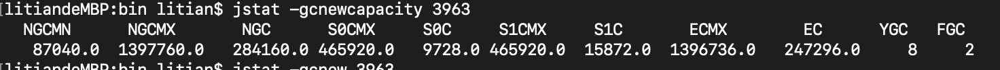

+ NGCMN：新生代最小空间
+ NGCMX：新生代最大空间
+ NGC：当前新生代空间
+ S0CMX：最大第一个Survivor区空间
+ S0C：当前第一个Survivor区空间
+ S1CMX：最大第二个Survivor区空间
+ S1C：当前第二个Survivor区空间
+ ECMX：最大Eden区空间
+ EC：当前Eden区空间
+ YGC：年轻代垃圾回收次数
+ FGC：老年代垃圾回收次数

#### 老年代垃圾回收统计

`jstat -gcold 3963`

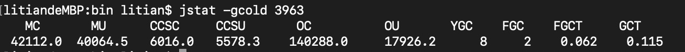

+ MC：元空间的总空间
+ MU：元空间的使用空间
+ CCSC：压缩类的总空间
+ CCSU：压缩类的使用空间
+ OC：Old区的总空间
+ OU：Old区的已使用空间
+ YGC：年轻代GC次数
+ FGC：老年代GC次数
+ FGCT：老年代垃圾回收消耗时间
+ GCT：垃圾回收消耗总时间

#####  老年代内存统计

`jstat -gcoldcapacity 3963`

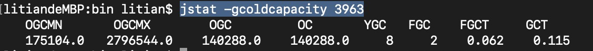

+ OGCMN：老年代最小空间
+ OGCMX：老年代最大空间
+ OGC：当前老年代空间
+ OC：当前老年代空间
+ YGC：年轻代GC次数
+ FGC：老年代GC次数
+ FGCT：老年代垃圾回收消耗时间
+ GCT：垃圾回收消耗总时间

##### 元空间内存统计

`jstat -gcmetacapacity 3963`

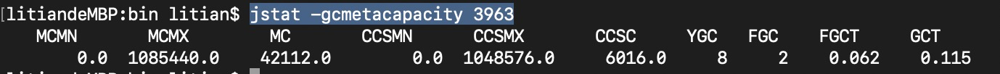

+ MCMN：最小元空间大小
+ MCMX：最大元空间大小
+ MC：当前元空间大小
+ CCSMN：最小压缩类空间大小
+ CCSMX：最大压缩类空间大小
+ CCSC：当前压缩类空间大小
+ YGC：年轻代GC次数
+ FGC：老年代GC次数
+ FGCT：老年代垃圾回收消耗时间
+ GCT：垃圾回收消耗总时间

##### 总垃圾回收统计

`jstat -gcutil 3963`

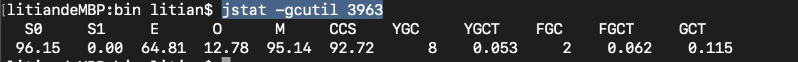

+ S0：第一个Survivor区当前使用比例
+ S1：第二个Survivor区当前使用比例
+ E：Eden区使用比例
+ O：Old区使用比例
+ M：元空间使用比例
+ CCS：压缩使用比例
+ YGC：年轻代垃圾回收次数
+ FGC：老年代垃圾回收次数
+ FGCT：老年代垃圾回收消耗时间
+ GCT：垃圾回收消耗总时间

### Jmap

可以用来查看内存信息

#### 堆的对象统计

````java
jmap -histo 10716 > 10716.txt // 这个指令是统计所有的对象
jmap -histo:live 10716 > 10716.txt    // 可以统计活着的对象
````

如图：

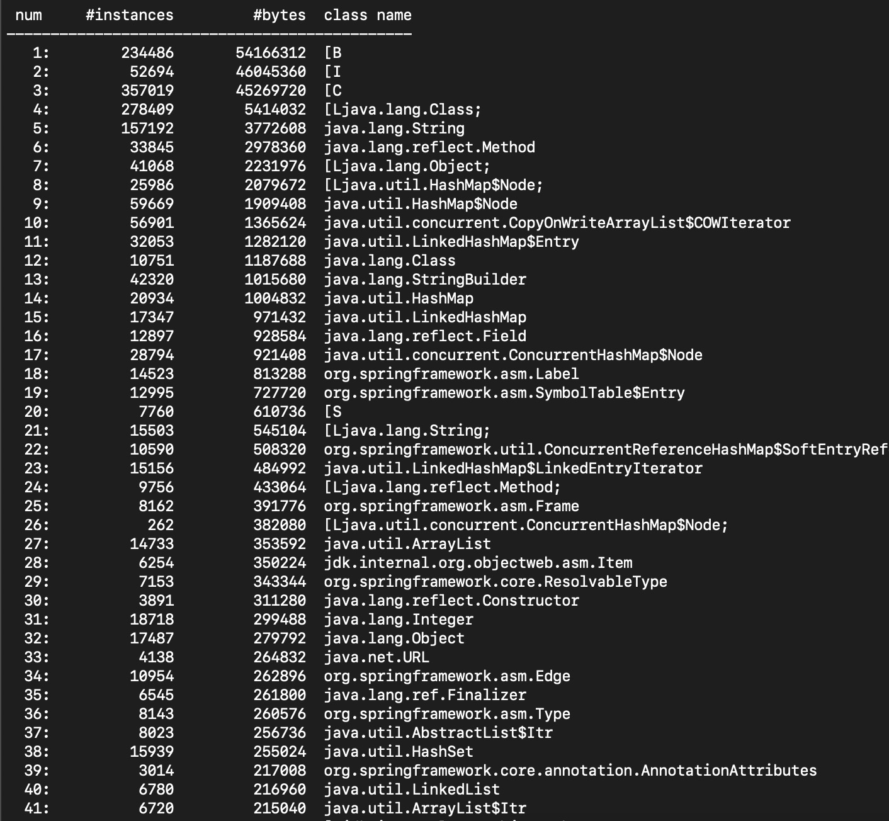

+ Num：序号
+ Instances：实例数量
+ Bytes：占用空间大小
+ Class Name：类名

#### 堆信息

````java
jmap -heap 10716
````

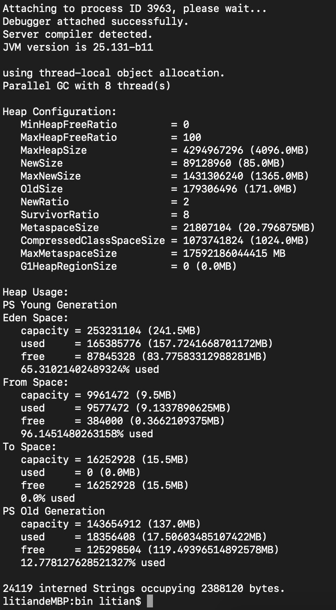

#### 堆内存dump

dump文件其实就是堆内存的快照。

`````java
jmap -dump:format=b,file=springboot.hprof 10716
`````

也可以在设置内存溢出的时候自动导出dump文件（内存很大的时候，可能会导不出来）

1. -XX:+HeapDumpOnOutOfMemoryError
2. -XX:HeapDumpPath=输出路径

可以使用`jvisualvm`命令工具导入文件分析

````java
-Xms10m -Xmx10m 
-XX:+PrintGCDetails 
-XX:+HeapDumpOnOutOfMemoryError 
-XX:HeapDumpPath=d:\oomdump.dump
````

这儿用一个oom错误的例子来分析

````java
public class User {
    private String id;
    private String info;

    public User(String id, String info) {
        this.id = id;
        this.info = info;
    }

    public String getId() {
        return id;
    }

    public void setId(String id) {
        this.id = id;
    }

    public String getInfo() {
        return info;
    }

    public void setInfo(String info) {
        this.info = info;
    }
}
````

````java
public class OomDemo {

    public static void main(String[] args) {
        List<User> list = new ArrayList<User>();
        while (true) {
            UUID uuid = UUID.randomUUID();
            list.add(new User(uuid.toString(), uuid.toString()));
        }
    }
}
````

`运行的时候加入参数`

`````
-Xms10m -Xmx10m 
-XX:+PrintGCDetails 
-XX:+HeapDumpOnOutOfMemoryError 
-XX:HeapDumpPath=d:\oomdump.dump
`````

执行没有多久就报错

`````java
[Full GC (Ergonomics) [PSYoungGen: 2048K->2047K(2560K)] [ParOldGen: 7082K->7049K(7168K)] 9130K->9097K(9728K), [Metaspace: 4089K->4089K(1056768K)], 0.0162406 secs] [Times: user=0.08 sys=0.00, real=0.02 secs] 
[Full GC (Ergonomics) [PSYoungGen: 2048K->2047K(2560K)] [ParOldGen: 7049K->7049K(7168K)] 9097K->9097K(9728K), [Metaspace: 4089K->4089K(1056768K)], 0.0176105 secs] [Times: user=0.08 sys=0.00, real=0.02 secs] 
[Full GC (Ergonomics) [PSYoungGen: 2047K->2047K(2560K)] [ParOldGen: 7049K->7049K(7168K)] 9097K->9097K(9728K), [Metaspace: 4089K->4089K(1056768K)], 0.0196097 secs] [Times: user=0.06 sys=0.00, real=0.02 secs] 
Exception in thread "main" [Full GC (Ergonomics) [PSYoungGen: 2047K->0K(2560K)] [ParOldGen: 7059K->804K(7168K)] 9107K->804K(9728K), [Metaspace: 4103K->4103K(1056768K)], 0.0082470 secs] [Times: user=0.06 sys=0.00, real=0.01 secs] 
java.lang.OutOfMemoryError: GC overhead limit exceeded
	at java.util.Arrays.copyOfRange(Arrays.java:3664)
	at java.lang.String.<init>(String.java:207)
	at java.lang.String.substring(String.java:1933)
	at java.util.UUID.digits(UUID.java:386)
	at java.util.UUID.toString(UUID.java:376)
	at com.tt.OomDemo.main(OomDemo.java:13)
Heap // 这儿还打印了堆内存的信息
 PSYoungGen      total 2560K, used 134K [0x00000000ffd00000, 0x0000000100000000, 0x0000000100000000)
  eden space 2048K, 6% used [0x00000000ffd00000,0x00000000ffd21978,0x00000000fff00000)
  from space 512K, 0% used [0x00000000fff80000,0x00000000fff80000,0x0000000100000000)
  to   space 512K, 0% used [0x00000000fff00000,0x00000000fff00000,0x00000000fff80000)
 ParOldGen       total 7168K, used 804K [0x00000000ff600000, 0x00000000ffd00000, 0x00000000ffd00000)
  object space 7168K, 11% used [0x00000000ff600000,0x00000000ff6c9010,0x00000000ffd00000)
 Metaspace       used 4175K, capacity 4604K, committed 4864K, reserved 1056768K
  class space    used 464K, capacity 492K, committed 512K, reserved 1048576K
`````

可以看见d盘生成了一个`oomdump.dump`文件，导入到`jvisualvm`中分析

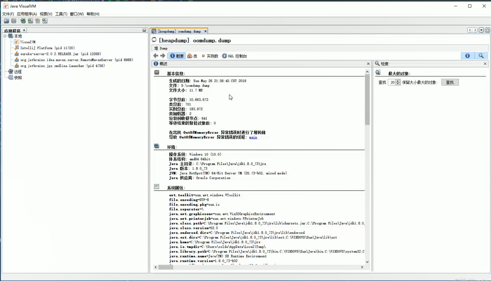

可以看见一些基本信息，包括错误。还可以看见系统属性，这其实是jinfo的命令，只是集成到了jmap里面了。

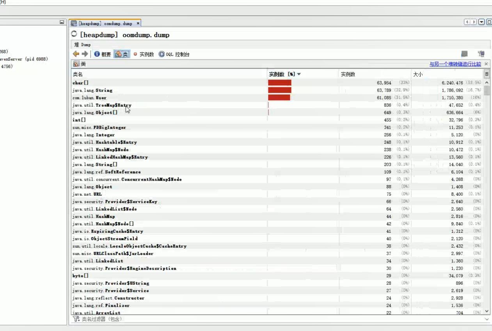

可以继续看到实例数占用大小，那么这儿为什么是char占用最多？因为String底层就是char的数组，我们可以点进User里面看看


可以看见有很多User的实例，每个实例的字段和uid，uid就是String的。

### Jstack

jstack用于生成java虚拟机当前时刻的线程快照

`jstack 3963`

这儿通过一个死锁的例子来分析

```java
public class DeadLock {

    private static Object lock1 = new Object();
    private static Object lock2 = new Object();

    public static void main(String[] args) {
        new Thread(() -> {
            synchronized (lock1) {
                System.out.println("Thread1 start");
                try {
                    Thread.sleep(5000);
                } catch (InterruptedException e) {
                    e.printStackTrace();
                }
                synchronized (lock2) {
                    System.out.println("thread1 end");
                }
            }
        }).start();

        new Thread(() -> {
            synchronized (lock2) {
                System.out.println("Thread2 start");
                try {
                    Thread.sleep(5000);
                } catch (InterruptedException e) {
                    e.printStackTrace();
                }
                synchronized (lock1) {
                    System.out.println("thread2 end");
                }
            }
        }).start();

        System.out.println("end");
    }
}
```

使用jstack命令

````
Found one Java-level deadlock:
=============================
"Thread-1":
  waiting to lock monitor 0x00007f84ab8086a8 (object 0x000000076ada56b0, a java.lang.Object),
  which is held by "Thread-0"
"Thread-0":
  waiting to lock monitor 0x00007f84ab805e18 (object 0x000000076ada56c0, a java.lang.Object),
  which is held by "Thread-1"

Java stack information for the threads listed above:
===================================================
"Thread-1":
	at com.px.util.DeadLock.lambda$main$1(DeadLock.java:32)
	- waiting to lock <0x000000076ada56b0> (a java.lang.Object)
	- locked <0x000000076ada56c0> (a java.lang.Object)
	at com.px.util.DeadLock$$Lambda$2/668386784.run(Unknown Source)
	at java.lang.Thread.run(Thread.java:748)
"Thread-0":
	at com.px.util.DeadLock.lambda$main$0(DeadLock.java:18)
	- waiting to lock <0x000000076ada56c0> (a java.lang.Object)
	- locked <0x000000076ada56b0> (a java.lang.Object)
	at com.px.util.DeadLock$$Lambda$1/764977973.run(Unknown Source)
	at java.lang.Thread.run(Thread.java:748)

Found 1 deadlock.
````

````
"Finalizer" #3 daemon prio=8 os_prio=31 tid=0x00007f84ad800000 nid=0x4d03 in Object.wait() [0x000070000c072000]
   java.lang.Thread.State: WAITING (on object monitor)
	at java.lang.Object.wait(Native Method)
	- waiting on <0x000000076ab08ec8> (a java.lang.ref.ReferenceQueue$Lock)
	at java.lang.ref.ReferenceQueue.remove(ReferenceQueue.java:143)
	- locked <0x000000076ab08ec8> (a java.lang.ref.ReferenceQueue$Lock)
	at java.lang.ref.ReferenceQueue.remove(ReferenceQueue.java:164)
	at java.lang.ref.Finalizer$FinalizerThread.run(Finalizer.java:209)

"Reference Handler" #2 daemon prio=10 os_prio=31 tid=0x00007f84ab802800 nid=0x3403 in Object.wait() [0x000070000bf6f000]
   java.lang.Thread.State: WAITING (on object monitor)
	at java.lang.Object.wait(Native Method)
	- waiting on <0x000000076ab06b68> (a java.lang.ref.Reference$Lock)
	at java.lang.Object.wait(Object.java:502)
	at java.lang.ref.Reference.tryHandlePending(Reference.java:191)
	- locked <0x000000076ab06b68> (a java.lang.ref.Reference$Lock)
	at java.lang.ref.Reference$ReferenceHandler.run(Reference.java:153)
````

可以分析看看，比如第一个线程等待`0x000000076ab08ec8`，但是却把`0x000000076ab08ec8`锁住了，简单来说就是**自己把自己锁住了**。