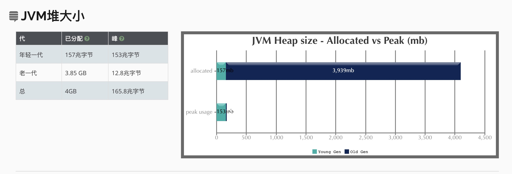
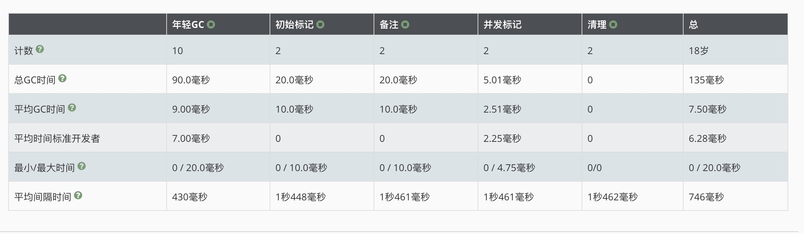
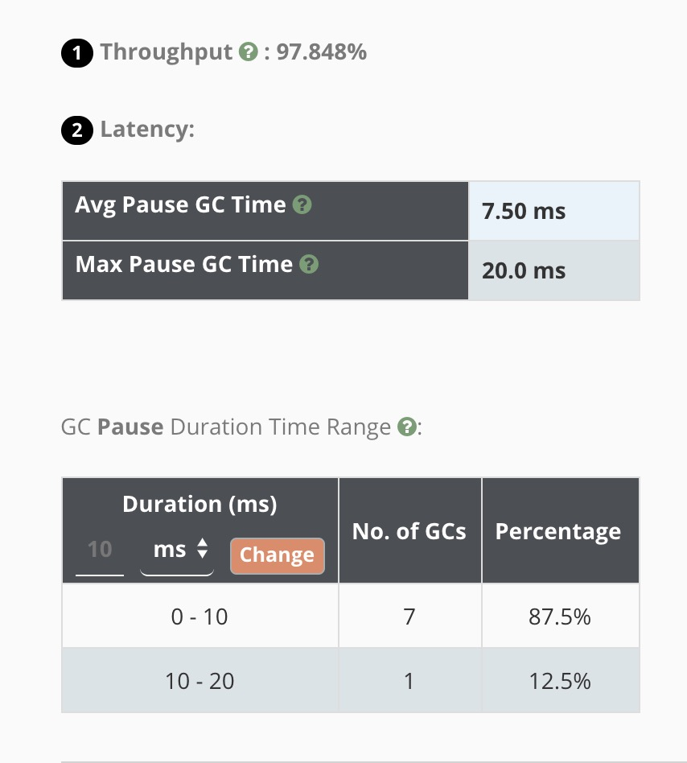
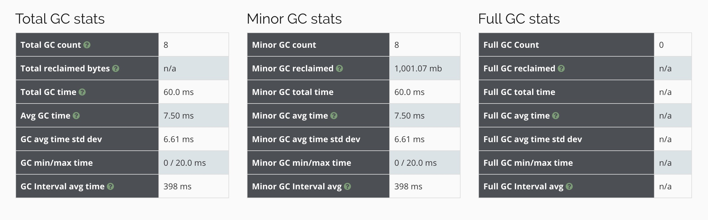

# 调优

Jvm调优主要是调整下面两个指标

+ 停顿时间：垃圾收集器做垃圾回收中断应用执行的时间。`-XX:MaxGCPauseMillis` （STW的时间）

+ 吞吐量：垃圾收集的时间和总时间的占比：1/(1+n)，吞吐量为1-1/(1+n)。`-XX:GCTimeRatio=n`

  吞吐量越大，FULL GC的次数就越少

## GC调优步骤

1. 打印GC日志

   ````
   -XX:+PrintGCDetails -XX:+PrintGCTimeStamps -XX:+PrintGCDateStamps -Xloggc:./gc.log
   ````

   Tomcat可以直接加载JAVA_OPTS变量里

2. 分析日志得到关键性指标

3. 分析GC原因，调优JVM参数

## GC调优实战

1. Parallel Scavenge收集器(默认)

   分析parallel-gc.log

   第一次调优，设置Metaspace大小：增大元空间大小-XX:MetaspaceSize=64M  -XX:MaxMetaspaceSize=64M

   第二次调优，增大年轻代动态扩容增量（默认是20%），可以减少YGC：-XX:YoungGenerationSizeIncrement=30

   比较下几次调优效果：

   | 吞吐量  | 最大停顿    | 平均停顿    | YGC  | FGC  |
   | ------- | ----------- | ----------- | ---- | ---- |
   | 97.169% | 420 ms      | **60.0 ms** | 12   | 2    |
   | 98.775% | **60.0 ms** | **28.0 ms** | 10   | 0    |

2. 配置CMS收集器

   -XX:+UseConcMarkSweepGC

   分析gc-cms.log

   

3. 配置G1收集器

   -XX:+UseG1GC

   分析gc-g1.log

   young GC:[GC pause (G1 Evacuation Pause)(young)

   initial-mark:[GC pause  (Metadata GC Threshold)(young)(initial-mark) (参数：InitiatingHeapOccupancyPercent)

   mixed GC:[GC pause (G1 Evacuation Pause)(Mixed) (参数：G1HeapWastePercent)

   full GC:[Full GC (Allocation Failure)(无可用region)

   （G1内部，前面提到的混合GC是非常重要的释放内存机制，它避免了G1出现Region没有可用的情况，否则就会触发 FullGC事件。CMS、Parallel、Serial GC都需要通过Full GC去压缩老年代并在这个过程中扫描整个老年代。G1的Full GC算法和Serial GC收集器完全一致。当一个Full GC发生时，整个Java堆执行一个完整的压缩，这样确保了最大的空余内存可用。G1的Full GC是一个单线程，它可能引起一个长时间的停顿时间，G1的设计目标是减少Full GC，满足应用性能目标。）

   查看发生MixedGC的阈值：jinfo -flag InitiatingHeapOccupancyPercent 进程ID

   调优：

   第一次调优，设置Metaspace大小：增大元空间大小-XX:MetaspaceSize=64M  -XX:MaxMetaspaceSize=64M

   第二次调优，添加吞吐量和停顿时间参数：-XX:GCTimeRatio=99 -XX:MaxGCPauseMillis=10

   

## GC调优实录

1. 在目录下启动我们的eurka项目

   ```
   litiandeMBP:~ litian$ cd /Users/litian/IdeaProjects/Empty/px-server3000/target/
   litiandeMBP:target litian$ ls
   classes						px-server3000-0.0.1-SNAPSHOT.jar
   generated-sources				px-server3000-0.0.1-SNAPSHOT.jar.original
   generated-test-sources				surefire-reports
   maven-archiver					test-classes
   maven-status
   litiandeMBP:target litian$ java -jar px-server3000-0.0.1-SNAPSHOT.jar
   ```

   项目成功的启动起来

2. 重新启动，加上jvm的参数

   ````
   java -XX:+PrintGCDetails -XX:+PrintGCTimeStamps -XX:+PrintGCDateStamps -Xloggc:./gc.log  -jar px-server3000-0.0.1-SNAPSHOT.jar
   ````

3. 查看日志

   ````java
   Java HotSpot(TM) 64-Bit Server VM (25.131-b11) for bsd-amd64 JRE (1.8.0_131-b11), built on Mar 15 2017 01:32:22 by "java_re" with gcc 4.2.1 (Based on Apple Inc. build 5658) (LLVM build 2336.11.00)
   Memory: 4k page, physical 16777216k(922556k free)
   
   /proc/meminfo:
   
   CommandLine flags: -XX:InitialHeapSize=268435456 -XX:MaxHeapSize=4294967296 -XX:+PrintGC -XX:+PrintGCDateStamps -XX:+PrintGCDetails -XX:+PrintGCTimeStamps -XX:+UseCompressedClassPointers -XX:+UseCompressedOops -XX:+UseParallelGC 
   // 发生一次轻GC，从  65536K 变为 3490K 
   2019-10-14T12:24:57.785-0800: 0.473: [GC (Allocation Failure) [PSYoungGen: 65536K->3490K(76288K) /*总大小*/] 65536K->3506K(251392K), 0.0041454 secs] [Times: user=0.03 sys=0.00, real=0.01 secs] 
   2019-10-14T12:24:57.921-0800: 0.609: [GC (Allocation Failure) [PSYoungGen: 69026K->4066K(76288K)] 69042K->4090K(251392K), 0.0038064 secs] [Times: user=0.02 sys=0.00, real=0.00 secs] 
   2019-10-14T12:24:58.026-0800: 0.714: [GC (Allocation Failure) [PSYoungGen: 69602K->4898K(76288K)] 69626K->4930K(251392K), 0.0035970 secs] [Times: user=0.02 sys=0.00, real=0.01 secs] 
   2019-10-14T12:24:58.135-0800: 0.823: [GC (Allocation Failure) [PSYoungGen: 70434K->5538K(141824K)] 70466K->5578K(316928K), 0.0038653 secs] [Times: user=0.02 sys=0.01, real=0.00 secs] 
   2019-10-14T12:24:58.195-0800: 0.882: [GC (Metadata GC Threshold) [PSYoungGen: 45065K->5812K(141824K)] 45105K->5860K(316928K), 0.0048356 secs] [Times: user=0.03 sys=0.00, real=0.00 secs] 
   // 发生FULL GC （元数据区到达阈值）
   2019-10-14T12:24:58.200-0800: 0.887: [Full GC (Metadata GC Threshold) [PSYoungGen: 5812K->0K(141824K)] [ParOldGen: 48K->5622K(96256K)]/*老年代空间涨了*/ 5860K->5622K(238080K), /*总量*/[Metaspace: 20553K->20551K(1067008K)]/*元空间比较诡异*/, 0.0198436 secs] [Times: user=0.10 sys=0.00, real=0.01 secs] 
   2019-10-14T12:24:58.613-0800: 1.300: [GC (Allocation Failure) [PSYoungGen: 131072K->3104K(209920K)] 136694K->8798K(306176K), 0.0031533 secs] [Times: user=0.02 sys=0.00, real=0.00 secs] 
   2019-10-14T12:24:59.096-0800: 1.783: [GC (Allocation Failure) [PSYoungGen: 209440K->6880K(265216K)] 215134K->12582K(361472K), 0.0053153 secs] [Times: user=0.03 sys=0.01, real=0.01 secs] 
   2019-10-14T12:24:59.595-0800: 2.282: [GC (Metadata GC Threshold) [PSYoungGen: 146432K->7674K(321024K)] 152134K->15965K(417280K), 0.0062873 secs] [Times: user=0.03 sys=0.01, real=0.01 secs] 
   2019-10-14T12:24:59.601-0800: 2.289: [Full GC (Metadata GC Threshold) [PSYoungGen: 7674K->0K(321024K)] [ParOldGen: 8290K->14909K(161792K)] 15965K->14909K(482816K), [Metaspace: 33858K->33858K(1079296K)], 0.0670949 secs] [Times: user=0.36 sys=0.00, real=0.06 secs] 
   2019-10-14T12:25:00.566-0800: 3.253: [GC (Allocation Failure) [PSYoungGen: 313344K->4993K(323072K)] 328253K->19910K(484864K), 0.0044740 secs] [Times: user=0.02 sys=0.01, real=0.01 secs] 
   2019-10-14T12:25:01.480-0800: 4.167: [GC (Allocation Failure) [PSYoungGen: 318337K->9704K(382464K)] 333254K->24853K(544256K), 0.0100864 secs] [Times: user=0.06 sys=0.01, real=0.01 secs] 
   ````

   `+UseParallelGC `：默认使用的是parallel收集器

   **堆内存默认分配是根据电脑物理内存大小来的，下面有配置：`-Xms:初始堆大小，默认物理内存的1/64`**

   分析：

   1. Young GC

      ````java
      // 发生一次轻GC，从  65536K 变为 3490K 
      2019-10-14T12:24:57.785-0800: 0.473: [GC (Allocation Failure) [PSYoungGen: 65536K->3490K(76288K) /*总大小*/] 65536K->3506K(251392K), 0.0041454 secs] [Times: user=0.03 sys=0.00, real=0.01 secs] 
      ````

   2. FULL GC

      ```java
      // 发生FULL GC （元数据区到达阈值）
      2019-10-14T12:24:58.200-0800: 0.887: [Full GC (Metadata GC Threshold) [PSYoungGen: 5812K->0K(141824K)] [ParOldGen: 48K->5622K(96256K)]/*老年代空间涨了*/ 5860K->5622K(238080K), /*总量*/[Metaspace: 20553K->20551K(1067008K)]/*元空间比较诡异*/, 0.0198436 secs] [Times: user=0.10 sys=0.00, real=0.01 secs] 
      ```

      **元空间有一个动态扩展，默认是21MB（可以通过参数指定）**，如果在优化后发现没有涨多少，就会去提高水平线，所以在下一次FULL GC的时候会去动态扩展，比如这儿就增加了。如果优化后变小了，就会降低水平线。

   

4. 通过参数指定GC收集器

   1. 使用CMS收集器：`-XX:+UseConcMarkSweepGC`

      ````
      java -XX:+PrintGCDetails -XX:+PrintGCTimeStamps -XX:+UseConcMarkSweepGC  -XX:+PrintGCDateStamps -Xloggc:./gc-cms.log  -jar px-server3000-0.0.1-SNAPSHOT.jar
      ````

   2. 分析日志

      ````java
      Java HotSpot(TM) 64-Bit Server VM (25.131-b11) for bsd-amd64 JRE (1.8.0_131-b11), built on Mar 15 2017 01:32:22 by "java_re" with gcc 4.2.1 (Based on Apple Inc. build 5658) (LLVM build 2336.11.00)
      Memory: 4k page, physical 16777216k(874032k free)
      
      /proc/meminfo:
      
      CommandLine flags: -XX:InitialHeapSize=268435456 -XX:MaxHeapSize=4294967296 -XX:MaxNewSize=697933824 -XX:MaxTenuringThreshold=6 -XX:OldPLABSize=16 -XX:+PrintGC -XX:+PrintGCDateStamps -XX:+PrintGCDetails -XX:+PrintGCTimeStamps -XX:+UseCompressedClassPointers -XX:+UseCompressedOops -XX:+UseConcMarkSweepGC -XX:+UseParNewGC 
      2019-10-14T12:59:41.458-0800: 0.495: [GC (Allocation Failure) 2019-10-14T12:59:41.458-0800: 0.495: [ParNew: 69952K->3522K(78656K), 0.0040464 secs] 69952K->3522K(253440K), 0.0041431 secs] [Times: user=0.02 sys=0.00, real=0.01 secs] 
      2019-10-14T12:59:41.584-0800: 0.621: [GC (GCLocker Initiated GC) 2019-10-14T12:59:41.584-0800: 0.621: [ParNew: 73474K->5006K(78656K), 0.0035255 secs] 73474K->5006K(253440K), 0.0035942 secs] [Times: user=0.02 sys=0.01, real=0.00 secs] 
      2019-10-14T12:59:41.700-0800: 0.736: [GC (Allocation Failure) 2019-10-14T12:59:41.700-0800: 0.736: [ParNew: 74958K->7046K(78656K), 0.0030962 secs] 74958K->7046K(253440K), 0.0031674 secs] [Times: user=0.03 sys=0.00, real=0.00 secs] 
      2019-10-14T12:59:41.804-0800: 0.841: [GC (Allocation Failure) 2019-10-14T12:59:41.804-0800: 0.841: [ParNew: 76998K->5161K(78656K), 0.0119615 secs] 76998K->8221K(253440K), 0.0120316 secs] [Times: user=0.06 sys=0.01, real=0.01 secs] 
      2019-10-14T12:59:41.952-0800: 0.989: [GC (Allocation Failure) 2019-10-14T12:59:41.952-0800: 0.989: [ParNew: 75113K->4631K(78656K), 0.0036943 secs] 78173K->7691K(253440K), 0.0037732 secs] [Times: user=0.02 sys=0.01, real=0.00 secs]
      // 初始标记
      2019-10-14T12:59:41.956-0800: 0.993: [GC (CMS Initial Mark) [1 CMS-initial-mark: 3060K(174784K)] 8678K(253440K), 0.0013017 secs] [Times: user=0.01 sys=0.00, real=0.00 secs] 
      2019-10-14T12:59:41.957-0800: 0.994: [CMS-concurrent-mark-start]
      2019-10-14T12:59:41.960-0800: 0.997: [CMS-concurrent-mark: 0.003/0.003 secs] [Times: user=0.02 sys=0.00, real=0.01 secs] 
      2019-10-14T12:59:41.960-0800: 0.997: [CMS-concurrent-preclean-start]
      2019-10-14T12:59:41.961-0800: 0.998: [CMS-concurrent-preclean: 0.001/0.001 secs] [Times: user=0.00 sys=0.00, real=0.00 secs] 
      2019-10-14T12:59:41.962-0800: 0.998: [CMS-concurrent-abortable-preclean-start]
      2019-10-14T12:59:42.244-0800: 1.281: [CMS-concurrent-abortable-preclean: 0.137/0.283 secs] [Times: user=1.31 sys=0.02, real=0.28 secs] 
      2019-10-14T12:59:42.245-0800: 1.281: [GC (CMS Final Remark) [YG occupancy: 68973 K (78656 K)]2019-10-14T12:59:42.245-0800: 1.281: [Rescan (parallel) , 0.0081582 secs]2019-10-14T12:59:42.253-0800: 1.290: [weak refs processing, 0.0000252 secs]2019-10-14T12:59:42.253-0800: 1.290: [class unloading, 0.0043383 secs]2019-10-14T12:59:42.257-0800: 1.294: [scrub symbol table, 0.0026982 secs]2019-10-14T12:59:42.260-0800: 1.297: [scrub string table, 0.0003317 secs][1 CMS-remark: 3060K(174784K)] 72033K(253440K), 0.0163143 secs] [Times: user=0.08 sys=0.01, real=0.02 secs] 
      2019-10-14T12:59:42.261-0800: 1.298: [CMS-concurrent-sweep-start]
      2019-10-14T12:59:42.263-0800: 1.300: [CMS-concurrent-sweep: 0.002/0.002 secs] [Times: user=0.01 sys=0.00, real=0.00 secs] 
      2019-10-14T12:59:42.263-0800: 1.300: [CMS-concurrent-reset-start]
      2019-10-14T12:59:42.268-0800: 1.305: [GC (GCLocker Initiated GC) 2019-10-14T12:59:42.268-0800: 1.305: [ParNew: 74583K->5884K(78656K), 0.0029674 secs] 77635K->8936K(253440K), 0.0030383 secs] [Times: user=0.02 sys=0.00, real=0.01 secs] 
      2019-10-14T12:59:42.292-0800: 1.329: [CMS-concurrent-reset: 0.026/0.029 secs] [Times: user=0.16 sys=0.01, real=0.03 secs] 
      2019-10-14T12:59:42.364-0800: 1.401: [GC (Allocation Failure) 2019-10-14T12:59:42.364-0800: 1.401: [ParNew: 75836K->6196K(78656K), 0.0046209 secs] 78888K->10804K(253440K), 0.0046928 secs] [Times: user=0.03 sys=0.00, real=0.00 secs] 
      2019-10-14T12:59:42.521-0800: 1.558: [GC (Allocation Failure) 2019-10-14T12:59:42.521-0800: 1.558: [ParNew: 76148K->8704K(78656K), 0.0043736 secs] 80756K->13361K(253440K), 0.0044457 secs] [Times: user=0.03 sys=0.00, real=0.00 secs] 
      2019-10-14T12:59:42.748-0800: 1.785: [GC (Allocation Failure) 2019-10-14T12:59:42.748-0800: 1.785: [ParNew: 78656K->6394K(78656K), 0.0069186 secs] 83313K->13995K(253440K), 0.0069921 secs] [Times: user=0.04 sys=0.00, real=0.01 secs] 
      2019-10-14T12:59:43.036-0800: 2.073: [GC (Allocation Failure) 2019-10-14T12:59:43.036-0800: 2.073: [ParNew: 76346K->8043K(78656K), 0.0043698 secs] 83947K->15645K(253440K), 0.0044403 secs] [Times: user=0.03 sys=0.00, real=0.01 secs] 
      2019-10-14T12:59:43.285-0800: 2.322: [GC (Allocation Failure) 2019-10-14T12:59:43.285-0800: 2.322: [ParNew: 77995K->8190K(78656K), 0.0063568 secs] 85597K->18533K(253440K), 0.0064245 secs] [Times: user=0.04 sys=0.00, real=0.01 secs] 
      2019-10-14T12:59:43.504-0800: 2.541: [GC (Allocation Failure) 2019-10-14T12:59:43.504-0800: 2.541: [ParNew: 78142K->8319K(78656K), 0.0043497 secs] 88485K->20119K(253440K), 0.0044315 secs] [Times: user=0.03 sys=0.00, real=0.00 secs] 
      2019-10-14T12:59:43.696-0800: 2.733: [GC (Allocation Failure) 2019-10-14T12:59:43.696-0800: 2.733: [ParNew: 78271K->6798K(78656K), 0.0047567 secs] 90071K->20821K(253440K), 0.0048329 secs] [Times: user=0.03 sys=0.00, real=0.01 secs] 
      2019-10-14T12:59:43.999-0800: 3.036: [GC (Allocation Failure) 2019-10-14T12:59:43.999-0800: 3.036: [ParNew: 76750K->6665K(78656K), 0.0043804 secs] 90773K->22371K(253440K), 0.0044869 secs] [Times: user=0.02 sys=0.00, real=0.01 secs] 
      2019-10-14T12:59:44.139-0800: 3.176: [GC (Allocation Failure) 2019-10-14T12:59:44.139-0800: 3.176: [ParNew: 76617K->4949K(78656K), 0.0031279 secs] 92323K->20655K(253440K), 0.0031954 secs] [Times: user=0.02 sys=0.00, real=0.01 secs] 
      2019-10-14T12:59:44.289-0800: 3.326: [GC (Allocation Failure) 2019-10-14T12:59:44.289-0800: 3.326: [ParNew: 74901K->6631K(78656K), 0.0042177 secs] 90607K->22337K(253440K), 0.0042922 secs] [Times: user=0.03 sys=0.00, real=0.01 secs] 
      2019-10-14T12:59:44.542-0800: 3.578: [GC (Allocation Failure) 2019-10-14T12:59:44.542-0800: 3.578: [ParNew: 76583K->6235K(78656K), 0.0077183 secs] 92289K->23394K(253440K), 0.0077960 secs] [Times: user=0.06 sys=0.00, real=0.00 secs] 
      2019-10-14T12:59:44.549-0800: 3.586: [GC (CMS Initial Mark) [1 CMS-initial-mark: 17159K(174784K)] 24961K(253440K), 0.0018905 secs] [Times: user=0.01 sys=0.00, real=0.01 secs] 
      2019-10-14T12:59:44.551-0800: 3.588: [CMS-concurrent-mark-start]
      2019-10-14T12:59:44.569-0800: 3.606: [CMS-concurrent-mark: 0.016/0.017 secs] [Times: user=0.11 sys=0.00, real=0.01 secs] 
      2019-10-14T12:59:44.569-0800: 3.606: [CMS-concurrent-preclean-start]
      2019-10-14T12:59:44.570-0800: 3.607: [CMS-concurrent-preclean: 0.001/0.001 secs] [Times: user=0.01 sys=0.00, real=0.01 secs] 
      2019-10-14T12:59:44.570-0800: 3.607: [CMS-concurrent-abortable-preclean-start]
      2019-10-14T12:59:44.678-0800: 3.715: [CMS-concurrent-abortable-preclean: 0.107/0.108 secs] [Times: user=0.57 sys=0.01, real=0.10 secs] 
      2019-10-14T12:59:44.678-0800: 3.715: [GC (CMS Final Remark) [YG occupancy: 43327 K (78656 K)]2019-10-14T12:59:44.678-0800: 3.715: [Rescan (parallel) , 0.0040257 secs]2019-10-14T12:59:44.682-0800: 3.719: [weak refs processing, 0.0000594 secs]2019-10-14T12:59:44.682-0800: 3.719: [class unloading, 0.0052393 secs]2019-10-14T12:59:44.687-0800: 3.724: [scrub symbol table, 0.0055178 secs]2019-10-14T12:59:44.693-0800: 3.730: [scrub string table, 0.0004898 secs][1 CMS-remark: 17159K(174784K)] 60487K(253440K), 0.0158873 secs] [Times: user=0.05 sys=0.00, real=0.02 secs] 
      2019-10-14T12:59:44.694-0800: 3.731: [CMS-concurrent-sweep-start]
      2019-10-14T12:59:44.701-0800: 3.738: [CMS-concurrent-sweep: 0.007/0.007 secs] [Times: user=0.04 sys=0.00, real=0.01 secs] 
      2019-10-14T12:59:44.701-0800: 3.738: [CMS-concurrent-reset-start]
      2019-10-14T12:59:44.705-0800: 3.742: [CMS-concurrent-reset: 0.004/0.004 secs] [Times: user=0.02 sys=0.00, real=0.00 secs] 
      2019-10-14T12:59:44.802-0800: 3.839: [GC (Allocation Failure) 2019-10-14T12:59:44.802-0800: 3.839: [ParNew: 76187K->8016K(78656K), 0.0062793 secs] 92365K->24978K(253440K), 0.0063900 secs] [Times: user=0.04 sys=0.00, real=0.00 secs] 
      2019-10-14T12:59:45.047-0800: 4.084: [GC (Allocation Failure) 2019-10-14T12:59:45.047-0800: 4.084: [ParNew: 77968K->7692K(78656K), 0.0070704 secs] 94930K->26032K(253440K), 0.0071527 secs] [Times: user=0.05 sys=0.00, real=0.01 secs] 
      2019-10-14T12:59:45.242-0800: 4.279: [GC (Allocation Failure) 2019-10-14T12:59:45.242-0800: 4.279: [ParNew: 77644K->8389K(78656K), 0.0095565 secs] 95984K->27903K(253440K), 0.0096363 secs] [Times: user=0.05 sys=0.00, real=0.01 secs] 
      ````

      1. 这个日志很长，里面有显示使用了CMS收集器（老年代），还有ParNew收集器（年轻代）
      2. 有CMS四个标记的位置，初始标记开始的时候就是FULL GC了，到`CMS-concurrent-sweep-start`的时候就结束了。

   3. 使用G1收集器

      ````
      java -XX:+PrintGCDetails -XX:+PrintGCTimeStamps -XX:+UseG1GC  -XX:+PrintGCDateStamps -Xloggc:./gc-g1.log  -jar px-server3000-0.0.1-SNAPSHOT.jar
      ````

      日志分析：

      ````java
      CommandLine flags: -XX:InitialHeapSize=268435456 -XX:MaxHeapSize=4294967296 -XX:+PrintGC -XX:+PrintGCDateStamps -XX:+PrintGCDetails -XX:+PrintGCTimeStamps -XX:+UseCompressedClassPointers -XX:+UseCompressedOops -XX:+UseG1GC 
      2019-10-14T13:06:21.984-0800: 0.297: [GC pause (G1 Evacuation Pause) (young), 0.0033645 secs]
         [Parallel Time: 2.1 ms, GC Workers: 8]
            [GC Worker Start (ms): Min: 297.3, Avg: 297.4, Max: 297.6, Diff: 0.3]
            [Ext Root Scanning (ms): Min: 0.0, Avg: 0.2, Max: 0.6, Diff: 0.6, Sum: 1.4]
            [Update RS (ms): Min: 0.0, Avg: 0.0, Max: 0.0, Diff: 0.0, Sum: 0.0]
               [Processed Buffers: Min: 0, Avg: 0.0, Max: 0, Diff: 0, Sum: 0]
            [Scan RS (ms): Min: 0.0, Avg: 0.0, Max: 0.0, Diff: 0.0, Sum: 0.0]
            [Code Root Scanning (ms): Min: 0.0, Avg: 0.2, Max: 0.9, Diff: 0.9, Sum: 1.5]
            [Object Copy (ms): Min: 0.4, Avg: 1.1, Max: 1.7, Diff: 1.3, Sum: 8.6]
            [Termination (ms): Min: 0.0, Avg: 0.4, Max: 0.5, Diff: 0.5, Sum: 3.6]
               [Termination Attempts: Min: 1, Avg: 8.5, Max: 15, Diff: 14, Sum: 68]
            [GC Worker Other (ms): Min: 0.0, Avg: 0.0, Max: 0.1, Diff: 0.1, Sum: 0.2]
            [GC Worker Total (ms): Min: 1.7, Avg: 1.9, Max: 2.0, Diff: 0.3, Sum: 15.3]
            [GC Worker End (ms): Min: 299.3, Avg: 299.3, Max: 299.3, Diff: 0.0]
         [Code Root Fixup: 0.1 ms]
         [Code Root Purge: 0.1 ms]
         [Clear CT: 0.2 ms]
         [Other: 0.8 ms]
            [Choose CSet: 0.0 ms]
            [Ref Proc: 0.4 ms]
            [Ref Enq: 0.0 ms]
            [Redirty Cards: 0.2 ms]
            [Humongous Register: 0.0 ms]
            [Humongous Reclaim: 0.0 ms]
            [Free CSet: 0.1 ms]
         [Eden: 24.0M(24.0M)->0.0B(40.0M) Survivors: 0.0B->3072.0K Heap: 24.0M(256.0M)->2544.2K(256.0M)]
       [Times: user=0.02 sys=0.00, real=0.00 secs] 
      2019-10-14T13:06:22.175-0800: 0.488: [GC pause (G1 Evacuation Pause) (young), 0.0038723 secs]
         [Parallel Time: 2.2 ms, GC Workers: 8]
            [GC Worker Start (ms): Min: 488.1, Avg: 488.1, Max: 488.2, Diff: 0.1]
            [Ext Root Scanning (ms): Min: 0.1, Avg: 0.2, Max: 0.8, Diff: 0.7, Sum: 1.9]
            [Update RS (ms): Min: 0.0, Avg: 0.0, Max: 0.0, Diff: 0.0, Sum: 0.0]
               [Processed Buffers: Min: 0, Avg: 0.0, Max: 0, Diff: 0, Sum: 0]
            [Scan RS (ms): Min: 0.0, Avg: 0.0, Max: 0.0, Diff: 0.0, Sum: 0.0]
            [Code Root Scanning (ms): Min: 0.0, Avg: 0.1, Max: 0.8, Diff: 0.8, Sum: 1.0]
            [Object Copy (ms): Min: 1.1, Avg: 1.6, Max: 1.8, Diff: 0.8, Sum: 12.9]
            [Termination (ms): Min: 0.0, Avg: 0.0, Max: 0.0, Diff: 0.0, Sum: 0.1]
               [Termination Attempts: Min: 1, Avg: 25.2, Max: 35, Diff: 34, Sum: 202]
            [GC Worker Other (ms): Min: 0.0, Avg: 0.0, Max: 0.0, Diff: 0.0, Sum: 0.1]
            [GC Worker Total (ms): Min: 2.0, Avg: 2.0, Max: 2.1, Diff: 0.1, Sum: 16.0]
            [GC Worker End (ms): Min: 490.1, Avg: 490.1, Max: 490.1, Diff: 0.0]
         [Code Root Fixup: 0.3 ms]
         [Code Root Purge: 0.0 ms]
         [Clear CT: 0.2 ms]
         [Other: 1.2 ms]
            [Choose CSet: 0.0 ms]
            [Ref Proc: 0.8 ms]
            [Ref Enq: 0.0 ms]
            [Redirty Cards: 0.2 ms]
            [Humongous Register: 0.0 ms]
            [Humongous Reclaim: 0.0 ms]
            [Free CSet: 0.1 ms]
         [Eden: 40.0M(40.0M)->0.0B(147.0M) Survivors: 3072.0K->6144.0K Heap: 42.5M(256.0M)->5664.1K(256.0M)]
       [Times: user=0.01 sys=0.00, real=0.00 secs] 
      2019-10-14T13:06:22.483-0800: 0.796: [GC pause (G1 Evacuation Pause) (young), 0.0056352 secs]
         [Parallel Time: 3.8 ms, GC Workers: 8]
            [GC Worker Start (ms): Min: 795.8, Avg: 795.9, Max: 795.9, Diff: 0.1]
            [Ext Root Scanning (ms): Min: 0.1, Avg: 0.5, Max: 1.9, Diff: 1.8, Sum: 4.2]
            [Update RS (ms): Min: 0.0, Avg: 0.0, Max: 0.0, Diff: 0.0, Sum: 0.0]
               [Processed Buffers: Min: 0, Avg: 0.0, Max: 0, Diff: 0, Sum: 0]
            [Scan RS (ms): Min: 0.0, Avg: 0.0, Max: 0.0, Diff: 0.0, Sum: 0.1]
            [Code Root Scanning (ms): Min: 0.0, Avg: 0.2, Max: 0.5, Diff: 0.5, Sum: 1.6]
            [Object Copy (ms): Min: 1.7, Avg: 2.8, Max: 3.4, Diff: 1.7, Sum: 22.8]
            [Termination (ms): Min: 0.0, Avg: 0.1, Max: 0.1, Diff: 0.1, Sum: 0.7]
               [Termination Attempts: Min: 1, Avg: 25.8, Max: 37, Diff: 36, Sum: 206]
            [GC Worker Other (ms): Min: 0.0, Avg: 0.0, Max: 0.0, Diff: 0.0, Sum: 0.1]
            [GC Worker Total (ms): Min: 3.6, Avg: 3.7, Max: 3.8, Diff: 0.1, Sum: 29.5]
            [GC Worker End (ms): Min: 799.6, Avg: 799.6, Max: 799.6, Diff: 0.0]
         [Code Root Fixup: 0.4 ms]
         [Code Root Purge: 0.0 ms]
         [Clear CT: 0.2 ms]
         [Other: 1.3 ms]
            [Choose CSet: 0.0 ms]
            [Ref Proc: 0.8 ms]
            [Ref Enq: 0.0 ms]
            [Redirty Cards: 0.2 ms]
            [Humongous Register: 0.0 ms]
            [Humongous Reclaim: 0.0 ms]
            [Free CSet: 0.1 ms]
         [Eden: 147.0M(147.0M)->0.0B(143.0M) Survivors: 6144.0K->10.0M Heap: 152.5M(256.0M)->9949.3K(256.0M)]
       [Times: user=0.03 sys=0.00, real=0.00 secs] 
      2019-10-14T13:06:22.608-0800: 0.921: [GC pause (Metadata GC Threshold) (young) (initial-mark), 0.0063124 secs]
         [Parallel Time: 4.5 ms, GC Workers: 8]
            [GC Worker Start (ms): Min: 920.9, Avg: 921.0, Max: 921.3, Diff: 0.4]
            [Ext Root Scanning (ms): Min: 0.6, Avg: 0.8, Max: 1.1, Diff: 0.4, Sum: 6.7]
            [Update RS (ms): Min: 0.0, Avg: 0.0, Max: 0.0, Diff: 0.0, Sum: 0.0]
               [Processed Buffers: Min: 0, Avg: 0.0, Max: 0, Diff: 0, Sum: 0]
            [Scan RS (ms): Min: 0.0, Avg: 0.0, Max: 0.0, Diff: 0.0, Sum: 0.1]
            [Code Root Scanning (ms): Min: 0.0, Avg: 0.8, Max: 2.8, Diff: 2.8, Sum: 6.8]
            [Object Copy (ms): Min: 0.6, Avg: 2.6, Max: 3.5, Diff: 2.9, Sum: 20.8]
            [Termination (ms): Min: 0.0, Avg: 0.0, Max: 0.0, Diff: 0.0, Sum: 0.1]
               [Termination Attempts: Min: 1, Avg: 19.5, Max: 30, Diff: 29, Sum: 156]
            [GC Worker Other (ms): Min: 0.0, Avg: 0.0, Max: 0.0, Diff: 0.0, Sum: 0.1]
            [GC Worker Total (ms): Min: 4.1, Avg: 4.3, Max: 4.4, Diff: 0.4, Sum: 34.6]
            [GC Worker End (ms): Min: 925.3, Avg: 925.3, Max: 925.3, Diff: 0.0]
         [Code Root Fixup: 0.3 ms]
         [Code Root Purge: 0.0 ms]
         [Clear CT: 0.2 ms]
         [Other: 1.3 ms]
            [Choose CSet: 0.0 ms]
            [Ref Proc: 0.6 ms]
            [Ref Enq: 0.0 ms]
            [Redirty Cards: 0.1 ms]
            [Humongous Register: 0.0 ms]
            [Humongous Reclaim: 0.0 ms]
            [Free CSet: 0.4 ms]
         [Eden: 79.0M(143.0M)->0.0B(145.0M) Survivors: 10.0M->8192.0K Heap: 88.2M(256.0M)->8192.0K(256.0M)]
       [Times: user=0.03 sys=0.00, real=0.01 secs] 
      2019-10-14T13:06:22.614-0800: 0.927: [GC concurrent-root-region-scan-start]
      2019-10-14T13:06:22.618-0800: 0.931: [GC concurrent-root-region-scan-end, 0.0037185 secs]
      2019-10-14T13:06:22.618-0800: 0.931: [GC concurrent-mark-start]
      2019-10-14T13:06:22.618-0800: 0.931: [GC concurrent-mark-end, 0.0002601 secs]
      2019-10-14T13:06:22.618-0800: 0.931: [GC remark 2019-10-14T13:06:22.618-0800: 0.931: [Finalize Marking, 0.0002346 secs] 2019-10-14T13:06:22.619-0800: 0.932: [GC ref-proc, 0.0001117 secs] 2019-10-14T13:06:22.619-0800: 0.932: [Unloading, 0.0018518 secs], 0.0024749 secs]
       [Times: user=0.01 sys=0.00, real=0.01 secs] 
      2019-10-14T13:06:22.621-0800: 0.934: [GC cleanup 10M->10M(256M), 0.0004163 secs]
       [Times: user=0.00 sys=0.00, real=0.00 secs] 
      2019-10-14T13:06:23.005-0800: 1.319: [GC pause (G1 Evacuation Pause) (young), 0.0088156 secs]
         [Parallel Time: 7.0 ms, GC Workers: 8]
            [GC Worker Start (ms): Min: 1318.7, Avg: 1318.9, Max: 1319.3, Diff: 0.6]
            [Ext Root Scanning (ms): Min: 0.0, Avg: 0.4, Max: 1.8, Diff: 1.8, Sum: 3.5]
            [Update RS (ms): Min: 0.0, Avg: 0.0, Max: 0.0, Diff: 0.0, Sum: 0.0]
               [Processed Buffers: Min: 0, Avg: 0.0, Max: 0, Diff: 0, Sum: 0]
            [Scan RS (ms): Min: 0.0, Avg: 0.0, Max: 0.0, Diff: 0.0, Sum: 0.1]
            [Code Root Scanning (ms): Min: 0.0, Avg: 1.0, Max: 2.8, Diff: 2.8, Sum: 7.9]
            [Object Copy (ms): Min: 3.3, Avg: 4.8, Max: 5.8, Diff: 2.5, Sum: 38.1]
            [Termination (ms): Min: 0.0, Avg: 0.5, Max: 0.6, Diff: 0.6, Sum: 3.8]
               [Termination Attempts: Min: 1, Avg: 28.4, Max: 53, Diff: 52, Sum: 227]
            [GC Worker Other (ms): Min: 0.0, Avg: 0.0, Max: 0.0, Diff: 0.0, Sum: 0.1]
            [GC Worker Total (ms): Min: 6.3, Avg: 6.7, Max: 6.9, Diff: 0.7, Sum: 53.5]
            [GC Worker End (ms): Min: 1325.5, Avg: 1325.6, Max: 1325.7, Diff: 0.2]
         [Code Root Fixup: 0.5 ms]
         [Code Root Purge: 0.0 ms]
         [Clear CT: 0.1 ms]
      ````

      这儿就不把所有的贴出来，太多了。

      G1收集器中主要有Young GC 还有mix GC，上面有具体的参数

      G1里面没有分代的概念，只有分区的概念，一个格子叫Region，可能叫ed（eden），叫old，叫humongous（存放大对象）

      mix回收的时候会回收新生代还有一部分的老年代，所以在G1里面很少有FULL GC。

5. 使用可视化工具`https://gceasy.io/`

   

   

   吞吐量96.643%

   

6. 调优，上面分析是元空间超过阈值，所以我们尝试将元空间增大：`-XX:MetaspaceSize=64M`

   ```
   java -XX:+PrintGCDetails -XX:+PrintGCTimeStamps -XX:MetaspaceSize=64M  -XX:+PrintGCDateStamps -Xloggc:./gc-parallel.log  -jar px-server3000-0.0.1-SNAPSHOT.jar
   ```

   这儿使用的是默认的parallel收集器

   继续通过网页分析，将日志上传到网页里面继续看：

   

   

   可见吞吐量有上升，FULL GC的次数为0，因为我没有购买，只能看到不多的信息，本来是可以看到这个工具建议的信息，但是一般是调大元空间，还可以增大年轻代动态扩容增量（默认是20%），可以减少YGC：-XX:YoungGenerationSizeIncrement=30，这儿就不演示了。

## GC常用参数

### 堆栈设置

-Xss:每个线程的栈大小

-Xms:初始堆大小，默认物理内存的1/64

-Xmx:最大堆大小，默认物理内存的1/4

-Xmn:新生代大小

-XX:NewSize:设置新生代初始大小

-XX:NewRatio:默认2表示新生代占年老代的1/2，占整个堆内存的1/3。

-XX:SurvivorRatio:默认8表示一个survivor区占用1/8的Eden内存，即1/10的新生代内存。

-XX:MetaspaceSize:设置元空间大小

-XX:MaxMetaspaceSize:设置元空间最大允许大小，默认不受限制，JVM Metaspace会进行动态扩展。

### 垃圾回收统计信息

-XX:+PrintGC

-XX:+PrintGCDetails

-XX:+PrintGCTimeStamps

-Xloggc:filename

### 收集器设置

-XX:+UseSerialGC:设置串行收集器

-XX:+UseParallelGC:设置并行收集器

-XX:+UseParallelOldGC:老年代使用并行回收收集器

-XX:+UseParNewGC:在新生代使用并行收集器

-XX:+UseParalledlOldGC:设置并行老年代收集器

-XX:+UseConcMarkSweepGC:设置CMS并发收集器

-XX:+UseG1GC:设置G1收集器

-XX:ParallelGCThreads:设置用于垃圾回收的线程数

### 并行收集器设置

-XX:ParallelGCThreads:设置并行收集器收集时使用的CPU数。并行收集线程数。

-XX:MaxGCPauseMillis:设置并行收集最大暂停时间

-XX:GCTimeRatio:设置垃圾回收时间占程序运行时间的百分比。公式为1/(1+n)

### CMS收集器设置

-XX:+UseConcMarkSweepGC:设置CMS并发收集器

-XX:+CMSIncrementalMode:设置为增量模式。适用于单CPU情况。

-XX:ParallelGCThreads:设置并发收集器新生代收集方式为并行收集时，使用的CPU数。并行收集线程数。

-XX:CMSFullGCsBeforeCompaction:设定进行多少次CMS垃圾回收后，进行一次内存压缩

-XX:+CMSClassUnloadingEnabled:允许对类元数据进行回收

-XX:UseCMSInitiatingOccupancyOnly:表示只在到达阀值的时候，才进行CMS回收

-XX:+CMSIncrementalMode:设置为增量模式。适用于单CPU情况

-XX:ParallelCMSThreads:设定CMS的线程数量

-XX:CMSInitiatingOccupancyFraction:设置CMS收集器在老年代空间被使用多少后触发

-XX:+UseCMSCompactAtFullCollection:设置CMS收集器在完成垃圾收集后是否要进行一次内存碎片的整理

### G1收集器设置

-XX:+UseG1GC:使用G1收集器

-XX:ParallelGCThreads:指定GC工作的线程数量

-XX:G1HeapRegionSize:指定分区大小(1MB~32MB，且必须是2的幂)，默认将整堆划分为2048个分区

-XX:GCTimeRatio:吞吐量大小，0-100的整数(默认9)，值为n则系统将花费不超过1/(1+n)的时间用于垃圾收集

-XX:MaxGCPauseMillis:目标暂停时间(默认200ms)

-XX:G1NewSizePercent:新生代内存初始空间(默认整堆5%)

-XX:G1MaxNewSizePercent:新生代内存最大空间

-XX:TargetSurvivorRatio:Survivor填充容量(默认50%)

-XX:MaxTenuringThreshold:最大任期阈值(默认15)

-XX:InitiatingHeapOccupancyPercen:老年代占用空间超过整堆比IHOP阈值(默认45%),超过则执行混合收集

-XX:G1HeapWastePercent:堆废物百分比(默认5%)

-XX:G1MixedGCCountTarget:参数混合周期的最大总次数(默认8)