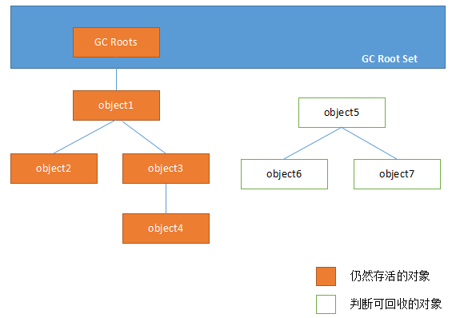
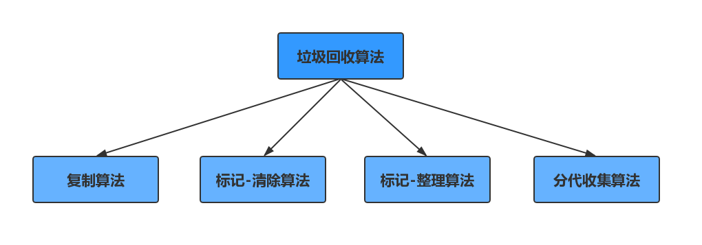
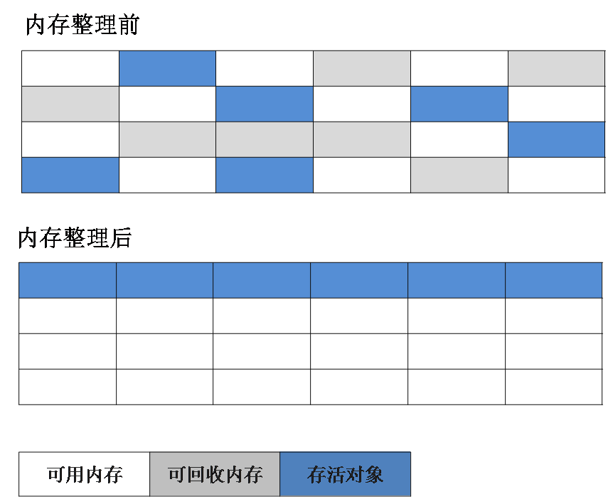
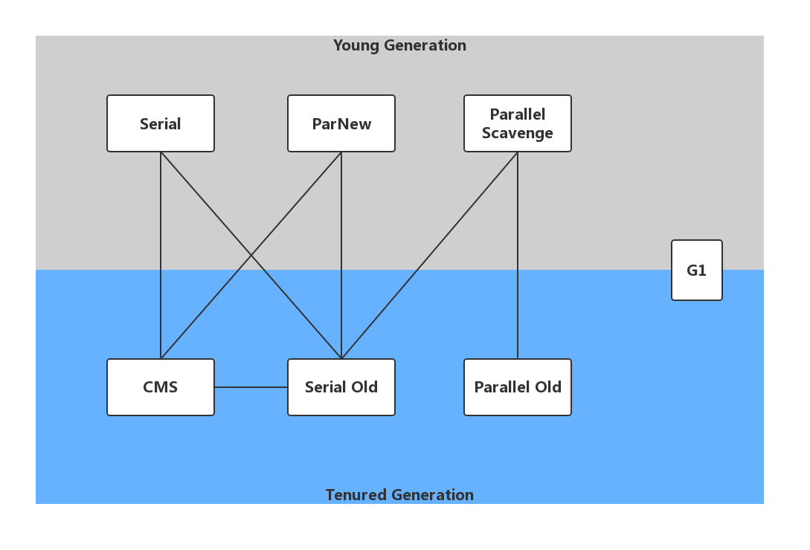

# GC算法和收集器

参考：周志明《深入理解java虚拟机》第二版

## 如何判断对象可以被回收

堆中几乎放着所有的对象实例，对堆垃圾回收前的第一步就是要判断哪些对象已经死亡（即不能再被任何途径使用的对象）

### 小例子

**`Full GC `和 `Young GC` 的区别？**

```
Young GC 比 Full GC更加频繁，一般新的对象比较多，死得最快，所以Eden区的对象比较新，理论上Eden区回收速度比Old代快10倍
```

````java
/**
 * 测试GC回收
   加入了参数：-XX:+PrintGCDetails 执行
 */
public class GCTest {
    public static void main(String[] args) {
        byte[] allocation1, allocation2, allocation3;
        allocation1 = new byte[28000 * 1024];// 不到28兆
        // allocation2 = new byte[28000 * 1024];
        // allocation3 = new byte[10000 * 1024];
    }
}
````

```java
Heap
 PSYoungGen      total 76288K, used 34554K [0x000000076b300000, 0x0000000770800000, 0x00000007c0000000)
  eden space 65536K, 52% used [0x000000076b300000,0x000000076d4beb38,0x000000076f300000)
  from space 10752K, 0% used [0x000000076fd80000,0x000000076fd80000,0x0000000770800000)
  to   space 10752K, 0% used [0x000000076f300000,0x000000076f300000,0x000000076fd80000)
 ParOldGen       total 175104K, used 0K [0x00000006c1800000, 0x00000006cc300000, 0x000000076b300000)
  object space 175104K, 0% used [0x00000006c1800000,0x00000006c1800000,0x00000006cc300000)
 Metaspace       used 3497K, capacity 4498K, committed 4864K, reserved 1056768K
  class space    used 387K, capacity 390K, committed 512K, reserved 1048576K
```

**如果一次性把eden区加入内容超过了100%会怎么样？**

```java
allocation1 = new byte[28000 * 1024];// 不到28兆
allocation2 = new byte[28000 * 1024];
allocation3 = new byte[10000 * 1024];
```

````java
Heap
 PSYoungGen      total 76288K, used 11463K [0x000000076b300000, 0x0000000774800000, 0x00000007c0000000)
  eden space 65536K, 16% used [0x000000076b300000,0x000000076bd67ef8,0x000000076f300000)
  from space 10752K, 7% used [0x000000076f300000,0x000000076f3ca020,0x000000076fd80000)
  to   space 10752K, 0% used [0x0000000773d80000,0x0000000773d80000,0x0000000774800000)
 // ----------------                             
 ParOldGen       total 175104K, used 56008K [0x00000006c1800000, 0x00000006cc300000, 0x000000076b300000)
  object space 175104K, 31% used [0x00000006c1800000,0x00000006c4eb2020,0x00000006cc300000)
 Metaspace       used 3498K, capacity 4498K, committed 4864K, reserved 1056768K
  class space    used 387K, capacity 390K, committed 512K, reserved 1048576K
````

可见，发生了GC，但是对象被转移到了老年代里面，这是为什么呢？

GC回收的时候，如果对象超过了from区，比较大的对象会被放进老年代.这是因为咱们这儿有`分配担保机制`，新生代的对象提前转移到老年代里面去，`因为老年代的空间是比较大，足以让其存活`，还有一个是长期存活的对象[在from区和to区来回转移]也会被分配到老年代里面。

### 引用计数法

给对象添加一个引用计数器，每当有一个地方引用，计数器就加1。当引用失效，计数器就减1。任何时候计数器为0的对象就是不可能再被使用的。

这个方法实现简单，效率高，但是目前主流的虚拟机中没有选择这个算法来管理内存，最主要的原因是它很难解决对象之前相互循环引用的问题。所谓对象之间的相互引用问题，通过下面代码所示：除了对象a和b相互引用着对方之外，这两个对象之间再无任何引用。但是它们因为互相引用对方，导致它们的引用计数器都不为0，于是引用计数器法无法通知GC回收器回收它们。

````java
public class CountGC {
    Object instance = null;
	/**
		可以看出就算a = null。 b = null，但是它们里面还有对互相的引用，
		所以它们相互还有一个计数的1，所以不会被回收，所以这个方法不好，也可能发生内存泄漏
	**/
    public static void main(String[] args) {
        CountGC a = new CountGC();
        CountGC b = new CountGC();
        a.instance = b;
        b.instance = a;
        a = null;
        b = null;
    }
}
````


### 可达性分析算法

这个算法的基本思想就是通过一系列的称为”GC Roots“的对象作为起点，从这些节点开始向下搜索，节点所走过的路径称为引用链，当一个对象到GC Roots没有任何引用链相连的话，则证明此对象时不可用的。

GC Roots根节点：类加载器、Thread、虚拟机栈的本地变量表、static成员、常量引用、本地方法栈的变量等等



### 两次标记

一个对象从被判定为死亡对象到被垃圾收集器回收掉还要经历两次标记的过程，该过程可以认为是该对象在死刑的缓刑阶段。

+ 第一次标记

  ​		当可达性分析确认该对象没有引用链与GC Roots相连，则对其进行第一次标记和筛选，筛选的条件是重写了finalize()方法并没有执行过，对于重写了且并没有执行finalize()方法的对象这将其放置在一个F-Queue队列中，并在稍后由一个由虚拟机自动建立的低优先级的Finalizer线程去执行它。此处执行只保证执行该方法，但是不保证等待该方法执行结束，之所以这样子设计是为了系统的稳定性和健壮性考虑，以免该方法执行时间较长或者死循环导致系统崩溃。在此之后，系统会对对象进行第二次标记。

+ 第二次标记

  ​	如果在第一次标记之后的对象在执行finalize()方法时没有被引用到一个新的变量，这该对象将被回收掉。finalize方法只能被执行一次，并且一般不推荐也不建议重写Object的该方法，如果需要关闭外部资源，比如数据库，I/O等完全可在finally块中完成。

````
所以如果一个没有引用的对象想要避免被GC回收可以重写finalize()方法在里面被一个其他对象引用，逃过这一劫。
````

### 四种引用

+ 强引用

  这个对象是不会被GC进行回收，也就是这个对象是必不可少的

+ 软引用

  这个对象是可有可无，需要的时候会被GC回收

+ 弱引用

  比软引用有更短的生命周期，只要发现了就会被回收

+ 虚引用

  形同虚设，就跟没有引用一样，任何情况就会被回收

### 如何判断一个常量是废弃常量

运行时常量池主要回收的是废弃的常量。那么，我们怎么判断一个常量时废弃常量呢？

假如在常量池中存在字符串"abc"，如果当前没有任何String对象引用该字符串常量的话，就说明常量”abc“就是废弃常量，如果这时发生内存回收的话而且有必要的话，”abc“会被系统清理出常量池。

### 如何判断一个类是无用的类

需要满足以下三个条件：

- 该类所有的实例都已经被回收，也就是 Java 堆中不存在该类的任何实例。
- 加载该类的 ClassLoader 已经被回收。
- 该类对应的 java.lang.Class 对象没有在任何地方被引用，无法在任何地方通过反射访问该类的方法。

虚拟机可以对满足上述3个条件的无用类进行回收，这里仅仅是”可以“，而并不是和对象一样不适用了就必然会被回收。

## 垃圾回收算法



### 标记-清除算法

它是最基础的收集算法，这个算法分为两个阶段，“标记”和”清除“。首先标记出所有需要回收的对象，在标记完成后统一回收所有被标记的对象。它有两个不足的地方：

1. 效率问题，标记和清除两个过程的效率都不高；
2. 空间问题，标记清除后会产生大量不连续的碎片，如果要存储大对象就会必须进行GC回收，把这些东西清理掉；


### 复制算法

为了解决效率问题，复制算法出现了。它可以把内存分为大小相同的两块，每次只使用其中的一块。当这一块的内存使用完后，就将还存活的对象复制到另一块区，然后再把使用的空间一次清理掉。这样就使每次的内存回收都是对内存区间的一半进行回收


缺点：浪费一半空间，特别是在老年代里面。

**复制算法比较适用于新生代**。

### 标记-整理算法

根据**老年代**的特点提出的一种标记算法，标记过程和“标记-清除”算法一样，但是后续步骤不是直接对可回收对象进行回收，而是让所有存活的对象向一段移动，然后直接清理掉边界以外的内存

**先移动再清理**



### 分代收集算法

现在的商用虚拟机的垃圾收集器基本都采用"分代收集"算法，这种算法就是根据对象存活周期的不同将内存分为几块。一般将java堆分为新生代和老年代，这样我们就可以根据各个年代的特点选择合适的垃圾收集算法。

在新生代中，每次收集都有大量对象死去，所以可以选择复制算法，只要付出少量对象的复制成本就可以完成每次垃圾收集。而老年代的对象存活几率时比较高的，而且没有额外的空间对它进行分配担保，就必须选择“标记-清除”或者“标记-整理”算法进行垃圾收集

## 垃圾收集器

java虚拟机规范对垃圾收集器应该如何实现没有任何规定，因为没有所谓最好的垃圾收集器出现，更不会有万金油垃圾收集器，只能是根据具体的应用场景选择合适的垃圾收集器。



### Serial收集器

Serial（串行）收集器收集器是最基本、历史最悠久的垃圾收集器了。大家看名字就知道这个收集器是一个单线程收集器了。它的 “单线程” 的意义不仅仅意味着它只会使用一条垃圾收集线程去完成垃圾收集工作，更重要的是它在进行垃圾收集工作的时候必须暂停其他所有的工作线程（ “Stop The World” ），直到它收集结束。

新生代采用复制算法，老年代采用标记-整理算法。


虚拟机的设计者们当然知道Stop The World带来的不良用户体验，所以在后续的垃圾收集器设计中停顿时间在不断缩短（仍然还有停顿，寻找最优秀的垃圾收集器的过程仍然在继续）。

但是Serial收集器有没有优于其他垃圾收集器的地方呢？当然有，它**简单而高效（与其他收集器的单线程相比）**。Serial收集器由于没有线程交互的开销，自然可以获得很高的单线程收集效率。Serial收集器

对于运行在Client模式下的虚拟机来说是个不错的选择。

### ParNew收集器

ParNew收集器其实就是Serial收集器的多线程版本，除了使用多线程进行垃圾收集外，其余行为（控制参数、收集算法、回收策略等等）和Serial收集器完全一样。

新生代采用复制算法，老年代采用标记-整理算法。 


它是许多运行在Server模式下的虚拟机的首要选择，除了Serial收集器外，只有它能与CMS收集器（真正意义上的并发收集器，后面会介绍到）配合工作。

### Parallel Scavenge收集器

Parallel Scavenge 收集器类似于ParNew 收集器。

Parallel Scavenge收集器关注点是吞吐量（高效率的利用CPU）。CMS等垃圾收集器的关注点更多的是用户线程的停顿时间（提高用户体验）。所谓吞吐量就是CPU中用于运行用户代码的时间与CPU总消耗时间的比值。 Parallel Scavenge收集器提供了很多参数供用户找到最合适的停顿时间或最大吞吐量，如果对于收集器运作不太了解的话，手工优化存在的话可以选择把内存管理优化交给虚拟机去完成也是一个不错的选择。

新生代采用复制算法，老年代采用标记-整理算法。 


### Serial Old收集器

Serial收集器的老年代版本，它同样是一个单线程收集器。它主要有两大用途：一种用途是在JDK1.5以及以前的版本中与Parallel Scavenge收集器搭配使用，另一种用途是作为CMS收集器的后备方案。

### Parallel Old收集器

Parallel Scavenge收集器的老年代版本。使用多线程和“标记-整理”算法。在注重吞吐量以及CPU资源的场合，都可以优先考虑 Parallel Scavenge收集器和Parallel Old收集器。

### CMS收集器

并行和并发概念补充：

- 并行（Parallel） ：指多条垃圾收集线程并行工作，但此时用户线程仍然处于等待状态。
- 并发（Concurrent）：指用户线程与垃圾收集线程同时执行（但不一定是并行，可能会交替执行），用户程序在继续运行，而垃圾收集器运行在另一个CPU上。

CMS（Concurrent Mark Sweep）收集器是一种以获取最短回收停顿时间为目标的收集器。它而非常符合在注重用户体验的应用上使用。

CMS（Concurrent Mark Sweep）收集器是HotSpot虚拟机第一款真正意义上的并发收集器，它第一次实现了让垃圾收集线程与用户线程（基本上）同时工作。

从名字中的Mark Sweep这两个词可以看出，CMS收集器是一种 “标记-清除”算法实现的，它的运作过程相比于前面几种垃圾收集器来说更加复杂一些。整个过程分为四个步骤：

- 初始标记（CMS initial mark）： 暂停所有的其他线程，并记录下直接与root相连的对象，速度很快
- 并发标记（CMS concurrent mark）： 同时开启GC和用户线程，用一个闭包结构去记录可达对象。但在这个阶段结束，这个闭包结构并不能保证包含当前所有的可达对象。因为用户线程可能会不断的更新引用域，所以GC线程无法保证可达性分析的实时性。所以这个算法里会跟踪记录这些发生引用更新的地方。
- 重新标记（CMS remark）： 重新标记阶段就是为了修正并发标记期间因为用户程序继续运行而导致标记产生变动的那一部分对象的标记记录，这个阶段的停顿时间一般会比初始标记阶段的时间稍长，远远比并发标记阶段时间短
- 并发清除（CMS concurrent sweep）： 开启用户线程，同时GC线程开始对为标记的区域做清扫。


CMS主要优点：并发收集、低停顿。但是它有下面三个明显的缺点：

- 对CPU资源敏感；
- 无法处理浮动垃圾；
- 它使用的回收算法-“标记-清除”算法会导致收集结束时会有大量空间碎片产生，很容易再次发生GC。

### G1收集器

G1 (Garbage-First)是一款面向服务器的垃圾收集器,主要针对配备多颗处理器及大容量内存的机器. 以极高概率满足GC停顿时间要求的同时,还具备高吞吐量性能特征.


被视为JDK1.7中HotSpot虚拟机的一个重要进化特征。它具备一下特点：

- 并行与并发：G1能充分利用CPU、多核环境下的硬件优势，使用多个CPU（CPU或者CPU核心）来缩短Stop-The-World停顿时间。部分其他收集器原本需要停顿Java线程执行的GC动作，G1收集器仍然可以通过并发的方式让java程序继续执行
- 分代收集：虽然G1可以不需要其他收集器配合就能独立管理整个GC堆，但是还是保留了分代的概念。
  空间整合：与CMS的“标记–清理”算法不同，G1从整体来看是基于“标记整理”算法实现的收集器；从局部上来看是基于“复制”算法实现的
- 可预测的停顿：这是G1相对于CMS的另一个大优势，降低停顿时间是G1 和 CMS 共同的关注点，但G1 除了追求低停顿外，还能建立可预测的停顿时间模型，能让使用者明确指定在一个长度为M毫秒的时间片段内

G1收集器的运作大致分为以下几个步骤：

- 初始标记
- 并发标记
- 最终标记
- 筛选回收

G1收集器在后台维护了一个优先列表，每次根据允许的收集时间，优先选择回收价值最大的Region(这也就是它的名字Garbage-First的由来)。这种使用Region划分内存空间以及有优先级的区域回收方式，保证了GF收集器在有限时间内可以尽可能高的收集效率（把内存化整为零）。

### 怎么选择垃圾收集器？

1. 优先调整堆的大小让服务器自己来选择
2. 如果内存小于100m，使用串行收集器
3. 如果是单核，并且没有停顿时间的要求，串行或JVM自己选择
4. 如果允许停顿时间超过1秒，选择并行或者JVM自己选
5. 如果响应时间最重要，并且不能超过1秒，使用并发收集器

官方推荐G1，性能高。