Mysql架构图

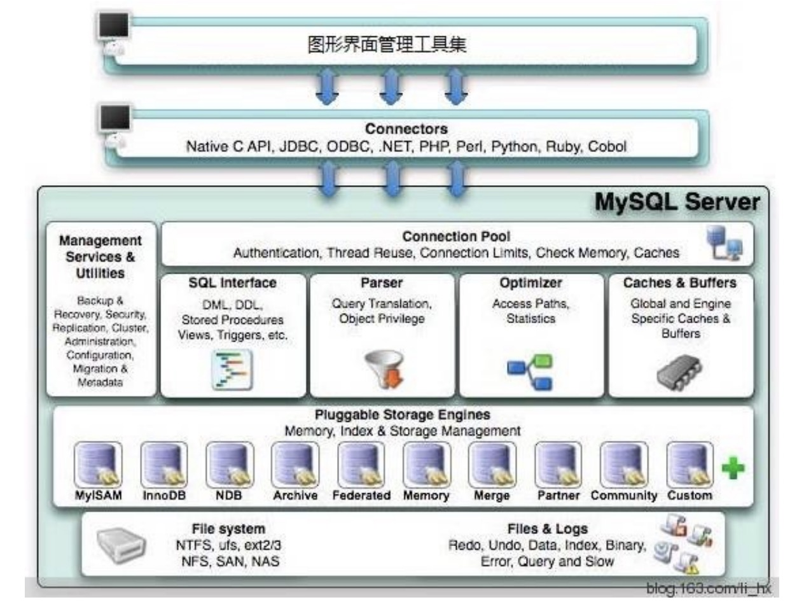

基于存储引擎之上的是处理数据包括sql解析，包括sql优化，包括缓存，包括连接池等等，比如从存储引擎中拿出数据然后进行计算上面的，而**存储引擎只负责对表中的数据的进行读取和写入**，常用的存储引擎有InnoDB、MyISAM、Memory等，不同的存储引擎有自己的特性，数据在不同存储引擎中存放的格式也是不同的，比如Memory都不用磁盘来存储数据。

在InnoDB中，数据会存储到磁盘上，在真正处理数据时需要先将数据加载到内存，表中读取某些记录时， InnoDB存储引擎不需要一条一条的把记录从磁盘上读出来，InnoDB采取的方式是：将数据划分为若干个页，以页作为磁盘和内存之间交互的基本单位，这点类似于操作系统的局部性原理，InnoDB中页的大小一般为 16 KB，也就是说，当需要从磁盘中读数据时 每一次最少将从磁盘中读取16KB的内容到内存中，每一次最少也会把内存中的16KB内容写到磁盘中。

## 准备工作

先创建一张存储引擎是InnoDB的表，放一些简单的数据

````sql
create database InnoDB default charset utf8;
````

````sql
use  InnoDB;
````

````sql
create table t1 (
  a int primary key,
  b int,
  c int,
  d int,
  e varchar(20)
) engine = InnoDB;
````

````sql
insert into t1 value(4, 3, 1, 1, 'd');
insert into t1 value(1, 1, 1, 1, 'a');
insert into t1 value(8, 8, 8, 8, 'h');
insert into t1 value(2, 2, 2, 2, 'b');
insert into t1 value(5, 2, 3, 5, 'e');
insert into t1 value(3, 3, 2, 2, 'c');
insert into t1 value(7, 4, 5, 5, 'g');
insert into t1 value(6, 6, 4, 4, 'f');
````

````sql
select * from t1;
````

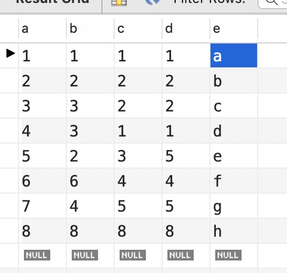

可以看到主键a的数据自己排序了，这是InnoDB的机制，它在插入数据的时候进行排序，一行记录有指针指向下一行记录，同时它还会帮你创建一个主键索引，如果表没有主键，它会帮你创建隐藏列主键。

## InnoDB数据页结构

页是InnoDB管理存储空间的基本单位，一个页的大小默认是16KB。

````sql
SHOW GLOBAL STATUS like 'Innodb_page_size';
````

| Variable_name      | Value   |
| ------------------ | ------- |
| `Innodb_page_size` | `16384` |

存放记录的页结构为数据页。

数据页代表的这块16kb大小的存储空间可以被划分多个部分，不同部分有不同的功能，各个部分如图所示：

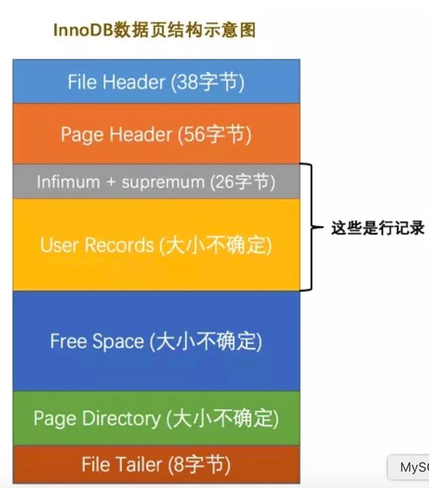

一个InnoDB数据页的存储空间大致被划分成了7个部分，有的部分占用的字节数是确定的，有的部分占用的字节数是不确定的。

| 名称                 | 中文名             | 占用空间大小 | 简单描述                 |
| -------------------- | ------------------ | ------------ | ------------------------ |
| `File Header`        | 文件头部           | `38`字节     | 页的一些通用信息         |
| `Page Header`        | 页面头部           | `56`字节     | 数据页专有的一些信息     |
| `Infimum + Supremum` | 最小记录和最大记录 | `26`字节     | 两个虚拟的行记录         |
| `User Records`       | 用户记录           | 不确定       | 实际存储的行记录内容     |
| `Free Space`         | 空闲空间           | 不确定       | 页中尚未使用的空间       |
| `Page Directory`     | 页面目录           | 不确定       | 页中的某些记录的相对位置 |
| `File Trailer`       | 文件尾部           | `8`字节      | 校验页是否完整           |

## InnoDB行格式

一行记录可以以不同的格式存在InnoDB中，行格式分别是Compact、Redundant、Dynamic和Compressed行格 式。 我们可以在创建或修改表的语句中指定行格式：

`````sql
CREATE TABLE 表名(列的信息) ROW_FORMAT = 行格式名称;
ALTER TABLE 表名  ROW_FORMAT = 行格式名称;
`````

##   COMPACT行格式

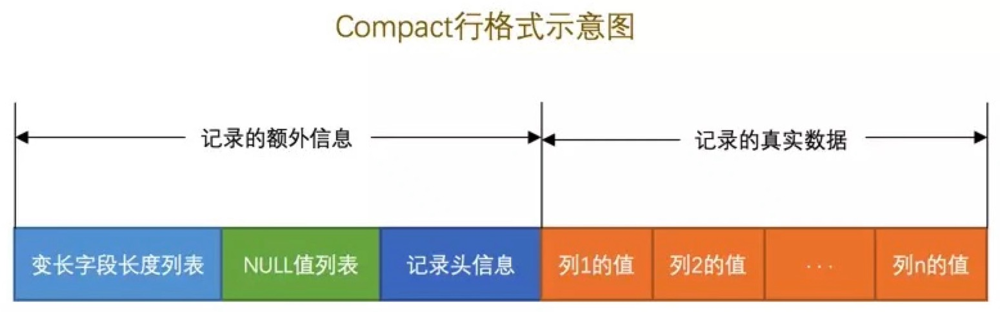

### 记录的额外信息

这部分信息是服务器为了描述这条记录而不得不额外添加的一些信息，这些额外信息分为3类，分别是变长字段长度列表、NULL值列表、记录头信息。

### 变长字段长度列表

MySQL支持一些变长的数据类型，比如VARCHAR(M)、VARBINARY(M)、TEXT类型，BLOB类型，这些数据类型 修饰列称为变长字段，变长字段中存储多少字节的数据不是固定的，所以我们在存储真实数据的时候需要顺便把 这些数据占用的字节数也存起来。在Compact行格式中，把所有变长字段的真实数据占用的字节长度都存放在记 录的开头部位，从而形成一个变长字段长度列表。

`varchar(20)`最长20个字符，一个字符在utf-8是1-4个字节，拉丁是一个字符一个字节。( MySQL5.0.3以前是字节，以后就是字符)。

### NULL值列表

Compact行格式会把可以为NULL的列统一管理起来，存一个标记为在NULL值列表中，如果表中没有允许存储 NULL的列，则NULL值列表也不存在了，将每个允许存储NULL的列对应一个二进制位：

+ 二进制位的值为1时，代表该列的值为NULL。
+ 二进制位的值为0时，代表该列的值不为NULL。

### 记录头信息

除了变长字段长度列表、NULL值列表之外，还有一个用于描述记录的记录头信息，它是由固定的5个字节组成。 5个字节也就是40个二进制位，不同的位代表不同的意思，如图：

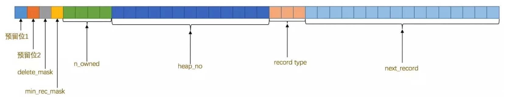

| 名称           | 大小（单 位：bit） | 描述                                                         |
| -------------- | ------------------ | ------------------------------------------------------------ |
| 预留位1        | 1                  | 没有使用                                                     |
| 预留位2        | 1                  | 没有使用                                                     |
| `delete_mask`  | 1                  | 标记该记录是否被删除                                         |
| `min_rec_mask` | 1                  | B+树的每层非叶子节点中的最小记录都会添加该标记               |
| `n_owned`      | 4                  | 表示当前记录拥有的记录数                                     |
| `heap_no`      | 13                 | 表示当前记录在记录堆的位置信息                               |
| `record_type`  | 3                  | 表示当前记录的类型，0表示普通记录，1表示B+树非叶子节点 记录，2表示最小记录，3表示最大记录 |
| `next_record`  | 16                 | 表示下一条记录的相对位置                                     |

### 记录的真实数据

记录的真实数据除了我们自己定义的列的数据以外，还会有三个隐藏列：

| 列名             | 是否必须 | 占用空间 | 描述                   |
| ---------------- | -------- | -------- | ---------------------- |
| `row_id`         | 否       | `6`字节  | 行ID，唯一标识一条记录 |
| `transaction_id` | 是       | `6`字节  | 事务ID                 |
| `roll_pointer`   | 是       | `7`字节  | 回滚指针               |

实际上这几个列的真正名称其实是：DB_ROW_ID、DB_TRX_ID、DB_ROLL_PTR。

一个表没有手动定义主键，则会选取一个Unique键作为主键，如果连Unique键都没有定义的话，则会为表默认添加一个名为row_id的隐藏列作为主键。所以row_id是在没有自定义主键以及Unique键的情况下才会存在的。所以我们从上表中可以看出：InnoDB存储引擎会为每条记录都添加一个transaction_id和roll_pointer这两个列，但是row_id是可选的（在没有自定义主键以及Unique键的情况下才会创建该列）。这些隐藏列的值不用我们操心，InnoDB存储引擎会自己帮我们生成。

### 行溢出数据

VARCHAR(M)类型的列最多可以占用65535个字节。其中的M代表该类型最多存储的字符数量，如果我们使用 ascii字符集的话，一个字符就代表一个字节，我们看看VARCHAR(65535)是否可用：

````sql
mysql> CREATE TABLE varchar_size_demo(
 -> c VARCHAR(65535)
 -> ) CHARSET=ascii ROW_FORMAT=Compact;
ERROR 1118 (42000): Row size too large. The maximum row size for the used table type,
not counting BLOBs, is 65535. This includes storage overhead, check the manual. You
have to change some columns to TEXT or BLOBs
mysql>
````

报错信息表达的意思是：MySQL对一条记录占用的最大存储空间是有限制的，除BLOB或者TEXT类型的列之外， 其他所有的列（不包括隐藏列和记录头信息）占用的字节长度加起来不能超过65535个字节。这个65535个字节 除了列本身的数据之外，还包括一些其他的数据，比如说我们为了存储一个VARCHAR(M)类型的列，其实需要占 用3部分存储空间：

+ 真实数据
+ 变长字段真实数据的长度
+ NULL值标识

如果该VARCHAR类型的列没有NOT NULL属性，那最多只能存储65532个字节的数据，因为变长字段的长度占用 2个字节，NULL值标识需要占用1个字节。

````sql
mysql> CREATE TABLE varchar_size_demo(
 -> c VARCHAR(65532)
 -> ) CHARSET=ascii ROW_FORMAT=Compact;
Query OK, 0 rows affected (0.02 sec)
````

```sql
CREATE TABLE varchar_size_demo(
 c VARCHAR(65533) not null
) CHARSET=ascii ROW_FORMAT=Compact;
Query OK, 0 rows affected (0.02 sec)
```

### 记录中的数据太多产生的溢出

一个页的大小一般是16KB，也就是16384字节，而一个VARCHAR(M)类型的列就最多可以存储65533个字节，这 样就可能出现一个页存放不了一条记录。 

在Compact和Reduntant行格式中，对于占用存储空间非常大的列，在记录的真实数据处只会存储该列的一部分 数据，把剩余的数据分散存储在几个其他的页中，然后记录的真实数据处用20个字节存储指向这些页的地址（当 然这20个字节中还包括这些分散在其他页面中的数据的占用的字节数），从而可以找到剩余数据所在的页。

###  Dynamic和Compressed行格式

这两种行格式类似于COMPACT行格式，只不过在处理行溢出数据时有点儿分歧，它们不会在记录的真实数据处 存储一部分数据，而是把所有的数据都存储到其他页面中，只在记录的真实数据处存储其他页面的地址。另外， Compressed行格式会采用压缩算法对页面进行压缩。

## 索引

1. 我们创建另一张表，引擎是MyISAM

   ```sql
   create table t2 (
     a int primary key,
     b int,
     c int,
     d int,
     e varchar(20)
   ) engine = MyISAM;
   
   ```

   ````sql
   insert into t2 value(4, 3, 1, 1, 'd');
   insert into t2 value(1, 1, 1, 1, 'a');
   insert into t2 value(8, 8, 8, 8, 'h');
   insert into t2 value(2, 2, 2, 2, 'b');
   insert into t2 value(5, 2, 3, 5, 'e');
   insert into t2 value(3, 3, 2, 2, 'c');
   insert into t2 value(7, 4, 5, 5, 'g');
   insert into t2 value(6, 6, 4, 4, 'f');
   ````

   ```sql
   select * from t2;
   ```

   查询的结果的顺序和InnoDB的不一样，数据的顺序是按照插入的数据排列的。

2. 上面准备工作里面看到，InnoDB引擎插入的时候会将我们的数据按照主键排序，如下图：

   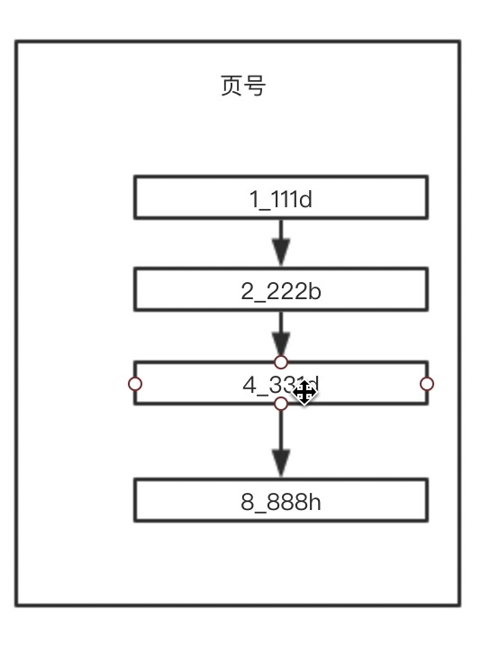

   可以看到，数据在插入的时候会进行排序，然后，一行记录还有指针指向下一条记录（`next_record`，在行行格式里面的记录的额外信息），类似单链表。虽然这样插入很耗性能，但是这样做会方便我们查询。

3. InnoDB这样插入数据为什么能提高查询效率？

   在InnoDB数据页结构里面，有一个叫做页目录的东西，这个东西类似于书的目录，第一章或者第二章，所以在我们可以把一页里面的数据进行分组，然后把分组里面的数据的第一条的主键放进页目录里面，那么页目录就像一个有序数组，如下图：

   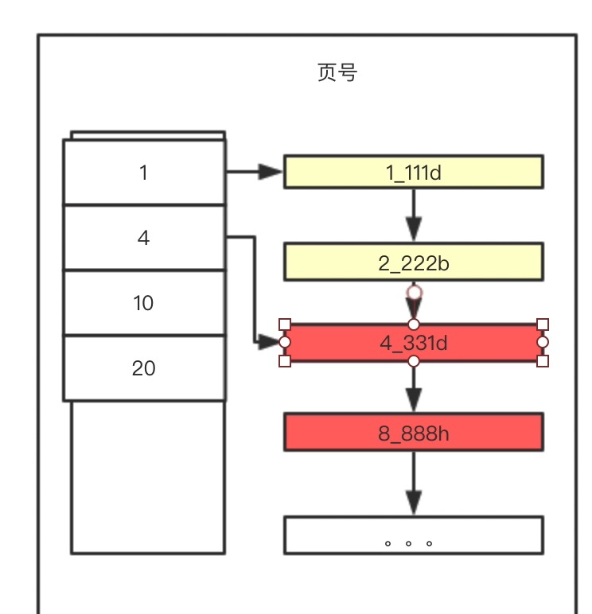

   这样我们查询数据的时候，通过页目录（二分法）可以快速找到对应的数据在哪个组里面，然后再去组里面找。

4. 如果一页的数据存不下该怎么办？

   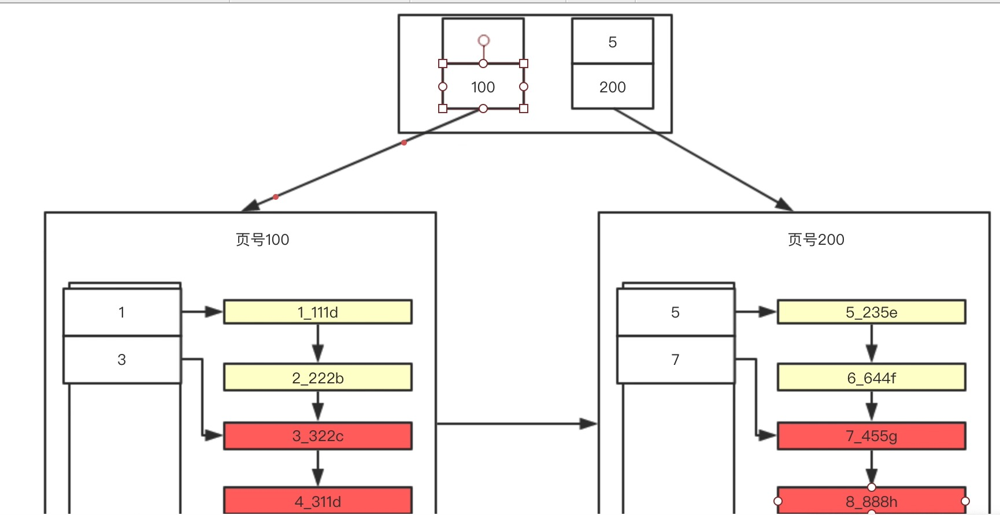

   如上图，不用解释了吧。

5. B+Tree

   从上面的分析，我们可以得出下图的数据结构，这就是B+树

   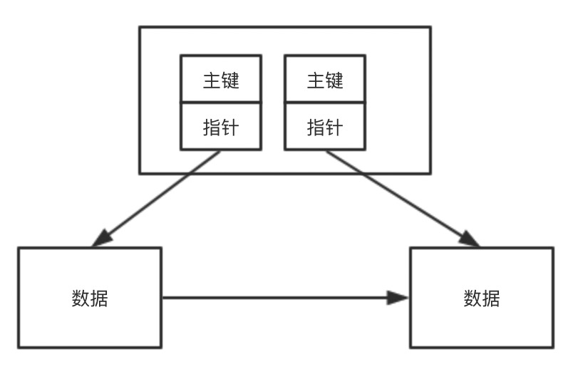

   那么B+树长什么样子呢？

   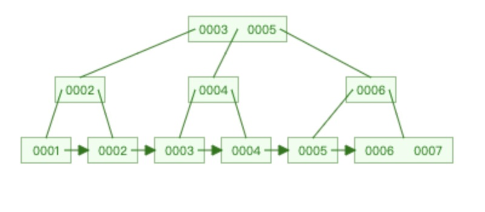

   上面就是B+树的数据结构，对比AVL树可以看看，AVL树是一种完全平衡的树

   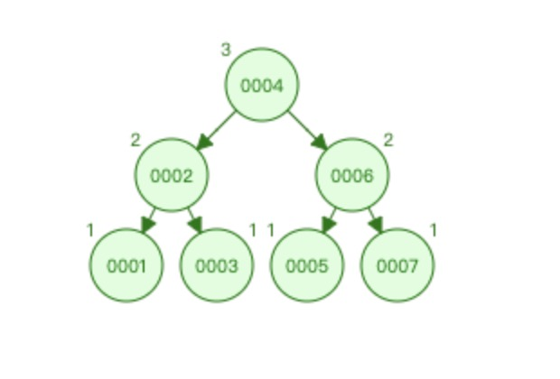

   可以看到AVL树节点就只有一个数据，而B+树可能有好几个，而且B+树的数据会有冗余，关于B+树以后再研究。

6. 为什么使用B+树？

   其实就是提高查询效率，可以理解**B+树的叶子节点存储了所有的数据**，查询数据可以直接使用二分法查找叶子节点就好了，暂时没有研究过B+树，但是据我的认知范围，凡是平衡的二叉树，一般的时间复杂度都是O(logN)，对比线性数据结构很恐怖。

7. 那么InnoDB中是否完全按照上面分析的来处理索引

   其实相差不多，只是在新建页的时候，会将原来的页copy一份，然后再新建一页放入原来放不下的数据，然后再把原来的页当做页目录。

所以要使用B+树来完成索引的创建需要排好序，而InnoDB在插入的时候就帮你按照主键的顺序来排好序了，也就是说帮你创建好了一个主键索引。我们可以看见InnoDB的索引是在一起，这就是**聚簇索引**，即索引和数据是在一起的。

所以在InnoDB我们最好设置主键自增，因为如果不是自增的，在插入数据的时候它帮我们排序的时候，会相当于插入单链表里面，效率比较低，如果刚好超过页数据那么会把之后的数据往后移动，非常消耗性能，如果选择自增，就不会存在这样的问题了。所以主键类型也不要选UUID这样比较大的，选择int或者bigint（8个字节）就好了，mysql里面utf-8是0-4个字节。不同的编码排序的方法也不同。所以在创建字段类型的时候也是有讲究的。可能int类型页的个数只有100页，而uuid类型的主键的页数会有200页，这样树的高度增加，相应的效率也会稍微的低点。

### 聚簇索引

聚簇索引的特点：

1. 按主键值的大小进行记录和页的排序：
   + 数据页(叶子节点)里的记录是按照主键值从小到大排序的一个单向链表。
   + 数据页(叶子节点)之间也是是按照主键值从小到大排序的一个双向链表。
   + B+树中同一个层的页目录也是按照主键值从小到大排序的一个双向链表。
2. B+树的叶子节点存储的是完整的用户记录，就是指这个记录中存储了所有列的值（包括隐藏列）。

具有这两种特性的B+树称为聚簇索引，所有完整的用户记录都存放在这个聚簇索引的叶子节点处。这种聚簇索引 并不需要我们在MySQL语句中显式的使用INDEX语句去创建。InnoDB存储引擎会自动的为我们创建聚簇索引。 在InnoDB存储引擎中，聚簇索引就是数据的存储方式（所有的用户记录都存储在了叶子节点），也就是所谓的索引即数据，数据即索引。

###二级索引（复制索引）

聚簇索引只能在搜索条件是主键值时才能发挥作用，因为B+树中的数据都是按照主键进行排序的。当我们想以别 的列作为搜索条件时我们可以多建几棵B+树，不同的B+树中的数据采用不同的排序规则。

二级索引与聚簇索引有几处不同：

1. 按指定的索引列的值来进行排序
2. 叶子节点存储的不是完整的用户记录，而只是索引列+主键。
3. 目录项记录中不是主键+页号，变成了索引列+页号。
4. 在对二级索引进行查找数据时，需要根据主键值去聚簇索引中再查找一遍完整的用户记录，这个过程叫做**回表**

### 联合索引

以多个列的大小为排序规则建立的B+树称为联合索引，本质上也是一个二级索引。

### 目录项记录的唯一性

我们需要保证在B+树的同一层内节点的目录项记录除页号这个字段以外是唯一的。所以对于二级索引的内节点的 目录项记录的内容实际上是由三个部分构成的：

+ 索引列的值
+ 主键值
+ 页号

### B+树索引总结

1. 每个索引都对应一棵B+树。用户记录都存储在B+树的叶子节点，所有目录记录都存储在非叶子节点。
2. InnoDB存储引擎会自动为主键（如果没有它会自动帮我们添加）建立聚簇索引，聚簇索引的叶子节点包含完整的用户记录。
3. 可以为指定的列建立二级索引，二级索引的叶子节点包含的用户记录由索引列 + 主键组成，所以如果想通过二级索引来查找完整的用户记录的话，需要通过回表操作，也就是在通过二级索引找到主键值之后再到聚簇索引中查找完整的用户记录。
4. B+树中每层节点都是按照索引列值从小到大的顺序排序而组成了**双向链表**，而且每个页内的记录（不论是用户记录还是目录项记录）都是按照索引列的值从小到大的顺序而形成了一个单链表。如果是联合索引的话，则页面和记录先按照联合索引前边的列排序，如果该列值相同，再按照联合索引后边的列排序。
5. 通过索引查找记录是从B+树的根节点开始，一层一层向下搜索。由于每个页面都按照索引列的值建立了页目录，所以在这些页面中的查找非常快。

### 使用索引

创建联合索引

````sql
create index idx_t1_bcd on t1(b, c, d);
````

所以索引会是以下样子：

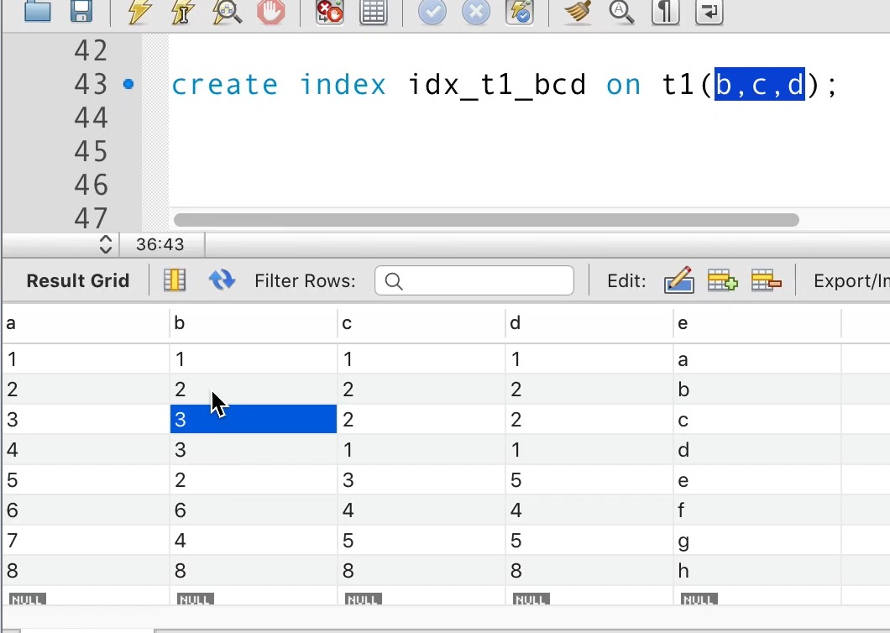

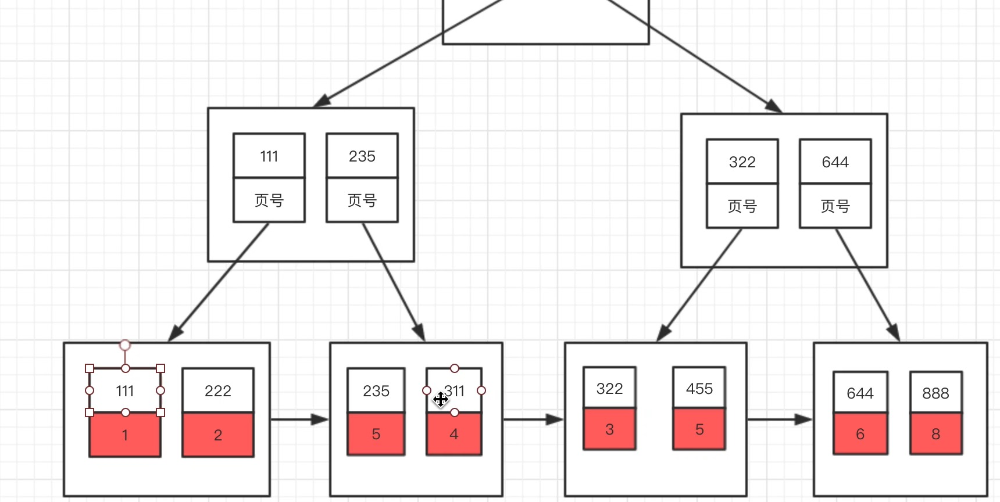

**对于InnoDB创建的联合索引是不会把所有的数据放进去的（上面红色的部分），只是放了主键，然后再通过主键索引获取数据。这叫回表**，

主键索引如上面分析的一样，会将所有的数据都放进去。所以如果像联合索引这样的辅助索引再放入所有的数据，也就是上图红色的部分，就会出现数据的冗余。

## B+树索引实战

### 全值匹配

```sql
select * from t1 where b = 1 and c = 1 and d = 1;
```

查询优化器会分析这些查询条件并且按照可以使用的索引中列的顺序来决定先使用哪个查询条件。

### 匹配左边的列

`````sql
select * from t1 where b = 1;
select * from t1 where b = 1 and c = 1;
`````

下面这个sql是用不到索引的

````sql
select * from t1 where c = 1
````

因为B+树先是按照b列的值排序的，在b列的值相同的情况下才使用c列进行排序，也就是说b列的值不同的记录 中c的值可能是无序的。而现在你跳过b列直接根据c的值去查找，这是做不到的。

### 匹配列前缀

如果只给出后缀或者中间的某个字符串，比如：

````sql
select * from t1 where b like '%101%';
````

这种是用不到索引的，因为字符串中间有'101'的字符串并没有排好序，所以只能全表扫描了。有时候我们有一些 匹配某些字符串后缀的需求，比方说某个表有一个url列，该列中存储了许多url：

````
www.baidu.com
www.qq.com
www.google.com
````

假设已经对该url列创建了索引，如果我们想查询以com为后缀的网址的话可以这样写查询条件：WHERE url LIKE '%com'，但是这样的话无法使用该url列的索引。为了在查询时用到这个索引而不至于全表扫描，我们可以把后 缀查询改写成前缀查询，不过我们就得把表中的数据全部逆序存储一下，也就是说我们可以这样保存url列中的数据：

````
moc.udiab.www
moc.qq.www
moc.elgoog.www
````

这样再查找以com为后缀的网址时搜索条件便可以这么写：WHERE url LIKE 'moc%'，这样就可以用到索引了。

### 匹配范围值

````sql
select * from t1 where b > 1 and b < 20000;
````

由于B+树中的数据页和记录是先按b列排序的，所以我们上边的查询过程其实是这样的：

+ 找到b值为1的记录。
+ 找到b值为20000的记录。
+ 由于所有记录都是由链表连起来的（记录之间用单链表，数据页之间用双链表），所以他们之间的记录都可以很容易的取出来
+ 找到这些记录的主键值，再到聚簇索引中**回表**查找完整的记录。

不过在使用联合进行范围查找的时候需要注意，如果对多个列同时进行范围查找的话，只有对索引最左边的那个列进行范围查找的时候才能用到B+树索引，比如：

````sql
select * from t1 where b > 1 and c > 1;
````

上边这个查询可以分成两个部分：

1. 通过条件b > 1来对b进行范围，查找的结果可能有多条b值不同的记录
2. 对这些b值不同的记录继续通过c > 1继续过滤

这样子对于联合索引来说，只能用到b列的部分，而用不到c列的部分，因为只有b值相同的情况下才能用c列的值进行排序，而这个查询中通过b进行范围查找的记录中可能并不是按照c列进行排序的，所以在搜索条件中继续以c列进行查找时是用不到这个B+树索引的。

还有一种情况：

````sql
select * from t1 where b > 1;
````

使用辅助索引就会存在从辅助索引中查询的成本以及回表的成本，如果在某些条件下，比如`b > 1`匹配的值超过全表的90%，这个时候使用索引需要便利辅助索引90%的数据，然后再加上回表的90%的数据，还不如全表扫描。所以在`select * from t1 where b > 1 and c > 1;`这个sql下，可以将b的条件换成`b > 3`，这样取值范围就比较小，可能就会使用上索引了，但是c还是不能使用索引，不过`b = 1`的时候c就能使用到索引了。

### 精确匹配某一列并范围匹配另外一列

对于同一个联合索引来说，虽然对多个列都进行范围查找时只能用到最左边那个索引列，但是如果左边的列是精确查找，则右边的列可以进行范围查找，比方说这样：

```sql
select * from t1 where b = 1 and c > 1;
```

### 排序

```sql
select * from t1 order by b, c, d;
```

这个查询的结果集需要先按照b值排序，如果记录的b值相同，则需要按照c来排序，如果c的值相同，则需要按照 d排序。因为这个B+树索引本身就是按照上述规则排好序的，所以直接从索引中提取数据，然后进行回表操作取出该索引中不包含的列就好了。

### 分组

````sql
select b, c, d, count(*) from t1 group by b, c, d;
````

这个查询语句相当于做了3次分组操作：

1. 先把记录按照b值进行分组，所有b值相同的记录划分为一组。
2. 将每个b值相同的分组里的记录再按照c的值进行分组，将title值相同的记录放到一个分组里。
3. 再将上一步中产生的分组按照d的值分成更小的分组。

如果没有索引的话，这个分组过程全部需要在内存里实现，而如果有索引的话，正好这个分组顺序又和B+树中的索引列的顺序是一致的，所以可以直接使用B+树索引进行分组。

**分组其实就是先对字段进行排序，然后分组，如果排序能用到索引，那么整体下来就能用到索引。**

### 使用联合索引进行排序或分组的注意事项

对于联合索引有个问题需要注意，ORDER BY的子句后边的列的顺序也必须按照索引列的顺序给出，如果给出 `order by c, b, d`的顺序，那也是用不了B+树索引的。 

同理，`order by b, order by b, c` 这种匹配索引左边的列的形式可以使用部分的B+树索引。当联合索引左边列的值为常量，也可以使用后边的列进行排序，比如这样：

````sql
select * from t1 where b = 1 order by c, d;
````

这个查询能使用联合索引进行排序是因为b列的值相同的记录是按照c, d排序的。

### 不可以使用索引进行排序或分组的几种情况

#### ASC、DESC混用

对于使用联合索引进行排序的场景，我们要求各个排序列的排序顺序是一致的，也就是要么各个列都是ASC规则 排序，要么都是DESC规则排序。

> ORDER BY子句后的列如果不加ASC或者DESC默认是按照ASC排序规则排序的，也就是升序排序的。

````sql
select * from t1 order by b ASC, c DESC;
````

这个查询是用不到索引的。

**还有一点忘说了，对于B+树索引的叶子节点，不仅可以正序也可以逆序查询，相当于分组数据不仅有指向下一条数据的指针，还有指向上一条数据的指针。**

### 如何建立索引

#### 考虑索引选择性

索引的选择性（Selectivity），是指不重复的索引值（也叫基数，Cardinality）与表记录数的比值：

````sql
选择性 = 基数 / 记录数
````

选择性的取值范围为(0, 1]，选择性越高的索引价值越大。如果选择性等于1，就代表这个列的不重复值和表记录数是一样的，那么对这个列建立索引是非常合适的，如果选择性非常小，那么就代表这个列的重复值是很多的， 不适合建立索引。

#### 考虑前缀索引

用列的前缀代替整个列作为索引key，当前缀长度合适时，可以做到既使得前缀索引的选择性接近全列索引，同时因为索引key变短而减少了索引文件的大小和维护开销。

> 使用mysql官网提供的示例数据库：https://dev.mysql.com/doc/employee/en/employees-installation.html github地址：https://github.com/datacharmer/test_db.git

employees表只有一个索引，那么如果我们想按名字搜索一个人，就只能全表扫描了：

```sql
EXPLAIN SELECT * FROM employees.employees WHERE first_name='Eric' AND
last_name='Anido';
```

那么可以对或建立索引，看下两个索引的选择性：

`````sql
SELECT count(DISTINCT(first_name))/count(*) AS Selectivity FROM employees.employees; -
- 0.0042
SELECT count(DISTINCT(concat(first_name, last_name)))/count(*) AS Selectivity FROM
employees.employees; -- 0.9313
`````

显然选择性太低，选择性很好，但是first_name和last_name加起来长度为30，有没有兼顾长度和选择性的办法？ 可以考虑用first_name和last_name的前几个字符建立索引，例如，看看其选择性：

````sql
SELECT count(DISTINCT(concat(first_name, left(last_name, 3))))/count(*) AS Selectivity
FROM employees.employees; -- 0.7879
````

选择性还不错，但离0.9313还是有点距离，那么把last_name前缀加到4：

````sql
SELECT count(DISTINCT(concat(first_name, left(last_name, 4))))/count(*) AS Selectivity
FROM employees.employees; -- 0.9007
````

这时选择性已经很理想了，而这个索引的长度只有18，比短了接近一半，建立前缀索引的方式为：

`````sql
ALTER TABLE employees.employees ADD INDEX `first_name_last_name4` (first_name,
last_name(4));
`````

前缀索引兼顾索引大小和查询速度，但是其缺点是不能用于ORDER BY和GROUP BY操作，也不能用于覆盖索 引。

## 总结

+ 索引列的类型尽量小

  1. 索引列的length比较小
  2. 这样排序就会uuid这种不确定的好
  3. 由于比较大会比较占用行数据多，所以一页一页就会存的数据比较少，使用uuid可能页数会比较多，树的高度比较高，查询效率也比较低。

+ 利用索引字符串值的前缀

+ 主键自增

  可以避免插入数据的时候排序，如果排序需要移动数据到下一页，那么性能消耗很大。

+ 定位并删除表中的重复和冗余索引

  索引不见得越多越好，有时候计算使用对应的索引也需要时间。

+ 尽量使用覆盖索引进行查询，避免回表带来的性能损耗。