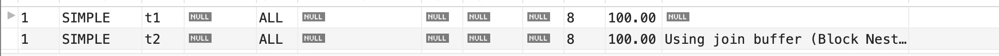

# Mysql查询优化

对于一个SQL语句，查询优化器先看是不是能转换成`JOIN`，再将`JOIN`进行优化。**

优化分为：

1. 条件优化
2. 计算全表扫描成本
3. 找出所有能用到的索引
4. 针对每个索引计算不同的访问方式的成本
5. 选出成本最小的索引以及访问方式

## 开启查询优化器日志

```sql
-- 开启
set optimizer_trace = "enabled=on"; 
-- 执行sql
select * from t1 where a = 1 and b = 1;
-- 查看日志
select * from information_schema.OPTIMIZER_TRACE;
-- 关闭
set optimizer_trace="enabled=off";
```

我们先来看下日志：

````json
select * from t1 where a = 1 and b = 1
LIMIT 0, 1000, {
  "steps": [
    {
      "join_preparation": {
        "select#": 1,
        "steps": [
          {
            "expanded_query": "/* select#1 */ select `t1`.`a` AS `a`,`t1`.`b` AS `b`,`t1`.`c` AS `c`,`t1`.`d` AS `d`,`t1`.`e` AS `e` from `t1` where ((`t1`.`a` = 1) and (`t1`.`b` = 1)) limit 0,1000"
          }
        ]
      }
    },
    {
      // 优化阶段
      "join_optimization": {
        "select#": 1,
        "steps": [
          {
            // 条件优化
            "condition_processing": {
              "condition": "WHERE",
              "original_condition": "((`t1`.`a` = 1) and (`t1`.`b` = 1))",
              "steps": [
                {
                  "transformation": "equality_propagation", // 等值传递
                  "resulting_condition": "(multiple equal(1, `t1`.`a`) and multiple equal(1, `t1`.`b`))"
                },
                {
                  "transformation": "constant_propagation",
                  "resulting_condition": "(multiple equal(1, `t1`.`a`) and multiple equal(1, `t1`.`b`))"
                },
                {
                  "transformation": "trivial_condition_removal",
                  "resulting_condition": "(multiple equal(1, `t1`.`a`) and multiple equal(1, `t1`.`b`))"
                }
              ]
            }
          },
          {
            "substitute_generated_columns": {
            }
          },
          {
            "table_dependencies": [
              {
                "table": "`t1`",
                "row_may_be_null": false,
                "map_bit": 0,
                "depends_on_map_bits": [
                ]
              }
            ]
          },
          {
            "ref_optimizer_key_uses": [
              {
                "table": "`t1`",
                "field": "a",
                "equals": "1",
                "null_rejecting": false
              },
              {
                "table": "`t1`",
                "field": "b",
                "equals": "1",
                "null_rejecting": false
              }
            ]
          },
          {
            "rows_estimation": [
              {
                "table": "`t1`",
                "rows": 1,
                "cost": 1,
                "table_type": "const",
                "empty": false
              }
            ]
          },
          {
            "condition_on_constant_tables": "1",
            "condition_value": true
          },
          {
            "attaching_conditions_to_tables": {
              "original_condition": "1",
              "attached_conditions_computation": [
              ],
              "attached_conditions_summary": [
              ]
            }
          },
          {
            "refine_plan": [
            ]
          }
        ]
      }
    },
    {
      "join_execution": {
        "select#": 1,
        "steps": [
        ]
      }
    }
  ]
}, 0, 0
````

从上面可以看出有一个`join optimization(join优化)`，因为在mysql里面join是一个很重要的概念，无论什么查询都会尽量向join靠拢，在这个sql里面看不出来更多的信息，我们可以去看一下另一个sql

```sql
select * from t1, t2;
```

````json
select * from t1, t2
LIMIT 0, 1000, {
  "steps": [
    {
      "join_preparation": {
        "select#": 1,
        "steps": [
          {
            "expanded_query": "/* select#1 */ select `t1`.`a` AS `a`,`t1`.`b` AS `b`,`t1`.`c` AS `c`,`t1`.`d` AS `d`,`t1`.`e` AS `e`,`t2`.`a` AS `a`,`t2`.`b` AS `b`,`t2`.`c` AS `c`,`t2`.`d` AS `d`,`t2`.`e` AS `e` from `t1` join `t2` limit 0,1000"
          }
        ]
      }
    },
    {
      "join_optimization": {
        "select#": 1,
        "steps": [
          {
            "table_dependencies": [
              {
                "table": "`t1`",
                "row_may_be_null": false,
                "map_bit": 0,
                "depends_on_map_bits": [
                ]
              },
              {
                "table": "`t2`",
                "row_may_be_null": false,
                "map_bit": 1,
                "depends_on_map_bits": [
                ]
              }
            ]
          },
          {
            "rows_estimation": [
              {
                "table": "`t1`",
                "table_scan": {
                  "rows": 8,
                  "cost": 1
                }
              },
              {
                "table": "`t2`",
                "table_scan": {
                  "rows": 8,
                  "cost": 2
                }
              }
            ]
          },
          {
            "considered_execution_plans": [
              {
                "plan_prefix": [
                ],
                "table": "`t1`",
                "best_access_path": {
                  "considered_access_paths": [
                    {
                      "rows_to_scan": 8,
                      "access_type": "scan",
                      "resulting_rows": 8,
                      "cost": 2.6,
                      "chosen": true
                    }
                  ]
                },
                "condition_filtering_pct": 100,
                "rows_for_plan": 8,
                "cost_for_plan": 2.6,
                "rest_of_plan": [
                  {
                    "plan_prefix": [
                      "`t1`"
                    ],
                    "table": "`t2`",
                    "best_access_path": {
                      "considered_access_paths": [
                        {
                          "rows_to_scan": 8,
                          "access_type": "scan",
                          "using_join_cache": true,
                          "buffers_needed": 1,
                          "resulting_rows": 8,
                          "cost": 14.852,
                          "chosen": true
                        }
                      ]
                    },
                    "condition_filtering_pct": 100,
                    "rows_for_plan": 64,
                    "cost_for_plan": 17.452,
                    "chosen": true
                  }
                ]
              },
              {
                "plan_prefix": [
                ],
                "table": "`t2`",
                "best_access_path": {
                  "considered_access_paths": [
                    {
                      "rows_to_scan": 8,
                      "access_type": "scan",
                      "resulting_rows": 8,
                      "cost": 3.6469,
                      "chosen": true
                    }
                  ]
                },
                "condition_filtering_pct": 100,
                "rows_for_plan": 8,
                "cost_for_plan": 3.6469,
                "pruned_by_heuristic": true
              }
            ]
          },
          {
            "attaching_conditions_to_tables": {
              "original_condition": null,
              "attached_conditions_computation": [
              ],
              "attached_conditions_summary": [
                {
                  "table": "`t1`",
                  "attached": null
                },
                {
                  "table": "`t2`",
                  "attached": null
                }
              ]
            }
          },
          {
            "refine_plan": [
              {
                "table": "`t1`"
              },
              {
                "table": "`t2`"
              }
            ]
          }
        ]
      }
    },
    {
      "join_execution": {
        "select#": 1,
        "steps": [
        ]
      }
    }
  ]
}, 0, 0
````

可以看见mysql把这个查询转换成了`select from t1 join t2 limit 0,1000 `，证实了我们结论。

再来看下`explain`

````sql
explain select * from t1, t2; -- 笛卡尔积
````



通过这个结果，可以看出，都是全表扫描，`t1是驱动表，t2是被驱动表`，也就是先从t1中找出数据，然后再去t2表中找出匹配的数据。这个`explain`关键字也能去帮我去选取哪个是驱动表或者被驱动表。

### 常量传递(`constant_propagation`)

```sql
a = 1 AND b > a
```

上面这个sql可以转换为：

````sql
a = 1 AND b > 1
````

### 等值传递(`equality_propagation`)

````sql
a = b and b = c and c = 5
````

上面这个sql可以转换为：

````sql
a = 5 and b = 5 and c = 5
````


### 移除没用条件(`trivial_condition_removal`)

```sql
a = 1 and 1 = 1
```

转换成

```sql
a = 1
```


### 基于成本

一个查询可以有不同的执行方案，可以选择某个索引进行查询，也可以选择全表扫描，查询优化器会选择其中成 本最低的方案去执行查询。

#### I/O成本

InnoDB存储引擎都是将数据和索引都存储到磁盘上的，当我们想查询表中的记录时，需要先把数据或者索引加载 到内存中然后再操作。这个从磁盘到内存这个加载的过程损耗的时间称之为I/O成本。

#### CPU成本

读取以及检测记录是否满足对应的搜索条件、对结果集进行排序等这些操作损耗的时间称之为CPU成本。

> InnoDB存储引擎规定读取一个页面花费的成本默认是1.0，读取以及检测一条记录是否符合搜索条件的成本默 认是0.2。

#### 基于成本的优化步骤

在一条单表查询语句真正执行之前，MySQL的查询优化器会找出执行该语句所有可能使用的方案，对比之后找出 成本最低的方案，这个成本最低的方案就是所谓的执行计划，之后才会调用存储引擎提供的接口真正的执行查 询。

下边我们就以一个实例来分析一下这些步骤，单表查询语句如下：

我们来分析，mysql官方推荐的表`employees.titles`来进行分析，这个表有两个索引`PRIMARY`，`idx_titles_to_date`，`PRIMARY`索引是联合索引`(emp_no, ..... )`

```sql
select * from employees.titles where emp_no > '10101' and emp_no < '20000' and to_date
= '1991-10-10';
```

1. 根据搜索条件，找出所有可能使用的索引

   + `emp_no > '10101'`，这个搜索条件可以使用主键索引PRIMARY。
   + `to_date = '1991-10-10'`，这个搜索条件可以使用二级索引idx_titles_to_date。

   综上所述，上边的查询语句可能用到的索引，也就是possible keys只有PRIMARY和idx_titles_to_date。

2. 计算全表扫描的代价

   对于InnoDB存储引擎来说，全表扫描的意思就是把聚簇索引中的记录都依次和给定的搜索条件做一下比较，把符合搜索条件的记录加入到结果集，所以需要将聚簇索引对应的页面加载到内存中，然后再检测记录是否符合搜索条件。由于查询成本=I/O成本+CPU成本，所以计算全表扫描的代价需要两个信息：

   1. 聚簇索引占用的页面数
   2. 该表中的记录数

   MySQL为每个表维护了一系列的统计信息， SHOW TABLE STATUS 语句来查看表的统计信息。

   ```sql
   SHOW TABLE STATUS LIKE 'titles';
   ```

   **这些统计数据，是innoDB自己异步更新的，如果修改数据超过10%就会触发，我们也可以手动去触发。**

   `Rows`

   表示表中的记录条数。对于使用MyISAM存储引擎的表来说，该值是准确的，对于使用InnoDB存储引擎的表来 说，该值是一个估计值。

   `Data_length`

   表示表占用的存储空间字节数。使用MyISAM存储引擎的表来说，该值就是数据文件的大小，对于使用InnoDB存 储引擎的表来说，该值就相当于聚簇索引占用的存储空间大小，也就是说可以这样计算该值的大小：

   ```
   Data_length = 聚簇索引的页面数量 x 每个页面的大小
   ```

   我们的titles使用默认16KB的页面大小，而上边查询结果显示Data_length的值是`20512768`，所以我们可以反向来 推导出聚簇索引的页面数量：

   `````
   聚簇索引的页面数量 = Data_length ÷ 16 ÷ 1024 = 20512768 ÷ 16 ÷ 1024 = 1252
   `````

   我们现在已经得到了聚簇索引占用的页面数量以及该表记录数的估计值，所以就可以计算全表扫描成本了。但是 MySQL在真实计算成本时会进行一些微调。

   I/O成本：1252 * 1 = 1252。1252指的是聚簇索引占用的页面数，`1.0指的是加载一个页面的成本常数，innoDB规定的`。

   CPU成本：442070 * 0.2=88414。442070指的是统计数据中表的记录数，对于InnoDB存储引擎来说是一个估计值，0.2指的是访问一条记录所需的成本常数。

   总成本：1252+88414 = 89666。

   而这个成本在mysql的优化日志里面也能看到：

   ````
   
   ````

   综上所述，对于titles的全表扫描所需的总成本就是89666

   > 我们前边说过表中的记录其实都存储在聚簇索引对应B+树的叶子节点中，所以只要我们通过根节点获得了最左边的叶子节点，就可以沿着叶子节点组成的双向链表把所有记录都查看一遍。也就是说全表扫描这个过程，其实有的B+树内节点是不需要访问的，但是MySQL在计算全表扫描成本时直接使用聚簇索引占用的页面数作为计算I/O成本的依据，是不区分内节点和叶子节点的。	

   `InnoDB默认是主键索引，所以全表扫描，会去扫描主键索引的数据，也就是B+树的叶子节点的数据，而依据索引去计算成本的话，也是通过B+树去计算，不过是去叶子节点的父节点来获取`

3. 计算`PRIMARY`索引的成本。

   计算PRIMARY需要多少成本的关键问题是：需要预估预估出根据对应的where条件在主键索引B+树中存在多少条符合条件的记录。

   **`范围区间数`**

   当我们从索引中查询记录时，不管是=、in、>、<这些操作都需要从索引中确定一个范围，不论这个范围区间的索引到底占用了多少页面，查询优化器粗暴的认为读取索引的一个范围区间的I/O成本和读取一个页面是相同的。

   本例中使用PRIMARY的范围区间只有一个：(10101, 20000)，所以相当于访问这个范围区间的索引付出的I/O成本就是：

   ````
   1 x 1.0 = 1.0
   ````

   **`预估范围内的记录数`**

   优化器需要计算索引的某个范围区间到底包含多少条记录，对于本例来说就是要计算PRIMARY在(10101, 20000) 这个范围区间中包含多少条数据记录，计算过程是这样的：

   + 步骤1：先根据emp_no > 10101这个条件访问一下PRIMARY对应的B+树索引，找到满足emp_no > 10101这个条件的第一条记录，我们把这条记录称之为区间最左记录。
   + 步骤2：然后再根据emp_no < 20000这个条件继续从PRIMARY对应的B+树索引中找出第一条满足这个条件的记录，我们把这条记录称之为区间最右记录。
   + 步骤3：如果区间最左记录和区间最右记录相隔不太远（只要相隔不大于10个页面即可），那就可以精确统计出满足emp_no > '10101' and emp_no < '20000'条件的记录条数。否则只沿着区间最左记录向右读10个页面，计算平均每个页面中包含多少记录，然后用这个平均值乘以区间最左记录和区间最右记录之间的页面数量就可以了。那么问题又来了，怎么估计区间最左记录和区间最右记录之间有多少个页面呢？计算它们父节点中对应的目录项记录之间隔着几条记录就可以了。

   根据上面的步骤可以算出来PRIMARY索引的记录条数，所以读取记录的CPU成本为：26808*0.2 = 5361.6，其中26808是预估的需要读取的数据记录条数，0.2是读取一条记录成本常数。

   **`PRIMARY的总成本`**

   确定访问的IO成本+过滤数据的CPU成本 = 1 + 5361.6 = 5362.6

   这点也在优化日志里面可以看到：

   ````json
   
   ````

   

4. 计算`idx_titles_to_date`成本

   因为通过二级索引查询需要回表，所以在计算二级索引需要成本时还要加上回表的成本，而回表的成本就相当于 下面这个SQL执行：

   ```sql
   select * from employees.titles where 主键字段 in (主键值1，主键值2，....);
   ```

   所以idx_titles_to_date的成本 = 辅助索引的查询成本 + 回表查询的成本

5. 比较各成本选出最优者

   选出成本最小的索引

#### 基于索引统计数据的成本计算

有时候使用索引执行查询时会有许多单点区间，比如使用IN语句就很容易产生非常多的单点区间，比如下边这个 查询：

````sql
select * from employees.titles where to_date in ('a','b','c','d', ..., 'e');
````

很显然，这个查询可能使用到的索引就是idx_titles_to_date，由于这个索引并不是唯一二级索引，所以并不能确 定一个单点区间对应的二级索引记录的条数有多少，需要我们去计算。计算方式我们上边已经介绍过了，就是先 获取索引对应的B+树的区间最左记录和区间最右记录，然后再计算这两条记录之间有多少记录（记录条数少的时 候可以做到精确计算，多的时候只能估算）。这种通过直接访问索引对应的B+树来计算某个范围区间对应的索引 记录条数的方式称之为`index dive`。

如果只有几个单点区间的话，使用index dive的方式去计算这些单点区间对应的记录数也不是什么问题，可是如果很多呢，比如有20000次，MySQL的查询优化器为了计算这些单点区间对应的索引记录条数，要进行20000次 index dive操作，那么这种情况下是很耗性能的，所以MySQL提供了一个系统变量eq_range_index_dive_limit， 我们看一下这个系统变量的默认值： `SHOW VARIABLES LIKE '%dive%';` 为200。

也就是说如果我们的IN语句中的参数个数小于200个的话，将使用index dive的方式计算各个单点区间对应的记录 条数，如果大于或等于200个的话，可就不能使用index dive了，要使用所谓的索引统计数据来进行估算。像会为 每个表维护一份统计数据一样，MySQL也会为表中的每一个索引维护一份统计数据，查看某个表中索引的统计数 据可以使用 `SHOW INDEX FROM 表名` 的语法。

Cardinality属性表示索引列中不重复值的个数。比如对于一个一万行记录的表来说，某个索引列的Cardinality属 性是10000，那意味着该列中没有重复的值，如果Cardinality属性是1的话，就意味着该列的值全部是重复的。不 过需要注意的是，对于InnoDB存储引擎来说，使用SHOW INDEX语句展示出来的某个索引列的Cardinality属性是 一个估计值，并不是精确的。可以根据这个属性来估算IN语句中的参数所对应的记录数：

+ 使用SHOW TABLE STATUS展示出的Rows值，也就是一个表中有多少条记录。
+ 使用SHOW INDEX语句展示出的Cardinality属性。
+ 根据上面两个值可以算出idx_key1索引对于的key1列平均单个值的重复次数：Rows/Cardinality
+ 所以总共需要回表的记录数就是：IN语句中的参数个数*Rows/Cardinality

## NULL值统计

上面知道在统计列不重复值的时候，会影响到查询优化器。

对于NULL，有三种理解方式：

1. NULL值代表一个未确定的值，每一个NULL值都是独一无二的，在统计列不重复值的时候应该都当作独 立的。
2. NULL值在业务上就是代表没有，所有的NULL值代表的意义是一样的，所以所有的NULL值都一样，在统 计列不重复值的时候应该只算一个。
3. NULL完全没有意义，在统计列不重复值的时候应该忽略NULL。

innodb提供了一个系统变量：

```sql
show global variables like '%innodb_stats_method%';
```

这个变量有三个值：

1. nulls_equal：认为所有NULL值都是相等的。这个值也是innodb_stats_method的默认值。如果某个索引列中NULL值特别多的话，这种统计方式会让优化器认为某个列中平均一个值重复次数特别多，所以倾向于不使用索引进行访问。
2. nulls_unequal：认为所有NULL值都是不相等的。如果某个索引列中NULL值特别多的话，这种统计方式会让优化器认为某个列中平均一个值重复次数特别少，所以倾向于使用索引进行访问。
3. nulls_ignored：直接把NULL值忽略掉。

**最好不在索引列中存放NULL值才是正解**

## 统计数据

InnoDB提供了两种存储统计数据的方式

+ 统计数据存储在磁盘上。
+ 统计数据存储在内存中，当服务器关闭时这些这些统计数据就都被清除掉了。

MySQL给我们提供了系统变量innodb_stats_persistent来控制到底采用哪种方式去存储统计数据。在MySQL 5.6.6之前，innodb_stats_persistent的值默认是OFF，也就是说InnoDB的统计数据默认是存储到内存的，之后的 版本中innodb_stats_persistent的值默认是ON，也就是统计数据默认被存储到磁盘中。

不过InnoDB默认是以表为单位来收集和存储统计数据的，也就是说我们可以把某些表的统计数据（以及该表的索 引统计数据）存储在磁盘上，把另一些表的统计数据存储在内存中。我们可以在创建和修改表的时候通过指定 STATS_PERSISTENT属性来指明该表的统计数据存储方式。

### 基于磁盘的永久性统计数据

当我们选择把某个表以及该表索引的统计数据存放到磁盘上时，实际上是把这些统计数据存储到了两个表里：

+ innodb_table_stats存储了关于表的统计数据，每一条记录对应着一个表的统计数据
+ nnodb_index_stats存储了关于索引的统计数据，每一条记录对应着一个索引的一个统计项的统计数据

### 定期更新统计数据

+ 系统变量innodb_stats_auto_recalc决定着服务器是否自动重新计算统计数据，它的默认值是ON， 也就是该功能默认是开启的。每个表都维护了一个变量，该变量记录着对该表进行增删改的记录条数，如果发生变动的记录数量超过了表大小的10%，并且自动重新计算统计数据的功能是打开的，那么服务器会重新进行一次统计数据的计算，并且更新innodb_table_stats和 innodb_index_stats表。不过自动重新计算统计数据的过程是异步发生的，也就是即使表中变动的 记录数超过了10%，自动重新计算统计数据也不会立即发生，可能会延迟几秒才会进行计算。
+ 如果innodb_stats_auto_recalc系统变量的值为OFF的话，我们也可以手动调用ANALYZE TABLE语 句来重新计算统计数据。 `ANALYZE TABLE single_table;`

## 控制执行计划

### `Index Hints`

+ USE INDEX：限制索引的使用范围，我们在数据表里建立了很多索引，当MySQL对索引进行选择时，这些索引都在考虑的范围内。但有时我们希望MySQL只考虑几个索引，而不是全部的索引， 这就需要用到USE INDEX对查询语句进行设置。
+ IGNORE INDEX ：限制不使用索引的范围
+ FORCE INDEX：我们希望MySQL必须要使用某一个索引(由于 MySQL在查询时只能使用一个索 引，因此只能强迫MySQL使用一个索引)。这就需要使用FORCE INDEX来完成这个功能。

`````sql
SELECT * FROM table1 USE|IGNORE|FORCE INDEX (col1_index,col2_index) WHERE col1=1 AND
col2=2 AND col3=3;
`````

## 关于JOIN的优化

### 内连接

一下三种写法都是内连接：

````sql
mysql> select * from t1 join t2 on t1.a = t2.a;
mysql> select * from t1 inner join t2 on t1.a = t2.a;
mysql> select * from t1 cross join t2 on t1.a = t2.a;
````

### 左连接、右连接

左连接：

````sql
mysql> select * from t1 left join t2 on t1.a = t2.a;
````

右连接：

````sql
mysql> select * from t1 right join t2 on t1.a = t2.a;
````

### 连接的原理

不管是内连接还是左右连接，都需要一个驱动表和一个被驱动表，对于内连接来说，选取哪个表为驱动表都没关系，而外连接的驱动表是固定的，也就是说左连接的驱动表就是左边的那个表，右连接的驱动表就是右边的那个 表。

连接的大致原理是：

1. 选取驱动表，使用与驱动表相关的过滤条件，选取代价最低的访问形式来执行对驱动表的单表查询。
2. 对上一步骤中查询驱动表得到的结果集中每一条记录，都分别到被驱动表中查找匹配的记录。

对应伪代码就是：

````java
for each row in t1 { //遍历满足t1单表查询结果集的每一条记录
 for each row in t2 { //对于某条t1表的记录来说，遍历满足对t2单表查询结果集中的每一条记录
 		// 判断是否符合join条件
 }
}
````

#### 嵌套循环连接

上面的过程就像是一个嵌套的循环，所以这种驱动表只访问一次，但被驱动表却可能被多次访问，访问次数取决于对驱动表执行单表查询后的结果集中的记录条数的连接执行方式称之为嵌套循环连接(Nested-Loop Join),这是最简单，也是最笨拙的一种连接查询算法。

比如对于下面这个sql：

````sql
mysql> select * from t1 join t2 on t1.a = t2.a where t1.b in (1,2);
````

先会执行

````sql
mysql> select * from t1 where t1.b in (1,2);
+---+------+------+------+------+
| a | b | c | d | e |
+---+------+------+------+------+
| 1 | 1 | 1 | 1 | a |
| 2 | 2 | 2 | 2 | b |
| 5 | 2 | 3 | 5 | e |
+---+------+------+------+------+
3 rows in set (0.00 sec)
````

得到三条记录。

然后分别执行：

````sql
mysql> select * from t2 where t2.a = 1;
mysql> select * from t2 where t2.a = 2;
mysql> select * from t2 where t2.a = 5;
````

所以实际上对于上面的步骤，实际上都是针对单表的查询，所以都可以使用索引来帮助查询。

### 基于块的循环嵌套连接

扫描一个表的过程其实是先把这个表从磁盘上加载到内存中，然后从内存中比较匹配条件是否满足。现实生活中 的表可不像t1、t2这种只有几条记录，可能会有成千上万的数据。内存里可能并不能完全存放的下表中所有的记 录，所以在扫描表前边记录的时候后边的记录可能还在磁盘上，等扫描到后边记录的时候可能内存不足，所以需 要把前边的记录从内存中释放掉。我们前边又说过，采用**嵌套循环连接算法**，嵌套循环连接算法的两表连接过程中，被驱动表可是要被访问好多次的，如果这个被驱动表中的数据特别多而且不能使用索引进行访问，那就相当于要从磁盘上读好几次这个表，这个I/O代价就非常大了，所以我们得想办法：尽量减少访问被驱动表的次数**尽量减少访问被驱动表的次数**。

当被驱动表中的数据非常多时，每次访问被驱动表，被驱动表的记录会被加载到内存中，在内存中的每一条记录 只会和驱动表结果集的一条记录做匹配，之后就会被从内存中清除掉。然后再从驱动表结果集中拿出另一条记 录，再一次把被驱动表的记录加载到内存中一遍，周而复始，驱动表结果集中有多少条记录，就得把被驱动表从 磁盘上加载到内存中多少次。所以我们可不可以在把被驱动表的记录加载到内存的时候，一次性和多条驱动表中 的记录做匹配，这样就可以大大减少重复从磁盘上加载被驱动表的代价了。

Mysql中有一个叫做**join buffer**的概念，join buffer就是执行连接查询前申请的一块固定大小的内存，先把若干条 驱动表结果集中的记录装在这个join buffer中，然后开始扫描被驱动表，每一条被驱动表的记录一次性和join buffer中的多条驱动表记录做匹配，因为匹配的过程都是在内存中完成的，所以这样可以显著减少被驱动表的I/O 代价。

最好的情况是join buffer足够大，能容纳驱动表结果集中的所有记录，这样只需要访问一次被驱动表就可以完成 连接操作了。这种加入了join buffer的嵌套循环连接算法称之为基于块的嵌套连接（Block Nested-Loop Join）算 法。

这个join buffer的大小是可以通过启动参数或者系统变量join_buffer_size进行配置，默认大小为262144字节（也 就是256KB），最小可以设置为128字节。当然，对于优化被驱动表的查询来说，最好是为被驱动表加上效率高 的索引，如果实在不能使用索引，并且自己的机器的内存也比较大可以尝试调大join_buffer_size的值来对连接查 询进行优化

另外需要注意的是，驱动表的记录并不是所有列都会被放到join buffer中，只有查询列表中的列和过滤条件中的 列才会被放到join buffer中，所以再次提醒我们，最好不要把*作为查询目标，只需要把我们关心的列放到查询列 表就好了，这样可以在join buffer中放置更多的记录。

### 外连接消除

内连接的驱动表和被驱动表的位置可以相互转换，而左连接和右连接的驱动表和被驱动表是固定的。这就导致内 连接可能通过优化表的连接顺序来降低整体的查询成本，而外连接却无法优化表的连接顺序。

外连接和内连接的本质区别就是：**对于外连接的驱动表的记录来说，如果无法在被驱动表中找到匹配对于外连接的驱动表的记录来说，如果无法在被驱动表中找到匹配ON子子句中的过滤条件的记录，那么该记录仍然会被加入到结果集中，对应的被驱动表记录的各个字段使用NULL值填充；而内连接的驱动表的记录如果无法在被驱动表中找到匹配ON子句中的过滤条件的记录，那么该记录会被舍弃.**

比如下面这个sql:

```sql
mysql> explain select * from t1 left join t2 on t1.a = t2.a where t1.a in (1,9);
+----+-------------+-------+------------+--------+---------------+---------+---------
+------------+------+----------+-------------+
| id | select_type | table | partitions | type | possible_keys | key | key_len |
ref | rows | filtered | Extra |
+----+-------------+-------+------------+--------+---------------+---------+---------
+------------+------+----------+-------------+
| 1 | SIMPLE | t1 | NULL | range | PRIMARY | PRIMARY | 4 |
NULL | 2 | 100.00 | Using where |
| 1 | SIMPLE | t2 | NULL | eq_ref | PRIMARY | PRIMARY | 4 |
luban.t1.a | 1 | 100.00 | NULL |
+----+-------------+-------+------------+--------+---------------+---------+---------
+------------+------+----------+-------------+
2 rows in set, 1 warning (0.00 sec)
```

这个左连接的驱动表和被驱动表是固定好了的，而如果将上面的sql语句改成：

````sql
mysql> explain select * from t1 left join t2 on t1.a = t2.a where t1.a in (1,9) and
t2.b is not null;
+----+-------------+-------+------------+--------+---------------+---------+---------
+------------+------+----------+-------------+
| id | select_type | table | partitions | type | possible_keys | key | key_len |
ref | rows | filtered | Extra |
+----+-------------+-------+------------+--------+---------------+---------+---------
+------------+------+----------+-------------+
| 1 | SIMPLE | t2 | NULL | range | PRIMARY | PRIMARY | 4 |
NULL | 2 | 87.50 | Using where |
| 1 | SIMPLE | t1 | NULL | eq_ref | PRIMARY | PRIMARY | 4 |
luban.t2.a | 1 | 100.00 | NULL |
+----+-------------+-------+------------+--------+---------------+---------+---------
+------------+------+----------+-------------+
2 rows in set, 1 warning (0.00 sec)
````

我们可以发现驱动表和被驱动表发生了变化，实际上加上了is not null之后被优化成了内连接，就可以利用查询优 化器选择最优的连接顺序了

## 关于子查询的优化

下面这些sql都含有子查询：

````sql
mysql> select * from t1 where a in (select a from t2);
mysql> select * from (select * from t1) as t;
````

### 按返回的结果集区分子查询

#### 标量子查询

那些只返回一个单一值的子查询称之为标量子查询。比如：

````sql
mysql> select * from t1 where a in (select max(a) from t2);
````

#### 行子查询

返回一条记录的子查询，不过这条记录需要包含多个列。比如：

```sql
mysql> select * from t1 where (a, b) = (select a, b from t2 limit 1);
```

#### 列子查询

返回一个列的数据的子查询，包含多条记录。比如：

````sql
mysql> select * from t1 where (a, b) in (select a,b from t2);
````

### 按与外层查询关系来区分子查询

#### 相关子查询

如果子查询的执行需要依赖于外层查询的值，我们就可以把这个子查询称之为相关子查询。比如：

````sql
mysql> select * from t1 where a in (select a from t2 where t1.a = t2.a);
````

#### 不相关子查询

如果子查询可以单独运行出结果，而不依赖于外层查询的值，我们就可以把这个子查询称之为不相关子查询。前 边介绍的那些子查询全部都可以看作不相关子查询。

### 子查询在MySql中是怎么执行的

#### 对于不相关标量子查询或者行子查询

比如：

````sql
mysql> select * from t1 where a = (select a from t2 limit 1);
````

它的执行步骤为：

1. 执行`select a from t2 limit 1`这个子查询。
2. 然后在将上一步子查询得到的结果当作外层查询的参数再执行外层查询`select * from t1 where a = ...;`

#### 对于相关标量子查询或者行子查询

比如：

````sql
mysql> select * from t1 where b = (select b from t2 where t1.a = t2.a limit 1);
````

它的执行步骤为：

1. 先从外层查询中获取一条记录，本例中也就是先从t1表中获取一条记录。
2. 然后从上一步骤中获取的那条记录中找出子查询中涉及到的值，本例中就是从t1表中获取的那条记录中找出t1.a列的值，然后执行子查询。
3. 最后根据子查询的查询结果来检测外层查询WHERE子句的条件是否成立，如果成立，就把外层查询的那条记录加入到结果集，否则就丢弃。
4. 再次执行第一步，获取第二条外层查询中的记录，依次类推。。。

### IN子查询优化

mysql对IN子查询进行了优化

比如：

````sql
mysql> select * from t1 where a in (select a from t2);
````

对于不相关的IN子查询来说，如果子查询的结果集中的记录条数很少，那么把子查询和外层查询分别看成两个单 独的单表查询效率还是蛮高的，但是如果单独执行子查询后的结果集太多的话，就会导致这些问题：

+ 结果集太多，可能内存中都放不下
+ 对于外层查询来说，如果子查询的结果集太多，那就意味着IN子句中的参数特别多，这会导致：
  + 无法有效的使用索引，只能对外层查询进行全表扫描。
  + 在对外层查询执行全表扫描时，由于IN子句中的参数太多，这会导致检测一条记录是否符合和IN子句中的参数匹配花费的时间太长。

在mysql中，不直接将不相关子查询的结果集当作外层查询的参数，而是将该结果集写入一个临时表里。写入临时表的过程是这样的：

+ 该临时表的列就是子查询结果集中的列。
+ 写入临时表的记录会被去重。IN语句是判断某个操作数在不在某个集合中，集合中的值重不重复对整个IN语句的结果并不影响，所以我们在将结果集写入临时表时对记录进行去重可以让临时表变得更小。临时表也是个表，只要为表中记录的所有列建立主键或者唯一索引就可以进行去重。
+ 一般情况下子查询结果集不会特别大，所以会为它建立基于内存的使用Memory存储引擎的临时表，而且会为该表建立哈希索引。IN语句的本质就是判断某个操作数在不在某个集合里，如果集合中的数据建立了哈希索引，那么这个匹配的过程就是很快的。
+ 如果子查询的结果集非常大，超过了系统变量tmp_table_size或者max_heap_table_size，临时表会转而使用基于磁盘的存储引擎来保存结果集中的记录，索引类型也对应转变为B+树索引。

> 这个将子查询结果集中的记录保存到临时表的过程称之为物化（Materialize）。那个存储子查询结果集的临时表称之为物化表。正因为物化表中的记录都建立了索引（基于内存的物化表有哈希索引，基于磁盘的有B+树索引），通过索引执行IN语句判断某个操作数在不在子查询结果集中变得非常快，从而提升了子查询语句的性能。

还是对于上面的那个sql：

````sql
mysql> select * from t1 where a in (select a from t2);
````

当我们把子查询进行物化之后，假设子查询物化表的名称为materialized_table，该物化表存储的子查询结果集的 列为m_val，那么这个查询其实可以从下边两种角度来看待：

+ 从表t1的角度来看待，整个查询的意思其实是：对于t1表中的每条记录来说，如果该记录的a列的值在子查询对应的物化表中，则该记录会被加入最终的结果集。
+ 从子查询物化表的角度来看待，整个查询的意思其实是：对于子查询物化表的每个值来说，如果能在t1表中找到对应的a列的值与该值相等的记录，那么就把这些记录加入到最终的结果集。

也就是说其实上边的查询就相当于表s1和子查询物化表materialized_table进行内连接：

````sql
select * from t1 inner join materialized_table on t1.a = m_val;
````

转化成内连接之后，查询优化器就可以评估不同连接顺序需要的成本是多少，选取成本最低的那种查询方式执行 查询。

虽然将子查询进行物化之后再执行查询会有建立临时表的成本，但是可以将子查询转换为JOIN还是会更有效率一 点的。那能不能不进行物化操作直接把子查询转换为连接呢。

我们对比下面两个sql：

````sql
mysql> select * from t1 where a in (select a from t2);
mysql> select t1.* from t1 inner join t2 on t1.a = t2.a;
````

这两个sql的查询结果其实很像，只是说对于第二个sql的结果集没有去重，所以IN子查询和两表连接之间并不完全等价，但是将子查询转换为连接又真的可以充分发挥优化器的作用，所以MySQL提出了一个新概念半连接，**半连接（semi-join）**，将t1表和t2表进行半连接的意思就是：对于t1表的某条记录来说，我们只关心在t2表中是否存在 与之匹配的记录是否存在，而不关心具体有多少条记录与之匹配，最终的结果集中只保留t1表的记录。semi-join 只是在MySQL内部采用的一种执行子查询的方式，MySQL并没有提供面向用户的semi-join语法 。

**那么怎么实现semi-join呢？**

#### Table pullout（子查询中的表上拉）

当子查询的查询列表处只有主键或者唯一索引列时，可以直接把子查询中的表上拉到外层查询的FROM子句中， 并把子查询中的搜索条件合并到外层查询的搜索条件中。

比如：

`````sql
mysql> select * from t1 where a in (select a from t2 where t2.b = 1); -- a是主键
`````

我们可以直接把t2表上拉到外层查询的FROM子句中，并且把子查询中的搜索条件合并到外层查询的搜索条件 中，上拉之后的查询就是这样的：

````sql
mysql> select * from t1 inner join t2 on t1.a = t2.a where t2.b = 1; -- a是主键
````

#### DuplicateWeedout execution strategy（重复值消除）。

对于这个查询来说：

````sql
mysql> select * from t1 where a in (select e from t2 where t2.b = 1); -- e只是普通字段
````

转换为半连接查询后，t1表中的某条记录可能在t2表中有多条匹配的记录，所以该条记录可能多次被添加到最后 的结果集中，为了消除重复，我们可以建立一个临时表，比方说这个临时表长这样：

```sql
CREATE TABLE tmp (
 id PRIMARY KEY
);
```

这样在执行连接查询的过程中，每当某条t1表中的记录要加入结果集时，就首先把这条记录的主键值加入到这个 临时表里，如果添加成功，说明之前这条t1表中的记录并没有加入最终的结果集，现在把该记录添加到最终的结 果集；如果添加失败，说明这条之前这条t1表中的记录已经加入过最终的结果集，这里直接把它丢弃就好了，这 种使用临时表消除semi-join结果集中的重复值的方式称之为DuplicateWeedout。

#### FirstMatch execution strategy（首次匹配）

FirstMatch是一种最原始的半连接执行方式，就是我们最开始的思路，先取一条外层查询的中的记录，然后到子 查询的表中寻找符合匹配条件的记录，如果能找到一条，则将该外层查询的记录放入最终的结果集并且停止查找 更多匹配的记录，如果找不到则把该外层查询的记录丢弃掉；然后再开始取下一条外层查询中的记录，重复上边 这个过程。

#### LooseScan（松散索引）

子查询扫描了非唯一索引，因为是非唯一索引，所以可能有相同的值，可以利用索引去重

对于某些使用IN语句的相关相关子查询，比方这个查询：

````sql
select * from t1 where a in (select b from t2 where t1.b = t2.b);
````

它可以转换为半连接：

```sql
select * from t1 semi join t2 on t1.a = t2.a and t1.b = t2.b;
```

然后再使用上面介绍的几种semi-join实现方式来进行实现。

**但是注意：由于相关子查询并不是一个独立的查询，所以不能转换为物化表来执行查询。**

不是所有包含IN子查询的查询语句都可以转换为semi-join，只有形如下面这样的查询才可以被转换为semi-join：

````sql
SELECT ... FROM outer_tables WHERE expr IN (SELECT ... FROM inner_tables ...) AND ...
````

或者

````sql
SELECT ... FROM outer_tables WHERE (oe1, oe2, ...) IN (SELECT ie1, ie2, ... FROM
inner_tables ...) AND ...
````

如一下几种情况就不能转换为semi-join：

+ 外层查询的WHERE条件中有其他搜索条件与IN子查询组成的布尔表达式使用OR连接起来
+ 使用NOT IN而不是IN的情况
+ 子查询中包含GROUP BY、HAVING或者聚集函数的情况
+ 子查询中包含UNION的情况

那么对于不能转为semi-join查询的子查询，有其他方式来进行优化：

+ 对于不相关子查询来说，可以尝试把它们物化之后再参与查询

比如对于使用了NOT IN下面这个sql:

````sql
select * from t1 where a not in (select a from t2 where t2.a = 1);
````

请注意这里将子查询物化之后不能转为和外层查询的表的连接，因为用的是not in只能是先扫描t1表，然后对t1表 的某条记录来说，判断该记录的a值在不在物化表中。

+ 不管子查询是相关的还是不相关的，都可以把IN子查询尝试专为EXISTS子查询

其实对于任意一个IN子查询来说，都可以被转为EXISTS子查询，通用的例子如下：

````sql
outer_expr IN (SELECT inner_expr FROM ... WHERE subquery_where)
````

可以被转换为：

````sql
EXISTS (SELECT inner_expr FROM ... WHERE subquery_where AND outer_expr=inner_expr)
````

这样转换的好处是，转换前本来不能用到索引，但是转换后可能就能用到索引了，比如：

````sql
select * from t1 where a in (select a from t2 where t2.e = t1.e);
````

这个sql里面的子查询时用不到索引的，转换后变为：

````sql
select * from t1 where exists (select 1 from t2 where t2.e = t1.e and t1.a = t2.a);
````

转换之后t2表就能用到a字段的索引了。

> 所以，如果IN子查询不满足转换为semi-join的条件，又不能转换为物化表或者转换为物化表的成本太大，那么它就会被转换为EXISTS查询。

## 对于派生表的优化

````sql
mysql> select * from (select a, b from t1) as t;
````

上面这个sql，子查询是放在from后面的，这个子查询的结果相当于一个**派生表**，表的名称是t，有a，b两个字段。 对于派生表，有两种执行方式：

### 把派生表物化

我们可以将派生表的结果集写到一个内部的临时表中，然后就把这个物化表当作普通表一样参与查询。当然，在 对派生表进行物化时，使用了一种称为延迟物化的策略，也就是在查询中真正使用到派生表时才回去尝试物化派 生表，而不是还没开始执行查询就把派生表物化掉。比如：

````sql
select * from (select * from t1 where a = 1) as derived1 inner join t2 on derived1.a =
t2.a where t2.a =10;
````

如果采用物化派生表的方式来执行这个查询的话，那么执行时首先会到t1表中找出满足t1.a = 10的记录，如果找不到，说明参与连接的t1表记录就是空的，所以整个查询的结果集就是空的，所以也就没有必要去物化查询中的派生表了

### 将派生表和外层的表合并

也就是将查询重写为没有派生表的形式。

比如下面这个sql：

````sql
mysql> select * from (select * from t1 where a = 1) as t;
````

和下面的sql是等价的：

````sql
select * from t1 where a = 1;
````

再看一些复杂一点的sql：

````sql
mysql> select * from (select * from t1 where a = 1) as t inner join t2 on t.a = t2.a
where t2.b = 1;
````

我们可以将派生表与外层查询的表合并，然后将派生表中的搜索条件放到外层查询的搜索条件中，就像下面这 样：

````sql
mysql> select * from t1 inner join t2 on t1.a = t2.a where t1.a = 1 and t2.b = 1;
````

这样通过将外层查询和派生表合并的方式成功的消除了派生表，也就意味着我们没必要再付出创建和访问临时表 的成本了。可是并不是所有带有派生表的查询都能被成功的和外层查询合并，当派生表中有这些语句就不可以和 外层查询合并：

+ 聚集函数，比如MAX()、MIN()、SUM()啥的
+ DISTINCT
+ GROUP BY
+ HAVING
+ LIMIT
+ UNION 或者 UNION ALL
+ 派生表对应的子查询的SELECT子句中含有另一个子查询

> **所以MySQL在执行带有派生表的时候，优先尝试把派生表和外层查询合并掉，如果不行的话，再把派生表物 化掉执行查询。**

## 常见的优化手段

1. SQL语句中IN包含的值不应过多，不能超过200个，200个以内查询优化器计算成本时比较精准，超过了200个是估算的成本，另外建议能用between就不要用in，这样就可以使用range索引了。

2. select语句务必指明字段名称：select * from 增加很多不必要的消耗(cpu、io、内存、网络带宽)；**增加了使用覆盖索引的可能性**；当表结构发生改变是，前端也需要更新。所以要求直接在Select后面接上字段名。

3. 当只需要一条数据的时候，使用limit 1

4. 排序是注意是否能用到索引

5. 使用or时如果没有用到索引，可以改为union all 或者union

6. 如果in不能用到索引，可以改成exists看是否能用到索引

7. 使用合理的分页方式以提高分页的效率

   ```sql
   select a from t1 limit 10000, 1; -- 这种不合理，相当于从链表中数到第10000的位置
   select a from t1 where a >= 10000 limit 1 -- 可以优化成这样
   ```

   

8. 不建议使用%前缀模糊查询

9. 避免在where子句中对字段进行表达式操作

10. 避免隐式类型转换

    什么是隐式转换：

    ```sql
    mysql> select '55'+ 'a';
    +-----------+
    | '55'+ 'a' |
    +-----------+
    |        55 |
    +-----------+
    ```

    为什么结果是55呢？因为加法只针对数字。如果真的要合并字符串可以使用如下方法：

    ````sql
    mysql> select concat('55', 'a');
    +-------------------+
    | concat('55', 'a') |
    +-------------------+
    | 55a               |
    +-------------------+
    1 row in set (0.00 sec)
    ````

    如果想用加法，会把字符串转换成数字，a会转换成double类型，这里就是0，而55本来就是55。

    我们再来看一个sql：

    ````sql
    mysql> select * from t1 where a > 'abc';
    +---+------+------+------+------+
    | a | b    | c    | d    | e    |
    +---+------+------+------+------+
    | 1 |    1 |    1 |    1 | a    |
    | 2 |    2 |    2 |    2 | b    |
    | 3 |    3 |    2 |    2 | c    |
    | 4 |    3 |    1 |    1 | d    |
    | 5 |    2 |    3 |    5 | e    |
    | 6 |    6 |    4 |    4 | f    |
    | 7 |    4 |    5 |    5 | g    |
    | 8 |    8 |    8 |    8 | h    |
    +---+------+------+------+------+
    8 rows in set, 2 warnings (0.00 sec)
    ````

    mysql会把字符串转换成数字0。这就是字符串转换成数字的例子。下面我们来看数字转换成字符串的例子：

    ````sql
    mysql> explain select * from t1 where e = 1;
    +----+-------------+-------+------------+------+---------------+------+---------+------+------+----------+-------------+
    | id | select_type | table | partitions | type | possible_keys | key  | key_len | ref  | rows | filtered | Extra       |
    +----+-------------+-------+------------+------+---------------+------+---------+------+------+----------+-------------+
    |  1 | SIMPLE      | t1    | NULL       | ALL  | idx_t1_e      | NULL | NULL    | NULL |    8 |    12.50 | Using where |
    +----+-------------+-------+------------+------+---------------+------+---------+------+------+----------+-------------+
    1 row in set, 3 warnings (0.00 sec)
    ````

    通过上面的sql我们可以看到没有使用到索引，我们已经提前给e字段加上了索引，为什么这儿没有用到呢？这就是隐式转换，因为e是`varchar`类型的。只有把条件换成'1'才行

    

11. 对于联合索引来说，要遵守最左前缀法则

12. 必要时可以使用force index来强制查询走某个索引

13. 对于联合索引来说，如果存在范围查询，比如between,>,<等条件时，会造成后面的索引字段失效。

14. 尽量使用inner join，避免left join，让查询优化器来自动选择小表作为驱动表

15. 必要时刻可以使用straight_join来指定驱动表，前提条件是本身是inner join

## 总结

1. 查询优化器
   1. 全表扫描：估计全表有多少页+估计全表有多少行
   2. 索引扫描
      1. 主键索引：范围区间个数 + 估算各个范围区间有多少行(in()后面的参数如果小于200，那么会使用比较精确的方式去估算行数，否则去统计值)
      2. 辅助索引：辅助索引扫描 + 回表成本
   3. 数据统计
      1. 异步统计
      2. analyze table
2. JOIN
   1. 原理
      1. Block Nested-Loop Join
      2. JOIN buffer
      3. 小表驱动大表
   2. 优化原则
      1. 增大JOIN BUFFER
      2. 外连接消除(转化成内连接，使得可以利用查询优化器选择小表驱动大表)
3. 子查询优化
   1. IN子查询原理
      1. 物化表
      2. semi join(相关子查询不能转化成物化表)
         1. table pullout（直接将in语句改为join）
         2. DuplicateWeedout:利用主键去重
         3. FirstMatch：逻辑上的去重
         4. LosseScan：利用索引去重