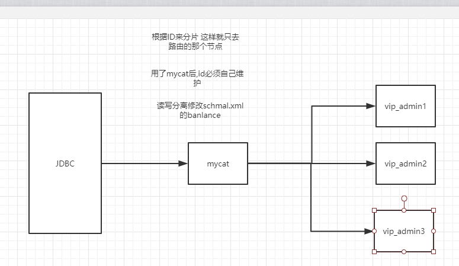
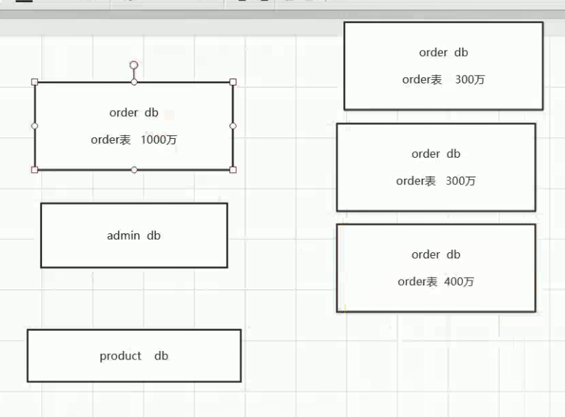

# mycat

官网地址： http://www.mycat.io/

## 1.安装（liunx上要安装好jdk，mycat是java写的，所以依赖jdk）

### 1.1 官网下载安装包并上传至liunx

### 1.2 解压

### 1.3 修改/mycat/conf/wrapper.conf文件(学习环境修改，不然会因内存报错)

wrapper.java.additional.10=-Xmx1G
wrapper.java.additional.11=-Xms256M

### 1.4 修改/mycat/conf/server.xml文件

可以通过sz命令把linux上面的文件下载下来进行修改，然后再通过rz命令上传上去。

主要修改用户的部分

```xml
<user name="litian">
    <property name="password">123456</property>
    <!--配置三个逻辑数据库-->
    <property name="schemas">vip_admin,vip_order,vip_product</property>

    <!-- 表级 DML 权限设置 对表的增删改查权限-->
    <!-- 		
  <privileges check="false">
   <schema name="TESTDB" dml="0110" >
    <table name="tb01" dml="0000"></table>
    <table name="tb02" dml="1111"></table>
   </schema>
  </privileges>		
   -->
</user>

<user name="user">
    <property name="password">user</property>
    <property name="schemas">vip_admin,vip_order,vip_product</property>
    <property name="readOnly">true</property>
</user>
```


### 1.5 修改/mycat/conf/schema.xml文件

原本一个表的数据比较庞大，比如100万，普通查询就会很慢，那么可以进行一个分库，比如将数据放到3个库里面对应的表里面，**数据量不大建议分库分表**，如下图：



在server.xml文件里面进行了一个用户的信息输入，然后进行一个逻辑分库，那么在schemal.xml里面设置对应的实体数据库。

#### 垂直水平切分

比如之前order和product表在一个数据库里面，我们可以把order放一个数据库，然后把product放一个数据库。这样来是实现了一个垂直切分，其实可以把一张表拆成两张表，一张放常用字段，一张放扩展字段，这也属于一种垂直切分。

**垂直分割**：表的记录并不多，但是字段却很长，表占用空间很大，检索表的时候需要执行大量的IO，严重降低了性能。这时需要把大的字段拆分到另一个表，并且该表与原表是一对一的关系。

**水平分割：**QQ的登录表。假设QQ的用户有100亿，如果只有一张表，每个用户登录的时候数据库都要从这100亿中查找，会很慢很慢。如果将这一张表分成100份，每张表有1亿条，就小了很多，比如qq0,qq1,qq1...qq99表。用户登录的时候，可以将用户的id%100，那么会得到0-99的数，查询表的时候，将表名qq跟取模的数连接起来，就构建了表名。比如123456789用户，取模的89，那么就到qq89表查询，查询的时间将会大大缩短。这就是水平分割。



如果把order表拆成三个表在一个数据库里面也可以，但是会有**单点故障**。


配置成功后启动后，通过navcat也可以登录，端口号是8806，用户名和密码是我们server.xml里面配置的


新插入数据的时候注意要给主键，因为要根据id进行取模

读写分离其实要修改dataHOst里面的balance="1"才能生效

主键自己生成，sql语句中：

```
insert into table(id) values(next value for MYCATSEQ_GLOBAL)
```

