# 消息中间件介绍&为什么要使用消息中间件&什么时候使用消息中间件

我们用java来举例子， 打个比方 我们客户端发送一个下单请求给订单系统（order）订单系统发送了

 一个请求给我们的库存系统告诉他需要更改库存了， 我已经下单了， 这里， 每一个请求我们都可以看作一条消息，

 但是 我们客户端需要等待订单系统告诉我这条消息的处理结果（我到底有没有下单成功） 但是 订单系统不需要知道库存系统这条消息的处理情况 因为无论你库存有没有改动成功， 我订单还是下了， 因为是先下完了订单（下成功了） 才去更改库存， 库存如果更改出BUG了 那是库存系统的问题， 这个BUG不会影响订单系统。如果这里你能理解的话， 那么我们就能发现 **我们用户发送的这条消息（下订单），** **是需要同步的（我需要知道结果），** **订单发送给库存的消息，是可以异步的（我不想知道你库存到底改了没，** **我只是通知你我这边成功下了一个订单）**

那么如果我们还按原来的方式去实现这个需求的话， 

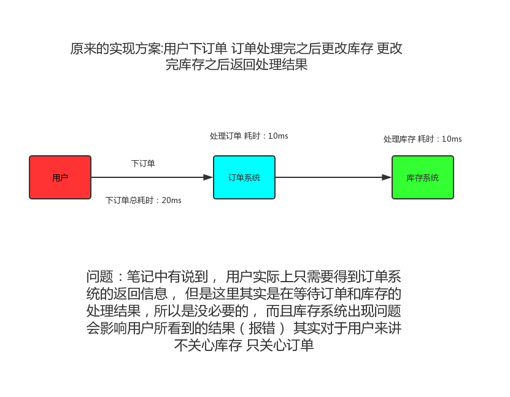

那可能有同学说了， 我们订单系统开辟线程去访问库存系统不就好了吗？

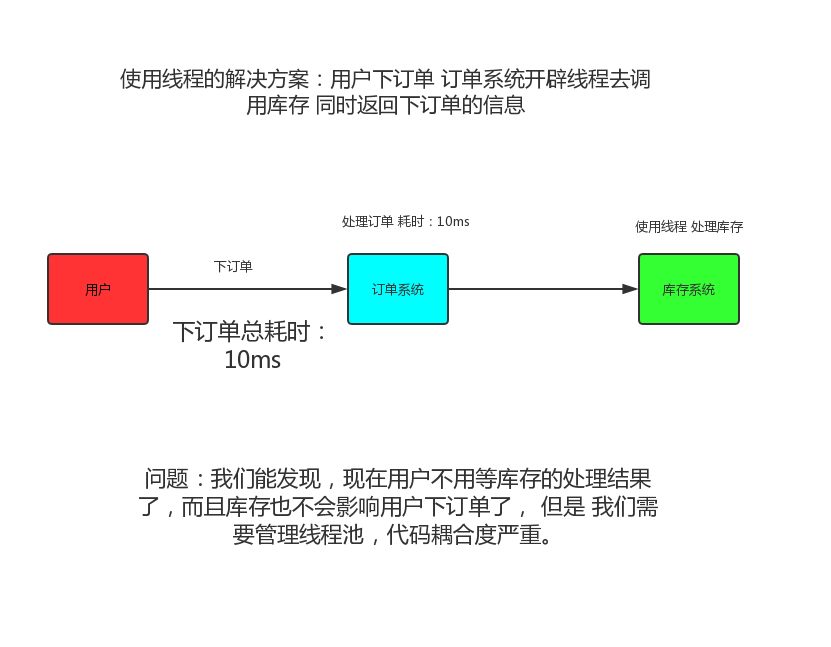

使用线程池解决也确实可以， 但是也有他的缺点，如果需要调度的资源比较多的话，那么这个线程池很难控制，那么，到底怎么来完美解决这个问题呢？

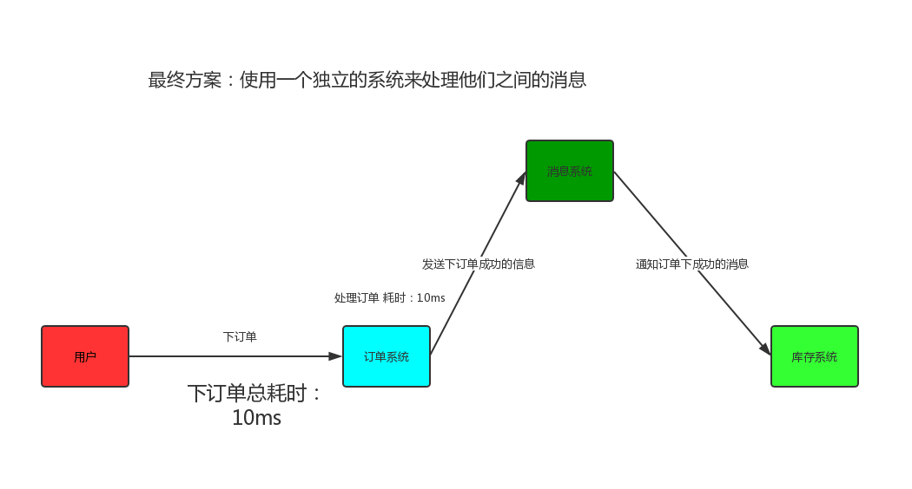

如果这张图能理解的话， 那么 这个消息系统， 就是我们的消息中间件。

# RabbitMq介绍&AMQP介绍 

导语:我们刚刚介绍了什么是消息中间件， 那么RabbitMq就是对于消息中间件的一种实现，市面上还有很多很多实现， 比如RabbitMq、ActiveMq、ZeroMq、kafka，以及阿里开源的RocketMQ等等 我们这节主要讲RabbitMq。

## AMQP

AMQP，即Advanced Message Queuing Protocol，一个提供统一消息服务的应用层标准高级[消息](https://baike.baidu.com/item/消息/1619218)队列协议，是[应用层](https://baike.baidu.com/item/应用层/4329788)协议的一个开放标准，为面向消息的中间件设计。基于此协议的客户端与消息中间件可传递消息，并不受客户端/[中间件](https://baike.baidu.com/item/中间件/452240)不同产品，不同的开发语言等条件的限制。[Erlang](https://baike.baidu.com/item/Erlang)中的实现有[RabbitMQ](https://baike.baidu.com/item/RabbitMQ)等。

**AMQP 其实和Http一样都是一种协议， 只不过 Http是针对网络传输的， 而AMQP是基于消息队列的。**

### AMQP协议中的基本概念

+ `Broker`: 接收和分发消息的应用，我们在介绍消息中间件的时候所说的消息系统就是Message Broker。

+ `Virtual host`: 出于多租户和安全因素设计的，把AMQP的基本组件划分到一个虚拟的分组中，类似于网络中的namespace概念。当多个不同的用户使用同一个RabbitMQ
  server提供的服务时，可以划分出多个vhost，每个用户在自己的vhost创建exchange／queue等。

  虚拟主机，用于进行逻辑隔离，隔离不同的项目，最上层的消息路由。一个Virtual host里面可以有若干个Exchange和Queue，同一个Virtual Host里面不能有相同名称的Exchange或Queue。

+ `Connection`：publisher／consumer和broker之间的TCP连接。断开连接的操作只会在client端进行，Broker不会断开连接，除非出现网络故障或broker服务出现问题。

+ `Channel`：如果每一次访问RabbitMQ都建立一个Connection，在消息量大的时候建立TCP  Connection的开销将是巨大的，效率也较低。Channel是在Connection内部建立的逻辑连接，如果应用程序支持多线程，通常每个thread创建单独的channel进行通讯，AMQP method包含了channel id帮助客户端和message broker识别channel，所以channel之间是完全隔离的。Channel作为轻量级的Connection极大减少了操作系统建立TCP Connection的开销。Channel是进行消息读写的通道。客户端可建立多个Channel，每个Channel代表一个会话任务

+ `Exchange`：message到达broker的第一站，根据分发规则，匹配查询表中的routing key，分发消息到queue中去。常用的类型有：direct (point-to-point), topic(publish-subscribe) and fanout (multicast)。

+ `Queue`：消息最终被送到这里等待consumer取走。一个message可以被同时拷贝到多个queue中。

+ `Binding`：exchange和queue之间的虚拟连接，binding中可以包含routing key。Binding信息被保存到exchange中的查询表中，用于message的分发依据。

+ `Message`：消息，服务器和应用程序之间传送的数据，由Properties和Body组成，Properties可以对消息进行修饰，比如消息的优先级、延迟等高级特性；Body则就是消息体内容。

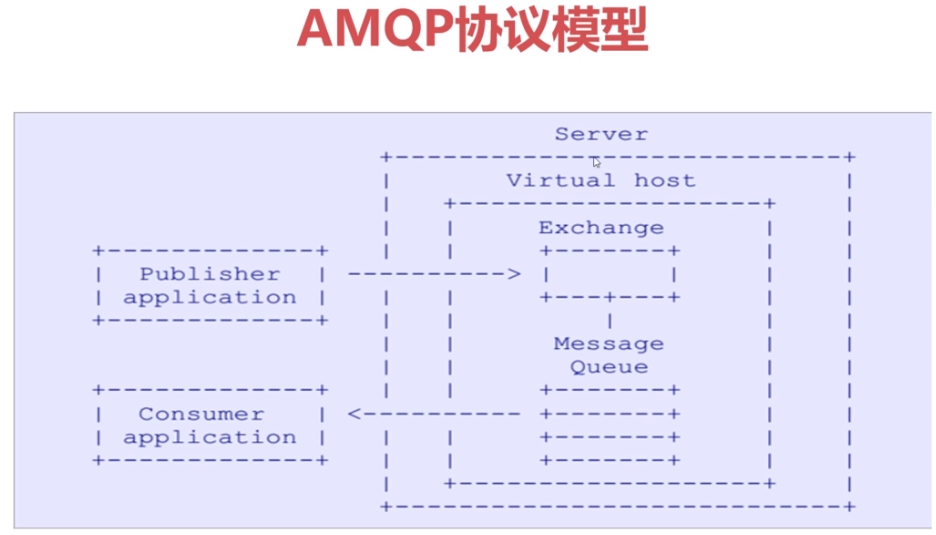

### Exchange的类型

+ `direct`：这种类型的交换机的路由规则是根据一个routingKey的标识，交换机通过一个routingKey与队列绑定 ，在生产者生产消息的时候 指定一个routingKey 当绑定的队列的routingKey 与生产者发送的一样 那么交换机会吧这个消息发送给对应的队列。

+ `fanout`：这种类型的交换机路由规则很简单，只要与他绑定了的队列， 他就会吧消息发送给对应队列（与routingKey没关系）

+ `topic`:   这种类型的交换机路由规则也是和routingKey有关 只不过topic他可以根据:星,#（ 星号代表过滤一单词，#代表过滤后面所有单词， 用.隔开）来识别routingKey 我打个比方 假设 我绑定的routingKey 有队列A和B A的routingKey是：星.user B的routingKey是: #.user

  **其实就是在direct的基础上支持模糊匹配**。

+ `headers`：这个类型的交换机很少用到，他的路由规则与routingKey无关 而是通过判断header参数来识别的， 基本上没有应用场景，因为上面的三种类型已经能应付了。

### RabbitMQ消息是如何流转的？

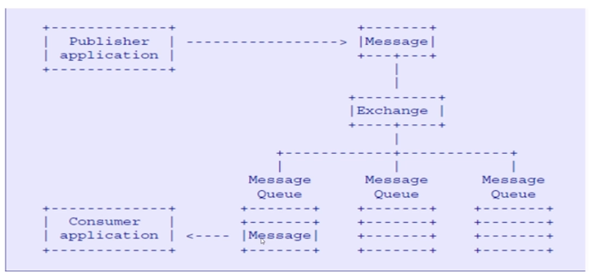

### RabbitMQ

`MQ`：message Queue 顾名思义 消息队列， 队列大家都知道， 存放内容的一个东西， 存放的内容先进先出， 消息队列， 只是里面存放的内容是消息而已。

`RabbitMQ`是一个开源的 基于`AMQP`协议实现的一个完整的企业级消息中间件，服务端语言由Erlang（面向并发编程）语言编写 对于高并发的处理有着天然的优势，客户端支持非常多的语言。

•  Python

•  Java

•  Ruby

•  PHP

•   C#

•  JavaScript

•   Go

•  Elixir

•  Objective-C

•  Swift

### 主流MQ对比

| 特性                     | ActiveMQ                              | RabbitMQ                                           | RocketMQ                                                     | Kafka                                                        |
| ------------------------ | ------------------------------------- | -------------------------------------------------- | ------------------------------------------------------------ | ------------------------------------------------------------ |
| 单机吞吐量               | 万级，比 RocketMQ、Kafka 低一个数量级 | 同 ActiveMQ                                        | 10 万级，支撑高吞吐                                          | 10 万级，高吞吐，一般配合大数据类的系统来进行实时数据计算、日志采集等场景 |
| topic 数量对吞吐量的影响 |                                       |                                                    | topic   可以达到几百/几千的级别，吞吐量会有较小幅度的下降，这是 RocketMQ 的一大优势，在同等机器下，可以支撑大量的 topic | topic 从几十到几百个时候，吞吐量会大幅度下降，在同等机器下，Kafka 尽量保证 topic 数量不要过多，如果要支撑大规模的 topic，需要增加更多的机器资源 |
| 时效性                   | 毫秒级                                | 微秒级，这是 RabbitMQ 的一大特点，延迟最低         | 毫秒级                                                       | 毫秒级                                                       |
| 可用性                   | 高，基于主从架构实现高可用            | 同 ActiveMQ                                        | 非常高，分布式架构                                           | 非常高，分布式，一个数据多个副本，少数机器宕机，不会丢失数据，不会导致不可用 |
| 消息可靠性               | 有较低的概率丢失数据                  |                                                    | 经过参数优化配置，可以做到 0 丢失                            | 同 RocketMQ                                                  |
| 功能支持                 | MQ 领域的功能极其完备                 | 基于 erlang 开发，并发能力很强，性能极好，延时很低 | MQ 功能较为完善，还是分布式的，扩展性好                      | 功能较为简单，主要支持简单的 MQ 功能，在大数据领域的实时计算以及日志采集被大规模使用 |

## RabbitMQ Windows安装

RabbitMQ服务端是由Erlang语言编写所以我们这里先下载Erlang语言的环境，

`Erlang的底层是Socket所以有很低的延迟`

`RabbitMQ和Erlang有版本匹配`

如果是在官网下的RabbitMQ服务端的话，Erlang语言的版本不能太低， 不然要卸载掉旧的去装新的， 我们这里下载OTP21.0版本直接从外网下载会很慢， 我这里直接贴上百度网盘的地址

`https://pan.baidu.com/s/1pZJ8l2f3omrgnuCm9a8DVA`

我们再去官网下载 他的服务端安装包

http://www.rabbitmq.com/download.html

根据自己的系统选择下载即可

**注意！** **需要先下载**Erlang**再下载安装包安装，不然安装****RabbitMQ**服务端的时候会提示你本地没有**Erlang**环境

RabbitMQ安装会附带一个管理工具（方便我们能直观的查看整个RabbitMQ的运行状态和详细数据等，有点像Navicat 对应Mysql的关系） 值得一提的是， 管理工具和RabbitMQ是两码事 希望同学们不要混稀了。

**安装的话，** **基本上就是默认的选项不用改**

如何看RabbitMq安装完成了？ 在系统-服务中找到如下即可：

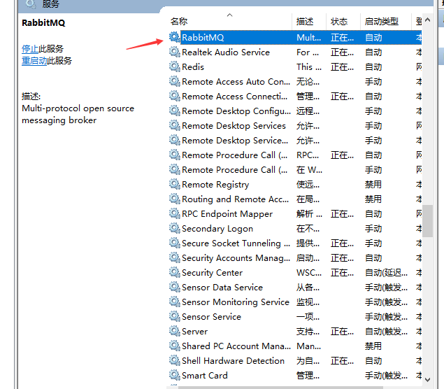

管理工具启动方式：

到你们安装的 RabbitMQ Server\rabbitmq_server-3.7.12\sbin 目录下面 执行一条cmd命令：

``` 
rabbitmq-plugins enable rabbitmq_management
```

直接复制这条命令即可 ， 当然 嫌每次都要去目录中去执行的麻烦的话， 可以配置一个环境变量 或者在我们的开始菜单栏中找到这个：

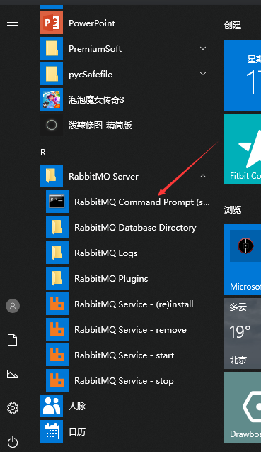

 

输入完启动命令后 稍微等一下会有结果返回 然后可以打开浏览器 输入

http://127.0.0.1:15672

访问管理页面：


 

默认账号密码都是

guest 即

 username ：guest

 password：guest

登录进去之后会看到如下界面（因为我不小心装了2次RabbitMq 所以这里能看到都重复了， 你们自己那不会重复，然后我们刚刚说了 管理工具和rabbitmq 是两码事 所以端口也就不一样）

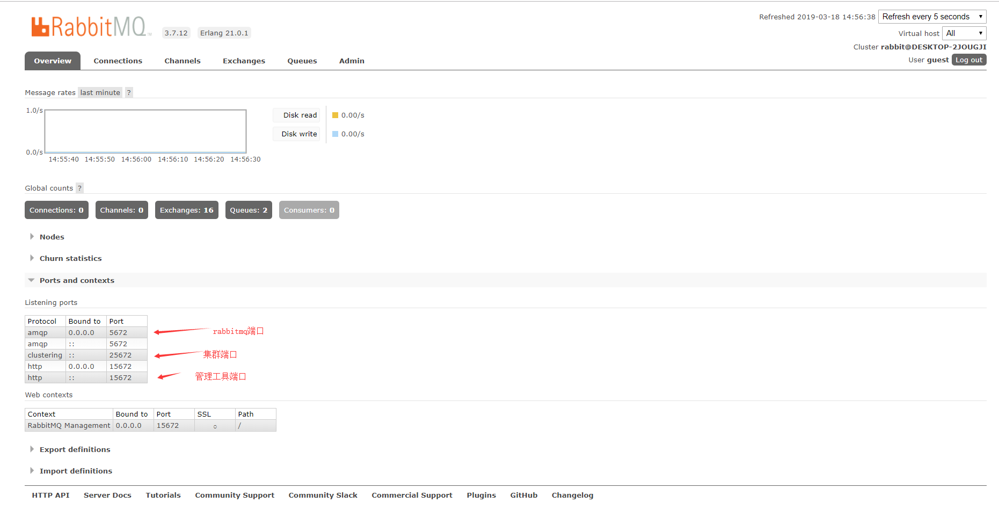

 

 

这个页面在笔记里面介绍起来可能比较复杂， 就不一一介绍了， 我这里讲个重点， 就是线上环境下一定要吧guest用户（当然 guest这个用户只能本机才能登陆）删掉并且新加一个用户， 这里就演示一下这个功能

首先 点击admin页签， 在下面找到Add User

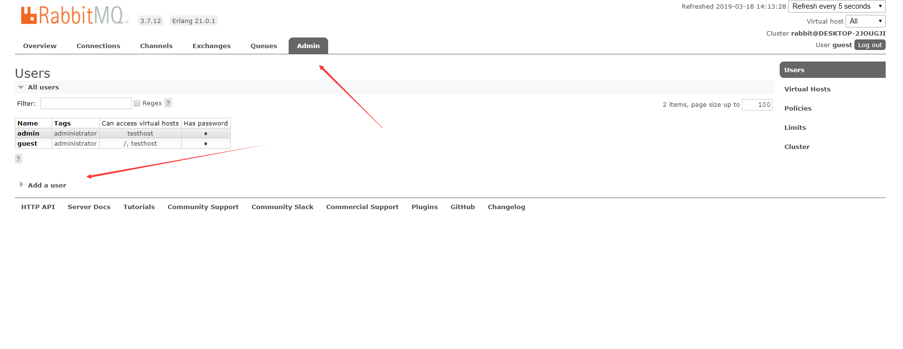

 

 

然后输入账号 密码 确认密码 这个Tags其实是一个用户权限标签， 关于他的介绍可以看官方介绍（点旁边那个小问号就好了，我这里直接翻译他的介绍）


 

 

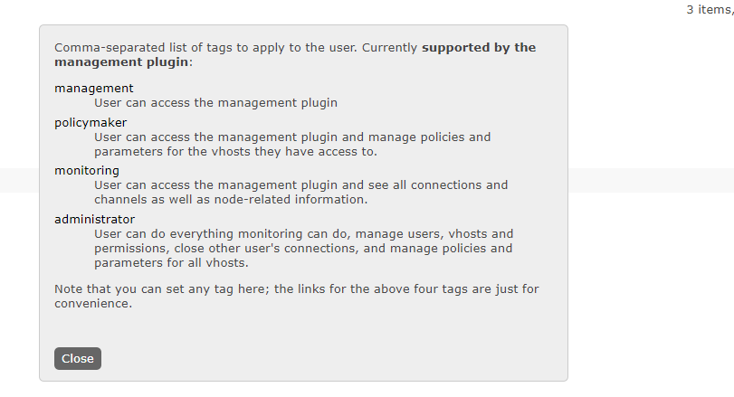

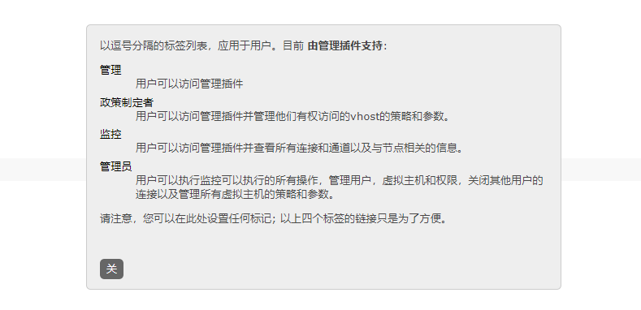

 

 

填写完之后点击AddUser 就可以添加一个用户了， 添加完用户之后还要给这个用户添加对应的权限（注：Targ不等于权限） 

比如说 我刚刚添加了一个jojo角色 


点击这个jojo可以进去给他添加权限 这个权限可以是 Virtual host 级别的 也可以是交换机级别的 甚至是细化到某一个读写操作 我这里就给他添加一个Virtual host权限 

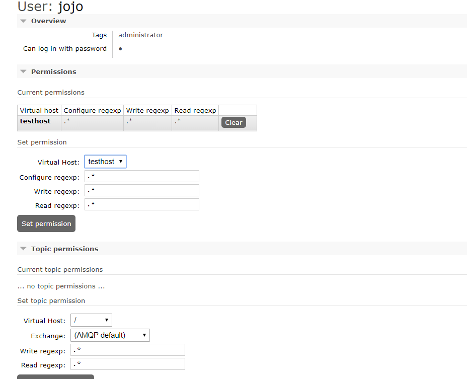

 

这里 我们给了他 testhost这个Virtual host的权限 正则匹配都是* 也就是所有权限

然后点击set添加完毕

那么管理页面 我们就讲到这里

## RabbitMQ Linux安装

1. 准备

   ```
   yum install build-essential openssl openssl-deve unixODBC unixODBC-devel
   ```

   ```
   yum install gcc-c++
   ```

2. 下载

   在`/usr/local`下面创建一个`software`文件夹在里面进行下载

   下载`erlang`

   ```
   wget http://www.rabbitmq.com/releases/erlang/erlang-19.0.4-1.el7.centos.x86_64.rpm
   ```

   下载`rabbitMQ`

   ```
   wget http://www.rabbitmq.com/releases/rabbitmq-server/v3.6.6/rabbitmq-server-3.6.6-1.el7.noarch.rpm
   ```

3. 配置`vim /ect/hosts `以及 `vim /ect/host`

   此配置文件是配置主机，后面的配置是集群涉及到的

4. 安装

   1. 安装`erlang`

      ```
      rpm -ivh erlang-19.0.4-1.el7.centos.x86_64.rpm
      ```

   2. 测试是否安装成功

      ```
      erl
      ```

      ```
      Erlang/OTP 19 [erts-8.0.3] [source] [64-bit] [async-threads:10] [hipe] [kernel-poll:false]
      
      Eshell V8.0.3  (abort with ^G)
      1> 
      ```

      

   3. 安装`rabbitMQ`

      ```
      rpm -ivh rabbitmq-server-3.6.6-1.el7.noarch.rpm 
      ```

      在安装`rabbitmq`时提示依赖`socat`

      ``` 
      yum install socat
      ```

      再次安装`rabbitMQ`成功

   4. 修改密码

      ```
      vim /usr/lib/rabbitmq/lib/rabbitmq_server-3.6.6/ebin/rabbit.app
      ```

      找到`loopback_users` 把`guest`周围的`<<"">>`删掉保存

      只保留一个`guest`用户就好了

   5. 启动

      ```
      rabbitmq-server start &
      ```

      ````
      rabbitmq-server stop // 关闭rabbitmq
      rabbitmq-server status // 状态
      ````

   6. 查看是否启动成功

      ```
      lsof -i:5672
      ```

      ```
      COMMAND   PID     USER   FD   TYPE DEVICE SIZE/OFF NODE NAME
      beam    67221 rabbitmq   49u  IPv6 129437      0t0  TCP *:amqp (LISTEN)
      ```

      发现有amqp，说明启动成功

   7. 其他命令

      运行如下的命令，增加用户admin，密码admin

      ````
      [root@localhost sbin]# ./rabbitmqctl add_user admin admin 
      Creating user "admin" ... 
      ...done. 
      [root@localhost sbin]# ./rabbitmqctl set_user_tags admin administraotr 
      Setting tags for user "admin" to [administraotr] ... 
      ...done. 
      [root@localhost sbin]# ./rabbitmqctl list_users 
      Listing users ... 
      admin   [administraotr] 
      guest   [administrator] 
      ...done.
      ````

   

5. 启动管理插件

   ```
   rabbitmq-plugins enable rabbitmq_management
   ```

   此外通过rabbitmq-plugins可以查看插件列表进行选择启动

   ```
   rabbitmq-plugins list
   ```

6. 访问

   ```
   http://192.168.188.128:15672/
   ```

   默认端口号是15672

7. 登录

   使用guest/guest登录

   管控台上面有截图

   

## RabbitMQ 快速入门

因为我们这里是用java来作为客户端， 我们首先引入maven依赖

````xml
<dependency>
    <groupId>com.rabbitmq</groupId>
    <artifactId>amqp-client</artifactId>
    <version>5.1.2</version>
</dependency>
````

（注意的是， 我这里引入的是5.x的rabbitmq客户端版本， 那么我们jdk的版本最好在8以上，反之， 这里就建议使用4.x的版本，这里仅仅讨论jdk8 其他的版本不做讨论）

首先 我们编写一个连接的工具类:

```java
import com.rabbitmq.client.Connection;
import com.rabbitmq.client.ConnectionFactory;

import java.io.IOException;
import java.util.concurrent.TimeoutException;

/**
 * 创建一个简单连接的工具类
 */
public class ConnectionUtil {

    public static final String QUEUE_NAME  = "testQueue";

    public static  final  String EXCHANGE_NAME = "exchange";

    public static Connection getConnection() throws IOException, TimeoutException {
        // 创建一个连接工厂
        ConnectionFactory connectionFactory = new ConnectionFactory();
        // 设置rabbitmq 服务端所在地址
        connectionFactory.setHost("192.168.188.128");
        // 设置端口号，连接用户名，虚拟地址等。
        connectionFactory.setPort(5672);
        connectionFactory.setUsername("guest");
        connectionFactory.setPassword("guest");
        connectionFactory.setVirtualHost("testhost");
        return connectionFactory.newConnection();
    }
}
```

然后我们编写一个生产者（`producer`），`请看注释`

```java
import com.rabbit.util.ConnectionUtil;
import com.rabbitmq.client.Channel;
import com.rabbitmq.client.Connection;

import java.io.IOException;
import java.util.concurrent.TimeoutException;

// 创建一个简单的生产者
public class Producer {

    public static void main(String[] args) {
        try {
            Connection connection = ConnectionUtil.getConnection();
            Channel channel = connection.createChannel();
            // 声明队列
            channel.queueDeclare(
                    ConnectionUtil.QUEUE_NAME,
                    true, // 队列是否持久化
                    false, // 是否是排他队列，如果为true则只有这个连接才能调用这个队列
                    false, // 是否自动删除，当没有任何消费者的时候删除这个队列
                    // 配置项，队列最大容纳多少量，具体怎么配是企业优化，是个map
                    null);
            // 声明交换机
            channel.exchangeDeclare(ConnectionUtil.EXCHANGE_NAME, "fanout");
            //交换机和队列绑定
            channel.queueBind(ConnectionUtil.QUEUE_NAME, ConnectionUtil.EXCHANGE_NAME, "");
            // 发送数据
            channel.basicPublish(
                    // 交换机，如果没有则为“”会调用默认的交换机
                    // 会将队列名字当做routeKey
                    ConnectionUtil.EXCHANGE_NAME,
                    ConnectionUtil.QUEUE_NAME,
                    null, // 消息配置，暂时设置为空
                    "Hello".getBytes() // 发送的数据
            );
            // 关闭连接
            channel.close();
            connection.close();
        } catch (IOException e) {
            e.printStackTrace();
        } catch (TimeoutException e) {
            e.printStackTrace();
        }
    }
}
```

再编写一个消费者

```java
import com.rabbit.util.ConnectionUtil;
import com.rabbitmq.client.*;

import java.io.IOException;
import java.util.concurrent.TimeoutException;

public class Consumer {

    public static void main(String[] args) throws IOException, TimeoutException {
        Connection connection = ConnectionUtil.getConnection();
        Channel channel = connection.createChannel();
        // 定义一个消费者 将channel传给他
        DefaultConsumer deliverCallback = new DefaultConsumer(channel) {
            /**
             * 重写方法，获取消息
             * @param consumerTag 消费者标识
             * @param envelope 可以获取发送方标识、routeKey、交换机
             * @param properties 消息属性，包括编码或者其他
             * @param body 消息主体 发送过来也是一个byte数组
             * @throws IOException
             */
            @Override
            public void handleDelivery(String consumerTag, Envelope envelope, AMQP.BasicProperties properties, byte[] body) throws IOException {

                System.out.println(new String(body, "UTF-8"));
            }

        };
        // 消费消息
        channel.basicConsume(ConnectionUtil.QUEUE_NAME, deliverCallback);
    }
}
```

测试

```java
Hello
```

测试成功，一个简单的例子大告成功。

## 源码分析

1. 创建连接部分，`new Connection()`

   ```java
   public Connection newConnection() throws IOException, TimeoutException {
           return this.newConnection(this.sharedExecutor, 
                                     // 只有一条数据的list
                                     Collections.singletonList(new Address(this.getHost(), this.getPort())));
       }
   ```

   核心方法

   ````java
   public Connection newConnection(ExecutorService executor, AddressResolver addressResolver, String clientProvidedName) throws IOException, TimeoutException {
       // 判断数据采集器是否为空，如果没有就创建
       // 
       if (this.metricsCollector == null) {
           this.metricsCollector = new NoOpMetricsCollector();
       }
   	// rabbitmq是靠一帧一帧的处理消息的，所以会有这个Frame， rabbit是一帧一帧传递消息的
       FrameHandlerFactory fhFactory = this.createFrameHandlerFactory();
       // 所有的参数，连接端口，地址什么的
       ConnectionParams params = this.params(executor);
      
       if (clientProvidedName != null) {
           Map<String, Object> properties = new HashMap(params.getClientProperties());
           properties.put("connection_name", clientProvidedName);
           params.setClientProperties(properties);
       }
    // 判断连接是否需要自动恢复，如果需要就去恢复连接
       if (this.isAutomaticRecoveryEnabled()) {
           AutorecoveringConnection conn = new AutorecoveringConnection(params, fhFactory, addressResolver, this.metricsCollector);
           conn.init();
           return conn;
       } else {
           List<Address> addrs = addressResolver.getAddresses();
           Exception lastException = null;
           Iterator var8 = addrs.iterator();
   
           while(var8.hasNext()) {
               Address addr = (Address)var8.next();
   
               try {
                   FrameHandler handler = fhFactory.create(addr, clientProvidedName);
                   AMQConnection conn = this.createConnection(params, handler, this.metricsCollector);
                   conn.start();
                   this.metricsCollector.newConnection(conn);
                   return conn;
               } catch (IOException var12) {
                   lastException = var12;
               } catch (TimeoutException var13) {
                   lastException = var13;
               }
           }
   
           if (lastException != null) {
               if (lastException instanceof IOException) {
                   throw (IOException)lastException;
               }
   
               if (lastException instanceof TimeoutException) {
                   throw (TimeoutException)lastException;
               }
           }
   
           throw new IOException("failed to connect");
       }
   }
   ````

   查看`conn.init()`方法, 这个方法是判断恢复连接中的一个方法

   ````java
   public void init() throws IOException, TimeoutException {
       this.delegate = this.cf.newConnection();
       this.addAutomaticRecoveryListener(this.delegate);
   }
   ````

   可以看见new了一个连接， 看看怎么new 的一个连接？

   ```java
   public RecoveryAwareAMQConnection newConnection() throws IOException, TimeoutException {
       Exception lastException = null;
       // 拿出只有一个地址的集合，打乱地址，我估计这儿是为了增加连接的可能性，所以打乱，因为以后可能会有好几个地址
       List<Address> shuffled = shuffle(this.addressResolver.getAddresses());
       Iterator var3 = shuffled.iterator();
   
       while(var3.hasNext()) {
           Address addr = (Address)var3.next();
   
           try {
               // 核心代码
               FrameHandler frameHandler = this.factory.create(addr, this.connectionName());
               RecoveryAwareAMQConnection conn = this.createConnection(this.params, frameHandler, this.metricsCollector);
               conn.start();
               this.metricsCollector.newConnection(conn);
               return conn;
           } catch (IOException var7) {
               lastException = var7;
           } catch (TimeoutException var8) {
               lastException = var8;
           }
       }
   
       if (lastException != null) {
           if (lastException instanceof IOException) {
               throw (IOException)lastException;
           }
   
           if (lastException instanceof TimeoutException) {
               throw (TimeoutException)lastException;
           }
       }
   
       throw new IOException("failed to connect");
   }
   ```

   查看`FrameHandler frameHandler = this.factory.create(addr, this.connectionName());`

   ````java
   public FrameHandler create(Address addr, String connectionName) throws IOException {
       String hostName = addr.getHost();
       int portNumber = ConnectionFactory.portOrDefault(addr.getPort(), this.ssl);
       Socket socket = null;
   
       try {
           socket = this.createSocket(connectionName);
           this.configurator.configure(socket);
           socket.connect(new InetSocketAddress(hostName, portNumber), this.connectionTimeout);
           return this.create(socket);
       } catch (IOException var7) {
           quietTrySocketClose(socket);
           throw var7;
       }
   }
   ````

   `可见底层是使用了socket进行了连接，但是socket是通过rpc连接的`

2. 查看创建队列代码

   ```java
   channel.queueDeclare(
       ConnectionUtil.QUEUE_NAME,
       true, // 队列是否持久化
       false, // 是否是排他队列，如果为true则只有这个连接才能调用这个队列
       false, // 是否自动删除，当没有任何消费者的时候删除这个队列
       // 配置项，队列最大容纳多少量，具体怎么配是企业优化
       null);
   ```

   继而查看底层

   ```java
   public com.rabbitmq.client.impl.AMQImpl.Queue.DeclareOk queueDeclare(String queue, boolean durable, boolean exclusive, boolean autoDelete, Map<String, Object> arguments) throws IOException {
       validateQueueNameLength(queue);
       return (com.rabbitmq.client.impl.AMQImpl.Queue.DeclareOk)this.exnWrappingRpc((new com.rabbitmq.client.AMQP.Queue.Declare.Builder()).queue(queue).durable(durable).exclusive(exclusive).autoDelete(autoDelete).arguments(arguments).build()).getMethod();
   }
   ```

   ````java
   public AMQCommand exnWrappingRpc(Method m) throws IOException {
       try {
           return this.privateRpc(m);
       } catch (AlreadyClosedException var3) {
           throw var3;
       } catch (ShutdownSignalException var4) {
           throw wrap(var4);
       }
   }
   ````

   

   ```java
   private AMQCommand privateRpc(Method m) throws IOException, ShutdownSignalException {
           AMQChannel.SimpleBlockingRpcContinuation k = new AMQChannel.SimpleBlockingRpcContinuation(m);
       this.rpc(m, k);
       if (this._rpcTimeout == 0) {
           return (AMQCommand)k.getReply();
       } else {
           try {
               return (AMQCommand)k.getReply(this._rpcTimeout);
           } catch (TimeoutException var4) {
               throw this.wrapTimeoutException(m, var4);
           }
       }
   }
   ```

   `this.rpc(m, k);`

   ````java
   public void quiescingRpc(Method m, AMQChannel.RpcContinuation k) throws IOException {
       synchronized(this._channelMutex) {
           this.enqueueRpc(k);
           this.quiescingTransmit(m); // 进入
       }
   }
   ````

   ````java
   public void quiescingTransmit(Method m) throws IOException {
       synchronized(this._channelMutex) {
           this.quiescingTransmit(new AMQCommand(m));
       }
   }
   ````

   可以看见传入了一个method对象，通过rpc创建输入输出流将method对象封装成指令对象来执行

   ```java
   public void quiescingTransmit(AMQCommand c) throws IOException {
       synchronized(this._channelMutex) {
           if (c.getMethod().hasContent()) {
               for(; this._blockContent; this.ensureIsOpen()) {
                   try {
                       this._channelMutex.wait();
                   } catch (InterruptedException var5) {
                   }
               }
           }
   
           c.transmit(this);
       }
   }
   ```

   

   ````java
   public void transmit(AMQChannel channel) throws IOException {
       int channelNumber = channel.getChannelNumber();
       AMQConnection connection = channel.getConnection();
       synchronized(this.assembler) {
           com.rabbitmq.client.impl.Method m = this.assembler.getMethod();
           // 写入帧率
           connection.writeFrame(m.toFrame(channelNumber));
           if (m.hasContent()) {
               byte[] body = this.assembler.getContentBody();
               connection.writeFrame(this.assembler.getContentHeader().toFrame(channelNumber, (long)body.length));
               int frameMax = connection.getFrameMax();
               int bodyPayloadMax = frameMax == 0 ? body.length : frameMax - 8;
   
               for(int offset = 0; offset < body.length; offset += bodyPayloadMax) {
                   int remaining = body.length - offset;
                   int fragmentLength = remaining < bodyPayloadMax ? remaining : bodyPayloadMax;
                   Frame frame = Frame.fromBodyFragment(channelNumber, body, offset, fragmentLength);
                   connection.writeFrame(frame);
               }
           }
       }
   
       connection.flush();
   }
   ````

   可以看见获取连接，通过`writeFrame`方法写入帧字节，下面这个方法是通过socket获取输出流来把帧字节写出去

   ```java
   public void writeFrame(Frame frame) throws IOException {
       synchronized(this._outputStream) {
           frame.writeTo(this._outputStream);
       }
   }
   ```

   总结：`客户端与服务端通过ConnectionFactory创建连接，通过Socket会拿到输入流和输出流，客户端和服务端进行交互是通过指令交互的，通过Socket的输入流和输出流可以发送指令`

3. 为什么要使用Channle

   ```java
   public Channel createChannel() throws IOException {
       this.ensureIsOpen();
       ChannelManager cm = this._channelManager;
       if (cm == null) {
           return null;
       } else {
           Channel channel = cm.createChannel(this);
           this.metricsCollector.newChannel(channel);
           return channel;
       }
   }
   ```

   可见，无论创建多少个Channle其实是用的一个连接，所以对性能的损耗不会高