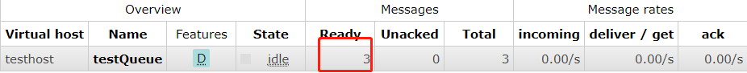

## 自动确认

默认情况下消息消费了之后还是会存在消息系统里面



如果消息没有被消费就会存在Ready里面

| Ready   | 准备就绪状态（待消费） |
| ------- | ---------------------- |
| Unacked | 待确认状态             |
| Total   | 总数                   |

`rabbitMQ`提供了一个**消费确认机制**，防止消费端消费失败，如果消息处于待确认的状态不会被其他消费者消费，会处于一个等待的状态，如果消费者断开连接，那么这条消息会重回一个准备就绪状态。

```java
// 消费消息    
channel.basicConsume(ConnectionUtil.QUEUE_NAME, true, deliverCallback);
```

如果消费端加上了`autoACK = true`的参数，如上，那么消费完消息后，消息就会被删除。但是此参数默认是false。

## 手动确认

如果加上了`autoACK = true`参数，消息会被自动消费掉，但是如果消费端出现了问题，那么消息没有办法回滚。所以我们定义`autoACK = false`，此参数默认是false，所以我们不必关心

````
一般消息有2个状态，准备状态、待确认状态，在手动确认情况下，如果我们开始消费的时候,消息会变为待确认的状态，其他队列将不会处理这条消息，如果我们处理消息的时候发生了服务宕机，那么这条消息会自动退回准备状态
````

那么怎么确认呢？

````java
DefaultConsumer deliverCallback = new DefaultConsumer(channel) {
            /**
             * 重写方法，获取消息
             * @param consumerTag 消费者标识
             * @param envelope 可以获取发送方标识、routeKey、交换机
             * @param properties 消息属性，包括编码或者其他
             * @param body 消息主体 发送过来也是一个byte数组
             * @throws IOException
             */
            @Override
    public void handleDelivery(String consumerTag, Envelope envelope, AMQP.BasicProperties properties, byte[] body) throws IOException {
        System.out.println(new String(body, "UTF-8"));
        // 确认消息，后面的参数是是否批量确认
        channel.basicAck(envelope.getDeliveryTag(), false);
    }
};

channel.basicConsume(ConnectionUtil.QUEUE_NAME, false, deliverCallback);
````

## 重复消费

有时候可能是网络的问题，同一条消息发送了两遍到消费端，那么怎么解决呢？

我们可以给消息加上一个状态字段，通过这个状态字段来判断是否消费了这条消息，如果已经消费了就不管了。

## 什么时候使用自动确认？

一般一些个无关紧要的消息可以使用自动确认，比如日志什么的，涉及到业务的消息还是要使用手动确认。

## Spring Boot 整合

### Spring Boot Java Config方式整合

创建两个项目

1. 消息发送方`spring-rabbit-mq-producer`

   1. 依赖

      ```xml
      <dependency>
          <groupId>org.springframework.boot</groupId>
          <artifactId>spring-boot-starter-web</artifactId>
      </dependency>
      
      <dependency>
          <groupId>org.projectlombok</groupId>
          <artifactId>lombok</artifactId>
          <optional>true</optional>
      </dependency>
      
      <dependency>
          <groupId>org.springframework.boot</groupId>
          <artifactId>spring-boot-starter-amqp</artifactId>
      </dependency>
      <!--这儿使用fastjson，后面会用到-->
      <dependency>
          <groupId>com.alibaba</groupId>
          <artifactId>fastjson</artifactId>
          <version>1.2.12</version>
      </dependency>
      ```

      

   2. 创建rabbitmq的配置类，这儿不是用的yml文件配置使用的是Java Config配置

      ```java
      import org.springframework.amqp.core.Binding;
      import org.springframework.amqp.core.BindingBuilder;
      import org.springframework.amqp.core.DirectExchange;
      import org.springframework.amqp.core.Queue;
      import org.springframework.amqp.rabbit.connection.CachingConnectionFactory;
      import org.springframework.amqp.rabbit.connection.ConnectionFactory;
      import org.springframework.amqp.rabbit.core.RabbitTemplate;
      import org.springframework.boot.web.embedded.tomcat.TomcatServletWebServerFactory;
      import org.springframework.context.annotation.Bean;
      import org.springframework.context.annotation.Configuration;
      
      /**
       * rabbitmq 配置类
       */
      @Configuration
      public class RabbitmqConfig {
      
          @Bean
          public ConnectionFactory connectionFactory() {
              CachingConnectionFactory cachingConnectionFactory
                      = new CachingConnectionFactory("192.168.188.128", 5672);
              cachingConnectionFactory.setUsername("ly");
              cachingConnectionFactory.setPassword("ly");
              cachingConnectionFactory.setVirtualHost("testhost");
              // 是否开启消息确认机制
              // cachingConnectionFactory.setPublisherConfirms(true);
              return  cachingConnectionFactory;
          }
      
          /**
           * 配置rabbitTempalte
           * 使用yml配置后这个RabbitTemplate不用配
           * @return
           */
          @Bean
          public RabbitTemplate rabbitTemplate() {
              RabbitTemplate rabbitTemplate = new RabbitTemplate();
              rabbitTemplate.setConnectionFactory(connectionFactory());
              return rabbitTemplate;
          }
      
          // 声明交换机
          @Bean
          public DirectExchange defaultExchange() {
              return new DirectExchange("directExchange");
          }
      
          // 声明队列
          @Bean
          public Queue queue() {
              return new Queue("query1", true);
          }
      
          @Bean
          public Binding binding() {
              return BindingBuilder.bind(queue()).to(defaultExchange()).with("defaultKey");
          }
      	// 声明tomacat
          @Bean
          public TomcatServletWebServerFactory tomcatServletWebServerFactory() {
              TomcatServletWebServerFactory tomcatServletWebServerFactory
                      = new TomcatServletWebServerFactory(8080);
              return tomcatServletWebServerFactory;
          }
      
      }
      ```

      

   3. 创建发送类

      ```java
      import org.springframework.amqp.rabbit.core.RabbitTemplate;
      import org.springframework.beans.factory.annotation.Autowired;
      import org.springframework.stereotype.Component;
      
      @Component
      public class RabbitmqMessageSend {
      
          @Autowired
          RabbitTemplate rabbitTemplate;
      
          public void sendMessage(String message, String routingKey, String name) {
              // spring boot 自动转换消息
              rabbitTemplate.convertAndSend(name, routingKey, message);
          }
      }
      ```

      

   4. 使用controller来调用发送消息

      ```java
      @RestController
      public class OrderController {
      
          @Autowired
          RabbitmqMessageSend rabbitmqMessageSend;
      
          @GetMapping(value = "/order")
          public Object order(String message, String name, String routingKey) {
              rabbitmqMessageSend.sendMessage(message, routingKey, name);
              return "下单成功";
          }
      }
      ```

      

2. 消费者`spring-rabbit-mq-consumer`

   ```java
   /**
    * rabbitmq 配置类
    */
   @Configuration
   public class RabbitmqConfig {
   
       @Bean
       public ConnectionFactory connectionFactory() {
           CachingConnectionFactory cachingConnectionFactory
                   = new CachingConnectionFactory("192.168.188.128", 5672);
           cachingConnectionFactory.setUsername("ly");
           cachingConnectionFactory.setPassword("ly");
           cachingConnectionFactory.setVirtualHost("testhost");
           // 是否开启消息确认机制
           // cachingConnectionFactory.setPublisherConfirms(true);
           return  cachingConnectionFactory;
       }
   
       /**
        * 配置rabbitTempalte
        * 使用yml配置后这个RabbitTemplate不用配
        * @return
        */
       @Bean
       public RabbitTemplate rabbitTemplate() {
           RabbitTemplate rabbitTemplate = new RabbitTemplate();
           rabbitTemplate.setConnectionFactory(connectionFactory());
           return rabbitTemplate;
       }
   
   }
   ```

   创建消费类

   ```java
   // 一定要交给spring去管理
   @Component
   public class RabbitmqUtil {
   
       @RabbitListener(queues = "query1")
       public void get(String message) throws Exception {
           System.out.println(message);
       }
   	
       @RabbitListener(queues = "query1")
       public void getMessage(Message message) throws Exception {
           System.out.println(new String(message.getBody(), "UTF-8"));
       }
   }
   ```

   `传入Message对象获取了消息，里面有消息的配置类，后面通过查看源码知道，如果传入的是一个被JSON过的Map，通过String参数接收的时候是byte数组，原因是在源码里面会有一个判断，如果头信息是text开头就可以进行一个处理而打印出来，但是被JSON过的map是一个application的头信息，所以会直接打印。`
   
   

### Spring Boot yml文件整合


## 交换机类型代码实战


1. fanout

   在生产者定义交换机类型的时候可以指定类型

   ````java
   channel.exchangeDeclare(ConnectionUtil.EXCHANGE_NAME, "fanout");
   ````

   也可以使用枚举类型

   ````java
   channel.exchangeDeclare(ConnectionUtil.EXCHANGE_NAME, BuiltinExchangeType.FANOUT);
   ````

   在发送消息的时候可以指定路由键，但是fanout类型不需要指定，所以这儿就不指定

   ````java
   channel.basicPublish(ConnectionUtil.EXCHANGE_NAME,"", null,"Hello".getBytes());
   ````

   交换机和队列要绑定，没有路由键就不指定

   ```java
   channel.queueBind(ConnectionUtil.QUEUE_NAME, ConnectionUtil.EXCHANGE_NAME, "");
   ```

   消费者这一方也要创建指定消费的队列

   ````java
   channel.queueDeclare("query1", true, false, false, null);
   ````

   消费的时候也要指定

   ```java
   // 消费消息
   channel.basicConsume("query1", deliverCallback);
   ```

2. direct

   废话不多说，上代码

   ```java
   // 删除交换机, 因为之前声明过
   channel.exchangeDelete(ConnectionUtil.EXCHANGE_NAME);
   // 声明交换机
   channel.exchangeDeclare(ConnectionUtil.EXCHANGE_NAME, BuiltinExchangeType.DIRECT);
   // 交换机和队列绑定并设定路由键
   channel.queueBind("query1", ConnectionUtil.EXCHANGE_NAME, "info.user");
   // 交换机和队列绑定并设定路由键
   channel.queueBind("query2", ConnectionUtil.EXCHANGE_NAME, "error.user");
   // 交换机和队列绑定并设定路由键
   channel.queueBind("query3", ConnectionUtil.EXCHANGE_NAME, "debug.user");
   // 发送数据 指定路由键
   channel.basicPublish(ConnectionUtil.EXCHANGE_NAME, "info.user", null, "Hello".getBytes());
   ```

   

3. topic

   topic rutekey  模糊匹配

   ```java
   // 删除交换机, 因为之前声明过
   channel.exchangeDelete(ConnectionUtil.EXCHANGE_NAME);
   // 声明交换机
   channel.exchangeDeclare(ConnectionUtil.EXCHANGE_NAME, BuiltinExchangeType.TOPIC);
   // 交换机和队列绑定并设定路由键
   channel.queueBind("query1", ConnectionUtil.EXCHANGE_NAME, "debug.*.B");
   // 交换机和队列绑定并设定路由键
   channel.queueBind("query2", ConnectionUtil.EXCHANGE_NAME, "error.#");
   // 交换机和队列绑定并设定路由键
   channel.queueBind("query3", ConnectionUtil.EXCHANGE_NAME, "*.email.*");
   String[] strings = new String[]{"error", "debug", "info"};
   String[] strings1 = new String[]{"user", "order", "email"};
   String[] strings2 = new String[]{"A", "B", "C"};
   for (int i = 0; i < 3; i++) {
       for (int j = 0; j < 3; j++) {
           for (int k = 0; k < 3; k++) {
               String message = strings[i] + "." + strings1[j] + "." + strings2[k];
               System.out.println(message);
               // 发送数据
               channel.basicPublish(ConnectionUtil.EXCHANGE_NAME, message, null, message.getBytes());
           }
       }
   }
   ```

   `*是通配符，#是匹配所有`
