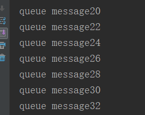
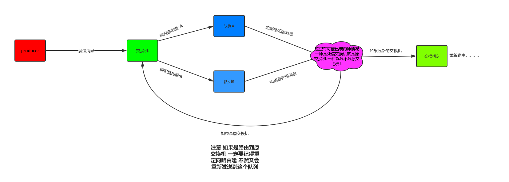

要保证消息发送成功，就要保证生产者发送消息到交换机中，还要保证消息从交换机发送到队列中。

如果使用事务，对性能的消耗很大。

## 如何确定消息发送到了交换机

### 发送方确认

确认消息到达了交换机

1.在发送方开启消息确认

```java
@Bean
public ConnectionFactory connectionFactory() {
    CachingConnectionFactory cachingConnectionFactory
        = new CachingConnectionFactory("192.168.188.128", 5672);
    cachingConnectionFactory.setUsername("ly");
    cachingConnectionFactory.setPassword("ly");
    cachingConnectionFactory.setVirtualHost("testhost");
    // 是否开启消息确认机制
    cachingConnectionFactory.setPublisherConfirms(true);
    return  cachingConnectionFactory;
}
```

在yml文件中这样配置

```yml
spring:
  rabbitmq:
    publisher-confirms: true
```

在发送方中声明`redisTempalate`的时候加入回调

```java
@Bean
public RabbitTemplate rabbitTemplate() {
    RabbitTemplate rabbitTemplate = new RabbitTemplate();
    rabbitTemplate.setConnectionFactory(connectionFactory());
    // 发送方确认回调
    rabbitTemplate.setConfirmCallback((crrelationData, ack, cause) -> {
        // crrelationData 可以发送业务id
        // ack 消息是否发送成功
        // cause 失败的原因
    });
    return rabbitTemplate;
}
```

可以通过spring的方式来模拟失败的情况

````java
public static void main(String[] args) {
    AnnotationConfigApplicationContext context
        = new AnnotationConfigApplicationContext(RabbitmqConfig.class);
    RabbitmqMessageSend bean 
        = context.getBean(RabbitmqMessageSend.class);
    bean.sendMessage("", "", "");
    context.close();
}
````

### 失败回调

在消息从交换机到达队列的时候，如果失败了会调用一个失败回调方法

1. 同样的需要打开消息确认的功能，在发送方生成连接的时候打开

   ```java
    // 是否开启消息确认机制
   cachingConnectionFactory.setPublisherConfirms(true);
   ```

2. 同样在`发送方`的`rabbittemplate`的地方加入回调方法

   ```java
   // 开启失败回调
   rabbitTemplate.setMandatory(true);
   rabbitTemplate.setReturnCallback(new RabbitTemplate.ReturnCallback() {
       @Override
       public void returnedMessage(Message message, int replyCode, String replyText, String exchange, String routeKey) {
           // message：发送的消息和消息的配置
           // replayCode：状态码
           // replayText: 失败的信息
           // exchange:  交换机
           // routeKey: 路由键
       }
   });
   ```

除了失败回调，`rabbitmq`还提供了一个备用交换机方案来解决这个问题，那么怎么声明呢？

```java
// 声明交换机
@Bean
public DirectExchange defaultExchange() {
    Map<String, Object> map  = new HashMap<>();
    // 声明备用交换机
    map.put("alternate-exchange", "exchangeTest");
    return new DirectExchange("directExchange", false/*是否持久化*/, false/*是否自动删除*/, map);
}
```

在声明交换机的时候附带一个备用交换机,一般备用交换机是fanout的类型，只要绑定了就会发送消息到队列上。`如果备用交换机失败了才会调用失败回调`

```
如果有备用交换机，不会管主要交换机绑定与否，只要备用交换机绑定就好了
```

```
发送方确认模式一般也会和失败回调一起使用 这样 就能确保消息100%投递了
```

## 发送消息

如果要发送一个对象怎么办？

如果使用spring boot 自己的序列化挺没有用的，我们采用`fastjson`来发送对象

发送一个map对象

````java
public void sendMessage(String message, String routingKey, String name) {
    // 发送map
    Map<String, Object> messageMap = new HashMap<String, Object>();
    messageMap.put("name", "123");
    messageMap.put("password", "123456");
    rabbitTemplate.convertAndSend(name, routingKey, JSON.toJSONString(messageMap));
}
````

在消费方可以通过``JSON.Parse()``来转换回原来的map

如何去定义一个消息转换器

```java
// 声明消息转换器
rabbitTemplate.setMessageConverter(new MessageConverter() {
    // 发送时需要转换的
    @Override
    public Message toMessage(Object o, MessageProperties messageProperties) throws MessageConversionException {
        // 传送消息是通过byte所以需要转换成byte
        Message message = new Message(JSON.toJSONBytes(o), messageProperties);
        return message;
    }
    // 接受消息的时候需要转换的
    @Override
    public Object fromMessage(Message message) throws MessageConversionException {
        return null;
    }
});
```

但是如果通过以下`消费者`的方式去接收的时候

```java
@RabbitListener(queues = "query1")
public void get(String message) throws Exception {
    System.out.println(message);
}
```

结果为`byte数组`

为什么是这样的结果？

出现这个问题是spring boot 给你转换了，下面我们要通过源码来分析为什么会出现这个问题

我们通过`方法的调用栈`来回头一步一步来找到对应的方法，我这儿就截取核心代码

通过调用的方法栈，回头一步一步发现在`SimpleMessageConverter`这个类下面的`fromMessage`方法来转换消息

```java
public Object fromMessage(Message message) throws MessageConversionException {
    Object content = null;
    MessageProperties properties = message.getMessageProperties();
    if (properties != null) {
        String contentType = properties.getContentType();
        // 如果这个contengType是文本的时候才转换
        if (contentType != null && contentType.startsWith("text")) {
            String encoding = properties.getContentEncoding();
            if (encoding == null) {
                encoding = this.defaultCharset;
            }

            try {
                content = new String(message.getBody(), encoding);
            } catch (UnsupportedEncodingException var8) {
                throw new MessageConversionException("failed to convert text-based Message content", var8);
            }
        } else if (contentType != null && contentType.equals("application/x-java-serialized-object")) {
            try {
                content = SerializationUtils.deserialize(this.createObjectInputStream(new ByteArrayInputStream(message.getBody()), this.codebaseUrl));
            } catch (IllegalArgumentException | IllegalStateException | IOException var7) {
                throw new MessageConversionException("failed to convert serialized Message content", var7);
            }
        }
    }
	// 什么条件都不满足，就直接返回content
    if (content == null) {
        content = message.getBody();
    }

    return content;
}
```

```
由上可见，如果消息的properties里面的contentType[上下文类型]是text或者application都会帮你转换，但是我们这儿的map不是这些类型所以就直接返回了，所以是byte数组
```

所以我们在发送消息的时候设置消息配置

````java
rabbitTemplate.setMessageConverter(new MessageConverter() {
    // 发送时需要转换的
    @Override
    public Message toMessage(Object o, MessageProperties messageProperties) throws MessageConversionException {
        // 传送消息是通过byte所以需要转换成byte
        messageProperties.setContentType("text/xml"); // 设置这一句
        Message message = new Message(JSON.toJSONBytes(o), messageProperties);
        return message;
    }
    // 接受消息的时候需要转换的
    @Override
    public Object fromMessage(Message message) throws MessageConversionException {
        return null;
    }
});
````

通过`messageProperties.setContentType("text/xml");`设置了上下文类型，就会进行一个`new Message()`的转换

## 消费端实战

在spring boot项目中声明消费者的时候是通过以下方式声明的

```java
@RabbitListener(queues = "query1")
public void get(String message) throws Exception {
    System.out.println(message);
}
```

**那么我们怎么动态添加监听？**

其实我们也可以使用一个bean的方式来进行声明

声明消费者监听器容器

````java
/**
 * 声明消费者监听器容器
 * @return
 */
@Bean
public SimpleMessageListenerContainer simpleMessageListenerContainer() {
    SimpleMessageListenerContainer container =
        new SimpleMessageListenerContainer();
    container.setConnectionFactory(connectionFactory());
    // 主要内容
    container.setMessageListener(new MessageListener() {
        @Override
        public void onMessage(Message message) {

        }
    });
    // 消费队列，可以是数组
    container.addQueueNames("testQueue", "testQueue1");
    // 也可以加入queue对象
    // container.addQueues();
    // 手动确认
    container.setAcknowledgeMode(AcknowledgeMode.MANUAL);
    // 还可以设置更多的东西....
    return simpleMessageListenerContainer();
}
````

**如果使用注解又怎么声明这么多的参数呢？**

我们可以通过声明bean的方式，然后通过注解的属性进行设置

````java
@Bean
public SimpleRabbitListenerContainerFactory simpleRabbitListenerContainerFactory() {
    SimpleRabbitListenerContainerFactory factory =
        new SimpleRabbitListenerContainerFactory();
    factory.setConnectionFactory(connectionFactory());
    // 设置手动确认
    factory.setAcknowledgeMode(AcknowledgeMode.MANUAL);
    return factory;
}
````

```java
@RabbitListener(queues = "testQueue", containerFactory = "simpleRabbitListenerContainerFactory")
public void getMessage(Message message) throws Exception {
    System.out.println(new String(message.getBody(), "UTF-8"));
}
```

**那么消息怎么手动确认？**

```java
@RabbitListener(queues = "testQueue", containerFactory = "simpleRabbitListenerContainerFactory")
public void getMessage(Message message, Channel channel) throws Exception {

    System.out.println(new String(message.getBody(), "UTF-8"));
    /**
         * 两个参数
         * 消息的唯一标识， 是否批量确认
         */
    channel.basicAck(message.getMessageProperties().getDeliveryTag(), false);
}
```

`可见可以通过加入参数来进行消息的手动确认，以及其他操作，这是SpringMVC的特性，判断你的方法是否有哪些参数，有就把对应的给你`

**有了消息确认就有消息退回**

````java
/**
  * 可以批量退回
  * 3个参数分别是消息的id，是否批量退回，是否重回队列
  */
channel.basicNack(message.getMessageProperties().getDeliveryTag(), false, true);
// 单条退回 消息的id 是否重回队列
channel.basicReject(message.getMessageProperties().getDeliveryTag(), true);
````

**那么消费者确认或者退回是选批量还是单条？**

最好选批量，批量的数字还是比较讲究，性能差距还是比较大

**`RabbitMQ`是怎么消费的？**

它是将所有的消息通过轮询的机制一条一条给所有的队列

**`RabbitMQ`是怎么将消息轮询上每个消费者的？**

它会在消费消息之前计算好那个消费者消费哪些消息？然后提前把这些消息一次性发送到对应的消费者让它们自己慢慢消费确认，如果消费者存在性能差异，那么性能好的也不会抢了性能慢的消息。这样会存在一个一直在忙一个一直在闲。如果能让闲的消费者来帮助忙的消费者处理消息那么处理速度要大大提升。这是需要使用到**消息预取**

## 消息预取

因为rabbit会提前将消息一次性发送的，所以会导致性能问题所引起的消费差异，况且一次性发送很多消息，消费者不一定能经受得住，所以可以采取消息预取方式让rabbit一次性发送几条消息等消费者消费完了再去发送剩下的几条

可以通过一个例子来模拟：

我往Rabbitmq生产100条消息 由2个消费者来消费 其中我们让一个消费者在消费的时候休眠0.5秒（模拟处理业务的延迟） 另外一个消费者正常消费 我们来看看效果：

正常的那个消费者会一瞬间吧所有消息（50条）全部消费完（因为我们计算机处理速度非常快） 下图是加了延迟的消费者：



我们可以发现其中一个消费者很快就处理完自己的消息了 另外一个消费者还在慢慢的处理 其实 这样严重影响了我们的性能了。

其实讲了这么多 那如何来解决这个问题呢？

我刚刚解释过了 造成这个原因的根本就是rabbitmq消息的发放机制导致的， 那么我们现在来讲一下解决方案: **消息预取**

什么是消息预取？ 讲白了以前是rabbitmq一股脑吧所有消息都均发给所有的消费者（不管你受不受得了） 而现在 是在我消费者消费之前 先告诉rabbitmq **我一次能消费多少数据** **等我消费完了之后告诉****rabbitmq**
rabbitmq再给我发送数据。

在代码中如何体现？

在使用消息预取前 要注意一定要设置为手动确认消息， 原因参考上面划重点的那句话。

````java
// 消费预取
channel.basicQos(1);
// 如果打开了消费预取，那么消费者必须要打开手动确认
channel.basicConsume(ConnectionUtil.QUEUE_NAME, false, deliverCallback);
````

也可以在消息监听容器里面定义

````java
@Bean
public SimpleRabbitListenerContainerFactory simpleRabbitListenerContainerFactory() {
    SimpleRabbitListenerContainerFactory factory =
        new SimpleRabbitListenerContainerFactory();
    factory.setConnectionFactory(connectionFactory());
    // 设置手动确认
    factory.setAcknowledgeMode(AcknowledgeMode.MANUAL);
    // 设置消息预取个数
    factory.setPrefetchCount(1);
    return factory;
}
````

关于这个预取的数量如何设置呢？ 我们发现如果设置为1 能极大的利用客户端的性能（我消费完了就可以赶紧消费下一条 不会导致忙的很忙 闲的很闲） 但是， 我们每消费一条消息 就要通知一次rabbitmq 然后再取出新的消息， 这样对于rabbitmq的性能来讲 是非常不合理的 所以这个参数要根据业务情况设置，我根据我查阅到的资料然后加以测试， 这个数值的大小与性能成正比 但是有上限，与数据可靠性，以及我们刚刚所说的客户端的利用率成反比 大概如下图：


那么批量确认， 就是对于我们预取的消息，进行统一的确认。

## 死信交换机

我们来看一段代码:

```java
channel.basicNack(message.getMessageProperties().getDeliveryTag(),false,true);
```

我们上面解释过 这个代码是消息处理失败的确认 然后第三个参数我有解释过是消息是否返回到原队列， 那么问题来了，如果 没有返回给原队列 那么这条消息就被作废了？ 

rabbitmq考虑到了这个问题提供了解决方案： **死信交换机**(有些人可能叫作垃圾回收器,垃圾交换机等) 

死信交换机有什么用呢？ 在创建队列的时候 可以给这个队列附带一个交换机， 那么这个队列作废的消息就会被重新发到附带的交换机，然后让这个交换机重新路由这条消息。

理论是这样， 代码如下：

````java
@Bean
public Queue queue() {
    Map<String,Object> map = new HashMap<>();
    // 设置消息的过期时间 单位毫秒
    map.put("x-message-ttl",10000);
    // 设置附带的死信交换机
    map.put("x-dead-letter-exchange","exchange.dlx");
    // 指定重定向的路由建 消息作废之后可以决定需不需要更改他的路由建 如果需要 就在这里指定
    map.put("x-dead-letter-routing-key","dead.order");
    return new Queue("testQueue", true, false, false, map);
}

````

大概是这样的一个效果：



其实我们刚刚发现 所谓死信交换机， 只是对应的队列设置了对应的交换机是死信交换机， 对于交换机来讲， 他还是一个普通的交换机 。

**代码测试死信交换机**

消息生产者：

`RabbitmqConfig`

```java
package com.rabbitmq.rabbitMQsend.config;

import org.springframework.amqp.core.Binding;
import org.springframework.amqp.core.BindingBuilder;
import org.springframework.amqp.core.DirectExchange;
import org.springframework.amqp.core.Queue;
import org.springframework.amqp.rabbit.connection.ConnectionFactory;
import org.springframework.amqp.rabbit.connection.CachingConnectionFactory;
import org.springframework.amqp.rabbit.core.RabbitTemplate;
import org.springframework.context.annotation.Bean;
import org.springframework.context.annotation.Configuration;

import java.util.HashMap;
import java.util.Map;

/**
 * Rabbit配置类
 */
@Configuration
public class RabbitmqConfig {

    @Bean
    public ConnectionFactory connectionFactory() {
        CachingConnectionFactory cachingConnectionFactory
                = new CachingConnectionFactory("192.168.46.129", 5672);
        cachingConnectionFactory.setUsername("ly");
        cachingConnectionFactory.setPassword("ly");
        // 是否开启消息确认机制
        cachingConnectionFactory.setPublisherConfirms(true);
        return  cachingConnectionFactory;
    }

    /**
     * 配置rabbitTempalte
     * 使用yml配置后这个RabbitTemplate不用配
     * @return
     */
    @Bean
    public RabbitTemplate rabbitTemplate() {
        RabbitTemplate rabbitTemplate = new RabbitTemplate();
        rabbitTemplate.setConnectionFactory(connectionFactory());
        return rabbitTemplate;
    }

    /**
     * 定义一个死信交换机
     * @return
     */
    @Bean
    public DirectExchange deadExchange() {
        DirectExchange directExchange = new DirectExchange("deadExchange");
        return directExchange;
    }

    /**
     * 定义一个普通交换机
     * @return
     */
    @Bean
    public DirectExchange directExchange() {
        DirectExchange directExchange = new DirectExchange("directExchange");
        return directExchange;
    }

    /**
     * 定义一个死信队列
     * @return
     */
    @Bean
    public Queue queue() {
        Map<String, Object> map = new HashMap<>();

        Queue queue = new Queue("deadQueue", true, false, false, map);
        return queue;
    }

    /**
     * 定义普通队列
     * @return
     */
    @Bean
    public Queue queue1() {
        Map<String, Object> map = new HashMap<>();
        // 设置消息的过期时间 单位毫秒
        map.put("x-message-ttl", 10000);
        // 设置附带的死信交换机
        map.put("x-dead-letter-exchange", "deadExchange");
        // 指定重定向的路由建 消息作废之后可以决定需不需要更改他的路由建 如果需要 就在这里指定
        map.put("x-dead-letter-routing-key", "dead.routingKey");
        Queue queue = new Queue("queue", true, false, false, map);
        return queue;
    }

    /**
     * 定义普通绑定
     * @return
     */
    @Bean
    public Binding binding1() {
        return BindingBuilder.bind(queue1()).to(directExchange()).with("test.routingKey");
    }

    /**
     * 定义一个绑定
     * 让死信队列和死信交换机
     * @return
     */
    @Bean
    public Binding binding() {
        return BindingBuilder.bind(queue()).to(deadExchange()).with("dead.routingKey");
    }

}
```

消费者：

```java
@Component
public class RabbitmqUtil {

    @RabbitListener(queues = "queue", containerFactory = "simpleRabbitListenerContainerFactory")
    public void getMessage(Message message, Channel channel) throws Exception {

        System.out.println(new String(message.getBody(), "UTF-8"));
        /**
         * 两个参数
         * 消息的唯一标识， 是否批量确认
         */
         // channel.basicAck(message.getMessageProperties().getDeliveryTag(), false);
        /**
         * 可以批量退回
         * 3个参数分别是消息的id，是否批量退回，是否重回队列
         */
        channel.basicNack(message.getMessageProperties().getDeliveryTag(), false, false);
        System.out.println("消息退回成功");
        // 单条退回 消息的id 是否重回队列
        // channel.basicReject(message.getMessageProperties().getDeliveryTag(), true);
    }

    @RabbitListener(queues = "deadQueue", containerFactory = "simpleRabbitListenerContainerFactory")
    public void getMessage1(Message message, Channel channel) throws Exception {
        System.out.println(new String(message.getBody(), "UTF-8"));
        channel.basicAck(message.getMessageProperties().getDeliveryTag(), false);
        System.out.println("消息消费成功");
    }

}
```

````
上面简单把生产者和消费者的核心代码贴了出来
如果消费者退回消息到死信交换机是自己的交换机会造成一个死循环
还有在测试的时候需要发送一条消息，定义的交换机和队列才会创建
````


下面会列出rabbitmq的常用配置：

队列配置：

| 参数名                    | 配置作用                           |
| ------------------------- | ---------------------------------- |
| x-dead-letter-exchange    | 死信交换机                         |
| x-dead-letter-routing-key | 死信消息重定向路由键               |
| x-expires                 | 队列在指定毫秒数后被删除           |
| x-ha-policy               | 创建HA队列                         |
| x-ha-nodes                | HA队列的分布节点                   |
| x-max-length              | 队列的最大消息数                   |
| x-message-ttl             | 毫秒为单位的消息过期时间，队列级别 |
| x-max-priority            | 最大优先值为255的队列优先排序功能  |

消息配置：

| 参数名           | 配置作用                                               |
| ---------------- | ------------------------------------------------------ |
| content-type     | 消息体的MIME类型，如application/json                   |
| content-encoding | 消息的编码类型                                         |
| message-id       | 消息的唯一性标识，由应用进行设置                       |
| correlation-id   | 一般用做关联消息的message-id，常用于消息的响应         |
| timestamp        | 消息的创建时刻，整形，精确到秒                         |
| expiration       | 消息的过期时刻， 字符串，但是呈现格式为整型，精确到秒  |
| delivery-mode    | 消息的持久化类型，1为非持久化，2为持久化，性能影响巨大 |
| app-id           | 应用程序的类型和版本号                                 |
| user-id          | 标识已登录用户，极少使用                               |
| type             | 消息类型名称，完全由应用决定如何使用该字段             |
| reply-to         | 构建回复消息的私有响应队列                             |
| headers          | 键/值对表，用户自定义任意的键和值                      |
| priority         | 指定队列中消息的优先级                                 |