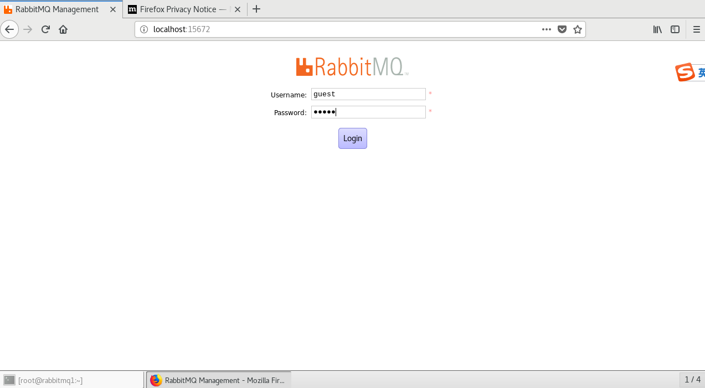
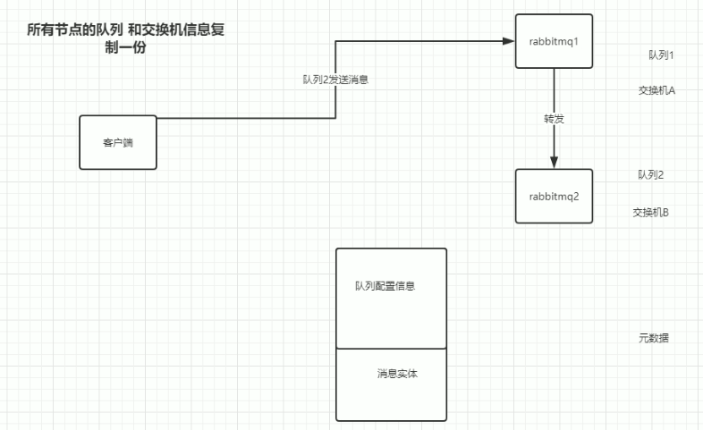
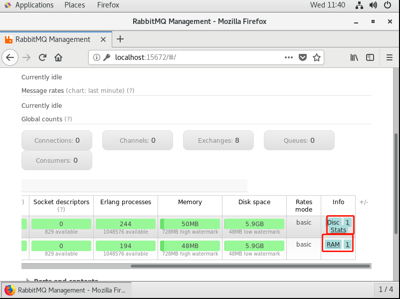
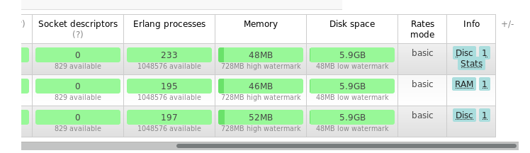
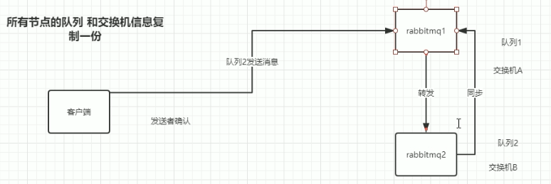

## linux下RabbitMQ的安装

这儿采用的是ceontos7的版本：`CentOS-7-x86_64-DVD-1810.iso`，虚拟机采用的是`VMware Workstation Pro 12`

安装过后，我们安装最基础的依赖

````
yum install build-essential openssl openssl-deve unixODBC unixODBC-devel
````

```
yum install gcc-c++
```

1. 关闭防火墙

   ```
   systemctl stop firewalld.service
   ```

   禁止开机自启

   ````java
   systemctl disable firewalld.service
   ````

2. 安装erlang

   ````java
   wget http://www.rabbitmq.com/releases/erlang/erlang-19.0.4-1.el7.centos.x86_64.rpm
   ````

   ```java
   rpm -ivh erlang-19.0.4-1.el7.centos.x86_64.rpm
   ```

3. 安装rabbitmq

   安装完erlang之后 开始rabbitmq 还是再提醒一下 先装erlang 再装rabbitmq

   装Rabbitmq之前 先装一个公钥 :

   ```java
   rpm --import https://dl.bintray.com/rabbitmq/Keys/rabbitmq-release-signing-key.asc
   ```

   装好公钥之后 下载Rabbitmq

   ```java
   wget http://www.rabbitmq.com/releases/rabbitmq-server/v3.6.6/rabbitmq-server-3.6.6-1.el7.noarch.rpm 
   ```

   安装:

   ````java
   rpm -ivh rabbitmq-server-3.6.6-1.el7.noarch.rpm
   ````

   安装rabbitmq的时候提醒安装socat

   ````java
   yum install socat
   ````

4. 启动rabbitmq

   ````java
   service rabbitmq-server start
   ````

   和windows环境下一样 rabbitmq对于linux也提供了他的管理插件 

   安装rabbitmq管理插件:

   ````java
   rabbitmq-plugins enable rabbitmq_management
   ````

   安装完管理插件之后 如果有装了浏览器的话 比如火狐 可以和windows一样 访问 一下 localhost:15672 可以看到一个熟悉的页面：

   

## rabbitmq集群搭建，配置

rabbbitmq由于是由erlang语言开发的 天生就支持分布式

rabbitmq 的集群分两种模式 一种是**默认模式** 一种是**镜像模式**

**当然 所谓的镜像模式是基于默认模式加上一定的配置来的**

在rabbitmq集群当中 所有的节点（一个rabbitmq服务器） 会被归为两类 一类是磁盘节点 一类是内存节点

磁盘节点会把集群的所有信息(比如交换机,队列等信息)持久化到磁盘当中，而内存节点只会将这些信息保存到内存当中 讲白了 重启一遍就没了。

为了可用性考虑 rabbitmq官方强调集群环境至少需要有一个磁盘节点， 而且为了高可用的话， 必须至少要有2个磁盘节点， 因为如果只有一个磁盘节点 而刚好这唯一的磁盘节点宕机了的话， 集群虽然还是可以运作， 但是不能对集群进行任何的修改操作（比如 队列添加，交换机添加，增加/移除 新的节点等）

### 集群普通模式

**在集群中RabbitMq消息是怎么流转的？**

如果有两台rabbitmq配置成为了集群，那么它们的**所有节点的队列和交换机信息都会复制一份**，简单来说就是rabbitmq1里面有rabbitmq2里面的交换机和队列信息，但是在普通模式下，**队列信息只是复制了队列的配置信息（元数据），具体的消息实体没有被复制**，如果一个客户端连接到rabbitmq1并且向rabbitmq2的队列发送消息，rabbitmq1会根据元数据来判断队列2在rabbitmq2里面，然后rabbitmq1会进行一个转发，让消息成功投递到rabbitmq2的队列2上。



#### 普通模式安装

这里我们模拟3个节点的集群，分别是rabbitmq、rabbitmq1、rabbitmq2

首先在VMware上面拍摄快照，通过快照进行完整克隆。

为了要构建集群，需要保证3个节点上面的`.erlang.cookie`文件一致，文件地址为：`/var/lib/rabbitmq/.erlang.cookie`

这儿因为是克隆，所以文件是一致的。

**设置hostname**

rabbitmq的节点名称是根据linux的hostname来的，为了保证3个节点能互相ping通，我们需要修改节点名字。

````java
hostnamectl set-hostname rabbitmq1 
````

```java
hostnamectl set-hostname rabbitmq2 
```

hostname修改了不会立即生效，需要我们重启虚拟机。

为了保证每个节点能互相ping通，我们修改host文件

````
vim /etc/hosts
````

````java
::1         localhost localhost.localdomain localhost6 localhost6.localdomain6
// 添加以下内容，需要每一个节点都添加一遍
192.168.46.131 rabbitmq
192.168.46.132 rabbitmq1
192.168.46.133 rabbitmq2

````

修改了之后3个节点能互相ping通

#### 集群构建

我们先让rabbitmq1 加入 rabbitmq与它构建为一个集群

1. 执行命令( ram:使rabbitmq2成为一个内存节点 默认为:disk
   磁盘节点)

   1. 首先需要确保集群节点的rabbitmq服务是打开的。

   2. 还要关闭rabbitmq1节点的应用

      ```
      rabbitmqctl stop_app
      ```

   3. 加入集群

      ````java
      // --ram代表内存节点，默认是磁盘节点
      rabbitmqctl join_cluster rabbit@rabbitmq --ram
      ````

   4. 开启应用

      ```java
      rabbitmqctl start_app
      ```

      

2. 查看管控台

   ram代表内存节点，disc代表磁盘节点

   

3. 同样的将rabbitmq2节点加入集群

   在rabbitmq2节点上执行以下命令

   ````java
   rabbitmqctl stop_app
   // 为了保证集群的高可用，通常需要2个磁盘节点，所以这儿没有加--ram
   rabbitmqctl join_cluster rabbit@rabbitmq
   rabbitmqctl start_app
   ````

   

   **为什么最少要定义两个磁盘节点？**

   如果一个挂了，那么整个集群只能访问，不能做任何持久化的操作。

4. 代码测试

   1. 创建2个消费者

      1. `ConsumerRabbitmq`

         ````java
         package com.rabbitmq.policy;
         
         import com.rabbitmq.client.*;
         
         import java.io.IOException;
         import java.util.concurrent.TimeoutException;
         
         /**
          * 创建集群消费者1-> rabbitmq
          */
         public class ConsumerRabbitmq {
         
             public static Connection getConnection() throws IOException, TimeoutException {
                 ConnectionFactory connetionFactory = new ConnectionFactory();
                 connetionFactory.setUsername("admin");
                 connetionFactory.setPassword("admin");
                 connetionFactory.setHost("192.168.46.131");
                 connetionFactory.setChannelRpcTimeout(100000);
                 connetionFactory.setConnectionTimeout(100000);
                 connetionFactory.setHandshakeTimeout(100000);
                 connetionFactory.setShutdownTimeout(100000);
                 return connetionFactory.newConnection();
             }
         
             public static void main(String[] args) throws IOException, TimeoutException {
                 Connection connection = getConnection();
                 Channel channel = connection.createChannel();
                 channel.queueDeclare("rabbitmq_queue", true, false, false, null);
                 DefaultConsumer deliverCallback = new DefaultConsumer(channel) {
                     /**
                      * 重写方法，获取消息
                      * @param consumerTag 消费者标识
                      * @param envelope 可以获取发送方标识、routeKey、交换机
                      * @param properties 消息属性，包括编码或者其他
                      * @param body 消息主体 发送过来也是一个byte数组
                      * @throws IOException
                      */
                     @Override
                     public void handleDelivery(String consumerTag, Envelope envelope, AMQP.BasicProperties properties, byte[] body) throws IOException {
                         System.out.println(new String(body, "UTF-8"));
                     }
                 };
                 channel.basicConsume("rabbitmq_queue", true,  deliverCallback);
             }
         }
         ````

      2. `ConsumerRabbitmq1`

         ```java
         package com.rabbitmq.policy;
         
         import com.rabbitmq.client.*;
         import com.rabbitmq.util.ConnectionUtil;
         
         import java.io.IOException;
         import java.util.concurrent.TimeoutException;
         
         /**
          * 创建集群消费者2-> rabbitmq1
          */
         public class ConsumerRabbitmq1 {
         
             public static Connection getConnection() throws IOException, TimeoutException {
                 ConnectionFactory connetionFactory = new ConnectionFactory();
                 connetionFactory.setUsername("admin");
                 connetionFactory.setPassword("admin");
                 connetionFactory.setHost("192.168.46.132");
                 connetionFactory.setChannelRpcTimeout(100000);
                 connetionFactory.setConnectionTimeout(100000);
                 connetionFactory.setHandshakeTimeout(100000);
                 connetionFactory.setShutdownTimeout(100000);
                 return connetionFactory.newConnection();
             }
         
             public static void main(String[] args) throws IOException, TimeoutException {
                 Connection connection = getConnection();
                 Channel channel = connection.createChannel();
                 channel.queueDeclare("rabbitmq_queue1", true, false, false, null);
                 DefaultConsumer deliverCallback = new DefaultConsumer(channel) {
                     /**
                      * 重写方法，获取消息
                      * @param consumerTag 消费者标识
                      * @param envelope 可以获取发送方标识、routeKey、交换机
                      * @param properties 消息属性，包括编码或者其他
                      * @param body 消息主体 发送过来也是一个byte数组
                      * @throws IOException
                      */
                     @Override
                     public void handleDelivery(String consumerTag, Envelope envelope, AMQP.BasicProperties properties, byte[] body) throws IOException {
                         System.out.println(new String(body, "UTF-8"));
                     }
                 };
                 channel.basicConsume("rabbitmq_queue1", true, deliverCallback);
             }
         }
         ```

   2. 创建发送者

      ````java
      package com.rabbitmq.policy;
      
      import com.rabbitmq.client.Channel;
      import com.rabbitmq.client.Connection;
      import com.rabbitmq.client.ConnectionFactory;
      
      import java.io.IOException;
      import java.util.concurrent.TimeoutException;
      
      /**
       * 消息
       */
      public class ProducerRabbitmq1 {
      
          public static Connection getConnection() throws IOException, TimeoutException {
              ConnectionFactory connetionFactory = new ConnectionFactory();
              connetionFactory.setUsername("admin");
              connetionFactory.setPassword("admin");
              connetionFactory.setHost("192.168.46.131");
              connetionFactory.setChannelRpcTimeout(100000);
              connetionFactory.setConnectionTimeout(100000);
              connetionFactory.setHandshakeTimeout(100000);
              connetionFactory.setShutdownTimeout(100000);
              return connetionFactory.newConnection();
          }
      
          public static void main(String[] args) throws IOException, TimeoutException {
              Connection connection = getConnection();
              Channel channel = connection.createChannel();
              // 给两个队列分别发送消息
              channel.basicPublish(
                      "", // 调用默认交换机
                      "rabbitmq_queue",
                      null, // 消息配置，暂时设置为空
                      "Hello World1".getBytes() // 发送的数据
              );
              channel.basicPublish(
                      "",
                      "rabbitmq_queue1",
                      null, // 消息配置，暂时设置为空
                      "Hello World2".getBytes() // 发送的数据
              );
          }
      }
      ````

      `可见，只是连接到rabbitmq的节点`

   3. 测试

      结果显示，rabbitmq1节点的队列`rabbitmq_queue1`也被监听到了消息，集群配置成功

   

### 集群镜像队列模式

在普通模式下的rabbitmq集群 他会把所有节点的交换机信息 和队列的元数据(队列数据分为两种 一种为队列里面的消息， 另外一种是队列本身的信息 比如队列的最大容量，队列的名称，等等配置信息， 后者称之为元数据) 进行复制 确保所有节点都有一份。

而镜像模式，则是把所有的队列数据完全同步（当然 对性能肯定会有一定影响） 当对数据可靠性要求高时 可以使用镜像模式



````
镜像队列模式内部会维护master和slave模式
````

```
slave会准确地按照master执行命令的顺序进行命令执行，故slave与master上维护的状态应该是相同的。除了publish外所有动作都只会向master发送，然后由master将命令执行的结果广播给slave们，故看似从镜像队列中的消费操作实际上是在master上执行的。
```

```
简单来说，镜像队列机制就是将队列在三个节点之间设置主从关系，消息会在三个节点之间进行自动同步，且如果其中一个节点不可用，并不会导致消息丢失或服务不可用的情况，提升MQ集群的整体高可用性。
```

声明：

1. 可以通过代码进行声明

   ````java
   Map<String, Object> map = new HashMap<String, Object>();
   // 参数有all【所有节点】，exc【指定个数】， nodes
   map.put("x-ha-policy", "nodes"); // 对指定节点进行镜像队列的创建
   map.put("x-ha-nodes", "[rabbit@rabbitmq, rabbit@rabbitmq1]"); // HA队列的分布节点
   channel.queueDeclare("rabbitmq_queue", true, false, false, map);
   ````

2. 通过命令方式声明

   `rabbitmqctl set_policy [-p Vhost] Name Pattern Definition [Priority]`

   ​	`-p Vhost`：可选参数，针对指定vhost下的queue进行设置 

   ​	`Name:` policy的名称 

   ​	`Pattern`: queue的匹配模式(正则表达式) 

   ​	`Definition`：镜像定义，包括三个部分ha-mode, ha-params, ha-sync-mode

    	`ha-mode`:指明镜像队列的模式，有效值为 all/exactly/nodes  

   ​	`all`：表示在集群中所有的节点上进行镜像 

   ​	`exactly`：表示在指定个数的节点上进行镜像，节点的个数由ha-params指定  
   ​	`nodes`：表示在指定的节点上进行镜像，节点名称通过ha-params指定**  	`ha-params`：ha-mode模式需要用到的参数  

   ​	`ha-sync-mode`：进行队列中消息的同步方式，有效值为automatic和manual

   这里举个例子 如果想配置所有名字开头为 policy的队列进行镜像 镜像数量为1那么命令如下:

   ```
   rabbitmqctl setpolicy hapolicy "^policy_" '{"ha-mode":"exactly","ha-params":1,"ha-sync-mode":"automatic"}'
   ```

3. 

## 镜像队列网络资料

分析一下，RabbitMQ集群搭建完成后，如果不进行任何高可用配置，会有哪些**问题**呢？

单点故障会导致消息丢失：如果MQ03节点故障，那么MQ03 中的消息就会丢失

无法最大化的利用MQ提供，提升执行效率：既然每次发送到队列testQueue的消息都会在MQ03节点存储，那么何必搭建集群。

引入RabbitMQ的镜像队列机制，将queue镜像到cluster中其他的节点之上。在该实现下，如果集群中的一个节点失效了，queue能自动地切换到镜像中的另一个节点以保证服务的可用性。在通常的用法中，针对每一个镜像队列都包含一个master和多个slave，分别对应于不同的节点。slave会准确地按照master执行命令的顺序进行命令执行，故slave与master上维护的状态应该是相同的。**除了publish外所有动作都只会向master发送，然后由master将命令执行的结果广播给slave**们，故看似从镜像队列中的消费操作实际上是在master上执行的。

一旦完成了选中的slave被提升为master的动作，发送到镜像队列的message将不会再丢失：publish到镜像队列的所有消息总是被直接publish到master和所有的slave之上。这样一旦master失效了，message仍然可以继续发送到其他slave上。

简单来说，镜像队列机制就是将队列在三个节点之间设置主从关系，消息会在三个节点之间进行自动同步，且如果其中一个节点不可用，并不会导致消息丢失或服务不可用的情况，提升MQ集群的整体高可用性。

先来看下设置镜像队列后的效果： 镜像队列会出现+2标识。


**1.设置队列为镜像队列：How**

 两种方式：

通过监控面板设置


通过命令设置


rabbitmqctl set_policy [-p Vhost] Name Pattern Definition [Priority]

-p Vhost： 可选参数，针对指定vhost下的queue进行设置

Name: policy的名称

Pattern: queue的匹配模式(正则表达式)

Definition：镜像定义，包括三个部分ha-mode, ha-params, ha-sync-mode

​        ha-mode:指明镜像队列的模式，有效值为 all/exactly/nodes

​        all：表示在集群中所有的节点上进行镜像

​        exactly：表示在指定个数的节点上进行镜像，节点的个数由ha-params指定

​        nodes：表示在指定的节点上进行镜像，节点名称通过ha-params指定

​        ha-params：ha-mode模式需要用到的参数

​        ha-sync-mode：进行队列中消息的同步方式，有效值为automatic和manual

priority：可选参数，policy的优先级

 请注意一个事实，镜像配置的pattern 采用的是正则表达式匹配，也就是说会匹配一组。

**RabbitMQ集群节点失效，MQ处理策略**：

如果某个slave失效了，系统处理做些记录外几乎啥都不做：master依旧是master，客户端不需要采取任何行动，或者被通知slave失效。

如果master失效了，那么slave中的一个必须被选中为master。**被选中作为新的master的slave通常是最老的那个**，因为最老的slave与前任master之间的同步状态应该是最好的。然而，特殊情况下，**如果存在没有任何一个slave与master完全同步的情况，那么前任master中未被同步的消息将会丢失。**

**镜像队列消息的同步：**

​     将新节点加入已存在的镜像队列时，默认情况下ha-sync-mode=manual，镜像队列中的消息不会主动同步到新节点，除非显式调用同步命令。当调用同步命令后，队列开始阻塞，无法对其进行操作，直到同步完毕。当ha-sync-mode=automatic时，新加入节点时会默认同步已知的镜像队列。由于同步过程的限制，所以不建议在生产的active队列（有生产消费消息）中操作。

rabbitmqctl list_queues name slave_pids synchronised_slave_pids  查看那些slaves已经完成同步

rabbitmqctl sync_queue name    手动的方式同步一个queue

rabbitmqctl cancel_sync_queue name 取消某个queue的同步功能

以上针对消息同步的命令，均可以通过监控界面来进行操作，最终也是通过这些操作命令执行。

说明：

镜像队列不是负载均衡，镜像队列无法提升消息的传输效率，或者更进一步说，由于镜像队列会在不同节点之间进行同步，会消耗消息的传输效率。

对exclusive队列设置镜像并不会有任何作用，因为exclusive队列是连接独占的，当连接断开，队列自动删除。所以实际上这两个参数对exclusive队列没有意义。那么有哪些队列是exclusive呢？一般来说，发布订阅队列及设置了该参数的队列都是exclusive 排他性队列。 如何确定一个队列是不是排他性队列呢？ 如果队列的features包含Excl，就代表它是排他性队列。


 **镜像队列中某个节点宕掉的后果：**

  当slave宕掉了，除了与slave相连的客户端连接全部断开之外，没有其他影响。

   当master宕掉时，会有以下连锁反应：

\1. 与master相连的客户端连接全部断开；

2.选举最老的slave节点为master。若此时所有slave处于未同步状态，则未同步部分消息丢失；

3.新的master节点requeue所有unack消息，在此我向大家推荐一个架构学习交流圈：830478757  帮助突破瓶颈 提升思维能力,因为这个新节点无法区分这些unack消息是否已经到达客户端，亦或是ack消息丢失在老的master的链路上，亦或者是丢在master组播ack消息到所有slave的链路上。所以处于消息可靠性的考虑，requeue所有unack的消息。此时客户端可能有重复消息；

4.如果客户端连着slave，并且Basic.Consume消费时指定了x-cancel-on-ha-failover参数，那么客户端会受到一个Consumer Cancellation Notification通知。如果未指定x-cancal-on-ha-failover参数，那么消费者就无法感知master宕机，会一直等待下去。

这就告诉我们，集群中存在镜像队列时，重新master节点有风险。

**镜像队列中节点启动顺序，非常有讲究：** 

假设集群中包含两个节点，一般生产环境会部署三个节点，但为了方便说明，采用两个节点的形式进行说明。

**场景1：A先停，B后停**

该场景下B是master，只要先启动B，再启动A即可。或者先启动A，再在30s之内启动B即可恢复镜像队列。（**如果没有在30s内回复B，那么A自己就停掉自己**）

**场景2：A，B同时停**

该场景下可能是由掉电等原因造成，只需在30s内联系启动A和B即可恢复镜像队列。

**场景3：A先停，B后停，且A无法恢复。**

因为B是master，所以等B起来后，在B节点上调用rabbitmqctl forget_cluster_node A以接触A的cluster关系，再将新的slave节点加入B即可重新恢复镜像队列。

**场景4：A先停，B后停，且B无法恢复**

该场景比较难处理，旧版本的RabbitMQ没有有效的解决办法，在现在的版本中，因为B是master，所以直接启动A是不行的，当A无法启动时，也就没版本在A节点上调用rabbitmqctl forget_cluster_node B了，新版本中forget_cluster_node支持-offline参数，offline参数允许rabbitmqctl在离线节点上执行forget_cluster_node命令，迫使RabbitMQ在未启动的slave节点中选择一个作为master。当在A节点执行rabbitmqctl forget_cluster_node -offline B时，RabbitMQ会mock一个节点代表A，执行forget_cluster_node命令将B提出cluster，然后A就能正常启动了。最后将新的slave节点加入A即可重新恢复镜像队列

**场景5：A先停，B后停，且A和B均无法恢复，但是能得到A或B的磁盘文件**

这个场景更加难以处理。将A或B的数据库文件（$RabbitMQ_HOME/var/lib目录中）copy至新节点C的目录下，再将C的hostname改成A或者B的hostname。如果copy过来的是A节点磁盘文件，按场景4处理，如果拷贝过来的是B节点的磁盘文件，按场景3处理。最后将新的slave节点加入C即可重新恢复镜像队列。

场景6：A先停，B后停，且A和B均无法恢复，且无法得到A和B的磁盘文件

无解。

启动顺序中有一个30s 的概念，这个是MQ 的时间间隔，用于检测master、slave是否可用，因此30s 非常关键。

 对于生产环境MQ集群的重启操作，需要分析具体的操作顺序，不可无序的重启，会有可能带来无法弥补的伤害(数据丢失、节点无法启动)。

简单总结下：**镜像队列是用于节点之间同步消息的机制，避免某个节点宕机而导致的服务不可用或消息丢失，且针对排他性队列设置是无效的。另外很重要的一点，镜像队列机制不是负载均衡。**

