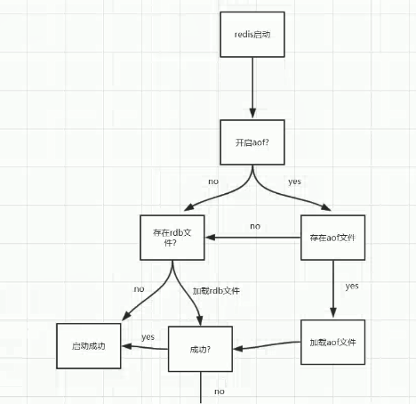
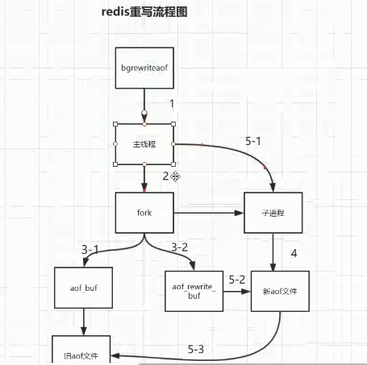

# redis

## redis是什么?

是完全开源免费的，用c语言编写的，是一个单线程，高性能的（key/value）内存数据库，基于内存运行并支持持久化的nosql数据库

## redis能干嘛？

主要是用来做缓存，但不仅仅只能做缓存，比如：redis的计数器生成分布式唯一主键，redis实现分布式锁，队列，会话缓存。

## redis去哪下？

官网，也可以通过Linux  yum直接下载安装

## redis怎么玩？

1. 安装
2. redis数据类型（api操作）
3. redis配置文件解析
4. redis的持久化
5. redis的事务
6. redis的发布订阅7.java客户端操作（jedis）

## redis的安装

1. 解压

   ```
   tar -zxvf xxxx
   ```

2. 编译
  使用`make`命令，如果make报错的话，可以看一下是不是报没有gcc的错，如果是报没有gcc的错，那就要先安装一个gcc：

  `yum install gcc-c++`  

  安装好gcc之后最好执行一下``make distclean`` 因为前面make的时候它执行了一些东西，要先把他清掉。

3. ``make install``

   执行`make install`命令，查看redis默认安装位置在`/usr/local/bin`目录下

5. 启动

   `/usr/local/bin/redis-server xxx/x/redis.conf`

6. 登录客户端

   `/usr/local/bin/redis-cli -h 127.0.0.1 -p 6379 -a password`

## Redis配置文件

````properties
# 配置大小单位,开头定义了一些基本的度量单位，只支持bytes，不支持bit  对大小写不敏感
# 1k => 1000 bytes
# 1kb => 1024 bytes
# 1m => 1000000 bytes
# 1mb => 1024*1024 bytes
# 1g => 1000000000 bytes
# 1gb => 1024*1024*1024 bytes
#
# units are case insensitive so 1GB 1Gb 1gB are all the same.

# 引入其他文件
# include /path/to/local.conf
# include /path/to/other.conf

# 绑定Ip   指定可以连接本实例Redis的ip  如果注释（删掉）则任意IP都可以连接
bind 127.0.0.1
#禁止外网访问redis，如果启用了，即使注释掉了bind 127.0.0.1，再访问redisd时候还是无法连接的
#它启用的条件有两个，第一是没有使用bind，第二是没有设置访问密码。
protected-mode yes
#指定Redis的端口
port 6379
# 此参数确定了TCP连接中已完成队列(完成三次握手之后)的长度， 
# 当然此值必须不大于Linux系统定义的/proc/sys/net/core/somaxconn值，默认是511，
# 而Linux的默认参数值是128。当系统并发量大并且客户端速度缓慢的时候，可以将这二个参数一起参考设定。
# 在高并发环境下你需要一个高backlog值来避免慢客户端连接问题
tcp-backlog 511
# 当客户端闲置多长时间后关闭连接，如果指定为0，表示关闭该功能
timeout 0
# 设置多长时间检测死连接 单位为秒，如果设置为0，则不会进行Keepalive检测
tcp-keepalive 300
# 是否以守护进程启动
daemonize no
#可以通过upstart和systemd管理Redis守护进程，这个参数是和具体的操作系统相关的。
supervised no
#当Redis以守护进程方式运行时，Redis默认会把pid写入/var/run/redis.pid文件，可以通过pidfile指定
pidfile /var/run/redis_6379.pid
#设置日志的级别  debug、verbose、notice、warning，默认为verbose
loglevel notice
#日志文件的位置，当指定为空字符串时，为标准输出，如果redis已守护进程模式运行，那么日志将会输出到  /dev/null 。
logfile ""
# 设置数据库的数目。默认的数据库是DB 0 ，可以在每个连接上使用select  <dbid> 命令选择一个不同的数据库，dbid是一个介于0到databases - 1 之间的数值。
databases 16
# 指定在多长时间内，有多少次更新操作，就将数据同步到数据文件，可以多个条件配合
# 这里表示900秒（15分钟）内有1个更改，300秒（5分钟）内有10个更改以及60秒内有10000个更改
# 如果想禁用RDB持久化的策略，只要不设置任何save指令，或者给save传入一个空字符串参数也可以
save 900 1
save 300 10
save 60 10000
# 默认情况下，如果 redis 最后一次的后台保存失败，redis 将停止接受写操作，这样以一种强硬的方式让用户知道数据不能正确的持久化到磁盘， 
# 否则就会没人注意到灾难的发生。 如果后台保存进程重新启动工作了，redis 也将自动的允许写操作。
# 如果配置成no，表示你不在乎数据不一致或者有其他的手段发现和控制
stop-writes-on-bgsave-error yes
# 对于存储到磁盘中的快照(rdb)，可以设置是否进行压缩存储。如果是的话，redis会采用
# LZF算法进行压缩。如果你不想消耗CPU来进行压缩的话，可以设置为关闭此功能
rdbcompression yes
# 在存储快照后，还可以让redis使用CRC64算法来进行数据校验，但是这样做会增加大约
# 10%的性能消耗，如果希望获取到最大的性能提升，可以关闭此功能
rdbchecksum yes
#rdb文件的名字。
dbfilename dump.rdb
# dbfilename文件存放目录。必须是一个目录，aof文件也会保存到该目录下。
dir ./
#设置当本机为slave服务时，设置master服务的IP地址及端口，在Redis启动时，它会自动从master进行数据同步
# replicaof <masterip> <masterport>
#当master服务设置了密码保护时，slave服务连接master的密码
# masterauth <master-password>
#当一个slave与master失去联系时，或者复制正在进行的时候，slave应对请求的行为: 
#如果为 yes（默认值） ，slave 仍然会应答客户端请求，但返回的数据可能是过时，或者数据可能是空的在第一次同步的时候
#如果为 no ，在你执行除了 info 和 salveof 之外的其他命令时，slave 都将返回一个 "SYNC with master in progress" 的错误。
replica-serve-stale-data yes
#设置slave是否是只读的。从2.6版起，slave默认是只读的。
replica-read-only yes
# 主从数据复制是否使用无硬盘复制功能。
repl-diskless-sync no
# 指定slave定期ping master的周期，默认10秒钟。
# repl-ping-replica-period 10

#设置主库批量数据传输时间或者ping回复时间间隔，默认值是60秒 。
# repl-timeout 60

#指定向slave同步数据时，是否禁用socket的NO_DELAY选项。
#若配置为“yes”，则禁用NO_DELAY，则TCP协议栈会合并小包统一发送，这样可以减少主从节点间的包数量并节省带宽，但会增加数据同步到 slave的时间。
#若配置为“no”，表明启用NO_DELAY，则TCP协议栈不会延迟小包的发送时机，这样数据同步的延时会减少，但需要更大的带宽。 
#通常情况下，应该配置为no以降低同步延时，但在主从节点间网络负载已经很高的情况下，可以配置为yes。
repl-disable-tcp-nodelay no
# 设置主从复制backlog容量大小。这个 backlog 是一个用来在 slaves 被断开连接时存放 slave 数据的 buffer，
# 所以当一个 slave 想要重新连接，通常不希望全部重新同步，只是部分同步就够了，仅仅传递 slave 在断开连接时丢失的这部分数据。
# 这个值越大，salve 可以断开连接的时间就越长。
# repl-backlog-size 1mb

#配置当master和slave失去联系多少秒之后，清空backlog释放空间。当配置成0时，表示永远不清空。
# repl-backlog-ttl 3600

#当 master 不能正常工作的时候，Redis Sentinel 会从 slaves 中选出一个新的 master，这个值越小，就越会被优先选中，但是如果是 0 ， 那是意味着这个 slave 不可能被选中。 默认优先级为 100。
replica-priority 100

# 设置Redis连接密码，如果配置了连接密码，客户端在连接Redis时需要通过AUTH <password>命令提供密码，默认关闭
# requirepass foobared

#设置同一时间最大客户端连接数，Redis可以同时打开的客户端连接数为Redis进程可以打开的最大文件描述符数，
#如果设置 maxclients 0，表示不作限制。当客户端连接数到达限制时，Redis会关闭新的连接并向客户端返回max number of clients reached错误信息
# maxclients 10000

# 指定Redis最大内存限制，Redis在启动时会把数据加载到内存中，达到最大内存后，Redis会先尝试清除已到期或即将到期的Key，
# 当此方法处理后，仍然到达最大内存设置，将无法再进行写入操作，但仍然可以进行读取操作。
# Redis新的vm机制，会把Key存放内存，Value会存放在swap区
# maxmemory <bytes>

#当内存使用达到最大值时，redis使用的清除策略。有以下几种可以选择（明明有6种，官方配置文件里却说有5种可以选择？）：
# 1）volatile-lru   利用LRU算法移除设置过过期时间的key (LRU:最近使用 Least Recently Used ) 
# 2）allkeys-lru   利用LRU算法移除任何key 
# 3）volatile-random 移除设置过过期时间的随机key 
# 4）allkeys-random  移除随机key 
# 5）volatile-ttl   移除即将过期的key(minor TTL) 
# 6）noeviction  不移除任何key，只是返回一个写错误 。默认选项

# LRU 和 minimal TTL 算法都不是精准的算法，但是相对精确的算法(为了节省内存)，随意你可以选择样本大小进行检测。redis默认选择5个样本进行检测，你可以通过maxmemory-samples进行设置样本数。
# maxmemory-samples 5

# 是否启用aof持久化方式 。否在每次更新操作后进行日志记录，Redis在默认情况下是异步的把数据写入磁盘，如果不开启，可能会在断电时导致一段时间内的数据丢失。
# 因为 redis本身同步数据文件是按上面save条件来同步的，所以有的数据会在一段时间内只存在于内存中。默认为no
appendonly no

# The name of the append only file (default: "appendonly.aof")
# 指定更新日志（aof）文件名，默认为appendonly.aof
appendfilename "appendonly.aof"

#指定更新日志条件，共有3个可选值： 
#  no：表示等操作系统进行数据缓存同步到磁盘（快，持久化没保证） 
#  always：同步持久化，每次发生数据变更时，立即记录到磁盘（慢，安全） 
#  everysec：表示每秒同步一次（默认值,很快，但可能会丢失一秒以内的数据）
# appendfsync always
appendfsync everysec
# appendfsync no

# 指定是否在后台aof文件rewrite期间调用fsync，默认为no，表示要调用fsync（无论后台是否有子进程在刷盘）。
# Redis在后台写RDB文件或重写AOF文件期间会存在大量磁盘IO，此时，在某些linux系统中，调用fsync可能会阻塞。
#如果应用系统无法忍受延迟，而可以容忍少量的数据丢失，则设置为yes。如果应用系统无法忍受数据丢失，则设置为no。
no-appendfsync-on-rewrite no

#当AOF文件增长到一定大小的时候Redis能够调用 BGREWRITEAOF 对日志文件进行重写 。当AOF文件大小的增长率大于该配置项时自动开启重写。
auto-aof-rewrite-percentage 100
#当AOF文件增长到一定大小的时候Redis能够调用 BGREWRITEAOF 对日志文件进行重写 。当AOF文件大小大于该配置项时自动开启重写
auto-aof-rewrite-min-size 64mb

#redis在启动时可以加载被截断的AOF文件，而不需要先执行redis-check-aof 工具。
aof-load-truncated yes
````


## redis设置外网访问

1. 注释bind并且把protected-mode no
2. 使用bind
3. 设置密码

**protected-mode它启用的条件有两个，第一是没有使用bind，第二是没有设置访问密码。**

**可以设置bind 0.0.0.0不用将protected-mode设为no也可以实现外网访问**


## redis数据类型及api操作(http://redisdoc.com/)

#### 0.key

redis默认支持16个库

1. `keys *`  查看所有的key

2. `scan  0 match  *  count  1`

3. `exists key` 判断某个key是否存在

4. `move key db`  当前库就没有了，到指定的库中去了

5. `expire key`  为给定的key设置过期时间

6. `ttl key` 查看还有多少时间过期   -1表示永不过期  -2表示已过期

7. `type key ` 查看key是什么类型

```java
public void testKey() {
    System.out.println(jedis.keys("*"));
    System.out.println(jedis.exists("k1"));
    jedis.expire("k1", 60);
    System.out.println(jedis.ttl("k1"));
    System.out.println(jedis.type("k1"));

    System.out.println(jedis.incr("count"));
    System.out.println(jedis.incr("count"));
    System.out.println(jedis.incr("count"));
    System.out.println(jedis.decr("count"));
    System.out.println(jedis.decr("count"));
    System.out.println(jedis.decr("count"));

    jedis.incrBy("count", 2);
    jedis.incrBy("count", 2);
    jedis.decrBy("count", 2);
    jedis.decrBy("count", 2);
}

```

```java
[k3, k1, k2]
true
60
string
1
2
3
2
1
0
```

#### 1.string

string是redis最基本的类型，你可以理解成与Memcached一模一样的类型，一个key对应一个value。

string类型是二进制安全的，意思是redis的string可以包含任何数据。比如jpg图片或者序列化的对象 。

string类型是Redis最基本的数据类型，一个redis中字符串value最多可以是512M。

1. `set  key  value`   设置key  value

2. `get  key`    查看当前key的值

3. `del  key`   删除key

4. `append key  value`   如果key存在，则在指定的key末尾添加，如果key不存在则类似set

5. `strlen  key`  返回此key的长度

以下几个命令只有在key值为数字的时候才能正常操作

6. `incr  key`  为执定key的值加一

7. `decr  key`  为指定key的值减一

8. `incrby key`  数值     为指定key的值增加数值

9. `decrby key`  数值     为指定key的值减数值

10 .getrange  key  0(开始位置)  -1（结束位置）    获取指定区间范围内的值，类似between......and的关系 （0 -1）表示全部

11. setrange key 1（开始位置，从哪里开始设置） 具体值    设置（替换）指定区间范围内的值

12. setex 键 秒值 真实值    设置带过期时间的key，动态设置。

13. setnx  key   value         只有在 key 不存在时设置 key 的值。

14. mset   key1   value  key2   value       同时设置一个或多个 key-value 对。

15. mget   key1   key 2    获取所有(一个或多个)给定 key 的值。

16. msetnx   key1   value  key2   value   同时设置一个或多个 key-value 对，当且仅当所有给定 key 都不存在。

17. getset   key    value  将给定 key 的值设为 value ，并返回 key 的旧值(old value)。

````java
public void testString() {
    System.out.println(jedis.set("k1", "v1"));
    System.out.println(jedis.get("k1"));
    System.out.println(jedis.del("k1"));

    System.out.println(jedis.append("k1", "v1"));
    System.out.println(jedis.append("k1", "v1"));
    System.out.println(jedis.get("k1"));
    System.out.println(jedis.strlen("k1"));

    // 相当于执行了三遍set
    jedis.mset("k1", "v1", "k2", "v2", "k3", "v3");
    // 相当于执行了三遍get
    jedis.mget("k1", "k2", "k3");

    // 如果key存在 这个值就不会set
    System.out.println(jedis.setnx("k1", "kkkkk"));
    System.out.println(jedis.get("k1"));

    // set的时候设置超时时间
    System.out.println(jedis.setex("k9", 60, "v9"));
    System.out.println(jedis.ttl("k9"));

    System.out.println("===============");
    SetParams setParams = new SetParams();
    setParams.ex(100);
    setParams.nx();
    //  其实nx表示使用NX模式，PX表示过期时间的单位，这里是毫秒
    jedis.set("k11", "k11", setParams);
    System.out.println(jedis.ttl("k11"));

}
````

```java
OK
v1
1
2
4
v1v1
4
0
v1
OK
60
===============
100
```

#### 2.list

它是一个字符串链表，left、right都可以插入添加；
如果键不存在，创建新的链表；
如果键已存在，新增内容；
如果值全移除，对应的键也就消失了。
链表的操作无论是头和尾效率都极高，但假如是对中间元素进行操作，效率就很惨淡了。

Redis 列表是简单的字符串列表，按照插入顺序排序。你可以添加一个元素导列表的头部（左边）或者尾部（右边）。
它的底层实际是个链表

`lpush  key  value1  value2`  将一个或多个值加入到列表头部

`rpush  key  value1  value2` 将一个或多个值加入到列表底部

`lrange key  start  end`  获取列表指定范围的元素   （0 -1）表示全部

`lpop key` 移出并获取列表第一个元素

rpop key  移出并获取列表最后一个元素

lindex key index   通过索引获取列表中的元素 

llen 获取列表长度

 lrem key   0（数量） 值，表示删除全部给定的值。零个就是全部值   从left往right删除指定数量个值等于指定值的元素，返回的值为实际删除的数量

ltrim key  start(从哪里开始截)  end（结束位置） 截取指定索引区间的元素，格式是ltrim list的key 起始索引 结束索引

````java
public void testList() {
    System.out.println(jedis.lpush("lpush", "v1", "v2", "v3", "v4"));
    System.out.println(jedis.rpush("rpush", "v1", "v2", "v3", "v4"));
    System.out.println(jedis.lrange("lpush", 0, -1));
    System.out.println(jedis.lrange("rpush", 0, -1));

    System.out.println(jedis.rpop("lpush"));
    System.out.println(jedis.rpop("rpush"));

    System.out.println(jedis.lpop("lpush"));
    System.out.println(jedis.lpop("rpush"));

}
````

```java
4
4
[v4, v3, v2, v1]
[v1, v2, v3, v4]
v1
v4
v4
v1
```


#### 3.set

Redis的Set是string类型的无序，不能重复的集合。

sadd key value1 value 2 向集合中添加一个或多个成员

smembers  key  返回集合中所有成员

sismembers  key   member  判断member元素是否是集合key的成员

scard key  获取集合里面的元素个数

srem key value  删除集合中指定元素

srandmember key  数值     从set集合里面随机取出指定数值个元素   如果超过最大数量就全部取出，

spop key  随机移出并返回集合中某个元素

smove  key1  key2  value(key1中某个值)   作用是将key1中执定的值移除  加入到key2集合中

sdiff key1 key2  在第一个set里面而不在后面任何一个set里面的项(差集)

sinter key1 key2  在第一个set和第二个set中都有的 （交集）

sunion key1 key2  两个集合所有元素（并集）

```java
public void testSet() {
    jedis.sadd("set1", "v1", "v2", "v3", "v4", "v5", "v6", "v7");
    // 返回set中的所有成员
    System.out.println(jedis.smembers("set1"));
    // 判断是否存在
    System.out.println(jedis.sismember("set1", "v1"));
    jedis.sadd("set2", "v1", "v2", "v3", "v4", "v9", "v10", "v11");
    // 在第一个set里面而不在后面任何一个set里面的项(差集)
    System.out.println(jedis.sdiff("set1", "set2"));
    // 在第一个set和第二个set中都有的 （交集）
    System.out.println(jedis.sinter("set1", "set2"));
    // 两个集合所有元素（并集）
    System.out.println(jedis.sunion("set1", "set2"));
}
```

```java
[v4, v2, v3, v6, v5, v1, v7]
true
[v6, v7, v5]
[v3, v4, v1, v2]
[v6, v3, v4, v10, v11, v2, v7, v9, v5, v1]
```

#### 4.hash

Redis hash 是一个键值对集合。
Redis hash是一个string类型的field和value的映射表，hash特别适合用于存储对象。

kv模式不变，但v是一个键值对

类似Java里面的Map<String,Object>

hset  key  (key value)  向hash表中添加一个元素

hget key  key  向hash表中获取一个元素

hmset  key key1 value1 key2 value2 key3 value3 向集合中添加一个或多个元素

hmget key  key1 key2 key3  向集合中获取一个或多个元素

hgetall  key   获取在hash列表中指定key的所有字段和值

hdel  key  key1 key2 删除一个或多个hash字段

hlen key 获取hash表中字段数量

hexits key key  查看hash表中，指定key（字段）是否存在

hkeys  key 获取指定hash表中所有key（字段）

hvals key 获取指定hash表中所有value(值)

hincrdy key  key1  数量（整数）  执定hash表中某个字段加  数量  ，和incr一个意思

hincrdyfloat key key1  数量（浮点数，小数）  执定hash表中某个字段加  数量  ，和incr一个意思

hsetnx key key1 value1  与hset作用一样，区别是不存在赋值，存在了无效。

```java
public void testHash() {
    Map<String, String> map = new HashMap<>();
    map.put("k1", "v1");
    map.put("k2", "v2");
    map.put("k3", "v3");
    System.out.println(jedis.hset("hash", map));

    System.out.println(jedis.hkeys("hash"));
    System.out.println(jedis.hvals("hash"));
    System.out.println(jedis.hgetAll("hash"));


}
```

```java
3
[k3, k1, k2]
[v2, v3, v1]
{k3=v3, k1=v1, k2=v2}
```

`hash的场景可以用于对象的属性就行修改`

`整表缓存到 redis 中则使用 hash ，一条数据一个hash，一个hash 里则包含多个filed（表的字段属性）。`

#### 5.zset

`Redis zset`和 set 一样也是string类型元素的集合,且`不允许重复`的成员。
不同的是每个元素都会关联一个double类型的分数。
redis正是通过分数来为集合中的成员进行从小到大的排序。zset的成员是唯一的,但分数(score)却可以重复。

zadd  key  score 值   score 值   向集合中添加一个或多个成员

zrange key  0   -1  表示所有   返回指定集合中所有value

zrange key  0   -1  withscores  返回指定集合中所有value和score

zrangebyscore key 开始score 结束score    返回指定score间的值

zrem key score某个对应值（value），可以是多个值   删除元素

zcard key  获取集合中元素个数

zcount key   开始score 结束score       获取分数区间内元素个数

zrank key vlaue   获取value在zset中的下标位置(根据score排序)

zscore key value  按照值获得对应的分数

```java
public void testZset() {
    Map<String, Double> map = new HashMap<>();
    map.put("k1", 10d);
    map.put("k2", 20d);
    map.put("k3", 30d);
    map.put("k4", 40d);
    System.out.println(jedis.zadd("zset", map));
    System.out.println(jedis.zrange("zset", 0, -1));
    System.out.println(jedis.zrangeWithScores("zset", 0, -1));
}
```

```java
4
[k1, k2, k3, k4]
[[k1,10.0], [k2,20.0], [k3,30.0], [k4,40.0]]
```


## redis的持久化机制

说白了，就是在指定的时间间隔内，将内存当中的数据集快照写入磁盘，它恢复时是将快照文件直接读到内存，具体是什么意思呢？我们都知道，内存当中的数据，如果我们一断电，那么数据必然会丢失，但是玩过redis的应该都知道，我们一关机之后再启动的时候数据是还在的，所以它必然是在redis启动的时候重新去加载了持久化的文件。

redis提供两种方式进行持久化：

一种是RDB持久化默认。

另外一种是AOF（append only file）持久化。

### 1.RDB是什么？

原理是redis会单独创建（fork）一个与当前进程一模一样的子进程来进行持久化，这个子进程的所有数据（变量。环境变量，程序程序计数器等）都和原进程一模一样，会先将数据写入到一个临时文件中，待持久化结束了，再用这个临时文件替换上次持久化好的文件，整个过程中，主进程不进行任何的io操作，这就确保了极高的性能

#### 1.这个持久化文件在哪里

**文件都持久化在dir配置的目录里面**

#### 2.它什么时候fork子线程，或者什么时候触发rdb持久化机制

 shutdown时，如果没有开启aof，会触发
配置文件中默认的快照配置
 执行命令`save`或者`bgsave`  ，`save`是只管保存，其他不管，全部阻塞，`bgsave`： redis会在后台异步进行快照操作，同时可以响应客户端的请求。
 执行flushall命令  但是里面是空的，无意义

````properties
# 指定在多长时间内，有多少次更新操作，就将数据同步到数据文件，可以多个条件配合
# 这里表示900秒（15分钟）内有1个更改，300秒（5分钟）内有10个更改以及60秒内有10000个更改
# 如果想禁用RDB持久化的策略，只要不设置任何save指令，或者给save传入一个空字符串参数也可以
save 900 1
save 300 10
save 60 10000
````

可以手动进行测试:

`将dbfilename: xxx.rdb配置更改为我们准备的500万的数据进行测试,然后使用save命令,同时set 你会发现set有明显的阻塞,虽然只有很短的时候还是可以看出来的`

### 2.aof(--fix)     ls -l --block-size=M

#### 是什么？

`原理是将Reids的操作日志以追加的方式写入文件，读操作是不记录的`

#### 1.这个持久化文件在哪里

**`文件都持久化在dir配置的目录里面`**

#### 2.触发机制（根据配置文件配置项）

no：表示等操作系统进行数据缓存同步到磁盘（快，持久化没保证）
always：同步持久化，每次发生数据变更时，立即记录到磁盘（慢，安全）
everysec：表示每秒同步一次（默认值,很快，但可能会丢失一秒以内的数据）

`一般选everysec`

```properties
# 是否启用aof持久化方式 。在每次更新操作后进行日志记录，Redis在默认情况下是异步的把数据写入磁盘，如果不开启，可能会在断电时导致一段时间内的数据丢失。
# 因为 redis本身同步数据文件是按上面save条件来同步的，所以有的数据会在一段时间内只存在于内存中。默认为no
appendonly no

# The name of the append only file (default: "appendonly.aof")
# 指定更新日志（aof）文件名，默认为appendonly.aof
appendfilename "appendonly.aof"

#指定更新日志条件，共有3个可选值： 
#  no：表示等操作系统进行数据缓存同步到磁盘（快，持久化没保证） 
#  always：同步持久化，每次发生数据变更时，立即记录到磁盘（慢，安全） 
#  everysec：表示每秒同步一次（默认值，很快，但可能会丢失一秒以内的数据）
# appendfsync always
appendfsync everysec
# appendfsync no
```


#### 3.aof重写机制

当AOF文件增长到一定大小的时候Redis能够调用 bgrewriteaof对日志文件进行重写 。当AOF文件大小的增长率大于该配置项时自动开启重写（这里指超过原大小的100%）。
auto-aof-rewrite-percentage 100

当AOF文件增长到一定大小的时候Redis能够调用 bgrewriteaof对日志文件进行重写 。当AOF文件大小大于该配置项时自动开启重写

auto-aof-rewrite-min-size 64mb

#### 4.redis4.0后混合持久化机制

##### 开启混合持久化

4.0版本的混合持久化默认关闭的，通过aof-use-rdb-preamble配置参数控制，yes则表示开启，no表示禁用，5.0之后默认开启。

混合持久化是通过bgrewriteaof完成的，不同的是当开启混合持久化时，fork出的子进程先将共享的内存副本全量的以RDB方式写入aof文件，然后在将重写缓冲区的增量命令以AOF方式写入到文件，写入完成后通知主进程更新统计信息，并将新的含有RDB格式和AOF格式的AOF文件替换旧的的AOF文件。简单的说：新的AOF文件前半段是RDB格式的全量数据后半段是AOF格式的增量数据，

优点：`混合持久化结合了RDB持久化 和 AOF 持久化的优点, 由于绝大部分都是RDB格式，加载速度快，同时结合AOF，增量的数据以AOF方式保存了，数据更少的丢失。`

缺点：`兼容性差，一旦开启了混合持久化，在4.0之前版本都不识别该aof文件，同时由于前部分是RDB格式，阅读性较差`

## 小总结：

### 1.redis提供了rdb持久化方案，为什么还要aof？

优化数据丢失问题，rdb会丢失最后一次快照后的数据，aof丢失不会超过2秒的数据

### 2.如果aof和rdb同时存在，听谁的？

aof

### 3.rdb和aof优势劣势

rdb 适合大规模的数据恢复，对数据完整性和一致性不高 ，  在一定间隔时间做一次备份，如果redis意外down机的话，就会丢失最后一次快照后的所有操作
aof 根据配置项而定

1.官方建议   两种持久化机制同时开启，如果两个同时开启  优先使用aof持久化机制  

### 性能建议（这里只针对单机版redis持久化做性能建议）：

因为RDB文件只用作后备用途，只要15分钟备份一次就够了，只保留save 900 1这条规则。

如果Enalbe AOF，好处是在最恶劣情况下也只会丢失不超过两秒数据，启动脚本较简单只load自己的AOF文件就可以了。
代价一是带来了持续的IO，二是AOF rewrite的最后将rewrite过程中产生的新数据写到新文件造成的阻塞几乎是不可避免的。
只要硬盘许可，应该尽量减少AOF rewrite的频率，AOF重写的基础大小默认值64M太小了，可以设到5G以上。
默认超过原大小100%大小时重写可以改到适当的数值。

## 图解启动redis加载RDB或者AOF过程



## 图解AOF重写过程



```
 1、调用fork()创建子进程
 2、子进程把新的AOF写到一个临时文件里，不依赖原来的AOF文件
 3、主进程持续将新的变动同时写到内存和原来的AOF里
 4、主进程获取子进程重写AOF的完成信号，往新的AOF同步增量变动
 5、使用新的AOF文件替换掉旧的AOF文件
```