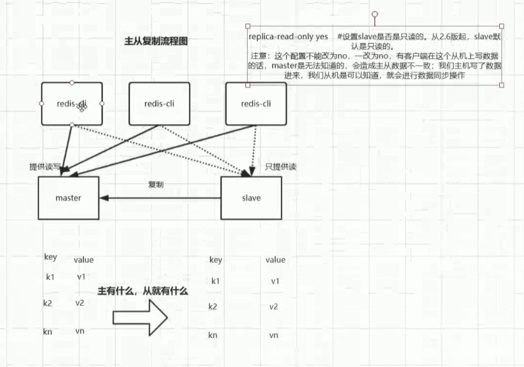
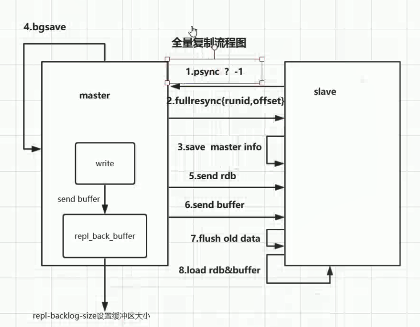
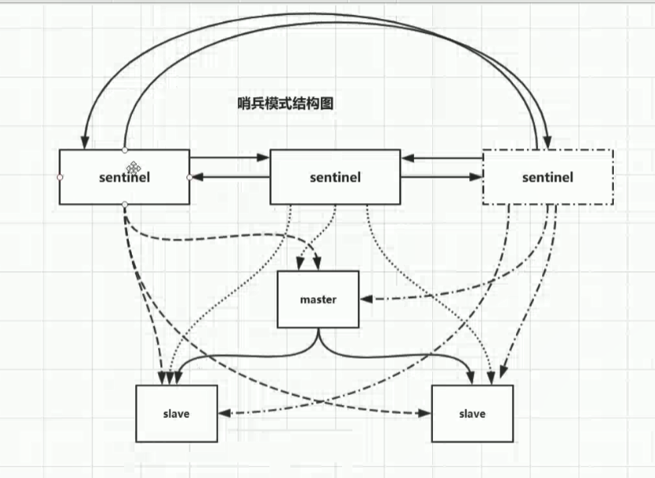

# Redis主从复制

### 1.是什么

单机有什么问题：

1. 单机故障

2. 容量瓶颈

3. qps瓶颈

主机数据更新后根据配置和策略，自动同步到备机的master/slaver机制，mester以写为主，slaver已读为主。

### 2.能干嘛

1. 读写分离
2. 容灾备份

### 3.怎么玩

玩法原则:   

1. 配从不配主
2. 使用命令`SLAVEOF`动态指定主从关系  ，如果设置了密码，关联后使用`config set masterauth`密码
3. 配置文件和命令混合使用时，如果混合使用，动态指定了主从，请注意一定要修改对应的配置文件。

具体操作：

1. 新建redis8000，redis8001，redis8002文件夹

2. 将redis.conf文件复制在redis8000下

3. 分别修改个目录下的redis.conf文件

   修改master节点配置文件`redis8000/redis.conf`

   ````properties
   bind 192.168.0.104   指定本机ip
   port 8000
   daemonize yes
   pidfile /var/run/redis_8000.pid  
   dir /myredis/redis8000
   requirepass 123456	
   ````

4. 把redis8000/redis.conf文件复制到redis8001，redis8002下

   redis8001/redis.conf

   使用命令`:%s/8000/8001/g`批量替换端口号并修改两个配置

   ````properties
   replicaof 192.168.0.104 8000 # 指定master机器
   masterauth 123456 # 指定master 密码
   ````

   redis8002/redis.conf的配置如上

   1. 使用`:%s/8000/8002/g`批量替换端口号

   2. 修改两个配置

      ````properties
      replicaof 192.168.0.104 8000 # 指定master机器
      masterauth 123456 # 指定master 密码
      ````

5. 分别启动8000，8001，8002实例
   1. `[root@localhost myredis]# /usr/local/bin/redis-server /myredis/redis8000/redis.conf `
   2. `[root@localhost myredis]# /usr/local/bin/redis-server /myredis/redis8001/redis.conf `
   3. `[root@localhost myredis]# /usr/local/bin/redis-server /myredis/redis8002/redis.conf `

6. 客户端连接
   1. `/usr/local/bin/redis-cli -h 192.168.0.104 -p 8000 -a 123456`
   2. `/usr/local/bin/redis-cli -h 192.168.0.104 -p 8001 -a 123456`
   3. `/usr/local/bin/redis-cli -h 192.168.0.104 -p 8002 -a 123456`

7. 命令解析

   1. 查看角色信息，登录进客户端使用`info replication`查看

      ````
      # Replication
      role:master
      connected_slaves:2
      slave0:ip=127.0.0.1,port=8001,state=online,offset=98,lag=0
      slave1:ip=127.0.0.1,port=8002,state=online,offset=98,lag=0
      master_replid:a0707d677bfba2c70ff2ccd665de36cc2f3f3a0f
      master_replid2:0000000000000000000000000000000000000000
      master_repl_offset:98
      second_repl_offset:-1
      repl_backlog_active:1
      repl_backlog_size:1048576
      repl_backlog_first_byte_offset:1
      repl_backlog_histlen:98
      ````

   2. 动态设定配置`config set xxx xxx`

      在主从模式下我们可以动态设定配置，比如`config set masterauth 123456`，虽然这样设置不用重启服务，但是重启后配置会失效，所以还需要我们具体去修改配置文件的指定信息。

      同样的，我们也可以通过`config get`获取配置信息。

      指定从节点命令：`SLAVEOF 192.168.122.3 8000 指定redis为某个节点的从节点,比如没有配置之后`

8. 建议

   一般来说会将主机的rdb和aof功能关闭，因为很损耗性能，如果要保证数据一致性，那么将aof开启即可，rdb不要打开，从机打开。尽量让主机少干点事儿。

   从机是不能写数据的，默认不能。因为**从机写数据的话，主机是监听不到的，这造成数据不一致。**

   ````properties
   # 从机不能写数据,默认不能
   # 设置slave是否只读的,从2.6开启的,slave默认是只读的
   replica-read-only yes
   ````

### 4.全量复制消耗

主从复制分为**全量复制**和**增量复制**，流程如下图：



#### 全量复制流程



1. 第一次连接主机时，从机会发送一个命令给主机，上图?号代表runid，每一个redis都有的一个唯一标识，redis的就是runid，第一次从机不知道主机的runid所以发送一个?过去请求全量复制。我们可以通过`info server`看到runid的信息

   ````
   192.168.122.3:8002> info server
   # Server
   redis_version:5.0.5
   redis_git_sha1:00000000
   redis_git_dirty:0
   redis_build_id:9d46733cce1193bd
   redis_mode:standalone
   os:Linux 3.10.0-957.el7.x86_64 x86_64
   arch_bits:64
   multiplexing_api:epoll
   atomicvar_api:atomic-builtin
   gcc_version:4.8.5
   process_id:77734
   // run id    
   run_id:015d0798c7760366b579f9379fe5aec6b9848140
   tcp_port:8002
   uptime_in_seconds:4465
   uptime_in_days:0
   hz:10
   configured_hz:10
   lru_clock:6432896
   executable:/usr/local/bin/redis-server
   config_file:/usr/local/myredis/redis8002/redis.conf
   ````

2. master知道你要备份我的数据，所以把run_id和偏移量传过去，master通过`info replication`可以查看从机的偏移量。

   **主机和从机的偏移量不一致的话就说明数据不一致**

3. 从机把master返回的数据保存起来

4. 全量复制会触发master的rdb持久化，生成rdb文件(bgsave) ，但是在rdb持久化的过程中还会有数据会写入master里面有缓冲区，会把新写的数据写入缓冲区。

   **缓冲区很重要，这是一个队列，默认只有1MB, 可以通过`repl-backlog-size`设置大小**

5. 发送rdb文件到从机

6. 发送缓冲区的数据

7. 从机清空所有的数据

8. 从机加载主机发送过来的rdb和buffer数据

#### 全量复制消耗

```java
1.bgsave时间
2.rdb文件网络传输
3.从节点请求请求数据时间
4.从节点加载rdb的时间
5.可能的aof重写时间
  从机本来是有aof的,加载主机的rdb文件时,aof会先执行,所以会有可能的aof的重写时间
  虽然会执行清空老数据,但是我还有aof老文件
```

从机通过缓冲区的数据比较来判断是否需要全量或者增量复制：**判断缓冲区是否有数据移除，如果网络抖动后从机发送一个请求，主机发送缓冲区的数据，从机判断偏移量，如果有数据移除了（因为缓冲区也有写满的情况），所以有数据丢失，会执行全量复制。**

### 5.缺点

1. 由于所有的写操作都是先在Master上操作，然后同步更新到Slave上，所以从Master同步到Slave机器有一定的延迟，当系统很繁忙的时候，延迟问题会更加严重，Slave机器数量的增加也会使这个问题更加严重。
2. 当主机宕机之后，将不能进行写操作，需要手动将从机升级为主机，从机需要重新制定master，通过命令`slaveof no one`来升级为主机。另一个从机需要执行命令`savelof xxx`来跟随最新的master。

简单总结：

一个master可以有多个Slave

一个slave只能有一个master

数据流向是单向的，只能从主到从


## redis哨兵模式

### 1.是什么，能干嘛？

在Redis 2.8版本开始引入。哨兵的核心功能是**主节点的自动故障转移**。

通俗来讲哨兵模式的出现是就是为了解决我们主从复制模式中需要我们人为操作的东西变为自动版，并且它比人为要更及时。

### 2.哨兵主要功能（做了哪些事）

监控（Monitoring）：哨兵会不断地检查主节点和从节点是否运作正常。

自动故障转移（Automatic Failover）：当主节点不能正常工作时，哨兵会开始自动故障转移操作，它会将失效主节点的其中一个从节点升级为新的主节点，并让其他从节点改为复制新的主节点。

配置提供者（Configuration Provider）：客户端在初始化时，通过连接哨兵来获得当前Redis服务的主节点地址。

通知（Notification）：哨兵可以将故障转移的结果发送给客户端。

其中，监控和自动故障转移功能，使得哨兵可以及时发现主节点故障并完成转移；而配置提供者和通知功能，则需要在与客户端的交互中才能体现。

### 3.架构

哨兵节点：哨兵系统由一个或多个哨兵节点组成，哨兵节点是特殊的Redis节点，不存储数据。

数据节点：主节点和从节点都是数据节点。

### 4.怎么玩（实战）？

#### 1. 部署主从节点

哨兵系统中的主从节点，与普通的主从节点配置是一样的，并不需要做任何额外配置。下面分别是主节点（port=8000）和2个从节点（port=8001/8002）的配置文件；

我们刚才搭建的主从复制就是主从节点

**配置了哨兵节点需要将从节点的密码也配上，因为发生了故障转移，需要密码**

```properties
requirepassword 123456
```

#### 2. 部署哨兵节点

哨兵节点本质上是特殊的Redis节点。

3个哨兵节点的配置几乎是完全一样的，主要区别在于端口号的不同（26379 / 26380 / 26381），下面以26379节点为例介绍节点的配置和启动方式；配置部分尽量简化：

sentinel-26379.conf

````port 26379
daemonize yes

logfile "26379.log"

sentinel monitor mymaster 192.168.0.104 6379 2
````

其中，`sentinel monitor mymaster 192.168. 92.128 6379 2`配置的含义是：该哨兵节点监192.168.0.104 6379这个主节点，该主节点的名称是mymaster，最后的2的含义与主节点的故障判定有关：至少需要2个哨兵节点同意，才能判定主节点故障并进行故障转移。

###### 哨兵节点的启动有两种方式，二者作用是完全相同的：

`redis-sentinel sentinel-26379.conf`

`redis-server sentinel-26379.conf --sentinel`

### 5.故障转移演示（哨兵的监控和自动故障转移功能）

使用kill命令杀掉主节点

### 6.客户端（jedis）访问哨兵系统（自动故障转移功能）

```java
public static void main(String[] args)  {
        Logger logger= LoggerFactory.getLogger(TestJedisSentinel.class);
        Set<String> set=new HashSet<>();
        set.add("192.168.0.104:28000");
        set.add("192.168.0.104:28001");
        set.add("192.168.0.104:28002");
        JedisSentinelPool jedisSentinelPool=new JedisSentinelPool("mymaster",set,"123456");
        while (true) {
            Jedis jedis=null;
            try {
                jedis = jedisSentinelPool.getResource();
                String s = UUID.randomUUID().toString();
                jedis.set("k" + s, "v" + s);
                System.out.println(jedis.get("k" + s));
                Thread.sleep(1000);
            }catch (Exception e){
                logger.error(e.getMessage());
            }finally {
                if(jedis!=null){
                    jedis.close();
                }
            }
        }
    }
```


### 7.基本原理



关于哨兵的原理，关键是了解以下几个概念：

**主观下线**：在心跳检测的定时任务中，如果其他节点超过一定时间没有回复，哨兵节点就会将其进行主观下线。顾名思义，主观下线的意思是一个哨兵节点“主观地”判断下线；与主观下线相对应的是客观下线。

**客观下线**：哨兵节点在对主节点进行主观下线后，会通过sentinel is-master-down-by-addr命令询问其他哨兵节点该主节点的状态；如果判断主节点下线的哨兵数量达到一定数值，则对该主节点进行客观下线。

**需要特别注意的是，客观下线是主节点才有的概念；如果从节点和哨兵节点发生故障，被哨兵主观下线后，不会再有后续的客观下线和故障转移操作。**

**`哨兵模式会篡改文件`**

定时任务：每个哨兵节点维护了3个定时任务。定时任务的功能分别如下：

1. 每10秒通过向主从节点发送info命令获取最新的主从结构；

     发现slave节点

     确定主从关系

2. 每2秒通过发布订阅功能获取其他哨兵节点的信息；SUBSCRIBE  c2     PUBLISH c2 hello-redis

     交互对节点的“看法”和自身情况

3. 每1秒通过向其他节点发送ping命令进行心跳检测，判断是否下线（monitor）。

     心跳检测，失败判断依据

   

选举领导者哨兵节点：当主节点被判断客观下线以后，各个哨兵节点会进行协商，选举出一个领导者哨兵节点，并由该领导者节点对其进行故障转移操作。

监视该主节点的所有哨兵都有可能被选为领导者，选举使用的算法是Raft算法；Raft算法的基本思路是先到先得：即在一轮选举中，哨兵A向B发送成为领导者的申请，如果B没有同意过其他哨兵，则会同意A成为领导者。选举的具体过程这里不做详细描述，一般来说，哨兵选择的过程很快，谁先完成客观下线，一般就能成为领导者。

故障转移：选举出的领导者哨兵，开始进行故障转移操作，该操作大体可以分为3个步骤：

在从节点中选择新的主节点：选择的原则是，

1.首先过滤掉不健康的从节点；

2.然后选择优先级最高的从节点（由replica-priority指定）；如果优先级无法区分，

3.则选择复制偏移量最大的从节点；如果仍无法区分，

4.则选择runid最小的从节点。

更新主从状态：通过slaveof no one命令，让选出来的从节点成为主节点；并通过slaveof命令让其他节点成为其从节点。

````
同时也会把redis.conf文件里面的相关配置篡改了
````

将已经下线的主节点（即6379）保持关注，当6379从新上线后设置为新的主节点的从节点

### 8.实践建议

哨兵节点的数量应不止一个。一方面增加哨兵节点的冗余，避免哨兵本身成为高可用的瓶颈；另一方面减少对下线的误判。此外，这些不同的哨兵节点应部署在不同的物理机上。

哨兵节点的数量应该是奇数，便于哨兵通过投票做出“决策”：领导者选举的决策、客观下线的决策等。

各个哨兵节点的配置应一致，包括硬件、参数等；此外应保证时间准确、一致。


### 9.总结

在主从复制的基础上，哨兵引入了主节点的自动故障转移，进一步提高了Redis的高可用性；但是哨兵的缺陷同样很明显：哨兵无法对从节点进行自动故障转移，在读写分离场景下，从节点故障会导致读服务不可用，需要我们对从节点做额外的监控、切换操作。此外，哨兵仍然没有解决写操作无法负载均衡以及存储能力受到单机限制的问题。

