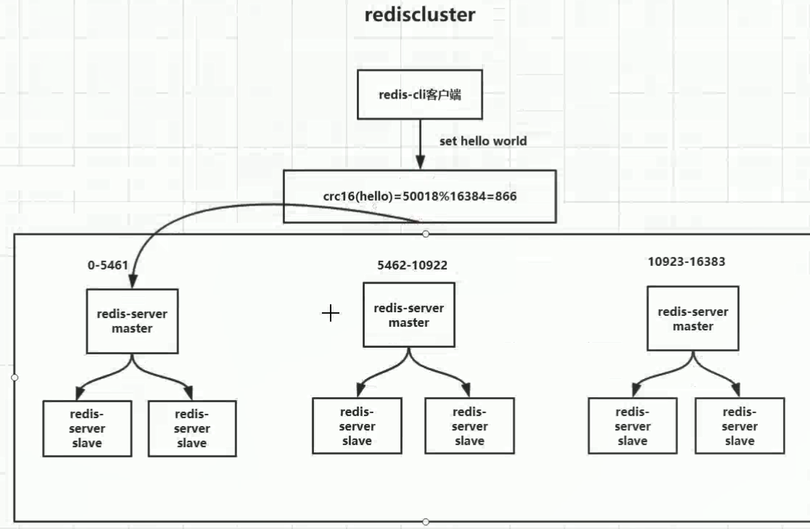
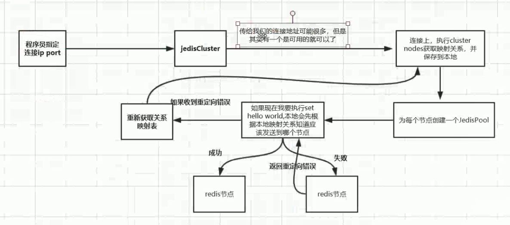

## redis cluster高可用集群

### 1.redis cluster集群是什么？

redis cluster集群是一个由多个主从节点群组成的分布式服务器群，它具有复制、高可用和分片特
性。Redis cluster集群不需要sentinel哨兵也能完成节点移除和故障转移的功能。需要将每个节点
设置成集群模式，这种集群模式没有中心节点，可水平扩展，据官方文档称可以线性扩展到
1000节点。redis cluster集群的性能和高可用性均优于之前版本的哨兵模式，且集群配置非常简单 



### 2.redis cluster集群搭建

#### 1.原生搭建

##### 1.第一步

创建6个实例并修改配置文件

````properties
bind 192.168.122.3
port 8000
daemonize yes
pidfile /var/run/redis_8000.pid
logfile "redis_8000.log"
# 这里关闭rdb是为了节省性能,但是在集群环境肯定是管不了的,在主从复制模式下,会触发rdb的bgsave
# save 900 1
# save 300 10
# save 60 10000
dbfilename dump8000.rdb
dir /usr/local/redis-cluster/8000
# 这个也是有的
masterauth litian
# 打开aof
appendonly yes
# 密码
requirepass litian

# The name of the append only file (default: "appendonly.aof")

appendfilename "appendonly8000.aof"
# 重要 打开集群配置
cluster-enabled yes
# 保存集群的信息
cluster-config-file nodes-8000.conf
# 集群超时时间
cluster-node-timeout 15000
#如果设置成０，则无论从节点与主节点失联多久，从节点都会尝试升级成主节点。
#如果设置成正数，则cluster-node-timeout乘以cluster-slave-validity-factor得到的时间，是从节点与主节点失联后，
#此从节点数据有效的最长时间，超过这个时间，从节点不会启动故障迁移。
#假设cluster-node-timeout=5，cluster-slave-validity-factor=10，则如果从节点跟主节点失联超过50秒，此从节点不能成为主节点。
#注意，如果此参数配置为非0，将可能出现由于某主节点失联却没有从节点能顶上的情况，从而导致集群不能正常工作，
#在这种情况下，只有等到原来的主节点重新回归到集群，集群才恢复运作。
cluster-replica-validity-factor 10 # 这个属性主要是集群的故障转移判断健康的从节点的依据
# 很重要 表示当负责一个插槽的主库下线且没有相应的从库进行故障恢复时，集群仍然可用 如果是yes 整个集群不可用
cluster-require-full-coverage no
````

其他文件通过`:%s/8000/8000/g`替换

或者通过创建方式来

````java
sed 's/8000/8001/g' redis.conf > 8001/redis.conf
sed 's/8000/8002/g' redis.conf > 8002/redis.conf
sed 's/8000/8003/g' redis.conf > 8003/redis.conf
sed 's/8000/8004/g' redis.conf > 8004/redis.conf
sed 's/8000/8005/g' redis.conf > 8005/redis.conf
sed 's/8000/8006/g' redis.conf > 8006/redis.conf
````

##### 2. meet

启动redis后不能set 数据,可以通过cluster nodes 查看节点信息

```
/usr/local/bin/redis-cli -h 192.168.122.3 -p 8001 -a litian cluster nodes
```

可以查看节点的信息,发现每个节点都是孤立的,互不通信,使用`meet`命令让他们互相通信

````properties
/usr/local/bin/redis-cli -h 192.168.122.3 -p 8001 -a litian cluster meet 192.168.122.3 8002
/usr/local/bin/redis-cli -h 192.168.122.3 -p 8001 -a litian cluster meet 192.168.122.3 8003
/usr/local/bin/redis-cli -h 192.168.122.3 -p 8001 -a litian cluster meet 192.168.122.3 8004
/usr/local/bin/redis-cli -h 192.168.122.3 -p 8001 -a litian cluster meet 192.168.122.3 8005
/usr/local/bin/redis-cli -h 192.168.122.3 -p 8001 -a litian cluster meet 192.168.122.3 8006
````

再使用`cluster nodes`命令查看后发现它们已经相互通信了

````
22272d7f070d3fee5f78f5e7bb8c9d2df80269f9 192.168.122.3:8002@18002 master - 0 1566779296000 1 connected
21c8151d26b919673fa872581415796228af77ff 192.168.122.3:8006@18006 master - 0 1566779297064 5 connected
4205f4f7a3e67b9c363d276b17032473ba83f078 192.168.122.3:8005@18005 master - 0 1566779298074 4 connected
5b56d56c111803efe13eeb91dcb511e1268f09c0 192.168.122.3:8001@18001 myself,master - 0 1566779297000 0 connected
4a118e65960debc104a906ed6de631fce4192c25 192.168.122.3:8004@18004 master - 0 1566779296057 3 connected
3e8a6080e63ef15475ed9d1c105097f2aa37b209 192.168.122.3:8003@18003 master - 0 1566779299082 2 connected
````

##### 3.分配槽

```
集群的槽点一共有16384, 通过crc16算法算出key的槽位 cluster keyslot key
这里三台, 所以会有如下分配
16384/3   0-5461  5462-10922  10923-16383
```

`cluster addslots slot`

如果一个一个来特别麻烦,使用shell脚本循环执行

`addslots.sh`

```
start=$1
end=$2
port=$3
for slot in `seq ${start} ${end}`
do
  echo "slot:${slot}"
  /usr/local/bin/redis-cli -h 192.168.122.3 -p ${port} -a litian cluster addslots ${slot}
done	
```

使用shell的命令

```
sh addslots.sh 0 5461 8001
sh addslots.sh 5462 10922  8002
sh addslots.sh 10923 16383  8003
```

##### 4.分配主从

`cluster replicate node-id`

````
/usr/local/bin/redis-cli -h 192.168.122.3 -p 8004(成为slave的实例) -a litian cluster replicate  22272d7f070d3fee5f78f5e7bb8c9d2df80269f9 (master的node_id)
````

如此往复便搭建成功了,此外在`node-xxx.log`里面存了集群的配置信息不能轻易删除

`关闭的话使用shutdown命令一台一台的关闭即可`

#### 2.使用redis提供的rb脚本

`在3.0之前的版本,搭建redis-cluster的话需要使用到ruby的脚本,这儿使用的redis5.0的版本,所以直接使用redis-cli的一些类似于 create 命令就可以了`

redis cluster集群需要至少要三个master节点，我们这里搭建三个master节点，并且给每个
master再搭建一个slave节点，总共6个redis节点，由于节点数较多，这里采用在一台机器
上创建6个redis实例，并将这6个redis实例配置成集群模式，所以这里搭建的是伪集群模
式，当然真正的分布式集群的配置方法几乎一样，搭建伪集群的步骤如下：
第一步：在/usr/local下创建文件夹redis-cluster，然后在其下面分别创建6个文件夾如下
（1）mkdir -p /usr/local/redis-cluster
（2）mkdir 8001、 mkdir 8002、 mkdir 8003、 mkdir 8004、 mkdir 8005、 mkdir
8006
第一步：把之前的redis.conf配置文件copy到8001下，修改如下内容：
（1）daemonize yes
（2）port 8001（分别对每个机器的端口号进行设置）
（3）bind 127.0.0.1（如果只在本机玩则可以指定为127.0.0.1  如果需要外网访问则需要指定本机真实ip）
定可能会出现循环查找集群节点机器的情况）
（4）dir /usr/local/redis-cluster/8001/（指定数据文件存放位置，必须要指定不同的目
录位置，不然会丢失数据）
（5）cluster-enabled yes（启动集群模式）
（6）cluster-config-file nodes-8001.conf（这里800x最好和port对应上）
（7）cluster-node-timeout 5000
（8）appendonly yes
第三步：把修改后的配置文件，分别 copy到各个文夹下，注意每个文件要修改第2、4、6
项里的端口号，可以用批量替换：
:%s/源字符串/目的字符串/g
第四步：由于 redis集群需要使用 ruby命令，所以我们需要安装 ruby（redis5.0之后省略）
（1）yum install ruby
（2）yum install rubygems
（3）gem install redis --version 3.0.0（安装redis和 ruby的接囗）
第五步：分别启动6个redis实例，然后检查是否启动成功
（1）/usr/local/redis/bin/redis-server /usr/local/redis-cluster/800*/redis.conf
（2）ps -ef | grep redis 查看是否启动成功 

第六步：在redis3的安装目录下执行 redis-trib.rb命令创建整个redis集群
（1）cd /usr/local/redis3/src
（2）./redis-trib.rb create --replicas 1 127.0.0.1:9000 127.0.0.1:9001
127.0.0.1:9002 127.0.0.1:9003 127.0.0.1:9004  127.0.0.1:9005

`redis5.0`使用/usr/local/bin/redis-cli --cluster create 192.168.0.104:7000 192.168.0.104:7001 192.168.0.104:7002 192.168.0.104:7003 192.168.0.104
:7004 192.168.0.104:7005 --cluster-replicas 1

第七步：验证集群：
（1）连接任意一个客户端即可：./redis-cli -c -h -p (-c表示集群模式，指定ip地址和端口
号）如：/usr/local/redis/bin/redis-cli -c -h 127.0.0.1 -p 800*
（2）进行验证： cluster info（查看集群信息）、cluster nodes（查看节点列表）
（3）进行数据操作验证
（4）关闭集群则需要逐个进行关闭，使用命令：
/usr/local/redis/bin/redis-cli -c -h 127.0.0.1 -p 800* shutdown 

#### 2.1 使用redis5.0之后的create命令搭建集群

按照原生搭建的方式准备好配置文件,并启动6台实例

`将那些实例变为一个整体`

````proerties
/usr/local/bin/redis-cli -h 192.168.122.4 -p 7001 -a 123456 --cluster create 192.168.122.4:7001 192.168.122.4:7002 192.168.122.4:7003 192.168.122.4:7004 192.168.122.4:7005 192.168.122.4:7006 --cluster-replicas 1
````

`1是比例, 是从机和主机的比例,比如现在6台,所以3台主机3台从机 比例是1 如果是9台 设计为一主二从,所以是2`

`并且ip地址前面3个是master 后面3个是slave`

````
M: 039bd05b96d691f5372b9a008792586d6f6d9e88 192.168.122.4:7001
   slots:[0-5460] (5461 slots) master
M: 2b5e8c3d0ce0da48197a1888cf52064d75dddbde 192.168.122.4:7002
   slots:[5461-10922] (5462 slots) master
M: 7c842fa68d959aac35b054f771a785eee867e0a8 192.168.122.4:7003
   slots:[10923-16383] (5461 slots) master
S: b461c05b3c18acb7ec60fb08f1893d61cf7b8537 192.168.122.4:7004
   replicates 7c842fa68d959aac35b054f771a785eee867e0a8
S: 9e37ce55851d59c054e5589b11d1a4a8fd6f7cb7 192.168.122.4:7005
   replicates 039bd05b96d691f5372b9a008792586d6f6d9e88
S: dabc3ddbbeb0a10595ed295d0f9871e00b63c01b 192.168.122.4:7006
   replicates 2b5e8c3d0ce0da48197a1888cf52064d75dddbde
Can I set the above configuration? (type 'yes' to accept): yes
>>> Nodes configuration updated
>>> Assign a different config epoch to each node
>>> Sending CLUSTER MEET messages to join the cluster
Waiting for the cluster to join
....
````

`配置成功, 并且自动分配槽点`

### 3.集群伸缩

#### 1.扩容集群

##### 1.准备新节点

```java
sed 's/7001/7007/g' redis.conf > redis-7007/redis.conf
```

```java
sed 's/7001/7008/g' redis.conf > redis-7008/redis.conf
```

##### 2.加入集群

随便在已经存在的台机器上面使用如下命令:

1. 使用`redis-cli`语法：`add-node` 新节点ip:端口  已存在节点ip:端口

   ```
   /usr/local/bin/redis-cli -h 192.168.122.4 -p 7001 -a 123456 --cluster add-node  192.168.122.4:7007 192.168.122.4:7001 
   ```

   ```java
   /usr/local/bin/redis-cli -h 192.168.122.4 -p 7001 -a 123456 --cluster add-node  192.168.122.4:7008 192.168.122.4:7001 
   ```

2. 使用原生命令 语法：`cluster meet ip port`

指定主从

​	加入新节点到集群后 新的节点还是孤立的状态 需要设定主从

​	在使用`redis-cli`  语法（加入时指定）：`add-node` 新节点ip:端口  已存在节点ip:端口  --cluster-slave --cluster-master-id masterID

​		`/usr/local/bin/redis-cli -h 192.168.122.4 -p 7001 -a 123456 --cluster add-node 192.168.122.4:7008 192.168.122.4:7001 --cluster-slave --cluster-master-id 57bc281445759a96b1c1374e44192df4f03543bb`

​	我这儿已经把7008的服务器加入进去成为了master 所以这会儿使用原生命令

​	`/usr/local/bin/redis-cli -h 192.168.122.4 -p 7008 -a 123456 cluster replicate 57bc281445759a96b1c1374e44192df4f03543bb`   	

​	使用原生命令  语法：cluster replicate node-id

##### 3.迁移槽和数据

1.槽迁移计划

语法：/redis-cli --cluster reshard 已存在节点ip ： 端口(随便哪个节点)

1. `/usr/local/bin/redis-cli --cluster reshard 192.168.0.104:7001`

2. 然后会提示你要分配多少槽点,输入数字

3. 然后会提示哪个节点接受这些节点 输入新加入的节点

4. 接着会让你输入需要分配的节点id

   这会儿可以输入`all` 输入all 将会平均分配

   也可以输入分配槽点的节点的node_id, 有3台的话会让你输入3次 

   如果需要平均分配可以每次都输入不同的节点,也可以自定义让那几个节点分配槽点

2.迁移数据

执行流程：提示要分配多少槽 -> 接收节点ID -> all/done

3.添加从节点

`在迁移过程中是可以添加数据的`

#### 2.缩容集群

1.下线迁移槽

语法：

````
redis-cli --cluster reshard --cluster-from 要迁出节点ID  --cluster-to  接收槽节点ID --cluster-slots 迁出槽数量 已存在节点ip 端口
````

```
/usr/local/bin/redis-cli --cluster reshard --cluster-from a2fdd1359d03acacf2a6e558acbc006639445d53 --cluster-to 1794864d5f8af79e88cfc0f699f02b6341c78b5c --cluster-slots 1366 192.168.0.104 7001
```

2.忘记节点.关闭节点

语法： `redis-cli --cluster del-node `已存在节点ID：端口 要删除的节点ID

```
/usr/local/bin/redis-cli --cluster del-node 192.168.0.104:7000 8de55e2a7419983184cede9daab5d36ee9da1fa3
```

### 4.cluster客户端



1.moved重定向：指我们发送命令时，会对发送的key进行crc16算法，得到一个数字，然而我们连接的客户端并不是管理这个数字的范围，所以会返回错误并告诉你此key应该对应的槽位，然后客户端需要捕获此异常，重新发起请求到对应的槽位

2.asx重定向：指在我们送发命令时，对应的客户端正在迁移槽位中，所以此时我们不能确定这个key是还在旧的节点中还是新的节点中

3.smart客户端

1.从集群中选取一个可运行节点，使用cluster slots初始化槽和节点映射。

2.将cluster slots的结果映射到本地，为每个节点创建jedispool

3.准备执行命令

测试代码:

```java
public static void main(String[] args) {
    Set<HostAndPort> nodesList
        = new HashSet<HostAndPort>();
    nodesList.add(new HostAndPort("192.168.122.4", 7001));
    nodesList.add(new HostAndPort("192.168.122.4", 7002));
    nodesList.add(new HostAndPort("192.168.122.4", 7003));
    nodesList.add(new HostAndPort("192.168.122.4", 7004));
    nodesList.add(new HostAndPort("192.168.122.4", 7005));
    nodesList.add(new HostAndPort("192.168.122.4", 7006));

    JedisPoolConfig jedisPoolConfig =
        new JedisPoolConfig();
    // 最大空闲连接数, 默认8个
    jedisPoolConfig.setMaxIdle(200);
    // 最大连接数, 默认8个
    jedisPoolConfig.setMaxTotal(1000);
    // 最小空闲数 默认是0
    jedisPoolConfig.setMinIdle(100);
    // 获取连接时的最大等待毫秒数
    jedisPoolConfig.setMaxWaitMillis(3000);
    // 对难道的connection进行validateObject校验
    jedisPoolConfig.setTestOnBorrow(false);
    JedisCluster jedisCluster = new JedisCluster(nodesList, jedisPoolConfig);
    while (true) {
        UUID uuid = UUID.randomUUID();
        String id = String.valueOf(uuid);
        jedisCluster.set(id, id);
    }
}
```


### 5.故障转移（与哨兵相似）

1.故障发现： 通过ping/pong消息实现故障发现（不依赖sentinel）

2.故障恢复

1.检查那个从节点是否有资格

  1.每个从节点检查与主节点的断开时间

  超过`cluster-node-timeout` * `cluster-replica-validity-factor` 时间认为这个从节点是不健康的节点 所以取消资格

  2.选择偏移量最大的

  替换主节点

1.当前从节点取消复制变为主节点（slaveof no one）

2.撤销以前主节点的槽位，给新的主节点

3.向集群广播消息，表明已经替换了故障节点


# 总结

## redis集群演变过程

### 1.单机版

核心技术：持久化

持久化是最简单的高可用方法（有时甚至不被归为高可用的手段），主要作用是数据备份，即将数据存储在硬盘，保证数据不会因进程退出而丢失。

### 2.复制

复制是高可用Redis的基础，哨兵和集群都是在复制基础上实现高可用的。复制主要实现了数据的多机备份，以及对于读操作的负载均衡和简单的故障恢复。缺陷是故障恢复无法自动化；写操作无法负载均衡；存储能力受到单机的限制。

### 3.哨兵

在复制的基础上，哨兵实现了自动化的故障恢复。缺陷是写操作无法负载均衡；存储能力受到单机的限制。

### 4.集群

通过集群，Redis解决了写操作无法负载均衡，以及存储能力受到单机限制的问题，实现了较为完善的高可用方案