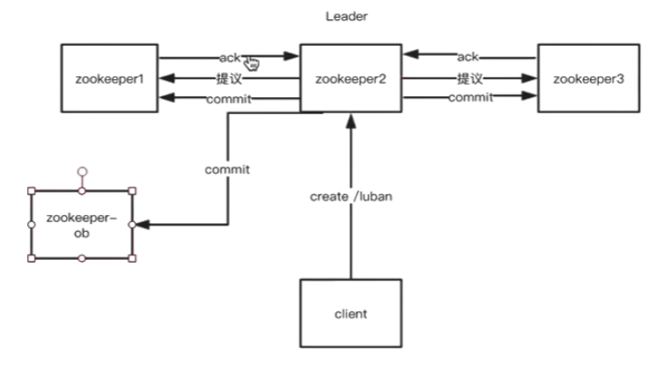

# 分布式系统介绍以及zookeeper快速入门

分布式系统是若干独立计算机的集合，这些计算机对于用户来说就像是单个相关系统

从进程角度看，两个程序分别运行在两台主机的进程上，它们相互协作最终完成同一个服务或者功能，那么理论上这两个程序所组成的系统，也可以称作分布式体统

## 分布式和微服务

### 微服务架构

微服务架构更偏向业务

可以按子业务、数据库、接口三个维度来拆分

```
微服务架构的系统，每个服务的聚合度更高，更稳定，架构更稳定，
但是架构复杂性更多，监控与运维难
```

### 分布式服务

缺点：

1. 分布式session

   解决方案：

   1. Nginx ip_hash
   2. Spring Session + redis
   3. session复制(tomcat有一个组件可以实现这个功能)

2. 分布式配置中心

   解决方案：

   1. disconf
   2. diamond

3. 分布式事务

   解决方法：`分布式锁`，在mysql上加锁很影响效率，所以在内存中加入分布式锁。

   目前实现分布式锁的方案

   1. mysql
   2. 内存数据库(redis、memcached等)
   3. zookeeper

### CAP理论

`一致性、可用性、分区容错性`

一致性：保持数据一致

可用性：如果一台机子挂掉，另一台可以继续工作

分区容错性：两台机子之间的网络断掉了，消息丢失了还是可以继续工作的

```Java
// 但是CAP不能全部满足，最多只能同时满足两项比如AP、CP
// 绝对不能舍弃P
/*
	所以很多系统在设计之初就进行了取舍，咱们的zookeeper可以满足AP或者CP，但是优先保证CP
	在互联网的大多数场景中，都需要牺牲强一致性来换取系统的高可用，系统往往保证最终一致性，只要在用户的接受范围即可
	在很多场景为了保证最终一致性，需要很多的技术支持，比如分布式事务、分布式锁。有的时候，我们需要保证同一时间内只能被同一线程执行，在单机环境中Java通过很多并发处理的API，但是在分布式这些就无能为力了，也就是单纯的Java API并能提供分布式锁的能力，所以需要需要正对分布式环境提供锁的能力。
*/


```


### Base理论

Base是指基本可用、软状态(Soft State)[在没有同步之前的状态]、最终一致性(Eventual Consistency)

#### 弱一致性

​	数据没有一致也可以使用

#### 最终一致性

```
Base理论也是舍弃了强一致性，选择了最终一致性，保持可用性。
```

### 分布式定时任务

````
比如两个机子都有一个Job，在某个时刻跑，比如凌晨。但是不能一起跑，我们要去解决这个分布式的问题。两个JOB跑肯定会出问题。
````

分布式各系统中间都需要进行网络通信，所以本来在单一架构中能保证的数据一致性，升级为分布式系统后数据的一致性就难以保证，而`Zookeeper`的诞生就可以解决这个本质问题：数据一致性，再加上`Zookeeper`的其他特性还可以解决分布式锁，分布式定时任务等等场景问题。

## zookeeper

### 集群数据一致性图解



```java
/*
	当客户端链接到Leader的时候准备创建节点的时候，leader会发送提议到其他Follower客户端，客户端就会返回一个ack 只要ack超过一半就会创建节点，然后会发送commit到follower，同时也会发送一个到observer
	如果客户端链接到Follwer准备创建节点的时候，Follwer会把请求转发给Leader然后完成上面的操作
	注意Leader对于自己来说也是一个ack
*/
```

### Observer

```java
/**
写东西的时候需要经过一个Zab的一些，需要集群里面的节点投票，随着使用者越来越多，需要加入更多的zookeeper节点，因为Leader只有一个，你只有加Follower节点，如果Follwer节点多了，因为过半机制，这样下来你的投票会越来越耗时，
如果加入的是Observer，它不参加投票，它只可以读，不影响写的功能，这样你在写入的时候不需要增加多个节点，不会太耗时

**/
```

`观察者只提高读的性能，不需要投票`

`用户使用越多，节点需要增加，为了增加读性能，第一种是可以加follower节点，但是有弊端，根据Zab协议，需要进行一个过半机制，如果节点过多非常耗时，影响写入`

`如果加入的是Observer节点，影响写入比较小，它只负责读取数据`


 


