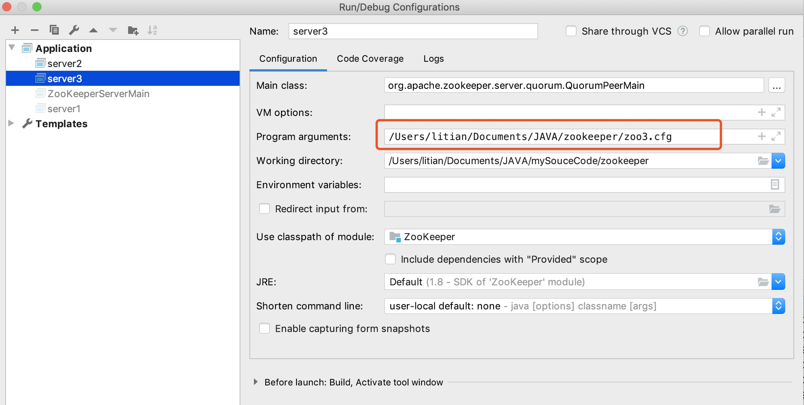

## 单机版启动流程

1. 加载配置
2. 启动socket
3. 初始化RequestProcessor
4. 返回Response

## 集群启动分析

集群下有三个角色：Leader、Follower、Observer

**所以在集群启动的时候会去进行一个快速领导者选举**，还会有一步**同步数据**。

所以在集群模式下启动会有以下步骤：

1. 加载配置
2. 启动socket
3. 快速领导者选举
4. 同步数据
5. 初始化RequestProcessor
6. 返回Response

在源码环境启动集群：

1. 集群启动类在`QuorumPeerMain`类下面的`main`方法，我们实现复制到3个配置文件，修改配置（端口号，dataDir、集群配置）

2. 在idea环境下降参数加到启动项里面

   

3. 挨个启动服务就好了

## 源码分析

```java
public static void main(String[] args) {
    QuorumPeerMain main = new QuorumPeerMain();
    try {
        main.initializeAndRun(args);
    } catch (IllegalArgumentException e) {
        LOG.error("Invalid arguments, exiting abnormally", e);
        LOG.info(USAGE);
        System.err.println(USAGE);
        System.exit(2);
    } catch (ConfigException e) {
        LOG.error("Invalid config, exiting abnormally", e);
        System.err.println("Invalid config, exiting abnormally");
        System.exit(2);
    } catch (Exception e) {
        LOG.error("Unexpected exception, exiting abnormally", e);
        System.exit(1);
    }
    LOG.info("Exiting normally");
    System.exit(0);
}
```

```java
protected void initializeAndRun(String[] args)
    throws ConfigException, IOException
{
    // 读取配置文件信息，放到QuorumPeerConfig类里面
    QuorumPeerConfig config = new QuorumPeerConfig();
    if (args.length == 1) {
        // 解析配置文件，其实就是properties类
      	// 
        config.parse(args[0]);
    }

    // Start and schedule the the purge task
    DatadirCleanupManager purgeMgr = new DatadirCleanupManager(config
            .getDataDir(), config.getDataLogDir(), config
            .getSnapRetainCount(), config.getPurgeInterval());
    purgeMgr.start();

    if (args.length == 1 && config.servers.size() > 0) {
        // 集群模式
        runFromConfig(config);
    } else {
        LOG.warn("Either no config or no quorum defined in config, running "
                + " in standalone mode");
        // there is only server in the quorum -- run as standalone
        // 单机模式
        ZooKeeperServerMain.main(args);
    }
}
```

QuorumPeerConfig是配置文件的封装类，这儿就不用细看了，`config.parse(args[0]);`这个方法就加载配置信息，我们来看里面一些重要代码片段

````java
else if (key.equals("peerType")) {
                if (value.toLowerCase().equals("observer")) {
                    peerType = LearnerType.OBSERVER;
                } else if (value.toLowerCase().equals("participant")) {
                    peerType = LearnerType.PARTICIPANT;
                } else
                {
                    throw new ConfigException("Unrecognised peertype: " + value);
                }
            } 
````

配置了peerType可以确定集群的类型，默认是参与者，配置了observer就是观察者

````java
else if (key.startsWith("server.")) {
  int dot = key.indexOf('.');
  long sid = Long.parseLong(key.substring(dot + 1));
  String parts[] = splitWithLeadingHostname(value);
  if ((parts.length != 2) && (parts.length != 3) && (parts.length !=4)) {
    LOG.error(value
              + " does not have the form host:port or host:port:port " +
              " or host:port:port:type");
  }
  LearnerType type = null;
  String hostname = parts[0];
  Integer port = Integer.parseInt(parts[1]);
  Integer electionPort = null;
  if (parts.length > 2){
    electionPort=Integer.parseInt(parts[2]);
  }
  if (parts.length > 3){
    // parts3就是配置了观察者那部分
    if (parts[3].toLowerCase().equals("observer")) {
      type = LearnerType.OBSERVER;
    } else if (parts[3].toLowerCase().equals("participant")) {
      type = LearnerType.PARTICIPANT;
    } else {
      throw new ConfigException("Unrecognised peertype: " + value);
    }
  }
  if (type == LearnerType.OBSERVER){
    // 如果是观察者就放进了observers这个map里面
    observers.put(Long.valueOf(sid), new QuorumServer(sid, hostname, port, electionPort, type));
  } else {
    // 不然就放进servers这个map里面
    servers.put(Long.valueOf(sid), new QuorumServer(sid, hostname, port, electionPort, type));
  }
}
````

这段代码就是判断配置文件里面集群配置部分有没有配置observer，配置了就单独放在一个map里面，否则就放进另一个map里面（port是集群通信的端口，electionPort是选举的端口）

```java
} else {
    /*
     * The default QuorumVerifier is QuorumMaj
     */

    LOG.info("Defaulting to majority quorums");
    quorumVerifier = new QuorumMaj(servers.size()); // 目前这个servers不包括参与者，所以再算过半的时候不包括观察者
}

// Now add observers to servers, once the quorums have been
// figured out
servers.putAll(observers); // 这里才把参与者加到servers中区
```

QuorumMaj方法就是过半机制的判断，将参与者的数量传进去，后面再把观察者放进servers这个map里面

```java
public class QuorumMaj implements QuorumVerifier {
    private static final Logger LOG = LoggerFactory.getLogger(QuorumMaj.class);
    
    int half;
    
    /**
     * Defines a majority to avoid computing it every time.
     * 
     * @param n number of servers
     */
    public QuorumMaj(int n){
        this.half = n/2;
    }
    
    /**
     * Returns weight of 1 by default.
     * 
     * @param id 
     */
    public long getWeight(long id){
        return (long) 1;
    }
    
    /**
     * Verifies if a set is a majority.
     */
    public boolean containsQuorum(Set<Long> set){
        // 判断set的大小是否大于一半
        // 那么这个half是怎么算的
        // 若7台机器，3台参与者，4台observer，如何算过半
        // 我们要去看QuorumPeerConfig#parseProperties
        return (set.size() > half);
    }
    
}
```

可以看见这个里面会构造一个**验证器**，后面会有很多地方会去用到这个验证器。继续读下面代码会把我们配的myid作为serverId。

配合解析后通过判断servsers.size()>0选择集群模式启动

`runFromConfig(config);`

```java
public void runFromConfig(QuorumPeerConfig config) throws IOException {
  try {
      ManagedUtil.registerLog4jMBeans();
  } catch (JMException e) {
      LOG.warn("Unable to register log4j JMX control", e);
  }

  LOG.info("Starting quorum peer");
  try {
      // 默认NIOServerCnxnFactory
      ServerCnxnFactory cnxnFactory = ServerCnxnFactory.createFactory();
      cnxnFactory.configure(config.getClientPortAddress(),
                            config.getMaxClientCnxns());
      // new出一台新的集群服务器
      quorumPeer = getQuorumPeer();

      quorumPeer.setQuorumPeers(config.getServers());
      quorumPeer.setTxnFactory(new FileTxnSnapLog(
              new File(config.getDataLogDir()),
              new File(config.getDataDir())));
      quorumPeer.setElectionType(config.getElectionAlg());
      quorumPeer.setMyid(config.getServerId());
      quorumPeer.setTickTime(config.getTickTime());
      quorumPeer.setInitLimit(config.getInitLimit());
      quorumPeer.setSyncLimit(config.getSyncLimit());
      quorumPeer.setQuorumListenOnAllIPs(config.getQuorumListenOnAllIPs());
      quorumPeer.setCnxnFactory(cnxnFactory);
      quorumPeer.setQuorumVerifier(config.getQuorumVerifier());
      quorumPeer.setClientPortAddress(config.getClientPortAddress());
      quorumPeer.setMinSessionTimeout(config.getMinSessionTimeout());
      quorumPeer.setMaxSessionTimeout(config.getMaxSessionTimeout());
      quorumPeer.setZKDatabase(new ZKDatabase(quorumPeer.getTxnFactory()));
      quorumPeer.setLearnerType(config.getPeerType());
      quorumPeer.setSyncEnabled(config.getSyncEnabled());

      // sets quorum sasl authentication configurations
      quorumPeer.setQuorumSaslEnabled(config.quorumEnableSasl);
      if(quorumPeer.isQuorumSaslAuthEnabled()){
          quorumPeer.setQuorumServerSaslRequired(config.quorumServerRequireSasl);
          quorumPeer.setQuorumLearnerSaslRequired(config.quorumLearnerRequireSasl);
          quorumPeer.setQuorumServicePrincipal(config.quorumServicePrincipal);
          quorumPeer.setQuorumServerLoginContext(config.quorumServerLoginContext);
          quorumPeer.setQuorumLearnerLoginContext(config.quorumLearnerLoginContext);
      }

      quorumPeer.setQuorumCnxnThreadsSize(config.quorumCnxnThreadsSize);
      quorumPeer.initialize();
      // 启动 
      quorumPeer.start();
      quorumPeer.join();
  } catch (InterruptedException e) {
      // warn, but generally this is ok
      LOG.warn("Quorum Peer interrupted", e);
  }
}
```

quorumPeer在这儿是一台服务器，这儿new一台，加载配置文件里面配置进去，然后启动

```java
@Override
public synchronized void start() {
    // 加载数据
    loadDataBase();
    // 开启读取数据线程
    cnxnFactory.start();
    // 进行领导者选举，确定服务器的角色，再针对不同的服务器角色进行初始化
    startLeaderElection();
    // 本类的run方法
    super.start();
}
```

**因为`quorumPeer`是线程，所以会有join()方法等待它结束才继续执行主线程的方法**，我们继续看加载数据的方法

1. `loadDataBase();`

```java
public long loadDataBase() throws IOException {
    // 加载快照到dataTree
    long zxid = snapLog.restore(dataTree, sessionsWithTimeouts, commitProposalPlaybackListener);
    initialized = true;
    return zxid;
}
```

```java
public long restore(DataTree dt, Map<Long, Integer> sessions, 
        PlayBackListener listener) throws IOException {
    // 从快照里面反序列化到内存里面
  	snapLog.deserialize(dt, sessions);
    return fastForwardFromEdits(dt, sessions, listener);
}
```

fastForwardFromEdits

```java
// 从快照中还原数据库时，快照很可能落后于事务日志，所以需要从落后的那一部分事务日志中更新内存
public long fastForwardFromEdits(DataTree dt, Map<Long, Integer> sessions,
                                 PlayBackListener listener) throws IOException {
    FileTxnLog txnLog = new FileTxnLog(dataDir);
    TxnIterator itr = txnLog.read(dt.lastProcessedZxid+1);
    long highestZxid = dt.lastProcessedZxid;
    TxnHeader hdr;
    try {
        while (true) {
            // iterator points to 
            // the first valid txn when initialized
            hdr = itr.getHeader();
            if (hdr == null) {
                //empty logs 
                return dt.lastProcessedZxid;
            }
            if (hdr.getZxid() < highestZxid && highestZxid != 0) {
                LOG.error("{}(higestZxid) > {}(next log) for type {}",
                        new Object[] { highestZxid, hdr.getZxid(),
                                hdr.getType() });
            } else {
                highestZxid = hdr.getZxid();
            }
            try {
                processTransaction(hdr,dt,sessions, itr.getTxn());
            } catch(KeeperException.NoNodeException e) {
               throw new IOException("Failed to process transaction type: " +
                     hdr.getType() + " error: " + e.getMessage(), e);
            }
            listener.onTxnLoaded(hdr, itr.getTxn());
            if (!itr.next()) 
                break;
        }
    } finally {
        if (itr != null) {
            itr.close();
        }
    }
    return highestZxid;
}
```

从落后的那一部分事务日志中更新内存

2. `super.start();`

   这个方法会执行本类的run()方法

   ```java
   @Override
   public void run() {
       setName("QuorumPeer" + "[myid=" + getId() + "]" +
               cnxnFactory.getLocalAddress());
   
       LOG.debug("Starting quorum peer");
       try {
           jmxQuorumBean = new QuorumBean(this);
           MBeanRegistry.getInstance().register(jmxQuorumBean, null);
           // 循环所有server
           for(QuorumServer s: getView().values()){
               ZKMBeanInfo p;
               // 如果是自己
               if (getId() == s.id) {
                   p = jmxLocalPeerBean = new LocalPeerBean(this);
                   try {
                       MBeanRegistry.getInstance().register(p, jmxQuorumBean);
                   } catch (Exception e) {
                       LOG.warn("Failed to register with JMX", e);
                       jmxLocalPeerBean = null;
                   }
               } else {
                   // 如果是同伴服务器
                   p = new RemotePeerBean(s);
                   try {
                       MBeanRegistry.getInstance().register(p, jmxQuorumBean);
                   } catch (Exception e) {
                       LOG.warn("Failed to register with JMX", e);
                   }
               }
           }
       } catch (Exception e) {
           LOG.warn("Failed to register with JMX", e);
           jmxQuorumBean = null;
       }
   
       try {
           /*
            * Main loop
            */
           while (running) {
               // 本机服务器状态
               switch (getPeerState()) {
               case LOOKING:
                   LOG.info("LOOKING");
                   // 正在寻找leader
   
                   // 不关心只读服务器
                   if (Boolean.getBoolean("readonlymode.enabled")) {
                       LOG.info("Attempting to start ReadOnlyZooKeeperServer");
   
   
                       // Create read-only server but don't start it immediately
                       final ReadOnlyZooKeeperServer roZk = new ReadOnlyZooKeeperServer(
                               logFactory, this,
                               new ZooKeeperServer.BasicDataTreeBuilder(),
                               this.zkDb);
   
                       // Instead of starting roZk immediately, wait some grace
                       // period before we decide we're partitioned.
                       //
                       // Thread is used here because otherwise it would require
                       // changes in each of election strategy classes which is
                       // unnecessary code coupling.
                       Thread roZkMgr = new Thread() {
                           public void run() {
                               try {
                                   // lower-bound grace period to 2 secs
                                   sleep(Math.max(2000, tickTime));
                                   if (ServerState.LOOKING.equals(getPeerState())) {
                                       roZk.startup();
                                   }
                               } catch (InterruptedException e) {
                                   LOG.info("Interrupted while attempting to start ReadOnlyZooKeeperServer, not started");
                               } catch (Exception e) {
                                   LOG.error("FAILED to start ReadOnlyZooKeeperServer", e);
                               }
                           }
                       };
                       try {
                           roZkMgr.start();
                           setBCVote(null);
                           setCurrentVote(makeLEStrategy().lookForLeader());
                       } catch (Exception e) {
                           LOG.warn("Unexpected exception",e);
                           setPeerState(ServerState.LOOKING);
                       } finally {
                           // If the thread is in the the grace period, interrupt
                           // to come out of waiting.
                           roZkMgr.interrupt();
                           roZk.shutdown();
                       }
                   } else {
                       // 直接看这里
                       try {
                           // 兼容性代码
                           setBCVote(null);
                           setCurrentVote(makeLEStrategy().lookForLeader());
                       } catch (Exception e) {
                           LOG.warn("Unexpected exception", e);
                           setPeerState(ServerState.LOOKING);
                       }
                   }
                   break;
               case OBSERVING:
                   // 观察者
                   try {
                       LOG.info("OBSERVING");
                       // observer用到的两个CommitProcessor、SyncRequestProcessor
                       setObserver(makeObserver(logFactory));
                       observer.observeLeader();
                   } catch (Exception e) {
                       LOG.warn("Unexpected exception",e );                        
                   } finally {
                       observer.shutdown();
                       setObserver(null);
                       setPeerState(ServerState.LOOKING);
                   }
                   break;
               case FOLLOWING:
                   // 跟随者
                   try {
                       LOG.info("FOLLOWING");
                       setFollower(makeFollower(logFactory));
                       follower.followLeader();
                   } catch (Exception e) {
                       LOG.warn("Unexpected exception",e);
                   } finally {
                       follower.shutdown();
                       setFollower(null);
                       // 只要服务器在运行的过程中出现了异常就会设置成LOOKING状态
                       setPeerState(ServerState.LOOKING);
                   }
                   break;
               case LEADING:
                   LOG.info("LEADING");
                   // 领导者
                   try {
                       setLeader(makeLeader(logFactory));
                       // 主要就是开启LearnerHandler线程
                       leader.lead();
                       setLeader(null);
                   } catch (Exception e) {
                       LOG.warn("Unexpected exception",e);
                   } finally {
                       if (leader != null) {
                           leader.shutdown("Forcing shutdown");
                           setLeader(null);
                       }
                       setPeerState(ServerState.LOOKING);
                   }
                   break;
               }
           }
       } finally {
           LOG.warn("QuorumPeer main thread exited");
           try {
               MBeanRegistry.getInstance().unregisterAll();
           } catch (Exception e) {
               LOG.warn("Failed to unregister with JMX", e);
           }
           jmxQuorumBean = null;
           jmxLocalPeerBean = null;
       }
   }
   ```

   可以看见中间有一个while循环，根据服务器的角色（LOOKING：寻找中，OBSERVING：观察者，FOLLOWING：跟随者，LEADING：领导者）进入对应的操作。

3. 分析leader

   ```java
   LOG.info("LEADING");
   // 领导者
   try {
     // new一个leader类
     setLeader(makeLeader(logFactory));
     // 主要就是开启LearnerHandler线程
     leader.lead();
     setLeader(null);
   } catch (Exception e) {
     LOG.warn("Unexpected exception",e);
   } finally {
     if (leader != null) {
       leader.shutdown("Forcing shutdown");
       setLeader(null);
     }
     setPeerState(ServerState.LOOKING);
   }
   break;
   ```

   leader需要去和集群其他`Learner`（除了leader其他服务器的统称）通信，所以需要针对每一个learnner开启一个线程，通过这个线程不停地去socket中获取数据，然后进行数据的一个传输。

   `leader.lead();`

   ```java
   void lead() throws IOException, InterruptedException {
       self.end_fle = Time.currentElapsedTime();
       long electionTimeTaken = self.end_fle - self.start_fle;
       self.setElectionTimeTaken(electionTimeTaken);
       LOG.info("LEADING - LEADER ELECTION TOOK - {}", electionTimeTaken);
       self.start_fle = 0;
       self.end_fle = 0;
   
       zk.registerJMX(new LeaderBean(this, zk), self.jmxLocalPeerBean);
   
       try {
           self.tick.set(0);
           // 重新倒一遍数据
           zk.loadData();
           
           leaderStateSummary = new StateSummary(self.getCurrentEpoch(), zk.getLastProcessedZxid());
   
           // Start thread that waits for connection requests from 
           // new followers.
           cnxAcceptor = new LearnerCnxAcceptor();
           cnxAcceptor.start();
           
           readyToStart = true;
           long epoch = getEpochToPropose(self.getId(), self.getAcceptedEpoch());
           
           zk.setZxid(ZxidUtils.makeZxid(epoch, 0));
           
           synchronized(this){
               lastProposed = zk.getZxid();
           }
           
           newLeaderProposal.packet = new QuorumPacket(NEWLEADER, zk.getZxid(),
                   null, null);
   
   
           if ((newLeaderProposal.packet.getZxid() & 0xffffffffL) != 0) {
               LOG.info("NEWLEADER proposal has Zxid of "
                       + Long.toHexString(newLeaderProposal.packet.getZxid()));
           }
           
           waitForEpochAck(self.getId(), leaderStateSummary);
           self.setCurrentEpoch(epoch);
   
           // We have to get at least a majority of servers in sync with
           // us. We do this by waiting for the NEWLEADER packet to get
           // acknowledged
           try {
               waitForNewLeaderAck(self.getId(), zk.getZxid());
           } catch (InterruptedException e) {
               shutdown("Waiting for a quorum of followers, only synced with sids: [ "
                       + getSidSetString(newLeaderProposal.ackSet) + " ]");
               HashSet<Long> followerSet = new HashSet<Long>();
               for (LearnerHandler f : learners)
                   followerSet.add(f.getSid());
                   
               if (self.getQuorumVerifier().containsQuorum(followerSet)) {
                   LOG.warn("Enough followers present. "
                           + "Perhaps the initTicks need to be increased.");
               }
               Thread.sleep(self.tickTime);
               self.tick.incrementAndGet();
               return;
           }
   
           // 初始化
           startZkServer();
           
           /**
            * WARNING: do not use this for anything other than QA testing
            * on a real cluster. Specifically to enable verification that quorum
            * can handle the lower 32bit roll-over issue identified in
            * ZOOKEEPER-1277. Without this option it would take a very long
            * time (on order of a month say) to see the 4 billion writes
            * necessary to cause the roll-over to occur.
            * 
            * This field allows you to override the zxid of the server. Typically
            * you'll want to set it to something like 0xfffffff0 and then
            * start the quorum, run some operations and see the re-election.
            */
           String initialZxid = System.getProperty("zookeeper.testingonly.initialZxid");
           if (initialZxid != null) {
               long zxid = Long.parseLong(initialZxid);
               zk.setZxid((zk.getZxid() & 0xffffffff00000000L) | zxid);
           }
           
           if (!System.getProperty("zookeeper.leaderServes", "yes").equals("no")) {
               self.cnxnFactory.setZooKeeperServer(zk);
           }
           // Everything is a go, simply start counting the ticks
           // WARNING: I couldn't find any wait statement on a synchronized
           // block that would be notified by this notifyAll() call, so
           // I commented it out
           //synchronized (this) {
           //    notifyAll();
           //}
           // We ping twice a tick, so we only update the tick every other
           // iteration
           boolean tickSkip = true;
   
           while (true) {
               Thread.sleep(self.tickTime / 2);
               if (!tickSkip) {
                   self.tick.incrementAndGet();
               }
               HashSet<Long> syncedSet = new HashSet<Long>();
   
               // lock on the followers when we use it.
               syncedSet.add(self.getId());
   
               for (LearnerHandler f : getLearners()) {
                   // Synced set is used to check we have a supporting quorum, so only
                   // PARTICIPANT, not OBSERVER, learners should be used
                   if (f.synced() && f.getLearnerType() == LearnerType.PARTICIPANT) {
                       syncedSet.add(f.getSid());
                   }
                   f.ping();
               }
   
               // check leader running status
               if (!this.isRunning()) {
                   shutdown("Unexpected internal error");
                   return;
               }
   
             if (!tickSkip && !self.getQuorumVerifier().containsQuorum(syncedSet)) {
               //if (!tickSkip && syncedCount < self.quorumPeers.size() / 2) {
                   // Lost quorum, shutdown
                   shutdown("Not sufficient followers synced, only synced with sids: [ "
                           + getSidSetString(syncedSet) + " ]");
                   // make sure the order is the same!
                   // the leader goes to looking
                   return;
             } 
             tickSkip = !tickSkip;
           }
       } finally {
           zk.unregisterJMX(this);
       }
   }
   ```

   leader单独开启一个线程，启动线程的run方法

   ```java
   public void run() {
       try {
           while (!stop) {
               try{
                   Socket s = ss.accept();
                   // start with the initLimit, once the ack is processed
                   // in LearnerHandler switch to the syncLimit
                   s.setSoTimeout(self.tickTime * self.initLimit);
                   s.setTcpNoDelay(nodelay);
   
                   BufferedInputStream is = new BufferedInputStream(
                           s.getInputStream());
                   // 除开Leader服务器，其他服务器都会与Leader建立连接，这个时候都会新建出一个LearnerHandler线程
                   LearnerHandler fh = new LearnerHandler(s, is, Leader.this);
                   fh.start();
               } catch (SocketException e) {
                   if (stop) {
                       LOG.info("exception while shutting down acceptor: "
                               + e);
   
                       // When Leader.shutdown() calls ss.close(),
                       // the call to accept throws an exception.
                       // We catch and set stop to true.
                       stop = true;
                   } else {
                       throw e;
                   }
               } catch (SaslException e){
                   LOG.error("Exception while connecting to quorum learner", e);
               }
           }
       } catch (Exception e) {
           LOG.warn("Exception while accepting follower", e);
       }
   }
   ```

   只要有一个链接就会单独开启一个`LearnerHandler`线程，然后启动这个线程的run方法，下面看一下这个run方法，这个方法很长，慢慢分析

   

4. 看一下follwer的`followLeader()`方法

   ```java
   void followLeader() throws InterruptedException {
       self.end_fle = Time.currentElapsedTime();
       long electionTimeTaken = self.end_fle - self.start_fle;
       self.setElectionTimeTaken(electionTimeTaken);
       LOG.info("FOLLOWING - LEADER ELECTION TOOK - {}", electionTimeTaken);
       self.start_fle = 0;
       self.end_fle = 0;
       fzk.registerJMX(new FollowerBean(this, zk), self.jmxLocalPeerBean);
       try {
           // 找到leader
           QuorumServer leaderServer = findLeader();            
           try {
               // 连接leader
               connectToLeader(leaderServer.addr, leaderServer.hostname); // 连接leader
               // 发送数据
               long newEpochZxid = registerWithLeader(Leader.FOLLOWERINFO); // 发送
   
               //check to see if the leader zxid is lower than ours
               //this should never happen but is just a safety check
               long newEpoch = ZxidUtils.getEpochFromZxid(newEpochZxid);
               if (newEpoch < self.getAcceptedEpoch()) {
                   LOG.error("Proposed leader epoch " + ZxidUtils.zxidToString(newEpochZxid)
                           + " is less than our accepted epoch " + ZxidUtils.zxidToString(self.getAcceptedEpoch()));
                   throw new IOException("Error: Epoch of leader is lower");
               }
               syncWithLeader(newEpochZxid);    // 完成了数据同于，一起服务器初始化，可以处理请求了
               QuorumPacket qp = new QuorumPacket();
               while (this.isRunning()) {
                   readPacket(qp);
                   processPacket(qp);
               }
           } catch (Exception e) {
               LOG.warn("Exception when following the leader", e);
               try {
                   sock.close();
               } catch (IOException e1) {
                   e1.printStackTrace();
               }
   
               // clear pending revalidations
               pendingRevalidations.clear();
           }
       } finally {
           zk.unregisterJMX((Learner)this);
       }
   }
   ```

   ```java
   protected long registerWithLeader(int pktType) throws IOException{
         /*
          * Send follower info, including last zxid and sid
          */
      long lastLoggedZxid = self.getLastLoggedZxid();
      		// 构造数据包
         QuorumPacket qp = new QuorumPacket();                
         qp.setType(pktType);
         qp.setZxid(ZxidUtils.makeZxid(self.getAcceptedEpoch(), 0));
         
         /*
          * Add sid to payload
          */
         LearnerInfo li = new LearnerInfo(self.getId(), 0x10000);
         ByteArrayOutputStream bsid = new ByteArrayOutputStream();
         BinaryOutputArchive boa = BinaryOutputArchive.getArchive(bsid);
         boa.writeRecord(li, "LearnerInfo");
         qp.setData(bsid.toByteArray());
         
         writePacket(qp, true);
         readPacket(qp);        
         final long newEpoch = ZxidUtils.getEpochFromZxid(qp.getZxid());
   if (qp.getType() == Leader.LEADERINFO) {
          // we are connected to a 1.0 server so accept the new epoch and read the next packet
          leaderProtocolVersion = ByteBuffer.wrap(qp.getData()).getInt();
          byte epochBytes[] = new byte[4];
          final ByteBuffer wrappedEpochBytes = ByteBuffer.wrap(epochBytes);
          if (newEpoch > self.getAcceptedEpoch()) {
             wrappedEpochBytes.putInt((int)self.getCurrentEpoch());
             self.setAcceptedEpoch(newEpoch);
          } else if (newEpoch == self.getAcceptedEpoch()) {
             // since we have already acked an epoch equal to the leaders, we cannot ack
             // again, but we still need to send our lastZxid to the leader so that we can
             // sync with it if it does assume leadership of the epoch.
             // the -1 indicates that this reply should not count as an ack for the new epoch
                 wrappedEpochBytes.putInt(-1);
          } else {
             throw new IOException("Leaders epoch, " + newEpoch + " is less than accepted epoch, " + self.getAcceptedEpoch());
          }
          QuorumPacket ackNewEpoch = new QuorumPacket(Leader.ACKEPOCH, lastLoggedZxid, epochBytes, null);
          writePacket(ackNewEpoch, true);
             return ZxidUtils.makeZxid(newEpoch, 0);
         } else {
          if (newEpoch > self.getAcceptedEpoch()) {
             self.setAcceptedEpoch(newEpoch);
          }
             if (qp.getType() != Leader.NEWLEADER) {
                 LOG.error("First packet should have been NEWLEADER");
                 throw new IOException("First packet should have been NEWLEADER");
             }
             return qp.getZxid();
         }
     } 
   ```

   上面`registerWithLeader`是发送数据的方法，在leader开启的`LearnerHandler`线程的run方法里面会去读取数据，发送数据会返回届号，可能有的服务器的届值比较大， 作为leader会告诉其他learnner最新的届号。因为可能会有leader的届号是4，有其他的follower的届号是5，所以它要去拿出最大的届号。通过`getEpochToPropose`获取，会有一个**过半机制**的验证，然后再把最大的届号加一返回，这个届号将参与zxid的低32位计算。

5. 


## 总结

1.启动QuorumPeerMain类的main方法
2.读取配置文件到类QuorumPeerConfig config = new QuorumPeerConfig();中
3.解析配置类，包括很多属性，以及判断是否有集群的配置，如果有进一步将server和observer一些属性进行解析
	1.集群模式下还会加载一个集群验证的类，主要是过半机制
4.打开nioSocket
5.将集群服务器个数以及一些配置信息加载到quorumPeer类里面
6.quorumPeer.start()
	1.加载数据 从zkDb拿到快照导出数据到内存DataTree 
		ZkDb -> DataTree -> DataNode(节点)
		1.从快照中反序列化到DataTree里面
		2.从快照中还原数据库时，快照很可能落后于事务日志，所以需要从落后的那一部分事务日志中更新内存
	2.领导者选举	
	3.启动线程，执行run()方法

		1.while(running)无线循环判断服务器角色，在对应角色执行对应方法，Switch
			1.LOOKING: 还在选举中
			2.OBSERVER: 观察者
				 startUp()
				 	ObserverRequestProcessor.next = CommitProcessor.next = FinalRequestProcessor	
			3.FOLLOWING: 跟随者
				1.找到leader
				2.发送socket请求连接leader
				3.注册到leader 返回第几届
					1.构造packet
					2.写数据
				4.接受leader发过来的LEADERINFO，然后构造packet，发送ack
				5.数据同步 syncWithLeader
					1.LEADER.DIFF：上面都不做 下面代码处理
					2.LEADER.SNAP:处理快照
					3.LEADER.TARUNC:删数据
					4.while循环处理，判断服务器一直在running的话，下面是case 从这儿就读取LEADER.DIFF的里面的commit请求，将日志放在一个队列里面，那么时候退出这个循环呢？ 当case = updatetodate就跳出循环，需要leader发送这个过来就好，开始是leader发送一个newleader的ack过来，然后follower返回一个ack，接着leader发送一个updatetodate的ack过来，这会儿就退出while循环，接着执行COMMIT的队列信息
				6.startUp()
					FollowerRequestProcessor.next = CommitProcessor.next = FinalRequestProcessor
					如果客户端发送事务请求就发送给leader，leader在REQUEST下接收然后按leader的请求调用链处理
					同时会单独执行SyncRequestProcessor.next = SendAckRequestProcessor
					1.接受到leander的提议，直接持久化，如果成功就返回ack
					2.接受到leader的commit
					3.更新内存 	
			4.LEADING: 领导者	
				1.zk.loadData(); 还去加载数据，有点不懂
				2.启动线程Leader待Follwer连接
					1.等待Socket连接   Socket s = ss.accept();
					2.除开Leader服务器，其他服务器都会与Leader建立连接，这个时候都会新建出一个LearnerHandler线程然后启动线程
						LearnerHandler fh = new LearnerHandler(s, is, Leader.this);
						1.从流中读取数据
						2.this.sid = sid follower传过来的sid
						3.选取Epoch最大的Follower 然后+1， 生成这一届的序号，其实就是新一届代表，zxid即事务id里面低32位里面需要用到Epoch
							1.如果follower比较多的话也不会无止境的选取Epoch，接下来会去验证过半机制，只要过半就把这个follower的Epoch + 1返回，如果不满足就等待（阻塞）
						4.构造Packet  QuorumPacket newEpochPacket = new QuorumPacket(Leader.LEADERINFO, ZxidUtils.makeZxid(newEpoch, 0), ver, null);  发送leader状态,以LEADERINFO的形式
						5.数据同步
							分析：同步应该是通过快照来进行的，但是快照不一定是最新的，那怎么办呢？
							在单机版中请求链中SyncProcess是处理持久化事务的，而最后的FinalProcesors会存储最大的事务id，committedLog存储已经提交了持久化好了的request，所以比快照更新的数据就在这个committedLog里面，存储了zxid
								1.如果follower的zxid和当前的leader的一样不做太多的处理
								2.LEADER.DIFF:如果follower的zxid小于leader的zxid的话，这个叫找出它们之间缺少的部分，然后循环把数据放入一个QueuePacket的队列里面，然后构造一个commit请求，然后也加入队列
								3.LEADER.TRUNC:如果follower发过来的zxid大于leader的zxid, 找出大于的部分让follower回滚 后面也是加入队列
								4.LEADER.SNAP:如果follower小于leader的zxid最小的，就使用快照
								6.处理完以上部分 把快照序列化通过socket写出去，然后new 一个 Thread发送上面队列的请求 		
				3.startZKserver() -> startUp（）-> setupRequestProcessors();
					1.简单来说就是初始化请求链: 集群模式下在LeaderZooKeeperServer类里面
						firstProcessor = PrepRequestProcessor.next = proposalProcessor.next【】 = commitProcessor.next = toBeAppliedProcessor.next = finalProcessor
						但是syncProcessor也是在用的，中间也有个方法执行	
					2.PrepRequestProcessor:checkACL, 构造ack
						syncProcessor：持久化事务，日志
						finalProcessor： 更新内存，返回response	
						proposalProcessor： 
							1.调用commitProcessor进行阻塞
								1.可以提交的调用下一个processors处理
								2.不可以立马提交的就阻塞，主要是等待提议结果
							2.发起提议
							3.持久化
					3.判断多少台follower返回的ack，过半机制判断，然后发送提交请求		
					4.更新内存

7.quorumPeer.join()


follower怎么和leader同步数据

1. leader可以发送自己的快照给follower
2. 在服务端的`FinalRequestProcessor`最后有一个方法`zks.getZKDatabase().addCommittedProposal(request);`，有一个`commitLog`，这个`commitLog`存放了已经提交了已经持久化好了的request，**所以比快照更新的数据就是`commitLog`**，`commitLog`是链表，最多存储500。

## 概念

### ZAB协议

zk原子广播协议，保证zk的一致性

### Zxid

在ZAB协议的事务编号Zxid设计中，Zxid是一个64位的数字，其中低32位是一个简单的单调递增的计数器，针对客户端每一个事务请求，计数器加1；而高32位则代表Leader周期epoch的编号，每个当选产生一个新的Leader服务器，就会从这个Leader服务器上取出其本地日志中最大事务的Zxid，并从中读取epoch值，然后加1，以此作为新的epoch，并将低32位从0开始计数。