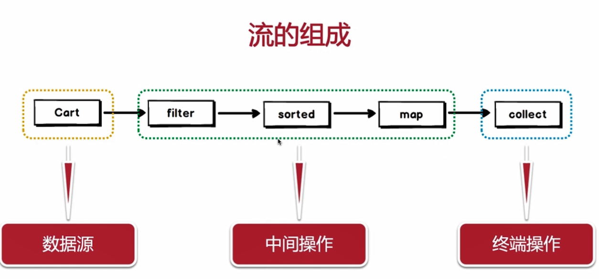
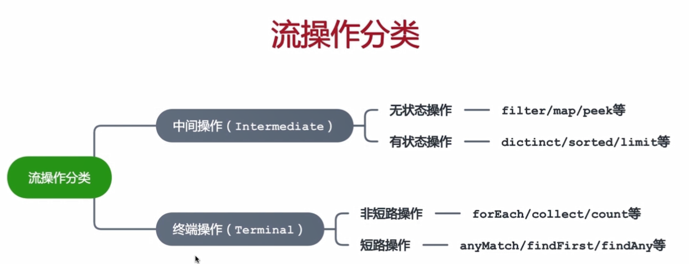
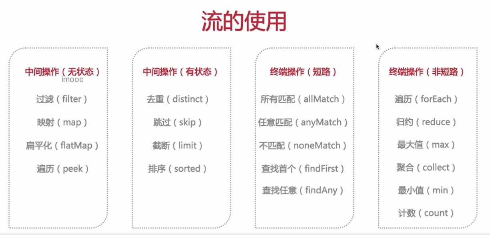

# 告别996之流编程

## 实战案例：集合与流操作对比

实战：分别使用集合操作及Stream流操作，完成对实际引用场景中的数据处理。直观感受流操作带来的便捷性。

### 传统集合处理逻辑

直接看代码吧：

```java
/**
 * 对比，原始集合操作与Stream集合操作
 */
public class StreamVs {
    /**
     * 1. 想看看购物车都有什么商品
     * 2. 图书类商品都给买
     * 3. 其余的商品中买两件最贵的
     * 4. 只需要两件商品的名称和总价
     */

    /**
     * 以原始集合操作实现要求
     */
    public void oldCartHandle() {
        List<Sku> cartSkuList = CartService.getCartSkuList();
        /**
         * 1. 打印所有商品
         */
        for (Sku sku: cartSkuList) {
            System.out.println(JSON.toJSONString(sku, true));
        }

        /**
         * 2. 图书类过滤掉
         */
        List<Sku> notBooksSkuList = new ArrayList<>();
        for (Sku sku: cartSkuList) {
            if (!SkuCategoryEnum.BOOKS.equals(sku.getSkuCategory())) {
                notBooksSkuList.add(sku);
            }
        }

        /**
         * 要获取总价最高的两个先要排序
         */
        notBooksSkuList.sort(new Comparator<Sku>() {
            @Override
            public int compare(Sku o1, Sku o2) {
                if (o1.getTotalPrice() > o2.getTotalPrice()) {
                    return -1;
                } else if (o1.getTotalPrice() < o2.getTotalPrice()) {
                    return 1;
                } else {
                    return 0;
                }
            }
        });

        /**
         * 获取前两个
         */
        List<Sku> top2NotBooksSkuList = new ArrayList<>();
        for (int i = 0; i < 2; i++) {
            top2NotBooksSkuList.add(notBooksSkuList.get(i));
        }

        /**
         * 4.求两个商品的总价
         */
        Double money = 0.00;
        for (Sku sku : top2NotBooksSkuList) {
            money += sku.getTotalPrice();
        }

        /**
         * 获取两件商品的名称
         */
        List<String> resultSkuNameList = new ArrayList<>();
        for (Sku sku : top2NotBooksSkuList) {
            resultSkuNameList.add(sku.getSkuName());
        }

        /**
         * 打印输出结果
         */
        System.out.println(JSON.toJSONString(resultSkuNameList, true));
        System.out.println(JSON.toJSONString(money, true));
    }

    public static void main(String[] args) {
        new StreamVs().oldCartHandle();
    }
}
```

测试结果如下：

````java
{
	"skuCategory":"ELECTRONICS",
	"skuId":6543902,
	"skuName":"无人机",
	"skuPrice":4999.0,
	"totalNum":1,
	"totalPrice":4999.0
}
{
	"skuCategory":"ELECTRONICS",
	"skuId":642934,
	"skuName":"VR一体机",
	"skuPrice":2299.0,
	"totalNum":1,
	"totalPrice":2299.0
}
{
	"skuCategory":"CLOTHING",
	"skuId":645321,
	"skuName":"纯色春衫",
	"skuPrice":409.0,
	"totalNum":1,
	"totalPrice":1227.0
}
{
	"skuCategory":"CLOTHING",
	"skuId":645292,
	"skuName":"牛仔裤",
	"skuPrice":528.0,
	"totalNum":1,
	"totalPrice":528.0
}
{
	"skuCategory":"SPORTS",
	"skuId":6541102,
	"skuName":"跑步机",
	"skuPrice":2699.0,
	"totalNum":1,
	"totalPrice":2699.0
}
{
	"skuCategory":"BOOKS",
	"skuId":6542202,
	"skuName":"Java编程思想",
	"skuPrice":79.0,
	"totalNum":1,
	"totalPrice":79.0
}
{
	"skuCategory":"BOOKS",
	"skuId":6543302,
	"skuName":"Java核心技术",
	"skuPrice":149.0,
	"totalNum":1,
	"totalPrice":149.0
}
[
	"无人机",
	"跑步机"
]
7698.0

````

### Stream处理逻辑

话不多说，直接上代码

```java
public void newCartHandle() {
    // 定义一个可以在lambda表达式中使用的变量搜集总额
    AtomicReference<Double> money =
            new AtomicReference<>(Double.valueOf(0.0));
    List<String> collect = CartService.getCartSkuList()
            .stream()
            // 1. 打印商品信息
            .peek(sku -> System.out.println(JSON.toJSONString(sku, true)))
            // 2. 过滤掉所有图书类的商品
            .filter(sku -> !SkuCategoryEnum.BOOKS.equals(sku.getSkuCategory()))
            // 排序(默认排序从小到大，这儿用reverse反转)
            .sorted(Comparator.comparing(Sku::getTotalPrice).reversed())
            // 获取top2
            .limit(2)
            // 累加
            .peek(sku -> money.set(money.get() + sku.getTotalPrice()))
            // 搜集商品名称
            .map(sku -> sku.getSkuName())
            // 对结果集进行搜集
            .collect(Collectors.toList());
    // 对结果集进行打印
    System.out.println(JSON.toJSONString(collect, true));
    System.out.println(JSON.toJSONString(money.get(), true));
}
```

测试结果：

````java
{
	"skuCategory":"ELECTRONICS",
	"skuId":6543902,
	"skuName":"无人机",
	"skuPrice":4999.0,
	"totalNum":1,
	"totalPrice":4999.0
}
{
	"skuCategory":"ELECTRONICS",
	"skuId":642934,
	"skuName":"VR一体机",
	"skuPrice":2299.0,
	"totalNum":1,
	"totalPrice":2299.0
}
{
	"skuCategory":"CLOTHING",
	"skuId":645321,
	"skuName":"纯色春衫",
	"skuPrice":409.0,
	"totalNum":1,
	"totalPrice":1227.0
}
{
	"skuCategory":"CLOTHING",
	"skuId":645292,
	"skuName":"牛仔裤",
	"skuPrice":528.0,
	"totalNum":1,
	"totalPrice":528.0
}
{
	"skuCategory":"SPORTS",
	"skuId":6541102,
	"skuName":"跑步机",
	"skuPrice":2699.0,
	"totalNum":1,
	"totalPrice":2699.0
}
{
	"skuCategory":"BOOKS",
	"skuId":6542202,
	"skuName":"Java编程思想",
	"skuPrice":79.0,
	"totalNum":1,
	"totalPrice":79.0
}
{
	"skuCategory":"BOOKS",
	"skuId":6543302,
	"skuName":"Java核心技术",
	"skuPrice":149.0,
	"totalNum":1,
	"totalPrice":149.0
}
[
	"无人机",
	"跑步机"
]
7698.0
````

由此可见，代码量少了很多，而且逻辑也很清楚。

### 实战归纳总结

咱们这儿的例子主要是为了体现stream的便捷和优雅。

## 流是什么

+ JDK1.8引入的新成员，以声明式方式处理集合数据
+ 将基础操作链接起来，完成复杂的数据处理流水线
+ 提供透明的并行处理

## 流的简介

从支持**数据处理操作**的**源**生成的**元素序列**。

**元素序列**：和数组集合一样，是一些元素的序列

**源**：和水流类似，提供水流的源头，即数组，集合。

**数据处理操作**：类似数据库的操作，比如map，sort，limit以及函数式语言中的常用操作

## 流与集合的区别

+ 时间与空间的区别

  集合类似于DVD光碟，只有把光碟放进DVD机里才能看到整部电影，而流则类似流媒体播放，你不用获取到整部电影的所有数据帧，只需要获取到当前正在观看的一定时间范围内的数据帧，所以从这个角度看，集合像是空间上的元素的存储，而流更像时间维度的元素的生成。**所以集合面向的是存储，而流面向的是计算。**

+ 只能遍历一次

  集合可以遍历多次，因为流是时间上的概念，所以只能遍历一次，再次遍历就会出现异常。

+ 外部迭代与内部迭代

  集合需要做外部迭代，类似刚才的例子，需要不停的对集合做foreach，因为流是内部迭代，只需要定义对流中内部元素做某些操作，流就会去做内部迭代，去做某些操作。

    

## 流的组成



## 流的操作分类



## 流的使用



## 实战案例：流的使用

实战：通过实际应用场景，介绍流的使用

### 准备

```java
/**
 * 演示流的各种操作
 */
public class StreamOperator {

    List<Sku> list;

    @Before
    public void init() {
        list = CartService.getCartSkuList();
    }

}
```

### 中间操作

#### filter

````java
@Test
public void fileterTest() {
  list.stream()
    // 过滤
    .filter(sku -> SkuCategoryEnum.BOOKS.equals(sku.getSkuCategory()))
    .forEach(item -> {
      System.out.println(JSON.toJSONString(item, true));
    });
}
````

过滤的源码：

```java
Stream<T> filter(Predicate<? super T> predicate);
```

可以得见，Predicate就是返回boolean类型的函数式接口，正好适合filter的操作。

测试结果不言而喻，这儿就不贴了。

#### map

先看代码

```java
@Test
public void mapTest() {
    list.stream()
        // map将sku对象转换成了String对象
        .map(sku -> sku.getSkuName())
        .forEach(item -> {
            System.out.println(JSON.toJSONString(item, true));
        });
}	
```

```java
"无人机"
"VR一体机"
"纯色春衫"
"牛仔裤"
"跑步机"
"Java编程思想"
"Java核心技术"
```

再来看看源码：

```java
<R> Stream<R> map(Function<? super T, ? extends R> mapper);
```

```java
@FunctionalInterface
public interface Function<T, R> {

    /**
     * Applies this function to the given argument.
     *
     * @param t the function argument
     * @return the function result
     */
    R apply(T t);
}  
```

Function的接口是将T对象转换成R对象，由此可见，**map就是将一个对象转换成另一个对象**。

#### flatMap

```java
@Test
public void flatMapTest() {
    list.stream()
            // 将商品的名字切割成字符流
            .flatMap(sku -> Arrays.stream(sku.getSkuName().split("")))
            .forEach(item -> {
                System.out.println(JSON.toJSONString(item, true));
            });
}
```

```java
"无"
"人"
"机"
"V"
"R"
"一"
"体"
"机"
"纯"
"色"
"春"
"衫"
....  
```

```java
<R> Stream<R> flatMap(Function<? super T, ? extends Stream<? extends R>> mapper);
```

**flatMap返回stream类型，接收一个元素返回新的流，这个流将和其他元素产生的流合并。即将一个对象转换成流。**

#### peek

```java
Stream<T> peek(Consumer<? super T> action);
```

```java
@Test
public void peekTest() {
    list.stream()
            .peek(sku -> System.out.println(sku.getSkuName()))
            .forEach(item -> {
                System.out.println(JSON.toJSONString(item, true));
            });
}
```

````java
无人机
{
	"skuCategory":"ELECTRONICS",
	"skuId":6543902,
	"skuName":"无人机",
	"skuPrice":4999.0,
	"totalNum":1,
	"totalPrice":4999.0
}
VR一体机
{
	"skuCategory":"ELECTRONICS",
	"skuId":642934,
	"skuName":"VR一体机",
	"skuPrice":2299.0,
	"totalNum":1,
	"totalPrice":2299.0
}
纯色春衫
{
	"skuCategory":"CLOTHING",
	"skuId":645321,
	"skuName":"纯色春衫",
	"skuPrice":409.0,
	"totalNum":1,
	"totalPrice":1227.0
}
牛仔裤
{
	"skuCategory":"CLOTHING",
	"skuId":645292,
	"skuName":"牛仔裤",
	"skuPrice":528.0,
	"totalNum":1,
	"totalPrice":528.0
}
跑步机
{
	"skuCategory":"SPORTS",
	"skuId":6541102,
	"skuName":"跑步机",
	"skuPrice":2699.0,
	"totalNum":1,
	"totalPrice":2699.0
}
Java编程思想
{
	"skuCategory":"BOOKS",
	"skuId":6542202,
	"skuName":"Java编程思想",
	"skuPrice":79.0,
	"totalNum":1,
	"totalPrice":79.0
}
Java核心技术
{
	"skuCategory":"BOOKS",
	"skuId":6543302,
	"skuName":"Java核心技术",
	"skuPrice":149.0,
	"totalNum":1,
	"totalPrice":149.0
}
````

**为什么不是peek完后再打印信息？因为流的执行是惰性的，只有遇到终端操作，流才由上到下执行。**

#### sort

```java
@Test
public void sortTest() {
    list.stream()
            // .peek(sku -> System.out.println(sku.getSkuName()))
            // 默认从小到大
            .sorted(Comparator.comparing(Sku::getTotalPrice))

            .forEach(item -> {
                System.out.println(JSON.toJSONString(item, true));
            });
}
```

````java
{
	"skuCategory":"BOOKS",
	"skuId":6542202,
	"skuName":"Java编程思想",
	"skuPrice":79.0,
	"totalNum":1,
	"totalPrice":79.0
}
{
	"skuCategory":"BOOKS",
	"skuId":6543302,
	"skuName":"Java核心技术",
	"skuPrice":149.0,
	"totalNum":1,
	"totalPrice":149.0
}
{
	"skuCategory":"CLOTHING",
	"skuId":645292,
	"skuName":"牛仔裤",
	"skuPrice":528.0,
	"totalNum":1,
	"totalPrice":528.0
}
{
	"skuCategory":"CLOTHING",
	"skuId":645321,
	"skuName":"纯色春衫",
	"skuPrice":409.0,
	"totalNum":1,
	"totalPrice":1227.0
}
{
	"skuCategory":"ELECTRONICS",
	"skuId":642934,
	"skuName":"VR一体机",
	"skuPrice":2299.0,
	"totalNum":1,
	"totalPrice":2299.0
}
{
	"skuCategory":"SPORTS",
	"skuId":6541102,
	"skuName":"跑步机",
	"skuPrice":2699.0,
	"totalNum":1,
	"totalPrice":2699.0
}
{
	"skuCategory":"ELECTRONICS",
	"skuId":6543902,
	"skuName":"无人机",
	"skuPrice":4999.0,
	"totalNum":1,
	"totalPrice":4999.0
}
````

可以看见数据根据从小到大的顺序排列了，此时我们打开了`peek`的注释会怎么样？

```java
@Test
public void sortTest() {
    list.stream()
             .peek(sku -> System.out.println(sku.getSkuName()))
            // 默认从小到大
            .sorted(Comparator.comparing(Sku::getTotalPrice))

            .forEach(item -> {
                System.out.println(JSON.toJSONString(item, true));
            });
}
```

````java

无人机
VR一体机
纯色春衫
牛仔裤
跑步机
Java编程思想
Java核心技术
{
	"skuCategory":"BOOKS",
	"skuId":6542202,
	"skuName":"Java编程思想",
	"skuPrice":79.0,
	"totalNum":1,
	"totalPrice":79.0
}
{
	"skuCategory":"BOOKS",
	"skuId":6543302,
	"skuName":"Java核心技术",
	"skuPrice":149.0,
	"totalNum":1,
	"totalPrice":149.0
}
....
````

**可以看见，先进行peek完操作再执行sort操作，因为sort是有状态的中间操作，会导致这样的结果。**

#### distinct

```java
@Test
public void distinctest() {
    list.stream()
            .map(Sku::getSkuCategory)
            .distinct()
            .forEach(item -> {
                System.out.println(JSON.toJSONString(item, true));
            });
}
```

```java
"ELECTRONICS"
"CLOTHING"
"SPORTS"
"BOOKS"
```

#### skip

```java
@Test
public void skipTest() {
    list.stream()
            .sorted(Comparator.comparing(Sku::getTotalPrice))
            // 过滤前三条数据
            .skip(3)
            .forEach(item -> {
                System.out.println(JSON.toJSONString(item, true));
            });
}
```

**跳过前三条数据**

#### limit

```java
@Test
public void limitTest() {
    list.stream()
            .sorted(Comparator.comparing(Sku::getTotalPrice))
            // 只取前三条数据
            .limit(3)
            .forEach(item -> {
                System.out.println(JSON.toJSONString(item, true));
            });
}
```

**只取前三条数据**

通过skip和limit可以做一个简单的分页。

```java
list.stream()
        .sorted(Comparator.comparing(Sku::getTotalPrice))
        // 只取前三条数据
        .skip(0 * 3)
        .limit(3)
        .forEach(item -> {
            System.out.println(JSON.toJSONString(item, true));
        });
```

```java
list.stream()
        .sorted(Comparator.comparing(Sku::getTotalPrice))
        // 只取前三条数据
        .skip(1 * 3)
        .limit(3)
        .forEach(item -> {
            System.out.println(JSON.toJSONString(item, true));
        });
```

每一页显示三条数据，上面是第一页和第二页，也就是玩玩儿。

### 中间操作总结

不想总结，自己看。

### 终端短路操作

#### allMatch

检查元素是否符合断言，如果都满足就返回，不满足就不返回。

```java
@Test
public void allMatchTest() {
    boolean b = list.stream().allMatch(sku -> sku.getTotalPrice() > 100);
    System.out.println(b);
}
```

````java
false
````

allMatch是终端操作，并且是短路操作。也就是说当检测到第一条不符合的时候就会返回，可以通过peek测试一下。

```java
@Test
public void allMatchTest() {
    boolean b = list.stream()
            .peek(sku -> {
                System.out.println(JSON.toJSONString(sku, true));
            })
            .allMatch(sku -> sku.getTotalPrice() > 10000);
    System.out.println(b);
}
```

```java
{
	"skuCategory":"ELECTRONICS",
	"skuId":6543902,
	"skuName":"无人机",
	"skuPrice":4999.0,
	"totalNum":1,
	"totalPrice":4999.0
}
false
```

#### anyMatch

任何元素匹配，返回true

```java
@Test
public void anyMatchTest() {
    boolean b = list.stream()
            .peek(sku -> {
                System.out.println(JSON.toJSONString(sku, true));
            })
            .anyMatch(sku -> sku.getTotalPrice() > 990);
    System.out.println(b);
}
```

````java
{
	"skuCategory":"ELECTRONICS",
	"skuId":6543902,
	"skuName":"无人机",
	"skuPrice":4999.0,
	"totalNum":1,
	"totalPrice":4999.0
}
true
````

同样属于终端操作以及短路操作。

#### noneMatch

任何元素都不匹配，返回true。

```java
@Test
public void noneMatchTest() {
    boolean b = list.stream()
            .peek(sku -> {
                System.out.println(JSON.toJSONString(sku, true));
            })
            .noneMatch(sku -> sku.getTotalPrice() > 990);
    System.out.println(b);
}
```

````java
{
	"skuCategory":"ELECTRONICS",
	"skuId":6543902,
	"skuName":"无人机",
	"skuPrice":4999.0,
	"totalNum":1,
	"totalPrice":4999.0
}
false
````

同样属于终端操作以及短路操作。要达到所有都不匹配，需要验证所有。

#### findFirst

```java
@Test
public void findFirstTest() {
    Optional<Sku> first = list.stream().findFirst();
    System.out.println(first.get());
}
```

#### findAny

```java
@Test
public void findAnyTest() {
    Optional<Sku> any = list.stream().findAny();
    System.out.println(any.get());
}
```

**findAny在并行上的速度比findFirst快，但是findAny会随机返回一个元素，而findFirst只会返回第一个。**

**当然，在串行上，findFirst比findAny要快。**

## 常用非短路的终端操作

####  max

```
@Test
public void maxTest() {
    OptionalDouble max = list.stream()
            // 将元素映射成double元素
            .mapToDouble(Sku::getTotalPrice)
            .max();
    System.out.println(max.getAsDouble());
}
```

#### min

```java
@Test
public void minTest() {
    OptionalDouble max = list.stream()
            // 将元素映射成double元素
            .mapToDouble(Sku::getTotalPrice)
            .min();
    System.out.println(max.getAsDouble());
}
```

#### count

```java
@Test
public void countTest() {
    long count = list.stream().count();
    System.out.println(count);
}
```

## 流的构建

### 由值创建流

```java
@Test
public void streamFromValue() {
    Stream stream = Stream.of(1, 2, 3, 4, 5);
    stream.forEach(System.out::println);
}
```

### 由数组创建流

```java
@Test
public void streamFromArray() {
    int[] array = {1, 2, 3, 4, 5};
    // 根据数组类型不同返回不同的包装流
    IntStream stream = Arrays.stream(array);
    stream.forEach(System.out::println);
}
```

### 由文件生成流

```java
@Test
public void streamFromFile() throws IOException {
    // Java NIO为我们提供了Files的类
    Stream<String> stream = Files.lines(Paths.get("/Users/litian/Documents/Work-Code" +
            "/work/996/src/main/java/com/imooc/" +
            "streamConstructor/StreamConstructor.java"));
    stream.forEach(System.out::println);
}
```

````
package com.imooc.streamConstructor;

import com.sun.deploy.ui.DialogTemplate;
import org.junit.Test;

import java.io.IOException;
import java.nio.file.Files;
import java.nio.file.Paths;
import java.util.Arrays;
import java.util.stream.IntStream;
import java.util.stream.Stream;

public class StreamConstructor {

    @Test
    public void streamFromValue() {
        Stream stream = Stream.of(1, 2, 3, 4, 5);
        stream.forEach(System.out::println);
    }

    @Test
    public void streamFromArray() {
        int[] array = {1, 2, 3, 4, 5};
        // 根据数组类型不同返回不同的包装流
        IntStream stream = Arrays.stream(array);
        stream.forEach(System.out::println);
    }

    @Test
    public void streamFromFile() throws IOException {
        // Java NIO为我们提供了Files的类
        Stream<String> stream = Files.lines(Paths.get("/Users/litian/Documents/Work-Code" +
                "/work/996/src/main/java/com/imooc/" +
                "streamConstructor/StreamConstructor.java"));
        stream.forEach(System.out::println);
    }

    @Test
    public void streamFromFunction() throws IOException {
        Stream<Integer> iterate = Stream.iterate(0, n -> n + 2);
        iterate.forEach(System.out::println);
    }

}
````


### 由函数生成流（无限流）

```java
@Test
public void streamFromFunction() throws IOException {
    Stream<Integer> iterate = Stream.iterate(0, n -> n + 2);
    iterate.forEach(System.out::println);
}
```

结果不停地打印。

还有另一种方式：

```java
@Test
public void streamFromFunction2() throws IOException {
    Stream<Double> generate = Stream.generate(Math::random);
    generate.limit(100).forEach(System.out::println);
}
```

## 收集器

+ 将流中的元素累积成一个结果
+ 作用于终端操作collect()上
+ collect / Collector(接口) / Collectors(工具类)

### 预定义收集器功能

+ 将流元素归约和汇总为一个值
+ 将流元素分组
+ 将流元素分区

### 案例

#### 归约和汇总

```java
@Test
public void toList() {
    List<Sku> cartSkuList = CartService.getCartSkuList();
    List<Sku> collect = cartSkuList.stream()
            .filter(sku -> sku.getTotalPrice() > 100)
            .collect(Collectors.toList());
    System.out.println(JSON.toJSONString(collect, true));
}
```

#### 分组

```java
@Test
public void group() {
    List<Sku> cartSkuList = CartService.getCartSkuList();
    Map<Object, List<Sku>> collect = cartSkuList.stream()
            .collect(Collectors.groupingBy(sku -> sku.getSkuCategory()));
    System.out.println(JSON.toJSONString(collect, true));
}
```

````java
{"SPORTS":[
		{
			"skuCategory":"SPORTS",
			"skuId":6541102,
			"skuName":"跑步机",
			"skuPrice":2699.0,
			"totalNum":1,
			"totalPrice":2699.0
		}
	],"CLOTHING":[
		{
			"skuCategory":"CLOTHING",
			"skuId":645321,
			"skuName":"纯色春衫",
			"skuPrice":409.0,
			"totalNum":1,
			"totalPrice":1227.0
		},
		{
			"skuCategory":"CLOTHING",
			"skuId":645292,
			"skuName":"牛仔裤",
			"skuPrice":528.0,
			"totalNum":1,
			"totalPrice":528.0
		}
	],"ELECTRONICS":[
		{
			"skuCategory":"ELECTRONICS",
			"skuId":6543902,
			"skuName":"无人机",
			"skuPrice":4999.0,
			"totalNum":1,
			"totalPrice":4999.0
		},
		{
			"skuCategory":"ELECTRONICS",
			"skuId":642934,
			"skuName":"VR一体机",
			"skuPrice":2299.0,
			"totalNum":1,
			"totalPrice":2299.0
		}
	],"BOOKS":[
		{
			"skuCategory":"BOOKS",
			"skuId":6542202,
			"skuName":"Java编程思想",
			"skuPrice":79.0,
			"totalNum":1,
			"totalPrice":79.0
		},
		{
			"skuCategory":"BOOKS",
			"skuId":6543302,
			"skuName":"Java核心技术",
			"skuPrice":149.0,
			"totalNum":1,
			"totalPrice":149.0
		}
	]
}
````

#### 分区

```java
@Test
public void partition() {
    List<Sku> list = CartService.getCartSkuList();
    Map<Boolean, List<Sku>> collect = list.stream()
            .collect(Collectors.partitioningBy(sku -> sku.getTotalPrice() > 100));

    System.out.println(JSON.toJSONString(collect, true));
}
```

````java
{false:[
		{
			"skuCategory":"BOOKS",
			"skuId":6542202,
			"skuName":"Java编程思想",
			"skuPrice":79.0,
			"totalNum":1,
			"totalPrice":79.0
		}
	],true:[
		{
			"skuCategory":"ELECTRONICS",
			"skuId":6543902,
			"skuName":"无人机",
			"skuPrice":4999.0,
			"totalNum":1,
			"totalPrice":4999.0
		},
		{
			"skuCategory":"ELECTRONICS",
			"skuId":642934,
			"skuName":"VR一体机",
			"skuPrice":2299.0,
			"totalNum":1,
			"totalPrice":2299.0
		},
		{
			"skuCategory":"CLOTHING",
			"skuId":645321,
			"skuName":"纯色春衫",
			"skuPrice":409.0,
			"totalNum":1,
			"totalPrice":1227.0
		},
		{
			"skuCategory":"CLOTHING",
			"skuId":645292,
			"skuName":"牛仔裤",
			"skuPrice":528.0,
			"totalNum":1,
			"totalPrice":528.0
		},
		{
			"skuCategory":"SPORTS",
			"skuId":6541102,
			"skuName":"跑步机",
			"skuPrice":2699.0,
			"totalNum":1,
			"totalPrice":2699.0
		},
		{
			"skuCategory":"BOOKS",
			"skuId":6543302,
			"skuName":"Java核心技术",
			"skuPrice":149.0,
			"totalNum":1,
			"totalPrice":149.0
		}
	]
}
````

分区只是分组的一个特例。

## 总结

1. 开场

2. 效果对比

   + 传统方式遍历集合
   + 利用stream + lambda遍历

3. 流是什么

   + Java8新引入的成员，以声明式方式处理集合数据
   + 将基础操作链接起来，完成复杂的数据处理流水线
   + 提供透明的并行处理能力

4. 流的简介

   从支持数据处理操作的源生成的元素序列

5. 流与集合的区别

   + 时间与空间
   + 只能遍历一次
   + 外部迭代和内部迭代

6. 流的组成

   + 数据源
   + 中间操作
   + 终端操作

7. 流操作分类

   + 中间操作
     + 无状态操作
     + 有状态操作
   + 终端操作
     + 非短路操作
     + 短路操作

8. 流的使用

9. 实战案例-流的使用

10. 流的构建

11. 收集器简介