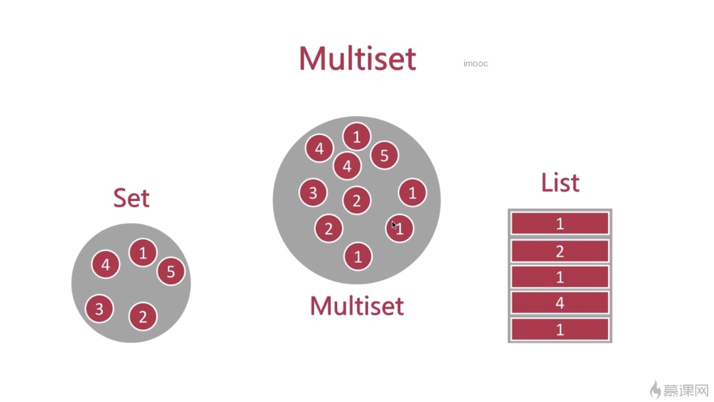

# 告别996之工具集

## Google Guava 工具集简介

Guava工程包含了若干被Google的Java项目广泛依赖的核心库，例如：集合、缓存、原生类型支持、并发库、通用注解、字符串处理、I/O等等。

所有这些工具每天都在被Google的工程师应用在产品服务中。

## 使用和避免null

正是收到Guava的启发，Java 8将Optional类作为一个新特性引入进Java 8的类库。

##Optional的使用 

```JAVA
public class OptionalTest {

    @Test
    public void test() throws Exception {
        /**
         * 三种创建Optional的方式
         */
        // 创建空的Optional对象
        Optional.empty();
        // 不能传入null，运行时会异常
        Optional.of("hello");
        // 可以接受任何值，null值也可以。使用任何值创建Optional对象
        Optional<Object> optional = Optional.ofNullable(null);

        /**
         * 判断是否引用缺失的方法
         * 我们要避免这种方式起来判断空，因为我们已经
         * 使用Optinal来包裹，这种方式和之前没有区别
         * 不推荐使用
         */
        optional.isPresent();

        /**
         * optional引用存在时执行方法
         * 类似的方法：map filter flatMap
         * 传入Customer函数式接口
         */
        optional.ifPresent(System.out::println);

        /**
         * 当引用缺失时执行
         */
        optional.orElse("引用缺失");


        optional.orElseGet(() -> {
            return "引用缺失时，自定义返回值";
        });

        /**
         * 引用缺失时允许抛出异常
         */

//        optional.orElseThrow(() -> {
//            throw new RuntimeException("引用缺失异常");
//        });
        /**
         * orElseThrow不能再方法体里面进行throw，这儿只需要return就好了
         */
        optional.orElseThrow(() -> {
             return new MyException("cccc");
         });


    }

    public static void stream(List<String> list) {
       // list.stream().forEach(System.out::println);
       Optional.ofNullable(list)
               // map是中间操作，将一个对象装换成另一个对象
               .map(List::stream)
               // 创建空的流
               .orElseGet(Stream::empty)
               .forEach(System.out::println);
    }

    public static void main(String[] args) {
        stream(null);
    }
 }
```

值得一提的是在`Optional`的`orElseThrow`里面`throw new RuntimeException("引用缺失异常");`的时候，运行时不通过的，只需要在里面return一段异常就好了。

还有就是**使用stream传入的是空搞得时候会报错**。换成`Optional.ofNullable`来接受就没有问题。

## 不可变集合

创建对象的**不可变拷贝**是一项很好的**防御性编程技巧**。

Guava为所有**JDK标准集合类型**和Guava新集合类型都提供了简单易用的不可变版本。

### 不可变对象的优点

+ 当对象被不可信的库调用时，不可变形式是安全的。
+ 不可变对象被多个线程调用时，不存在竞态条件问题
+ 不可变集合不需要考虑变化，因此可以节省空间和时间
+ 不可变对象因为有固定不变，可以作为常量来安全使用

### JDK提供的unmodifiableXXX方法

+ 笨重而且累赘
+ 不安全
+ 低效

### 小例子

```java
public class ImmutableTest {

    public static void test(List<Integer> list) {
        list.remove(0);
    }

    public static void main(String[] args) {
        List<Integer> list = new ArrayList<Integer>();

        list.add(1);
        list.add(2);
        list.add(3);

        test(list);

        System.out.println(list);
    }
}
```

```
[2, 3]
```

这个例子就是说list是可变的，也就是将引用传到方法中，所以在方法里面如果list的内容被移除了，外面的list的对应的内容也是被移除了，这样是很恐怖的，因为是引用传递，而且list是可变的，万一把所有数据都移除了，下面的语句就会报空指针。

这种情况下我们可以使用JDK提供的不可变集合对象。

```java
public static void main(String[] args) {
    List<Integer> list = new ArrayList<Integer>();

    list.add(1);
    list.add(2);
    list.add(3);

    List<Integer> integers = Collections.unmodifiableList(list);

    test(integers);

    System.out.println(list);
}
```

```java
Exception in thread "main" java.lang.UnsupportedOperationException
	at java.util.Collections$UnmodifiableList.remove(Collections.java:1317)
	at com.imooc.immutable.ImmutableTest.test(ImmutableTest.java:13)
	at com.imooc.immutable.ImmutableTest.main(ImmutableTest.java:25)

```

运行时直接报错。**但是这样比较繁琐，我们是先创建了一个集合，然后再用jdk提供的集合进行包装。再来使用。**

接下来我们来看看Guava

### 不可变集合的三种创建方式

+ `copyOf()`方法：`ImmutableSet.copy(set)`
+ of方法：`ImmutableSet.of("a", "b", "c")`
+ Builder工具：`ImmutableSet.builder().build()`

添加Guava依赖

```xml
<dependency>
  <groupId>com.google.guava</groupId>
  <artifactId>guava</artifactId>
  <version>28.0-jre</version>
  <scope>compile</scope>
</dependency>
```

```java
public static void immutableTest() {
    List<Integer> list = new ArrayList<Integer>();

    list.add(1);
    list.add(2);
    list.add(3);
    // 通过已经存在的集合创建
    ImmutableSet<Integer> immutableSet =
            ImmutableSet.copyOf(list);

    // 通过初始值，直接创建不可变集合
    ImmutableSet<Integer> of =
            ImmutableSet.of(1, 2, 3, 5);

    // 通过builder方式创建
    ImmutableSet.builder()
            .add(1)
            .add(2)
            .add(3).addAll(Sets.newHashSet(2, 3))
            .build();
}
```

## 新集合类型

Guava引入了很多JDK没有的、但**明显有用**的**新集合类型**。这些新类型是为了和JDK集合框架共存，而没有往JDK集合抽象中硬塞其他概念。

### MultiSet



#### 以两种不同视角来看Multiset

+ 没有元素顺序限制的ArrayList(E)
  + add(E): 添加单个给定元素
  + iterator()：返回一个迭代器，包含Multiset所有元素（包含重复元素）
  + size()：返回所有元素的总个数（包括重复元素）
+ Map<E, Integer>， 键为元素，值为计数
  + count(Object)：返回给定元素的计数
  + entrySet()：返回Set<Multiset.Entry<E>>,和Map的entrySet类似
  + elementSet()：返回所有不重复元素的Set<E>，和Map的keySet类似

#### Multiset与Map的区别

+ 元素计数只能是整数
+ multiset.size()返回集合大小
+ multiset.iterator()会迭代重复元素
+ multiset支持直接设置元素的计数
+ 没有元素：multiset.count(E) 为0 map则为null

#### 多种Multiset的实现

+ HashMultiset
+ TreeMultiset
+ LinkedHashMultiset
+ ConcurrentHashMultiset
+ ImmutableMultiset

### Multiset的使用

使用Multiset集合类，实现统计一篇文章中文字出现次数的功能

```java
public class MultisetDemo {
    private static final String text = "《南陵别儿童入京》 " +
            "白酒新熟山中归，黄鸡啄黍秋正肥。" +
            "呼童烹鸡酌白酒，儿女嬉笑牵人衣。" +
            "高歌取醉欲自慰，起舞落日争光辉。" +
            "游说万乘苦不早，著鞭跨马涉远道。" +
            "会稽愚妇轻买臣，余亦辞家西入秦。" +
            "仰天大笑出门去，我辈岂是蓬蒿人。";

    @Test
    public void handle() {
        Multiset<Character> multiset = HashMultiset.create();
        char[] chars = text.toCharArray();
        // Guava提供Chars
        Chars.asList(chars).stream().forEach(item -> {
            multiset.add(item);
        });

        System.out.println(multiset.size());
        System.out.println("count: " + multiset.count('人'));
    }

}
```

## 集合工具类

+ **使用Lists工具类操作List集合**

  ```java
  /**
   * 拆分
   * [[1, 2, 3], [4, 5, 6], [7]]
   */
  @Test
  public void partition() {
      ArrayList<Integer> integers = Lists.newArrayList(1, 2, 3, 4, 5, 6, 7);
      // 拆分 3个为一组
      List<List<Integer>> partition = Lists.partition(integers, 3);
      System.out.println(partition);
  }
  ```

  ```java
  /**
   * 反转
   * [3, 2, 1]
   */
  @Test
  public void reverse() {
      LinkedList<Integer> list = Lists.newLinkedList();
      list.add(1);
      list.add(2);
      list.add(3);
      List<Integer> reverse = Lists.reverse(list);
      System.out.println(reverse);
  }
  ```

+ **使用Sets工具类操作Set集合**

  ```java
  public class SetsTest {
  
      /**
       * Sets工具类的常用方法
       * 并集 / 交集 / 差集
       */
      public static final Set set1 = Sets.newHashSet(1, 2, 3, 4);
      public static final Set set2 = Sets.newHashSet(4, 5, 6);
  
      /**
       * 取并集
       * [1, 2, 3, 4, 5, 6]
       */
      @Test
      public void union() {
          Set<Integer> set = Sets.union(set1, set2);
          System.out.println(set);
      }
  
      /**
       * 取交集
       * [4]
       */
      @Test
      public void intersection() {
          Set<Integer> set = Sets.intersection(set1, set2);
          System.out.println(set);
      }
  
      /**
       * 差集：如果元素属于A而且不属于B
       * [1, 2, 3]
       */
      @Test
      public void difference() {
          Set<Integer> set = Sets.difference(set1, set2);
          System.out.println(set);
          // 相对差集，属于A而且不属于B 或者属于B而且不属于A
          set = Sets.symmetricDifference(set1, set2);
          System.out.println(set); // [1, 2, 3, 5, 6]
      }
  
      /**
       * 拆解
       * [[],[1],[2],[1,2],[3],[1,3],[2,3],[1,2,3],[4],[1,4],[2,4],[1,2,4],[3,4],[1,3,4],[2,3,4],[1,2,3,4]]
       */
      @Test
      public void powerSet() {
          Set<Set<Integer>> set = Sets.powerSet(set1);
          System.out.println(JSONObject.toJSONString(set, true));
      }
  
      /**
       * 笛卡尔积
       * [[1, 4], [1, 5], [1, 6], [2, 4], [2, 5], [2, 6], [3, 4], [3, 5], [3, 6], [4, 4], [4, 5], [4, 6]]
       */
      @Test
      public void catesianProduct() {
          Set<List<Integer>> set = Sets.cartesianProduct(set1, set2);
          System.out.println(set);
      }
  
  
  }
  ```

## I/O

### 对字节流/字符流提供的工具方法

+ ByteStreams：提供对InputStream/OutputStream的操作
+ CharStreams：提供对Reader/Writer的操作

### 对源(Source)与汇(Sink)的抽象

+ 源是可读的：ByteSource / CharSource
+ 汇是可写的：ByteSink / CharSink

### 实战案例

```java
/**
 * 演示如何使用源（source）与汇（sink）来对文件进行常用操作
 */
public class IoTest {

    /**
     * 拷贝文件
     * @throws IOException
     */
    @Test
    public void copyFile() throws IOException {
        /**
         * 创建对应的source与sink
         */
        CharSource charSource = Files.asCharSource(new File("SourceText.txt"), Charsets.UTF_8);

        CharSink charSink = Files.asCharSink(new File("TargetßText.txt"), Charsets.UTF_8);
        /**
         * 拷贝
         */
        charSource.copyTo(charSink);
    }
}
```

除此之外，他们还有很多其他的用法，比如charSource主要是负责读，比如按行读取，而sink就是写，也有很多api。然后Guava提供的Files也有很多api，比如创建临时文件，或者拷贝等等，都需要我们自己去看。