# 告别996之线程池

## 线程池带来的好处

+ **降低资源消耗**

  任何的池化技术都是要达到这个效果，也就是说通过重复利用现有的资源，来降低资源消耗，特别是线程池，创建和销毁的开销有点大。

+ **提高响应速度**

  当有任务达到时，可以不用创建线程，只能获取就好了。

+ **提高线程的可管理性**

  线程本就是稀缺的资源，如果无限制的创建肯定会对系统造成很大的影响，提高管理可以避免这些问题。

## 简单线程池的设计

1. 首先得有一个池子
2. 池子具有开启，关闭，初始化等功能
3. 用户从池子获取线程，使用完了线程然后归还

那么问题来了，初始化的时候需要创建多少线程合适？

如果池子里面线程被拿光了，再来一个任务咋整？

改进后：

可以跳出这种模式，**用户提交任务给线程池，然后我调用线程执行，最后把结果异步返回给用户**

1. 所以抽象出一个任务队列来存储用户提交的任务
2. 抽象出一个执行器从队列拿任务，从线程池拿线程，执行完了归还线程，把结果返回给用户

还是有问题：

1. 初始化的时候需要创建多少线程合适？
2. 存放任务的队列要多长？
3. 如果存放任务的队列满了我该怎么通知用户，是抛异常还是其他方式。

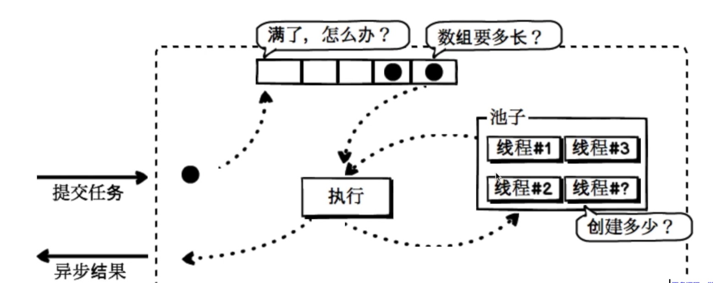

## 线程池的核心参数

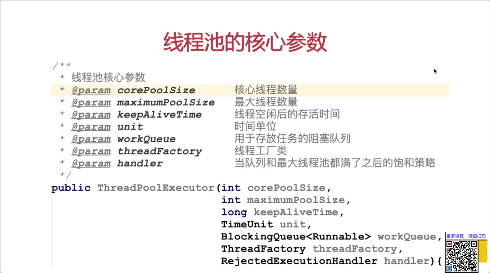

## 线程池的处理流程

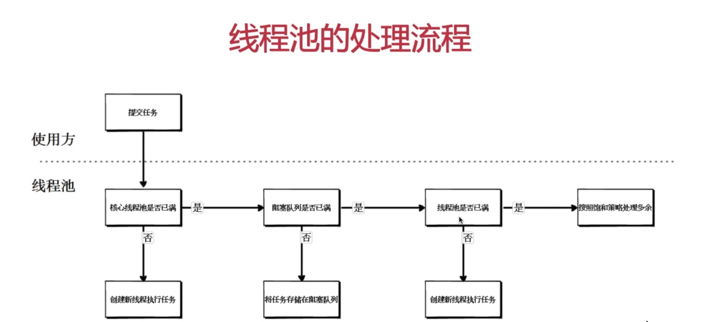

## 线程池可选择的阻塞队列

### 什么是阻塞队列

支持两个附加的操作的队列就是阻塞队列，这两个操作分别是**阻塞的插入**以及**移除**。

**阻塞的插入**：当队列满时队列会阻塞插入元素的线程直到队列不满。

**移除**：如果队列为空，获取元素的线程会一直等到队列为非空。

### 分类

+ 无界队列

+ 有界队列

+ 同步移交队列

  不存储元素的阻塞队列，每个插入的操作必须等待移除操作完成后

#### 有界队列

```java
@Test
public void test() throws InterruptedException {
    /**
     * 基于数组有界队列
     */
    ArrayBlockingQueue queue =
            new ArrayBlockingQueue<Integer>(10);
    // 循环向队列添加元素
    for (int i = 0; i < 20; i++) {
        queue.put(i);
        System.out.println("向队列中添加值：" + i);
    }
}
```

````java
向队列中添加值：0
向队列中添加值：1
向队列中添加值：2
向队列中添加值：3
向队列中添加值：4
向队列中添加值：5
向队列中添加值：6
向队列中添加值：7
向队列中添加值：8
向队列中添加值：9
````

可见到9的时候就阻塞住了

```java
@Test
public void testLinkedBlockingDeque() throws InterruptedException {
    /**
     * 基于链表有界队列，队列容量是10
     */
    LinkedBlockingDeque queue =
            new LinkedBlockingDeque<Integer>(10);
    // 循环向队列添加元素
    for (int i = 0; i < 20; i++) {
        queue.put(i);
        System.out.println("向队列中添加值：" + i);
    }
}
```

```java
向队列中添加值：0
向队列中添加值：1
向队列中添加值：2
向队列中添加值：3
向队列中添加值：4
向队列中添加值：5
向队列中添加值：6
向队列中添加值：7
向队列中添加值：8
向队列中添加值：9
```

同样到9的时候就阻塞住了

#### 无界队列

基于链表的无界队列

```java
public LinkedBlockingDeque() {
    this(Integer.MAX_VALUE);
}
```

这是链表的队列的无参构造方法，这个最大值就相当于一个无界的队列了。

#### 同步移交队列

```java
@Test
public void testSynchronousQueue() {
    /**
     * 同步移交阻塞队列
     */
    SynchronousQueue<Integer> integers =
            new SynchronousQueue<Integer>();
    /**
     * 它的元素的插入和移除依托线程
     */
    // 插入值
    new Thread(() -> {
        try {
            integers.put(1);
            System.out.println("插入成功");
        } catch (InterruptedException e) {
            e.printStackTrace();
        }
    }).start();

    // 删除值
    new Thread(() -> {
        try {
            integers.take();
            System.out.println("删除成功");
        } catch (InterruptedException e) {
            e.printStackTrace();
        }
    }).start();

}
```

```java

删除成功
插入成功
```

倘若我们把删除值的代码删掉如何：

```java
@Test
public void testSynchronousQueue() {
  /**
  	* 同步移交阻塞队列
    */
  SynchronousQueue<Integer> integers =
    new SynchronousQueue<Integer>();
  /**
    * 它的元素的插入和移除依托线程
    */
  // 插入值
  new Thread(() -> {
    try {
      integers.put(1);
      System.out.println("插入成功");
    } catch (InterruptedException e) {
      e.printStackTrace();
    }
  }).start();

  // 删除值
  //        new Thread(() -> {
  //            try {
  //                integers.take();
  //                System.out.println("删除成功");
  //            } catch (InterruptedException e) {
  //                e.printStackTrace();
  //            }
  //        }).start();
	Thread.sleep(1000L * 60);
}
```

上面结果都不能打印，显然不能插入成功。借助主线程睡眠可以看到，插入的线程一直在阻塞：

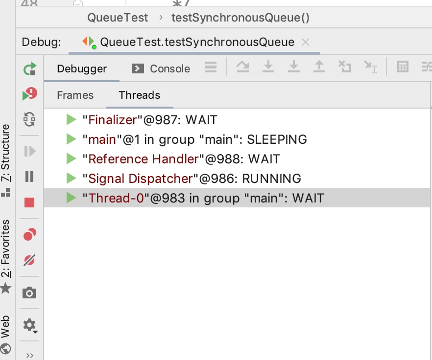

可以看出**同步移交队列是没有存储元素的能力，只能做生产者消费者一对一的功能的。**

## 线程池可选择的饱和策略

+ `AboutPolicy`终止策略（默认）
+ `DiscardPolicy`抛弃策略
+ `DiscardOldestPlolicy`抛弃旧任务策略
+ `CallerRunsPolicy`调用者运行策略

我们来看下ThreadPool源码

### `AboutPolicy`终止策略

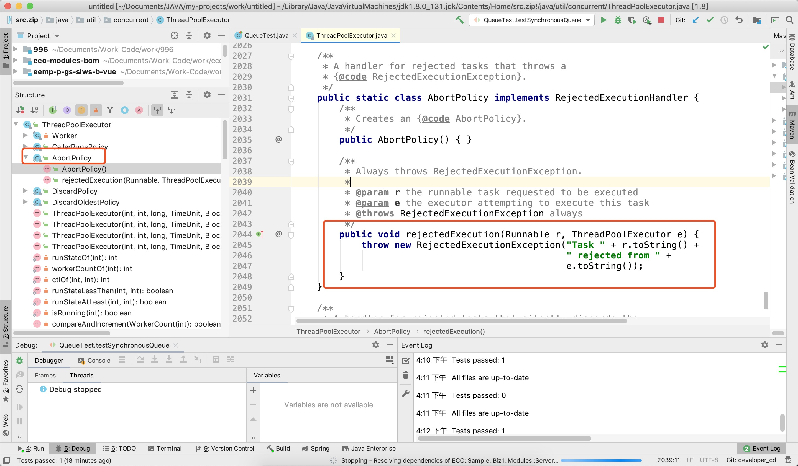

图中标红的部分就是线程池的饱和策略内部类。至于方法是满足饱和策略后该怎么做。这儿的`Runnable r`是当前传入的任务，`ThreadPoolExecutor e`是线程池对象，这个内容是抛出拒绝执行的异常来处理。

### `DiscardPolicy`抛弃策略

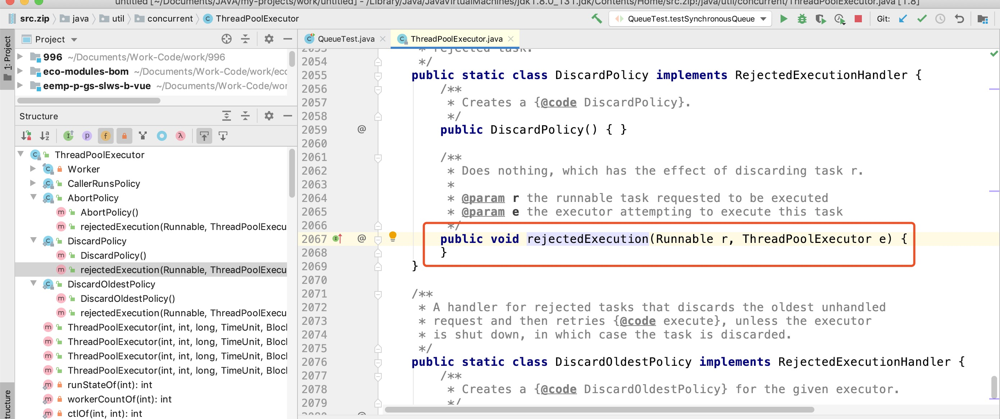

抛弃策略没有任何内容，调用者是无感知的。

### `DiscardOldestPlolicy`抛弃旧任务策略

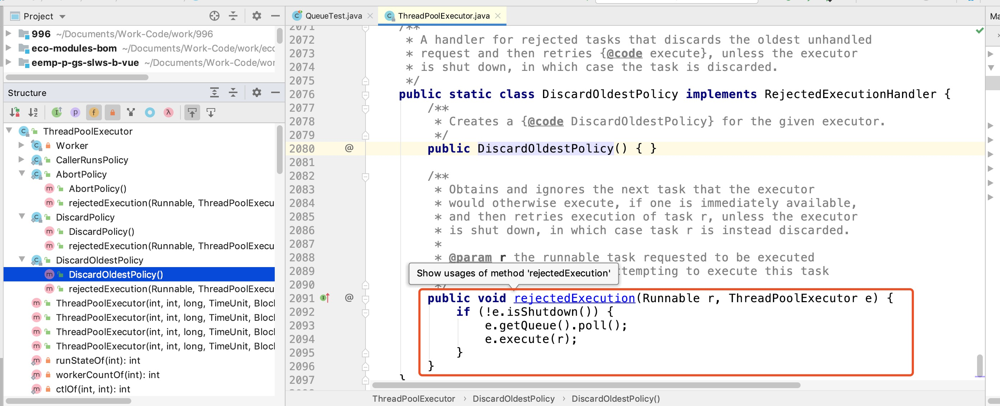

丢弃

### `CallerRunsPolicy`调用者运行策略

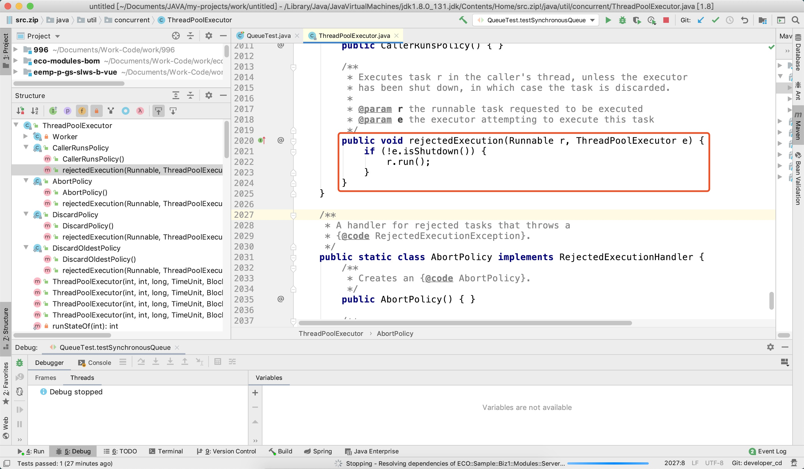

当前任务对象直接执行run方法，相当于调用方自己在执行任务，执行多少时间，调用就会阻塞多少时间。

## 线程执行示意图

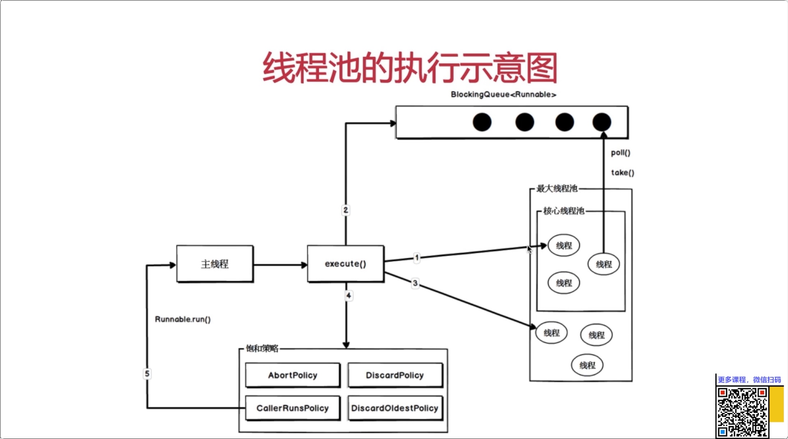

1. 主线程执行任务从核心线程池拿线程执行任务。
2. 如果线程满了就去放在阻塞队列里面，核心线程池轮询阻塞队列拿去任务执行。
3. 如果阻塞队列满了就去线程池创建新的线程，前提是没有超过最大线程数。
4. 如果超过了就执行饱和策略

## 常用线程池

### newCachedThreadPool


默认阻塞队列是同步移交队列，也就是说有一个任务对应就要有一个线程去消费才能接受另一个任务，最大的线程个数又是无限大，那么就会创建无限个线程，使用时要注意，创建无限个线程可能会导致系统崩溃。

### newFixedThreadPool

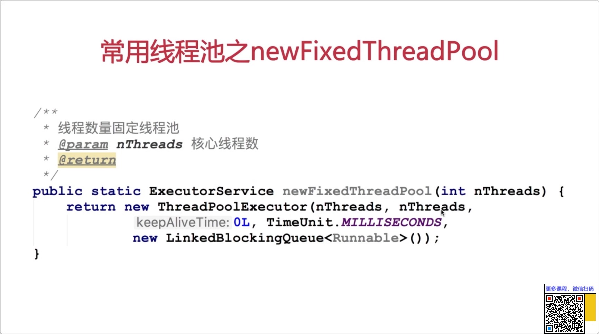

虽然线程数固定，但是使用了无界阻塞队列，如果提交任务过多，那么队列也会把系统内存撑满。

### newSingleThreadExecutor

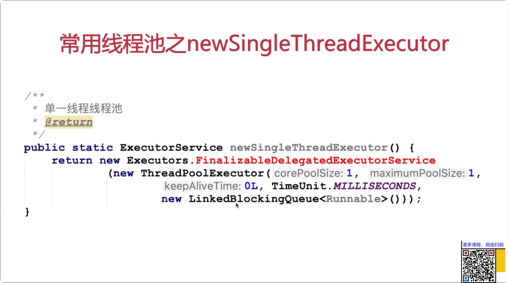

核心线程数是一个，最大线程数是一个，相当于一个线程，只不过任务会暂存在无界队列里面有一个线程顺序消费。

## 实战：向线程池提交任务

```java
/**
 * 利用submit方法提交任务，接受任务的返回结果
 */
@Test
public void submitTest() throws ExecutionException, InterruptedException {

    ExecutorService ex = Executors.newCachedThreadPool();
    // future能拿到线程池计算的结果
    Future<Integer> submit = ex.submit(() -> {
        Thread.sleep(1000L * 5);
        return 2 * 5;
    });
    /**
     * 阻塞方法，知道任务有返回值后，才向下执行
     */
    Integer num = submit.get();
    System.out.println("执行结果：" + num);
}

/**
 * 利用execute执行任务
 */
@Test
public void executeTest() {
    ExecutorService ex = Executors.newCachedThreadPool();
    ex.execute(() -> {
        /**
         * 只能抓取异常，不能抛出去
         */
        try {
            Thread.sleep(1000L * 5);
        } catch (InterruptedException e) {
            e.printStackTrace();
        }
        /**
         * 不能返回结果
         */
        Integer num = 2 * 5;
        System.out.println("执行结果，" + num);
    });
}
```

```java
public interface Executor {

    /**
     * Executes the given command at some time in the future.  The command
     * may execute in a new thread, in a pooled thread, or in the calling
     * thread, at the discretion of the {@code Executor} implementation.
     *
     * @param command the runnable task
     * @throws RejectedExecutionException if this task cannot be
     * accepted for execution
     * @throws NullPointerException if command is null
     */
    void execute(Runnable command);
}
```

```java
<T> Future<T> submit(Callable<T> task);
```

```java
@FunctionalInterface
public interface Callable<V> {
    /**
     * Computes a result, or throws an exception if unable to do so.
     *
     * @return computed result
     * @throws Exception if unable to compute a result
     */
    V call() throws Exception;
}
```

submit是callable默认会抛出异常，execute是Runnable不会抛出异常。

## 线程池的状态


