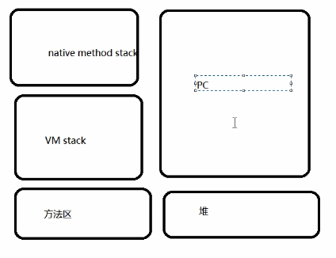
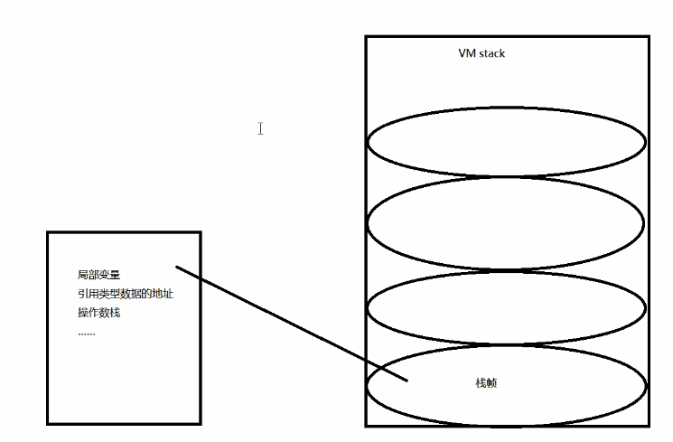
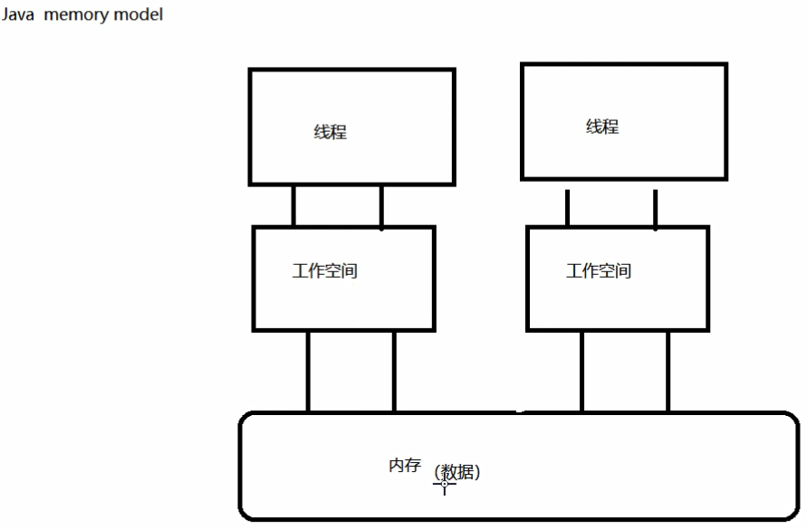
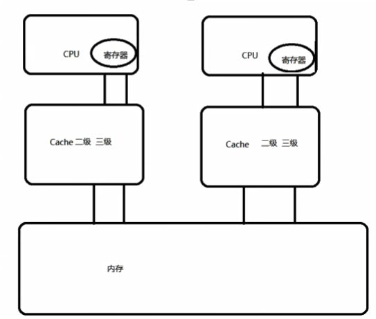
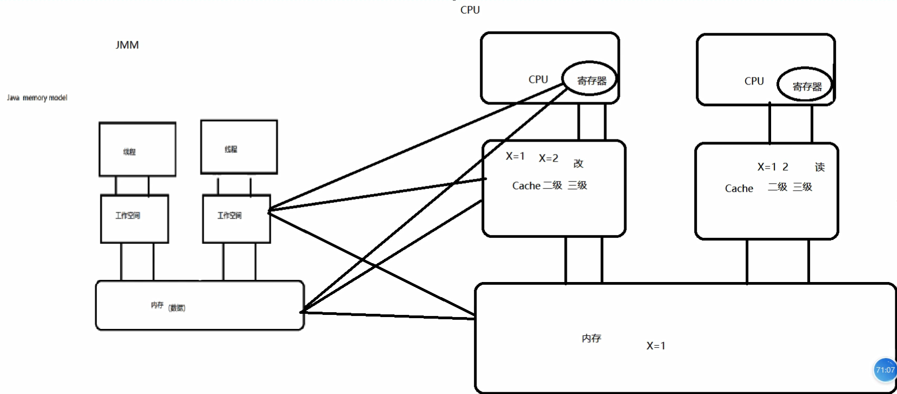

# Java内存模型

1. 线程与JVM

2. java内存区域与java内存模型的区别

3. 硬件内存架构与java内存模型

4. java内存模型对并发特征的保证

   

## 1、基本概念

程序：代码、完成某一件任务，代码序列（静态的概念）

进程：程序在某些数据上的一次运行（动态的概念）

线程：一个进程可能包含一个或多个线程（占有资源的单元）

## 2、JVM与线程

JVM什么时候启动？**类被调用的时候** JVM线程-->其他的线程（main）

线程在JVM中

## 3、JVM内存区域

+ **方法区**：加载的类的信息（classloader）、常量、static（静态的变量）、JIT（即时编译的代码）、Class（反射加载的类）**[信息共享]**

+ **Java堆区**：实例对象、GC工作的主要地方  **[信息共享]**

+ **VM stack（虚拟机栈）**：Java方法在运行时的内存模型。

  栈帧：方法运行当中相关的数据结构，每一个方法都有为一个相应的一个栈帧存放的私有数据，主要包含局部变量，引用类型数据的地址，操作数栈。

  

+ **PC(程序计数器)**：java线程的私有数据，这个数据就是执行下一条指令的地址。

+ **Native method stack（本地方法栈）**：虚拟机里面的native方法

  

## 4、Java内存模型 Java memory model JMM（规范，抽象的模型）

1. **主内存**： 共享的信息

2. **工作内存**：私有信息，基本数据类型直接分配到工作内存，引用类型的地址存放在工作内存中，引用的对象放在存放在堆中（主内存中）。

3. 工作方式：

   A线程修改私有数据，直接在工作空间修改。

   B线程修改共享数据，把数据复制到工作空间中去，然后在工作空间中修改，修改完成后刷新回内存。

**注意**：这样设计保证数据的不可见性，工作空间其实就是分配的内存区域。根据线程的栈帧多少给你分配多少的空间。如果超过虚拟机栈的大小（VM Stack）就会溢出。JMM是一种规范，JVM是根据JMM去划分的

## 5、硬件内存架构与Java内存模型

**硬件内存架构**

内存操作数据比较慢，CPU执行速度比较快，出现了速度不匹配，所以在CPU和内存中间增加高速缓存存储器，容量比内存小，速度比内存快，一般有二级缓存，三级缓存，一级缓存速度最高但是容量小，CPU有一个**寄存器**，CPU从寄存器中找数据，如果没有寄存器再从缓存中去找。

**CPU缓存的一致性问题：**并发处理的不同步

**解决方案**：

1. 通过总线加锁（BUS） 降低了CPU的吞吐量

2. 缓存一致性协议（MESI）：当CPU在cache中操作数据时，如果该数据时共享变量，数据在cache中读到寄存器中，然后再进行修改。并更新内存数据，并将Cache Line（缓存线）置成无效，其他的CPU就从内存中读取数据。

   

**Java线程与硬件处理器**

**Java内存模型与精简内存架构的关系**

因为有交叉所以导致数据的不一致性。

**Java内存模型的必要性**

规范内存数据和工作空间数据的交互

## 6、并发编程的三个重要特性

+ 原子性：不可分割的操作

+ 可见性：线程只能操作自己工作空间中的数据

+ 有序性：程序中的顺序不一定就是执行的顺序

  + 编译重排序

  + 指令重排序

    原则：

    + as-if-seria： 单线程中重排后不影响执行的结果
    + happens-before： 

    

## 7、JMM对三个特征的保证

1. JMM与原子性
   + x = 10 工作空间分配     写操作  具有原子性 **如果是私有数据具有原子性 如果是共享数据没有原子性（读写）**
   + y = x  **没有原子性** 
     - 把数据x读到工作空间（原子性）
     - 把x的值写到y中（原子性） 
   + i++ **没有原子性**
     + 读i到工作空间
     + +1
     + 刷新回内存
   + z = z + 1 **没有原子性**
     + 读z到工作空间
     + +1
     + 刷新回内存

​       **结论**：多个原子性操作合并到一起没有原子性

​	   **解决方法**：Synchronized，JUC Lock 的 Lock

2. JMM与可见性

   **Volatile关键字**：在JMM模型上实现MESI协议

   **Synchronized**: 加锁

   **JUC包下的Lock**

3. JMM与有序性

   **Volatile关键字**：在JMM模型上实现MESI协议

   **Synchronized**: 加锁

   **Happends-before原则**：

   	1. 程序次序原则
    	2. 锁定原则： 后一次加锁必须等前一次解锁
    	3. volatile原则：霸道原则
    	4. 传递原则：A ---- B --- C  => A----C

总结：

+ JVM内存区域与JMM的关系
+ JMM和硬件架构的关系
+ JMM和并发编程三个重要特征（有序性 as-if-seria happens-before）