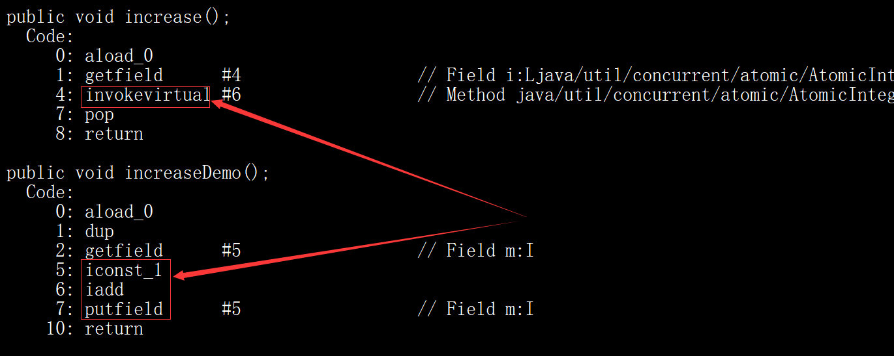
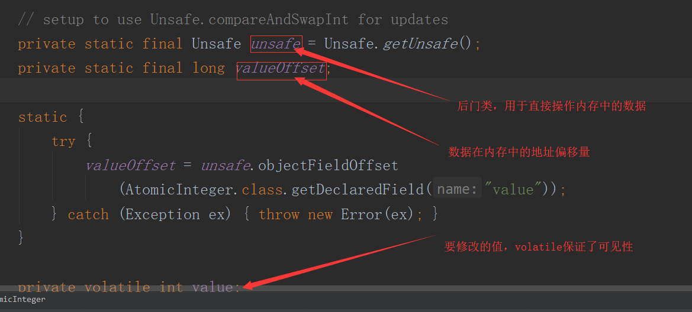
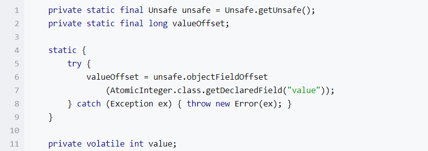
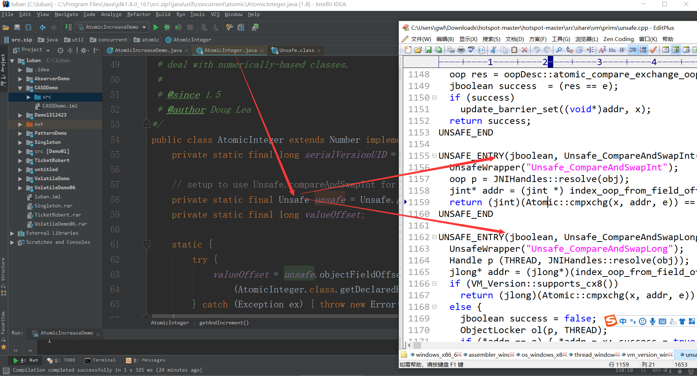
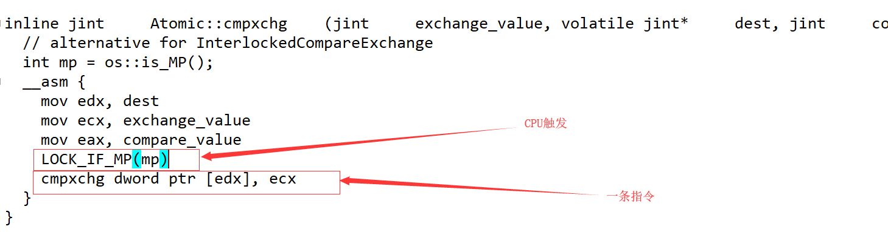
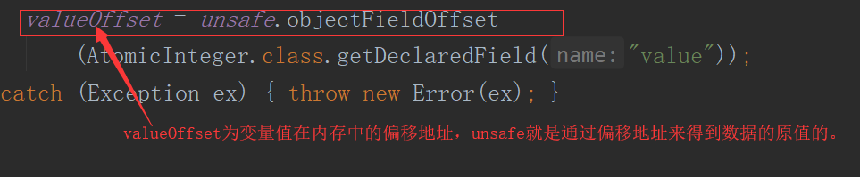
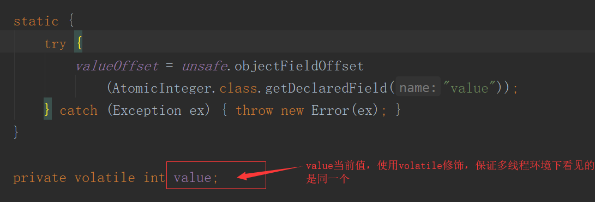
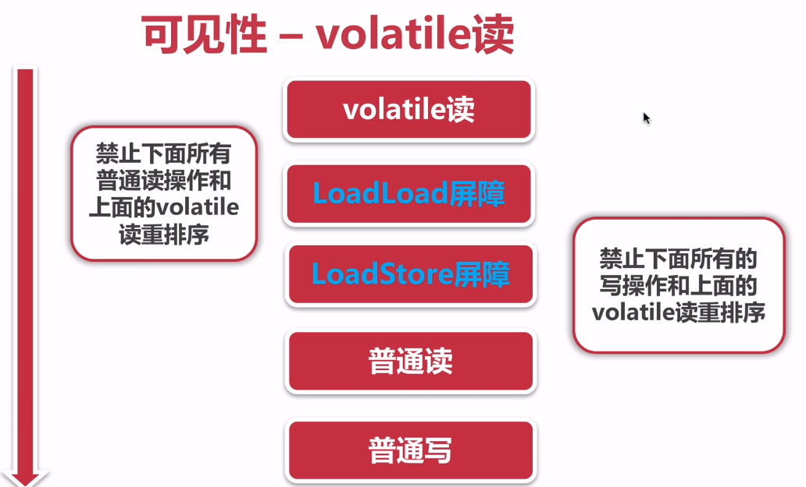
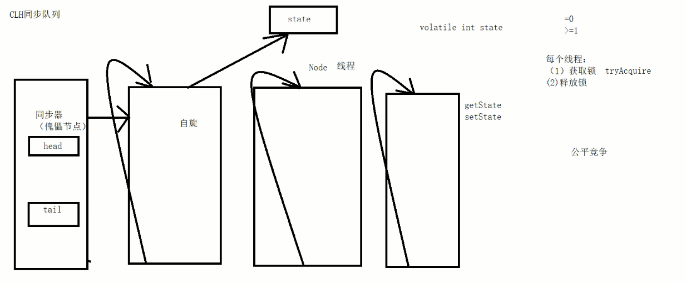

# 并发专题CAS和AQS

多线程

Synchronized

Volatile

单例模式

锁：封锁

+ 悲观锁：写多，读少    Lock

+ 乐观锁：读多，写少，**版本控制**

  

JUC

## 1、CAS

### 1）、概念

CAS （compareAndSwap），中文叫比较交换，一种无锁原子算法。过程是这样：它包含 3 个参数 CAS（V，E，N），V表示要更新变量的值，E表示预期值，N表示新值。仅当 V值等于E值时，才会将V的值设为N，如果V值和E值不同，则说明已经有其他线程做两个更新，则当前线程则什么都不做。最后，CAS 返回当前V的真实值。CAS 操作时抱着乐观的态度进行的，它总是认为自己可以成功完成操作。

CAS的全称为Compare And Swap，直译就是比较交换。是一条CPU的原子指令，其作用是让CPU先进行比较两个值是否相等，然后原子地更新某个位置的值，其实现方式是基于硬件平台的汇编指令，在intel的CPU中，使用的是`cmpxchg`指令，就是说CAS是靠硬件实现的，从而在硬件层面提升效率。

当多个线程同时使用CAS 操作一个变量时，只有一个会胜出，并成功更新，其余均会失败。失败的线程不会挂起，仅是被告知失败，并且允许再次尝试，当然也允许实现的线程放弃操作。基于这样的原理，CAS 操作即使没有锁，也可以发现其他线程对当前线程的干扰。

与锁相比，使用CAS会使程序看起来更加复杂一些，但由于其非阻塞的，它对死锁问题天生免疫，并且，线程间的相互影响也非常小。更为重要的是，使用无锁的方式完全没有锁竞争带来的系统开销，也没有线程间频繁调度带来的开销，因此，他要比基于锁的方式拥有更优越的性能。

简单的说，CAS 需要你额外给出一个期望值，也就是你认为这个变量现在应该是什么样子的。如果变量不是你想象的那样，哪说明它已经被别人修改过了。你就需要重新读取，再次尝试修改就好了。

CompareAndSet CompareAndSwap一种无锁的原子算法，乐观锁。

思想：给你一个期望值，与不现有的值比较，如果相等再修改，如果不相等什么事情都不做。

**CAS（V(现在的值)，V(期望值)， N(修改后的值)）**

### 1.1）、CAS原理

这样归功于硬件指令集的发展，实际上，我们可以使用同步将这两个操作变成原子的，但是这么做就没有意义了。所以我们只能靠硬件来完成，硬件保证一个从语义上看起来需要多次操作的行为只通过一条处理器指令就能完成。这类指令常用的有： 

1. 测试并设置（Tetst-and-Set） 

2. 获取并增加（Fetch-and-Increment） 

3. 交换（Swap） 

4. 比较并交换（Compare-and-Swap） 

5. 加载链接/条件存储（Load-Linked/Store-Conditional）

CPU 实现原子指令有2种方式： 

**1.** **通过总线锁定来保证原子性。** 

总线锁定其实就是处理器使用了总线锁，所谓总线锁就是使用处理器提供的一个 LOCK# 信号，当一个处理器在总线上输出此信号时，其他处理器的请求将被阻塞住，那么该处理器可以独占共享内存。但是该方法成本太大。因此有了下面的方式。

**2、通过缓存锁定来保证原子性。** 

所谓 缓存锁定 是指内存区域如果被缓存在处理器的缓存行中，并且在Lock 操作期间被锁定，那么当他执行锁操作写回到内存时，处理器不在总线上声言 LOCK# 信号，而时修改内部的内存地址，并允许他的缓存一致性机制来保证操作的原子性，因为缓存一致性机制会阻止同时修改两个以上处理器缓存的内存区域数据（这里和 volatile 的可见性原理相同），当其他处理器回写已被锁定的缓存行的数据时，会使缓存行无效。

注意：有两种情况下处理器不会使用缓存锁定。 

1. 当操作的数据不能被缓存在处理器内部，或操作的数据跨多个缓存行时，则处理器会调用总线锁定。 

2. 有些处理器不支持缓存锁定，对于和处理器，就是锁定的内存区域在处理器的缓存行也会调用总线锁定

### 2）、作用及优点

**CAS实现稍微复杂，无锁，不存在阻塞，提高了效率，提高CPU的吞吐量，可以减少上下文切换的时间（CPU时间片）**

### 3）、源码解析

```java
import java.util.concurrent.atomic.AtomicInteger;

public class Demo {
    private static volatile int m = 0;
    private static AtomicInteger count = new AtomicInteger(0);

    public Demo() {
    }

    public static void increse() {
        ++m;
    }

    public static void increase2() {
        int i = count.incrementAndGet();
        System.out.println("i: " + i);
    }

    public static void main(String[] args) throws Exception {
        Thread[] t = new Thread[20];

        for(int i = 0; i < 20; ++i) {
            t[i] = new Thread(() -> {
                increse();
            });
            t[i].start();
            t[i].join();
        }

        System.out.println("m: " + m);
        Thread[] tf = new Thread[20];

        for(int i = 0; i < 20; ++i) {
            tf[i] = new Thread(() -> {
                increase2();
            });
            tf[i].start();
            tf[i].join();
        }

        System.out.println("count: " + count.get());
    }
}
```

JUC下的```atomic```类都是通过CAS来实现的，下面就以```AtomicInteger```为例来阐述CAS的实现。如下：	

将编译的class文件通过`javap -v classxx`命令查看












Unsafe是CAS的核心类，Java无法直接访问底层操作系统，而是通过本地（native）方法来访问。不过尽管如此，JVM还是开了一个后门：Unsafe，它提供了硬件级别的原子操作。





内部调用``unsafe``的``getAndAddInt``方法，在``getAndAddInt``方法中主要是看``compareAndSwapInt``方法：

````java
// AtomicInteger类下的自增方法
/**
	var1: 当前实例
	var2：偏移量
	val4：自增的增量
	
**/
public final int getAndAddInt(Object var1, long var2, int var4) {
    int var5;
    do {
        // 通过当前对象和偏移量去内存中获取内存中的值
        var5 = this.getIntVolatile(var1, var2);
        // 如果当前的对象的值和内存中的值相等，则修改值（var5 + var4）并刷新回内存，返回的这点我不太懂
    } while(!this.compareAndSwapInt(var1, var2, var5, var5 + var4));

    return var5;
}

// 本地方法，通过unsafe类调用VM的指令，JVM通过unsafe.app下面使用C语言编写的程序然后执行汇编语言中的指令CMPXG...来实现比较和交换的操作
// 
public final native boolean compareAndSwapInt(Object var1, long var2, int var4, int var5);
````

### 4）、CAS应用场景

- 应用简单的数据计算
- 适合线程冲突少的场景

### 5）、缺点

CAS虽然高效地解决了原子操作，但是还是存在一些缺陷的，主要表现在三个方法：循环时间太长、只能保证一个共享变量原子操作、ABA问题。

**循环时间太长**

如果CAS一直不成功呢？这种情况绝对有可能发生，如果自旋CAS长时间地不成功，则会给CPU带来非常大的开销。在JUC中有些地方就限制了CAS自旋的次数，例如``BlockingQueue``的``SynchronousQueue``。

**只能保证一个共享变量原子操作**

看了CAS的实现就知道这只能针对一个共享变量，如果是多个共享变量就只能使用锁了，当然如果你有办法把多个变量整成一个变量，利用CAS也不错。例如读写锁中state的地位

**ABA问题**

```java
public class Demo1 {
    private static AtomicInteger count
            = new AtomicInteger(100);

    public static void main(String[] args) {
        new Thread(() -> {
            System.out.println(count.compareAndSet(100, 110));
        }).start();
        
        try {
            TimeUnit.SECONDS.sleep(3);
        } catch (InterruptedException e) {
            e.printStackTrace();
        }

        new Thread(() -> {
            System.out.println(count.compareAndSet(110, 100));
        }).start();
        try {
            TimeUnit.SECONDS.sleep(3);
        } catch (InterruptedException e) {
            e.printStackTrace();
        }

        new Thread(() -> {
            System.out.println(count.compareAndSet(100, 130));
        }).start();

    }

}

执行结果：
true
true
true
```

修改后：

```java
private static AtomicStampedReference<Integer> aba
            = new AtomicStampedReference<Integer>(100, 1);

    public static void main(String[] args) {

        Thread t1 = new Thread(() -> {
            System.out.println(aba.compareAndSet(100, 110, aba.getStamp(), aba.getStamp() + 1));
            try {
                TimeUnit.SECONDS.sleep(3);
            } catch (InterruptedException e) {
                e.printStackTrace();
            }
        });
        t1.start();
		// 故意获取版本号
        int stamp = aba.getStamp();

        Thread t2 = new Thread(() -> {
            System.out.println(aba.compareAndSet(110, 100, aba.getStamp(), aba.getStamp() + 1));
            try {
                TimeUnit.SECONDS.sleep(3);
            } catch (InterruptedException e) {
                e.printStackTrace();
            }
        });
        t2.start();
        Thread t3 = new Thread(() -> {

            System.out.println(aba.compareAndSet(100, 120, stamp, stamp + 1));
            try {
                TimeUnit.SECONDS.sleep(3);
            } catch (InterruptedException e) {
                e.printStackTrace();
            }
        });

        t3.start();
    }
执行结果：
true
true
false
```

也可以通过先获取版本号停顿较长时间来让其他类先执行来测试

### 6）、Atomic包下类的演示

+ 原子性：提供了互斥访问，同一时刻只能有一个线程来对它进行操作

+ 可见性：一个线程对主内存的修改可以及时的被其他线程观察到

  + 导致共享变量在线程间不可见的原因

    + 线程交叉执行
    + 重排序结合线程交叉执行
    + 共享变量更新后的值没有在工作内存与主存间及时更新

  + JMM关于`synchronized`的两条规定

    + 线程解锁前，必须把共享变量的最新值刷新到主内存
    + 线程加锁时，将清空工作内存中共享变量的值，从而使用共享变量时需要从主内存中重新读取最新的值`（注意，加锁和解锁是同一把锁）`

  + 可见性 - volatile

    通过加入内存屏障和禁止重排序优化来实现

    + 对volatile变量写操作时，会在写操作后加入一条store屏障指令，将本地内存中的共享变量刷新到主内存中

    + 对volatile变量读操作时，会在读操作前加入一条load屏障指令，从主内存中读取共享变量

      

      

      `但是volatile是不能保证线程安全的`，看下面的例子

      ```java
      public class Example1 {
          // 请求总数
          private static int clientTotal = 5000;
          // 允许同时访问的请求数
          private static int threadTotal = 200;
      
          private static volatile int count = 0;
      
          private static void add() {
              count++;
          }
      
          public static void main(String[] args) throws InterruptedException {
              ExecutorService executorService
                      = Executors.newCachedThreadPool();
              CountDownLatch countDownLatch =
                      new CountDownLatch(clientTotal);
              Semaphore semaphore =
                      new Semaphore(threadTotal);
              for (int i = 0; i < clientTotal; i++) {
                  executorService.execute(() -> {
                      try {
                          semaphore.acquire();
                          add();
                          semaphore.release();
                      } catch (InterruptedException e) {
                          e.printStackTrace();
                      }
                      countDownLatch.countDown();
                  });
              }
              countDownLatch.await();
              executorService.shutdown();
              System.out.println(count);
          }
      }
      ```

      `结果总是小于5000，为什么？`

      `分析：count++分三步，第一步从内存中读取count，第二不在本地内存中修改，第三步刷新回内存`

      `但是如果有多个线程同时操作，如果同时读取count，同时刷新回内存值就会一直小于5000，就算同时从主内存中读取某个被volatile修饰的值不被指令重排序，但是count++是不能保证原子性的，因为写会内存的值已经改变了，所以volatile不能保证原子性`

      + 可见性 - volatile使用

        ```java
        显然volatile不适合计数的场景！那么它适合什么场景呢？
        1.对变量的写操作不依赖当前值
        2.该变量没有包含在具有其他变量不必要的式子中
        所以特别适合volatile状态标记量
        volatile boolean inited = false;
        // 线程一
        context = loadContext();
        inited = true;
        // 线程二
        while (!inited) {
            sleep();
        }
        doSomethingWithConfig(context);
        ```

        `volatile只能防止指令重排序，及时从内存中读取和刷新回主内存，所以中间的操作不能保证原子性`

+ 有序性：一个线程观察其他线程中的指令执行顺序，由于指令重排序的存在，该观察结果一般杂乱无序

  重排序会影响多线程并发执行的正确性

  volatile、synchronized、lock

  如果线程顺序不能通过`happends-before`原则推导出来就会被jvm指令重排序

  + happends-before原则
    + 程序次序原则：一个线程内，按照代码顺序，书写在前面的操作先行发生于书写在后面的操作（保证程序在单线程中的正确性）
    + 锁定规则：一个unlock操作先行发生于后面对同一个锁的lock操作
    + volatile变量规则：对一个变量的写操作先行发生于后面对这个变量的读操作
    + 传递规则：如果A先行发生于B，而B先行发生于C，所以A先行发生于C
    + 线程启动规则：Thread对象的start()方法先行发生于此线程的每一个动作
    + 线程中断规则：对线程interrupt()方法的调用先行发生于被中断线程的代码检测到中断事件的发生
    + 线程终结规则：线程中所有的操作都先行发生于线程的终止检测，我们可以通过Thread.join()方法结束、Thread.isAlive()的返回值手段检测到线程已经终止执行
    + 对象终结规则：一个对象的初始化完成先行发生于他的finalize()方法的开始

#### 1、AtomicLong与LongAddr

```AtomicLong```与```AtomicInteger```一样，只不过是处理Long的数据。

````java
/**
 * 演示AtomicLong
 */
@Slf4j
public class AtomicLongExample {
    // 请求总数
    private static int clientTotal = 5000;
    // 允许同时访问的请求数
    private static int threadTotal = 200;

    private static AtomicLong count = new AtomicLong(0);

    public static void main(String[] args) throws InterruptedException {
        ExecutorService executorService = Executors.newCachedThreadPool();
        CountDownLatch countDownLatch = new CountDownLatch(clientTotal);
        Semaphore semaphore = new Semaphore(threadTotal);
        for (int i = 0; i < clientTotal; i++) {
            executorService.execute(() -> {
                try {
                    semaphore.acquire();
                    count();
                    semaphore.release();
                } catch (InterruptedException e) {
                    e.printStackTrace();
                }
                countDownLatch.countDown();
            });
        }
        countDownLatch.await();
        log.info("count: {}", count.get());
        executorService.shutdown();
    }

    private static void count() {
        // incrementAndGet 先增加再获取
        // getAndIncrement 先获取再增加
        // count.getAndIncrement()
        count.incrementAndGet();
    }
}
````

#### 2、LongAdder

`LongAdder`类与`AtomicLong`类的区别在于高并发时前者将对单一变量的CAS操作分散为对数组`cells`中多个元素的CAS操作，取值时进行求和；而在并发较低时仅对`base`变量进行CAS操作，与`AtomicLong`类原理相同。不得不说这种分布式的设计还是很巧妙的。**文章末尾会有详细的源码介绍**

````java
/**
 * 演示LongAdder
 */
@Slf4j
public class LongAdderExample {
    // 请求总数
    private static int clientTotal = 5000;
    // 允许同时访问的请求数
    private static int threadTotal = 200;
    // longAdder默认是0
    private static LongAdder count = new LongAdder();

    public static void main(String[] args) throws InterruptedException {
        ExecutorService executorService
                = Executors.newCachedThreadPool();
        CountDownLatch countDownLatch
                = new CountDownLatch(clientTotal);
        Semaphore semaphore
                = new Semaphore(threadTotal);
        for (int i = 0; i < clientTotal; i++) {
            executorService.execute(() -> {
                try {
                    semaphore.acquire();
                    count();
                    semaphore.release();
                } catch (InterruptedException e) {
                    e.printStackTrace();
                }
                countDownLatch.countDown();
            });
        }
        countDownLatch.await();
        log.info("count: {}", count);
        executorService.shutdown();
    }

    private static void count() {
        // 默认加一，也可以调用add（）方法传入参数进行相加
        count.increment();
    }
}
````

#### 3、AtomicReference

````java
@Slf4j
public class AtomicReferenceExample {
    private static AtomicReference<Integer> count
                            = new AtomicReference<Integer>(0);

    public static void main(String[] args) {
        count.compareAndSet(0, 2);
        count.compareAndSet(0, 1);
        count.compareAndSet(1, 2);
        count.compareAndSet(2, 4);
        count.compareAndSet(3, 2);
        log.info("count: {}", count);
    }
}
````

#### 4、AtomicIntegerFieldUpdater

基于反射的实用工具，可以对指定类的指定 `volatile int` 字段进行原子更新。此类用于原子数据结构，该结构中同一节点的几个字段都独立受原子更新控制。

````java
@Slf4j
public class AtomicFieldUpdaterExample {
    private static AtomicIntegerFieldUpdater<AtomicFieldUpdaterExample> updaer
            = AtomicIntegerFieldUpdater.newUpdater(AtomicFieldUpdaterExample.class, "count");

    // 变量必须是volatile修饰的，并且不能被static修饰
    @Getter
    public volatile int count = 100;

    public static void main(String[] args) {
        AtomicFieldUpdaterExample atomicFieldUpdater
                = new AtomicFieldUpdaterExample();
        if (updaer.compareAndSet(atomicFieldUpdater, 100, 120)) {
            log.info("update success, {}", atomicFieldUpdater.getCount());
        }
        if (updaer.compareAndSet(atomicFieldUpdater, 100, 120)) {
            log.info("update success, {}", atomicFieldUpdater.getCount());
        } else {
            log.info("update failed");
        }
    }
}
````

## 2、安全发布对象

### 1、发布与逸出

发布对象：使一个对象能够被当前范围之外的代码所使用

对象逸出：一种的错误的发布。当一个对象还么有构造完成时，就使它被其他线程所见

日常开发中经常要发布对象，下面演示发布对象

```java
public class UnsafePublish {

    private String[] states = {"a", "b", "c"};

    public String[] getStates() {
        return states;
    }

    public static void main(String[] args) {
        UnsafePublish unsafePublish =
                new UnsafePublish();
        System.out.println(Arrays.toString(unsafePublish.getStates()));

        unsafePublish.getStates()[0] = "d";
        System.out.println(Arrays.toString(unsafePublish.getStates()));
    }

}
```

```txt
分析：
以上发布对象是不安全的，通过getStates得到私有域的states数组的引用，就可以在其他任何线程里面修改数组的值，如果想在任何线程里使用数据的引用的时候，数据不一定是正确的。
```

逸出

```java
public class Escape {

    private int thisCanBeEscape = 0;

    public Escape() {
        new InnerClass();
    }
    // 内部类
    private class InnerClass {

        public InnerClass() {
            System.out.println(Escape.this.thisCanBeEscape);
        }
    }

    public static void main(String[] args) {
        new Escape();
    }
}
```

```txt
0
分析：内部类的实例里面包含了对封装实例的隐含和引用，这样在对象没有被正确构造之前就会被发布，导致this引用在构造期间逸出的错误，在构造期间启动一个线程，新线程在构造之前就可以看到this
在对象未完成构造之前不能被发布
```

### 2、四种方法

1. 在静态初始化函数中初始化一个对象引用
2. 将对象的引用保存到volatile类型域或者AtomicReference对象中
3. 将对象的引用保存到某个正确构造对象的final类型域中
4. 将对象的引用保存到一个由锁保护的域中

### 3、单例模式

下面通过单例的方式来验证`安全发布对象`

#### 1、懒汉模式

```java
/**
 * 懒汉模式
 * 在第一次调用的时候才创建
 */
public class SingletonExample1 {
    // 私有构造函数
    private SingletonExample1(){}
    // 单例对象
    private static SingletonExample1 instance = null;
    // 静态的工厂方法
    public static SingletonExample1 getInstance() {
        if (instance == null) {
            instance = new SingletonExample1();
        }
        return instance;
    }
}
```

```java
以上的单例模式是线程不安全的，显而易见
```

#### 2、饿汉模式

```java
/**
 * 饿汉模式
 * 在类加载的时候创建
 */
public class SingletonExample2 {
    // 私有构造函数
    private SingletonExample2(){}
    // 单例对象
    private static SingletonExample2 instance = new SingletonExample2();
    // 静态的工厂方法
    public static SingletonExample2 getInstance() {
        return instance;
    }
}
```

`饿汉模式是线程安全的，因为Java类加载的时候是天然线程安全的，但是如果构造方法中存在过多的处理，会导致类加载很慢，引起性能问题，如果加载后没有调用会造成资源的浪费`

`也可以通过静态代码块初始化对象`

```java
static {
    instance = new SingletonExample2();
}
```

那么懒汉模式也可以线程安全么？

增加`synchronized`关键字

```java
public static synchronized SingletonExample1 getInstance() {
    if (instance == null) {
        instance = new SingletonExample1();
    }
    return instance;
}
```

```java
线程安全，但是这种写法并不推荐，加了关键字通过同一时刻只能允许一个线程创建对象，但是会造成性能的开销
```

#### 3、双重检查锁定

那么将`synchronized`下沉到类中，双重检查锁定

```java
public static synchronized SingletonExample1 getInstance() {
    if (instance == null) {
        synchronized (SingletonExample1.class) { // 同步锁
            if (instance == null) {
                instance = new SingletonExample1();
            }
        }
    }
    return instance;
}
```

```java
双重同步锁单例模式，但是依旧不是线程安全的
instance = new SingletonExample1();
// 1.memory = allocate() 分配对象的内存空间
// 2.ctorInstance() 初始化对象
// 3.instance = memory 设置instance指向刚分配的内存
但是在多线程会发生指令重拍，2,3操作重排后，会存在对象还没有初始化就返回回去了
```

那么有什么方法呢

```java
private volatile static SingletonExample3 instance = null;
```

```java
volatile + 双重检测机制 来禁止指令重排序
```

对于单例模式还有其他方法么？

#### 4、枚举

```java
public class SingletonExample4 {
    
    private SingletonExample4(){}
    
    private volatile static SingletonExample4 instance = null;
    
    public static synchronized SingletonExample4 getInstance() {
        return Singleton.INSTANCE.getInstance();
    }

    private enum Singleton {
        INSTANCE;
        
        private SingletonExample4 singleton;
        // JVM保证这个方法只调用一次
        Singleton() {
            singleton = new SingletonExample4();
        }
        
        public SingletonExample4 getInstance() {
            return singleton;
        }
    }
}
```

`使用枚举方法是天然的线程安全，同时又是延迟加载`

#### 5、静态内部类

相比于懒汉以及饿汉模式，静态内部类模式（一般也被称为 Holder）是许多人推荐的一种单例的实现方式，因为相比懒汉模式，它用更少的代码量达到了延迟加载的目的。

顾名思义，这种模式使用了一个私有的静态内部类，来存储外部类的单例，这种静态内部类，一般称为 Holder。

而利用静态内部类的特性，外部类的 getinstance() 方法，可以直接指向 Holder 持有的对象。

```java
public class SingletonExample5 {

    private SingletonExample5(){}

    private volatile static SingletonExample5 instance = null;

    public static synchronized SingletonExample5 getInstance() {
        return SingtonHolder.instance;
    }
    // 静态内部类
    private static class SingtonHolder {
        private static SingletonExample5 instance = new SingletonExample5();
    }
}
```

`分析：在调用的时候才去初始化静态内部类，因为Java类的加载是一个天然的线程安全的过程，所以这个intance对象是线程安全的`

#### 6、单例模式的破坏

##### 1、序列化和反序列化

```java
public class SingletonExample2 implements Serializable {

    private SingletonExample2(){}

    private static SingletonExample2 instance = new SingletonExample2();

    public static SingletonExample2 getInstance() {
        return instance;
    }

    public static void main(String[] args) throws IOException, ClassNotFoundException {
        SingletonExample2 instance =
                SingletonExample2.getInstance();
        ObjectOutputStream oos =
                new ObjectOutputStream(new FileOutputStream("E:\\ceshi.txt"));
        oos.writeObject(instance);

        File file = new File("E:\\ceshi.txt");
        ObjectInputStream ois =
                new ObjectInputStream(new FileInputStream(file));
        SingletonExample2 newInstance = (SingletonExample2) ois.readObject();

        System.out.println(instance == newInstance);
    }
}
```

```java
false
```

解决方法：

在代码中加入一个方法

```java
public Object readResolve() {
   return instance;
}
```

为什么会这样？让我们查看源码

```java
oos.writeObject(instance);
```

```java
Object obj = readObject0(false);
```

```java
case TC_OBJECT:
	return checkResolve(readOrdinaryObject(unshared));
```

```java
try {
    obj = desc.isInstantiable() ? desc.newInstance() : null;
} catch (Exception ex) {
    throw (IOException) new InvalidClassException(
        desc.forClass().getName(),
        "unable to create instance").initCause(ex);
}
```

```java
/**
     * Returns true if represented class is serializable/externalizable and can
     * be instantiated by the serialization runtime--i.e., if it is
     * externalizable and defines a public no-arg constructor, or if it is
     * non-externalizable and its first non-serializable superclass defines an
     * accessible no-arg constructor.  Otherwise, returns false.
     */
// 简单来说就是类被序列化后，会返回true
boolean isInstantiable() {
    requireInitialized();
    return (cons != null);
}
```

```java
所以在上一步就会desc.newInstance() 返回 不着急还有下面代码
```

```java
if (obj != null &&
            handles.lookupException(passHandle) == null &&
            desc.hasReadResolveMethod())
        {
            Object rep = desc.invokeReadResolve(obj);
            if (unshared && rep.getClass().isArray()) {
                rep = cloneArray(rep);
            }
            if (rep != obj) {
                // Filter the replacement object
                if (rep != null) {
                    if (rep.getClass().isArray()) {
                        filterCheck(rep.getClass(), Array.getLength(rep));
                    } else {
                        filterCheck(rep.getClass(), -1);
                    }
                }
                handles.setObject(passHandle, obj = rep);
            }
        }
```

```java
看判断条件如果desc.hasReadResolveMethod()为true 就会执行这个方法，所以会在原来的类里面添加readResolve（）方法
```

##### 2、反射破坏

```java
SingletonExample2 instance = SingletonExample2.getInstance();
Class clazz = SingletonExample2.class;
Constructor constructor = clazz.getDeclaredConstructor();
constructor.setAccessible(true); // 获取private权限
SingletonExample2 newInstance = (SingletonExample2) constructor.newInstance();
System.out.println(instance == newInstance);
```

```java
false
```

解决方法：

在构造函数加入判断

```java
private SingletonExample2() {
    if (instance != null) {
        throw new RuntimeException("单例类禁止反射调用");
    }
}
```

```java
Exception in thread "main" java.lang.reflect.InvocationTargetException
	at sun.reflect.NativeConstructorAccessorImpl.newInstance0(Native Method)
	at sun.reflect.NativeConstructorAccessorImpl.newInstance(NativeConstructorAccessorImpl.java:62)
	at sun.reflect.DelegatingConstructorAccessorImpl.newInstance(DelegatingConstructorAccessorImpl.java:45)
	at java.lang.reflect.Constructor.newInstance(Constructor.java:423)
	at com.dev.devinspringboot.concurrency.singleton.SingletonExample2.main(SingletonExample2.java:46)
Caused by: java.lang.RuntimeException: 单例类禁止反射调用
	at com.dev.devinspringboot.concurrency.singleton.SingletonExample2.<init>(SingletonExample2.java:15)
	... 5 more
```

`在使用反射的时候newInstance的时候一定会调用构造方法，所以加上判断就好了，那么还有那种单例方法能使用呢`

静态内部类方式：

```java
public class SingletonExample5 {

    private SingletonExample5(){}

    private volatile static SingletonExample5 instance = null;

    public static synchronized SingletonExample5 getInstance() {
        return SingtonHolder.instance;
    }
    // 静态内部类
    private static class SingtonHolder {
        private static SingletonExample5 instance = new SingletonExample5();
    }

    public static void main(String[] args) throws Exception {
        SingletonExample5 instance =
                SingletonExample5.getInstance();
        Class clazz = SingletonExample5.class;
        Constructor constructor = clazz.getDeclaredConstructor();
        constructor.setAccessible(true); // 获取private权限
        SingletonExample5 newInstance = (SingletonExample5) constructor.newInstance();
        System.out.println(instance == newInstance);
    }
}
```

```java
false
```

照例在构造方法加入判断

```java
private SingletonExample5() {
    if (SingtonHolder.instance != null) {
        throw new RuntimeException("单例类禁止反射调用");
    }
}
```

```java
Caused by: java.lang.RuntimeException: 单例类禁止反射调用
```

使用懒汉模式测试

```java
public class SingletonExample1 {
    // 私有构造函数
    private SingletonExample1(){
        if (instance != null) {
            throw new RuntimeException("单例模式禁止调用反射");
        }
    }
    // 单例对象
    private static SingletonExample1 instance = null;
    // 静态的工厂方法
    public static synchronized SingletonExample1 getInstance() {
        if (instance == null) {
            instance = new SingletonExample1();
        }
        return instance;
    }

    public static void main(String[] args) throws NoSuchMethodException, IllegalAccessException, InvocationTargetException, InstantiationException {
        SingletonExample1 instance =
                SingletonExample1.getInstance();
        Class clazz = SingletonExample1.class;
        Constructor constructor = clazz.getDeclaredConstructor();
        constructor.setAccessible(true); // 获取private权限
        SingletonExample1 newInstance = (SingletonExample1) constructor.newInstance();
        System.out.println(instance == newInstance);
    }
}
```

```java
Caused by: java.lang.RuntimeException: 单例模式禁止调用反射
```

`如果调换反射的懒加载的顺序呢`

```java
Class clazz = SingletonExample1.class;
Constructor constructor = clazz.getDeclaredConstructor();
constructor.setAccessible(true); // 获取private权限
SingletonExample1 newInstance = (SingletonExample1) constructor.newInstance();
SingletonExample1 instance =
    SingletonExample1.getInstance();
System.out.println(instance == newInstance);
```

```java
false
```

`先由反射生成对象，然后再由懒加载方式生成对象就不会跑错，怎么会这样？结论是懒加载的模式反射调用是可以的，无法避免的，如果加入一个变量来控制呢？`

```java
private static boolean flag = true;
// 私有构造函数
private SingletonExample1(){
    if (flag) {
        flag = false;
    } else {
        throw new RuntimeException("单例模式禁止调用反射");
    }
}
```

`这样的话虽然可以避免反射攻击，但是反射也可以操作flag变量，所以还是不行的，比如`

```java
Class clazz = SingletonExample1.class;
Constructor constructor = clazz.getDeclaredConstructor();
constructor.setAccessible(true); // 获取private权限
SingletonExample1 newInstance = (SingletonExample1) constructor.newInstance();
// 反射修改私有变量的值
Field flag = newInstance.getClass().getDeclaredField("flag");
flag.setAccessible(true);
flag.set(newInstance, true);
SingletonExample1 instance =
    SingletonExample1.getInstance();
System.out.println(instance == newInstance);
```

`结果证明使用上面枚举的方式和静态内部类的方式，无论是先反射再实例或者先实例化再反射都是可以避免反射对单例的破坏的`

## 3、AQS 

1. 概念

   AbstractQueuedSychronizer: 同步发生器，用于构建锁（LOCK） 主要在JUC包下，比如**ReentrantLock**

2. 基本思想

   通过的内置的**FIFO**同步队列来完成线程争夺资源的管理工作

3. CLH同步队列

   AQS里面获取锁一般

   队列里面有一个head、tail、 state（代表资源占有状态，如果>=1说明资源已经被占有）

   如果锁没有释放，队列里面的线程```自旋```，自旋其实是空循环，把线程挂起涉及内核线程，用户线程和内核线程的切换时非常耗时的，这个时候就自旋等待，不去切换，所以切换会少很多。

   

AbstractQueuedSychronizer：

````java
// 这是 AbstractQueuedSychronizer类中的静态内部节点类
static final class Node {
        /** Marker to indicate a node is waiting in shared mode */
        static final Node SHARED = new Node();
        /** Marker to indicate a node is waiting in exclusive mode */
        static final Node EXCLUSIVE = null;

        /** waitStatus value to indicate thread has cancelled */
        static final int CANCELLED =  1; // 线程完成，或者取消后的状态
        /** waitStatus value to indicate successor's thread needs unparking */
        static final int SIGNAL    = -1;  // 节点的继任节点阻塞
        /** waitStatus value to indicate thread is waiting on condition */
        static final int CONDITION = -2;  // 条件阻塞
        /**
         * waitStatus value to indicate the next acquireShared should
         * unconditionally propagate
         */
        static final int PROPAGATE = -3;  // 共享模式 头结点的状态
 }    
````

