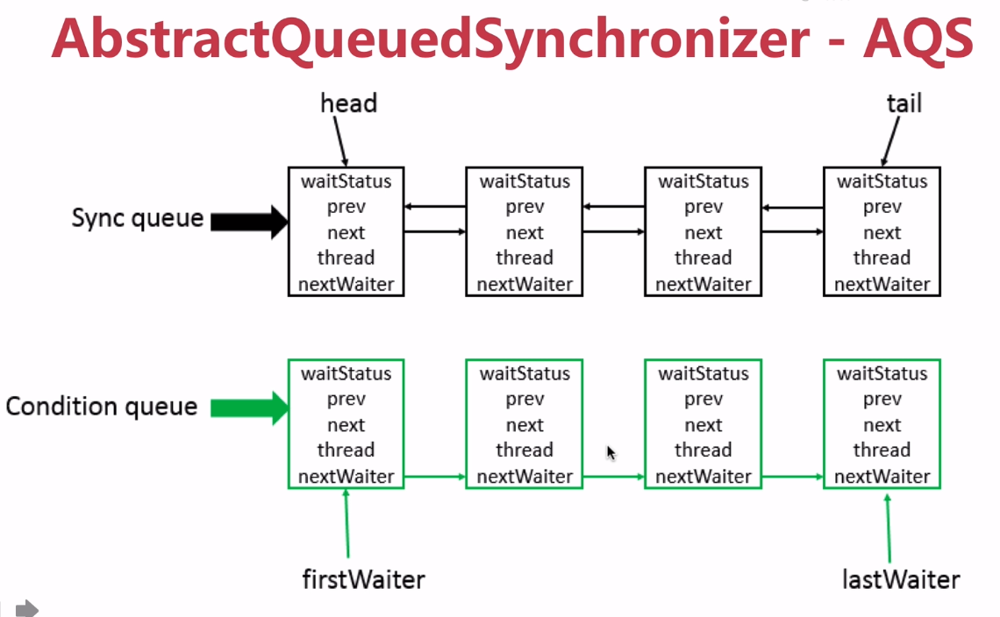

# 1、准备

## 1.1、并发编程初体验

实现一个计数功能

```java
import java.util.concurrent.ExecutorService;
import java.util.concurrent.Executors;
import java.util.concurrent.Semaphore;

public class CountExample {
    // 5000的并发，同时允许200的并发
    private static int threadTotal = 200;
    private static int clientTotal = 5000;

    private static long count = 0;

    public static void main(String[] args) {
        ExecutorService exec = Executors.newCachedThreadPool();
        final Semaphore semaphore = new Semaphore(threadTotal);
        for (int i = 0; i < clientTotal; i++) {
            exec.execute(() -> {
                try {
                    semaphore.acquire();
                    add();
                    semaphore.release();
                } catch (InterruptedException e) {
                    e.printStackTrace();
                }

            });
        }
        exec.shutdown();
        System.out.println(count);
    }

    private static void add() {
        count++;
    }
}
```

```
4680
```

```
这是一个线程不安全的类，因为count++不是一个原子操作，也就是说数据还没有渲染会内存当中的时候，第二线程就读取了，所以结果总是小于5000；
```


# 2、线程安全性

定义：当多个线程访问某个类时，不管运行时环境采用**何种调度方式**或者这些进程将如何交替执行，并且在主调代码中**不需要任何额外的同步或协同**，这个类都能表现出**正确的行为**。

+ 原子性：提供了互斥访问，同一时刻只能有一个线程来对它进行操作
+ 可见性：一个线程对主内存的修改可以及时的被其他线程观察到
+ 有序性：一个线程观察其他线程中的指令执行顺序，由于执行重排序的存在，该观察结果一般是杂乱无序的

## 2-1、原子性

我们先来修改上面的一个例子

````java
public class CountExample1 {
    // 5000的并发，同时允许200的并发
    private static int threadTotal = 200;
    private static int clientTotal = 5000;
    // 默认是0
    private static AtomicInteger count = new AtomicInteger();

    public static void main(String[] args) throws InterruptedException {
        ExecutorService exec = Executors.newCachedThreadPool();
        CountDownLatch countDownLatch = new CountDownLatch(clientTotal);
        final Semaphore semaphore = new Semaphore(threadTotal);
        for (int i = 0; i < clientTotal; i++) {
            exec.execute(() -> {
                try {
                    semaphore.acquire();
                    add();
                    semaphore.release();
                } catch (InterruptedException e) {
                    e.printStackTrace();
                }
                countDownLatch.countDown();
            });
        }
        countDownLatch.await();
        exec.shutdown();
        System.out.println(count.get());
    }

    private static void add() {
        count.incrementAndGet();
        // count.getAndIncrement(); 先获取当前值，然后新增
    }
}
````

````
5000
````

````
可见是线程是安全的
````

**源码实现在CAS的文档里面**，这儿先简单说几句，Atomic包下是`CAS`的操作，底层主要是unsafe类的调用，unsafe类可以直接调用OS的底层函数，使用C++编写，这儿主要是`compareAndSwapInt(var1, var2, var5 + var6);`方法，

````java
public final int getAndAddInt(Object var1, long var2, int var4) {
    int var5;
    do {
        // 从内存中取出var1的值
        var5 = this.getIntVolatile(var1, var2);
        // 循环执行CAS操作，即
    } while(!this.compareAndSwapInt(var1, var2, var5, var5 + var4));

    return var5;
}
````

```java
public final native boolean compareAndSwapInt(Object var1, long var2, int var4, int var5);
```

`这是底层的native方法，存在于JVM的本地方法栈中，这个方法主要是查看内存中var1的值和我们传入的值是否一样，如果一样就更新为var5，所以上面的方法是将内存中的值和我们出入的var4相加然后返回`

Atomic包下面还有其他类，这儿就不一一演示了，其他的都在CAS的文档里面，值得提的是在JDK1.8下里面有一个类叫`LongAddr`的类和Atomic的`AtomicLong`一样，但是`LongAddr`比较优秀，因为CAS失败的时候会进行多次的失败操作（while循环），而`LongAddr`不一样，它将一个64的操作拆分成2个32的操作，将内部的value分成数组来进行分段操作然后累加，提高了并行度，如果并发量低的时候也可以通过对base直接更新来完成。但是它也有缺点，在分段操作的时候并发的时候更新的时候可能会导致数据不对。

## 2-2、happens-before原则

 1）程序次序规则：一个线程内，按照代码顺序，书写在前面的操作先行发生于书写在后面的操作。
 2）锁定规则：一个unLock操作先行发生于后面对同一个锁的Lock()操作。
 3）volatile变量规则：对一个变量的写操作先行发生于后面对这个变量的读操作。
 4）传递规则：如果操作A先行发生与操作B,而操作B先行发生于操作C，则操作A先行发生于操作C。
 5）线程启动规则：Thread对象的start()方法先行发生于此线程的每一个动作。
 6）线程终端规则：对线程interrupt()方法的调用先行发生与被中断线程的代码检测到中断事件的发生（只有执行了interrupt()方法才可以检测到中断事件的发生）。
 7）线程终结规则：线程中所有操作都先行发生于线程的终止检测，我们可以通过`Thread.join()`方法结束，`Thread.isAlive()`的返回值手段检测到线程已经终止执行。
  8）对象终结规则：一个对象的初始化完成先行发生于他的finalize()方法的开始。

# 4、安全发布对象

### 4-1、发布与逸出

发布对象：使一个对象能够被当前范围之外的代码所使用

对象逸出：一种的错误的发布。当一个对象还么有构造完成时，就使它被其他线程所见

日常开发中经常要发布对象，下面演示发布对象

```java
public class UnsafePublish {

    private String[] states = {"a", "b", "c"};

    public String[] getStates() {
        return states;
    }

    public static void main(String[] args) {
        UnsafePublish unsafePublish =
                new UnsafePublish();
        System.out.println(Arrays.toString(unsafePublish.getStates()));

        unsafePublish.getStates()[0] = "d";
        System.out.println(Arrays.toString(unsafePublish.getStates()));
    }

}
```

```txt
分析：
以上发布对象是不安全的，通过getStates得到私有域的states数组的引用，就可以在其他任何线程里面修改数组的值，如果想在任何线程里使用数据的引用的时候，数据不一定是正确的。
```

逸出

```java
public class Escape {

    private int thisCanBeEscape = 0;

    public Escape() {
        new InnerClass();
    }
    // 内部类
    private class InnerClass {

        public InnerClass() {
            System.out.println(Escape.this.thisCanBeEscape);
        }
    }

    public static void main(String[] args) {
        new Escape();
    }
}
```

```txt
0


分析：内部类的实例里面包含了对封装实例的隐含和引用，这样在对象没有被正确构造之前就会被发布，导致this引用在构造期间逸出的错误，在构造期间启动一个线程，新线程在构造之前就可以看到this
在对象未完成构造之前不能被发布
```

### 4-2、四种方法

1. 在静态初始化函数中初始化一个对象引用
2. 将对象的引用保存到volatile类型域或者AtomicReference对象中
3. 将对象的引用保存到某个正确构造对象的final类型域中
4. 将对象的引用保存到一个由锁保护的域中

### 4-3、单例模式

下面通过单例的方式来验证`安全发布对象`

#### 1、懒汉模式

```java
/**
 * 懒汉模式
 * 在第一次调用的时候才创建
 */
public class SingletonExample1 {
    // 私有构造函数
    private SingletonExample1(){}
    // 单例对象
    private static SingletonExample1 instance = null;
    // 静态的工厂方法
    public static SingletonExample1 getInstance() {
        if (instance == null) {
            instance = new SingletonExample1();
        }
        return instance;
    }
}
```

```java
以上的单例模式是线程不安全的，显而易见
```

#### 2、饿汉模式

```java
/**
 * 饿汉模式
 * 在类加载的时候创建
 */
public class SingletonExample2 {
    // 私有构造函数
    private SingletonExample2(){}
    // 单例对象
    private static SingletonExample2 instance = new SingletonExample2();
    // 静态的工厂方法
    public static SingletonExample2 getInstance() {
        return instance;
    }
}
```

`饿汉模式是线程安全的，因为Java类加载的时候是天然线程安全的，但是如果构造方法中存在过多的处理，会导致类加载很慢，引起性能问题，如果加载后没有调用会造成资源的浪费`

`也可以通过静态代码块初始化对象`

```java
static {
    instance = new SingletonExample2();
}
```

那么懒汉模式也可以线程安全么？

增加`synchronized`关键字

```java
public static synchronized SingletonExample1 getInstance() {
    if (instance == null) {
        instance = new SingletonExample1();
    }
    return instance;
}
```

```java
线程安全，但是这种写法并不推荐，加了关键字通过同一时刻只能允许一个线程创建对象，但是会造成性能的开销
```

#### 3、双重检查锁定

那么将`synchronized`下沉到类中，双重检查锁定

```java
public static synchronized SingletonExample1 getInstance() {
    if (instance == null) {
        synchronized (SingletonExample1.class) { // 同步锁
            if (instance == null) {
                instance = new SingletonExample1();
            }
        }
    }
    return instance;
}
```

```java
双重同步锁单例模式，但是依旧不是线程安全的
instance = new SingletonExample1();
// 1.memory = allocate() 分配对象的内存空间
// 2.ctorInstance() 初始化对象
// 3.instance = memory 设置instance指向刚分配的内存
但是在多线程会发生指令重拍，2,3操作重排后，会存在对象还没有初始化就返回回去了
```

那么有什么方法呢

```java
private volatile static SingletonExample3 instance = null;
```

```java
volatile + 双重检测机制 来禁止指令重排序
```

对于单例模式还有其他方法么？

#### 4、枚举

```java
public class SingletonExample4 {
    
    private SingletonExample4(){}
    
    private volatile static SingletonExample4 instance = null;
    
    public static synchronized SingletonExample4 getInstance() {
        return Singleton.INSTANCE.getInstance();
    }

    private enum Singleton {
        INSTANCE;
        
        private SingletonExample4 singleton;
        // JVM保证这个方法只调用一次
        Singleton() {
            singleton = new SingletonExample4();
        }
        
        public SingletonExample4 getInstance() {
            return singleton;
        }
    }
}
```

`使用枚举方法是天然的线程安全，同时又是延迟加载`

#### 5、静态内部类

相比于懒汉以及饿汉模式，静态内部类模式（一般也被称为 Holder）是许多人推荐的一种单例的实现方式，因为相比懒汉模式，它用更少的代码量达到了延迟加载的目的。

顾名思义，这种模式使用了一个私有的静态内部类，来存储外部类的单例，这种静态内部类，一般称为 Holder。

而利用静态内部类的特性，外部类的 getinstance() 方法，可以直接指向 Holder 持有的对象。

```java
public class SingletonExample5 {

    private SingletonExample5(){}

    private volatile static SingletonExample5 instance = null;

    public static synchronized SingletonExample5 getInstance() {
        return SingtonHolder.instance;
    }
    // 静态内部类
    private static class SingtonHolder {
        private static SingletonExample5 instance = new SingletonExample5();
    }
}
```

`分析：在调用的时候才去初始化静态内部类，因为Java类的加载是一个天然的线程安全的过程，所以这个intance对象是线程安全的`

#### 6、单例模式的破坏

##### 1、序列化和反序列化

```java
public class SingletonExample2 implements Serializable {

    private SingletonExample2(){}

    private static SingletonExample2 instance = new SingletonExample2();

    public static SingletonExample2 getInstance() {
        return instance;
    }

    public static void main(String[] args) throws IOException, ClassNotFoundException {
        SingletonExample2 instance =
                SingletonExample2.getInstance();
        ObjectOutputStream oos =
                new ObjectOutputStream(new FileOutputStream("E:\\ceshi.txt"));
        oos.writeObject(instance);

        File file = new File("E:\\ceshi.txt");
        ObjectInputStream ois =
                new ObjectInputStream(new FileInputStream(file));
        SingletonExample2 newInstance = (SingletonExample2) ois.readObject();

        System.out.println(instance == newInstance);
    }
}
```

```java
false
```

解决方法：

在代码中加入一个方法

```java
public Object readResolve() {
   return instance;
}
```

为什么会这样？让我们查看源码

```java
oos.writeObject(instance);
```

```java
Object obj = readObject0(false);
```

```java
case TC_OBJECT:
	return checkResolve(readOrdinaryObject(unshared));
```

```java
try {
    obj = desc.isInstantiable() ? desc.newInstance() : null;
} catch (Exception ex) {
    throw (IOException) new InvalidClassException(
        desc.forClass().getName(),
        "unable to create instance").initCause(ex);
}
```

```java
/**
     * Returns true if represented class is serializable/externalizable and can
     * be instantiated by the serialization runtime--i.e., if it is
     * externalizable and defines a public no-arg constructor, or if it is
     * non-externalizable and its first non-serializable superclass defines an
     * accessible no-arg constructor.  Otherwise, returns false.
     */
// 简单来说就是类被序列化后，会返回true
boolean isInstantiable() {
    requireInitialized();
    return (cons != null);
}
```

```java
所以在上一步就会desc.newInstance() 返回 不着急还有下面代码
```

```java
if (obj != null &&
            handles.lookupException(passHandle) == null &&
            desc.hasReadResolveMethod())
        {
            Object rep = desc.invokeReadResolve(obj);
            if (unshared && rep.getClass().isArray()) {
                rep = cloneArray(rep);
            }
            if (rep != obj) {
                // Filter the replacement object
                if (rep != null) {
                    if (rep.getClass().isArray()) {
                        filterCheck(rep.getClass(), Array.getLength(rep));
                    } else {
                        filterCheck(rep.getClass(), -1);
                    }
                }
                handles.setObject(passHandle, obj = rep);
            }
        }
```

```java
看判断条件如果desc.hasReadResolveMethod()为true 就会执行这个方法，所以会在原来的类里面添加readResolve()方法
```

##### 2、反射破坏

```java
SingletonExample2 instance = SingletonExample2.getInstance();
Class clazz = SingletonExample2.class;
Constructor constructor = clazz.getDeclaredConstructor();
constructor.setAccessible(true); // 获取private权限
SingletonExample2 newInstance = (SingletonExample2) constructor.newInstance();
System.out.println(instance == newInstance);
```

```java
false
```

解决方法：

在构造函数加入判断

```java
private SingletonExample2() {
    if (instance != null) {
        throw new RuntimeException("单例类禁止反射调用");
    }
}
```

```java
Exception in thread "main" java.lang.reflect.InvocationTargetException
	at sun.reflect.NativeConstructorAccessorImpl.newInstance0(Native Method)
	at sun.reflect.NativeConstructorAccessorImpl.newInstance(NativeConstructorAccessorImpl.java:62)
	at sun.reflect.DelegatingConstructorAccessorImpl.newInstance(DelegatingConstructorAccessorImpl.java:45)
	at java.lang.reflect.Constructor.newInstance(Constructor.java:423)
	at com.dev.devinspringboot.concurrency.singleton.SingletonExample2.main(SingletonExample2.java:46)
Caused by: java.lang.RuntimeException: 单例类禁止反射调用
	at com.dev.devinspringboot.concurrency.singleton.SingletonExample2.<init>(SingletonExample2.java:15)
	... 5 more
```

`在使用反射的时候newInstance的时候一定会调用构造方法，所以加上判断就好了，那么还有那种单例方法能使用呢`

静态内部类方式：

```java
public class SingletonExample5 {

    private SingletonExample5(){}

    private volatile static SingletonExample5 instance = null;

    public static synchronized SingletonExample5 getInstance() {
        return SingtonHolder.instance;
    }
    // 静态内部类
    private static class SingtonHolder {
        private static SingletonExample5 instance = new SingletonExample5();
    }

    public static void main(String[] args) throws Exception {
        SingletonExample5 instance =
                SingletonExample5.getInstance();
        Class clazz = SingletonExample5.class;
        Constructor constructor = clazz.getDeclaredConstructor();
        constructor.setAccessible(true); // 获取private权限
        SingletonExample5 newInstance = (SingletonExample5) constructor.newInstance();
        System.out.println(instance == newInstance);
    }
}
```

```java
false
```

照例在构造方法加入判断

```java
private SingletonExample5() {
    if (SingtonHolder.instance != null) {
        throw new RuntimeException("单例类禁止反射调用");
    }
}
```

```java
Caused by: java.lang.RuntimeException: 单例类禁止反射调用
```

使用懒汉模式测试

```java
public class SingletonExample1 {
    // 私有构造函数
    private SingletonExample1(){
        if (instance != null) {
            throw new RuntimeException("单例模式禁止调用反射");
        }
    }
    // 单例对象
    private static SingletonExample1 instance = null;
    // 静态的工厂方法
    public static synchronized SingletonExample1 getInstance() {
        if (instance == null) {
            instance = new SingletonExample1();
        }
        return instance;
    }

    public static void main(String[] args) throws NoSuchMethodException, IllegalAccessException, InvocationTargetException, InstantiationException {
        SingletonExample1 instance =
                SingletonExample1.getInstance();
        Class clazz = SingletonExample1.class;
        Constructor constructor = clazz.getDeclaredConstructor();
        constructor.setAccessible(true); // 获取private权限
        SingletonExample1 newInstance = (SingletonExample1) constructor.newInstance();
        System.out.println(instance == newInstance);
    }
}
```

```java
Caused by: java.lang.RuntimeException: 单例模式禁止调用反射
```

`如果调换反射的懒加载的顺序呢`

```java
Class clazz = SingletonExample1.class;
Constructor constructor = clazz.getDeclaredConstructor();
constructor.setAccessible(true); // 获取private权限
SingletonExample1 newInstance = (SingletonExample1) constructor.newInstance();
SingletonExample1 instance =
    SingletonExample1.getInstance();
System.out.println(instance == newInstance);
```

```java
false
```

`先由反射生成对象，然后再由懒加载方式生成对象就不会跑错，怎么会这样？结论是懒加载的模式反射调用是可以的，无法避免的，如果加入一个变量来控制呢？`

```java
private static boolean flag = true;
// 私有构造函数
private SingletonExample1(){
    if (flag) {
        flag = false;
    } else {
        throw new RuntimeException("单例模式禁止调用反射");
    }
}
```

`这样的话虽然可以避免反射攻击，但是反射也可以操作flag变量，所以还是不行的，比如`

```java
Class clazz = SingletonExample1.class;
Constructor constructor = clazz.getDeclaredConstructor();
constructor.setAccessible(true); // 获取private权限
SingletonExample1 newInstance = (SingletonExample1) constructor.newInstance();
// 反射修改私有变量的值
Field flag = newInstance.getClass().getDeclaredField("flag");
flag.setAccessible(true);
flag.set(newInstance, true);
SingletonExample1 instance =
    SingletonExample1.getInstance();
System.out.println(instance == newInstance);
```

`结果证明使用上面枚举的方式和静态内部类的方式，无论是先反射再实例或者先实例化再反射都是可以避免反射对单例的破坏的`

# 5、线程安全策略详解

## 5-1、不可变对象

不可变对象需要满足的条件

1. 对象创建以后其状态就不能修改
2. 对象所有域都是final类型
3. 对象是正确创建的（在对象创建期间，this引用没有逸出）

### final 关键字：类、方法、变量

+ 修饰类：不能被继承
+ 修饰方法：
  1. 锁定方法不能被继承类修改
  2. 效率
  3. `一个类的private方法会被隐式的修饰为final方法`
+ 修饰变量：基本数据类型变量、引用类型变量

```java
public class ImmutableExample {

    private final static Integer a = 1;
    private final static String b = "2";
    private final static Map<Integer, Integer> map
            = Maps.newHashMap();

    static {
        map.put(1, 2);
        map.put(3, 4);
        map.put(5, 6);
    }

    public static void main(String[] args) {
        // 引用类型修改
        // 不能再重新 map = new HashMap<>(); 但是可以修改值
        map.put(1, 3);
        System.out.println(map.get(1)); // 3
    }

    private void test(final int a) {
        // a = 1; 不能修改基本数据类型
    }
}
```

`final引用类型虽然不能再指定其他对象，但是可以修改里面的值，那么怎么解决这个问题呢？`

````
Collections.unmodifiableXXX:Collection、List、Set、Map
Guava: ImmutableXXX: Collection.....
````

````java
public class ImmutableExample2 {

    private static Map<Integer, Integer> map = Maps.newHashMap();

    static {
        map.put(1, 2);
        map.put(3, 5);
        map.put(4, 6);
        map = Collections.unmodifiableMap(map);
    }

    public static void main(String[] args) {
        map.put(1, 3);
        System.out.println(map.get(1));
    }
}
````

````java
Exception in thread "main" java.lang.UnsupportedOperationException
````

`unmodifiableMap`

````java
public V put(K key, V value) {
    throw new UnsupportedOperationException();
}
public V remove(Object key) {
    throw new UnsupportedOperationException();
}
public void putAll(Map<? extends K, ? extends V> m) {
    throw new UnsupportedOperationException();
}
public void clear() {
    throw new UnsupportedOperationException();
}
````

`将数据拷贝到一个UnmodifiableMap里面，然后将更新的方法作为异常抛出`

演示Guava里面的类

````java
public class ImmutableExample3 {
   // of的方法可以无限制加进去，加到12扩容
   private final static ImmutableList list
           = ImmutableList.of(1, 2, 3);

   private final static ImmutableSet set
           = ImmutableSet.copyOf(list);

   private final static ImmutableMap<Integer, Integer> map
           = ImmutableMap.of(1, 2, 3, 4);

   private final static ImmutableMap<Integer, Integer> buildMap
           = ImmutableMap.<Integer, Integer>builder()
                .put(1, 2).put(3, 4).build();

    public static void main(String[] args) {
        // 这三个方法显示的表示不能进行这样的操作，虽然编译没有报错，但是运行的时候会报错
        list.add(4);
        set.add(4);
        map.put(1, 3);
    }
}
````

````java
Exception in thread "main" java.lang.UnsupportedOperationException
````

`只要对象不可变，那么就能躲避并发数据不安全的问题`

## 5-2、线程封闭

把对象封装到一个线程里面，这样就不会有线程不安全的问题了

具体实现方法：

+ Ad-hoc 线程封闭：程序控制实现，最糟糕，忽略

+ 堆栈封闭：局部变量，无并发问题。`平时接触最多，局部变量不被多个线程共享，不会有并发问题`

+ ThreadLocal 线程封闭：特别好的封闭方法

  每个线程里面都有一个ThreadLocal，它是一个map

  可以通过`Filter`在访问的时候将用户信息存入threadLocal、以及使用interceptor将用户的登录信息从threadLocal删除，`如果不这么处理也可以，但是会将我们的request传入service，或者什么util包里面，代码很难看`

  

## 5-3、线程不安全类与写法

+ StringBuilder -> StringBuffer

  线程不安全 -> 线程安全

  ````java
  没有什么区别，只是StringBuilder加了同步关键字，在最新的JVM里面如果在多少次的操作以内，这个两个类的性能一模一样，因为JVM作了优化，但是超过这个次数，明显StringBuffer性能更好。
  ````

  

+ SimpleDateFormat -> JodaTime

  `多线程情况下调用SimpleDateFormat 的parse()方法会报错，只有通过堆栈封闭的方式局部使用即可`

  ```java
  // JodaTime使用
  private static DateTimeFormatter formater =  DateTimeFormat.forPattern("yyyy-MM-dd");
  Datatime.parse("20180208", formater).toDate();
  ```
  


## 5-4、同步容器

+ `ArrayList`（不安全） -> `Vector/Stack`（线程安全）

+ `HashMap `(不安全)  ->  `HashTable `(线程安全)
+ `Collections.synchronizedXXX(List、Set、,Map)`

`可以使用Collections的静态方法来创建线程安全的容器`

````java
public class CollectionsExample1 {

    public static int theadTotal = 5000;

    public static int clientTotal = 200;

    private static List<Integer> list =
            Collections.synchronizedList(Lists.<Integer>newArrayList());

    public static void main(String[] args) {
        ExecutorService executorService
                = Executors.newCachedThreadPool();
        CountDownLatch countDownLatch = new CountDownLatch(theadTotal);
        Semaphore semaphore = new Semaphore(clientTotal);
        for (int i = 0; i < theadTotal; i++) {
            final int count = i;
            executorService.execute(() -> {
                try {
                    semaphore.acquire();
                    update(count);
                    semaphore.release();
                } catch (InterruptedException e) {
                    e.printStackTrace();
                }
                countDownLatch.countDown();
            });
        }
        try {
            countDownLatch.await();
        } catch (InterruptedException e) {
            e.printStackTrace();
        }
        System.out.println(list.size());
        executorService.shutdown();
    }

    private static void update(int count) {
        list.add(count);
    }
}
````

### Vector

Vector在某些情况下也有不安全的情况

````java
import java.util.Vector;

public class VectorExample2 {
    private static Vector<Integer> vector = new Vector<>();

    public static void main(String[] args) {
        while (true) {
            for (int i = 0; i < 10; i++) {
                vector.add(i);
            }
            Thread t1 = new Thread(() -> {
                for (int i = 0; i < vector.size(); i++) {
                    vector.remove(i);
                }
            });

            Thread t2 = new Thread(() -> {
                for (int i = 0; i < vector.size(); i++) {
                    vector.get(i);
                }
            });

            t1.start();
            t2.start();
        }
    }
}
````

````java
Exception in thread "Thread-7722" java.lang.ArrayIndexOutOfBoundsException: Array index out of range: 0
	at java.util.Vector.remove(Vector.java:831)
	at com.dev.devinspringboot.Threads.sysContainer.VectorExample2.lambda$main$0(VectorExample2.java:15)
	at java.lang.Thread.run(Thread.java:748)
````

**为什么Vector会出现异常呢？**

某个时刻执行`vector.get(i);` 而另一个线程调用`vector.remove(i);`移除了所以越界，这个方法演示了**两个同步方法因为操作顺序的差异导致线程不安全的问题**，所以我们需要在外面同步才行

### HahTable

线程安全

### 并发容器J.U.C

+ `ArrayList` -> `CopyOnWriteArrayList `

  保证读写分离，最终一致性。但是容易触发youngGC

  ```java
  public class CopyOnWriteListExample {
      // 5000的并发，同时允许200的并发
      private static int threadTotal = 200;
      private static int clientTotal = 5000;
      // 默认是0
      private static List<Integer> count = new CopyOnWriteArrayList<>();
  
      public static void main(String[] args) throws InterruptedException {
          ExecutorService exec = Executors.newCachedThreadPool();
          CountDownLatch countDownLatch = new CountDownLatch(clientTotal);
          final Semaphore semaphore = new Semaphore(threadTotal);
          for (int i = 0; i < clientTotal; i++) {
              final int data = i;
              exec.execute(() -> {
                  try {
                      semaphore.acquire();
                      add(data);
                      semaphore.release();
                  } catch (InterruptedException e) {
                      e.printStackTrace();
                  }
                  countDownLatch.countDown();
              });
          }
          countDownLatch.await();
          exec.shutdown();
          System.out.println(count.size());
      }
  
      private static void add(final int i) {
          count.add(i);
      }
  }
  ```

  ```
  是线程安全的，通过锁来保证线程安全
  ```

  ````java
  public boolean add(E e) {
      final ReentrantLock lock = this.lock;
      lock.lock();
      try {
          Object[] elements = getArray();
          int len = elements.length;
          Object[] newElements = Arrays.copyOf(elements, len + 1);
          newElements[len] = e;
          setArray(newElements);
          return true;
      } finally {
          lock.unlock();
      }
  }
  ````

  

+ `HashSet`、`TreeSet `-> `CopyOnWriteArraySet`、`ConcurrentSkipListSet`

  对于批量操作不能保证每一次的原子性，这儿代码就不演示了和上面的copyOnWriteArrayList一样

+ `HashMap`、`TreeMap` -> `ConcurrentHashMap`、 `ConcurrentSkipListMap`

  + `ConcurrentSkipListMap`的key是有序的，`ConcurrentHashMap`是做不到的
  + `ConcurrentHashMap`的存取速度是`ConcurrentSkipListMap`的四倍左右
  + `ConcurrentSkipListMap`支持更高的并发，也就是并发越多更能体现优势
  + 并发性比较低的话使用`TreeMap `

# AQS

`AbstractQueuedSynchronizer`



+ 使用Node实现了FIFO队列，可以用于构建锁或者其他通过装置的基础框架
+ 利用一个int类型的valotatile变量表示状态
+ 子类通过集成并实现它的方法管理其状态{acquire 和 release}的方法操作状态
+ 可以同时实现排它锁好共享锁模式（独占、共享）

## AQS同步组件

+ CountDonwLatch
+ Semaphore
+ CyclicBarrier
+ ReetrantLock
+ Condition
+ FutureTask

## CountDonwLatch


CountDownLatch是一个计数器闭锁，通过它可以完成类似于阻塞当前线程的功能，即：一个线程或多个线程一直等待，直到其他线程执行的操作完成。CountDownLatch用一个给定的计数器来初始化，该计数器的操作是原子操作，即同时只能有一个线程去操作该计数器。调用该类await方法的线程会一直处于阻塞状态，直到其他线程调用countDown方法使当前计数器的值变为零，每次调用countDown计数器的值减1。当计数器值减至零时，所有因调用await()方法而处于等待状态的线程就会继续往下执行。这种现象只会出现一次，因为计数器不能被重置，如果业务上需要一个可以重置计数次数的版本，可以考虑使用CycliBarrier。

在某些业务场景中，程序执行需要等待某个条件完成后才能继续执行后续的操作；典型的应用如并行计算，当某个处理的运算量很大时，可以将该运算任务拆分成多个子任务，等待所有的子任务都完成之后，父任务再拿到所有子任务的运算结果进行汇总。**分布式锁也可以通过CountDownLatch和zookeeper来实现**

````java
import lombok.extern.slf4j.Slf4j;

import java.util.concurrent.CountDownLatch;
import java.util.concurrent.ExecutorService;
import java.util.concurrent.Executors;

@Slf4j
public class CountDownLatchExample1 {

    private final static int threadCount = 200;

    public static void main(String[] args) throws Exception {

        ExecutorService exec = Executors.newCachedThreadPool();

        final CountDownLatch countDownLatch = new CountDownLatch(threadCount);

        for (int i = 0; i < threadCount; i++) {
            final int threadNum = i;
            exec.execute(() -> {
                try {
                    test(threadNum);
                } catch (Exception e) {
                    log.error("exception", e);
                } finally {
                    countDownLatch.countDown();
                }
            });
        }
        countDownLatch.await();
        log.info("finish");
        exec.shutdown();
    }

    private static void test(int threadNum) throws Exception {
        Thread.sleep(100);
        log.info("{}", threadNum);
        Thread.sleep(100);
    }
}
````

````
20:18:32.917 [pool-1-thread-7] INFO com.mmall.concurrency.example.aqs.CountDownLatchExample1 - 6
20:18:32.917 [pool-1-thread-6] INFO com.mmall.concurrency.example.aqs.CountDownLatchExample1 - 5
20:18:32.919 [pool-1-thread-5] INFO com.mmall.concurrency.example.aqs.CountDownLatchExample1 - 4
20:18:32.918 [pool-1-thread-1] INFO com.mmall.concurrency.example.aqs.CountDownLatchExample1 - 0
20:18:32.918 [pool-1-thread-3] INFO com.mmall.concurrency.example.aqs.CountDownLatchExample1 - 2
20:18:32.916 [pool-1-thread-9] INFO com.mmall.concurrency.example.aqs.CountDownLatchExample1 - 8
20:18:32.918 [pool-1-thread-4] INFO com.mmall.concurrency.example.aqs.CountDownLatchExample1 - 3
20:18:32.916 [pool-1-thread-10] INFO com.mmall.concurrency.example.aqs.CountDownLatchExample1 - 9
20:18:32.916 [pool-1-thread-8] INFO com.mmall.concurrency.example.aqs.CountDownLatchExample1 - 7
20:18:32.917 [pool-1-thread-2] INFO com.mmall.concurrency.example.aqs.CountDownLatchExample1 - 1
20:18:33.032 [main] INFO com.mmall.concurrency.example.aqs.CountDownLatchExample1 - finish
````

await方法也可以设置时间

````java
import java.util.concurrent.CountDownLatch;
import java.util.concurrent.ExecutorService;
import java.util.concurrent.Executors;
import java.util.concurrent.TimeUnit;

@Slf4j
public class CountDownLatchExample2 {

    private final static int threadCount = 200;

    public static void main(String[] args) throws Exception {

        ExecutorService exec = Executors.newCachedThreadPool();

        final CountDownLatch countDownLatch = new CountDownLatch(threadCount);

        for (int i = 0; i < threadCount; i++) {
            final int threadNum = i;
            exec.execute(() -> {
                try {
                    test(threadNum);
                } catch (Exception e) {
                    log.error("exception", e);
                } finally {
                    countDownLatch.countDown();
                }
            });
        }
        countDownLatch.await(10, TimeUnit.MILLISECONDS);
        log.info("finish");
        exec.shutdown();
    }

    private static void test(int threadNum) throws Exception {
        Thread.sleep(100);
        log.info("{}", threadNum);
    }
}
````

**结果： 超过指定时间跳过等待**

````java
20:19:34.878 [main] INFO com.mmall.concurrency.example.aqs.CountDownLatchExample2 - finish
20:19:34.964 [pool-1-thread-3] INFO com.mmall.concurrency.example.aqs.CountDownLatchExample2 - 2
20:19:34.965 [pool-1-thread-10] INFO com.mmall.concurrency.example.aqs.CountDownLatchExample2 - 9
20:19:34.964 [pool-1-thread-1] INFO com.mmall.concurrency.example.aqs.CountDownLatchExample2 - 0
20:19:34.965 [pool-1-thread-8] INFO com.mmall.concurrency.example.aqs.CountDownLatchExample2 - 7
20:19:34.964 [pool-1-thread-2] INFO com.mmall.concurrency.example.aqs.CountDownLatchExample2 - 1
20:19:34.965 [pool-1-thread-5] INFO com.mmall.concurrency.example.aqs.CountDownLatchExample2 - 4
20:19:34.965 [pool-1-thread-7] INFO com.mmall.concurrency.example.aqs.CountDownLatchExample2 - 6
20:19:34.964 [pool-1-thread-4] INFO com.mmall.concurrency.example.aqs.CountDownLatchExample2 - 3
20:19:34.965 [pool-1-thread-9] INFO com.mmall.concurrency.example.aqs.CountDownLatchExample2 - 8
20:19:34.965 [pool-1-thread-6] INFO com.mmall.concurrency.example.aqs.CountDownLatchExample2 - 5
````

## Semaphore

Semaphore与CountDownLatch相似，不同的地方在于Semaphore的值被获取到后是可以释放的，并不像CountDownLatch那样一直减到底。它也被更多地用来**限制流量**，类似阀门的 功能。如果限定某些资源最多有N个线程可以访问，那么超过N个主不允许再有线程来访问，同时当现有线程结束后，就会释放，然后允许新的线程进来。有点类似于锁的lock与 unlock过程。相对来说他也有两个主要的方法：

用于获取权限的acquire(),其底层实现与CountDownLatch.countdown()类似;
用于释放权限的release()，其底层实现与acquire()是一个互逆的过程。

````java
import lombok.extern.slf4j.Slf4j;

import java.util.concurrent.CountDownLatch;
import java.util.concurrent.ExecutorService;
import java.util.concurrent.Executors;
import java.util.concurrent.Semaphore;

@Slf4j
public class SemaphoreExample1 {

    private final static int threadCount = 20;

    public static void main(String[] args) throws Exception {

        ExecutorService exec = Executors.newCachedThreadPool();
       // 每次最多三个线程获取许可
        final Semaphore semaphore = new Semaphore(3);

        for (int i = 0; i < threadCount; i++) {
            final int threadNum = i;
            exec.execute(() -> {
                try {
                    semaphore.acquire(); // 获取一个许可
                    test(threadNum);
                    semaphore.release(); // 释放一个许可
                } catch (Exception e) {
                    log.error("exception", e);
                }
            });
        }
        exec.shutdown();
    }

    private static void test(int threadNum) throws Exception {
        log.info("{}", threadNum);
        Thread.sleep(1000);
    }
}
````

````java
import java.util.concurrent.ExecutorService;
import java.util.concurrent.Executors;
import java.util.concurrent.Semaphore;

@Slf4j
public class SemaphoreExample2 {

    private final static int threadCount = 20;

    public static void main(String[] args) throws Exception {

        ExecutorService exec = Executors.newCachedThreadPool();

        final Semaphore semaphore = new Semaphore(3);

        for (int i = 0; i < threadCount; i++) {
            final int threadNum = i;
            exec.execute(() -> {
                try {
                    semaphore.acquire(3); // 获取多个许可
                    test(threadNum);
                    semaphore.release(3); // 释放多个许可
                } catch (Exception e) {
                    log.error("exception", e);
                }
            });
        }
        exec.shutdown();
    }

    private static void test(int threadNum) throws Exception {
        log.info("{}", threadNum);
        Thread.sleep(1000);
    }
}

````

````java
import lombok.extern.slf4j.Slf4j;

import java.util.concurrent.ExecutorService;
import java.util.concurrent.Executors;
import java.util.concurrent.Semaphore;
import java.util.concurrent.TimeUnit;

@Slf4j
public class SemaphoreExample3 {

    private final static int threadCount = 20;

    public static void main(String[] args) throws Exception {

        ExecutorService exec = Executors.newCachedThreadPool();

        final Semaphore semaphore = new Semaphore(3);

        for (int i = 0; i < threadCount; i++) {
            final int threadNum = i;
            exec.execute(() -> {
                try {
                    if (semaphore.tryAcquire()) { // 尝试获取一个许可
                        test(threadNum);
                        semaphore.release(); // 释放一个许可
                    }
                } catch (Exception e) {
                    log.error("exception", e);
                }
            });
        }
        exec.shutdown();
    }

    private static void test(int threadNum) throws Exception {
        log.info("{}", threadNum);
        Thread.sleep(1000);
    }
}
````

````java
import lombok.extern.slf4j.Slf4j;

import java.util.concurrent.ExecutorService;
import java.util.concurrent.Executors;
import java.util.concurrent.Semaphore;
import java.util.concurrent.TimeUnit;

@Slf4j
public class SemaphoreExample4 {

    private final static int threadCount = 20;

    public static void main(String[] args) throws Exception {

        ExecutorService exec = Executors.newCachedThreadPool();

        final Semaphore semaphore = new Semaphore(3);

        for (int i = 0; i < threadCount; i++) {
            final int threadNum = i;
            exec.execute(() -> {
                try {
                    if (semaphore.tryAcquire(5000, TimeUnit.MILLISECONDS)) { // 尝试获取一个许可
                        test(threadNum);
                        semaphore.release(); // 释放一个许可
                    }
                } catch (Exception e) {
                    log.error("exception", e);
                }
            });
        }
        exec.shutdown();
    }

    private static void test(int threadNum) throws Exception {
        log.info("{}", threadNum);
        Thread.sleep(1000);
    }
}
````

## CyclicBarrier

CyclicBarrier也是一个同步辅助类，它允许一组线程相互等待，直到到达某个公共屏障点（common barrier point）。通过它可以完成多个线程之间相互等待，只有当每个线程都准备就绪后，才能各自继续往下执行后面的操作。类似于CountDownLatch，它也是通过计数器来实现的。当某个线程调用await方法时，该线程进入等待状态，且计数器加1，当计数器的值达到设置的初始值时，所有因调用await进入等待状态的线程被唤醒，继续执行后续操作。因为CycliBarrier在释放等待线程后可以重用，所以称为循环barrier。CycliBarrier支持一个可选的Runnable，在计数器的值到达设定值后（但在释放所有线程之前），该Runnable运行一次，注，Runnable在每个屏障点只运行一个。

**使用场景类似于CountDownLatch与CountDownLatch的区别**

+ CountDownLatch主要是实现了1个或N个线程需要等待其他线程完成某项操作之后才能继续往下执行操作，描述的是1个线程或N个线程等待其他线程的关系。CyclicBarrier主要是实现了多个线程之间相互等待，直到所有的线程都满足了条件之后各自才能继续执行后续的操作，描述的多个线程内部相互等待的关系。
+ CountDownLatch是一次性的，而CyclicBarrier则可以被重置而重复使用。

`````java
@Slf4j
public class CyclicBarrierExample1 {

    private static CyclicBarrier barrier = new CyclicBarrier(5);

    public static void main(String[] args) throws Exception {

        ExecutorService executor = Executors.newCachedThreadPool();

        for (int i = 0; i < 10; i++) {
            final int threadNum = i;
            Thread.sleep(1000);
            executor.execute(() -> {
                try {
                    race(threadNum);
                } catch (Exception e) {
                    log.error("exception", e);
                }
            });
        }
        executor.shutdown();
    }

    private static void race(int threadNum) throws Exception {
        Thread.sleep(1000);
        log.info("{} is ready", threadNum);
        barrier.await();
        log.info("{} continue", threadNum);
    }
}
`````

**结果： ready ready .. go**

````java
20:24:34.616 [pool-1-thread-1] INFO com.mmall.concurrency.example.aqs.CyclicBarrierExample1 - 0 is ready
20:24:35.610 [pool-1-thread-2] INFO com.mmall.concurrency.example.aqs.CyclicBarrierExample1 - 1 is ready
20:24:36.610 [pool-1-thread-3] INFO com.mmall.concurrency.example.aqs.CyclicBarrierExample1 - 2 is ready
20:24:37.611 [pool-1-thread-4] INFO com.mmall.concurrency.example.aqs.CyclicBarrierExample1 - 3 is ready
20:24:38.612 [pool-1-thread-5] INFO com.mmall.concurrency.example.aqs.CyclicBarrierExample1 - 4 is ready
20:24:38.612 [pool-1-thread-1] INFO com.mmall.concurrency.example.aqs.CyclicBarrierExample1 - 0 continue
20:24:38.612 [pool-1-thread-2] INFO com.mmall.concurrency.example.aqs.CyclicBarrierExample1 - 1 continue
20:24:38.612 [pool-1-thread-5] INFO com.mmall.concurrency.example.aqs.CyclicBarrierExample1 - 4 continue
20:24:38.612 [pool-1-thread-4] INFO com.mmall.concurrency.example.aqs.CyclicBarrierExample1 - 3 continue
20:24:38.612 [pool-1-thread-3] INFO com.mmall.concurrency.example.aqs.CyclicBarrierExample1 - 2 continue
20:24:39.614 [pool-1-thread-6] INFO com.mmall.concurrency.example.aqs.CyclicBarrierExample1 - 5 is ready
20:24:40.613 [pool-1-thread-5] INFO com.mmall.concurrency.example.aqs.CyclicBarrierExample1 - 6 is ready
20:24:41.614 [pool-1-thread-2] INFO com.mmall.concurrency.example.aqs.CyclicBarrierExample1 - 7 is ready
20:24:42.615 [pool-1-thread-4] INFO com.mmall.concurrency.example.aqs.CyclicBarrierExample1 - 8 is ready
20:24:43.615 [pool-1-thread-3] INFO com.mmall.concurrency.example.aqs.CyclicBarrierExample1 - 9 is ready
20:24:43.615 [pool-1-thread-3] INFO com.mmall.concurrency.example.aqs.CyclicBarrierExample1 - 9 continue
20:24:43.615 [pool-1-thread-6] INFO com.mmall.concurrency.example.aqs.CyclicBarrierExample1 - 5 continue
20:24:43.615 [pool-1-thread-5] INFO com.mmall.concurrency.example.aqs.CyclicBarrierExample1 - 6 continue
20:24:43.615 [pool-1-thread-2] INFO com.mmall.concurrency.example.aqs.CyclicBarrierExample1 - 7 continue
20:24:43.615 [pool-1-thread-4] INFO com.mmall.concurrency.example.aqs.CyclicBarrierExample1 - 8 continue
````

**超时等待**

````java
import lombok.extern.slf4j.Slf4j;

import java.util.concurrent.CyclicBarrier;
import java.util.concurrent.ExecutorService;
import java.util.concurrent.Executors;
import java.util.concurrent.TimeUnit;

@Slf4j
public class CyclicBarrierExample2 {

    private static CyclicBarrier barrier = new CyclicBarrier(5);

    public static void main(String[] args) throws Exception {

        ExecutorService executor = Executors.newCachedThreadPool();

        for (int i = 0; i < 10; i++) {
            final int threadNum = i;
            Thread.sleep(1000);
            executor.execute(() -> {
                try {
                    race(threadNum);
                } catch (Exception e) {
                    log.error("exception", e);
                }
            });
        }
        executor.shutdown();
    }

    private static void race(int threadNum) throws Exception {
        Thread.sleep(1000);
        System.out.println(threadNum + " is ready");
        try {
            barrier.await(2000, TimeUnit.MILLISECONDS);
        } catch (Exception e) {
            e.printStackTrace();
        }
        System.out.println(threadNum + " is continue");
    }
}
````

```java
0 is ready
1 is ready
2 is ready
java.util.concurrent.BrokenBarrierException
	at java.util.concurrent.CyclicBarrier.dowait(CyclicBarrier.java:250)
	at java.util.concurrent.CyclicBarrier.await(CyclicBarrier.java:435)
	at com.dev.devinspringboot.Threads.sysContainer.CyclicBarrierExample2.race(CyclicBarrierExample2.java:37)
	at com.dev.devinspringboot.Threads.sysContainer.CyclicBarrierExample2.lambda$main$0(CyclicBarrierExample2.java:24)
	at java.util.concurrent.ThreadPoolExecutor.runWorker(ThreadPoolExecutor.java:1142)
	at java.util.concurrent.ThreadPoolExecutor$Worker.run(ThreadPoolExecutor.java:617)
	at java.lang.Thread.run(Thread.java:748)
java.util.concurrent.BrokenBarrierException
1 is continue
	at java.util.concurrent.CyclicBarrier.dowait(CyclicBarrier.java:207)
	at java.util.concurrent.CyclicBarrier.await(CyclicBarrier.java:435)
	at com.dev.devinspringboot.Threads.sysContainer.CyclicBarrierExample2.race(CyclicBarrierExample2.java:37)
	at com.dev.devinspringboot.Threads.sysContainer.CyclicBarrierExample2.lambda$main$0(CyclicBarrierExample2.java:24)
	at java.util.concurrent.ThreadPoolExecutor.runWorker(ThreadPoolExecutor.java:1142)
	at java.util.concurrent.ThreadPoolExecutor$Worker.run(ThreadPoolExecutor.java:617)
	at java.lang.Thread.run(Thread.java:748)
2 is continue
java.util.concurrent.TimeoutException
	at java.util.concurrent.CyclicBarrier.dowait(CyclicBarrier.java:257)
	at java.util.concurrent.CyclicBarrier.await(CyclicBarrier.java:435)
	at com.dev.devinspringboot.Threads.sysContainer.CyclicBarrierExample2.race(CyclicBarrierExample2.java:37)
	at com.dev.devinspringboot.Threads.sysContainer.CyclicBarrierExample2.lambda$main$0(CyclicBarrierExample2.java:24)
	at java.util.concurrent.ThreadPoolExecutor.runWorker(ThreadPoolExecutor.java:1142)
	at java.util.concurrent.ThreadPoolExecutor$Worker.run(ThreadPoolExecutor.java:617)
	at java.lang.Thread.run(Thread.java:748)
0 is continue
3 is ready
java.util.concurrent.BrokenBarrierException
	at java.util.concurrent.CyclicBarrier.dowait(CyclicBarrier.java:207)
	at java.util.concurrent.CyclicBarrier.await(CyclicBarrier.java:435)
	at com.dev.devinspringboot.Threads.sysContainer.CyclicBarrierExample2.race(CyclicBarrierExample2.java:37)
	at com.dev.devinspringboot.Threads.sysContainer.CyclicBarrierExample2.lambda$main$0(CyclicBarrierExample2.java:24)
	at java.util.concurrent.ThreadPoolExecutor.runWorker(ThreadPoolExecutor.java:1142)
	at java.util.concurrent.ThreadPoolExecutor$Worker.run(ThreadPoolExecutor.java:617)
	at java.lang.Thread.run(Thread.java:748)
3 is continue
java.util.concurrent.BrokenBarrierException
4 is ready
	at java.util.concurrent.CyclicBarrier.dowait(CyclicBarrier.java:207)
	at java.util.concurrent.CyclicBarrier.await(CyclicBarrier.java:435)
	at com.dev.devinspringboot.Threads.sysContainer.CyclicBarrierExample2.race(CyclicBarrierExample2.java:37)
	at com.dev.devinspringboot.Threads.sysContainer.CyclicBarrierExample2.lambda$main$0(CyclicBarrierExample2.java:24)
	at java.util.concurrent.ThreadPoolExecutor.runWorker(ThreadPoolExecutor.java:1142)
	at java.util.concurrent.ThreadPoolExecutor$Worker.run(ThreadPoolExecutor.java:617)
	at java.lang.Thread.run(Thread.java:748)
4 is continue
5 is ready
java.util.concurrent.BrokenBarrierException
	at java.util.concurrent.CyclicBarrier.dowait(CyclicBarrier.java:207)
	at java.util.concurrent.CyclicBarrier.await(CyclicBarrier.java:435)
	at com.dev.devinspringboot.Threads.sysContainer.CyclicBarrierExample2.race(CyclicBarrierExample2.java:37)
	at com.dev.devinspringboot.Threads.sysContainer.CyclicBarrierExample2.lambda$main$0(CyclicBarrierExample2.java:24)
	at java.util.concurrent.ThreadPoolExecutor.runWorker(ThreadPoolExecutor.java:1142)
	at java.util.concurrent.ThreadPoolExecutor$Worker.run(ThreadPoolExecutor.java:617)
	at java.lang.Thread.run(Thread.java:748)
5 is continue
6 is ready
java.util.concurrent.BrokenBarrierException
	at java.util.concurrent.CyclicBarrier.dowait(CyclicBarrier.java:207)
	at java.util.concurrent.CyclicBarrier.await(CyclicBarrier.java:435)
	at com.dev.devinspringboot.Threads.sysContainer.CyclicBarrierExample2.race(CyclicBarrierExample2.java:37)
	at com.dev.devinspringboot.Threads.sysContainer.CyclicBarrierExample2.lambda$main$0(CyclicBarrierExample2.java:24)
	at java.util.concurrent.ThreadPoolExecutor.runWorker(ThreadPoolExecutor.java:1142)
	at java.util.concurrent.ThreadPoolExecutor$Worker.run(ThreadPoolExecutor.java:617)
	at java.lang.Thread.run(Thread.java:748)
6 is continue
7 is ready
java.util.concurrent.BrokenBarrierException
	at java.util.concurrent.CyclicBarrier.dowait(CyclicBarrier.java:207)
	at java.util.concurrent.CyclicBarrier.await(CyclicBarrier.java:435)
	at com.dev.devinspringboot.Threads.sysContainer.CyclicBarrierExample2.race(CyclicBarrierExample2.java:37)
	at com.dev.devinspringboot.Threads.sysContainer.CyclicBarrierExample2.lambda$main$0(CyclicBarrierExample2.java:24)
	at java.util.concurrent.ThreadPoolExecutor.runWorker(ThreadPoolExecutor.java:1142)
	at java.util.concurrent.ThreadPoolExecutor$Worker.run(ThreadPoolExecutor.java:617)
	at java.lang.Thread.run(Thread.java:748)
7 is continue
8 is ready
java.util.concurrent.BrokenBarrierException
	at java.util.concurrent.CyclicBarrier.dowait(CyclicBarrier.java:207)
	at java.util.concurrent.CyclicBarrier.await(CyclicBarrier.java:435)
	at com.dev.devinspringboot.Threads.sysContainer.CyclicBarrierExample2.race(CyclicBarrierExample2.java:37)
8 is continue
	at com.dev.devinspringboot.Threads.sysContainer.CyclicBarrierExample2.lambda$main$0(CyclicBarrierExample2.java:24)
	at java.util.concurrent.ThreadPoolExecutor.runWorker(ThreadPoolExecutor.java:1142)
	at java.util.concurrent.ThreadPoolExecutor$Worker.run(ThreadPoolExecutor.java:617)
	at java.lang.Thread.run(Thread.java:748)
9 is ready
java.util.concurrent.BrokenBarrierException
	at java.util.concurrent.CyclicBarrier.dowait(CyclicBarrier.java:207)
	at java.util.concurrent.CyclicBarrier.await(CyclicBarrier.java:435)
	at com.dev.devinspringboot.Threads.sysContainer.CyclicBarrierExample2.race(CyclicBarrierExample2.java:37)
	at com.dev.devinspringboot.Threads.sysContainer.CyclicBarrierExample2.lambda$main$0(CyclicBarrierExample2.java:24)
	at java.util.concurrent.ThreadPoolExecutor.runWorker(ThreadPoolExecutor.java:1142)
	at java.util.concurrent.ThreadPoolExecutor$Worker.run(ThreadPoolExecutor.java:617)
	at java.lang.Thread.run(Thread.java:748)
9 is continue
```

**如果想保证某个方法一定执行，那么一定要保证之前执行的代码不能报出异常**

````java
import lombok.extern.slf4j.Slf4j;

import java.util.concurrent.CyclicBarrier;
import java.util.concurrent.ExecutorService;
import java.util.concurrent.Executors;

@Slf4j
public class CyclicBarrierExample3 {

    private static CyclicBarrier barrier = new CyclicBarrier(5, () -> {
        log.info("callback is running");
    });

    public static void main(String[] args) throws Exception {

        ExecutorService executor = Executors.newCachedThreadPool();

        for (int i = 0; i < 10; i++) {
            final int threadNum = i;
            Thread.sleep(1000);
            executor.execute(() -> {
                try {
                    race(threadNum);
                } catch (Exception e) {
                    log.error("exception", e);
                }
            });
        }
        executor.shutdown();
    }

    private static void race(int threadNum) throws Exception {
        Thread.sleep(1000);
        log.info("{} is ready", threadNum);
        barrier.await();
        log.info("{} continue", threadNum);
    }
}
````

````java
20:28:32.790 [pool-1-thread-1] INFO com.mmall.concurrency.example.aqs.CyclicBarrierExample3 - 0 is ready
20:28:33.785 [pool-1-thread-2] INFO com.mmall.concurrency.example.aqs.CyclicBarrierExample3 - 1 is ready
20:28:34.786 [pool-1-thread-3] INFO com.mmall.concurrency.example.aqs.CyclicBarrierExample3 - 2 is ready
20:28:35.787 [pool-1-thread-4] INFO com.mmall.concurrency.example.aqs.CyclicBarrierExample3 - 3 is ready
20:28:36.787 [pool-1-thread-5] INFO com.mmall.concurrency.example.aqs.CyclicBarrierExample3 - 4 is ready
20:28:36.787 [pool-1-thread-5] INFO com.mmall.concurrency.example.aqs.CyclicBarrierExample3 - callback is running
20:28:36.787 [pool-1-thread-5] INFO com.mmall.concurrency.example.aqs.CyclicBarrierExample3 - 4 continue
20:28:36.788 [pool-1-thread-1] INFO com.mmall.concurrency.example.aqs.CyclicBarrierExample3 - 0 continue
20:28:36.788 [pool-1-thread-2] INFO com.mmall.concurrency.example.aqs.CyclicBarrierExample3 - 1 continue
20:28:36.788 [pool-1-thread-3] INFO com.mmall.concurrency.example.aqs.CyclicBarrierExample3 - 2 continue
20:28:36.788 [pool-1-thread-4] INFO com.mmall.concurrency.example.aqs.CyclicBarrierExample3 - 3 continue
20:28:37.788 [pool-1-thread-6] INFO com.mmall.concurrency.example.aqs.CyclicBarrierExample3 - 5 is ready
20:28:38.789 [pool-1-thread-4] INFO com.mmall.concurrency.example.aqs.CyclicBarrierExample3 - 6 is ready
20:28:39.789 [pool-1-thread-5] INFO com.mmall.concurrency.example.aqs.CyclicBarrierExample3 - 7 is ready
20:28:40.790 [pool-1-thread-2] INFO com.mmall.concurrency.example.aqs.CyclicBarrierExample3 - 8 is ready
20:28:41.791 [pool-1-thread-3] INFO com.mmall.concurrency.example.aqs.CyclicBarrierExample3 - 9 is ready
20:28:41.791 [pool-1-thread-3] INFO com.mmall.concurrency.example.aqs.CyclicBarrierExample3 - callback is running
20:28:41.791 [pool-1-thread-3] INFO com.mmall.concurrency.example.aqs.CyclicBarrierExample3 - 9 continue
20:28:41.791 [pool-1-thread-6] INFO com.mmall.concurrency.example.aqs.CyclicBarrierExample3 - 5 continue
20:28:41.791 [pool-1-thread-4] INFO com.mmall.concurrency.example.aqs.CyclicBarrierExample3 - 6 continue
20:28:41.818 [pool-1-thread-2] INFO com.mmall.concurrency.example.aqs.CyclicBarrierExample3 - 8 continue
20:28:41.818 [pool-1-thread-5] INFO com.mmall.concurrency.example.aqs.CyclicBarrierExample3 - 7 continue
````

## ReentrantLock 与 锁

+ ReentrantLock (可重入锁) 和 synchronized的区别

  + 可重入性

  + 锁的实现

    synchronized在jdk1.6之前会调用操作系统的函数，性能开销比较大，而ReentrantLock 是通过cas操作在用户态解决，避免进入内核态

  + 性能的区别

  + 功能区别

+ ReentrantLock 独有的功能

  + 可指定是公平锁还是非公平锁
  + 提供了一个Condition类，可以分组唤醒需要唤醒的线程
  + 提供能中断等待锁的线程的机制，lock.lockInterruptibly()

  

  

+ 

  

## ReentrantReadWriteLock 

````java
private final ReentrantReadWriteLock lock = new ReentrantReadWriteLock();
private Lock readLock = lock.readLock();
private Lock writeLock = lock.writeLock();
````

ReentrantReadWriteLock是Lock的另一种实现方式，我们已经知道了ReentrantLock是一个排他锁，同一时间只允许一个线程访问，而ReentrantReadWriteLock允许多个读线程同时访问，但不允许写线程和读线程、写线程和写线程同时访问。相对于排他锁，提高了并发性。在实际应用中，大部分情况下对共享数据（如缓存）的访问都是读操作远多于写操作，这时ReentrantReadWriteLock能够提供比排他锁更好的并发性和吞吐量。

读写锁内部维护了两个锁，一个用于读操作，一个用于写操作。所有 ReadWriteLock实现都必须保证 writeLock操作的内存同步效果也要保持与相关 readLock的联系。也就是说，成功获取读锁的线程会看到写入锁之前版本所做的所有更新。

ReentrantReadWriteLock支持以下功能：

+ 支持公平和非公平的获取锁的方式；
+ 支持可重入。读线程在获取了读锁后还可以获取读锁；写线程在获取了写锁之后既可以再次获取写锁又可以获取读锁；
+ 还允许从写入锁降级为读取锁，其实现方式是：先获取写入锁，然后获取读取锁，最后释放写入锁。但是，从读取锁升级到写入锁是不允许的；
+ 读取锁和写入锁都支持锁获取期间的中断；
+ Condition支持。仅写入锁提供了一个 Conditon 实现；读取锁不支持 Conditon ，readLock().newCondition() 会抛出 UnsupportedOperationException。 

**示例**

**利用重入来执行升级缓存后的锁降级**

````java
class CachedData {
    Object data;
    volatile boolean cacheValid;    //缓存是否有效
    ReentrantReadWriteLock rwl = new ReentrantReadWriteLock();

    void processCachedData() {
        rwl.readLock().lock();    //获取读锁
        //如果缓存无效，更新cache;否则直接使用data
        if (!cacheValid) {
            // Must release read lock before acquiring write lock
            //获取写锁前须释放读锁
            rwl.readLock().unlock();
            rwl.writeLock().lock();    
            // Recheck state because another thread might have acquired
            //   write lock and changed state before we did.
            if (!cacheValid) {
                data = ...
                cacheValid = true;
            }
            // Downgrade by acquiring read lock before releasing write lock
            //锁降级，在释放写锁前获取读锁
            rwl.readLock().lock();
            rwl.writeLock().unlock(); // Unlock write, still hold read
        }

        use(data);
        rwl.readLock().unlock();    //释放读锁
    }
}
````

**使用 ReentrantReadWriteLock 来提高 Collection 的并发性**

```java
class RWDictionary {
    private final Map<String, Data> m = new TreeMap<String, Data>();
    private final ReentrantReadWriteLock rwl = new ReentrantReadWriteLock();
    private final Lock r = rwl.readLock();    //读锁
    private final Lock w = rwl.writeLock();    //写锁

    public Data get(String key) {
        r.lock();
        try { return m.get(key); }
        finally { r.unlock(); }
    }
    public String[] allKeys() {
        r.lock();
        try { return m.keySet().toArray(); }
        finally { r.unlock(); }
    }
    public Data put(String key, Data value) {
        w.lock();
        try { return m.put(key, value); }
        finally { w.unlock(); }
    }
    public void clear() {
        w.lock();
        try { m.clear(); }
        finally { w.unlock(); }
    }
}
```

**实现原理**

ReentrantReadWriteLock 也是基于AQS实现的，它的自定义同步器（继承AQS）需要在同步状态（一个整型变量state）上维护多个读线程和一个写线程的状态，使得该状态的设计成为读写锁实现的关键。如果在一个整型变量上维护多种状态，就一定需要“按位切割使用”这个变量，读写锁将变量切分成了两个部分，高16位表示读，低16位表示写。