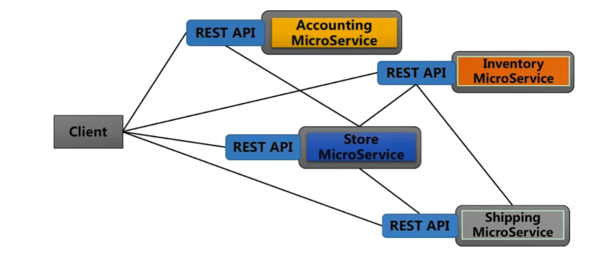
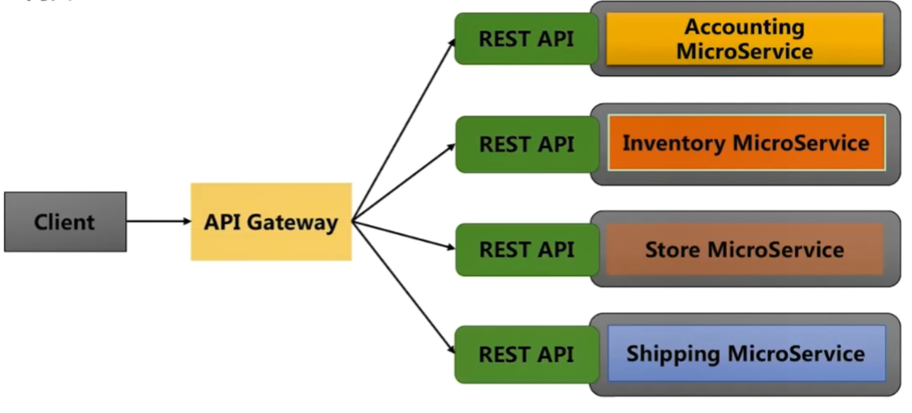
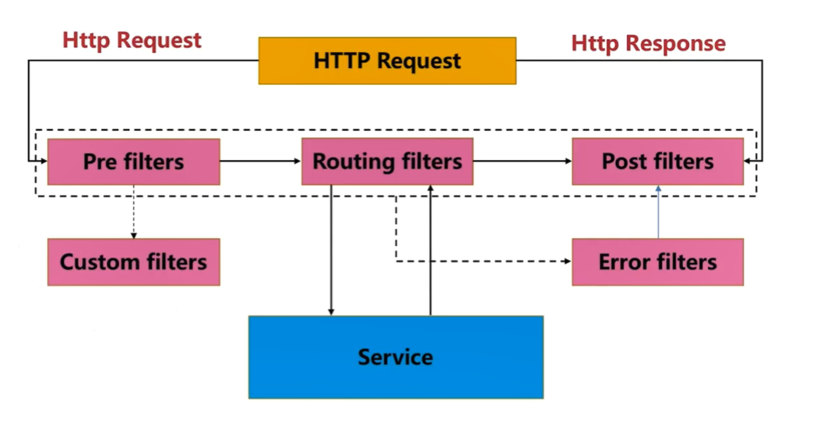

# 广告系统概览

## 广告系统实现了什么样的功能？

+ 广告主的广告投放

  + 推广计划
  + 推广单元
  + ...

+ 媒体放的广告投放

  类似于地铁的广告屏，只有广告主投放广告，媒体方才能检索到广告进行投放，下面几种是几种计费方式：

  + CPM：千次收费
  + CPT：按时间段收费
  + CPC：点击类的广告收费，点击一次收费多少？

## 一个完整的广告系统包含哪些子系统

###  广告投放系统

给广告主使用，最前端的系统

### 广告检索系统

最核心的系统

### 曝光监测系统

广告系统本身做的曝光监测，另一个是广告主请的第三方团队去做监测，因为曝光的越多收取的费用越多，万一广告主不相信，所以会去请第三方，所以我们需要一个数据的对比给广告主看，然后收费

### 扣费系统

投放广告之初会设定预算，如果超过这个预算就不能投放了，这个扣费的是广告主的费用，实时检测对广告的收费进行管理

### 报表系统

这个是给我们看的，去看广告的数据，比如展示了多少，曝光了多少，有多少没有被检索到。

### ....

## 使用了哪些技术

广告投放与检索系统使用了哪些技术

+ Spring Cloud
+ MySQL
+ Kafka
+ ....

## 可以怎样扩展

可以怎样扩展当前实现的广告系统

+ 更多的维度

  根据地区维度来

+ 用户画像

  积累的用户的数据，算出用户的画像，根据用户的习惯来投放广告

+ AI

  智能检索投放哪些广告让用户喜欢

+ .....

# eureka高可用方式

1. 新建eureka项目

2. 修改host文件加上对应的服务

   `sudo vim /etc/hosts`

   `127.0.0.1  server1`

   `127.0.0.1  server2`

   `127.0.0.1  server3`

3. 使用命令打包：`mvn clean package -Dmaven.test.skip=true -U`

4. cd进入target目录，启动`java -jar xxx.jar --spring.profiles.active=server1 `，启动对应配置文件的服务：

   ````yml
   --- # yml分隔符
   spring:
     application:
       name: ad-eureka
     profiles: server1
   
   server:
     port: 8000
   
   eureka:
     instance:
       hostname: server1
       prefer-ip-address: false # 不用ip地址注册
     client:
       service-url:
         defaultZone: http://server2:8001/eureka/, http://server3:8002/eureka/
   
   
   --- # yml分隔符
   spring:
     application:
       name: ad-eureka
     profiles: server2
   
   server:
     port: 8001
   
   eureka:
     instance:
       hostname: server2
       prefer-ip-address: false # 不用ip地址注册
     client:
       service-url:
         defaultZone: http://server1:8000/eureka/, http://server3:8002/eureka/
   
   
   --- # yml分隔符
   spring:
     application:
       name: ad-eureka
     profiles: server3
   
   server:
     port: 8002
   
   eureka:
     instance:
       hostname: server3
       prefer-ip-address: false # 不用ip地址注册
     client:
       service-url:
         defaultZone: http://server1:8000/eureka/, http://server2:8001/eureka/
   ````

   **启动不了，原因是地址中间的逗号后面有一个空格，把空格删除就好了**

# 微服务网关

## 微服务架构及其应用场景

+ 微服务架构的两种方式

  + 点对点方式：服务之间直接调用，每个微服务都开放Rest API，并调用其他微服务的接口

    有弊端，调用方要记录所有其他微服务的地址，一旦地址发生变化，那么就要重写

    

  + API-网关：业务接口通过API网关暴露，是所有客户端接口的唯一入口。微服务之间的通信也通过API网关。

  + 

  ### Zuul的生命周期

  

#  公共模块

## 增强模块

`@RestControllerAdvice`

统一响应，利于前端去处理，为什么需要这么做？对响应的拦截

统一异常处理：

1. 不直接展示错误，对用户友好

2. 异常分类，便于排查问题，DEBUG

3. 降低业务代码中对异常处理的耦合

   如果没有做统一处理，需要在service对每一个可能出现的异常try catch 这样会使代码量大大增加

   并且是业务代码耦合的非常严重

4. 

统一消息转换器：

对象的转换：将Java的实体对象转换成http的输入输出流，Spring Boot通过http的converts依靠jackson，将Java的实体类输出json格式，如果有多个转换器的时候，根据消息的对象类型和需要的内容类型，选择最合适的转换器使用。

通过重写cofigmessageconvert来实现

# 广告投放系统数据库设计

+ 用户账户

  ````sql
  create table ad_user(username, 
                      token,
                      user_status,
                      create_time,
                      update_time);
  ````

  

+ 推广计划

  |

  一对多

  |

+ 推广单元

  + 关键词限制
  + 地域限制
  + 兴趣限制

  |

  多对多

  |

+ 创意

  图片或者文字


