微服务入门

## 什么是微服务？

微服务就是把原本臃肿的一个项目的所有模块拆分开来并做到互相没有关联，甚至可以不使用同一个数据库。比如：项目里面有User模块和Power模块，但是User模块和Power模块并没有直接关系，仅仅只是一些数据需要交互，那么就可以吧这2个模块单独分开来，当user需要调用power的时候，power是一个服务方，但是power需要调用user的时候，user又是服务方了， 所以，他们并不在乎谁是服务方谁是调用方，他们都是2个独立的服务，这时候，微服务的概念就出来了。

## 经典问题:微服务和分布式的区别

谈到区别，我们先简单说一下分布式是什么，所谓分布式，就是将**偌大的系统划分为多个模块（这一点和微服务很像）部署到不同机器上（因为一台机器可能承受不了这么大的压力或者说一台非常好的服务器的成本可能够好几台普通的了），各个模块通过接口进行数据交互，其实 分布式也是一种微服务。 因为都是把模块拆分开来变为独立的单元，提供接口来调用**，那么 他们本质的区别在哪呢？ 他们的区别主要体现在“目标”上， 何为目标，就是你这样架构项目要做到的事情。 分布式的目标是什么？ 我们刚刚也看见了， 就是一台机器承受不了的，或者是成本问题， 不得不使用多台机器来完成服务的部署，而微服务的目标 只是让各个模块拆分开来，不会被互相影响，比如模块的升级亦或是出现BUG等等... 


讲了这么多，可以用一句话来理解：**分布式也是微服务的一种，而微服务也可以是在一台机器上**。

## 微服务与Spring-Cloud的关系（区别）

微服务只是一种项目的架构方式，或者说是一种概念，就如同我们的MVC架构一样，那么Spring-Cloud便是对这种技术的实现。

## 微服务一定要使用Spring-Cloud吗？

我们刚刚说过，微服务只是一种项目的架构方式，如果你足够了解微服务是什么概念你就会知道，其实微服务就算不借助任何技术也能实现，只是有很多问题需要我们解决罢了例如：**负载均衡**，**服务的注册与发现**，**服务调用**，**路由**等等等等一系列问题，所以，Spring-Cloud就出来了，Spring-Cloud将处理这些问题的的技术全部打包好了，就类似那种开袋即食的感觉。

| 微服务面临的问题             | 解决方案                          |
| ---------------------------- | --------------------------------- |
| **服务的注册与发现以及监听** | `eureka`/`zookeeper`              |
| **负载均衡**                 | 服务端：`Nginx`，客户端：`Rabbin` |
| **服务的熔断、限流、降级**   | `hystrix`                         |
| **网关，路由，过滤**         | `zuul`                            |

### **自己实现一个简单的微服务的例子**

创建3个module，`px-user`、`px-power`，`px-power2`，通过`px-user`来调用`px-power`或者`px-power2`的服务

先贴下统一返回前端的数据类**`R`**

````java
public class R extends HashMap {
    public static String SUCCESS_CODE = "200";
    public static String ERROR_CODE = "500";
    public static String DATA_KEY = "data";
    public static String MSG_KEY = "msg";

    private R() {

    }
	
    public R set(String key, Object object) {
        super.put(key, object);
        return this;
    }

    private static R ok() {
        return new R();
    }

    public static R success() {

        return R.ok().set("code", R.SUCCESS_CODE).set(R.MSG_KEY, "操作成功");
    }

    public static R success(String msg) {

        return R.ok().set("code", R.SUCCESS_CODE).set(R.MSG_KEY, msg);
    }

    public static R success(String msg, Object object) {

        return R.ok().set("code", R.SUCCESS_CODE).set(R.MSG_KEY, msg).set(R.DATA_KEY, object);
    }

    public R data(Object obj) {
        return this.set("data", obj);
    }

    public static R error() {
        return R.ok().set(R.MSG_KEY, "操作失败").set("code", R.ERROR_CODE);
    }

    public static R error(String msg) {
        return R.ok().set(R.MSG_KEY, msg).set("code", R.ERROR_CODE);
    }

    public static R error(String msg, Object object) {
        return R.ok().set(R.MSG_KEY, msg).set(R.DATA_KEY, object).set("code", R.ERROR_CODE);
    }

}
````


#### **`px-user`**

这个项目充当客户端，而其他两个项目充当服务端。

`Config.class`

配置`restTemplate`，这是Spring提供的调用http的服务

````java
@Configuration
public class Config {
	// 	restTemplate用来调用http的服务
    @Bean
    public RestTemplate restTemplate() {
        return new RestTemplate();
    }

}
````

`UserController`

```java
@RestController
public class UserController {

    @Autowired
    private RestTemplate restTemplate;

    // 测试一下
    @GetMapping(value = "/getUer")
    public R getUser() {
        Map<String, Object> result = new HashMap<String, Object>();
        result.put("user", "hello");
        return R.success("操作成功", result);
    }

    @GetMapping(value = "/getPower")
    public R getPower() {
        // 调用px-power的服务
        return R.success("", restTemplate.getForObject("http://localhost:6000/getPower", Object.class));
    }

}
```

#### `px-power`

`Config.class`

使用`Java Config`的方式配置tomcat端口号，和`px-user`区分

```java
@Configuration
public class Config {

    @Bean
    public TomcatServletWebServerFactory tomcat() {
        TomcatServletWebServerFactory tomcat = new TomcatServletWebServerFactory();
        tomcat.setPort(6000);
        return tomcat;
    }
}
```

`PowerController`

````java
@RestController
public class PowerController {

    @GetMapping(value = "/getPower")
    public R getPower() {
        Map<String, Object> result = new HashMap<String, Object>();
        result.put("power", "power");
        return R.success("hello", result);
    }
}
````

启动两个项目，通过`px-user`端测试服务是否成功：`http://localhost:8080/getPower`，测试结果如下：

``{"msg":"","code":"200","data":{"msg":"hello","code":"200","data":{"power":"power"}}}``

成功调用`px-power`的服务，不过使用`http://localhost:600/getPower`调用缺失404，甚是奇怪。

**那么如果我们的服务的并发量上去了怎么办？**

我们需要被调用者实现负载均衡，于是创建另一个模块`px-power2`，和`px-power`完全一样的代码，只是将返回的数据修改为：`result.put("power", "power2");`以及将端口号修改为6001，负载均衡策略我们简单采用Nginx。

Nginx其实就是在我们调用服务之前，或者调用方法之前，加了一个代理，通过nginx的机制来实现调用对应的服务。

#### **`Nginx`**

1. 百度到Nginx官网，下载windows版的压缩文件`nginx-1.17.4.zip`

2. 在`conf`文件下替换配置文件，配置文件内容如下：

   ````properties
   
   #user  nobody;
   worker_processes  1;
   
   #error_log  logs/error.log;
   #error_log  logs/error.log  notice;
   #error_log  logs/error.log  info;
   
   #pid        logs/nginx.pid;
   
   
   events {
       worker_connections  1024;
   }
   
   
   http {
       include       mime.types;
       default_type  application/octet-stream;
   
       #log_format  main  '$remote_addr - $remote_user [$time_local] "$request" '
       #                  '$status $body_bytes_sent "$http_referer" '
       #                  '"$http_user_agent" "$http_x_forwarded_for"';
   
       #access_log  logs/access.log  main;
   
       sendfile        on;
       #tcp_nopush     on;
   
       #keepalive_timeout  0;
       keepalive_timeout  65;
   
       #gzip  on;
   
   	# 在此配置
   	upstream mServer {
   		server localhost:6000;
   		server localhost:6001;
   	}
   	
       server {
           listen       80;
           server_name  localhost;
   
           #charset koi8-r;
   
           #access_log  logs/host.access.log  main;
   
           location / {
               root   html;
               index  index.html index.htm;
   			proxy_pass http://mServer;
           }
   
           #error_page  404              /404.html;
   
           # redirect server error pages to the static page /50x.html
           #
           error_page   500 502 503 504  /50x.html;
           location = /50x.html {
               root   html;
           }
   
           # proxy the PHP scripts to Apache listening on 127.0.0.1:80
           #
           #location ~ \.php$ {
           #    proxy_pass   http://127.0.0.1;
           #}
   
           # pass the PHP scripts to FastCGI server listening on 127.0.0.1:9000
           #
           #location ~ \.php$ {
           #    root           html;
           #    fastcgi_pass   127.0.0.1:9000;
           #    fastcgi_index  index.php;
           #    fastcgi_param  SCRIPT_FILENAME  /scripts$fastcgi_script_name;
           #    include        fastcgi_params;
           #}
   
           # deny access to .htaccess files, if Apache's document root
           # concurs with nginx's one
           #
           #location ~ /\.ht {
           #    deny  all;
           #}
       }
   
   
       # another virtual host using mix of IP-, name-, and port-based configuration
       #
       #server {
       #    listen       8000;
       #    listen       somename:8080;
       #    server_name  somename  alias  another.alias;
   
       #    location / {
       #        root   html;
       #        index  index.html index.htm;
       #    }
       #}
   
   
       # HTTPS server
       #
       #server {
       #    listen       443 ssl;
       #    server_name  localhost;
   
       #    ssl_certificate      cert.pem;
       #    ssl_certificate_key  cert.key;
   
       #    ssl_session_cache    shared:SSL:1m;
       #    ssl_session_timeout  5m;
   
       #    ssl_ciphers  HIGH:!aNULL:!MD5;
       #    ssl_prefer_server_ciphers  on;
   
       #    location / {
       #        root   html;
       #        index  index.html index.htm;
       #    }
       #}
   
   }
   
   ````

   如上面标注一样，配置地址。

   ```properties
   upstream mServer {
       server localhost:6000;
       server localhost:6001;
   }
   ```

3. 点击exe启动Nginx

   如果启动的时候什么信息都没有那说明启动成功了，**Nginx没有信息就是最好的信息**。

启动完Nginx后，再启动`px-power2`项目，修改`px-user`项目中调用`getPower`服务的代码，如下：

````java
@GetMapping(value = "/getPower")
public R getPower() {
    return R.success("", restTemplate.getForObject("http://localhost:80/getPower", Object.class));
}
````

Nginx默认是80端口，再测试就会有负载均衡的效果，Nginx默认是轮询机制，这儿就不详细说了。

**存在问题**

比如我们其中的一台服务宕机，我们在访问的时候，如果命中的是宕机的那一台，页面就不停地转圈圈，长时间不响应，那么应该怎么解决呢？

这下我们就需要一个服务的注册和监控中心，将服务的注册到注册中心后，注册中心和服务之间有心跳机制，如果心跳消失就不跳到这个服务。

也可以使用服务熔断来解决，笔者当下才开始学习Spring Boot，所以暂时只能了解如此。

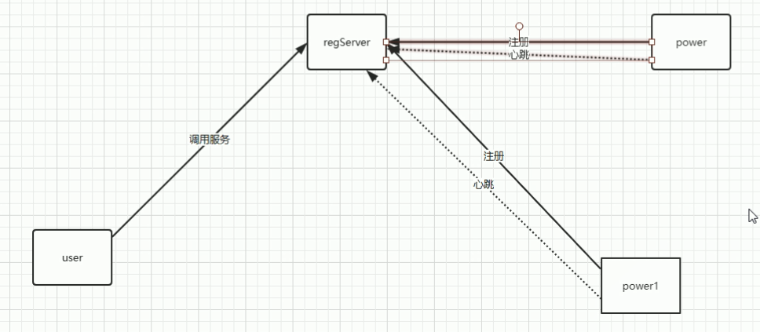

可见，注册中心是一个单独的服务。在Spring Boot中的eureka就是来负责服务的注册和监听的。

## Spring-Cloud项目的搭建

因为spring-cloud是基于spring-boot项目来的，所以我们项目得是一个spring-boot项目，至于spring-boot项目，这节我们先不讨论，这里要注意的一个点是spring-cloud的版本与spring-boot的版本要对应下图：

| Release Train | Boot Version |
| ------------- | ------------ |
| Hoxton        | 2.2.x        |
| Greenwich     | 2.1.x        |
| Finchley      | 2.0.x        |
| Edgware       | 1.5.x        |
| Dalston       | 1.5.x        |

为什么Spring-Cloud不是Spring的那种版本5.1.2或者5.1.3发布呢？其实原因在于Spring-Cloud的组件非常多，之间的依赖也比较复杂，所以一般更新都是大更新。

在我这里我的版本是这样的:

Spring-Boot：

````xml
<parent>
    <groupId>org.springframework.boot</groupId>
    <artifactId>spring-boot-starter-parent</artifactId>
    <version>2.1.8.RELEASE</version>
</parent>

````

Spring-Cloud:

````xml
<dependencyManagement>
    <dependencies>
        <dependency>
            <groupId>org.springframework.cloud</groupId>
            <artifactId>spring-cloud-dependencies</artifactId>
            <version>Greenwich.RELEASE</version>
            <type>pom</type>
            <scope>import</scope>
        </dependency>
    </dependencies>
</dependencyManagement>
````

Spring-Cloud版本如下：

| Greenwich SR3 **CURRENT** **GA** | [ Reference Doc.](https://cloud.spring.io/spring-cloud-static/Greenwich.SR3/) | [ API Doc.](https://spring.io/projects/spring-cloud) |
| -------------------------------- | ------------------------------------------------------------ | ---------------------------------------------------- |
| Hoxton M2 **PRE**                | [ Reference Doc.](https://cloud.spring.io/spring-cloud-static/Hoxton.M2/reference/html/spring-cloud.html) | [ API Doc.](https://spring.io/projects/spring-cloud) |
| Hoxton **SNAPSHOT**              | [ Reference Doc.](https://spring.io/projects/spring-cloud)   | [ API Doc.](https://spring.io/projects/spring-cloud) |
| Greenwich **SNAPSHOT**           | [ Reference Doc.](https://spring.io/projects/spring-cloud)   | [ API Doc.](https://spring.io/projects/spring-cloud) |
| Finchley SR4 **GA**              | [ Reference Doc.](https://cloud.spring.io/spring-cloud-static/Finchley.SR4/) | [ API Doc.](https://spring.io/projects/spring-cloud) |

如果Spring-Boot 和 Spring-Cloud版本不对应启动会报错。

**如果版本不一致会导致eureka的`@EnableEurekaServer `引入不进来**

## Spring-Cloud组件：

### eureka

#### eureka是什么？

eureka是Netflix的子模块之一，也是一个核心的模块，eureka里有2个组件，一个是EurekaServer(一个独立的项目) 这个是用于定位服务以实现中间层服务器的负载平衡和故障转移，另一个便是EurekaClient（我们的微服务） 它是用于与Server交互的，可以使得交互变得非常简单:只需要通过服务标识符即可拿到服务。

#### 与Spring-Cloud的关系

Spring-Cloud 封装了 Netflix 公司开发的 Eureka 模块来实现服务注册和发现(可以对比Zookeeper)。

Eureka 采用了 C-S 的设计架构。Eureka Server 作为服务注册功能的服务器，它是服务注册中心。

而系统中的其他微服务，使用 Eureka 的客户端连接到 Eureka Server并维持心跳连接。这样系统的维护人员就可以通过 Eureka Server 来监控系统中各个微服务是否正常运行。Spring-Cloud 的一些其他模块（比如Zuul）就可以通过 Eureka Server 来发现系统中的其他微服务，并执行相关的逻辑。

#### 角色关系图

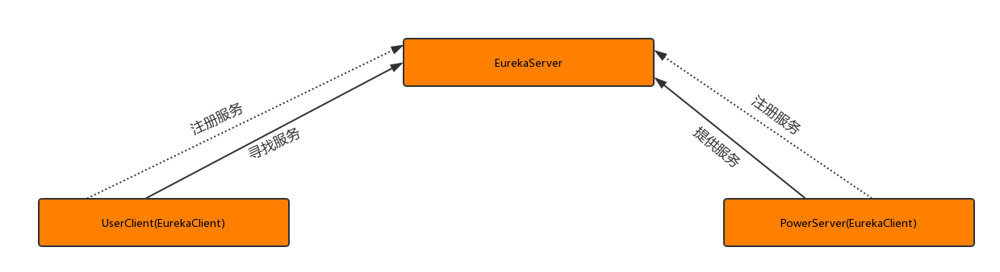

#### 如何使用？

在spring-cloud项目里面加入依赖

1. eureka客户端

   ```xml
   <dependency>
       <groupId>org.springframework.cloud</groupId>
       <artifactId>spring-cloud-starter-netflix-eureka-client</artifactId>
   </dependency>
   ```

2. eureka服务端

   ```xml
   <dependency>
       <groupId>org.springframework.cloud</groupId>
       <artifactId>spring-cloud-starter-netflix-eureka-server</artifactId>
   </dependency>
   ```

   **eureka依赖和Spring-Cloud的版本号密切相关，网上很多结果都是spring-cloud-starter-eureka-server，我们需要配置信息需要从官网去找，不要盲目百度**。

3. eureka服务端项目里面加入以下配置

   ```yml
   server:
     port: 3000
   eureka:
     server:
       enable-self-preservation: false  #关闭自我保护机制
       eviction-interval-timer-in-ms: 4000 #设置清理间隔（单位：毫秒 默认是60*1000）
     instance:
       hostname: localhost
   
   
     client:
       registerWithEureka: false #不把自己作为一个客户端注册到自己身上
       fetchRegistry: false  #不需要从服务端获取注册信息（因为在这里自己就是服务端，而且已经禁用自己注册了）
       serviceUrl:
         defaultZone: http://${eureka.instance.hostname}:${server.port}/eureka
   ```

    当然，不是全部必要的，这里只是把我这里的配置copy过来了

4. 在Spring-Boot启动项目上加入注解`@EnableEurekaServer `就可以启动项目了

   ````java
   @SpringBootApplication
   @EnableEurekaServer
   public class PxEurekaApplication {
   
       public static void main(String[] args) {
           SpringApplication.run(PxEurekaApplication.class, args);
       }
   
   }
   ````

5.  如果访问`http://localhost:3000/`能看见eureka页面，那么说明你就搭建好了。

   #### **THE SELF PRESERVATION MODE IS TURNED OFF. THIS MAY NOT PROTECT INSTANCE EXPIRY IN CASE OF NETWORK/OTHER PROBLEMS.**

   如果页面显示这个只是警告你把他的自我保护机制关闭了。

6. eureka客户端配置

   ```yml
   server:
     port: 6000
   eureka:
     client:
       serviceUrl:
           defaultZone: http://localhost:3000/eureka/  #eureka服务端提供的注册地址 参考服务端配置的这个路径
     instance:
     	
       instance-id: power-1 #此实例注册到eureka服务端的唯一的实例ID 
       prefer-ip-address: true #是否显示IP地址
       leaseRenewalIntervalInSeconds: 10 #eureka客户需要多长时间发送心跳给eureka服务器，表明它仍然活着,默认为30 秒 (与下面配置的单位都是秒)
       leaseExpirationDurationInSeconds: 30 #Eureka服务器在接收到实例的最后一次发出的心跳后，需要等待多久才可以将此实例删除，默认为90秒
   
   spring:
     application:
       name: server-power #此实例注册到eureka服务端的name 
   
   ```

7. 然后在客户端的Spring-Boot启动项目上 加入注解:`@EnableEurekaClient`
   就可以启动项目了 这里就不截图了我们直接来看效果

   **注意客户端一定要依赖`spring-boot-starter-web`，不然启动注册不上服务**

8. 可以通过修改客户端发送心跳的时间以及关闭服务端的自我保护机制来模拟客户端以为宕机后会被服务端从注册中心清理

#### eureka自我保护机制

**Eureka的自我保护特性主要用于减少在网络分区或者不稳定状况下的不一致性问题**

Eureka在运行期间会统计心跳失败的比例，在15分钟内是否低于85%,如果出现了低于的情况，Eureka Server会将当前的实例注册信息保护起来，同时提示一个警告，一旦进入保护模式，Eureka Server将会尝试保护其服务注册表中的信息，不再删除服务注册表中的数据。也就是不会注销任何微服务。但是在保护期内如果刚好这个服务提供者非正常下线了，此时服务消费者就会拿到一个无效的服务实例，此时会调用失败，对于这个问题需要服务消费者端要有一些容错机制，如重试，断路器等。

Eureka 的自我保护模式是有意义的，该模式被激活后，它不会从注册列表中剔除因长时间没收到心跳导致租期过期的服务，而是等待修复，直到心跳恢复正常之后，它自动退出自我保护模式。这种模式旨在避免因网络分区故障导致服务不可用的问题。例如，两个客户端实例 C1 和 C2 的连通性是良好的，但是由于网络故障，C2 未能及时向 Eureka 发送心跳续约，这时候 Eureka 不能简单的将 C2 从注册表中剔除。因为如果剔除了，C1 就无法从 Eureka 服务器中获取 C2 注册的服务，但是这时候 C2 服务是可用的。

### eureka集群

#### eureka集群原理

服务启动后向Eureka注册，Eureka Server会将注册信息向其他Eureka Server进行同步，当服务消费者要调用服务提供者，则向服务注册中心获取服务提供者地址，然后会将服务提供者地址缓存在本地，下次再调用时，则直接从本地缓存中取，完成一次调用。

#### eureka集群配置

刚刚我们了解到 Eureka Server会将注册信息向其他Eureka Server进行同步 那么我们得声明有哪些server呢？

这里 假设我们有3个Eureka Server。

现在怎么声明集群环境的server呢？ 我们看一张图：

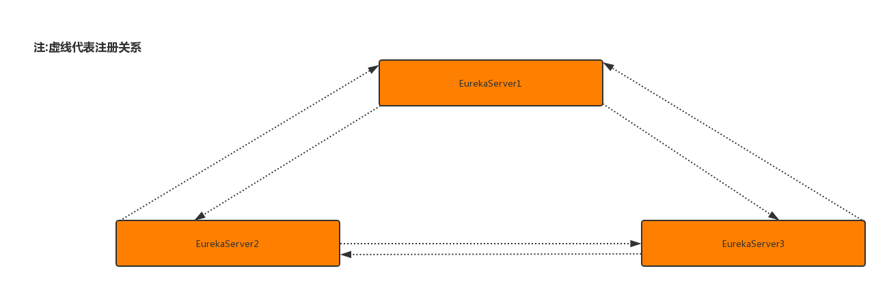

可能看着有点抽象，我们来看看具体配置

````yml
server:
  port: 3000
eureka:
  server:
    enable-self-preservation: false
    eviction-interval-timer-in-ms: 4000
  instance:
    hostname: eureka3000.com


  client:
    registerWithEureka: false
    fetchRegistry: false
    serviceUrl:
      defaultZone: http://eureka3001.com:3001/eureka,http://eureka3002.com:3002/eureka

````

这里 方便理解集群 我们做了一个域名的映射(条件不是特别支持我使用三台笔记本来测试。。。) 至于域名怎么映射的话 这里简单提一下吧 修改你的hosts文件（win10的目录在C:\Windows\System32\drivers\etc 其他系统的话自行百度一下把）附上我的hosts文件：

127.0.0.1  eureka3000.com
127.0.0.1  eureka3001.com
127.0.0.1  eureka3002.com

我们回到主题， 我们发现 集群配置与单体不同的点在于 原来是把服务注册到自己身上，而现在是注册到其它服务身上。

至于为什么不注册自己了呢？，回到最上面我们说过，eureka的server会把自己的注册信息与其他的server同步，所以这里我们不需要注册到自己身上，因为另外两台服务器会配置本台服务器。(这里可能有点绕，可以参考一下刚刚那张集群环境的图，或者自己动手配置一下，另外两台eureka的配置与这个是差不多的，就不发出来了，只要注意是注册到其他的服务上面就好了)

当三台eureka配置好之后，全部启动一下就可以看见效果了:

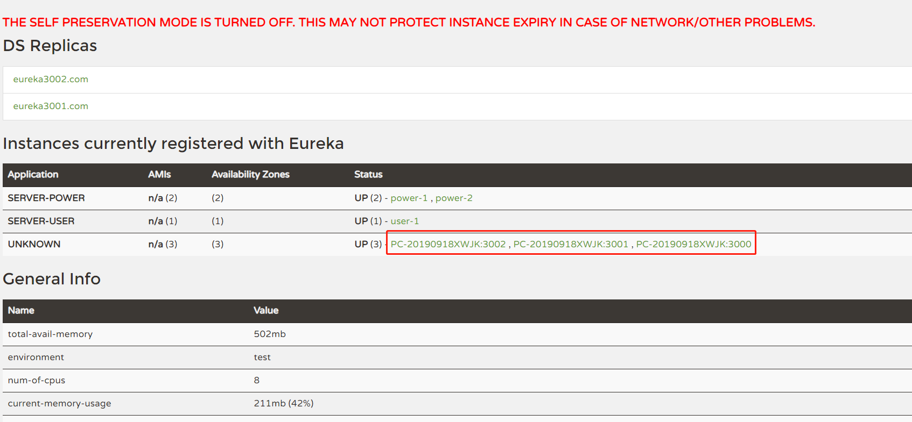

我将服务端自己注册在了注册中心，所以会有红色标记的部分。红色部分是关闭了自我保护机制。

当然，我们这里仅仅是把服务端配置好了， 那客户端怎么配置呢？ 话不多说，上代码：

```yml
client:
    serviceUrl:
        defaultZone: http://localhost:3000/eureka/,http://eureka3001.com:3001/eureka,http://eureka3002.com:3002/eureka

```

我们这里只截取了要改动的那一部分。 就是 原来是注册到那一个地址上面，现在是要写三个eureka注册地址，但是不是代表他会注册三次，因为我们eureka server的注册信息是同步的，这里只需要注册一次就可以了，但是为什么要写三个地址呢。因为这样就可以做到高可用的配置：打个比方有3台服务器。但是突然宕机了一台， 但是其他2台还健在，依然可以注册我们的服务，换句话来讲， 只要有一台服务还建在，那么就可以注册服务，这里 需要理解一下。

这里效果图就不发了， 和之前单机的没什么两样，只是你服务随便注册到哪个eureka server上其他的eureka server上都有该服务的注册信息。

#### eureka集群例子

从上文文档我们看出服务端的配置，那么具体怎么调用？

公共返回类：

````java
package com.cloud.util;

import java.util.HashMap;

public class R extends HashMap {
    public static String SUCCESS_CODE = "200";
    public static String ERROR_CODE = "500";
    public static String DATA_KEY = "data";
    public static String MSG_KEY = "msg";

    private R() {

    }

    public R set(String key, Object object) {
        super.put(key, object);
        return this;
    }

    private static R ok() {
        return new R();
    }

    public static R success() {

        return R.ok().set("code", R.SUCCESS_CODE).set(R.MSG_KEY, "操作成功");
    }

    public static R success(String msg) {

        return R.ok().set("code", R.SUCCESS_CODE).set(R.MSG_KEY, msg);
    }

    public static R success(String msg, Object object) {

        return R.ok().set("code", R.SUCCESS_CODE).set(R.MSG_KEY, msg).set(R.DATA_KEY, object);
    }

    public R data(Object obj) {
        return this.set("data", obj);
    }

    public static R error() {
        return R.ok().set(R.MSG_KEY, "操作失败").set("code", R.ERROR_CODE);
    }

    public static R error(String msg) {
        return R.ok().set(R.MSG_KEY, msg).set("code", R.ERROR_CODE);
    }

    public static R error(String msg, Object object) {
        return R.ok().set(R.MSG_KEY, msg).set(R.DATA_KEY, object).set("code", R.ERROR_CODE);
    }

}

````

pom文件

````xml
<?xml version="1.0" encoding="UTF-8"?>
<project xmlns="http://maven.apache.org/POM/4.0.0" xmlns:xsi="http://www.w3.org/2001/XMLSchema-instance"
         xsi:schemaLocation="http://maven.apache.org/POM/4.0.0 https://maven.apache.org/xsd/maven-4.0.0.xsd">
    <modelVersion>4.0.0</modelVersion>
    <parent>
        <groupId>org.springframework.boot</groupId>
        <artifactId>spring-boot-starter-parent</artifactId>
        <version>2.1.8.RELEASE</version>
        <relativePath/> <!-- lookup parent from repository -->
    </parent>
    <groupId>com.cloud</groupId>
    <artifactId>px-b</artifactId>
    <version>0.0.1-SNAPSHOT</version>
    <name>px-b</name>
    <description>Demo project for Spring Boot</description>

    <properties>
        <java.version>1.8</java.version>
    </properties>

    <dependencies>
        <dependency>
            <groupId>org.springframework.boot</groupId>
            <artifactId>spring-boot-starter-web</artifactId>
        </dependency>

        <dependency>
            <groupId>org.springframework.boot</groupId>
            <artifactId>spring-boot-starter-test</artifactId>
            <scope>test</scope>
        </dependency>

        <dependency>
            <groupId>org.springframework.cloud</groupId>
            <artifactId>spring-cloud-starter-netflix-eureka-client</artifactId>
        </dependency>

    </dependencies>


    <dependencyManagement>
        <dependencies>
            <dependency>
                <groupId>org.springframework.cloud</groupId>
                <artifactId>spring-cloud-dependencies</artifactId>
                <version>Greenwich.RELEASE</version>
                <type>pom</type>
                <scope>import</scope>
            </dependency>
        </dependencies>

    </dependencyManagement>
    <build>
        <plugins>
            <plugin>
                <groupId>org.springframework.boot</groupId>
                <artifactId>spring-boot-maven-plugin</artifactId>
            </plugin>
        </plugins>
    </build>

</project>
````


创建两个服务的被调用方`power1`、`power2`，具体配置下面都贴出来：

````yml
server:
  port: 5002
eureka:
  client:
    serviceUrl:
      defaultZone: http://localhost:3002/eureka/  #eureka服务端提供的注册地址 参考服务端配置的这个路径
  instance:

    instance-id: power-1 #此实例注册到eureka服务端的唯一的实例ID
    prefer-ip-address: true #是否显示IP地址
    leaseRenewalIntervalInSeconds: 10 #eureka客户需要多长时间发送心跳给eureka服务器，表明它仍然活着,默认为30 秒 (与下面配置的单位都是秒)
    leaseExpirationDurationInSeconds: 30 #Eureka服务器在接收到实例的最后一次发出的心跳后，需要等待多久才可以将此实例删除，默认为90秒

spring:
  application:
    name: server-power
````

````yml
server:
  port: 5002
eureka:
  client:
    serviceUrl:
      defaultZone: http://localhost:3002/eureka/  #eureka服务端提供的注册地址 参考服务端配置的这个路径
  instance:

    instance-id: power-2 #此实例注册到eureka服务端的唯一的实例ID
    prefer-ip-address: true #是否显示IP地址
    leaseRenewalIntervalInSeconds: 10 #eureka客户需要多长时间发送心跳给eureka服务器，表明它仍然活着,默认为30 秒 (与下面配置的单位都是秒)
    leaseExpirationDurationInSeconds: 30 #Eureka服务器在接收到实例的最后一次发出的心跳后，需要等待多久才可以将此实例删除，默认为90秒

spring:
  application:
    name: server-power
````

在启动类加上`@EnableEurekaClient`

controller

````java
@RestController
public class PowerController {

    @GetMapping(value = "/getPower")
    public R getPower() {
        Map<String, Object> result = new HashMap<String, Object>();
        result.put("power", "1");
        return R.success("成功", result);
    }
}
````

````java
@RestController
public class PowerController {

    @RequestMapping(value = "/getPower")
    public R getPower() {
        Map<String, Object> result = new HashMap<>();
        retult.put("pwer", "22");
        return R.success("message", result);
    }
}
````

在启动类加上`@EnableEurekaClient`

创建一个服务调用方`user`，同样也需要在启动类加上`@EnableEurekaClient`

````yml
server:
  port: 5005
eureka:
  client:
    serviceUrl:
      defaultZone: http://localhost:3000/eureka/,http://eureka3001.com:3001/eureka,http://eureka3002.com:3002/eureka
  instance:

    instance-id: user-1
    prefer-ip-address: true
    leaseRenewalIntervalInSeconds: 10
    leaseExpirationDurationInSeconds: 30

spring:
  application:
    name: server-user
````

配置类：

````java
@Configuration
public class Config {

    @Bean
    @LoadBalanced // 默认负载均衡策略 轮询
    public RestTemplate restTemplate() {
        return new RestTemplate();
    }
}
````

controller:

````java
package com.cloud.web;

import com.cloud.util.R;
import org.springframework.beans.factory.annotation.Autowired;
import org.springframework.web.bind.annotation.RequestMapping;
import org.springframework.web.bind.annotation.RestController;
import org.springframework.web.client.RestTemplate;

@RestController
public class UserController {

    @Autowired
    private RestTemplate restTemplate;

    private final static String POWER_URL = "http://server-power";

    @RequestMapping(value = "/getPower")
    public R getPower() {
        return R.success("成功", restTemplate.getForObject( POWER_URL + "/getPower", Object.class));
    }
}

````

测试`http://localhost:5005/getPower`能轮询调用成功。

## CAP定理


1998年，加州大学的计算机科学家 Eric Brewer 提出，分布式系统有三个指标。

+ Consistency ---一致性
+ Availability  ---可用性
+ Partition tolerance ---分区容错性

他们第一个字母分别是C A P

Eric Brewer 说，这三个指标不可能同时做到。这个结论就叫做 CAP 定理。

### Partition tolerance

中文叫做"分区容错"。

大多数分布式系统都分布在多个子网络。每个子网络就叫做一个区（partition）。分区容错的意思是，区间通信可能失败。比如，一台服务器放在本地，另一台服务器放在外地（可能是外省，甚至是外国），这就是两个区，它们之间可能无法通信。

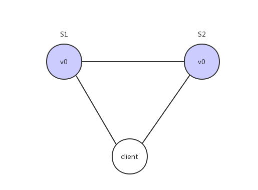

上图中，S1 和 S2 是两台跨区的服务器。S1 向 S2 发送一条消息，S2 可能无法收到。系统设计的时候，必须考虑到这种情况。一般来说，分区容错无法避免，因此可以认为 CAP 的 P 总是成立。CAP 定理告诉我们，剩下的 C 和 A 无法同时做到。

### Consistency

Consistency 中文叫做"一致性"。意思是，写操作之后的读操作，必须返回该值。举例来说，某条记录是 v0，用户向 S1 发起一个写操作，将其改为 v1。

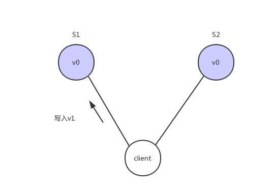

接下来用户读操作就会得到v1。这就叫一致性。

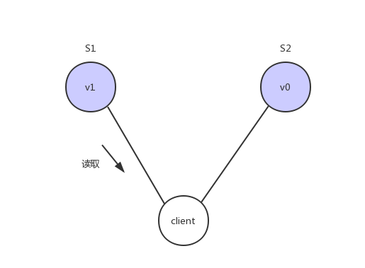

问题是，用户有可能会向S2发起读取操作，由于G2的值没有发生变化，因此返回的是v0，所以S1和S2的读操作不一致，这就不满足一致性了。

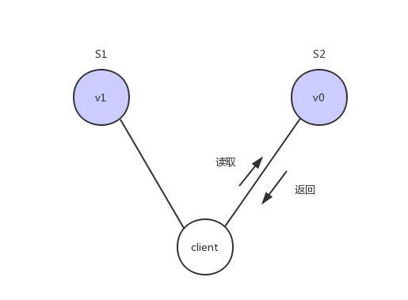

为了让S2的返回值与S1一致，所以我们需要在往S1执行写操作的时候，让S1给S2也发送一条消息，要求G2也变成v1

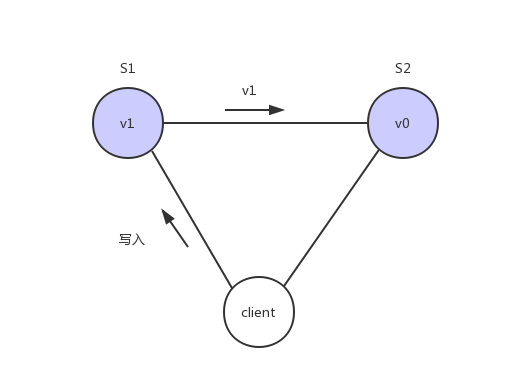

这样子用户向G2发起读操作，就也能得到v1

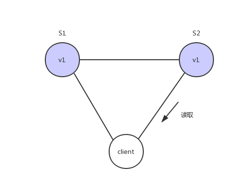

### Availability

Availability 中文叫做"可用性"，意思是只要收到用户的请求，服务器就必须给出回应。

用户可以选择向 S1 或 S2 发起读操作。不管是哪台服务器，只要收到请求，就必须告诉用户，到底是 v0 还是 v1，否则就不满足可用性。

### Consistency 和 Availability 的矛盾

一致性和可用性，为什么不可能同时成立？答案很简单，因为可能通信失败（即出现分区容错）。

如果保证 S2 的一致性，那么 S1 必须在写操作时，锁定 S2 的读操作和写操作。只有数据同步后，才能重新开放读写。锁定期间，S2 不能读写，没有可用性不。

如果保证 S2 的可用性，那么势必不能锁定 S2，所以一致性不成立。

综上所述，S2 无法同时做到一致性和可用性。系统设计时只能选择一个目标。如果追求一致性，那么无法保证所有节点的可用性；如果追求所有节点的可用性，那就没法做到一致性。

### eureka对比Zookeeper

Zookeeper在设计的时候遵循的是CP原则，即一致性,Zookeeper会出现这样一种情况，当master节点因为网络故障与其他节点失去联系时剩余节点会重新进行leader选举，问题在于，选举leader的时间太长：30~120s，且选举期间整个Zookeeper集群是不可用的，这就导致在选举期间注册服务处于瘫痪状态，在云部署的环境下，因网络环境使Zookeeper集群失去master节点是较大概率发生的事情，虽然服务能够最终恢复，但是漫长的选举时间导致长期的服务注册不可用是不能容忍的。

Eureka在设计的时候遵循的是AP原则，即可用性。Eureka各个节点（服务)是平等的， 没有主从之分，几个节点down掉不会影响正常工作，剩余的节点（服务） 依然可以提供注册与查询服务，而Eureka的客户端在向某个Eureka注册或发现连接失败，则会自动切换到其他节点，也就是说，只要有一台Eureka还在，就能注册可用（保证可用性）， 只不过查询到的信息不是最新的（不保证强一致），除此之外，Eureka还有自我保护机制，如果在15分钟内超过85%节点都没有正常心跳，那么eureka就认为客户端与注册中心出现了网络故障，此时会出现一下情况:

1. Eureka不再从注册列表中移除因为长时间没有收到心跳而过期的服务。
2. Eureka仍然能够接收新服务的注册和查询请求，但是不会被同步到其它节点上（即保证当前节点可用）
3. 当网络稳定后，当前实例新的注册信息会被同步到其它节点中

## Spring-Cloud组件

### ribbon

#### ribbon是什么?

Spring Cloud Ribbon是基于Netflix Ribbon实现的一套客户端负载均衡的工具。

简单的说，Ribbon是Netflix发布的开源项目，主要功能是提供客户端的软件负载均衡算法，将Netflix的中间层服务连接在一起。Ribbon客户端组件提供一系列完善的配置项如连接超时，重试等。简单的说，就是在配置文件中列出Load Balancer（简称LB）后面所有的机器，Ribbon会自动的帮助你基于某种规则（如简单轮询，随机连接等）去连接这些机器。我们也很容易使用Ribbon实现自定义的负载均衡算法。

#### 客户端负载均衡？ 服务端负载均衡？

我们用一张图来描述一下这两者的区别

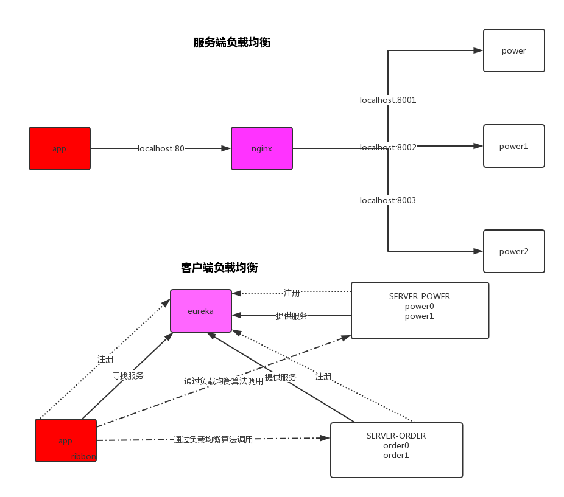

这篇文章里面不会去解释nginx，如果不知道是什么的话，可以先忽略，先看看上面的图

服务端的负载均衡是一个url先经过一个代理服务器（这里是nginx），然后通过这个代理服务器通过算法（轮询，随机，权重等等..）反向代理你的服务，来完成负载均衡。

而客户端的负载均衡则是一个请求在客户端的时候已经声明了要调用哪个服务，然后通过具体的负载均衡算法来完成负载均衡。

#### 如何使用

首先，我们还是要引入依赖，但是，eureka已经把ribbon集成到他的依赖里面去了，所以这里不需要再引用ribbon的依赖，如图：

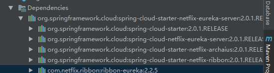

要使用ribbon，只需要一个注解：

````java
@Bean
@LoadBalanced
public RestTemplate restTemplate(){
    RestTemplate restTemplate = new RestTemplate();
    return restTemplat;
}
````

在eureka集群那儿已经看到了负载均衡的作用了，这儿就不在贴代码了。

这里可能有点抽象，需要你们自己去写才能体会到，但是我们已经完成了负载均衡， 他默认的负载均衡是轮询策略，也就是一人一次，下一节我们来讲一下他还有哪些策略。

#### 核心组件：IRule

IRule是什么? 它是Ribbon对于负载均衡策略实现的接口，怎么理解这句话？说白了就是你实现这个接口，就能自定义负载均衡策略， 自定义我们待会儿来讲， 我们先来看看他有哪些默认的实现

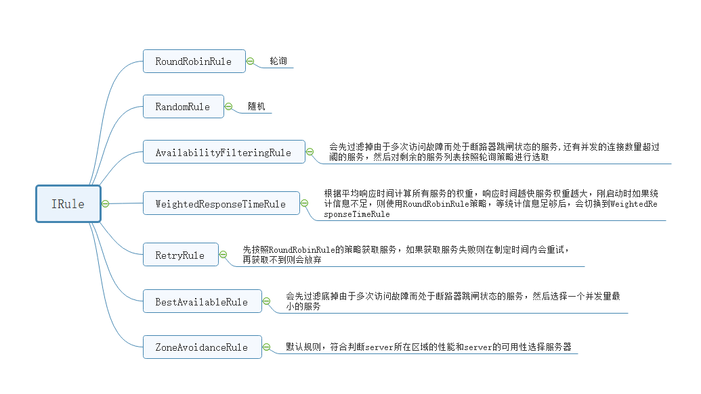

这里是ribbon负载均衡默认的实现， 由于是笔记的关系，这里不好测试，只能你们自己去测试一下了， 具体怎么使用呢？

````java

@Bean
public IRule iRule(){
    return  new RoundRobinRule();
}

````

 在Spring 的配置类里面把对应的实现作为一个Bean返回出去就行了。

#### 自定义负载均衡策略

我们刚刚讲过，只要实现了IRule就可以完成自定义负载均衡，至于具体怎么来，我们先看看他默认的实现

````java
public class RandomRule extends AbstractLoadBalancerRule {
    public RandomRule() {
    }

    @SuppressWarnings({"RCN_REDUNDANT_NULLCHECK_OF_NULL_VALUE"})
    public Server choose(ILoadBalancer lb, Object key) {
        if (lb == null) {
            return null;
        } else {
            Server server = null;

            while(server == null) {
                if (Thread.interrupted()) {
                    return null;
                }

                List<Server> upList = lb.getReachableServers();
                List<Server> allList = lb.getAllServers();
                int serverCount = allList.size();
                if (serverCount == 0) {
                    return null;
                }

                int index = this.chooseRandomInt(serverCount);
                server = (Server)upList.get(index);
                if (server == null) {
                    Thread.yield();
                } else {
                    if (server.isAlive()) {
                        return server;
                    }

                    server = null;
                    Thread.yield();
                }
            }

            return server;
        }
    }

    protected int chooseRandomInt(int serverCount) {
        return ThreadLocalRandom.current().nextInt(serverCount);
    }
	
    public Server choose(Object key) {
        return this.choose(this.getLoadBalancer(), key);
    }

    public void initWithNiwsConfig(IClientConfig clientConfig) {
    }
}
````

我们来看看这个类AbstractLoadBalancerRule

````java
public abstract class AbstractLoadBalancerRule implements IRule, IClientConfigAware {
    private ILoadBalancer lb;

    public AbstractLoadBalancerRule() {
    }

    public void setLoadBalancer(ILoadBalancer lb) {
        this.lb = lb;
    }

    public ILoadBalancer getLoadBalancer() {
        return this.lb;
    }
}
````

这里我们能发现，还是我们上面所说过的 实现了IRule就能够自定义负载均衡，即使是他默认的策略也实现了IRule。

我们可以直接把代码copy过来改动一点:

````java
/**
 * 自定义实现iRule随机策略
 * 原来是纯随机策略,我们现在改为:
 * 如果一个下标已经被随机到了2次了，第三次还是同样的下标的话，那就再随机一次
 */
public class RandomIRule extends AbstractLoadBalancerRule {

    private Random rand;

    // 自定义三个下标
    private int lastIndex = -1;
    private int nowIndex = -1;
    private int skipIndex = -1;

    public RandomIRule() {
        this.rand = new Random();
    }

    @Override
    public void initWithNiwsConfig(IClientConfig iClientConfig) {

    }

    @Override
    public Server choose(Object key) {
        return choose(getLoadBalancer(), key);
    }

    private Server choose(ILoadBalancer lb, Object key) {
       if (lb == null) {
           return null;
       }
       Server server = null;

       while (server == null) {
           if (Thread.interrupted()) {
               return null;
           }
           // 活跃的服务端
           List<Server> upList = lb.getReachableServers();
           // 所有服务端
           List<Server> allList = lb.getAllServers();

           int serverCount = allList.size();
           // 一个服务端都没有
           if (serverCount == 0) {
               return null;
           }
           int index = rand.nextInt(serverCount);
           System.out.println("当前下标为：" + index);
           // 如果随机两次后还是这个下标
           if (skipIndex >= 0 && index == skipIndex) {
               System.out.println("跳过");
               index = rand.nextInt(serverCount);
               System.out.println("跳过后的下标：" + index);
           }
           skipIndex = -1;

           nowIndex = index;

           if (nowIndex == lastIndex) {
               System.out.println("下一次需要跳过的下标为：" + nowIndex);
               skipIndex = nowIndex;
           }

           lastIndex = nowIndex;
           server = upList.get(index);
           // 如果选出来的服务端是空的话，那么让出资源
           if (server == null) {
               Thread.yield();
               continue;
           }

           if (server.isAlive()) {
               return (server);
           }

           server = null;
           Thread.yield();
       }
       return server;
    }
}
````

然后交给Spring去管理就行了：

````java
@Bean
public IRule iRule() {
    return new RandomIRule();
}
````

测试结果如下：

````java
当前下标为：0
当前下标为：0
下一次需要跳过的下标为：0
当前下标为：0
跳过
跳过后的下标：1
当前下标为：0
当前下标为：1
当前下标为：0
当前下标为：1
当前下标为：1
下一次需要跳过的下标为：1
当前下标为：0
````

#### 不同服务不同策略模式

假设我们现在还有个被调用方叫Order，我们需要对它的策略模式进行更换，这该怎么办？

1. 在调用方定义两个配置类：

   首先会将原来的配置类中的策略删掉，由于扫描的是com包下面的内容，所以要在和com包平级的位置创建一个config包，保存我们的配置信息

   ```java
   @Configuration
   @ComponentScan(value = "com")
   public class Config {
   
       @Bean
       @LoadBalanced
       public RestTemplate restTemplate() {
           return new RestTemplate();
       }
   }
   ```

   PowerConfig：

   ````java
   @Configuration
   public class PowerConfig {
   
       @Bean
       public IRule iRule() {
           return new RandomRule();
       }
   }
   ````

   OrderConfig:

   ````java
   @Configuration
   public class OrderCongfig {
   
       @Bean
       public IRule rule() {
           return new RandomIRule();
       }
   }
   ````

2. 在启动类中加上对应的策略注解：

   ````java
   @SpringBootApplication
   @EnableEurekaClient
   @RibbonClients({
           @RibbonClient(name = "SERVER-POWER", configuration = PowerConfig.class),
           @RibbonClient(name = "SERVER-ORDER", configuration = OrderCongfig.class)
   })
   public class PxUserApplication {
   
       public static void main(String[] args) {
           SpringApplication.run(PxUserApplication.class, args);
       }
   
   }
   ````

3. 调用对应的服务即可

### feign负载均衡

#### feign是什么 

Feign是一个声明式WebService客户端。使用Feign能让编写Web Service客户端更加简单, 它的使用方法是定义一个接口，然后在上面添加注解，同时也支持JAX-RS标准的注解。Feign也支持可拔插式的编码器和解码器。Spring Cloud对Feign进行了封装，使其支持了Spring MVC标准注解和HttpMessageConverters。Feign可以与Eureka和Ribbon组合使用以支持负载均衡。

#### feign能干什么

Feign旨在使编写Java Http客户端变得更容易。 前面在使用Ribbon+RestTemplate时，利用RestTemplate对http请求的封装处理，形成了一套模版化的调用方法。但是在实际开发中，由于对服务依赖的调用可能不止一处，往往一个接口会被多处调用，所以通常都会针对每个微服务自行封装一些客户端类来包装这些依赖服务的调用。所以，Feign在此基础上做了进一步封装，由他来帮助我们定义和实现依赖服务接口的定义。在Feign的实现下，我们只需创建一个接口并使用注解的方式来配置它(以前是Dao接口上面标注Mapper注解,现在是一个微服务接口上面标注一个Feign注解即可)，即可完成对服务提供方的接口绑定，简化了使用Spring cloud Ribbon时，自动封装服务调用客户端的开发量。

#### 如何使用

1. 在客户端(User)引入依赖：

````xml
<dependency>
    <groupId>org.springframework.cloud</groupId>
    <artifactId>spring-cloud-starter-openfeign</artifactId>
</dependency>
````

2. 在启动类上面加上注解:`@EnableFeignClients`

3. 然后编写一个service类加上@FeignClient()注解 参数就是你的微服务名字

   ```java
   @FeignClient("SERVER-POWER")
   public interface PowerServiceClient {
   
       @RequestMapping("/power.do")
       public Object power();
   
   }
   
   ```

4. 调用

   ````java
   package com.luban.controller;
   
   import com.luban.service.OrderServiceClient;
   import com.luban.service.PowerServiceClient;
   import org.springframework.beans.factory.annotation.Autowired;
   import org.springframework.web.bind.annotation.RequestMapping;
   import org.springframework.web.bind.annotation.RestController;
   import org.springframework.web.client.RestTemplate;
   
   @RestController
   public class UserController {
   
       private static final String URL="http://SERVER-POWER";
   
       @Autowired
       private RestTemplate restTemplate;
   
       @Autowired
       PowerServiceClient powerServiceClient;
   
   
       @RequestMapping("/power.do")
       public Object power(){
           return  restTemplate.getForObject(URL+"/power.do",Object.class);
       }
   
       @RequestMapping("/feignPower.do")
       public Object feignPower(){
           return powerServiceClient.power();
       }
   }
   
   ````

这里拿了RestTemplate做对比 可以看看2者区别

Feign集成了Ribbon

利用Ribbon维护了服务列表信息，并且融合了Ribbon的负载均衡配置，也就是说之前自定义的负载均衡也有效，这里需要你们自己跑一遍理解一下。而与Ribbon不同的是，通过feign只需要定义服务绑定接口且以声明式的方法，优雅而简单的实现了服务调用