# HystrixDashbord 

Hystrix(注意是单纯的Hystrix) 提供了对于微服务调用状态的监控(信息)， 但是需要结合`spring-boot-actuator`模块一起使用。

在包含了hystrix的项目中， 引入依赖：

````xml
<dependency>
    <groupId>org.springframework.boot</groupId>
    <artifactId>spring-boot-starter-actuator</artifactId>
</dependency>
````

这时候访问`/actuator/hystrix.stream`便可以看见微服务调用的状态信息。

**需要注意的是，在Spring Finchley版本以前访问路径是/hystrix.stream，如果是Finchley的话还得在yml里面加入配置: **

````yml
 management:
  endpoints:
    web:
      exposure:
				include: '*'
````

**因为spring Boot 2.0.x以后的Actuator只暴露了info和health 2个端点，这里我们把所有端点开放。 **

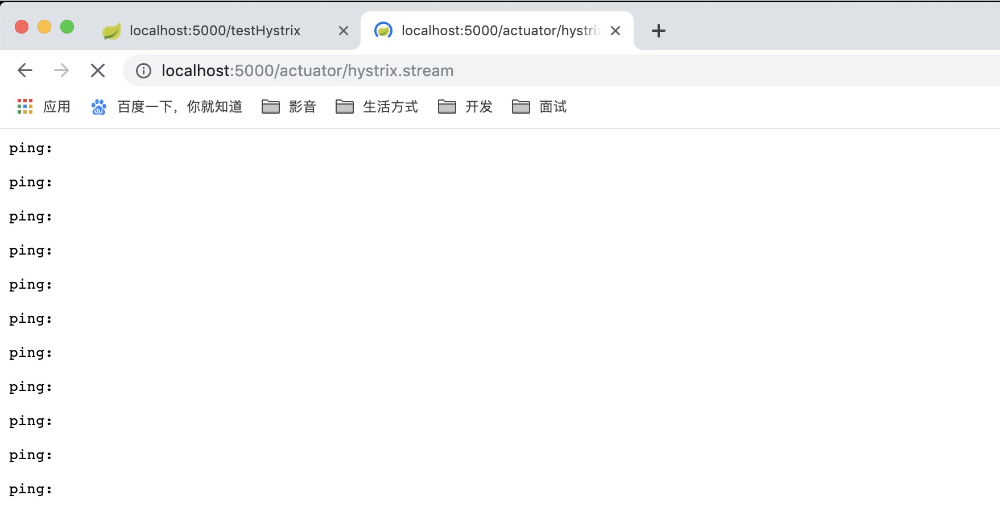

这里会发现没有任何信息，因为我刚启动项目，我们来调用几个接口看看：

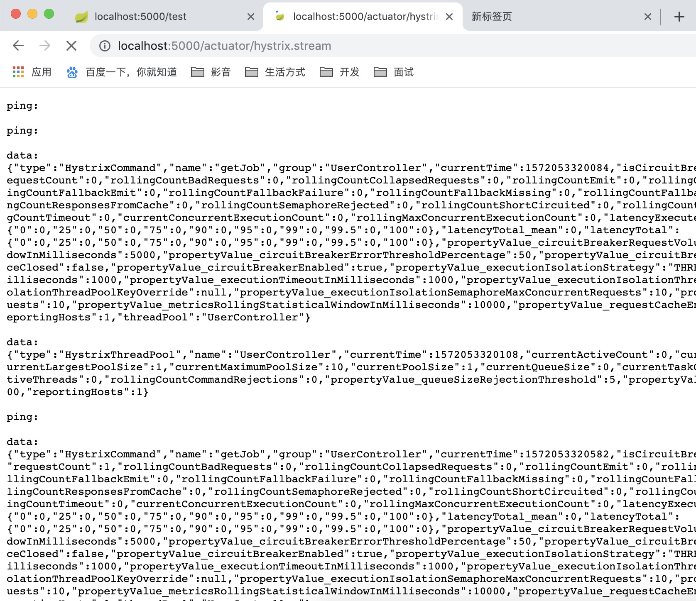

这些密密麻麻的，就是我们的微服务监控的信息， 但是这种json格式的字符串， 难免会让人不太好阅读， 所以， 这时候需要我们的主角`HystrixDashbord `登场了。 

## 什么是HystrixDashbor，如何使用？

Dashbord 翻译一下的意思是仪表盘， 顾名思义，hystrix监控信息的仪表盘，那这个仪表盘到底是什么样子呢？以及怎么来使用呢？

新建一个项目，并加入依赖。

```yml
<dependency>
   <groupId>org.springframework.cloud</groupId>
   <artifactId>spring-cloud-starter-netflix-hystrix-dashboard</artifactId>
</dependency>
```

在spring boot启动类上面加入注解`@EnableHystrixDashboard`

```java
@SpringBootApplication
@EnableHystrixDashboard
public class PxHystrixDashborApplication {

   public static void main(String[] args) {
      SpringApplication.run(PxHystrixDashborApplication.class, args);
   }

}
```

启动项目后访问/hystrix能看见一个类似tomcat的首页: 

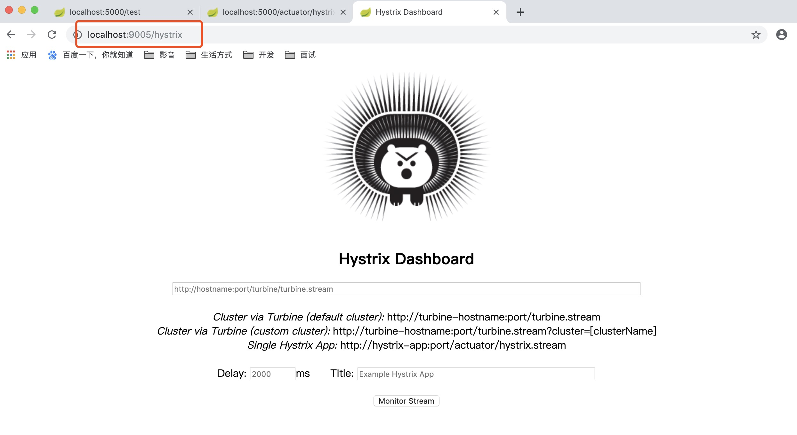

在中间这个输入框中，填入需要监控的微服务的监控地址 也就是`/actuator/hystrix.stream`点击按钮，就会跳转到 仪表盘页面: 

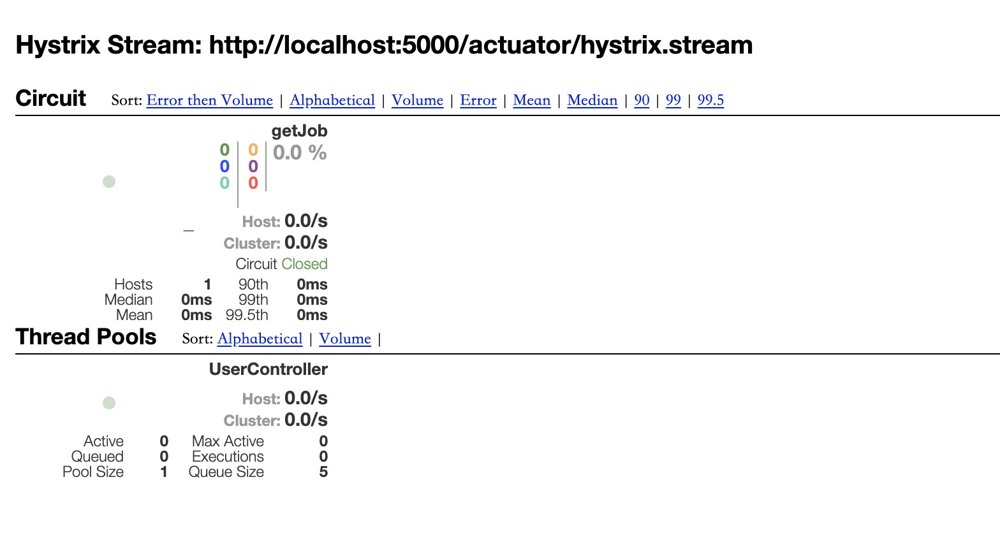

当然， 如果你微服务没有发生过调用， 那么这个页面就会一直显示加载中， 我这里是调用后的效果。 

## Hystrix仪表盘解释

+ 实心圆：共有两种含义。它通过颜色的变化代表了实例的健康程度，它的健康度从绿色到灰色

  ```
  该实心圆除了颜色的变化之外，它的大小也会根据实例的请求流量发生变化，流量越大该实心圆就越大。所以通过
  该实心圆的展示，就可以在大量的实例中快速的发现故障实例和高压力实例。
  ```

+ 曲线：用来记录2分钟内流量的相对变化，可以通过它来观察到流量的上升和下降趋势。 

+ 整图解释：

  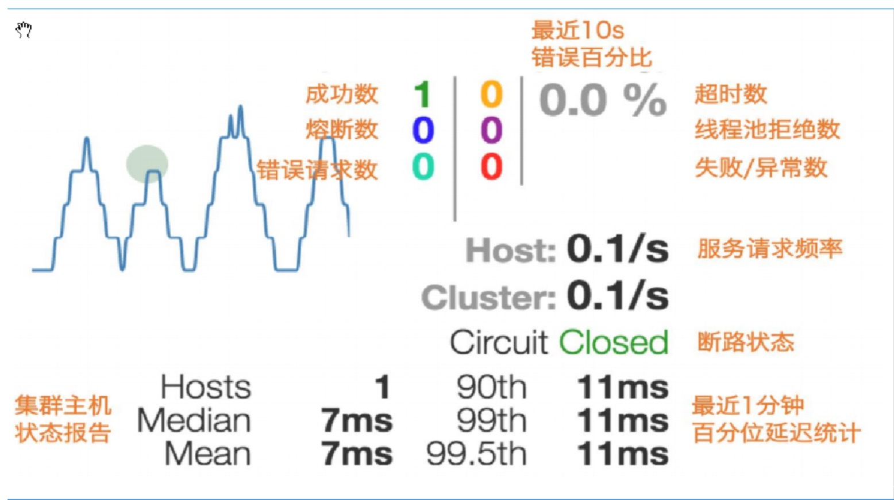

# Spring-Cloud-Config

## Config是什么？

我们既然要做项目，那么就少不了配置，传统的项目还好，但是我们微服务项目， 每个微服务就要做独立的配置， 这样难免有点复杂， 所以，config项目出来了，它就是为了解决这个问题: 把你所有的微服务配置通过某个 平台: 

比如github， gitlib或者其他的git仓库进行集中化管理（当然，也可以放在本地）。

可能这样讲有点抽象，我们来看一张图: 

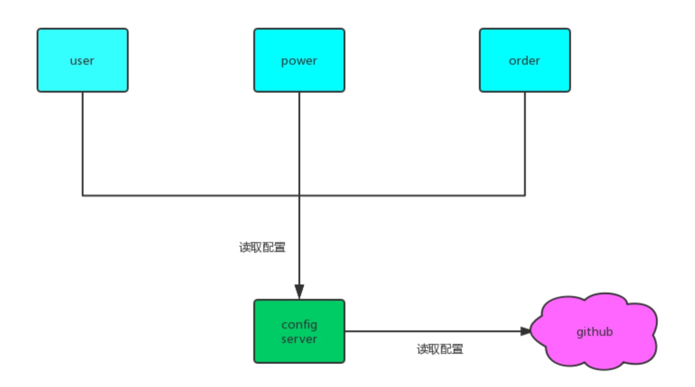

大概是这样一种关系。

## 怎么使用Config？

刚刚讲完理论，那么我们来实践一下，怎么配置这个confi呢？我们刚刚说过：由一个`config server`来管理所有的配置文件，那么我们现在新建一个`config server`项目，然后引入依赖: 

````xml
<dependency>
  <groupId>org.springframework.cloud</groupId>
  <artifactId>spring-cloud-config-server</artifactId>
</dependency>
````

spring-cloud 的依赖我们就不提了。

然后启动类上面加入注解EnableConfigServer：

````java
@SpringBootApplication
@EnableConfigServer
public class PxConfigServerApplication {

	public static void main(String[] args) {
		SpringApplication.run(PxConfigServerApplication.class, args);
	}

}
````

yml配置：

```yml
server:
  port: 8080
spring:
  application:
    name: test
  cloud:
    config:
      server:
        git:
          uri: https://github.com/litian2066/px-cloud-config.git
          # username: 如果git仓库是私有的 就需要输入用户名和密码
          # password:
          # search-paths: foo,bar* #Configserver会在 Git仓库根目录、 foo子目录，以及所有以bar开始的子目录中查找配置文件。
          # clone-on-start: true #启动时就clone仓库到本地，默认是在配置被首次请求时，config server才会clone git仓库
          #native:
          #search-locations: classpath:/config #若配置中心在本地，本地的地址
```

配置好以后，我们先试试通过config server来读取配置。

这里我在github上有一些配置文件：

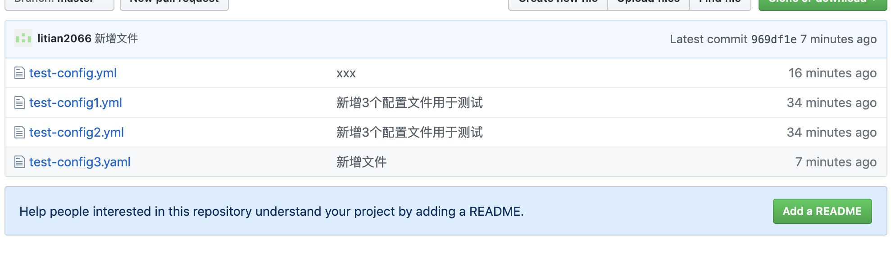

我们先来读取test-config3.yaml，其实yaml和yml没有区别，还有就是这个文件内容比较简单，如下：

```yml
spring:
  applicaiton:
    name: test-cloud-dev-3.0
```

我们访问地址：`localhost:8080/test-config3.yml`：

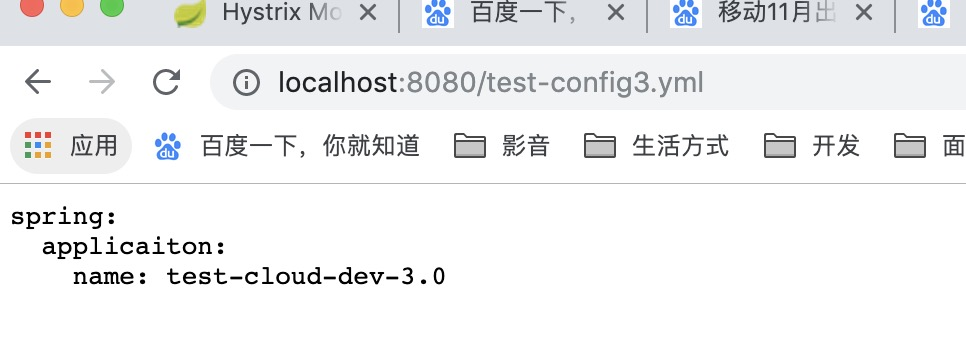

成功读取到了配置信息，接着我们来看一下test-config.yml文件


我们来访问地址：`http://localhost:8080/test-config.yml`：

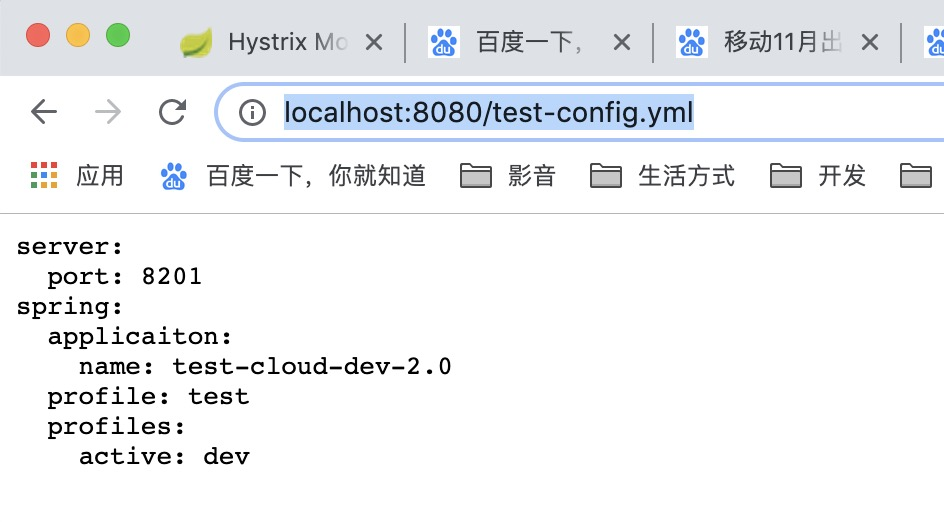

可见，非常奇怪的是读取到了test的部分，我试着把test部分的内容注释：

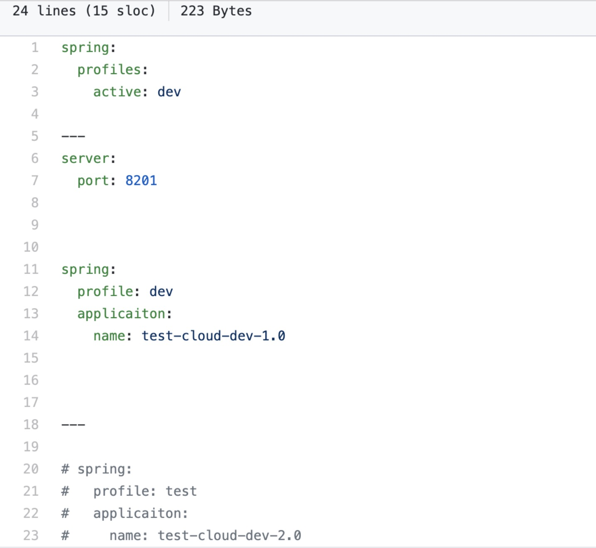

结果读取出来的内容却是：


十分不解，接着来看test-config1.yml文件：

```yml
server:
  port: 8201

spring:
  profiles: dev
  application:
    name: test-cloud-dev-2.0
```

如果直接访问：`localhost:8080/test-config1.yml`是没有内容的。只有换成`localhost:8080/test-config1-dev.yml`才行。所以从大致可以得出结论：

```
/{application}/{profile}[/{label}]
/{application}-{profile}.yml
/{label}/{application}-{profile}.yml
/{application}-{profile}.properties
/{label}/{application}-{profile}.properties
```

application就是配置文件的名字， profile就是对应的环境 label就是不同的分支 由这个规则可见， 我们使用的是 第二种规则， 剩下的规则， 同学们可以自己去试试 ， 对于yml 和properties类型config可以完美转换， 也就是说 你存的是yml 但是可以读取为properties类型的反过来也是如此：

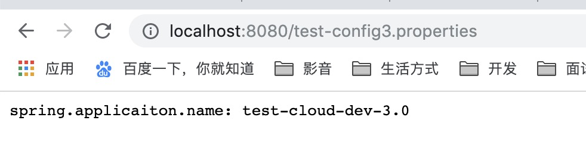

至于github上面有文件夹路径这儿就不演示，看上面yml里面配置好然后直接访问就好了（不需要在url里面加上文件夹路径）。

## 客户端从config上获取配置

刚刚给大家简单演示了一下config 以及怎么读取配置， 不过实际开发中，更多的不是我们人为去获取，而是由微 服务从config上加载配置， 那么， 怎么来加载呢? 首先，我们需要在我们的微服务加入一个依赖声明他是config的客户端：

```xml
<dependency>
  <groupId>org.springframework.cloud</groupId>
  <artifactId>spring-cloud-starter-config</artifactId>
</dependency>
```

需要注意的是，这个依赖不包括spring -boot依赖， 也就是说， 假设你这个项目要当作spring boot来启动的话， 还得依赖spring boot 

启动类不需要做改动， 标准的spring boot启动类即可，需要注意的是yml文件 

以前我们对于spring boot的配置 是在application.yml里面配置的,

现在从config上读取配置的话，还得需要一个bootstrap.yml配置文件。 

解释一下这个bootstrap.yml: spring cloud有一个“引导上下文"的概念，这是主应用程序的父上下文。

引导上下文负责从配置服务器加载配置属性，以及解密外部配置文件中的属性。和主应用程序加载application.(yml或 properties)中的属性不同，引导上下文加载(bootstrap.)中的属性。配置在 bootstrap.*中的属性有更高的优先级，因此默认情况下它们不能被本地配置，那么我们application.yml配置文件里面，只需要做一些简单的配置就可以了（我这儿什么都没有配置）。

重点在bootstrap.yml里面：

```yml
spring:
  cloud:
    config:
      name: test-config2 # 这是我们要读取的配置文件名 对应获取规则的{application}
      profile: test # 这个是要获取的环境 对应的便是{profile}
      label: master # 这个就是获取的节点 对应的是{label}
      uri: http://localhost:8080/ # 这就是我们config server的一个地址
```

启动后通过端口号就可以看见测试成功了。

## Config高可用

可以通过nginx来实现高可用，但是我们这儿通过把config项目注册到eureka里面来实现高可用，新建一个项目，添加eureka客户端的配置：

1. 依赖

   ````xml
   <dependency>
     <groupId>org.springframework.cloud</groupId>
     <artifactId>spring-cloud-starter-netflix-eureka-client</artifactId>
   </dependency>
   ````

2. 配置（需要将我们的config-serve注册进eureka，所以要加上对应的配置）

   ```yml
   eureka:
     client:
       serviceUrl:
         defaultZone: http://localhost:3000/eureka/  #eureka服务端提供的注册地址 参考服务端配置的这个路径
     instance:
   
       instance-id: config-2 #此实例注册到eureka服务端的唯一的实例ID
       prefer-ip-address: true # 是否显示IP地址
       leaseRenewalIntervalInSeconds: 10 # eureka客户需要多长时间发送心跳给eureka服务器，表明它仍然活着,默认为30 秒 (与下面配置的单位都是秒)
       leaseExpirationDurationInSeconds: 30
   ```

   **注意两个config-server的spring.application.name的值要一样**

3. 客户端bootstrap.yml配置

   ````yml
   spring:
     cloud:
       config:
         name: test-config2
         profile: test
         label: master
         # uri: http://localhost:8080/
         discovery:
           service-id: TEST
           enabled: true
   
   # 需要注册进enreka
   eureka:
     client:
       serviceUrl:
         defaultZone: http://localhost:3000/eureka/
   ````

4. 测试启动，端口号已经被改变了，完全没有问题。