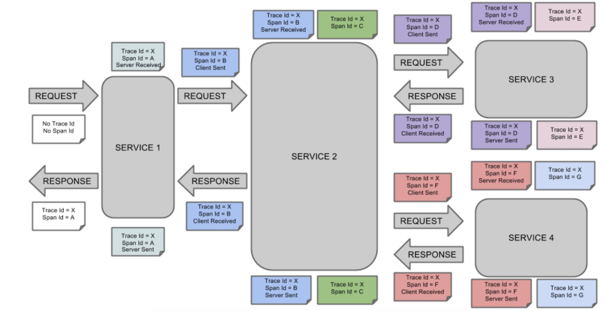
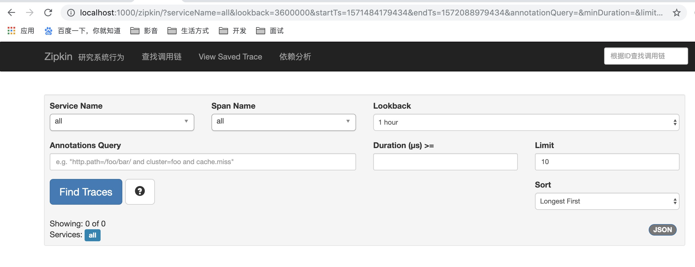
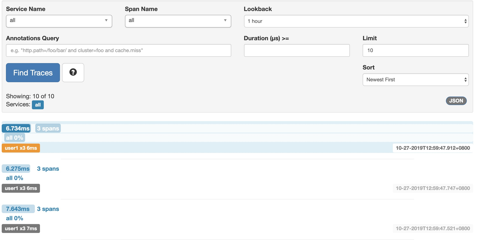
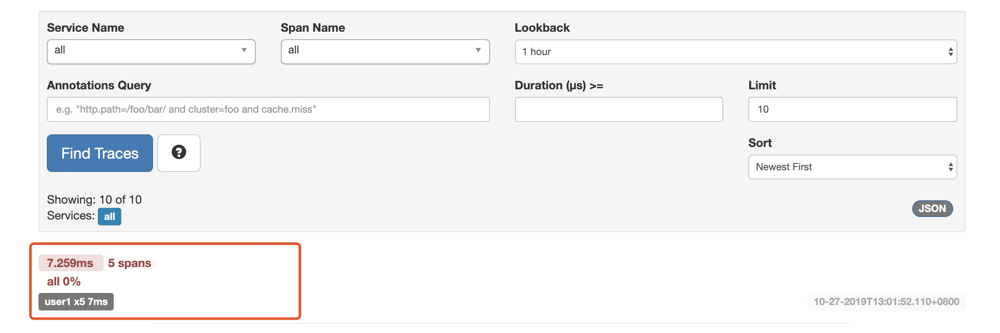
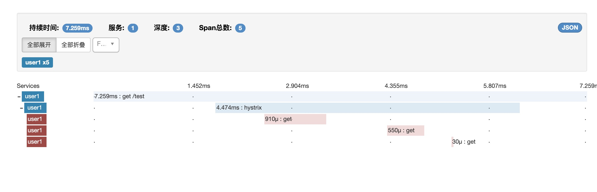
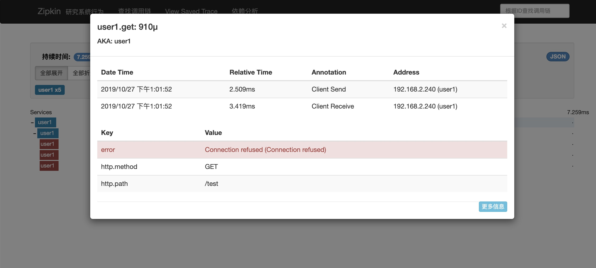

# Spring-cloud-sleuth

## 分布式链路跟踪介绍

我们来讨论微服务的“跟踪”，我们先来看几个问题，对于一个大型的微服务架构系统，会有哪些常见问题？

1. 如何串联调用链，快速定位问题
2. 如何厘清微服务之间的依赖关系
3. 如何进行各个服务接口的性能分析
4. 如何跟踪业务流的处理


## sleuth介绍：

Spring Cloud Sleuth为Spring Cloud提供了分布式跟踪的解决方案，它大量借用了Google Dapper、Twitter Zipkin和Apache HTrace的设计，先来了解一下 Sleuth的术语，Sleuth借用了 Dapper的术语。

+ span（跨度）：基本工作单元。span用一个64位的id唯一标识。除ID外，span还包含其他数据，例如描述、时间戳事件、键值对的注解（标签），spanID、span父ID等。 span被启动和停止时，记录了时间信息。初始化span被称为"rootspan"，该 span的id和trace的ID相等。
+ trace（跟踪）：一组共享"rootspan"的span组成的树状结构称为trace，trace也用一个64位的ID唯一标识， trace中的所有span都共享该trace的ID。
+ annotation（标注）：annotation用来记录事件的存在，其中，核心annotation用来定义请求的开始和结束。
+ CS（ Client sent客户端发送）：客户端发起一个请求，该annotation描述了span的开始。
+ SR（ Server Received服务器端接收）：服务器端获得请求并准备处理它。如果用SR减去CS时间戳，就能得到网络延迟。
+ SS（Server Sent服务器端发送）：该annotation表明完成请求处理（当响应发回客户端时）。如果用SS减去 SR时间戳，就能得到服务器端处理请求所需的时间。
+ CR（ Client Received客户端接收）：span结束的标识。客户端成功接收到服务器端的响应。如果CR减去CS时间戳，就能得到从客户端发送请求到服务器响应的所需的时间。

Spring Cloud Sleuth可以追踪10种类型的组件：async、Hystrix，messaging，websocket，rxjava，scheduling，web（Spring MVC Controller，Servlet），webclient（Spring RestTemplate）、Feign、Zuul下面我们通过一张图来看一下一个简单的微服务调用链：



**如果一条调用链里面有组件，比如有hystrix，那么还会有一个新的spanId生成。**

## sleuth整合Zipkin实现分布式链路跟踪

### Zipkin简介

Zipkin是Twitter开源的分布式跟踪系统，基于Dapper的论文设计而来。它的主要功能是收集系统的时序数据，从 而追踪微服务架构的系统延时等问题。Zipkin还提供了一个非常友好的界面，来帮助分析追踪数据。官网地址：ht tp://zipkin。

### 为什么要使用Zipkin

因为sleuth对于分布式链路的跟踪仅仅是一些数据的记录， 这些数据我们人为来读取和处理难免会太麻烦了，所以我们一般把这种数据上交给Zipkin Server来统一处理。

### 编写一个Zipkin Server

我们新建一个项目，然后引入依赖：

````xml
<dependency>
  <groupId>io.zipkin.java</groupId>
  <artifactId>zipkin-autoconfigure-ui</artifactId>
  <version>2.8.4</version>
</dependency>

<dependency>
  <groupId>io.zipkin.java</groupId>
  <artifactId>zipkin-server</artifactId>
  <version>2.8.4</version>
</dependency>
````

yml文件加上如下配置：

````yml
#解决IllegalArgumentException: Prometheus requires that all meters with the same name have the same set of tag keys
management:
  metrics:
    web:
      server:
        autoTimeRequests: false
````

**这个配置解释一下：在zipkin2.7.x以后便不支持自定义服务器需要使用官方的版本或者Docker但是如果还是要使 用的话就得加上这个配置。**

完成上面的步骤之后，我们启动项目，你会发现Zipkin的专属图标， 而且细心点会发现它是基于spring boot来的。

启动的时候出现了问题，在yml文件上加上：

````yml
#解决The bean 'characterEncodingFilter', defined in class path resource [zipkin/autoconfigure/ui/ZipkinUiAutoConfiguration.class], could not be registered. A bean with that name has already been defined in class path resource [org/springframework/boot/autoconfigure/web/servlet/HttpEncodingAutoConfiguration.class] and overriding is disabled.Action:
spring:
  main:
    allow-bean-definition-overriding: true
````

照理在启动类的main方法上面加上注解`@EnableZipkinServer`

然后打开浏览器访问: /zipkin/，我这儿是`localhost:1000/zipkin/`



看到这个页面， 基本上你的zipkin server搭建完毕了。

这是用来查询分布式链路数据的页面， 这里列出了查询条件， 从第一行开始从左到右分别是： 微服务名称（就是你配置文件里面的application name），span（即上文所解释的）名称 ， 时间段 ，自定义查询条件，一次调用链的持续时间，一页数量，排序规则。

目前来讲，我们肯定是查询不到数据的， 我们把我们自己的微服务和sleuth整合并把数据上传到zipkin server。

### sleuth微服务整合Zipkin

首先，我们需要依赖sleuth和sleuth与zipkin的整合依赖：

```xml
<dependency>
  <groupId>org.springframework.cloud</groupId>
  <artifactId>spring-cloud-starter-sleuth</artifactId>
</dependency>

<dependency>
  <groupId>org.springframework.cloud</groupId>
  <artifactId>spring-cloud-starter-zipkin</artifactId>
</dependency>
```

然后启动微服务并模拟一次调用链 我这里是用user微服务调用了job-wanted微服务（**注意，每个微服务都需要和 zipkin整合**）调用完成之后，我们去zipkin server页面去看看:



这里我模拟了2条请求，一个是正常的，一个是不正常的正常的就不看了，我们看看不正常的是什么样子的：







他会把具体的错误信息给你展示出来 方便错误的定位。 其他的你们可以自己去测试看看

## zipkin server 数据持久化问题

刚刚我们介绍了如何把分布式链路调用信息上传到 zipkin server 但是 有一个问题： 当zipkin重启后我们的分布式链路数据全部清空了。 因为zipkin server 默认数据是存储在内存当中， 所以当你服务重启之后内存自然而然也就清空了。

## 使用Elasticsearch 做数据持久化

我们这里借用ES来做数据持久化， 当然 还可以用ELK来做， 我们这里演示ES 关于Elasticsearch 具体的介绍 我们本文暂时不讨论， 没学习过的同学可以把他当作mysql来看待 Elasticsearch 下载地址：https://www.elastic.co/cn/downloads/elasticsearch 下载完是个压缩包 解压出来 打开bin目录 找到elasticsearch.bat文件启动 等他启动一会儿然后在页面上输入localhost:9000看见如下信息说明Elasticsearch 启动好了：


zipkin 与 Elasticsearch整合：首先 我们在我们的zipkin server里面引入依赖:`

````xml
<dependency>
  <groupId>io.zipkin.java</groupId>
  <artifactId>zipkin-autoconfigure-storage-elasticsearch-http</artifactId>
  <version>2.3.1</version>
</dependency>
````

然后在yml加入配置：

````yml
zipkin:
  storage:
  type: elasticsearch
  elasticsearch:
    cluster: elasticsearch
    hosts: http://localhost:9200
    index: zipkin
````

至此 zipkin的数据便和Elasticsearch整合起来了，现在再启动zipkin server 并且存储几条数据， 就算重启， 数据 还会在上面。