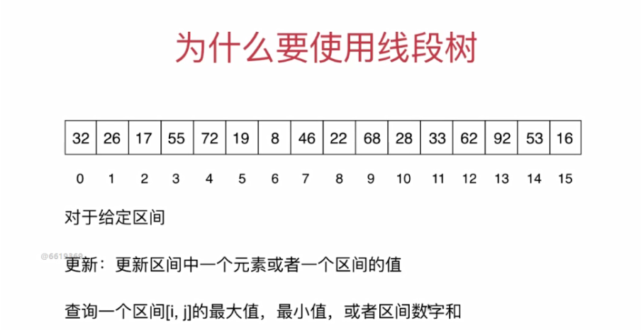
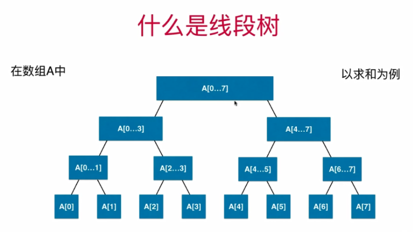
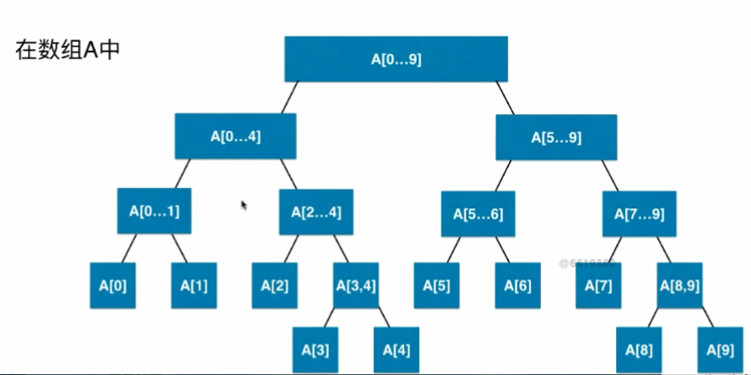
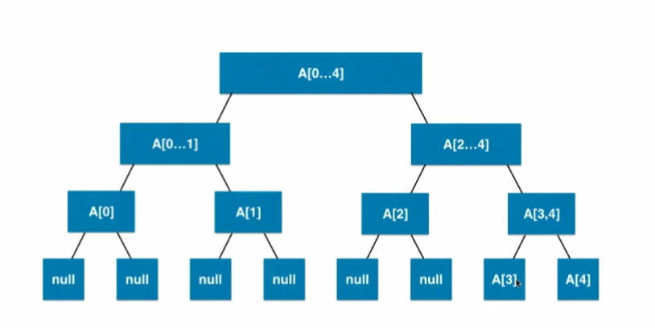

# 线段树

## 什么是线段树

**为什么要使用线段树**

如果使用数组，那么复杂度就会是O(N)，那么怎么让复杂度变成O(logN)?

**上面是线段树**

## 线段树的基本表示

在上面的图中，这颗线段树比较特殊，这个数组刚好是2的次方树，所以很平衡，是一颗满的二叉树，那么数组的长度是10呢？

显然这不是一棵满的二叉树，同时也不是一棵完全的二叉树，**对于一棵完全的二叉树而言，如果元素比较多叶子节点是从左边开始排列的，而不是像上图一样**，不过线段树是一颗平衡二叉树（**所有的叶子节点的深度差距不会超过一，比如上图，最长深度的叶子节点是5，最低深度是4，所以它们差距刚好是一，所以堆也是平衡二叉树**）， 平衡二叉树不会退化成一颗链表。

+ 平衡二叉树也可以使用数组来表示

**如果区间有n个元素，数组表示需要有多少节点？**

对于之前的二分搜索树，我们知道有如下规律

| 层数  | 节点    |
| ----- | ------- |
| 0层   | 1       |
| 1层   | 2       |
| 2层   | 4       |
| 3层   | 8       |
| ..... | ...     |
| h-1层 | 2^(h-1) |

所以对满二叉树：

+ h层，一共有2^h - 1 个节点（大约是2^h）
+ 最后一层（h-1）层，有2^(h-1)个节点
+ **最后一层的节点数大致等于前面所有层节点之和**

现在我们继续看我们的问题：如果区间有n个元素 数组表示需要有多少节点？

如果n = 2^k， 所以只需要2n的空间。

最快情况， 如果 n=2^k + 1，那么要多一层存储，所以此时需要4n的空间（将上面加一块儿）。

**所以需要4n的空间，线段树不考虑添加元素，即区间固定，使用4n的静态空间即可**，但是可能有近乎一半儿的空间浪费。如下图：

所以可以通过堆来进行快速查找。

##  Coding

因为是静态数组，所以不需要我们之前实现的动态数组。

