## 玩转数据结构

### 动态数组

####　１、封装自己的动态数组：

```java
/**
 * 自己封装数组
 */
public class Array<E> {

    private E[] data;
    private int size;

    // 构造函数, 传入数组的容量capacity构造Array
    public Array(int capacity) {
        data = (E[]) new Object[capacity];
        size = 0;
    }

    public Array() {
        this(10);
    }

    /**
     * 向所有元素后添加一个新元素
     * @param e
     */
    public void addLast(E e) {
        // 扩容
        if (size == data.length) {
            resize(data.length * 2);
        }
        data[size++] = e;
    }

    /**
     * 在制定位置插入元素, 需要挪动元素
     * @param index
     * @param e
     */
    public void add(int index, E e) {
        // 验证index是否合法
        if (index < 0 || index > size) {
            throw new IllegalArgumentException("Add is failed. Require index >= 0 and index < size");
        }
        // 扩容
        if (size == data.length) {
           resize(2 * data.length);
        }
        // 挪动位置
        for (int i = size; i > index - 1 ; i--) {
            data[i] = data[i - 1];
        }
        data[index] = e;
        size++;
    }

    private void resize(int newCapacity) {
        E[] newData = (E[]) new Object[newCapacity];
        for (int i = 0; i < size; i++) {
            newData[i] = data[i];
        }
        data = newData;
    }

    // 向数组头添加一个元素
    public void addFirst(E e) {
        add(0, e);
    }

    // 获取index索引位置的元素
    public E get(int index) {
        // 验证index是否合法
        if (index < 0 || index > size) {
            throw new IllegalArgumentException("Get failed. Require index >= 0 and index < size");
        }
        return data[index];
    }

    public boolean contains(E e) {
        for (int i = 0; i < size; i++) {
            if (data[i].equals(e)) {
                return true;
            }
        }
        return false;
    }

    public int find(E e) {
        for (int i = 0; i < size; i++) {
            if (data[i].equals(e)) {
                return i;
            }
        }
        return -1;
    }

    /**
      * 删除指定索引的元素
      **/
    public E remove(int index) {
        // 验证index是否合法
        if (index < 0 || index > size) {
            throw new IllegalArgumentException("Remove is failed. Require index >= 0 and index < size");
        }
        E ret = data[index];
        for (int i = index + 1; i < size; i++) {
            data[i - 1] = data[i];
        }
        size--;
        data[size] = null; // 去除闲散对象
        // 为了防止时间复杂度震荡,故不能在数组长度小于一半的时候进行缩容, 要等到少于四分之一的时候进行缩容;
        if (size == data.length / 4 && data.length / 2 != 0) {
            resize(data.length / 2);
        }
        return ret;
    }

    public E removeFirst() {
        return remove(0);
    }

    public E removeLast() {
        return remove(size - 1);
    }

    public void removeElement(E e) {
        int index = find(e);
        if (index != -1) {
            remove(index);
        }
    }

    public E getFirst() {
        return get(0);
    }

    public E getLast() {
        return get(size - 1);
    }

    @Override
    public String toString() {
        StringBuilder res = new StringBuilder();
        res.append(String.format("Array: size = %d , capacity = %d\n", size, data.length));
        res.append('[');
        for (int i = 0; i < size; i++) {
            res.append(data[i]);
            if (i != size) {
                res.append(", ");
            }
        }
        res.append(']');
        return res.toString();
    }

    public int getSize() {
        return size;
    }

    public boolean isEmpty() {
        return size == 0;
    }

    public int getCapacity() {
        return data.length;
    }
}
```

#### 2、复杂度分析:

##### 大O表示法

大O描述的是算法的运行时间和输入数据之间的关系 分析时 **忽略常数

|                    | 复杂度 | 分析                  |
| ------------------ | ------ | --------------------- |
| T = 2*n + 2        | O(n)   |                       |
| T = 2000*n + 10000 | O(n)   | 渐进时间复杂度        |
| T = 1 * n * n + 0  | O(n^2) | 描述n趋近于无穷的情况 |

##### 动态数组每个方法的复杂度分析

| method           | O(..)         | 分析                                             |
| ---------------- | ------------- | ------------------------------------------------ |
| addLast(e)       | O(1)          | data[size++] = e;                                |
| addFirst(e)      | O(n)          | 在第一个位置插入元素肯定要挪位置 所以是N的复杂度 |
| add(index, e)    | O(2/n) = O(n) | 平均而言要挪动二分之一的元素 所以是N的复杂度     |
| removeLast(e)    | O(1)          |                                                  |
| removeFirst(e)   | O(n)          | 和addFirst一样需要挪动N个元素                    |
| remove(index, e) | O(n)          |                                                  |
| resize()         | O(n)          | 扩容方法                                         |
| set(index, e)    | O(1)          |                                                  |
| get(index)       | O(1)          |                                                  |
| contains(e)      | O(n)          |                                                  |
| find(e)          | O(n)          |                                                  |

##### 均摊时间复杂度分析

​	在增和删除的时候会有扩容的情况出现，然而resize操作是O(n)的复杂度。假设当前capacity = 8， 并且每一次添加操作都使用addLast，在添加第九个元素的时候需要resize操作，所以会有消耗8 + 1 的时间 加上之前添加8次的操作也就是17次基本的操作（addLast）, 9次addLast操作，触发resize 总共进行了17次基本操作，**平均下来，每次addLast操作，进行2次基本操作**，

​	假设capacity = n， n+ 1次addLast， 触发resize， 总共进行2n+1次基本操作，所以平均下来，每次addLast操作， 进行了2次基本操作，这样平均下来，时间复杂度是O(1)。

##### 复杂度震荡

​	removeLast时resize过于着急，解决方式是```Lazy```的处理，等到删除到整个数组的容积的四分之一再进行缩容就可以了，不然少于容积的一般就缩容1/2是不明智的。

### 栈

​	栈也是一种线性数据结构，后进先出，```LIFO```
​	典型的例子是操作系统里面的```ctrl + z ```和```ctrl + y```

为了方便后面测试先新建一个接口，如下：

```java
public interface Stack<E> {

    int getSize();
    boolean isEmpty();
    void push(E e);
    E pop();
    E peek();

}
```

使用数组实现栈的数据结构：

```java
public class ArrayStack<E> implements Stack<E> {

    Array<E> array;

    public ArrayStack(int capacity) {
        array = new Array<>(capacity);
    }

    public ArrayStack() {
        array = new Array<>();
    }

    @Override
    public int getSize() {
        return array.getSize();
    }

    @Override
    public boolean isEmpty() {
        return array.isEmpty();
    }

    /**
     * 查看数组的容积
     * @return
     */
    public int getCapacity() {
        return array.getCapacity();
    }

    /**
     * 压栈
     * @param e
     */
    @Override
    public void push(E e) {
        array.addLast(e);
    }

    @Override
    public E pop() {
        return array.removeLast();
    }

    @Override
    public E peek() {
        return array.getLast();
    }

    @Override
    public String toString() {
        StringBuilder res = new StringBuilder();
        res.append("Stack: ").append('[');
        for (int i = 0; i < array.getSize(); i++) {
            res.append(array.get(i));
            if (i != array.getSize() - 1) {
                res.append(", ");
            }
        }
        res.append("] top");
        return res.toString();
    }
}
```

测试类：

```java
public class Main {
    public static void main(String[] args) {
        Stack<Integer> stack = new ArrayStack<>();
        for (int i = 0; i < 4; i++) {
            stack.push(i);
        }
        System.out.println(stack);
        while (!stack.isEmpty()) {
            Integer pop = stack.pop();
            System.out.print(pop + " ");
        }
    }
}
```


测试结果：

```java
Stack: [0, 1, 2, 3] top
3 2 1 0 
```

#### 栈的时间复杂度分析：

| Method    | 复杂度 | 分析                                                      |
| --------- | ------ | --------------------------------------------------------- |
| push(E e) | O(1)   | 入栈是数组的``addLast()``方法，同样通过均摊复杂度分析得出 |
| pop()     | O(1)   | 出栈是数组的``removeLast()``方法，同样通过均摊复杂度分析  |

#### LetCode上面的问题分析：

问题描述：

​			给定一个只包括``'('``， ``')'``，`` '{'``，```'}'``，``'['``，``']'``的字符串，判断是否有效， 括号必须以正确的顺序关闭。

```java
/**
 * 给定一个只包括'('， ')'， '{','}','[',']'的字符串，判断是否有效
 * 括号必须以正确的顺序关闭
 */
public class Solution {

    public boolean isValid(String s) {
        Stack<Character> stack = new Stack<>();
        for (int i = 0; i < s.length(); i++) {
            char c = s.charAt(i);
            if (c == '(' || c == '[' || c == '{') {
                stack.push(c);
            } else {
                if (stack.isEmpty()) {
                    return false;
                } else if (c == ')' && stack.pop() != '(') {
                    return false;
                } else if (c == ']' && stack.pop() != '[') {
                    return false;
                } else if (c == '}' && stack.pop() != '{') {
                    return false;
                }
            }
        }
        return stack.isEmpty();
    }
}
```

### 队列

队列是一种先进先出``FIFO``的线性数据结构。

先定义一个接口：

```java
public interface Queue<E> {

    int getSize();
    boolean isEmpty();

    /**
     * 入队操作
     * @param e
     */
    void enqueue(E e);

    /**
     * 出队
     * @return
     */
    E dequeue();

    /**
     * 查询队首元素
     * @return
     */
    E getFront();
}
```

#### 使用数组实现队列

```java
public class ArrayQueue<E> implements Queue<E> {

    private Array<E> array;

    public ArrayQueue() {
        array = new Array<>();
    }

    public ArrayQueue(int capacity) {
        array = new Array<>(capacity);
    }

    @Override
    public int getSize() {
        return array.getSize();
    }

    @Override
    public boolean isEmpty() {
        return array.isEmpty();
    }


    @Override
    public void enqueue(E e) {
        array.addLast(e);
    }

    @Override
    public E dequeue() {
        return array.removeFirst();
    }

    @Override
    public E getFront() {
        return array.getFirst();
    }

    @Override
    public String toString() {
        StringBuilder res = new StringBuilder();
        res.append("queue: front [");
        for (int i = 0; i < array.getSize(); i++) {
            E e = array.get(i);
            res.append(e);
            if (i != array.getSize() - 1) {
                res.append(", ");
            }
        }
        res.append("] tail");
        return res.toString();
    }

    public int getCapacity() {
        return array.getCapacity();
    }
}
```

#### 复杂度分析

| Method     |      |                                                              |
| ---------- | ---- | ------------------------------------------------------------ |
| enqueue(E) | O(1) | 利用均摊复杂度分析                                           |
| dequeue()  | O(n) | 底层是数组，出队的时候拿走第一个元素，后面的数据会向前挪动。 |

**分析：**出队操作是O(n)的复杂度， 出队的时候会有挪动的操作，那么有没有一种方式是可以保证出队的时候也是O(1)的复杂度呢？于是产生了循环队列。

**想法：**可以记下队首和队尾的位置，所以出队的时候不在有数组的位置挪动，只需要修改队首的位置标记，入队的时候也可以修改队尾的位置标记，这样的话，队首那边就会有很多空余的位置，入队的时候可以重新利用这些空间，如果空间满了可以进行扩容。

#### 循环队列

```java
/**
 * 循环队列
 * @param <E>
 */
public class LoopQueue<E> implements Queue<E> {

    private E[] data;
    private int front, tail;
    private int size; // 队列里面有多少个元素


    public LoopQueue(int capacity) {
        data = (E[]) new Object[capacity + 1]; // 有意的浪费一个格子 因为tail指向的时候即将入队的角标
        front = 0;
        tail = 0;
        size = 0;
    }

    public LoopQueue() {
        this(10);
    }

    /**
     * 获取容量
     * @return
     */
    public int getCapacity() {
        return data.length - 1;
    }


    @Override
    public int getSize() {
        return size;
    }

    @Override
    public boolean isEmpty() {
        return front == tail;
    }

    /**
     * 入队
     * @param e
     */
    @Override
    public void enqueue(E e) {
        // 判断队列是否为满的
        if ((tail + 1) % data.length == front) {
            // 扩容
            resize(getCapacity() * 2);
        }
        data[tail] = e;
        tail = (tail + 1) % data.length; // 循环队列下队尾的位置变更
        size ++;
    }

    @Override
    public E dequeue() {
        if (isEmpty()) {
            throw new IllegalArgumentException("队列为空,不能出队");
        }
        E ret = data[front];
        data[front] = null; // 取消闲散对象
        front = (front + 1) % data.length;
        size --;
        // 缩容
        if (size == getCapacity() / 4 && getCapacity() / 2 != 0) {
            resize(getCapacity() / 2);
        }
        return ret;
    }

    @Override
    public E getFront() {
        return data[front];
    }

    /**
     * 扩容
     * @param nweCapacity
     */
    private void resize(int nweCapacity) {
        E[] newData = (E[]) new Object[nweCapacity];
        for (int i = 0; i < size; i++) {
            // 有偏移 防止越界
            newData[i] = data[(front + i) % data.length];
        }
        data = newData;
        front = 0;
        tail = size;
    }

    @Override
    public String toString() {
        StringBuilder res = new StringBuilder();
        res.append(String.format("Queue: size = %d , capacity = %d\n", size, getCapacity()));
        res.append("front [");
        for (int i = front; i != tail; i = (i + 1) % data.length) {
            res.append(data[i]);
            if ((i + 1) % data.length != tail) {
                res.append(", ");
            }
        }
        res.append("] tail");
        return res.toString();
    }
}
```

利用测试类比较数组队列以及循环队列的效率

```java
public class Main {

    /**
     * 测试使用q运行opCount个入队和出队的操作所需要的时间, 单位: 秒
     * @param q
     * @param opCount
     * @return
     */
    private static double testQueue(Queue<Integer> q, int opCount) {
        long startTime = System.nanoTime();

        // ...
        Random random = new Random();
        // 入队
        for (int i = 0; i < opCount; i++) {
            q.enqueue(random.nextInt(Integer.MAX_VALUE)); // 从0 到int 最大值的随机数
        }

        // 出队
        for (int i = 0; i < opCount; i++) {
            q.dequeue();
        }

        long endTime = System.nanoTime();
        return (endTime - startTime) / 1000000000.0;

    }


    public static void main(String[] args) {
        /*LoopQueue<Integer> loopQueue = new LoopQueue<>();

        for (int i = 0; i < 9; i++) {
            loopQueue.enqueue(i);
            System.out.println(loopQueue);
            if (i % 3 == 2) {
                System.out.println("出队");
                loopQueue.dequeue();
                System.out.println(loopQueue);
            }
        }*/
        // 测试数组队列和循环队列的效率
        int opCount = 100000;

        Queue<Integer> arrayQueue = new ArrayQueue<>();
        double time = testQueue(arrayQueue, opCount);
        System.out.println("ArrayQueue: " + time + "s"); // 5 s
        Queue<Integer> loopQueue = new LoopQueue<>();
        double time1 = testQueue(loopQueue, opCount);
        System.out.println("LoopQueue: " + time1 + "s"); // 0.02
		
        // 链表
        Queue<Integer> linkListedQueue = new LinkListedQueue<>();
        double time2 = testQueue(linkListedQueue, opCount);
        System.out.println("linkListedQueue: " + time2 + "s"); // 0.02
    }
}
```

结果如下：

```java
ArrayQueue: 3.2390412s
LoopQueue: 0.0126575s
linkListedQueue: 0.0100581s // 这是利用链表测试的时间
```

#### 另一种循环队列的实现

### 链表

数组、栈、队列都是依托静态数组来实现，靠resize()来解决容量的问题。而链表是真正的**动态数据结构**，同样它也是一种**线性数据结构**。同时链表是最简单的动态数据结构，更帮助我们更好的深入理解引用和**递归**。它的数据一般都存在节点中：

```java
class Node {
	E e;
	Node next;
}
```

​	优点：真正的动态数据结构，不需要处理容量固定的问题。

​	缺点：丧失了访问随机访问的能力。

​	数组最好用于索引有语音的情况，如scores[2]。最大的优点是支持快速查询，而链表不适合用于索引有语意的情况，最大的优点是动态。

代码如下：

```java
public class LinkedList<E> {
    /**
     * 内部类
     */
    private class Node {
        public E e;
        public Node next;

        public Node(E e, Node next) {
            this.e = e;
            this.next = next;
        }

        public Node(E e) {
            this(e, null);
        }

        public Node() {
            this(null, null);
        }

        @Override
        public String toString() {
            return e.toString();
        }
    }
    // 头结点
    // private Node head;
    /**
     * 为链表添加一个虚拟头结点
     * 这样添加新节点的时候不需要对头部节点特殊处理了 直接找到对应的位置即可
     */
    private Node dummyHead;
    // 节点数
    private int size;

    public LinkedList() {
        dummyHead = new Node(null, null);
        size = 0;
    }

    // 获取链表中的元素个数
    public int getSize() {
      return this.size;
    }
	// 判断链表是否为空
    public boolean isEmpty() {
        return size == 0;
    }

    // 在链表头添加新的元素e
    public void addFirst(E e) {
        /*Node node = new Node(e);
        node.next = head;
        head = node;*/

        // head = new Node(e, head);
        add(0, e);
    }

    public void add(int index, E e) {
        if (index < 0 && index > size) {
            throw new IllegalArgumentException("");
        }
        /*if (index == 0) {
            addFirst(e);
        } else {
            Node prev = head;
            for (int i = 0; i < index - 1; i++) {
                prev = prev.next;
            }
            Node node = new Node(e);
            node.next = prev.next;
            prev.next = node;

            // prev.next = new Node(e, prev.next)0
        }*/
        // 找到要插入位置的前一个节点
        Node prev = dummyHead;
        for (int i = 0; i < index; i++) {
            prev = prev.next;
        }
        prev.next = new Node(e, prev.next);
        size++;
    }

    // 在链表尾部添加新的元素
    public void addLast(E e) {
        add(size, e);
    }

    // 获得链表的index个位置的元素
    public E get(int index) {
        if (index < 0 && index > size) {
            throw new IllegalArgumentException("");
        }
        Node cur = dummyHead.next;
        for (int i = 0; i < index; i++) {
            cur = cur.next;
        }
        return cur.e;
    }

    public E getFirst() {
        return get(0);
    }

    public  E getLast() {
        return get(size - 1);
    }

    // 修改操作
    public void set(int index, E e) {
        if (index < 0 && index > size) {
            throw new IllegalArgumentException("");
        }
        Node cur = dummyHead.next;
        for (int i = 0; i < index; i++) {
            cur = cur.next;
        }
        cur.e = e;
    }

    public boolean contains(E e) {
        Node cur = dummyHead.next;
        while (cur != null) {
            if (e.equals(cur.e)) {
                return true;
            } else {
                cur = cur.next;
            }
        }
        return false;
    }

    // 链表删除操作
    public E remove(int index) {
        if (index < 0 && index > size) {
            throw new IllegalArgumentException("");
        }
        Node prev = dummyHead;
        for (int i = 0; i < index; i++) {
            prev = prev.next;
        }
        Node delNode = prev.next;
        prev.next = delNode.next;
        delNode.next = null;
        size --;
        return delNode.e;
    }

    /**
     * 删除元素
     * @param e
     * @return
     */
    public E removeElement(E e) {
        Node prev = dummyHead;
        while (prev.next != null) {
            if (prev.next.e.equals(e)) {
                Node delNode = prev.next;
                prev.next = delNode.next;
                delNode.next = null;
                return delNode.e;
            } else {
                prev = prev.next;
            }
        }
        return null;
    }


    // 从链表中删除第一个元素
    public E removeFirst() {
        return remove(0);
    }

    public E removeLast() {
        return remove(size - 1);
    }

    @Override
    public String toString() {
        StringBuilder res = new StringBuilder();
        Node cur = dummyHead.next;
        while (cur != null) {
            res.append(cur + "->");
            cur = cur.next;
        }
        res.append("NULL");
        return res.toString();
    }
}
```

#### 时间复杂度分析

| Method            |      |                                         |
| ----------------- | ---- | --------------------------------------- |
| addLast           | O(N) |                                         |
| addFirst          | O(1) |                                         |
| add(index, e)     | O(N) | O(N / 2) = O(N), 平均要扫描一半的节点。 |
| removeLast(e)     | O(N) |                                         |
| removeFirst(e)    | O(1) |                                         |
| remove(index, e)  | O(N) |                                         |
| set(index, e)     | O(N) |                                         |
| get/contains/find | O(N) |                                         |

#### 使用链表来实现栈

```java
/**
 * 使用链表实现栈
 * @param <E>
 */
public class LinkedListStack<E> implements Stack<E> {

    private LinkedList<E> list;

    public LinkedListStack() {
        this.list = new LinkedList<>();
    }

    @Override
    public int getSize() {
        return list.getSize();
    }

    @Override
    public boolean isEmpty() {
        return list.isEmpty();
    }

    @Override
    public void push(E e) {
        list.addFirst(e);
    }

    @Override
    public E pop() {
        return list.removeFirst();
    }

    @Override
    public E peek() {
        return list.getFirst();
    }

    @Override
    public String toString() {
        StringBuilder res = new StringBuilder();
        res.append("Stack: top ").append(list);
        return res.toString();
    }
}
```

| push(E e） | O(1) |      |
| ---------- | ---- | ---- |
| pop()      | O(1) |      |

#### 使用链表实现队列

```java
public class LinkListedQueue<E> implements Queue<E> {

    private class Node {
        public E e;
        public Node next;

        public Node(E e, Node node) {
            this.e = e;
            this.next = node;
        }

        public Node() {
            this(null, null);
        }

        public Node(E e) {
            this(e, null);
        }
    }

    private Node head, tail;
    private int size;

    public LinkListedQueue() {
        head = null;
        tail = null;
        size = 0;
    }

    @Override
    public int getSize() {
        return size;
    }

    @Override
    public boolean isEmpty() {
        return size == 0;
    }


    // 入队
    @Override
    public void enqueue(E e) {
        // 如果队尾为空
        if (tail == null) {
            tail = new Node(e);
            head = tail;
        } else {
            Node newTail = new Node(e);
            tail.next = newTail;
            tail = newTail;
        }
        size ++;
    }

    /**
     * 出队
     * @return
     */
    @Override
    public E dequeue() {
        if (isEmpty()) {
            throw new IllegalArgumentException("队列为空, 不能完成操作");
        }
        Node ret = head;
        head = head.next;
        ret.next = null;
        // 假设出队完成后队列为空
        if (head == null) {
            tail = null;
        }
        size --;
        return ret.e;
    }

    @Override
    public E getFront() {
        if (isEmpty()) {
            throw new IllegalArgumentException("队列为空, 不能完成操作");
        }
        return head.e;
    }

    @Override
    public String toString() {
        StringBuilder res = new StringBuilder("LinkedQueue: Front: [");
        Node cur = head;
        while (cur != null) {
            res.append(cur.e +"->");
            cur = cur.next;
        }
        res.append(" ] Taile");
        return res.toString();
    }

    public static void main(String[] args) {
        LinkListedQueue<Integer> linkListQueque = new LinkListedQueue<>();
        for (int i = 0; i < 10; i++) {
            linkListQueque.enqueue(i);
            System.out.println(linkListQueque.toString());
            if (i % 3 == 0) {
                linkListQueque.dequeue();
                System.out.println("出队: " + linkListQueque.toString());
            }
        }
    }
}
```

| enqueue(E e) | O(1) |      |
| ------------ | ---- | ---- |
| dequeue()    | O(1) |      |

这样入队和出队的操作都是O(1)的复杂度了。

测试数组栈和链表栈的效率：

```java
/**
 * 数组和链表的时间差异不大, 虽然链表没有容积问题 但是会有new的操作
 */
public class Main {

    /**
     * 测试使用q运行opCount个入栈和出栈的操作所需要的时间, 单位: 秒
     * @param q
     * @param opCount
     * @return
     */
    private static double testStack(Stack<Integer> q, int opCount) {
        long startTime = System.nanoTime();

        // ...
        Random random = new Random();
        // 入队
        for (int i = 0; i < opCount; i++) {
            q.push(random.nextInt(Integer.MAX_VALUE)); // 从0 到int 最大值的随机数
        }

        // 出队
        for (int i = 0; i < opCount; i++) {
            q.pop();
        }

        long endTime = System.nanoTime();
        return (endTime - startTime) / 1000000000.0;

    }


    public static void main(String[] args) {
        // 测试数组栈和链表栈的效率
        int opCount = 100000;
        Stack<Integer> arrayQueue = new ArrayStack<>();
        double time = testStack(arrayQueue, opCount);
        System.out.println("ArrayStack: " + time + "s"); // 5 s
        Stack<Integer> loopQueue = new LinkedListStack<>();
        double time1 = testStack(loopQueue, opCount);
        System.out.println("LinkedStack: " + time1 + "s"); // 0.02
    }
}
```

结果：

```java
ArrayStack: 0.016732s
LinkedStack: 0.011797s
```

**数组栈和链表栈的效率差不多，虽然链表不再有扩容的问题，但是会存在new的问题，所以双方的效率旗鼓相当。**

#### LetCode问题

删除链表中某个val的所有元素

```java
public class ListNode {
    public int val;
    public ListNode next;

    public ListNode(int val) {
        this.val = val;
    }
}
```

```java
public class Solution {

    public ListNode removeElements(ListNode head, int val) {
        // 如果删除的节点是头结点
        while (head != null && head.val == val) {
            ListNode delNode = head;
            head = head.next;
            delNode.next = null;

        }
        // 如果链表中所有的节点都是要删除的节点
        if (head == null)
            return null;

        ListNode prev = head;
        while (prev.next != null) {
            if (prev.next.val == val) {
                ListNode delNode = prev.next;
                prev.next = delNode.next;
                delNode.next = null;
            } else {
                prev = prev.next;
            }
        }
        return head;
    }
}
```

### 递归

​	递归本质上是**将原来的问题转化为更小的问题**。

​	比如数组求和：

```jva
sum(arr[0....100]) = arr[0] + sum(arr[1...100])
```

​	将原问题变成一个更小的问题或者是一个最基本的问题再进行求解。

​	**链表具有天然的递归性**

​	比如：0 -> 1 -> 2 -> 3 == 0 -> [1 -> 2 -> 3] （一个更短的链表, 少了一个节点）

​	递归的微观语义：

​		其实是一个子过程的调用, 顺序执行 一定要先把子过程跑完 再跑上一个过程

#### 例子

##### 递归求数组的和

```java
public class Sum {

    public int sum(int[] arr) {
        return sum(arr, 0);
    }

    // 计算arr[l...n] 这个区间内所有数字的和
    private int sum(int[] arr, int l) {
        if (l == arr.length) {
            return 0;
        }
        return arr[l] + sum(arr, l+1);
    }

}
```

##### 使用数组或者集合来生成链表

```java
	public Node createNodeByArray(E[] arr) {
        return createNodeByArray(arr, 0);
    }

    private Node createNodeByArray(E[] arr, int l) {
        if (arr.length == l) {
            return null;
        }
        Node node = new Node(arr[l]);
        node.next = createNodeByArray(arr, l + 1);
        return node;
    }

    public Node createNodeByList(List<E> list) {
        return createNodeByList(list, 0);
    }

    private Node createNodeByList(List<E> list, int l) {
        if (list.isEmpty()) {
            return null;
        }
        Node node = new Node(list.get(l));
        node.next = createNodeByList(list, l + 1);
        return node;
    }
```

##### 使用递归来解决LetCode上面的问题

删除链表里面和val相同的元素的节点，返回删除节点后的链表。

```java
import java.util.List;

public class Solution {

    private class ListNode {
        public int val;
        public ListNode next;
        public ListNode(int val) {
            this.val = val;
        }
        public ListNode(int[] arr) {
            this.val = arr[0];
            ListNode cur = this;
            for (int i = 1; i < arr.length; i++) {
                cur.next = new ListNode(arr[i]);
                cur = cur.next;
            }
        }

        @Override
        public String toString() {
            StringBuilder res = new StringBuilder();
            ListNode cur = this;
            while (cur != null) {
                res.append(cur.val + "->");
                cur = cur.next;
            }
            res.append("NULL");
            return res.toString();
        }
    }
	
    public ListNode removeElements(ListNode head, int val) {
        // 最低的情况
        if (head == null) {
            return null;
        }
        if (head.val == val) {
            return removeElements(head.next, val);
        } else {
            head.next = removeElements(head.next, val);;
            return head;
        }
        // return head.val == val ? removeElements(head.next, val) : (head.next = removeElements(head.next, val));
    }

    public void test() {
        int[] num = {1, 2, 3, 4, 5, 5, 6};
        ListNode listNode = new ListNode(num);
        ListNode listNode1 = removeElements(listNode, 5);
        System.out.println(listNode1);
    }

    public static void main(String[] args) {
        new Solution().test();
    }
}
```

### 二分搜索树

​	二叉树是动态数据结构，而二分搜索树是有顺序的二叉树。

### 	优先队列和堆

树这种形状本身可以获得很多的拓展

#### 什么是优先队列？

普通队列：先进先出；后进后出

优先队列：**出队顺序和入队顺序无关**；和优先级相关

#### 为什么要使用优先队列？

操作系统要执行多个任务，操作系统要分配时间片，就需要**动态选择优先级最高的任务执行**。

任务处理中心。

#### 比较

|              | 入队    | 出队(拿出最大元素) |
| ------------ | ------- | ------------------ |
| 普通线性结构 | O(1)    | O(N)               |
| 线性线性结构 | O(N)    | O(1)               |
| 堆           | O(logn) | O(logn)            |

#### 堆

##### 堆的基本结构

在我们的数据机构的世界中，只要看见了`O(logn)`的时间复杂度，那一定和树离不开。排序的算法也是

#### 二叉堆Binary Heap

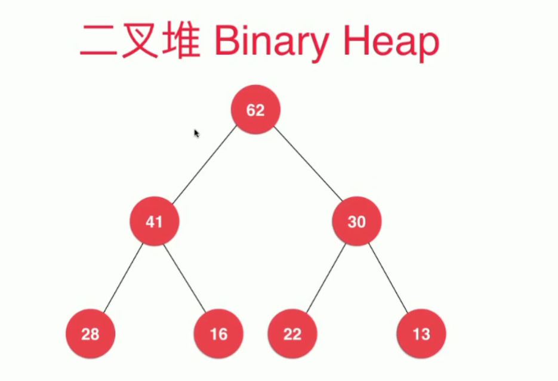

##### 二叉堆是一颗完全二叉树

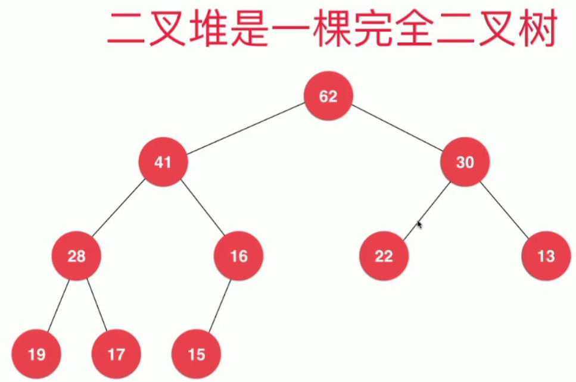

**什么是完全二叉树？**

不完全是满二叉树，但是树缺失的节点在右侧，也就是从左到右来存放我们的节点，就是完全二叉树。

**完全二叉树：把元素顺序排列成树的形状**

##### 满二叉树？

树同时有左孩子和右孩子并且不为空就说明这棵树为满二叉树	

##### 二叉堆的性质

+ 堆中的某个节点的值总是不大于其父节点的值【最大堆，相应的可以定义为最小堆】
+ 节点的大小和节点的层次没有关系，可能第二层的某些节点反而小于第三层节点

#### 二叉堆的实现

由上我们可以使用数组的方式来实现**最大堆**

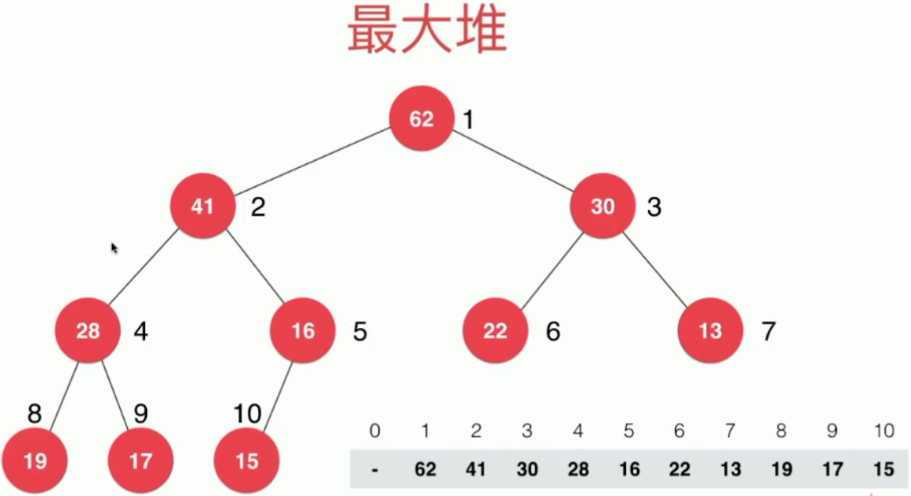

我们用数组的方式可以通过节点的索引来获取孩子们的节点的索引和父节点的索引

````java
parent(i) = i / 2;
left child(i) = 2*i;
right child(i) = 2*i + 1;
````

索引也可以从0开始，但是取父节点和左右子节点的公式会有所变化：


##### 代码实现

````java
public class MaxHeap<E extends Comparable<E>> {
    // 我们使用之前写过的动态数组来进行构建
    private Array<E> data;

    public MaxHeap(int capactiy) {
        data = new Array<>(capactiy);
    }

    public MaxHeap() {
        data = new Array<>();
    }
    // 返回对重元素个数
    public int size() {
        return data.getSize();
    }
    // 返回一个布尔值，表示堆中是否为空
    public boolean isEmpty() {
        return data.isEmpty();
    }
    // 返回完全二叉树的数组表示中，一个索引所表示元素的父节点的索引
    private int parent(int index) {
        if (index == 0) {
            throw new IllegalArgumentException("index-0 doesn't have parent.");
        }
        return (index - 1) / 2;
    }
    // 返回一个索引表示的元素的左孩子节点索引
    private int leftChild(int index) {
        return index*2 + 1;
    }
    // 返回一个索引表示的元素的右孩子节点索引
    private int rightChild(int index) {
        return index*2 + 2;
    }
}
````

##### 向堆中添加元素和Sift Up

通常添加节点直接添加到数组的最末就好了，但是新添加的元素可能会破坏堆的性质，所以我们要进行上浮操作


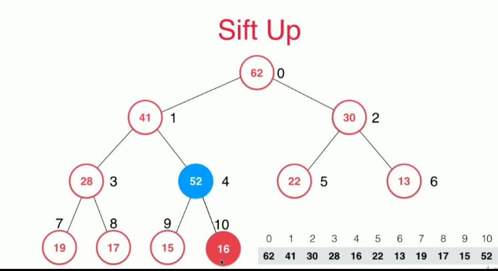

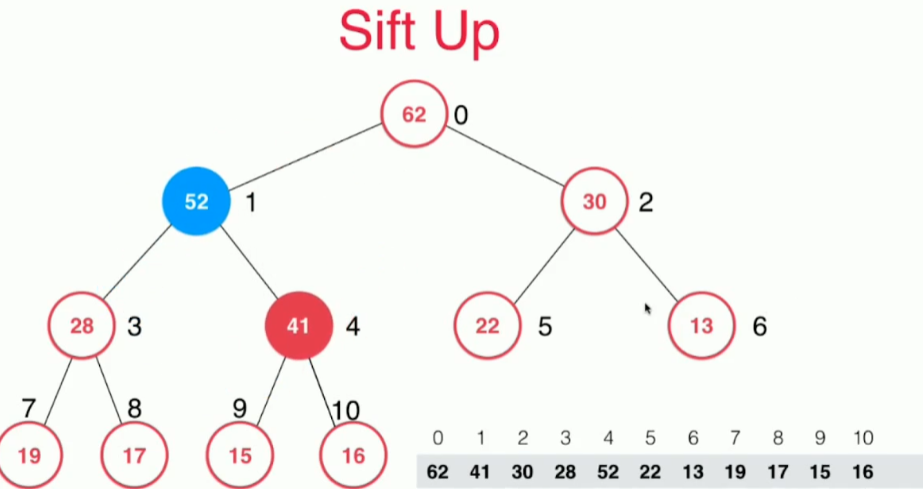

通过代码实现

````java
// 向堆中添加元素
public void add(E e) {
    data.addLast(e);
    // 让数组最后元素的索引元素上浮
    siftUp(data.getSize() - 1);
}
// 上浮
private void siftUp(int k) {
    // k索引大于0并且其父亲节点元素小于它
    while (k > 0 && data.get(parent(k)).compareTo(data.get(k)) < 0) {
        // 交换
        data.swap(k, parent(k));
        k = parent(k);
    }
}
````

Array#swap

````java
// 交换
public void swap(int i, int j) {
    if (i < 0 || i >= size || j < 0 || j >= size) {
        throw new IllegalArgumentException("不能交换，交换双方索引异常");
    }
    E t = data[i];
    data[i] = data[j];
    data[j] = t;
}
````

##### 取出堆中最大元素Sift Down

如果我们要向堆中取出元素只能取出最大的元素，即根节点的元素，那么我们需要把数组尾部数据放到根节点，为了不破坏堆的性质，我们需要下沉，即和孩子节点最大的元素比较，如果小于就交换。如下图

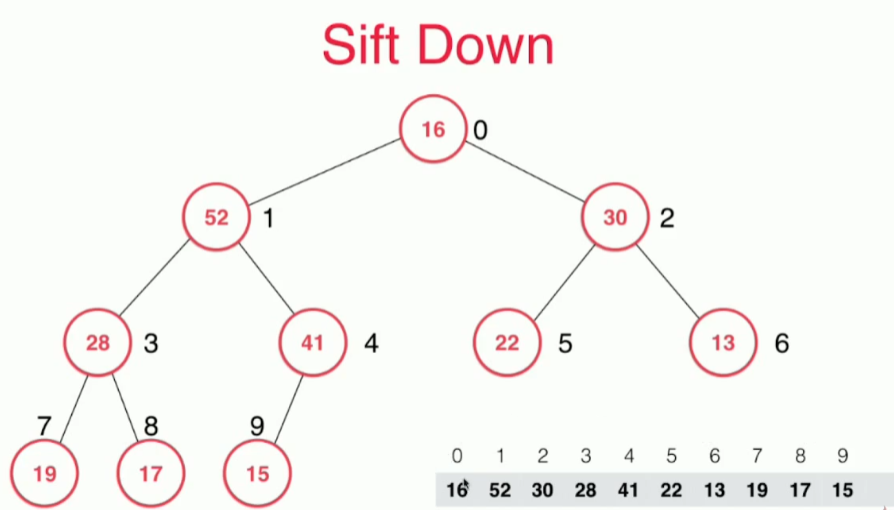

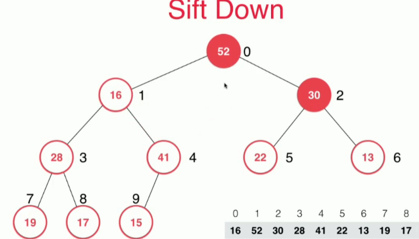

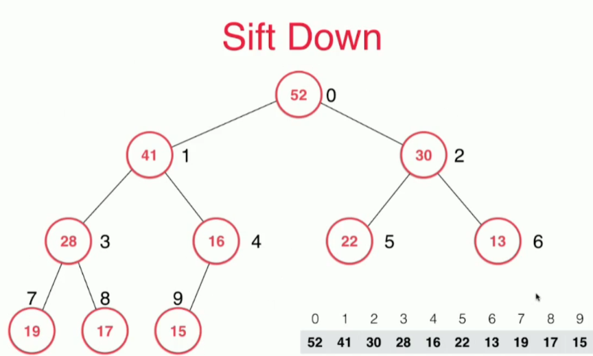

代码：

````java
// 看堆中的最大元素
public E findMax() {
    if (data.getSize() == 0) {
        throw new IllegalArgumentException("heap is Empty");
    }
    return data.get(0);
}
// 取出堆中最大元素
public E extractMax() {
    E ret = findMax();
    data.swap(0, data.getSize() - 1);
    data.removeLast();
    siftDown(0);
    return ret;
}
// 下沉
public void siftDown(int k) {
    // 左孩子越界，说明没有孩子了
    while (leftChild(k) < data.getSize()) {
        // 取出左孩子索引
        int j = leftChild(k);
        // 右孩子索引不能大于数组长度即存在右孩子，同时满足右孩子节点的数据大于左孩子节点
        if (j + 1 < data.getSize() && data.get(j + 1).compareTo(data.get(j)) > 0) {
            j = rightChild(k);
        }
        // 此时data[j] 是孩子中最大的
        // 如果k的值大于或等于孩子最大的，说明没有问题
        if (data.get(k).compareTo(data.get(j)) >= 0) {
            break;
        }
        data.swap(k, j);
        // 继续下沉
        k = j;
    }
}
````

测试：

````java
int n = 100000;
MaxHeap<Integer> maxHeap = new MaxHeap<>();
Random random = new Random();
for (int i = 0; i < n; i++) {
    maxHeap.add(random.nextInt(Integer.MAX_VALUE));
}
int[] arr = new int[n];
for (int i = 0; i < n; i++) {
    arr[i] = maxHeap.extractMax();
}

for (int i = 1; i < n; i++) {
    if (arr[i - 1] < arr[i]) {
        throw new IllegalArgumentException("Error");
    }
}
System.out.println("Test maxHeap completed");
````

**`add`和`extractMax`时间复杂度都是`O(logN)`**

#### 更多二分搜索树问题

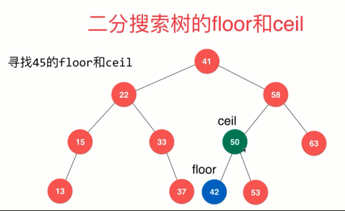

#### 基于堆的优先队列

`````java
public class PriorityQueue<E extends Comparable<E>> implements Queue<E> {
    // 使用堆来构造优先队列
    private MaxHeap<E> maxHeap;

    @Override
    public int getSize() {
        return maxHeap.size();
    }

    @Override
    public boolean isEmpty() {
        return maxHeap.isEmpty();
    }
    // 入队
    @Override
    public void enqueue(E e) {
        maxHeap.add(e);
    }
    // 出队
    @Override
    public E dequeue() {
        return maxHeap.extractMax();
    }
    // 查看队首
    @Override
    public E getFront() {
        return maxHeap.findMax();
    }
}
`````

####  优先队列的经典问题

##### **在1000000元素中选出前100名？**

在N个元素中选出前M个元素

排序？ NlogN

使用优先队列？NlogM

使用优先队列，维护当前看到的前M个元素

1. 使用最小堆[取出最小元素进行替换，如果元素大于最小元素]
2. 还是可以使用最大堆，我们可以使用元素最小优先级越高

##### 前K个高频元素

给定一个非空的整数数组，返回其中出现频率前k高的元素，例如，给定数组`[1, 1, 1, 2, 2, 3]`, `k=2` 返回`[1, 2]`

使用我们自定义的优先队列

````java
public class Solution2 {

    private static class Freq implements Comparable<Freq> {
        int e, freq;

        @Override
        public int compareTo(Freq o) {
            if (this.freq > o.freq) {
                return 1;
            } else if (this.freq < o.freq) {
                return -1;
            } else {
                return 0;
            }
        }

        public Freq(int e, int freq) {
            this.e = e;
            this.freq = freq;
        }
    }

    public List<Integer> topKFrequent(int[] nums, int k) {
        TreeMap<Integer, Integer> treeMap = new TreeMap<>();
        for (int i = 0; i < nums.length; i++) {
            if (treeMap.containsKey(nums[i])) {
                treeMap.put(nums[i], treeMap.get(nums[i]) + 1);
            } else {
                treeMap.put(nums[i], 0);
            }
        }
        // 使用队列
        PriorityQueue<Freq> priorityQueue = new PriorityQueue<>();
        for (int key: treeMap.keySet()) {
            if (priorityQueue.getSize() < k) {
                priorityQueue.enqueue(new Freq(key, treeMap.get(key)));
            } else if (treeMap.get(key) > priorityQueue.getFront().freq) {
                priorityQueue.dequeue();
                priorityQueue.enqueue(new Freq(key, treeMap.get(key)));
            }
            
        }
        List<Integer> res = new LinkedList<>();
        for (int i = 0; i < k; i++) {
            res.add(priorityQueue.dequeue().e);
        }
        System.out.println(res);
        return res;
    }

    public static void main(String[] args) {
        Freq freq = new Freq(1, 4);
        Freq freq2 = new Freq(3, 2);
        System.out.println(freq2.compareTo(freq));
    }
}
````

使用Java自带的优先队列

````java
public class Solution {

    private class Freq/* implements Comparable<Freq> */{
        int e, freq;
        public Freq(int e, int freq) {
            this.e = e;
            this.freq = freq;
        }
    }

    // 创建Freq类的比较器
    private class FreqCompator implements Comparator<Freq> {

        @Override
        public int compare(Freq a, Freq b) {
            return b.freq - a.freq;
            /*if (a.freq < b.freq) {
                return 1;
            } else if (a.freq > b.freq) {
                return -1;
            } else {
                return 0;
            }*/
        }
    }

    /**
     * 返回数组中元素出现频次最高的k个元素list
     * Ologn（K）的复杂度
     * @param nums
     * @param k
     * @return
     */
    public List<Integer> topKFrequent(int[] nums, int k) {
         TreeMap<Integer, Integer> map = new TreeMap<>();
         for (int num: nums) {
             if (map.containsKey(num)) {
                map.put(num, map.get(num) + 1);
             } else {
                map.put(num, 0);
             }
         }
         PriorityQueue<Freq> priorityQueue = new PriorityQueue<>(new FreqCompator());
         for (int key: map.keySet()) {
//             System.out.println(key + " " + map.get(key) + " peek: " + (!priorityQueue.isEmpty() ? priorityQueue.peek().freq : ""));
             /*if (priorityQueue.size() < k) {
                 priorityQueue.add(new Freq(key, map.get(key)));
             } else if (map.get(key) > priorityQueue.peek().freq){
                 priorityQueue.remove();
                 priorityQueue.add(new Freq(key, map.get(key)));
             }*/
             /*if (!priorityQueue.isEmpty()) {

             }*/
             priorityQueue.add(new Freq(key, map.get(key)));
         }
        // System.out.println(priorityQueue);
         List<Integer> res = new LinkedList<>();
         /*while (!priorityQueue.isEmpty()) {
             res.add(priorityQueue.remove().e);
         }*/
        for (int i = 0; i < k; i++) {
            res.add(priorityQueue.remove().e);
        }
         return res;
     }


    public List<Integer> topKFrequent2(int[] nums, int k) {
        TreeMap<Integer, Integer> map = new TreeMap<>();
        for (int num: nums) {
            if (map.containsKey(num)) {
                map.put(num, map.get(num) + 1);
            } else {
                map.put(num, 0);
            }
        }
        /*PriorityQueue<Integer> priorityQueue = new PriorityQueue<Integer>(new Comparator<Integer>() {
            @Override
            public int compare(Integer o1, Integer o2) {
                return map.get(o2) - map.get(o1);
            }
        });*/
        PriorityQueue<Integer> priorityQueue = new PriorityQueue<Integer>( (o1, o2) -> map.get(o2) - map.get(o1));
        for (int key: map.keySet()) {
//             System.out.println(key + " " + map.get(key) + " peek: " + (!priorityQueue.isEmpty() ? priorityQueue.peek().freq : ""));
             /*if (priorityQueue.size() < k) {
                 priorityQueue.add(new Freq(key, map.get(key)));
             } else if (map.get(key) > priorityQueue.peek().freq){
                 priorityQueue.remove();
                 priorityQueue.add(new Freq(key, map.get(key)));
             }*/
             /*if (!priorityQueue.isEmpty()) {

             }*/
            priorityQueue.add(key);
        }
        // System.out.println(priorityQueue);
        List<Integer> res = new LinkedList<>();
         /*while (!priorityQueue.isEmpty()) {
             res.add(priorityQueue.remove().e);
         }*/
        for (int i = 0; i < k; i++) {
            res.add(priorityQueue.remove());
        }
        return res;
    }

}
````

### 红黑树

#### 红黑树性质

1. 每个节点或者是红色的，或者是黑色的
2. 根节点是黑色的
3. 每一个叶子节点（最后的空节点）是黑色的
4. 如果一个节点是红色的，那么它的孩子节点都是黑色的
5. 从任意一个节点到叶子节点，经过的黑色节点是一样的

以上是《算法导论》里面的定义，那么看看《算法4》中的定义

##### 红黑树与2-3树的等价性

#### 2-3树

1. 满足二分搜索树的基本性质

2. 节点可以存放一个元素或者两个元素

   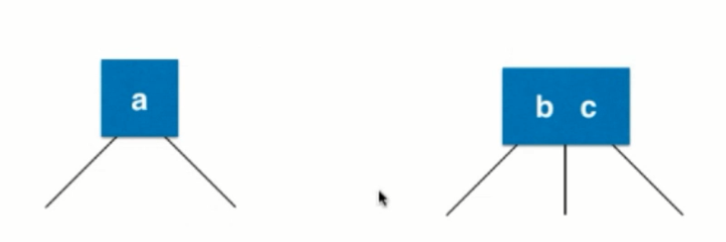

3. 所以2-3树可能如下图

   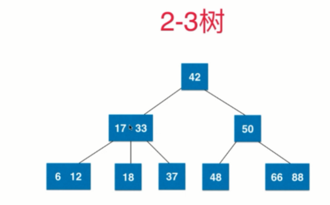

4. 2-3树是一颗绝对平衡的树【从根节点到任意一个叶子节点所经过的节点个数一样】

#####  2-3树是如何维持绝对的平衡

