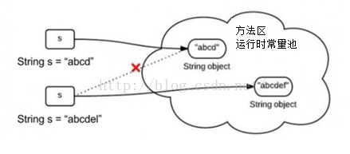
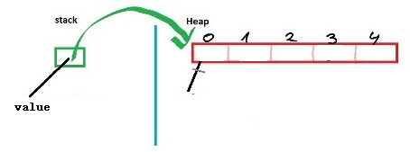
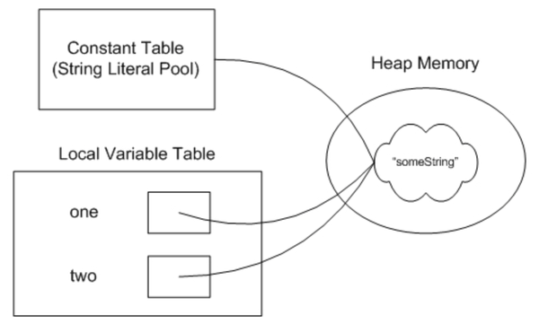
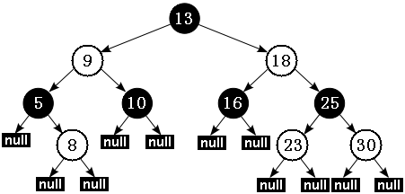

# 基础

## 1. String为什么要设计成Final

### 1. 什么是不可变？

String不可变很简单，如下图，给一个已有字符串"abcd"第二次赋值成"abcedl"，不是在原内存地址上修改数据，而是重新指向一个新对象，新地址。



### 2. String为什么不可变？

首先String类是用final关键字修饰，这说明String不可继承。再看下面，String类的主力成员字段value是个char[ ]数组，而且是用**final**修饰的。final修饰的字段创建以后就不可改变。

有的人以为故事就这样完了，其实没有。因为虽然value是不可变，也只是value这个引用地址不可变。挡不住**Array数组是可变的**事实。Array的数据结构看下图。




也就是说Array变量只是栈stack上的一个引用，数组的本体结构在heap堆。String类里的value用final修饰，只是说stack里的这个叫value的引用地址不可变。没有说堆里array本身数据不可变。看下面这个例子：

```java
final int[] value = {1,2,3}
int[] another = { 4,5,6};
value = another;    //编译器报错，final不可变
```

value用final修饰，编译器不允许我把value指向堆区另一个地址。但如果我直接对数组元素动手，分分钟搞定。

```java
final int[] value={1,2,3};
value[2]=100;  //这时候数组里已经是{1,2,100}
```

或者更粗暴的反射直接改，也是可以的。

```java
final int[] array={1,2,3};
Array.set(array,2,100); //数组也被改成{1,2,100}
```

所以String是不可变，**关键是**因为SUN公司的工程师，在后面所有String的方法里很小心的没有去动Array里的元素，没有暴露内部成员字段。

`private final char value[]`这一句里，private的私有访问权限的作用都比final大。而且设计师还很小心地把整个String设成final禁止继承，避免被其他人继承后破坏。所以**String是不可变的关键都在底层的实现，而不是一个final**。考验的是工程师构造数据类型，封装数据的功力。

### 3. 不可变有什么好处？

这个最简单的原因，就是为了**安全**。

#### 示例1

````java
public class 为什么String要设计成不可变类你 {
 
	public static void main(String[] args) {
 
		String a, b, c;
		a = "test";
		b = a;
		c = b;
		String processA = processA(a);
		String processB = processB(b);
		String processC = processC(c);
		System.out.println(processA);
		System.out.println(processB);
		System.out.println(processC);
	}
	
	static String processA(String str){
		return str + "A";
	}
	
	static String processB(String str){
		return str + "B";
	}
	
	static String processC(String str){
		return str + "C";
	}
 
}
//OUTPUT
// testA
//testB
//testC
````

当String支持非可变性的时候，它们的值很好确定，不管调用哪个方法，都互不影响。

如果String是可变的，就可能如下例，我们使用StringBuffer来模拟String是可变的

````java
package _12_01字符串;
 
public class 为什么String要设计成不可变类2 {
 
	public static void main(String[] args) {
 
		StringBuffer a, b, c;
		a = new StringBuffer("test");
		b = a;
		c = b;
		String processA = processA(a);
		String processB = processB(b);
		String processC = processC(c);
		System.out.println(processA);
		System.out.println(processB);
		System.out.println(processC);
	}
	
	static String processA(StringBuffer str){
		return str.append("A").toString();
	}
	
	static String processB(StringBuffer str){
		return str.append("B").toString();
	}
	
	static String processC(StringBuffer str){
		return str.append("C").toString();
	}
 
}
//OUTPUT
// testA
//testAB
//testABC
````

#### 示例2

再看下面这个**HashSet**用StringBuilder做元素的场景，问题就更严重了，而且更隐蔽。

````java
class Test{
    public static void main(String[] args){
        HashSet<StringBuilder> hs=new HashSet<StringBuilder>();
        StringBuilder sb1=new StringBuilder("aaa");
        StringBuilder sb2=new StringBuilder("aaabbb");
        hs.add(sb1);
        hs.add(sb2);    //这时候HashSet里是{"aaa","aaabbb"}
 
        StringBuilder sb3=sb1;
        sb3.append("bbb");  //这时候HashSet里是{"aaabbb","aaabbb"}
        System.out.println(hs);
    }
}
//Output:
//[aaabbb, aaabbb]
````

StringBuilder型变量sb1和sb2分别指向了堆内的字面量"aaa"和"aaabbb"。把他们都插入一个HashSet。到这一步没问题。但如果后面我把变量sb3也指向sb1的地址，再改变sb3的值，因为StringBuilder没有不可变性的保护，sb3直接在原先"aaa"的地址上改。导致sb1的值也变了。这时候，HashSet上就出现了两个相等的键值"aaabbb"。**破坏了HashSet键值的唯一性，所以千万不要用可变类型做HashMap和HashSet键值。**

### 4. 不可变性支持线程安全

还有一个大家都知道，就是在并发场景下，多个线程同时读一个资源，是不会引发竟态条件的。只有对资源做写操作才有危险。不可变对象不能被写，所以线程安全。

### 5. 不可变性支持字符串常量池

**最后别忘了String字符串常量池的属性。像下面这样字符串one和two都用字面量something赋值。它们其实都指向同一个内存地址。**

````java
String one = "someString";
String two = "someString";
````



这样在大量使用字符串的情况下，可以节省内存空间，提高效率。但之所以能实现这个特性，String的不可变性是最基本的一个必要条件。要是内存里字符串内容能改来改去，这么做就完全没有意义了。

## 2. `String StringBuffer`和`StringBulider`的区别

`String`的值是不可变的，这就导致每次对String的操作都会生成**新的String对象**，这样不仅效率低下，而且大量浪费有限的内存空间。和`String`类不同的是，`StringBuffer`和`StringBuilder`类的对象能够被多次的修改，它们均是可变的字符串，并且**不产生新的未使用对象**。

**它们底层也是`char[] value;`数组形式，在操作一定大小的字符串，它们的性能是一样的，超过这个大小就是`StringBuilder`效率高点，因为它是线程不安全的。**

## 3. 你能给我写一个`final`对象吗

## 4. 重写hashcode()方法

### 1. **equals方法**

Object类中默认的实现方式是  :  `return this == obj`。那就是说，只有this和obj引用同一个对象，才会返回true。

而我们往往需要用equals来判断2个对象是否等价，而非验证他们的唯一性。这样我们在实现自己的类时，就要重写equals。因为我们需要利用对象里面的值来判断是否相等，则重载equal方法。

### 2. 为什么要重写hashCode()方法？

一般的地方不需要重载hashCode，只有当类需要放在`HashTable`、`HashMap`、`HashSet`等等`hash`结构的集合时才会重载hashCode，那么为什么要重载hashCode呢？

如果你重写了equals，比如说是基于对象的内容实现的，而保留hashCode的实现不变，那么很可能某两个对象明明是**“相等”**，而hashCode却不一样。

**这样，当你用其中的一个作为键保存到hashMap、hashTable或hashSet中，再以“相等的”找另一个作为键值去查找他们的时候，则根本找不到。**

### 3. 为什么equals()相等，hashCode就一定要相等，而hashCode相等，却不要求equals相等?

1. 因为是按照hashCode来访问小内存块，所以hashCode必须相等。
2. HashMap获取一个对象是比较key的hashCode相等和equal为true。

之所以hashCode相等，却可以equal不等，就比如ObjectA和ObjectB他们都有属性name，那么hashCode都以name计算，所以hashCode一样，但是两个对象属于不同类型，所以equal为false。

### 4. 为什么需要hashCode?

1. 通过hashCode可以很快的查到小内存块。 
2. 通过hashCode比较比equal方法快，当get时先比较hashCode，如果hashCode不同，直接返回false。

## 5. Java序列化

老是听说序列化反序列化，就是不知道到底什么是序列化，什么是反序列化？今天就在网上搜索学习一下，这一搜不要紧，发现自己曾经用过，竟然不知道那就是JDK类库中序列化和反序列化的API。

### 上面是序列化？

1. java序列化是指把java对象转换为字节序列的过程，而java反序列化是指把字节序列恢复为java对象的过程
2. 序列化：对象序列化的最主要的用处就是在传递和保存对象的时候，保证对象的完整性和可传递性。序列化是把对象转换成有序字节流，以便在网络上传输或者保存在本地文件中。序列化后的字节流保存的java对象的状态以及相关的描述信息。**序列化机制的核心作用就是对象状态的保存与重建**。
3. 反序列化：客户端从文件中或网络上获得序列化后的对象字节流后，根据字节流中所保存的对象状态及描述信息，通过反序列化重建对象。
4. 序列化就是把实体对象状态按照一定的格式写入到有序字节流，反序列化就是从有序字节流重建对象，恢复对象状态

### 为什么需要序列化与反序列化

当两个进程进行远程通信时，可以相互发送各种类型的数据，包括文本，图片，音频，视频等，而这些数据都会以二进制的形式在网络上传送。

当两个java进行进行通信时，要传送对象，怎么传对象，通过序列化与反序列化。

也就是说，发送方需要把对象转换为字节序列，然后在网络上传送，另一方面，接收方需要从字节序列中恢复出java对象。

### 序列化的好处

1. 永久性保存对象，保存对象的字节序列到本地文件或者数据库中，实现了数据的持久化，通过序列化可以把数据永久的保存到硬盘上。
2. 利用序列化实现远程通信，可以在网络上传送对象的字节序列。
3. 在进程间传递对象

###  序列化算法步骤

1. 把对象实例相关的类元数据输出
2. 递归输出类的超类描述直到不再有超类
3. 类元数据完了以后，开始从继承的超类开始输出对象实例的实际数据值。
4. 从上至下递归输出实例的数据

### Java 如何实现序列化和反序列化

1. JDK类库中序列化API

   `java.io.ObjectOutputStream`: 表示输出对象流

   它的`writeObject(Object obj)`方法可以对参数指定的obj对象进行序列化，把得到的字节序列写到一个目标输出流中。

   `java.io.ObjectInputStream`：表示对象输入流

   它的readObject()方法源输入流中读取字节序列，再把它们反序列化成为一个对象，并将其返回。

2. 实现序列化的要求

   只有实现了`Serializable`或`Externalizable`接口的对象才能被序列化，否则抛出异常！

3. 实现java对象序列化与反序列化的方法

   例如有一个a类，它的对象需要序列化，有3种方法

   如果类a仅仅实现了Serializable接口，则：

   `ObjectOutputStream`采用默认的序列化方式，对a对象的非transient实例变量进行序列化

   `ObjectInputStream`采用默认的反序列化方式，对a对象的非transient实例变量进行反序列化

   如果类a仅仅实现了Serializable接口，并且还定义了a对象的`writeObject(ObjectOutputStream out)`和`readObject(ObjectInputStream in)`，则`ObjectOutputStream`调用a对象的`writeObject(ObjectOutputStream out)`的方法进行序列化

   `ObjectInputStream`调用a对象的`readObject(ObjectInputStream in)`的方法进行反序列化

   如果a类实现了`ExternaInalizable`接口，且User类必须实现`readExternam(ObjectInput in)`和`wiriteExternal(ObjectOutput out)`方法，则

   `ObjectOutputStream`调用a对象的`wiriteExternal(ObjectOutput out)`的方法进行序列化

   `ObjectInputStream`调用a对象的`readExternam(ObjectInput in)`的方法进行序列化‘’

### JDK类库中序列化的步骤

1. 创建一个对象输出流，它可以包装一个奇特类型的目标输出流，如文件输出流：

   ```java
   ObjectOutputStream oos = new ObjectOutputStream(new FileOutStream(c:\\object.out));
   ```

2. 通过对象输出流writeObject()方法写对象：

   ```java
   oos.writeObject(new a("xiaoxiao","145263","female"));
   ```

### JDK类库中反序列化的步骤

1. 创建一个对象输入流，它可以包装一个其他类型输入流，如文件输入流：

   ````java
   objectInputStream ois=new ObjectInputStream(new FileInputStream("object.out"));
   ````

   

2. 通过对象输出流的readObject()方法读取对象：

   ```java
   a aa=(a)ois.readObject();
   ```

   

3. 为了正确读数据，完成反序列化，必须保证向对象输出流写对象的顺序与从对象输入流中读对象的顺序一致

## 6. 你能给我写个单例模式吗？你这个如果要是被反射或者序列化破坏单例该怎么办？

### 1. 懒汉模式

```java
/**
 * 懒汉模式
 * 在第一次调用的时候才创建
 */
public class SingletonExample1 {
    // 私有构造函数
    private SingletonExample1(){}
    // 单例对象
    private static SingletonExample1 instance = null;
    // 静态的工厂方法
    public static SingletonExample1 getInstance() {
        if (instance == null) {
            instance = new SingletonExample1();
        }
        return instance;
    }
}
```

**以上的单例模式是线程不安全的，显而易见**

### 2. 饿汉模式

````java
/**
 * 饿汉模式
 * 在类加载的时候创建
 */
public class SingletonExample2 {
    // 私有构造函数
    private SingletonExample2(){}
    // 单例对象
    private static SingletonExample2 instance = new SingletonExample2();
    // 静态的工厂方法
    public static SingletonExample2 getInstance() {
        return instance;
    }
}
````

**饿汉模式是线程安全的，因为Java类加载的时候是天然线程安全的，但是如果构造方法中存在过多的处理，会导致类加载很慢，引起性能问题，如果加载后没有调用会造成资源的浪费。**

也可以通过静态代码块初始化对象

````java
static {
    instance = new SingletonExample2();
}
````

那么懒汉模式也可以线程安全么？

增加`synchronized`关键字

```java
public static synchronized SingletonExample1 getInstance() {
    if (instance == null) {
        instance = new SingletonExample1();
    }
    return instance;
}
```

线程安全，但是这种写法并不推荐，加了关键字通过同一时刻只能允许一个线程创建对象，但是会造成性能的开销。

### 3. 双重检查锁定

那么将`synchronized`下沉到类中，双重检查锁定：

````java
public static synchronized SingletonExample1 getInstance() {
    if (instance == null) {
        synchronized (SingletonExample1.class) { // 同步锁
            if (instance == null) {
                instance = new SingletonExample1();
            }
        }
    }
    return instance;
}
````

````java
双重同步锁单例模式，但是依旧不是线程安全的
instance = new SingletonExample1();
// 1.memory = allocate() 分配对象的内存空间
// 2.ctorInstance() 初始化对象
// 3.instance = memory 设置instance指向刚分配的内存
但是在多线程会发生指令重拍，2,3操作重排后，会存在对象还没有初始化就返回回去了
````

那么有什么方法呢?

````java
private volatile static SingletonExample3 instance = null;
````

`volatile` + 双重检测机制来禁止指令重排序。

对于单例模式还有其他方法么？

### 4. 枚举

````java
public class SingletonExample4 {
    
    private SingletonExample4(){}
    
    private volatile static SingletonExample4 instance = null;
    
    public static synchronized SingletonExample4 getInstance() {
        return Singleton.INSTANCE.getInstance();
    }

    private enum Singleton {
        INSTANCE;
        
        private SingletonExample4 singleton;
        // JVM保证这个方法只调用一次
        Singleton() {
            singleton = new SingletonExample4();
        }
        
        public SingletonExample4 getInstance() {
            return singleton;
        }
    }
}
````

使用枚举方法是天然的线程安全，同时又是延迟加载。

### 5. 静态内部类

相比于懒汉以及饿汉模式，静态内部类模式（一般也被称为 Holder）是许多人推荐的一种单例的实现方式，因为相比懒汉模式，它用更少的代码量达到了延迟加载的目的。

顾名思义，这种模式使用了一个私有的静态内部类，来存储外部类的单例，这种静态内部类，一般称为 Holder。

而利用静态内部类的特性，外部类的 getinstance() 方法，可以直接指向 Holder 持有的对象。

```java
public class SingletonExample5 {

    private SingletonExample5(){}

    private volatile static SingletonExample5 instance = null;

    public static synchronized SingletonExample5 getInstance() {
        return SingtonHolder.instance;
    }
    // 静态内部类
    private static class SingtonHolder {
        private static SingletonExample5 instance = new SingletonExample5();
    }
}
```

分析：在调用的时候才去初始化静态内部类，因为Java类的加载是一个天然的线程安全的过程，所以这个intance对象是线程安全的。

### 6. 单例模式的破坏

#### 1. 序列化和反序列化

````java
public class SingletonExample2 implements Serializable {

    private SingletonExample2(){}

    private static SingletonExample2 instance = new SingletonExample2();

    public static SingletonExample2 getInstance() {
        return instance;
    }

    public static void main(String[] args) throws IOException, ClassNotFoundException {
        SingletonExample2 instance =
                SingletonExample2.getInstance();
        ObjectOutputStream oos =
                new ObjectOutputStream(new FileOutputStream("E:\\ceshi.txt"));
        oos.writeObject(instance);

        File file = new File("E:\\ceshi.txt");
        ObjectInputStream ois =
                new ObjectInputStream(new FileInputStream(file));
        SingletonExample2 newInstance = (SingletonExample2) ois.readObject();

        System.out.println(instance == newInstance);
    }
}
````

```
false
```

解决方法：

在代码中加入一个方法

```java
public Object readResolve() {
   return instance;
}
```

为什么会这样？让我们查看源码

```java
oos.writeObject(instance);
```

```java
Object obj = readObject0(false);
```

```java
case TC_OBJECT:
	return checkResolve(readOrdinaryObject(unshared));
```

```java
try {
    obj = desc.isInstantiable() ? desc.newInstance() : null;
} catch (Exception ex) {
    throw (IOException) new InvalidClassException(
        desc.forClass().getName(),
        "unable to create instance").initCause(ex);
}
```

```java
/**
     * Returns true if represented class is serializable/externalizable and can
     * be instantiated by the serialization runtime--i.e., if it is
     * externalizable and defines a public no-arg constructor, or if it is
     * non-externalizable and its first non-serializable superclass defines an
     * accessible no-arg constructor.  Otherwise, returns false.
     */
// 简单来说就是类被序列化后，会返回true
boolean isInstantiable() {
    requireInitialized();
    return (cons != null);
}
```

```java
所以在上一步就会desc.newInstance() 返回 不着急还有下面代码
```

```java
if (obj != null &&
            handles.lookupException(passHandle) == null &&
            desc.hasReadResolveMethod())
        {
            Object rep = desc.invokeReadResolve(obj);
            if (unshared && rep.getClass().isArray()) {
                rep = cloneArray(rep);
            }
            if (rep != obj) {
                // Filter the replacement object
                if (rep != null) {
                    if (rep.getClass().isArray()) {
                        filterCheck(rep.getClass(), Array.getLength(rep));
                    } else {
                        filterCheck(rep.getClass(), -1);
                    }
                }
                handles.setObject(passHandle, obj = rep);
            }
        }
```

```java
看判断条件如果desc.hasReadResolveMethod()为true 就会执行这个方法，所以会在原来的类里面添加readResolve()方法
```

#### 2. 反射破坏

````java
SingletonExample2 instance = SingletonExample2.getInstance();
Class clazz = SingletonExample2.class;
Constructor constructor = clazz.getDeclaredConstructor();
constructor.setAccessible(true); // 获取private权限
SingletonExample2 newInstance = (SingletonExample2) constructor.newInstance();
System.out.println(instance == newInstance);
````

```java
false
```

解决方法：

在构造函数加入判断

```java
private SingletonExample2() {
    if (instance != null) {
        throw new RuntimeException("单例类禁止反射调用");
    }
}
```

````java
Exception in thread "main" java.lang.reflect.InvocationTargetException
  at sun.reflect.NativeConstructorAccessorImpl.newInstance0(Native Method)
  at sun.reflect.NativeConstructorAccessorImpl.newInstance(NativeConstructorAccessorImpl.java:62)
  at sun.reflect.DelegatingConstructorAccessorImpl.newInstance(DelegatingConstructorAccessorImpl.java:45)
  at java.lang.reflect.Constructor.newInstance(Constructor.java:423)
  at com.dev.devinspringboot.concurrency.singleton.SingletonExample2.main(SingletonExample2.java:46)
Caused by: java.lang.RuntimeException: 单例类禁止反射调用
  at com.dev.devinspringboot.concurrency.singleton.SingletonExample2.<init>(SingletonExample2.java:15)
  ... 5 more
````

**在使用反射的时候newInstance的时候一定会调用构造方法，所以加上判断就好了，那么还有那种单例方法能使用呢**

静态内部类方式：

```java
public class SingletonExample5 {

    private SingletonExample5(){}

    private volatile static SingletonExample5 instance = null;

    public static synchronized SingletonExample5 getInstance() {
        return SingtonHolder.instance;
    }
    // 静态内部类
    private static class SingtonHolder {
        private static SingletonExample5 instance = new SingletonExample5();
    }

    public static void main(String[] args) throws Exception {
        SingletonExample5 instance =
                SingletonExample5.getInstance();
        Class clazz = SingletonExample5.class;
        Constructor constructor = clazz.getDeclaredConstructor();
        constructor.setAccessible(true); // 获取private权限
        SingletonExample5 newInstance = (SingletonExample5) constructor.newInstance();
        System.out.println(instance == newInstance);
    }
}
```

```java
false
```


照例在构造方法加入判断

```java
private SingletonExample5() {
    if (SingtonHolder.instance != null) {
        throw new RuntimeException("单例类禁止反射调用");
    }
}

```

```java
Caused by: java.lang.RuntimeException: 单例类禁止反射调用
```


使用懒汉模式测试

```
public class SingletonExample1 {
    // 私有构造函数
    private SingletonExample1(){
        if (instance != null) {
            throw new RuntimeException("单例模式禁止调用反射");
        }
    }
    // 单例对象
    private static SingletonExample1 instance = null;
    // 静态的工厂方法
    public static synchronized SingletonExample1 getInstance() {
        if (instance == null) {
            instance = new SingletonExample1();
        }
        return instance;
    }

    public static void main(String[] args) throws NoSuchMethodException, IllegalAccessException, InvocationTargetException, InstantiationException {
        SingletonExample1 instance =
                SingletonExample1.getInstance();
        Class clazz = SingletonExample1.class;
        Constructor constructor = clazz.getDeclaredConstructor();
        constructor.setAccessible(true); // 获取private权限
        SingletonExample1 newInstance = (SingletonExample1) constructor.newInstance();
        System.out.println(instance == newInstance);
    }
}
```

````java
Caused by: java.lang.RuntimeException: 单例模式禁止调用反射
````

如果调换反射的懒加载的顺序呢

````java
Class clazz = SingletonExample1.class;
Constructor constructor = clazz.getDeclaredConstructor();
constructor.setAccessible(true); // 获取private权限
SingletonExample1 newInstance = (SingletonExample1) constructor.newInstance();
SingletonExample1 instance =
    SingletonExample1.getInstance();
System.out.println(instance == newInstance);
````

````java
false
````

先由反射生成对象，然后再由懒加载方式生成对象就不会报错，怎么会这样？结论是懒加载的模式反射调用是可以的，无法避免的，如果加入一个变量来控制呢？

````java
private static boolean flag = true;
// 私有构造函数
private SingletonExample1(){
    if (flag) {
        flag = false;
    } else {
        throw new RuntimeException("单例模式禁止调用反射");
    }
}
````

这样的话虽然可以避免反射攻击，但是反射也可以操作flag变量，所以还是不行的，比如：

````java
Class clazz = SingletonExample1.class;
Constructor constructor = clazz.getDeclaredConstructor();
constructor.setAccessible(true); // 获取private权限
SingletonExample1 newInstance = (SingletonExample1) constructor.newInstance();
// 反射修改私有变量的值
Field flag = newInstance.getClass().getDeclaredField("flag");
flag.setAccessible(true);
flag.set(newInstance, true);
SingletonExample1 instance =
    SingletonExample1.getInstance();
System.out.println(instance == newInstance);
````

**结果证明使用上面枚举的方式和静态内部类的方式，无论是先反射再实例或者先实例化再反射都是可以避免反射对单例的破坏的。**

## 7. Vector为什么是线程安全的

虽然源代码注释里面说这个是线程安全的，因为确实很多方法都加上了同步关键字synchronized，但是对于符合操作而言，只是同步方法并没有解决线程安全的问题。

要真正达成线程安全，还需要以vector对象为锁，来进行操作。

所以，如果是这样的话，那么用vector和ArrayList就没有区别了，所以，不推荐使用vector。

**Vector在某些情况下也有不安全的情况**

````java
import java.util.Vector;

public class VectorExample2 {
    private static Vector<Integer> vector = new Vector<>();

    public static void main(String[] args) {
        while (true) {
            for (int i = 0; i < 10; i++) {
                vector.add(i);
            }
            Thread t1 = new Thread(() -> {
                for (int i = 0; i < vector.size(); i++) {
                    vector.remove(i);
                }
            });

            Thread t2 = new Thread(() -> {
                for (int i = 0; i < vector.size(); i++) {
                    vector.get(i);
                }
            });

            t1.start();
            t2.start();
        }
    }
}
````

````java
Exception in thread "Thread-7722" java.lang.ArrayIndexOutOfBoundsException: Array index out of range: 0
	at java.util.Vector.remove(Vector.java:831)
	at com.dev.devinspringboot.Threads.sysContainer.VectorExample2.lambda$main$0(VectorExample2.java:15)
	at java.lang.Thread.run(Thread.java:748)
````

**为什么Vector会出现异常呢？**

某个时刻执行`vector.get(i);` 而另一个线程调用`vector.remove(i);`移除了所以越界，这个方法演示了**两个同步方法因为操作顺序的差异导致线程不安全的问题**，所以我们需要在外面同步才行。

## 8. `class.forName()`和`classLoader`的区别

Java中`class.forName()`和`classLoader`都可用来对类进行加载。

1. `class.forName()`除了将类的.class文件加载到jvm中之外，还会对类进行解释，执行类中的static块，还会执行给静态变量赋值的静态方法。
2. classLoader只干一件事情，就是将.class文件加载到jvm中，不会执行static中的内容,只有在newInstance才会去执行static块。

类的生命周期：

1. 加载

   将.class文件从磁盘读到内存

2. 连接

   1. 验证

      验证字节码文件的正确性

   2. 准备

      给类的静态变量分配内存，并赋予默认值

   3. 解析

      类装载器装入类所引用的其它所有类

3. 初始化

   为类的静态变量赋予正确的初始值，上述的准备阶段为静态变量赋予的是虚拟机默认的初始值，此处赋予的才是程序编写者为变量分配的真正的初始值，执行静态代码块

4. 使用

5. 卸载

## 9. interface里面接口用什么进行修饰

当我给接口添加final修饰符时显示错误信息

````java
Illegal modifier for the interface InterfaceTest; only public & abstract are permitted
````

即接口只能被public，abstract修饰符修饰，接口被设计的目的主要就是为了被继承，final修饰类却是表明该类不能被继承，所以用final修饰接口是无意义的。

给接口内的方法添加final修饰符时显示错误信息

````java
Illegal modifier for the interface method fun; only public, abstract, default, static and strictfp are permitted
````

即只有public, abstract, default, static and strictfp修饰符可以修饰方法

## 10. TreeSet的底层原理

TreeSet 底层实际使用的存储容器就是 TreeMap。

与 HashSet 完全类似的是，TreeSet 里绝大部分方法都是直接调用 TreeMap 的方法来实现的。

对于 TreeMap 而言，它采用一种被称为“红黑树”的排序二叉树来保存 Map 中每个 Entry —— 每个 Entry 都被当成“红黑树”的一个节点对待。

## 11. 接口和抽象类的区别

1. 抽象类要被子类继承，接口要被类实现。
2. 接口只能做方法声明，抽象类中可以作方法声明，也可以做方法实现。
3. 接口里定义的变量只能是公共的静态的常量，抽象类中的变量是普通变量。
4. 接口是设计的结果，抽象类是重构的结果。
5. 抽象类和接口都是用来抽象具体对象的，但是接口的抽象级别最高。
6. 抽象类可以有具体的方法和属性，接口只能有抽象方法和不可变常量。
7. 抽象类主要用来抽象类别，接口主要用来抽象功能。

## 12. 红黑树

+ 性质 1：每个节点要么是红色，要么是黑色。
+ 性质 2：根节点永远是黑色的。
+ 性质 3：所有的叶节点都是空节点（即 null），并且是黑色的。
+ 性质 4：每个红色节点的两个子节点都是黑色。（从每个叶子到根的路径上不会有两个连续的红色节点）
+ 性质 5：从任一节点到其子树中每个叶子节点的路径都包含相同数量的黑色节点。



根据性质 5：红黑树从根节点到每个叶子节点的路径都包含相同数量的黑色节点，因此从根节点到叶子节点的路径中包含的黑色节点数被称为树的“黑色高度（black-height）”。

性质 4 则保证了从根节点到叶子节点的最长路径的长度不会超过任何其他路径的两倍。假如有一棵黑色高度为 3 的红黑树：从根节点到叶节点的最短路径长度是 2，该路径上全是黑色节点（黑节点 - 黑节点 - 黑节点）。最长路径也只可能为 4，在每个黑色节点之间插入一个红色节点（黑节点 - 红节点 - 黑节点 - 红节点 - 黑节点），性质 4 保证绝不可能插入更多的红色节点。由此可见，红黑树中最长路径就是一条红黑交替的路径。

### 平衡二叉树

左子树和右子树的高度最多相差1

### 完全二叉树

### 二叉树的遍历

1. 前序遍历：先访问根节点——左子树——右子树。

2. 中序遍历：先访问左子树——根节点——右子树，按照这个顺序。

3. 后序遍历：和前面差不多，先访问树的左子树——右子树——根节点。
4. 层序遍历：把一棵树从上到下，从左到右依次写出来。

## 13.**Minor GC ，Full GC 触发条件**

Minor GC触发条件：当**Eden区**满时，触发Minor GC。

Full GC触发条件：

1. 调用System.gc()时，系统**建议**执行Full GC，但是不必然执行。
2. 老年代空间不足
3. 方法区空间不足
4. 通过Minor GC后进入老年代的平均大小大于老年代的可用内存
5. 由Eden区、From Space区向To Space区复制时，对象大小大于To Space可用内存，则把该对象转存到老年代，且老年代的可用内存小于该对象大小